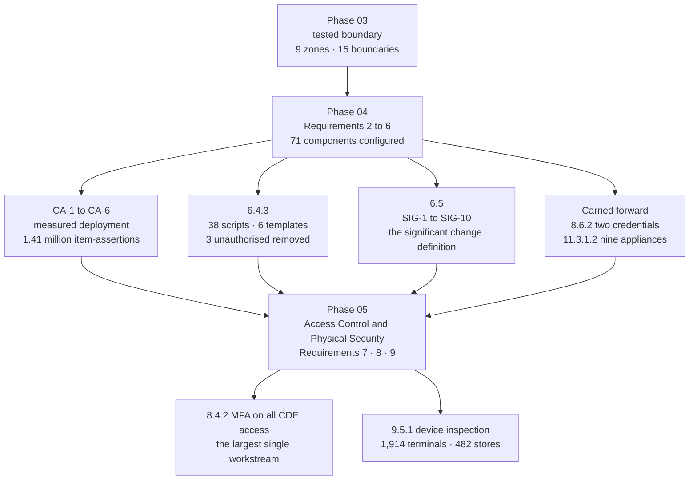

# 04.13 — Phase Summary &amp; Transition

| Field | Value |
|---|---|
| Document ID | MRG-PCI-2026-413 |
| Program | Marketa Retail Group — PCI DSS v4.0.1 Compliance Program |
| Phase | 04 — Build &amp; Maintain Secure Systems |
| Version | 1.0 |
| Status | Approved |
| Owner | Naomi Bhatt, Chief Information Security Officer |
| Approver | Raymond Voss, Chief Financial Officer |
| Date | 2026-07-15 |
| Classification | Confidential — Cardholder Data Environment // Illustrative Portfolio Sample |

## Purpose

The close of Phase 04. What the phase committed to, what it delivered, what it found, what it did about what it found, and what Phase 05 inherits.

Phase 03 handed over a **tested boundary** and an instruction: configure the systems inside it, and do not invent a second assurance pattern when the estate already has one that works. Phase 04's job was Requirements **2, 3, 4, 5 and 6** across the **71 assessed system components**, and the single hardest requirement in the standard for a merchant of this shape — **6.4.3**, the management of every script executing in a consumer's browser on a payment page.

The phase delivered all five requirement families. It also found three unauthorised scripts running on all six of Marketa's payment templates, a Z1 host rebuilt from a stale image, three vendor default credentials reintroduced by firmware, seven test accounts in production, two vault custodians who had changed role and still held key shares, and a database audit configuration that a major version upgrade silently discarded.

**Every one of those was found by a control this phase built.** That is the phase's actual output. The requirement coverage is the by-product.

## 1. What Phase 04 Committed To

Eight commitments came into this phase — five from Phase 03's handover, two from Phase 02's open items, and one from the programme charter.

| # | Commitment | Source | Status |
|---|---|---|---|
| **1** | Implement Requirements **2, 3, 4, 5 and 6** in full across the 71 assessed components | Charter; 306 applicable sub-requirements | **Delivered.** 04.01 to 04.11 |
| **2** | Extend the **DA-1 to DA-6** drift pattern to configuration rather than invent a second assurance model | 03.13 §7.1 | **Delivered.** **CA-1 to CA-6**, measured in 04.11 |
| **3** | Deliver the **three PAN-03 preventive controls** Phase 02 committed to Phase 04 | 02.03 | **Delivered.** Pattern-based redaction and the production log-level guardrail in 04.07 §8; the temporary-change closure verification in 04.08 §3.2 |
| **4** | **OI-02-04** — the 6.4.3 script authorisation workflow and integrity assurance mechanism live | 02.12 | **Delivered** for the 6.4.3 limbs — 04.10. **The 11.6.1 limb transfers to Phase 06**, live August 2026, carried as OI-04-01 |
| **5** | **OI-02-05** — tag manager removal from all six payment templates confirmed by field telemetry, not by console setting | 02.12 | **Closed.** Removed 2026-03-11; absence confirmed by Content Security Policy field telemetry from real consumer sessions, and by the CSP now denying the container origin |
| **6** | **OI-03-02** — CT-49 workflow enforcement so an SSID switching-mode change cannot be applied before its scope-delta review | 03.13 | **Partially delivered.** **SIG-4** raises the classification and the obligation in process today; the technical enforcement in CT-49 is scheduled 2026-09-15 and carries forward as **OI-04-02** |
| **7** | Plan around constraint **CON-03** rather than around its removal | 03.13 §7.2 | **Delivered.** The nine appliances appear in every relevant document as an accommodation, never as a treatment, and the resulting **11.3.1.2** gap is stated as a Not in Place finding rather than argued away |
| **8** | Define what constitutes a **significant change** | 01.11 §6, analysis 14; 12.5.2 | **Delivered.** **SIG-1 to SIG-10** in 04.08 §4, each with a named downstream obligation |

## 2. What the Phase Delivered

### 2.1 Deliverables register

| Doc | Title | Owner | What it establishes |
|---|---|---|---|
| **04.01** | Secure Configuration Standards | Trevor Kim | Requirement 2. Six baselines, **SCS-01 to SCS-11**, **CA-1 to CA-6**, four dated exceptions. **A default is not a decision** |
| **04.02** | Protect Stored Account Data | Elena Marchetti | Requirement 3. Where account data actually is; 3.4.1 masking; **3.4.2** copy prevention on remote access; what "we store no PAN" does and does not excuse |
| **04.03** | Cryptographic Key Management | Trevor Kim | 3.6 and 3.7. **K-01 to K-10**, seven custodians, split knowledge and dual control, and the custodian register that was accurate only on the day it was written |
| **04.04** | Transmission Security | Trevor Kim | Requirement 4. Protocol and cipher standards; the **4.2.1.1** trusted keys and certificates inventory; the end-user messaging position |
| **04.05** | Anti-Malware &amp; Phishing | Marcus Hale | Requirement 5. Coverage across the 71; the **5.2.3** evaluation and **TRA-5.2.3.1**; **5.3.3** removable media; **5.4.1** automated anti-phishing |
| **04.06** | Vulnerability Management | Marcus Hale | 6.3. Ten intake sources; environment-aware ranking with an auditable **upgrade** path; the **6.3.2** inventory; the freeze and the **`VE-nn`** deferral register |
| **04.07** | Secure Software Development | Sonia Rendell | 6.2 and **6.5.5**. A gated lifecycle; 74 of 74 trained with commit access conditional on it; the five 6.2.4 attack classes as techniques rather than guidelines |
| **04.08** | Change Control | Trevor Kim | 6.5.1 to 6.5.6. Four change classes; **SIG-1 to SIG-10**; the 6.5.2 confirmation; environment separation as five enforced prohibitions; the test-artefact gate |
| **04.09** | Public-Facing Application Protection | Sonia Rendell | **6.4.2**, and the recorded supersession of 6.4.1. Six public-facing applications behind an edge WAF in blocking mode, with a tuning discipline and a chosen failure behaviour |
| **04.10** | Payment Page Script Management | Sonia Rendell | **6.4.3.** 38 scripts, 6 templates, 11 third-party, **3 unauthorised at first inventory**; authorisation, integrity, inventory; the governance failure behind the finding |
| **04.11** | Configuration Baseline Compliance | Trevor Kim | The evidence that 04.01 is deployed. Three measurement classes; ≈1.41 million item-assertions; the assertion layer negatively tested; what will be sampled in November |
| **04.12** | Control-to-Risk Traceability | Owen Castellanos | 30 of 44 risks touched, primary for 13; what is **held** rather than reduced, and why; the reverse test; the close position restated |
| **04.13** | Phase Summary &amp; Transition | Naomi Bhatt | This document |

### 2.2 The phase in numbers

| Metric | Value |
|---|---|
| Assessed system components covered | **71** — 8 CDE, 63 connected-to |
| Platform baselines, and components they cover | **6**, covering **65**; a recorded position for the remaining **6** SaaS control planes |
| Mandatory configuration controls | **11** — SCS-01 to SCS-11 |
| Configuration assertion checks, runs and divergences | **6** checks · **2,214 runs** · **74 divergences** |
| Item-assertions executed, and the item-level divergence rate | **≈1.41 million** · **0.0052%** |
| Assertion coverage, component-days | **6,812 of 6,816 — 99.94%** |
| Configuration exceptions open, all owned and dated | **4** |
| Key classes under management, and custodians | **10** · **7** |
| Insecure services registered with justification and security features | **4** |
| Components with anti-malware protection, and classes evaluated as not at risk | **37** protected · **5** classes evaluated, **1 determination changed** |
| Targeted risk analyses arising in Phase 04 | **TRA-5.2.3.1** and **TRA-5.3.2.1** |
| Vulnerability intake sources; rankings upgraded and downgraded above or below base score | **10** sources · **31** upgraded · **74** downgraded |
| Software inventory under 6.3.2 | **9** applications · **2** legacy integrations · **6** IaC repositories · **4,318** third-party components |
| Development personnel trained, reviewer pool, payment-path reviewers, threat models | **74 of 74** · **29** · **11** · **14** |
| Changes managed; rejected at approval; backed out | **1,043** · **34** · **11** |
| **Significant changes, and 6.5.2 confirmations completed** | **27** · **27**, of which **4 produced a finding** |
| Temporary changes raised, and open beyond 30 days | **41** · **0** |
| Public-facing web applications behind the WAF; requests inspected; blocked | **6** · **2.31 billion** · **9.42 million** |
| WAF exclusions open, each scoped, owned and dated | **26** |
| **Payment page templates · scripts · third-party · unauthorised at first inventory** | **6 · 38 · 11 · 3** |
| Tag approval submissions; approved; refused; SLA breaches | **11** · **7** · **4** · **0** |
| Test accounts and fixture datasets removed from production at the first gate run | **7** · **2** |
| Register entries Phase 04 touches; where it is the primary treating phase | **30 of 44** · **13** |

## 3. What the Phase Found

A phase is worth reading for what it discovered, not for what it confirmed. Phase 04 produced nine findings, and the first is the one that belongs in the executive summary.

| # | Finding | Where | What it says |
|---|---|---|---|
| **1** | **Three of 38 scripts were unauthorised on all six payment templates** — a marketing tag manager, plus two advertising pixels it was injecting under targeting rules that synthetic sessions did not match. Live for approximately 14 and 10 months | 04.10 §7 | **A governance failure, not a tooling failure.** The tag manager did exactly what it is built to do. Marketa's governance permitted marketing to deploy to payment pages without security review, on a permission granted at site granularity in 2021 and never re-scoped |
| **2** | A Z1 host was **rebuilt from a stale image** after a hypervisor migration and reported nothing for four days | 04.01 §3; 04.11 §4.1 | A component rebuilt from a stale image passes every functional test and fails SCS-03. It was caught by the **silence rule**, not by any positive check |
| **3** | **Three vendor default credentials were reintroduced** by appliance firmware updates | 04.01 §3; 04.11 §4 | Hardening is not a state that stays achieved. It is a state that has to be re-asserted after every vendor action, which is why **SIG-2** now names firmware releases that change defaults |
| **4** | **Seven test accounts and two seeded fixture datasets** were present in production across nine applications | 04.08 §8.1 | Every one was created by somebody who intended to remove it. That intention has a measured failure rate in this estate |
| **5** | **2,140 real customer names and email addresses** in a pre-production seeded dataset copied from a 2023 production export by a process nobody remembered | 04.07 §9.1 | Not a PCI DSS finding, and exactly the PAN-02 failure mode — a copy made for a legitimate short-term purpose, left behind when the purpose ended, five months after four instances of it were remediated with ceremony |
| **6** | **Two of five vault custodians had changed role and still held valid key shares** | 04.03 §6.2 | A custodian register accurate only on the day it is written is the same failure as a network diagram accurate only on the day it is drawn |
| **7** | A **major database version upgrade silently discarded the native audit configuration** on a CDE component | 04.08 §5.2 | The 6.5.2 confirmation caught it. Without the confirmation, a Requirement 10 log source would have been lost with no symptom — R-28's failure mode, confirmed as real in this estate |
| **8** | **63 dependency components with no upstream activity in 24 months; 11 past their published end of life** | 04.06 §2.3 | The 6.3.2 inventory is a dependency manifest, not documentation, and this is what one produces on first generation |
| **9** | **Nine unexpected listeners**, seven of them a monitoring agent's diagnostic port enabled by an upgrade default | 04.01 §3 | A deny-list describes what somebody remembered; an allow-list describes what somebody authorised |

### 3.1 The finding that matters most, in one paragraph

For fourteen months, a mechanism existed by which any of nineteen people in a marketing team could publish arbitrary JavaScript to all six of Marketa's payment pages, with no change record, no security review, no inventory entry and no notification to anybody in engineering or security. Two of them did, twice, for entirely legitimate commercial reasons. Nothing was stolen, and **that is a matter of luck rather than of control**. The mechanism has been removed rather than governed: the container is gone from the payment templates, payment-template publication no longer exists as a capability in the console, publication rights fell from nineteen accounts to six, and the Content Security Policy would refuse the container's origin even if the permission were restored by error. What replaced it is a **five-business-day tag approval SLA** whose default outcome on expiry is refusal, agreed with Marketing rather than imposed on it, which has taken eleven submissions, approved seven and refused four.

## 4. Requirement Coverage at Phase Close

| Requirement family | Position at 2026-07-15 | Document |
|---|---|---|
| **2.1, 2.2.1 to 2.2.7, 2.3.1, 2.3.2** | Met — six baselines, eleven mandatory controls, daily and weekly assertion; 2.3.2 met by the 802.1X design and **not met** by the 214-device legacy PSK population, which is CAP-05's | 04.01, 04.11 |
| **3.1 to 3.5** | Met — retention and disposal across every location; SAD not retained anywhere at any point; masking on display; **3.4.2** copy and relocation prevented on the remote-access path | 04.02 |
| **3.6, 3.7** | Met — ten key classes generated in and never leaving CT-15 or CT-17; split knowledge where cleartext components exist; **3.6.1.1 recorded as a service-provider requirement and not applicable** | 04.03 |
| **4.1, 4.2** | Met — TLS 1.2 minimum with an AEAD cipher list; the 4.2.1.1 trusted keys and certificates inventory; no unprotected PAN sent by end-user messaging, evidenced rather than asserted | 04.04 |
| **5.1 to 5.4** | Met — 37 protected components with continuous behavioural analysis; the 5.2.3 evaluation with one determination changed on evidence; **5.3.3** removable media; **5.4.1** automated anti-phishing | 04.05 |
| **6.2.1 to 6.2.4** | Met — a gated lifecycle, 74 of 74 trained with commit access conditional on training, non-author review enforced technically, five attack classes as build-time techniques | 04.07 |
| **6.3.1 to 6.3.3** | Met — ten sources, environment-aware ranking with two hard override rules, a generated bill of materials, and one-month remediation measured from **vendor release**. Vendor-controlled on the nine CON-03 appliances | 04.06 |
| **6.4.1** | **Superseded by 6.4.2 as of 2025-03-31.** Not separately assessed; the determination is recorded | 04.09 |
| **6.4.2** | Met — an edge WAF in blocking mode in front of all six public-facing web applications, with daily currency assertion, full audit logging and a recorded failure behaviour per application | 04.09 |
| **6.4.3** | Met — inventory of 38 scripts with written justification; authorisation by a named individual with verified conditions; integrity by SRI, pinning, self-hosting, CSP allow-listing with content diffing, or removal. **11.6.1 is the detective counterpart and is Phase 06's** | 04.10 |
| **6.5.1 to 6.5.6** | Met — four change classes, **SIG-1 to SIG-10**, the 6.5.2 confirmation with four findings, five enforced separation prohibitions, deployment as an identity no human holds, and a blocking test-artefact gate. **6.5.5 delivered in 04.07** | 04.08, 04.07 |
| **11.3.1.2** | **Not in Place** on 9 of 71 components. Stated here rather than deferred to Phase 08, because Requirement 2 is where the constraint first bites | 04.01, 04.06, 04.11 |
| **8.6.2** | **Not in Place** — two hard-coded credentials in legacy batch integrations. Phase 05's to remediate; Phase 04's to make sure they cannot multiply | 04.06, 04.07 |

## 5. Open Items Carried Out of Phase 04

| ID | Item | Owner | Due | Goes to |
|---|---|---|---|---|
| **OI-04-01** | **11.6.1** change- and tamper-detection over payment page headers and content, alerting within 24 hours, with the quarterly detection test. The detective counterpart to 6.4.3 | Sonia Rendell | 2026-08-31 | Phase 06 |
| **OI-04-02** | **CT-49 workflow enforcement** so an SSID switching-mode change cannot be applied before its scope-delta review completes — carried from OI-03-02 | Trevor Kim | 2026-09-15 | Phase 06 |
| **OI-04-03** | Self-hosting through the tag proxy extended to **SCR-29 and SCR-33**, which would move two more third-party scripts from detection-based to prevention-based integrity. Both vendors' current terms prohibit it; commercial negotiation open | Sonia Rendell | 2026-12-31 | Phase 06 |
| **OI-04-04** | **CAP-06** — contractual right to credentialed scanning and agent installation on the nine CON-03 appliances at the FY2027 renewal, or replacement. The **11.3.1.2 Not in Place** remediation | Trevor Kim | 2027-01-31 | Phase 06, ROC finding in Phase 08 |
| **OI-04-05** | **Certificate automation** extended from 82% to full coverage on the K-02 public estate, and the nine appliance certificates on the K-03 manual path | Trevor Kim | 2026-12-31 | Phase 06 |
| **OI-04-06** | Pre-freeze remediation sprint — every patchable assessed component at zero open Critical or High by **2026-09-30**, with the nine CON-03 appliances recorded as **unknown rather than clean** | Marcus Hale | 2026-09-30 | Phase 06 |
| **OI-04-07** | Post-freeze change release planning — the February and March expanded change-authority sittings, wave-planned rather than opened | Trevor Kim | 2027-02-28 | Phase 06 |
| **OI-04-08** | Second quarterly negative test of the **CA-1 to CA-6** assertion layer, with the two corrected detection windows re-validated | Trevor Kim | 2026-10-15 | Phase 06 |
| **OI-04-09** | Second pre-production discovery cycle across all four environments, following the 2,140-record finding | Marcus Hale | 2026-09-30 | Phase 06 |
| **OI-04-10** | Reconciliation of the **6.4.3** script inventory against the **6.3.2** bill of materials operating as a monthly control rather than a one-off, with the 9-of-38 overlap tracked | Sonia Rendell | 2026-08-31 | Phase 06 |

## 6. Transition to Phase 05

Phase 05 is **Access Control &amp; Physical Security — Requirements 7, 8 and 9.** It is the phase that decides who may reach what, proves who they are, and protects the 1,914 physical devices on which three-quarters of Marketa's transactions begin.

### 6.1 What Phase 05 inherits

| Inheritance | Detail |
|---|---|
| **A measured configuration estate** | 56 of 71 components asserted daily against a named baseline, 9 observed externally, 6 attested by their provider. Phase 05's access controls sit on systems whose configuration state is known rather than assumed |
| **A change process with a significant-change definition** | **SIG-1 to SIG-10**, and specifically **SIG-7**, which makes any change to an authentication, authorisation or cryptographic control a significant change. Phase 05's entire subject matter is inside that trigger |
| **Separation of duties, already built** | 6.5.4 establishes that deployment is an identity no human holds and that author, approver and deployer are different by construction. Phase 05 extends the same discipline to standing access rather than inventing it |
| **The account population, partly enumerated** | SCS-05 and SCS-06 removed the vendor-default class; the 6.5.6 gate removed 7 test accounts; CA-4 asserts weekly. **8.6.1's inventory of application and system accounts starts from a cleaner population than it would have** |
| **The two hard-coded credentials** | R-17's remaining instances, in the two legacy batch integrations, carried explicitly in the 6.3.2 inventory so they cannot become invisible. **8.6.2, Not in Place, remediation dated 2027-01-31** |
| **Key management, complete** | **K-01 to K-10** with seven custodians and a reconciled register. Phase 05 does not need to solve credential storage; CT-14 and CT-17 exist and are governed |
| **A schedule constraint** | Everything store-side must complete by **2026-09-30**. **CON-01** freezes the estate October to January, and QSA fieldwork begins **2026-11-02**. Phase 05 owns the two largest store-side workstreams in the programme |
| **Two Phase 03 open items** | **OI-03-03** — the contractor switch-replacement procedure requiring imaging from CT-48 before patching, the store 1183 failure mode — is Phase 05's |

### 6.2 The two workstreams that define Phase 05

| Workstream | Why it is the hard one |
|---|---|
| **8.4.2 — MFA for all access into the CDE** | A future-dated requirement now in force, and **the largest single workstream in the programme**. v3.2.1 required MFA for administrative and remote access; v4.0.1 requires it for **all** access into the cardholder data environment, by any user, from any location, including on-premises non-administrative access. It touches every CDE-facing identity, every application and system account path, the brokered administrative route, the eight CDE components and the 63 connected-to systems that reach them. It also interacts with the **8.3.9 customized approach**: MFA removes password-only *user* access to the CDE, which is precisely why the customized approach is scoped to the residual connected-to and vendor-managed population where a password remains the sole factor. That framing is fixed and carries into Phases 05 and 08 unchanged |
| **9.5.1 — POI device inspection across 1,914 terminals** | 1,914 devices on public counters in 482 buildings, inspected on a **quarterly** cycle by store colleagues on shift rather than by visiting engineers, in a workforce that grows by 6,800 people in the quarter when the devices are least watched. **9.5.1.2.1** requires the frequency and type of inspection to be set by a targeted risk analysis under 12.3.1 — number 5 of the fourteen. Six terminals were found with tamper-evident seal discrepancies in Q3, all cleared as maintenance, and the procedure was tightened as a result |

### 6.3 What Phase 05 must not assume

| Do not assume | Because |
|---|---|
| That a configured system is an access-controlled system | Requirement 2 says what the platform should look like. Requirement 7 says who may reach it, and the two are asserted by different mechanisms. **A hardened server with a shared administrator credential is hardened and not controlled** |
| That the account inventory is complete because Phase 04 cleaned it | Phase 04 removed the classes it could enumerate — vendor defaults, test accounts, dormant locals. **8.6.1 is a different and larger population**, and the seven test accounts found in production are the evidence that enumeration by pattern finds what enumeration by memory does not |
| That MFA on the administrative path satisfies 8.4.2 | It satisfied v3.2.1. **8.4.2 is all access into the CDE**, and reading it as the administrative-access requirement it replaced is the single most likely way to fail this control in a first v4.0.1 assessment |
| That 1,914 inspections can be evidenced by a policy | The whole lesson of 03.07 and 04.11. **A store colleague's inspection that produces no dated, attributable artefact did not happen** as far as an assessor is concerned, and 482× is a multiplier on evidence collection as much as on the work itself |
| That the seasonal workforce can be handled by the leaver process | **R-13.** Up to 6,800 people onboarded at speed in October, inside the freeze, at peak volume, and offboarded slowly or not at all in February. Time-bounded accounts with automatic expiry are the design; a leaver process is not |
| That physical security is a lesser requirement | **R-02 is High at 15**, and a substituted device captures data before the SRED function ever sees it. The P2PE scope reduction that removes 1,914 lanes and 482 servers from the assessed population rests on operational conditions across 482 sites, not on cryptography |

## 7. Assurance Statement

Marketa Retail Group has implemented PCI DSS v4.0.1 Requirements 2, 3, 4, 5 and 6 across the **71 system components** in its assessed population, comprising 8 cardholder data environment components and 63 connected-to or security-impacting systems.

As at 2026-07-15:

- Configuration standards exist for every assessed component, derived from named industry benchmarks or vendor hardening guidance, with every deviation recorded, owned and dated. **The standards are measured, not asserted**: approximately 1.41 million item-assertions across 96 days produced 74 divergences, a 0.0052% item-level divergence rate, with 99.94% coverage and none unremediated at period end.
- Account data storage is minimised to what a truncated-PAN and tokenised estate requires; sensitive authentication data is retained nowhere at any point; ten key classes are generated in and never leave a cryptographic device or a managed key service.
- Anti-malware, anti-phishing and removable-media controls cover the population they apply to, with the classes evaluated as not at risk re-evaluated six-monthly under a targeted risk analysis — **and one determination has already changed on evidence**.
- Vulnerabilities are identified from ten named sources, ranked against this environment rather than against a base score, and remediated against a clock that starts at **vendor release** rather than at detection.
- Bespoke and custom software is developed under a gated lifecycle by 74 personnel whose commit access is conditional on current training, reviewed by a non-author before merge and approved by a manager before release.
- Changes to all system components are managed under a documented process with a **defined significant-change trigger set**, and 27 significant changes in the period each carried a completed 6.5.2 confirmation. **Four of those confirmations found something the change itself had not.**
- All six public-facing web applications operate behind an automated technical solution in **blocking** mode, under 6.4.2, which superseded 6.4.1's periodic-review option on 31 March 2025.
- All **38 scripts** executing on Marketa's **6 payment page templates** are inventoried with a written business justification, authorised by a named individual, and subject to an integrity method appropriate to their nature. **Three were unauthorised at first inventory and were removed.**

Three statements are made without qualification because they are less comfortable than the eight above.

**Nine of seventy-one components have their configuration and vulnerability state established by inference rather than observation.** They are the vendor-locked POS back-office appliances under constraint CON-03. Marketa cannot install an agent, cannot hold a privileged credential and cannot scan them with credentials. **11.3.1.2 is Not in Place** on those nine, with a remediation date of 2027-01-31, and no combination of isolation, external enumeration and vendor attestation is presented here as resolving it.

**Two hard-coded credentials remain in two legacy batch integrations.** **8.6.2 is Not in Place**, with the same remediation date. Phase 04's contribution is that the class cannot grow — secret scanning fails the build unconditionally — and that the two integrations are carried explicitly in the software inventory so that nobody can lose them.

**Every control in this phase is approximately three months old.** The register position is therefore unchanged: nothing in Phase 04 moves a risk rating, because on the day a control is published the only available evidence is that it exists. Twelve register entries carry the strongest treatment Phase 04 can build and are **held** rather than reduced, and in nine of those twelve the missing ingredient is time.

No statement in this phase asserts that a PCI DSS Attestation of Compliance constitutes compliance with any law, that the QSA's opinion binds a card brand or an acquirer, or that a merchant can be certified against PCI DSS. PCI DSS is **contractual, not statutory**; the Council writes the standard and does not enforce it. Marketa is privately held, is not an SEC registrant, and has no SOX control population.

And the sentence this phase exists to earn:

> **Marketa can name every script that runs on its payment pages, say who authorised each one and why, and prove what it did about the three that nobody had.**
>
> That sentence is worth something only because the answer was not three zeros. A merchant whose first payment-page script inventory comes back clean has almost certainly built the inventory from its own build manifest, which is the one method that cannot see the problem. Marketa used three methods, required them to reconcile, and found the discrepancy in the gap between what its pipeline published and what real consumer browsers actually loaded.
>
> What was found was not sophisticated. It was a marketing team using a self-service tool exactly as intended, under a permission granted in 2021 for a website that did not yet have an iframe on it, with nobody in the organisation holding the sentence *marketing can publish code to the payment page* in their head at the same time as the sentence *the payment page is in scope*. The tooling worked. The governance did not, and the governance is what changed.
>
> **6.4.3 is a preventive requirement, and prevention is a claim about the future.** Marketa's claim rests on an inventory that is reconciled four ways, an authorisation route whose default answer is no, a Content Security Policy that would refuse the container's origin even if somebody restored the permission by mistake, and — from August — a detective control watching the page as the consumer receives it. Those are the right controls. None of them has been operating long enough to be called a record, and **R-01 stays at 20 until it has.**

## Cross-References

| Reference | Relevance |
|---|---|
| 01.06 — Program Charter &amp; Objectives | The commitments Phase 04 was accountable for |
| 01.08 — Scope Assumptions &amp; Constraints | **CON-01** the freeze, **CON-02** the 482× multiplier, **CON-03** the vendor-locked appliances |
| 01.11 — Compliance Calendar &amp; Obligations | The fourteen targeted risk analyses; the acquirer obligations C1 to C10 |
| 02.03 — Unexpected PAN Locations &amp; Response | Finding PAN-03 and the three preventive controls Phase 02 committed to this phase, all now delivered |
| **02.05 — E-Commerce Channel Scope** | The 6 templates and 38 scripts; conditions ECOM-C1 to ECOM-C7; open items OI-02-04 and OI-02-05 |
| 02.09 — Assessed System Component Inventory | The 71 components this phase configured and measured |
| 02.12 — Scope Validation &amp; Phase Summary | Open items OI-02-04 and OI-02-05, both discharged or transferred here |
| 03.11 — Risk Register | The 44-entry baseline this phase is measured against |
| 03.12 — Control-to-Risk Traceability | The forward map naming Phase 04's risks |
| 03.13 — Phase Summary &amp; Transition | The five inheritances and the five warnings this phase was given, and OI-03-02 |
| 04.01 to 04.12 | The phase's twelve preceding deliverables |
| **Phase 05 — Access Control &amp; Physical Security** | Requirements 7, 8 and 9; **8.4.2** MFA on all CDE access; **8.6.1 to 8.6.3** and the 8.6.2 Not in Place item; **9.5.1** inspection across 1,914 terminals; OI-03-03 |
| Phase 06 — Monitoring, Testing &amp; Third Parties | **11.6.1**, 11.3.1, 11.3.1.2, 11.5.2, the ASV cycle, the September penetration test, and eight of this phase's ten open items |
| Phase 08 — QSA Assessment &amp; ROC Production | The two Not in Place findings and their 2027-01-31 remediation date |
| Phase 09 — Executive Reporting &amp; Continuous Compliance | The close position measured against the 03.12 §6 prediction restated in 04.12 §7 |

---
[⬅ Previous](04.12-control-to-risk-traceability.md) · [🏠 Phase 04 Home](04.00-README.md) · [Next ➡](../05-access-control-physical-security/05.00-README.md)
