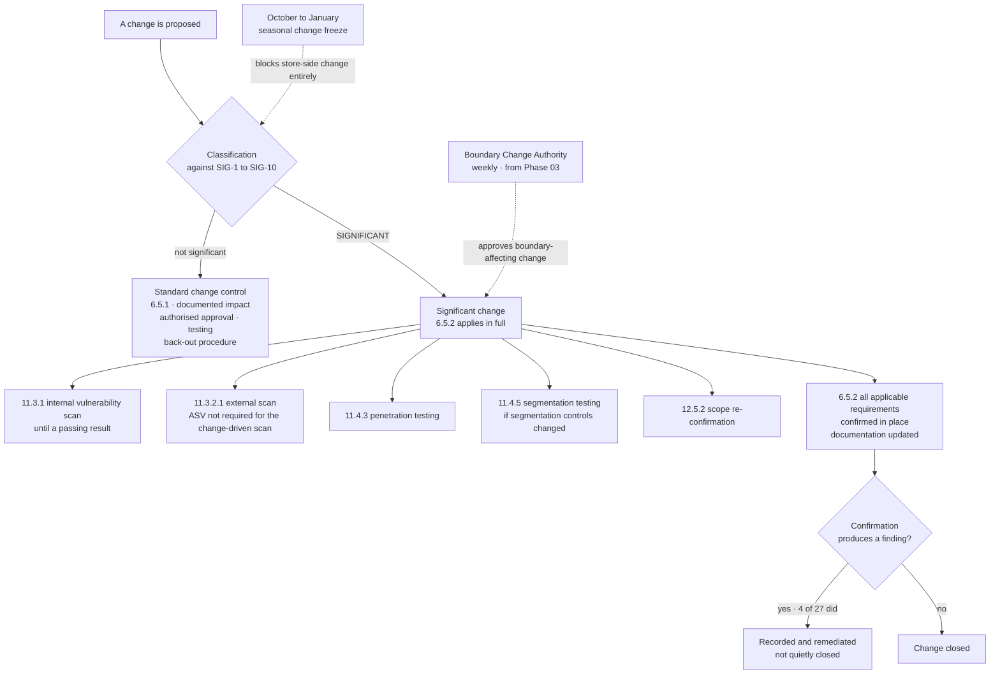

# Change Control and the Significant-Change Definition

## Why the definition is the deliverable

Five separate requirements hang off the phrase "significant change" — 11.3.1, 11.3.2.1, 11.4.3, 11.4.5 and 12.5.2. The standard does not define it exhaustively, which means **the entity defines it, and the assessor tests the definition.**

A definition that nobody wrote down is a definition nobody applies. Marketa's is ten enumerated triggers, and in the period **27 changes met it** — of which **4 produced a finding at the 6.5.2 confirmation step**. Those four are the argument for having the step at all.

## Source
`04.08-change-control.md`.
