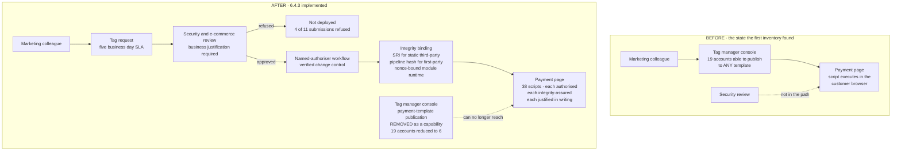

# How a Script Reaches a Payment Page — Before and After

## The finding, and what it was actually about

Three scripts were unauthorised when the first inventory closed. They arrived through a marketing tag manager that had been permitted to deploy to payment pages without security review.

**The tag manager was working exactly as designed.** Nothing was compromised, nothing was exploited, and no attacker was involved. The control failure was that a business function had been given a direct publication path onto a payment page, and nobody had ever decided that it should not have one.

That is a governance finding wearing a technology costume, and it is the more common shape of the Magecart problem than the dramatic one.

## Source
`04.10-payment-page-script-management.md`.
