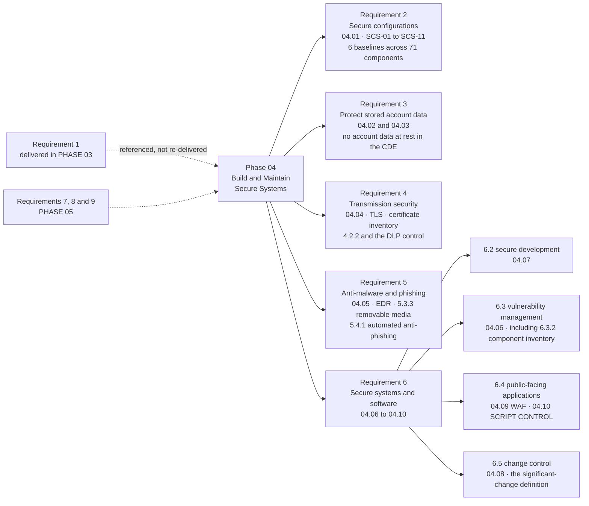

# Requirements 2 to 6 — What Phase 04 Delivers

## The shape of the phase

Requirement 3 is unusually light here, and that is the architecture working rather than a gap. Marketa does not store account data — PAN transits on exception paths only, for disputes, settlement reconciliation and refunds. What Requirement 3 costs Marketa is not encryption at rest; it is the **continuous obligation to keep proving that nothing has come to rest**, which is why Phase 02's discovery is repeated rather than filed.

Requirement 6 carries most of the weight, and within it **6.4.3** is where a merchant with a hosted iframe still has real exposure.

## Source
`04.01` through `04.10`.
