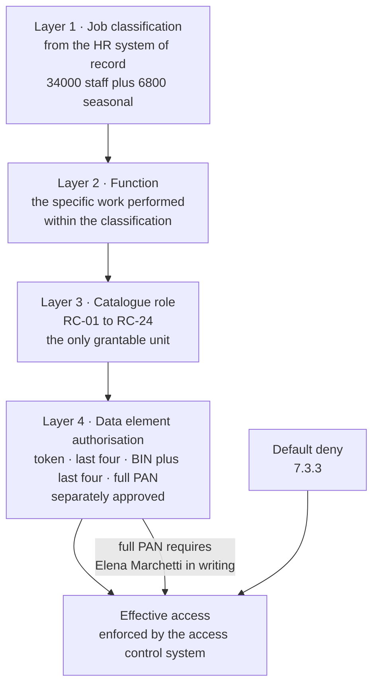

# 05.01 — Access Control Principles

| Field | Value |
|---|---|
| Document ID | MRG-PCI-2026-501 |
| Program | Marketa Retail Group — PCI DSS v4.0.1 Compliance Program |
| Phase | 05 — Access Control &amp; Physical Security |
| Version | 1.0 |
| Status | Approved |
| Owner | Elena Marchetti, VP Payment Operations |
| Approver | Naomi Bhatt, Chief Information Security Officer |
| Date | 2026-07-15 |
| Classification | Confidential — Cardholder Data Environment // Illustrative Portfolio Sample |

## Purpose

Requirement 7 is the shortest of the twelve and the one most often reduced to a slogan. "Least privilege" appears in every security policy ever written, including the ones belonging to organisations that were breached through an account nobody could justify.

This document sets out what Requirement 7 actually obliges Marketa to have — **7.1.1** and **7.1.2** (the processes, the mechanisms and the people who own them), **7.2.1** (a defined access control model), **7.2.2** (access assigned by job classification and function, at least privilege), and **7.3.1** to **7.3.3** (an access control system that enforces the model and is set to deny by default) — and it states the eight principles, **ACP-1 to ACP-8**, that the rest of Phase 05 implements.

The role catalogue those principles produce is **05.02**. The reviews that keep it true are **05.03**. Identity and authentication are Requirement 8, in **05.04** to **05.07**. Physical access is Requirement 9, in the second half of this phase from **05.08**.

One thing is settled here rather than deferred, because everything downstream depends on it: **fourteen people in an organisation of about 34,000 may see a full primary account number.** That figure was established in 04.02 §5 and is not a target. It is the outcome of applying the principles below to a business process that genuinely requires some people to read a card number. §6 is about those people, and it is the honest part of this document.

## 1. What Requirement 7 Obliges

| Sub-requirement | The obligation, stated plainly | Where Marketa discharges it |
|---|---|---|
| **7.1.1** | Policies and procedures for Requirement 7 are documented, kept current, in use and known to all affected parties | This document; the Access Control Policy adopted in Phase 07 |
| **7.1.2** | Roles and responsibilities for Requirement 7 activities are documented, assigned and understood | §2 below; the RACI in 01.07 |
| **7.2.1** | An **access control model** is defined, granting access appropriate to business need, based on job classification and function, at the least privileges required | §3 and §4 |
| **7.2.2** | Access is **assigned** to users, including privileged users, on that basis | 05.02 §3 |
| **7.2.3** | Required privileges are **approved by authorised personnel** | 05.02 §5 |
| **7.2.4** | All user accounts and access privileges **reviewed at least once every six months**, with management acknowledgement | 05.03 §2 |
| **7.2.5** | Application and system accounts assigned and managed at least privilege, limited to what is required | 05.07 §2 |
| **7.2.5.1** | Those accounts reviewed at a frequency set by **targeted risk analysis** | 05.03 §6 — **TRA-7.2.5.1** |
| **7.2.6** | User access to **query repositories of stored account data** restricted to programmatic methods and to responsible administrators | 05.02 §8 |
| **7.3.1** | An access control system is in place that restricts access based on need to know and covers all system components | §5 |
| **7.3.2** | The access control system is configured to enforce permissions assigned by job classification and function | §5 |
| **7.3.3** | The access control system is set to **"deny all" by default** | §5 and **ACP-1** |

Requirement 7 does not mention passwords, tokens or multi-factor authentication. That is Requirement 8, and the distinction is worth holding onto: **Requirement 7 decides what an identity is allowed to do; Requirement 8 establishes that the identity is who it claims to be.** An organisation can be perfect at one and worthless at the other, and Marketa's programme treats them as two workstreams that meet at the role catalogue.

## 2. Roles and Responsibilities — 7.1.2

| Activity | Accountable | Responsible | Consulted | Informed |
|---|---|---|---|---|
| The access control model itself | Naomi Bhatt | Owen Castellanos | Elena Marchetti, Trevor Kim | PCI Steering Committee |
| Role definition for CDE business roles | Elena Marchetti | Payment Operations team leads | Owen Castellanos | Naomi Bhatt |
| Approval of a privileged role assignment | Trevor Kim | Requesting manager | Owen Castellanos | Marcus Hale |
| Approval of full-PAN visibility | **Elena Marchetti personally** | — | Naomi Bhatt | Rosa Delgado |
| Six-monthly access review execution | Owen Castellanos | Role owners as reviewers | Rosa Delgado | Naomi Bhatt |
| Independent challenge of review outcomes | Rosa Delgado | Internal Audit | — | Audit Committee |

Two entries are deliberate. **Full-PAN visibility is approved by a named executive and by nobody else** — it cannot be delegated to a team lead, a ticket queue or an entitlement request workflow. And **Internal Audit challenges the review outcome rather than performing the review**, because a reviewer who is also the assurance function has removed the second pair of eyes rather than added one.

## 3. The Eight Principles

| ID | Principle | What it rules out | Requirement anchor |
|---|---|---|---|
| **ACP-1** | **Deny by default.** Access exists only where it has been granted explicitly. Absence of a rule is a denial, not a gap | Inherited access, "everyone" groups, permissive default containers | 7.3.3 |
| **ACP-2** | **Need to know is defined against the data element, not the system.** The question is never "should this person reach CDE-03" but "should this person read a full account number" | Whole-system grants that carry data visibility as a side effect | 7.2.1 |
| **ACP-3** | **Least privilege is bounded in function, in time and in volume.** A privilege that is correct for one case is not therefore correct for ten thousand | Standing administrative rights; unbounded export and query rights | 7.2.1, 7.2.2 |
| **ACP-4** | **Access is assigned by job classification and function, never by individual request.** A person receives a role; a role receives entitlements | Per-person entitlement drift and the "copy Sarah's access" pattern | 7.2.2 |
| **ACP-5** | **The requester, the approver and the implementer are three different people.** No role in the catalogue can be self-granted | Administrators provisioning themselves | 7.2.3 |
| **ACP-6** | **Privileged access is brokered, time-bounded and recorded.** It is checked out for a purpose, not held | Permanent membership of privileged groups | 7.2.2, 8.4.1 |
| **ACP-7** | **Querying a repository of stored account data is a distinct privilege**, separately granted, separately approved and separately logged — never a consequence of administering the platform underneath it | Database administrators reading data as a by-product of maintaining it | 7.2.6 |
| **ACP-8** | **Every grant has something that can take it away** — an expiry, a review, or an automated trigger. A grant with no revocation path is a permanent grant however it was described | Access that survives a role change because nothing was watching | 7.2.4, 8.2.5 |

ACP-3 and ACP-7 do the most work in Marketa's environment and are the two most commonly missing from a merchant's model. ACP-3 exists because the dispute process needs a person to see one account number at a time and nothing in a conventional role model distinguishes that from the ability to see them all. ACP-7 exists because finding **PAN-02** — 2,187 scanned dispute documents on a share readable by a 63-member group, 22 of whom had no dispute-handling role — was not a failure of authentication. Everyone who read that share was correctly authenticated. It was a failure to treat *reading account data* as a privilege in its own right.

## 4. The Access Control Model — 7.2.1

The model has four layers. A person's effective access is the intersection of all four, never the union of any two.

| Layer | What it establishes | Source of truth | Can it grant access on its own? |
|---|---|---|---|
| **1 — Job classification** | The employment record: position, department, cost centre, manager, employment type, assignment end date | HR system of record | **No.** A classification makes a role *available*; it does not assign it |
| **2 — Function** | What the person actually does inside the classification — a Payment Operations analyst who works disputes is not the same function as one who works settlement exceptions | Manager attestation, recorded against the role assignment | No |
| **3 — Catalogue role** | The **only grantable unit in the model.** Twenty-four roles, each with a defined entitlement set, an owner, an approver and a review cycle | The role catalogue, 05.02 §3 | Yes, once approved |
| **4 — Data element authorisation** | Which representation of an account number the person may see: token only, last four, BIN and last four, or full PAN | The full-PAN authorisation register, 05.02 §7 | It **constrains**; it never expands |

The load-bearing property is that **layer 3 is the only thing that can be granted.** There is no mechanism in Marketa's identity estate for issuing a permission to a person directly. An entitlement that is needed by one person and does not fit a role is not granted as an exception; it becomes a role, or it does not happen. That rule is what keeps the six-monthly review in 05.03 tractable, and §7 explains what it costs.

## 5. The Access Control System — 7.3.1 to 7.3.3

7.3.1 requires an access control system covering all system components. 7.3.2 requires it to enforce permissions by job classification and function. 7.3.3 requires it to be set to deny all by default. Marketa does not have one access control system; it has five enforcement planes, and 7.3.1's "all system components" is satisfied only if every one of the 71 falls under at least one of them.

| Plane | Components covered | Enforcement mechanism | Default state | Evidence of "deny all" |
|---|---|---|---|---|
| **Directory and federation** | 8 CDE, 47 connected-to | Active Directory security groups mapped one-to-one to catalogue roles, presented to applications through CT-04 assertions | Deny | No authenticated-users or domain-users grant exists on any in-scope resource; asserted daily |
| **Cloud identity** | 2 CDE, 14 connected-to in AWS | CT-07 federation and permission sets; service control policies at CT-41 | Deny | No wildcard principal in any in-scope policy; posture assertion at CT-33 |
| **Privileged brokering** | All 71 for administrative access | CT-11 vault and session broker; access checked out against an approved role and a stated purpose | Deny | Every privileged session has a check-out record; standing membership of privileged groups is zero |
| **Appliance and vendor-managed** | 19 components with a local realm | Local authorisation lists reconciled monthly to the catalogue | Deny | Monthly reconciliation record; this population is also the 8.3.9 population — 05.06 §2 |

The fifth row is the uncomfortable one and is reported as such. Nineteen in-scope components hold a local authorisation realm that Marketa reconciles rather than controls centrally. That is not a violation of 7.3.1 — the access control system covers them, and the reconciliation is the mechanism — but it is a weaker form of the same control, and it is exactly the population that reappears in **05.06** as the scope of the programme's only customized approach. Access control weakness and authentication weakness accumulate on the same components, for the same reason: somebody else builds the firmware.

## 6. What "Need to Know" Means in Payment Operations

Requirement 7 says "need to know" without defining it, on the reasonable basis that only the entity can. Marketa's definition is written against the **data element**, per ACP-2, and it is the definition an assessor will test against the 14.

| Business function | What the work genuinely requires | Data element authorised | Population | What the function is *not* authorised to do |
|---|---|---|---|---|
| **Payment operations, general** | Reconcile an order to an authorisation, route an exception, identify a customer's transaction | Token, last four, approval code, BIN and last four | **22** | Read a full PAN; export a result set; query CDE-02 directly |
| **Disputes and chargebacks** | Read an issuer-generated retrieval request, representment packet or signed sales draft **as the issuer produced it** — the account number is the issuer's case reference and cannot be redacted from an image Marketa did not create | **Full PAN**, on issuer imagery only, rendered in a CDE-06 session | **9** | Save, print, copy, screenshot or download the image; view imagery for a case not assigned to them |
| **Settlement exceptions** | Resolve a brand exception record whose only identifier is the account number the brand supplied | **Full PAN**, on brand exception records inside CDE-04 only | **4** | Query CDE-02; extract exception records to any other system |
| **Refunds and adjustments** | Authorise a refund or adjustment against an original transaction | Token and last four **only** — the refund path is entirely tokenised | **6** | See any untruncated PAN at all; the data is not present on the path |
| **Executive escalation** | Resolve a case the analysts cannot | Full PAN, on escalation, logged individually | **1** | Routine access; each use is an event, not a session |
| **Call centre** | Take a phone order and support it | Last four in the order record; the digits the customer keys never reach the desktop | **310** | Anything more — suppression at Cadence removes the digits upstream |

The refunds row is the model working as intended. Refunds handle roughly 2.4% of transaction volume and are the function most people assume must see a card number. They do not, because the refund is authorised against a Truvance token and the original authorisation, and nobody ever needed the PAN — they needed the *reference*. **A large part of least privilege in payments is discovering that a business need for the account number is really a business need for an identifier, and that the two were conflated by an old system design.**

The dispute row is the model failing to eliminate the need, and being honest about it.

## 7. The Tension: Least Privilege and a Disputes Team That Must See PAN

Nine dispute analysts read full account numbers every working day. No amount of policy language changes that. The dispute is initiated by an issuer, the evidence is an image the issuer generated, and the account number is the identifier the case is filed under. Marketa cannot redact a document it did not produce and must return a representment packet that references the same case.

So the honest position is not that least privilege eliminates the exposure. It is that least privilege has four available moves, and Marketa took all four.

| Move | What it means | What it achieved | What it did not achieve |
|---|---|---|---|
| **Eliminate the need** | Remove the process that requires the data | **Failed, and recorded as failed.** The dispute process is imposed by the card brands and the issuers, not chosen by Marketa | The need remains. The programme does not pretend otherwise |
| **Minimise the population** | Grant to the smallest set of people who can still do the work | **63 → 9.** Before 2021 the same work was done from a file share with 63 readers, 22 of whom had no dispute role — finding PAN-02 | Nine is a floor set by case volume and coverage across leave and shifts, not a number that can be driven to zero |
| **Minimise the surface** | Constrain what can be done with the data once visible | Rendered in a non-persistent CDE-06 session. No local save, print, clipboard, drive mapping, screen capture, download or internet egress; every session watermarked and recorded. Verified by quarterly test, not by configuration setting | A camera. Named as a residual in 04.02 §6 and treated by policy and awareness, not by technology |
| **Minimise the duration and volume** | Per-case access rather than per-population | Imagery is retrieved per assigned case; there is no browse, no list view and no bulk retrieval. An analyst who is not assigned to a case cannot render its imagery | It does not stop an analyst from being assigned many cases. Volume is monitored under 10.2.1.1 and anomalous retrieval rates alert |

This treats **R-12** — insider misuse in dispute, chargeback and refund handling, where full PAN is legitimately visible to someone doing their job. The register scores it **Moderate 12** and Phase 05 does not claim to reduce it, for the reason 04.02 §5 already gave: the only control that would remove it is one that removes the business need, and the business need is not Marketa's to remove.

What Phase 05 does claim is that **the exposure is bounded, attributed, logged and reviewed** — nine named people, each view recorded under 10.2.1.1, authorisation re-confirmed in writing by Elena Marchetti annually and re-tested at each six-monthly review. Against the alternative that produced PAN-02, that is the whole of the difference, and it is a large difference.

## 8. Role Explosion, and the Cost of Keeping the Model Small

ACP-4 forbids individual grants. That rule has a predictable failure mode: every request that does not fit an existing role becomes a *new* role, the catalogue grows to several hundred entries, and the six-monthly review degenerates into a rubber stamp because no human being can meaningfully attest to 400 role definitions in a fortnight.

Marketa's counter-measures are five, and they are the reason 05.02's catalogue has 24 entries rather than 240. **A role must have at least three plausible holders**, because a role defined for one person is an individual grant wearing a costume — seven proposals were refused on this test alone. **A new role requires the CISO's approval, not a manager's**, because the cost of a new role is borne by the review, which is a programme cost rather than a team cost. **Roles are additive, not bespoke**: a person needing two functions receives two roles, and no combined role exists anywhere in the catalogue. **Privileged and standard variants are separate roles, never a flag on one role**, which is what makes the privileged population countable at 76 of 134 assignments. And **roles whose membership has been zero across two consecutive review cycles are retired** at the annual rationalisation — a mechanism not yet exercised, because the catalogue is four months old.

The trade is stated openly: a small catalogue means some people carry an entitlement they will never use, because their role includes it for a colleague who will. **That is a real deviation from perfect least privilege, and Marketa accepts it deliberately**, on the judgement that a reviewable 24-role model with a little slack produces less residual access than an unreviewable 240-role model with none. The judgement is recorded as **ADR-0013** and is re-examined at each annual rationalisation.

## 9. What This Document Does Not Claim

| Claim | Position |
|---|---|
| That least privilege means nobody sees a full PAN | It does not. Fourteen people do, and §6 and §7 say why. Least privilege means the smallest population, the least data, the shortest time and the most accountability that the business process permits |
| That the 24-role catalogue is optimally granular | It is deliberately coarser than perfect least privilege would be. ADR-0013 records the reasoning and the review that tests it |
| That access control covers all 71 components equally | Nineteen components hold a local authorisation realm reconciled monthly rather than enforced centrally. §5 names them; 05.06 assesses the consequence |
| That Requirement 7 is discharged by this document | 7.2.3 to 7.2.6 are discharged in 05.02 and 05.03. This document establishes the model those documents apply |

## Cross-References

| Reference | Relevance |
|---|---|
| 01.07 — Roles, Responsibilities &amp; RACI | The organisational RACI behind the 7.1.2 table in §2 |
| 02.09 — Assessed System Component Inventory | The 71 components the access control system must cover under 7.3.1 |
| 03.11 — Risk Register | **R-12** insider misuse in disputes; **R-13** seasonal access; **R-18** privileged access from general workstations |
| 04.02 — Protect Stored Account Data | The 14 full-PAN viewers and the 3.4.1 masking population that §6 restates |
| 05.02 — Role Definitions &amp; Access Model | The 24-role catalogue this model produces; 7.2.3 and 7.2.6 |
| 05.03 — Access Reviews | 7.2.4, 7.2.5 and TRA-7.2.5.1 — the mechanism behind ACP-8 |
| 05.05 — Authentication &amp; MFA | Requirement 8 — establishing that the identity is who it claims to be |
| 05.08 — Physical Security &amp; Facilities | Requirement 9 — the physical counterpart of ACP-1 |

---
[⬅ Previous](05.00-README.md) · [🏠 Phase 05 Home](05.00-README.md) · [Next ➡](05.02-role-definitions-and-access-model.md)
