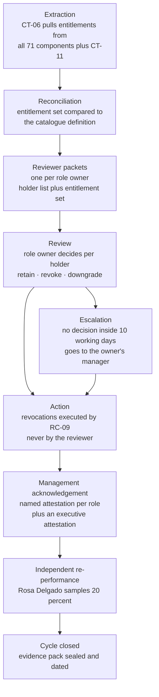

# 05.03 — Access Reviews

| Field | Value |
|---|---|
| Document ID | MRG-PCI-2026-503 |
| Program | Marketa Retail Group — PCI DSS v4.0.1 Compliance Program |
| Phase | 05 — Access Control &amp; Physical Security |
| Version | 1.0 |
| Status | Approved |
| Owner | Owen Castellanos, Payment Card Compliance Manager |
| Approver | Naomi Bhatt, Chief Information Security Officer |
| Date | 2026-07-15 |
| Classification | Confidential — Cardholder Data Environment // Illustrative Portfolio Sample |

## Purpose

**7.2.4** obliges Marketa to review all user accounts and related access privileges **at least once every six months**, to confirm that accounts and access remain appropriate based on job function, to remove or reassign anything inappropriate, and to have **management acknowledge** that the access remains appropriate. **7.2.5** obliges application and system accounts to be assigned and managed at least privilege, and **7.2.5.1** obliges those accounts to be reviewed at a frequency established by a **targeted risk analysis under 12.3.1**.

This document delivers the review mechanism, the results of the **first two cycles**, and **TRA-7.2.5.1** in full — one of the two targeted risk analyses arising in Marketa's Requirement 7 and 8 workstream. The other, TRA-8.6.3, is in 05.07 §6.

The two cycles are reported honestly, and they do not look alike. **The first cycle found 214 revocations against 1,247 entitlements. The second found 9 against 134 assignments.** That is not a control improving by a factor of twenty in four months. It is a first review doing what first reviews do — clearing accumulated debt — and a second review doing what a steady-state review is supposed to do, which is find very little because the joiner–mover–leaver machinery in 05.04 caught it first. **A review that keeps finding large volumes is a review compensating for a broken lifecycle**, and §5 is about how Marketa will tell the difference next time.

## 1. What 7.2.4 Actually Requires

| Element of the requirement | The obligation | The common shortfall |
|---|---|---|
| **All user accounts** | Every account, not a sample, not just privileged, not just the CDE | Reviewing only administrative accounts |
| **And related access privileges** | The entitlements behind the account, not merely that the account exists | Confirming the account list and never opening the permission set |
| **At least once every six months** | A hard floor. Twelve months does not satisfy it | An annual cycle carried over from a v3.2.1-era policy |
| **Accounts and access remain appropriate based on job function** | The test is appropriateness to the current role, not to the role at grant | "Still employed" treated as equivalent to "still appropriate" |
| **Inappropriate access is addressed** | Removal or reassignment, with a record | Findings logged and not actioned |
| **Management acknowledges access remains appropriate** | A named person with the standing to refuse, attesting to a specific population on a specific date | A checkbox in a tool, or a bulk approval of 400 lines in 90 seconds — §4 |

Marketa's cycle is **six-monthly, and the six months is measured between review completion dates, not between start dates.** A review that starts on time and runs for eleven weeks has not met the requirement if the previous one completed more than six months earlier, and the calendar in 01.11 §3 tracks the completion date for exactly that reason.

## 2. The Review Mechanism

| Step | Owner | Control property |
|---|---|---|
| **Extraction** | RC-11, Access Review Administrator | Entitlements are read **from the components**, not from the request system. A grant made outside the process is visible only if the extraction reads the enforcement plane |
| **Reconciliation** | Automated in CT-06 | Every holder's actual entitlement set is diffed against the catalogue definition. A divergence is a finding before any human reviews anything — this is what catches out-of-process grants |
| **Reviewer packets** | RC-11 | One packet per role, containing holders, their job classification from HR, their last use date, and the full entitlement set. **Last-use data is included deliberately**: a reviewer who is only shown names retains everybody |
| **Review** | Role owner | Per-holder decision: retain, revoke, or downgrade. **A blank is not a retention** — it escalates |
| **Escalation** | Owen Castellanos | No decision inside 10 working days escalates to the owner's manager; at 15 working days the access is **suspended pending decision** |
| **Action** | RC-09, Identity Administrator | The reviewer never executes their own revocations — ACP-5 applies to removal as well as to grant |

The suspension rule at 15 working days is the part reviewers dislike and the part that makes the cycle finish. In Cycle 1 it was invoked **7 times**; in Cycle 2, **once**.

## 3. Reviewer Independence

A review in which the reviewer benefits from the outcome is not a review. Marketa's independence rules are narrow and absolute.

| Situation | Rule | Cycle 2 instances |
|---|---|---|
| A person reviewing their own access | **Prohibited.** Reallocated to the role owner's manager | 10 — every role owner's own assignments |
| Reviewer and holder in the same direct reporting line | Permitted — the direct manager is usually the best-informed reviewer. Independence is supplied by the 20% re-performance, not by distance | 91 |
| A privileged role whose owner is also the platform administrator | **Countersignature required** from the function owner named in 05.02 §5 | 8 |
| Full-PAN authorisations (RC-02, RC-03, RC-04) | Reviewed by Elena Marchetti; **re-performed at 100%, not 20%**, by Internal Audit | 14 |
| Any role touching authentication or key material (RC-10, RC-12, RC-15) | Reviewed by Naomi Bhatt; re-performed at 100% | 12 |

Internal Audit's re-performance is a **challenge of the outcome, not a second review**. Rosa Delgado does not decide whether a holder should retain access; she decides whether the reviewer's decision is supported by the evidence in the packet, and disagreement goes to the Audit Committee. In Cycle 2 she disagreed with **3 of 27 sampled decisions** — all three retentions where the last-use date was more than 120 days old and the reviewer's note said only "still required". All three were re-reviewed; two were revoked and one was justified with a documented seasonal-workload reason that the original note had omitted.

## 4. What "Management Acknowledgement" Actually Requires

7.2.4 says management must acknowledge that access remains appropriate. It does not say what an acknowledgement is, and the gap between a defensible acknowledgement and a worthless one is where most entities lose this requirement at fieldwork.

Marketa's position is that an acknowledgement is only evidence if it satisfies five tests.

| Test | The requirement Marketa imposes | Why a QSA will look for it |
|---|---|---|
| **Attributable** | A named individual, authenticated at the point of attestation with MFA, not a shared team mailbox or a role account | An attestation nobody can be identified with is an attestation nobody made |
| **Specific** | The attestation names the role, the exact holder list, the entitlement set version and the extraction date. Not "access reviewed" | An acknowledgement of an unspecified population cannot be tested against the population |
| **Timed** | The attestation records the time spent in the packet as well as the time of signing | 400 lines acknowledged in 90 seconds is evidence that nothing was reviewed. Marketa records dwell time and reports it — §5 |
| **Consequential** | The attester must have the standing to refuse, and refusals must be visible in the record | A process where nothing is ever refused is a process where refusal is not available |
| **Retained** | The signed attestation, the packet it refers to, the diff it was based on and the resulting actions are held together as one immutable evidence bundle for at least 12 months | The assessor samples the bundle, not the tool's dashboard |

The dwell-time measure is the unusual one and it was added after Cycle 1. Marketa reports it because it is the only quantitative defence against the reviewer who approves everything. It is not presented as proof of quality — a slow reviewer can still be a careless one — but a reviewer who spent 40 seconds on a 22-holder packet has demonstrably not considered it, and that is a finding the entity can raise on itself before an assessor raises it.

| Attestation layer | Who | What is attested | Cycle 2 evidence |
|---|---|---|---|
| **Role attestation** | The role owner, per role | "The holders listed hold this role appropriately for their current job function, and the entitlement set is the minimum the function requires" | **24 signed attestations**, one per role |
| **Function attestation** | Elena Marchetti, Trevor Kim, Marcus Hale, Sonia Rendell, Bill Traynor | "All roles within my function have been reviewed and actioned" | **5 signed attestations** |
| **Executive attestation** | Naomi Bhatt | "The six-monthly review under 7.2.4 has been completed across all 71 assessed system components; exceptions are recorded and actioned" | **1 signed attestation**, dated 2026-07-10 |
| **Independent statement** | Rosa Delgado | The re-performance result and any disagreements | Reported to the Audit Committee 2026-07-21 |

## 5. The First Two Cycles

| Dimension | **Cycle 1** | **Cycle 2** |
|---|---|---|
| Window | 2026-02-16 to 2026-03-13 | 2026-06-15 to 2026-07-10 |
| Model in force | **Pre-catalogue.** Individual entitlements, inherited groups, no role definitions | **Post-catalogue.** 24 roles, 134 assignments |
| Population reviewed | **1,247 entitlement grants** held by **209 individuals** across 71 components | **134 role assignments** held by **118 individuals**, plus **142 application and system accounts** under 7.2.5.1 |
| **Revocations** | **214 (17.2%)** | **9 (6.7%)** |
| Downgrades — privileged to standard | 31 | **4** |
| Entitlement sets amended | n/a — no definitions existed | **2** roles narrowed |
| Orphaned accounts found | **63** | **0** |
| Accounts whose holder had changed role | **48** | **3** |
| Individuals losing **all** in-scope access | **91** | 5 |
| Mean reviewer dwell time per holder | Not measured | **2 minutes 14 seconds** |
| Independent re-performance disagreements | 9 of 41 sampled | **3 of 27 sampled** |

### 5.1 The sixty-three orphans

The most valuable finding of Cycle 1 was not a person with too much access. It was **63 accounts with no identifiable owner at all** — accounts present on an in-scope component, authenticating successfully in some cases, and matched to no HR record, no contractor register and no application inventory.

| Class | Count | What they turned out to be | Disposition |
|---|---|---|---|
| Departed employees whose accounts survived a system migration | 11 | Accounts recreated by a 2023 directory consolidation that restored objects from a pre-departure backup | Deleted |
| Contractors never in the HR system | 19 | The contractor register was maintained in a spreadsheet by the engaging manager | Deleted; contractor onboarding moved into the HR system of record — 05.04 §3 |
| Application and system accounts miscatalogued as user accounts | 24 | Real, functioning service identities with human-looking names | Re-classified into the 7.2.5 population and governed under 05.07 |
| Test and training accounts on production components | 7 | Created during a 2024 upgrade | Deleted |
| Genuinely unexplained | **2** | Two accounts on CT-39 with creation dates in 2019, no logon history since 2021, no owner findable | **Deleted, and recorded as unexplained rather than reconciled.** An account whose origin nobody can establish is a finding even when it is inert |

The nineteen contractors are the entry that changed a process. They existed because contractor engagement bypassed the HR system, which meant they had no joiner record, no leaver trigger, and no classification to hang a role on — every one of ACP-4's assumptions failed for them silently. That gap is closed in 05.04 §3, and it is also the direct cause of the single 22-minute revocation outlier reported there.

The two unexplained accounts are reported as unexplained. The temptation to write "likely created during the 2019 array installation" was declined, because a plausible story recorded as a fact is how an inventory becomes untrue.

### 5.2 Why the second cycle found so little, and why that is not yet reassuring

Nine revocations against 134 assignments is what a working lifecycle looks like. It is also what a superficial review looks like, and from the outside the two are indistinguishable. Marketa records three pieces of evidence that distinguish them, and one that does not yet.

| Evidence | What it shows |
|---|---|
| The **reconciliation diff** ran before any human review and found **11 divergences** between actual entitlements and catalogue definitions — 6 on CT-19, 3 on CT-30, 2 on CT-38. All were corrected. A review that found nothing would have found nothing here too | The extraction is reading the enforcement plane, not the request system |
| **Dwell time of 2 minutes 14 seconds per holder** across 134 holders is roughly five hours of aggregate reviewer attention, consistent with the 11-minute-per-role figure measured in 05.02 §9 | Reviewers opened the packets |
| **Three re-performance disagreements out of 27** sampled, two of which became revocations | The reviewers are fallible, which is evidence that they are deciding rather than approving |
| The lifecycle itself has **not yet run through a seasonal cycle.** The October–January surge, the change freeze and the February offboarding wave are all ahead of the first two cycles | **Nothing here demonstrates the control under load.** Cycle 3 falls in January 2027, inside the freeze, and is the first real test |

The last row is the honest one. **R-13** — seasonal workforce access, onboarded at speed and offboarded slowly — is held at Moderate 12 and is not claimed as reduced by two review cycles that took place in spring.

## 6. TRA-7.2.5.1 — Frequency of Application and System Account Access Review

Requirement **7.2.5.1** requires all access by application and system accounts, and related access privileges, to be reviewed periodically at a frequency defined in the entity's **targeted risk analysis performed according to 12.3.1**. This is that analysis. It is one of the programme's **fourteen** targeted risk analyses and one of the **two** arising in the Requirement 7 and 8 workstream.

| Field | Value |
|---|---|
| Analysis ID | **TRA-7.2.5.1** |
| Requirement | 7.2.5.1 — periodic review of application and system account access |
| Performed under | **12.3.1** |
| Owner | Elena Marchetti, VP Payment Operations |
| Contributors | Trevor Kim, Marcus Hale, Owen Castellanos |
| Approver | Naomi Bhatt, Chief Information Security Officer |
| Date performed | 2026-04-22 |
| Date approved | 2026-04-29 |
| Next review due | **2027-04-29**, and on any significant change under SIG-1 to SIG-10 |
| **Determination** | **Every six months, aligned to and executed inside the 7.2.4 user account review** |

### 6.1 Element 1 — Assets being protected

| Asset | Description |
|---|---|
| The **8 CDE system components** and the account data processed and transmitted through them on flows F-04, F-05 and F-06 | The account data itself is the asset; the components are the path |
| The **63 connected-to and security-impacting components**, including the identity, secrets, brokering, backup and boundary planes on which the CDE's controls depend | Compromise of a connected-to component's service identity yields a control, not merely a system |
| The **142 application and system accounts** enumerated in 05.07 §3, and the entitlements they hold | The accounts are simultaneously an asset and a control surface |

### 6.2 Element 2 — Threats the requirement protects against

| Threat | Realisation in Marketa's environment |
|---|---|
| **Privilege accretion** — a service identity accumulates entitlements across successive integrations and is never narrowed | The dominant threat. A service account is granted what makes the integration work on the day, and nothing subsequently removes what turned out to be unnecessary |
| **Orphaned service identity** — the integration is decommissioned; the account and its entitlements persist | Directly evidenced: Cycle 1 found **24 application and system accounts miscatalogued as user accounts**, and the register step in 02.09 §7.1 exists because "stopped is not terminated" |
| **Interactive use of a non-interactive account** | Treated primarily under 8.6.1. The review is the detective counterpart: an account whose entitlement set has drifted toward human-shaped access is visible in the diff |
| **Credential compromise with unbounded reach** | An account with a static credential and broad entitlements converts a single credential leak into estate-wide access. **R-17** is the register entry |

### 6.3 Element 3 — Factors contributing to likelihood and impact

| Factor | Direction | Weight | Basis |
|---|---|---|---|
| Population size — **142 accounts** across 71 components | Increases likelihood | Moderate | Large enough for drift, small enough to review completely without sampling |
| **31 of 142** are cloud workload identities carrying no static credential, provisioned from infrastructure-as-code with a reviewable definition | Reduces likelihood | High | The definition is version-controlled and diffable; drift is visible outside the review |
| **93 of 142** authenticate with a password held in the CT-14 vault | Increases impact | High | Vault-brokered, but a password is a password |
| **2 of 142** hold embedded, non-rotatable credentials in legacy batch integrations | Increases impact | **High** | The **8.6.2 Not in Place** finding; **R-17** at High 16. Remediation dated **2027-01-31** |
| The **October–January change freeze** suppresses integration change for four months | Reduces likelihood in that window | Moderate | Also delays remediation of anything found in a January review |
| Detective coverage: 10.4.1.1 automated log review over all 71 components from Phase 06 | Reduces impact | Moderate | Not yet operating for a full cycle at the date of this analysis |

### 6.4 Element 4 — The resultant analysis and its justification

Three candidate frequencies were considered against the factors above.

| Candidate | Argument for | Argument against | Decision |
|---|---|---|---|
| **Quarterly** | Shortest window of undetected drift; matches the pace of integration change outside the freeze | One of four cycles falls entirely inside the change freeze, when almost nothing has changed and reviewer attention is scarcest. Produces two low-value cycles a year and measurably degrades reviewer engagement in the two that matter | Rejected |
| **Every six months** | Aligns to the 7.2.4 user review, so a single extraction, a single reviewer packet set and a single acknowledgement chain cover both populations. Places one cycle after the freeze — when accumulated change is greatest — and one mid-year. Bounds undetected drift to a maximum of six months against a change rate of roughly 27 significant changes per quarter outside the freeze | Six months is a long time for the 2 accounts holding embedded credentials | **Adopted**, with the compensation in the next row |
| **Annual** | Lowest cost | Exceeds the drift window implied by the integration change rate; would leave a service identity mis-entitled for up to twelve months, and would place the review out of step with 7.2.4 | Rejected |

**Determination: every six months, aligned to and executed inside the 7.2.4 review cycle**, with three event triggers that force an out-of-cycle review of the affected accounts:

| Trigger | Scope of the out-of-cycle review |
|---|---|
| Any **significant change** under SIG-1 to SIG-10 affecting an integration | The accounts belonging to the affected integration |
| Decommissioning of any integration or component | The accounts belonging to it, reviewed before the component is removed from the register — 02.09 §7.1 step 6 |
| Any use of an application or system account **outside its defined operating window or source** | That account, immediately, as an incident |

The alignment to 7.2.4 is the substantive part of the determination and not merely an administrative convenience. A separate service-account review run on its own calendar competes for the same reviewers, uses a different extraction, and produces a second acknowledgement chain that the assessor must reconcile. Running the two together means **the reviewer sees the human and the non-human access to the same component in the same packet**, which is the only way the question "should this service account still be able to do what this person can no longer do" gets asked at all.

The 2 accounts carrying embedded credentials are **not** governed by this frequency alone. Their compensating operational measures — including monitoring for any use outside the batch window — are continuous, and are described in 05.07 §5. This analysis records that the six-month review frequency is **not** the control protecting those two accounts, because it would be inadequate to that purpose.

### 6.5 Element 5 — Annual review of this analysis

Reviewed at least once every twelve months, next due **2027-04-29**, by Elena Marchetti with Trevor Kim, approved by Naomi Bhatt. The review asks whether the factors in §6.3 have moved: the population size, the proportion carrying static credentials, the integration change rate, and whether 10.4.1.1 automated review has by then delivered the detective coverage this analysis assumed would arrive.

### 6.6 Element 6 — Trigger for an updated analysis before the annual date

| Trigger | Effect |
|---|---|
| The population exceeds **175** accounts or falls below **100** | Re-analyse; the reviewability argument in §6.4 is population-dependent |
| Remediation of the 8.6.2 finding completes, or slips past **2027-01-31** | Re-analyse; the highest-impact factor changes state either way |
| A finding at any cycle exceeding **10%** revocation of the application and system account population | Re-analyse; the six-month window is demonstrably too long |

### 6.7 First cycle result under 7.2.5.1

Executed inside Cycle 2, 2026-06-15 to 2026-07-10.

| Measure | Value |
|---|---|
| Accounts reviewed | **142** — the full population, not a sample |
| Entitlement sets narrowed | **17** |
| Accounts disabled as no longer required | **6** — three decommissioned integrations, two duplicated during a migration, one created for a proof of concept in 2024 |
| Accounts re-assigned to a named human owner | **9** — an account with no owner is an account with no reviewer |
| Accounts confirmed as prevented from interactive use | **136 of 142** — the remaining 6 are the documented 8.6.1 exceptions in 05.07 §4 |
| Accounts confirmed free of hard-coded credentials | **140 of 142** — **the remaining 2 are the 8.6.2 Not in Place finding** |
| Reviewer dwell time per account | 1 minute 38 seconds mean |

## 7. Evidence Produced Per Cycle

Eight artefacts are retained for **12 months** as a single sealed bundle per cycle, and each answers a different assessor question. The **raw entitlement extraction per component**, hashed and timestamped, establishes the population the review claims to cover. The **reconciliation diff** against catalogue definitions surfaces out-of-process grants. The **reviewer packet as issued** shows what the reviewer was actually shown, including the last-use data. The **per-holder decision record** — reviewer identity, decision, note and dwell time — shows whether decisions were made. The **revocation execution record** from RC-09 shows that findings were actioned and how quickly. The **signed attestations**, 24 role plus 5 function plus 1 executive, are 7.2.4's management acknowledgement. The **Internal Audit re-performance report** evidences independence. And the **cycle closure memorandum** carries the completion date against which the six-month interval is measured.

Median time from a revocation decision to execution in Cycle 2: **3.1 hours.** Longest: **2 days**, an appliance in the 8.3.9 population whose local realm is reconciled monthly rather than controlled centrally — the same structural weakness 05.01 §5 named and 05.06 assesses.

## 8. What These Reviews Do Not Establish

| Claim | Position |
|---|---|
| That access is appropriate | The review establishes that the accountable manager **asserts** it is appropriate, on a specific population, on a specific date, with the evidence they were shown. That is what 7.2.4 asks for and it is not the same as truth |
| That the second cycle's low revocation count proves the lifecycle works | It is consistent with a working lifecycle. §5.2 sets out what else would have to be true, and notes that the seasonal cycle has not yet been tested |
| That six months is the right frequency for application and system accounts | It is the frequency TRA-7.2.5.1 justifies against today's factors, with four named triggers for re-analysis. It is explicitly **not** the control protecting the two accounts in the 8.6.2 finding |
| That 20% re-performance makes the review independent | It makes it challengeable. Full independence would require re-performing everything, which would double the cost and remove the accountable manager from the decision — which is the opposite of what 7.2.4 wants |

## Cross-References

| Reference | Relevance |
|---|---|
| 02.09 — Assessed System Component Inventory | The 71 components extraction covers; step 6 of the monthly reconciliation behind the decommissioning trigger |
| 03.11 — Risk Register | **R-13** seasonal access; **R-17** embedded credentials; **R-12** the full-PAN population re-performed at 100% |
| 05.01 — Access Control Principles | **ACP-8** — every grant has something that can take it away |
| 05.02 — Role Definitions &amp; Access Model | The 24 roles and 134 assignments reviewed in Cycle 2 |
| 05.04 — Identity &amp; Account Lifecycle | The joiner–mover–leaver machinery whose effectiveness Cycle 2's low count depends on; the contractor gap found in Cycle 1 |
| 05.07 — Application &amp; System Accounts | The 142 accounts reviewed under 7.2.5.1; TRA-8.6.3; the 8.6.2 Not in Place finding |
| Phase 08 — QSA Assessment &amp; ROC Production | Where the acknowledgement evidence bundle is sampled |

---
[⬅ Previous](05.02-role-definitions-and-access-model.md) · [🏠 Phase 05 Home](05.00-README.md) · [Next ➡](05.04-identity-and-account-lifecycle.md)
