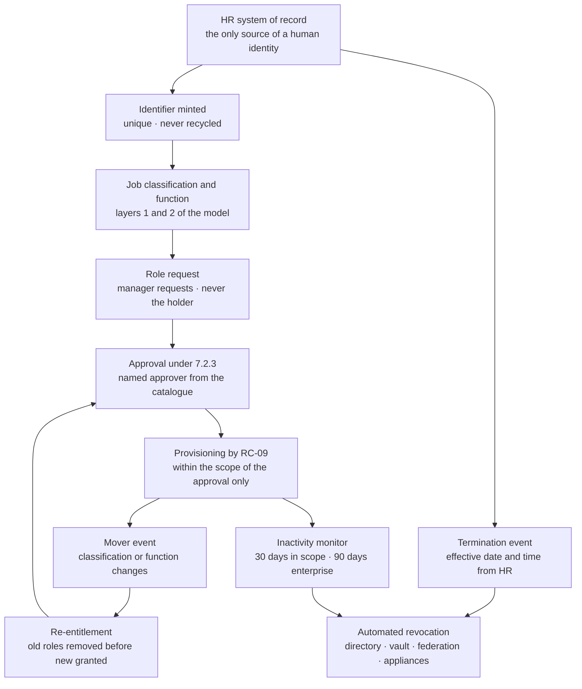

# 05.04 — Identity and Account Lifecycle

| Field | Value |
|---|---|
| Document ID | MRG-PCI-2026-504 |
| Program | Marketa Retail Group — PCI DSS v4.0.1 Compliance Program |
| Phase | 05 — Access Control &amp; Physical Security |
| Version | 1.0 |
| Status | Approved |
| Owner | Trevor Kim, Director of Infrastructure &amp; Network |
| Approver | Naomi Bhatt, Chief Information Security Officer |
| Date | 2026-07-15 |
| Classification | Confidential — Cardholder Data Environment // Illustrative Portfolio Sample |

## Purpose

Requirement 7 decides what an identity may do. **Requirement 8 establishes that the identity exists, belongs to exactly one person, and stops existing when the person stops needing it.** This document delivers **8.1** and **8.2** across a workforce of about **34,000** that grows by **+6,800** between October and January.

The sections that follow take the sub-requirements in the order the lifecycle produces them rather than in numeric order: **8.1.1 and 8.1.2** in §1, **8.2.1** unique identification in §2, **8.2.4** the add–change–delete lifecycle in §3, **8.2.2** shared and generic accounts in §4, **8.2.8** idle re-authentication in §5, **8.2.5** termination in §6, **8.2.6** inactivity in §7, **8.2.7** third-party access in §8, and the service-provider-only **8.2.3** in §9.

Authentication itself — factors, strength, MFA — is **05.05**. Application and system accounts are **05.07**; they are not users, they are not in the joiner–mover–leaver process, and conflating the two populations is the most common way an entity fails both 8.2 and 8.6.

## 1. Policies, Roles and the System of Record — 8.1.1 and 8.1.2

| Element | Position |
|---|---|
| Policy | The Identity and Access Management Policy, adopted formally in Phase 07 under 12.1.1, reviewed at least annually, acknowledged by all colleagues at onboarding and at each annual awareness cycle |
| Procedures | Joiner, mover, leaver, contractor, third-party access and emergency access procedures, each with a named owner and a documented escalation path |
| Roles and responsibilities | Documented in 01.07 and restated in 05.01 §2; the accountable owner for Requirement 8 is **Trevor Kim** |
| **System of record** | The **HR system of record** is authoritative for every human identity, including contractors. There is no second source, and no identity may be created from any other source — §3 |
| Communication | Requirement 8 obligations are communicated at onboarding, at each password change, at annual acknowledgement, and through 12.6.3 awareness content at **97.1% completion** |

The single-system-of-record rule is not a preference. Cycle 1 of the access review found **19 contractor accounts** whose engagement had been recorded in a spreadsheet held by the engaging manager, which meant they had no joiner record, no termination trigger and no job classification against which any role could be validated. Every assumption in 05.01's four-layer model failed for those nineteen people silently and simultaneously. The correction — routing contractor engagement through the HR system with a mandatory assignment end date — migrated **1,340 contractor records** in April 2026 and is the reason the lifecycle described below can claim to be complete.

## 2. Unique Identification — 8.2.1

8.2.1 requires all users to be assigned a unique ID **before access to system components or cardholder data is allowed**. The word doing the work is *before*.

| Control | Implementation |
|---|---|
| Identifier issuance | A unique, non-reusable identifier is minted by the HR system of record at worker creation and propagated to the directory. **Identifiers are never recycled**, including for rehires — a rehired colleague receives a new identifier linked to the prior record for HR purposes only |
| Sequencing | Access provisioning is downstream of identity creation by construction. There is no provisioning path that accepts a name without an identifier |
| Coverage across the 71 | Every authentication event on every assessed component resolves to a unique identifier — directly, or through the CT-04 assertion, or through the CT-11 check-out record for the shared accounts in §4 |
| Verification | Asserted continuously: no in-scope component holds a locally created user object outside the reconciled realms named in 05.01 §5; **zero** exceptions at 2026-07-15 |

Two populations are called out because they are where uniqueness usually breaks.

**Seasonal colleagues** receive an identifier at hire like anyone else, and their HR record carries an **assignment end date known on the day they are hired**. That date is the single most useful field in the entire lifecycle, and §6 explains why.

**POS operator identifiers** are unique per colleague across all 1,914 lanes. The point-of-sale application is not an assessed system component — the card data path is out of the CDE under P2PE, and the store estate is carried in the connected-to band for governance rather than assessed individually. Marketa nonetheless enforces unique operator identification there as a policy choice, and reports it as a policy choice rather than as compliance with 8.2.1 on a component the requirement does not reach.

## 3. The Lifecycle — 8.2.4

8.2.4 obliges the addition, deletion and modification of user IDs, authentication factors and other identifier objects to be managed **with appropriate approval** and **implemented only within the scope of that approval**. The second clause is the one that gets tested, and it is the reason the reconciliation diff in 05.03 §2 reads the enforcement plane rather than the request system: an implementation that exceeded its approval looks identical to an approved grant in the ticket queue.

| Event | Trigger | Elapsed target | Control |
|---|---|---|---|
| **Joiner** | HR worker record reaches active status | Identity available at start date; **no role granted by default** | The classification makes roles *available*; a manager must still request and an approver must still approve |
| **Mover** | Classification or function changes in HR | **Old roles removed at the effective date; new roles require fresh approval** | Additive re-entitlement is prohibited. A mover is a leaver and a joiner executed together |
| **Leaver** | Termination effective date and time in HR | See §6 | |
| **Contractor** | Engagement recorded in HR with a **mandatory assignment end date** | Automatic disablement at the end date without any human action | The gap Cycle 1 found; closed April 2026 |
| **Seasonal** | Hire with an assignment end date known at hire | Automatic disablement at the end date | Treats **R-13** structurally rather than by campaign |

### 3.1 Movers are where lifecycles actually fail

Leavers get attention because they are visible. Movers are the population that quietly accumulates access, because the natural implementation — grant the new access, leave the old in place until someone notices — is also the easiest one.

| Measure, 2026-02-16 to 2026-07-15 | Enterprise | In-scope population |
|---|---|---|
| Joiner events | **8,914** | **14** |
| Mover events | **2,207** | **23** |
| Leaver events | **7,662** | **9** |
| Movers whose prior access was removed at the effective date | 98.4% | **23 of 23** |
| Movers requiring a fresh approval for the new role | n/a | **23 of 23**; 2 were refused and the person moved without the access they had assumed they would carry |

The two refusals are recorded because they are the evidence that mover re-entitlement is a decision rather than a transfer. In both cases an engineer moving between platform teams expected to retain **RC-19**; in both cases the receiving manager did not request it, and nobody noticed the loss for six weeks — which is itself the answer to whether it was needed.

Enterprise mover compliance is **98.4%**, not 100%. The 35 exceptions in the period were store colleagues transferring between locations where a store-system group persisted past the effective date, none of them in the assessed population, all corrected at the next reconciliation. Reported rather than rounded up.

## 4. Shared, Group and Generic Accounts — 8.2.2

8.2.2 permits shared, group and generic accounts only where **necessary on an exception basis**, requiring that use is prevented unless needed, that they are used only for the time needed, that the business justification is documented and explicitly approved by management, that individual user identity is confirmed before access is granted, and that every action taken is **attributable to an individual user**.

Marketa has **eleven**.

| Account class | Count | Components | Business justification | Individual accountability |
|---|---|---|---|---|
| **CDE break-glass** | **8** | One per CDE-01 to CDE-08 | Recovery of a CDE component when the directory, the federation service or the brokering path is unavailable — the precise circumstances in which a per-user account cannot be authenticated | Credential sealed in CT-14; release requires **two named individuals**; the releasing identities are recorded, the session is recorded, and use raises a P1 alert to Marcus Hale and Naomi Bhatt |
| **Boundary and vault cluster recovery** | **3** | CT-11, CT-43, CT-50 | Recovery of the brokering and boundary planes themselves, which cannot depend on the brokering plane | As above, with the additional constraint that release of the CT-11 account requires Naomi Bhatt personally |
| **Total** | **11** | | | |

| Control | Implementation |
|---|---|
| Use prevented unless needed | Credentials are not held by any person. They exist only as sealed material in CT-14 and are not valid until released |
| Used only for the time needed | Credential is **rotated automatically on check-in**, and unconditionally within 4 hours of release whether checked in or not |
| Documented justification and management approval | One approved justification per account, signed by Naomi Bhatt, reviewed at each six-monthly access review |
| Every action attributable | Full session recording through CT-11; where CT-11 itself is the target, an out-of-band recorded session with a second person present as observer |
| Detection | Any authentication by one of the eleven raises a **P1** regardless of whether it was authorised, because an authorised break-glass event is still an event |

**Uses in the period: 2.** Both were controlled tests during the 2026-06-20 disaster-recovery exercise, both pre-notified, both fully recorded, both followed by credential rotation. **Zero unplanned uses.**

There are no generic accounts used for day-to-day operations anywhere in the assessed population. No `admin`, no `svc-shared`, no team mailbox with a login. Where such accounts existed before the programme, they were either converted to named accounts or reclassified into the application and system account population governed by 05.07 — that reclassification is 24 of the 63 orphans found in access review Cycle 1.

## 5. Idle Session Re-Authentication — 8.2.8

8.2.8 requires that if a user session has been idle for **more than 15 minutes**, the user must re-authenticate to reactivate the terminal or session.

| Access path | Idle threshold | Behaviour at threshold | Re-authentication requirement |
|---|---|---|---|
| CDE-06 secure desktop sessions | **15 minutes** | Session locked, screen blanked, watermark retained | Full re-authentication including the MFA factor |
| CT-08, CT-09, CT-10 jump host sessions | **15 minutes** | Session locked; **disconnected at 30 minutes**, killed at 60 | Full re-authentication and a fresh CT-11 check-out if the check-out has expired |
| CDE application sessions (CDE-01, CDE-03, CDE-04, CDE-07) | **15 minutes** | Application session invalidated server-side, not merely hidden | Full re-authentication |
| Administrative consoles on connected-to components | **15 minutes** | Console session terminated | Full re-authentication |
| Vendor-hosted control planes | **15 minutes** where configurable; **enforced at the CT-04 federation layer** where the SaaS platform's own minimum is longer | Assertion lifetime bounded so the platform cannot outlive the enforced idle window | Re-assertion, which requires re-authentication |

Two points of precision, because both are commonly got wrong.

**8.2.8 is re-authentication, not session length.** A session that is locked and can be resumed by moving the mouse has not met the requirement. Marketa's implementation invalidates the session server-side, so resumption requires the authentication factors again, and the quarterly control test attempts exactly that: idle a session for 16 minutes, move the mouse, confirm that a full authentication is demanded.

**Presence detection is not permitted as a substitute.** No in-scope path uses proximity, camera presence, activity simulation or any mechanism whose effect is to prevent the idle timer from firing. The rule Marketa recorded is short: **a moving mouse is not a person.** This was raised as a request by Payment Operations during the build, on the reasonable grounds set out below, and it was refused.

The cost is real and is reported. Dispute analysts working a case queue re-authenticate a **mean of 11.3 times per working day**. That is a genuine friction and it generated the programme's largest volume of user complaints — 41 tickets in the six weeks after enforcement. What was done about it was to reduce the *cost* of each re-authentication rather than its frequency: a FIDO2 security key tap satisfies both factors in under two seconds where the platform supports it, which took the median re-authentication from 22 seconds to **4 seconds**. Complaints fell to two in the following six weeks. **The friction that gets a control removed is usually the friction that could have been engineered away.**

## 6. Termination — 8.2.5

8.2.5 requires access for terminated users to be **immediately revoked**. The standard does not define "immediately", so Marketa does, and states the definition where an assessor can test it.

| Marketa's definition | Value |
|---|---|
| Trigger | The HR termination **effective date and time**, not the date the manager files the paperwork |
| Target for the in-scope population | **≤ 15 minutes** from the effective time, fully automated |
| Target for the enterprise population | ≤ 30 minutes, fully automated |
| Involuntary terminations | Access revoked **before** notification, via a pre-emptive revocation path invoked by HR and Security together |
| Emergency manual path | A named on-call identity administrator can revoke within **15 minutes** at any hour; exercised monthly as a drill, not only when needed |

| Measure, 2026-02-16 to 2026-07-15 | Enterprise | In-scope population |
|---|---|---|
| Leaver events | **7,662** | **9** — 6 voluntary, 3 involuntary |
| Median time from effective time to full revocation | **11 minutes** | **4 minutes** |
| Maximum | 4 hours 12 minutes | **22 minutes** |
| Involuntary terminations revoked before notification | n/a | **3 of 3**, median **3 minutes before** |
| Within the stated target | **99.2%** | **9 of 9** |

Revocation is not a single act. The automated sequence disables the directory account, revokes the CT-04 federation sessions already issued, removes CT-11 vault enrolment, revokes cloud federation at CT-07, invalidates active application sessions, and queues removal from the 19 locally reconciled realms named in 05.01 §5. **The first five complete in seconds. The sixth is the long pole**, and the 22-minute in-scope maximum was one of them — a departing store-systems engineer holding accounts on the CON-03 appliances, where removal is a per-appliance operation against a vendor-locked management interface.

That outlier is worth naming because it recurs. The same nineteen components that hold a locally reconciled authorisation realm, that carry the password-only accounts in the 8.3.9 population, and that produced 05.03's slowest revocation, are the same nineteen. **The structural weakness is not authentication, or access control, or lifecycle. It is that Marketa does not own the platform**, and each requirement family expresses that fact in its own vocabulary.

The enterprise 4-hour-12-minute maximum was a store colleague whose termination was entered retroactively; the effective time preceded the HR entry. Automation cannot revoke before it is told, and the corrective action was to the HR process rather than to the identity platform.

### 6.1 The seasonal population

**R-13** describes up to 6,800 temporary colleagues onboarded at speed in October and offboarded slowly or not at all in February — inside the change freeze, at peak transaction volume.

Marketa's treatment is structural rather than procedural: **the assignment end date is known on the day the person is hired**, it is a mandatory field, and disablement at that date requires no manager action, no campaign, no February sweep and no exception to the change freeze because disabling an account is not a change to a system. A manager who needs a seasonal colleague to stay must extend the record, which is an affirmative act with an approver.

The mechanism has not yet run a full cycle. It was implemented in April 2026 and the seasonal intake begins in October. **Nothing in this document demonstrates it works**, and R-13 is held at Moderate 12 accordingly. The February 2027 close-out is the evidence, and it is scheduled as a programme deliverable rather than left to be observed.

## 7. Inactive Accounts — 8.2.6

8.2.6 requires inactive user accounts to be removed or disabled **within 90 days of inactivity**.

| Population | Threshold | Rationale | Disabled in the 12 months to 2026-06-30 |
|---|---|---|---|
| Enterprise user accounts | **90 days** | The requirement's floor | **1,847** |
| **In-scope catalogue roles** | **30 days** | A stricter policy choice, not a requirement. An in-scope account unused for a month is an account whose need has not been demonstrated recently, and the population is small enough that a false positive costs one re-enablement rather than a service desk queue | **3** |
| Break-glass accounts under §4 | **Exempt from inactivity disablement, and permanently disabled by design** | An account that is never used is exactly what a break-glass account should be. Disabling it for inactivity would be a category error | n/a |

The break-glass exemption is recorded explicitly because it is the row an assessor will query. These accounts are not "active but unused"; they hold no valid credential at rest and are unusable until a dual-authorised release. **Applying an inactivity rule to them would remove a recovery control on the grounds that the recovery had not been needed.**

Marketa's inactivity measure is **last successful authentication**, not last directory-object modification. The distinction matters: an account touched by a policy refresh has not been used, and a monitor that counts object modification as activity will never disable anything.

## 8. Third-Party Remote Access — 8.2.7

8.2.7 requires accounts used by third parties to access, support or maintain system components to be managed as follows: **enabled only during the time period needed and disabled when not in use**, and **use monitored for unexpected activity**.

| Provider | Individuals | Path | What they reach | Activation model |
|---|---|---|---|---|
| **Northbridge Managed Services** | **14** | CT-13 gateway | After-hours SOC monitoring across the security estate in Z3 | Standing shift-window activation, automatically bounded to the rostered shift; outside the roster the accounts are disabled |
| **Verition POS Systems** | **6** | CT-11 brokered session | The 9 CON-03 vendor-locked POS back-office appliances | Per-incident activation only |
| **Cadence Voice Solutions** | **3** | CT-11 brokered session | CT-58, CT-59 telephony boundary | Per-change activation only |
| **Appliance vendor support — storage and hypervisor** | **4** | CT-11 brokered session | CT-38, CT-39 | Per-incident activation only |
| **Truvance Payments** | **0** | — | **No inbound access to Marketa.** The integration is outbound from CDE-05 and CDE-07 | n/a |
| **Total** | **27** | | | |

| Control | Implementation | Evidence in the period |
|---|---|---|
| Disabled when not in use | Default state is disabled. Enablement requires an approved activation request naming the purpose, the components and the window | **214 activation windows** |
| Enabled only for the time needed | Automatic disablement at window expiry; extension requires a fresh approval | Median window **3.2 hours**; longest 11 hours; **6 extensions** requested, 5 approved |
| Monitored when in use | Every session brokered and **recorded** through CT-11 or CT-13; SOC watches the session live for the 4 providers reaching CDE-adjacent components | **214 of 214** sessions recorded |
| Unexpected activity | Alerting on any authentication outside an approved window, any component touched outside the request, and any command outside the provider's profile | **4 alerts.** Three were Northbridge analysts authenticating four to nine minutes before their rostered shift start; one was a Verition engineer touching a tenth appliance not named in the request, which was legitimate and had been omitted from the request. All four closed; the roster boundary was given a 15-minute grace window and the request template was changed to require the appliance list to be selected rather than typed |

That Truvance holds **zero** inbound access deserves the emphasis it gets. Truvance is the hosted checkout, the gateway and the single token vault across all three channels — **R-09**, the concentration risk scored High 15. Concentration risk at a provider is a real exposure and it is not the same exposure as provider access into Marketa's estate. The programme records that the largest provider dependency carries the smallest access footprint, and does not allow the first fact to be treated as mitigated by the second.

## 9. Service-Provider-Only Requirements — 8.2.3

**8.2.3 is an additional requirement for service providers only.** It obliges a service provider with remote access to customer premises to use a unique authentication factor for each customer.

**Marketa is a Level 1 merchant, not a service provider. 8.2.3 does not apply.**

It is important to be precise about what that means for the ROC. Service-provider-only requirements — 8.2.3, 8.3.10, 8.3.10.1, and the others listed in the Phase 02–04 addenda such as 11.4.6, 12.5.2.1, 12.5.3 and 3.6.1.1 — **were never part of the 306 applicable sub-requirements**. They are not among the ROC's four **Not Applicable** entries. Those four are merchant-applicable sub-requirements determined not to apply to Marketa's specific environment, and Phase 08 names them individually. A requirement that never entered the applicable population cannot be marked Not Applicable within it; recording it that way would inflate the assessed population with obligations that were never Marketa's.

The inverse observation is worth one line: **Marketa's providers are bound by 8.2.3 in their own assessments**, and the assurance Marketa obtains over Truvance, Cadence, Verition and Northbridge under 12.8.4 covers it. That is Phase 06's subject, not this document's.

## 10. What This Lifecycle Does Not Establish

| Claim | Position |
|---|---|
| That the seasonal control works | It has never run. Implemented April 2026, first exercised October 2026, first proved February 2027. **R-13** is held at Moderate 12 and the close-out is a scheduled deliverable |
| That 100% of in-scope leavers within target proves the control | Nine leavers is nine data points. The enterprise figure of 99.2% across 7,662 events is the statistically meaningful one, and it is not 100% |
| That "immediately" means what Marketa says it means | The standard does not define it. Marketa defines it as ≤15 minutes for the in-scope population, states the definition, measures against it and reports the outliers. An assessor may hold a different view and the evidence supports the conversation either way |
| That third-party access is fully controlled | Twenty-seven external individuals reach in-scope components under an activation model with recording and alerting. Four alerts fired in the period and all four were benign, which tells us the alerting works and tells us nothing about whether it would catch a competent adversary |
| That the 19 locally reconciled realms are equivalent to the rest | They are not, and §6 says so plainly. They are slower to revoke, they hold the password-only accounts, and they are the subject of 05.06 |

## Cross-References

| Reference | Relevance |
|---|---|
| 02.08 — Connected-To &amp; Security-Impacting Systems | CT-11, CT-13, CT-04, CT-07 — the enforcement and brokering planes the lifecycle acts on |
| 03.11 — Risk Register | **R-13** seasonal access; **R-21** phishing into administrative paths; **R-18** privileged access hygiene |
| 05.01 — Access Control Principles | The four-layer model; **ACP-4**, **ACP-5** and **ACP-8** implemented here |
| 05.02 — Role Definitions &amp; Access Model | The 24 roles a joiner may be granted and a mover must be re-approved for |
| 05.03 — Access Reviews | The 63 orphans and the 19 contractors that drove §1; the reviews that verify this lifecycle |
| 05.05 — Authentication &amp; MFA | 8.3 and 8.4 — the factors this lifecycle issues and revokes |
| 05.06 — Customized Approach for 8.3.9 | The 19 locally reconciled components named in §6 |
| 05.07 — Application &amp; System Accounts | The non-human population deliberately excluded from this lifecycle |
| Phase 08 — QSA Assessment &amp; ROC Production | The four Not Applicable entries, and why 8.2.3 is not one of them |

---
[⬅ Previous](05.03-access-reviews.md) · [🏠 Phase 05 Home](05.00-README.md) · [Next ➡](05.05-authentication-and-mfa.md)
