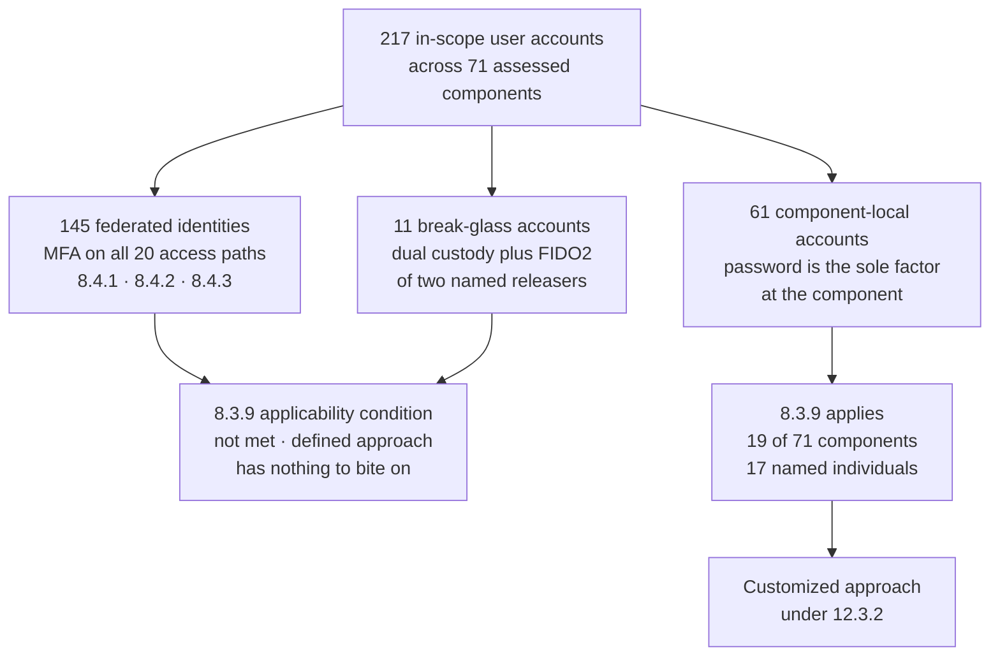

# 05.06 — Customized Approach for Requirement 8.3.9

| Field | Value |
|---|---|
| Document ID | MRG-PCI-2026-506 |
| Program | Marketa Retail Group — PCI DSS v4.0.1 Compliance Program |
| Phase | 05 — Access Control &amp; Physical Security |
| Version | 1.0 |
| Status | Approved |
| Owner | Trevor Kim, Director of Infrastructure &amp; Network |
| Approver | Naomi Bhatt, Chief Information Security Officer |
| Date | 2026-07-15 |
| Classification | Confidential — Cardholder Data Environment // Illustrative Portfolio Sample |

## Purpose

This is the only customized approach in the Marketa Retail Group PCI DSS v4.0.1 programme. **One requirement out of 306.**

Every other applicable sub-requirement is assessed under the defined approach — 302 of them without qualification and three with a compensating control. Requirement **8.3.9** is the single case where Marketa concluded that implementing the stated control would work against the security outcome the requirement exists to produce, and elected instead to meet the **Customized Approach Objective** by other means, with a targeted risk analysis under **12.3.2**, an Appendix E1 controls matrix, and testing procedures **derived by the QSA**.

The document delivers all of it:

| Section | Content |
|---|---|
| §1 | What 8.3.9's defined approach requires — both options |
| §2 | **The bounded population** — how 217 in-scope user accounts reduce to 61 |
| §3 | The decision to use the customized approach at all, and the bar it had to clear |
| §4 | Why the first defined-approach option — 90-day rotation — was rejected, with evidence |
| §5 | **Why the second defined-approach option was not simply stretched to cover it** |
| §6 | The **Customized Approach Objective**, quoted |
| §7 | The **targeted risk analysis under 12.3.2** |
| §8 | The **controls matrix**, Appendix E1 style |
| §9 | The **testing procedures derived by Sable Ridge Assurance**, not by Marketa |
| §10 | Evidence of effectiveness in the operating window |
| §11 | **What this costs, every year, forever** |
| §12 | What it does not claim |

A note on the framing carried from Phase 01 and repeated here unchanged, because it is the hinge of the whole argument: **Requirement 8.4.2 mandates MFA for all access into the CDE, which removes password-only *user* access to the eight CDE components entirely.** The customized approach therefore does not apply to the CDE at all. It applies to a residual population on **connected-to and vendor-managed** systems where a password remains the sole factor at the component.

## 1. What 8.3.9 Requires Under the Defined Approach

Requirement 8.3.9 applies **if** passwords or passphrases are used as the **only** authentication factor for user access — that is, in any single-factor authentication implementation. Where that condition is met, the defined approach offers two alternatives, and the entity must satisfy one of them.

| Option | The stated requirement | What it demands in practice |
|---|---|---|
| **Option A** | Passwords/passphrases are **changed at least once every 90 days** | A calendar-driven rotation applied to every account in the population |
| **Option B** | The **security posture of accounts is dynamically analysed**, and **real-time access to resources is automatically determined** accordingly | A decision point that evaluates account posture and determines access **at the moment access is sought** |

The two are alternatives, not a sequence. An entity meeting either meets 8.3.9 under the defined approach.

Marketa met neither, deliberately, and elected the customized approach. §4 explains the rejection of Option A on evidence. §5 explains the rejection of Option B on a technical fact about the population, and is the more important of the two sections because it is where most entities in Marketa's position quietly overclaim.

## 2. The Bounded Population

The customized approach does not cover Requirement 8.3.9 across Marketa's whole estate, because 8.3.9 does not *apply* across Marketa's whole estate. Its applicability condition — a password as the **only** factor — is not satisfied for the overwhelming majority of in-scope user accounts.

### 2.1 Derivation

| Population | Accounts | Disposition under 8.3.9 |
|---|---|---|
| Enterprise directory and federated identities used across the 71 assessed components | **145** — 118 internal, 27 external | **MFA is enforced on all 20 access paths** in 05.05 §13. A password is never the sole factor. **8.3.9's applicability condition is not met** |
| Shared, group and generic accounts — the 11 break-glass accounts in 05.04 §4 | **11** | Multi-factor by construction: a sealed dual-custody credential plus the FIDO2 factor of each of two named releasers. Governed by 8.2.2 and exception MFA-EX-04. **Condition not met** |
| **Component-local user accounts where a password is the sole authentication factor at the component itself** | **61** | **The 8.3.9 population. This is the scope of the customized approach** |
| **Total in-scope user accounts** | **217** | |

### 2.2 The sixty-one, by class

| Class | Components | Accounts | Individuals | Why a password is the sole factor at the component |
|---|---|---|---|---|
| **P1** | The **9 CON-03 vendor-locked POS back-office appliances** | **36** | 4 store-systems engineers, each holding an individual account on each of the nine | Vendor firmware supports local password authentication only. No RADIUS, no TACACS+, no SAML, no WebAuthn. The support contract prohibits modification of the appliance software |
| **P2** | CT-46, CT-47, CT-49, CT-58, CT-59, CT-60 — **local fallback accounts** | **12** | 2 senior engineers per component class | These are the accounts of last resort, used when the central authentication path is unreachable. **By definition they cannot depend on the central authentication path**, and therefore cannot depend on the MFA service that sits behind it |
| **P3** | CT-39 storage array management local realm | **4** | 4 | The running firmware release does not support external authentication integration. The upgrade that would provide it is scheduled outside the seasonal freeze |
| **P4** | Vendor support tiers on 2 vendor-hosted control planes (CT-33, CT-54) | **6** | 6 | The provider's support-tier login sits outside Marketa's federation and the provider offers no MFA on that tier. A 12.8.5 responsibility item, raised at the quarterly TPSP review |
| **P5** | CT-38 hypervisor management local realm | **3** | 3 | Local realm retained for cluster recovery. The SSO realm is the normal path and is MFA-protected; the local realm exists for the case where SSO is what has failed |
| **Total** | **19 of 71 components** | **61** | **17 distinct individuals** | |

### 2.3 The conservative reading, and why Marketa took it

There is a legitimate argument that most of these accounts are not single-factor at all.

Every one of the 61 is reached through a CT-11 brokered session or a named management subnet, and the human who reaches it has **already presented two factors** at the broker. Under that reading, the *access path* is multi-factor, 8.3.9's applicability condition fails for all 217 accounts, and Marketa would need no customized approach whatsoever.

Marketa rejected that reading and recorded the rejection as **ADR-0014**.

| Argument | Position |
|---|---|
| The broker enforces MFA, so the access is multi-factor | **Rejected as the basis for a compliance claim.** The credential on the component is protected by a password and nothing else. Anyone who reaches the management interface by a route the broker does not mediate needs only that password |
| No such route exists | **True for 6 of the 19 components, and proved by test** — that is how exception MFA-EX-02 was closed in 05.05 §15.1. It is **not** proved for the other 13, and for P2 in particular the entire purpose of the account is to work when the broker does not |
| The conservative reading costs Marketa a customized approach it could have avoided | **Correct, and accepted.** The programme preferred to hold a defensible, tested position over a population of 61 rather than an elegant argument over a population of zero |
| The conservative reading is what an adversary uses | The decisive point. **A threat model does not care which control the entity credits.** If the password is the only thing standing between an attacker on the management subnet and the appliance, then the password is the only thing standing there |

This decision is the reason this document exists. It would have been entirely possible to write a paragraph asserting that MFA at the broker satisfies 8.3.9 estate-wide and to move on. That paragraph would have been arguable, unfalsifiable, and untested — and it would have left 61 accounts protected by a password with no analysis of what protects them.

## 3. The Decision to Use the Customized Approach

The customized approach is not a lighter option. It is a heavier one, and Marketa's Steering Committee set an explicit bar before permitting its use anywhere in the programme, recorded in 01.05 §6:

> **The customized approach is a tool for the small number of cases where the defined requirement demonstrably works against the security outcome it exists to produce. Everywhere else, it is a way of turning a solved problem into an unsolved one.**

| Test the proposal had to pass | 8.3.9's answer |
|---|---|
| Does the requirement offer a Customized Approach Objective? | **Yes.** Not every requirement does; where none is stated, the customized approach is unavailable |
| Is there evidence — not opinion — that the defined approach degrades the outcome? | **Yes.** §4 |
| Has the second defined-approach option been genuinely examined and found not to fit? | **Yes.** §5 |
| Is the population bounded, enumerable and stable? | **Yes.** 61 accounts, 19 components, 17 individuals, enumerated in §2.2 and reconciled monthly |
| Is the entity prepared to pay the recurring assessment cost, every year? | **Yes**, with the cost quantified in §11 and approved by the CFO |
| Is the entity prepared for there to be **no fallback** if the approach fails at assessment? | **Yes.** A customized approach cannot be combined with a compensating control for the same requirement. If it fails, the requirement fails |

**Approved as ADR-0014**, 2026-04-15. Two other candidate uses of the customized approach were proposed during the programme — one for 8.3.6's character minimum on an appliance population and one for 10.6.1 time synchronisation on the store estate — and **both were refused** on the second test. In each case the defined approach was inconvenient rather than counterproductive, and inconvenience is not the trigger.

## 4. Why Not Option A — 90-Day Rotation

The rejection of calendar rotation is evidence-based rather than doctrinal. Marketa operated 90-day rotation across this population until 2025 and measured what it produced.

| Measure | Under 90-day rotation, 2024–2025 | After rotation was suspended, 2026 | Source |
|---|---|---|---|
| Passwords differing from their predecessor only by an incremented trailing character, a case change or a single substitution | **71%** of changes on the P1 and P2 populations | n/a — no scheduled changes occur | Offline credential audit, 2025-11; repeated 2026-06 |
| Mean measured credential strength on the population | Equivalent to **≈ 34 bits** of guessing resistance against a rule-aware attacker | **≈ 62 bits** after the 16-character minimum and corpus screening | Offline credential audit |
| Credentials found in a known-breached corpus at audit | 4 of 61 | **0 of 61** | Corpus screening, continuous |
| Credentials written down or stored in an unapproved location, found at inspection | 9 instances across 4 store-systems engineers | 1 instance | Physical inspection during store visits |
| Help-desk-assisted password resets, whole enterprise | **3,940 per quarter** | **610 per quarter** | Service desk records |
| Rotation events per year on the 61 | 244 scheduled changes | 0 scheduled; **14 event-driven changes** | Change records |

Four separate mechanisms were at work, and all four ran against the requirement's own objective.

**Predictable increments.** A person forced to invent a new 16-character secret four times a year does not invent four unrelated secrets. Seventy-one per cent of the observed changes were transformations an attacker with the previous password could enumerate in fewer than fifty guesses. A history depth of four does nothing against this; only the similarity checking in 05.05 §8 does, and similarity checking is a control Marketa added *instead of* rotation, not alongside it.

**Reuse across boundaries.** An engineer holding an individual account on each of nine appliances, rotating quarterly, converges on one password used in nine places. That converts a single appliance compromise into nine.

**Written credentials.** The nine instances found at inspection are the physical expression of the same pressure.

**A manufactured social-engineering surface.** Rotation generated a service-desk reset queue, and a reset queue is a channel where a stranger asks a helpful person to change an authentication factor. The volume fell by **84%** when rotation stopped and self-service with MFA replaced it. **The most valuable security effect of abandoning rotation was not on the credentials at all; it was on the help desk.**

The conclusion the programme recorded: **a rotation mandate on a small population of long, screened, monitored credentials measurably reduces the strength of those credentials and increases the attack surface around them.** Option A does not merely fail to advance the Customized Approach Objective for this population. It retreats from it.

## 5. Why Option B Was Not Simply Stretched

This is the section that separates a defensible customized approach from a decorative one, and it is where an entity is most tempted to save itself the work.

Option B permits an entity to meet 8.3.9 by **dynamically analysing the security posture of accounts** and **automatically determining real-time access to resources accordingly**. Marketa operates continuous behavioural authentication analytics. The temptation was obvious: describe the analytics, claim Option B, avoid the customized approach entirely, and save the recurring assessment cost quantified in §11.

The programme did not do that, for one technical reason.

| The requirement's wording | What Marketa's analytics actually do |
|---|---|
| The security posture of accounts is **dynamically analysed** | **Yes.** Every authentication event on the 61 is scored in real time against a per-account behavioural baseline — source address, source device, time of day, session duration, command profile, concurrency |
| **Real-time access to resources is automatically determined** accordingly | **Not for every account in the population.** For classes **P1, P2 and P5 — 51 of the 61 accounts** — the component performs authentication **locally, in its own firmware, without consulting any external decision point.** There is no hook, no callout, no policy agent and no way to insert one. The analytics observe the authentication after it has been admitted |

What the analytics can do, once the event is observed, is terminate the session, suspend the account at every place Marketa controls, block the source at the boundary, and alert — typically within **8 to 40 seconds**. That is a strong control and it is genuinely valuable. **It is not a real-time access determination.** It is post-admission response. The difference is a window of seconds in which the attacker holds an authenticated session on the component, and the requirement's wording places the decision *before* access, not after it.

| Class | Accounts | Can the analytics gate admission? | Position |
|---|---|---|---|
| P1 — vendor-locked appliances | 36 | **No.** Local firmware authentication, no external decision point | Option B cannot be claimed |
| P2 — local fallback accounts | 12 | **No**, and by design — the account exists for when external services are unreachable | Option B cannot be claimed |
| P5 — hypervisor local realm | 3 | **No.** Local realm authentication | Option B cannot be claimed |
| P3 — storage array local realm | 4 | **Partially.** Admission can be blocked at the network layer on a pre-computed risk state, but not on an evaluation of the event itself | Not sufficient to claim |
| P4 — provider support tiers | 6 | **No.** The provider's platform makes the decision; Marketa is not in the path | Option B cannot be claimed |

Fifty-one of 61 accounts cannot be gated at all, and the remaining ten only approximately. Claiming Option B would have meant asserting an automatic real-time access determination that **does not exist for 84% of the population**, on evidence consisting of a description of a monitoring platform.

That claim would probably have survived a light assessment. It would not have survived a competent one, and — the point the Steering Committee actually recorded — **it would not have survived contact with an adversary**, because the control being credited would not have been the control that was operating.

So the programme elected the customized approach: state the objective, describe the actual controls including their post-admission character, let the QSA derive testing procedures against the objective, and be tested on what is really there.

## 6. The Customized Approach Objective

Requirement 8.3.9's Customized Approach Objective, as stated in PCI DSS v4.0.1 and carried unchanged from 01.05 §7:

> **"Access by user accounts cannot be compromised via the use of a known or guessed password."**

Three properties of this wording govern everything that follows.

| Property | Consequence for the controls matrix |
|---|---|
| It is about **compromise of access**, not about the password's age | Rotation is one mechanism among several for making a password useless to an attacker. Nothing in the objective privileges it |
| It covers both **known** and **guessed** | Two distinct threat paths requiring distinct controls — credential *disclosure* (breach corpora, reuse, phishing, written credentials, shoulder surfing) and credential *derivation* (guessing, spraying, stuffing, brute force). §8 addresses them separately, and a matrix that only addresses guessing is incomplete |
| It says **cannot be compromised**, not **is less likely to be** | The bar is an outcome. The controls matrix must show why the combination makes compromise infeasible for this population, not merely that risk has been reduced |

## 7. The Targeted Risk Analysis — 12.3.2

**12.3.2** requires a targeted risk analysis for each requirement met with the customized approach, documenting each element specified in **Appendix D**, approved by senior management, and performed at least once every 12 months. This is that analysis.

| Field | Value |
|---|---|
| Analysis ID | **TRA-12.3.2-8.3.9** |
| Requirement | **8.3.9** — password/passphrase change frequency where a password is the only authentication factor for user access |
| Approach | **Customized**, under 12.3.2 and Appendix D |
| Scope of applicability | **61 user accounts** on **19 of the 71 assessed system components**, held by **17 named individuals** — §2.2. **No CDE component is in scope of this analysis** |
| Owner | Trevor Kim, Director of Infrastructure &amp; Network |
| Contributors | Marcus Hale (analytics and detection), Owen Castellanos (evidence and assessment liaison), Adaeze Nwosu (P1 store-systems population) |
| **Senior management approval** | **Naomi Bhatt, Chief Information Security Officer** — signed 2026-04-29. Reported to the PCI Steering Committee 2026-05-06 and to the Audit Committee 2026-07-21 |
| Date performed | 2026-04-08 to 2026-04-24 |
| Next review due | **2027-04-29**, and on any change to the population, the components or the control set |
| Relationship to the 14 | This is analysis **#10** in the 01.11 §6 register — the 12.3.2 entry, distinct from the thirteen 12.3.1 analyses |

### 7.1 Appendix D element coverage

| Appendix D element | Where it is discharged |
|---|---|
| Description of the requirement being met by the customized approach | §1 and §6 |
| **Controls matrix** documenting the implemented controls, how they meet the objective, and what could undermine them | **§8** |
| **Targeted risk analysis** of the customized implementation | §7.2 to §7.5 |
| Evidence of testing performed by the entity to demonstrate effectiveness | §8 (per-control testing) and §10 |
| Documentation approved by **senior management** | §7, signature row above |
| Review at least once every 12 months | §7, next review due row |
| Testing procedures **derived by the assessor** | **§9** — derived by Sable Ridge Assurance, not by Marketa |

### 7.2 Assets being protected

| Asset | Why it matters to this analysis |
|---|---|
| The **19 in-scope components** carrying the 61 accounts | None holds account data. Each is in scope because it holds an administrative, boundary or provisioning path relevant to the CDE — including CT-46, CT-47 and CT-49, which enforce store-estate segmentation, and CT-38 and CT-39, which hold provisioning and storage-presentation authority over the Z1 CDE hosts |
| The **segmentation state of 978 store systems and 1,914 POI devices** | Reachable through the P1 and P2 populations. This is the largest indirect exposure in the analysis and is why the population's small size is not the same as small impact |
| The **Z1 CDE hosts' underlying platform** | CT-38 and CT-39 can clone a volume or alter a host's presentation without any credential to the data on it — 02.08 §9 |
| The **P2PE scope reduction** | A compromised store-estate boundary can invalidate the conditions that remove 1,914 lanes and 482 servers from the assessed population — **R-05** |
| The audit and detection record | CT-58 to CT-60 determine what the telephony estate records and retains |

**The honest statement of impact: these 61 accounts protect a smaller amount of data than any CDE account and a larger amount of control than most of them.**

### 7.3 Threats the requirement protects against

| Threat | Path | Relevance to this population |
|---|---|---|
| **Known password — corpus reuse** | The individual reused a password that later appeared in a public breach | 4 of 61 matched a corpus at the 2025 audit under rotation; 0 of 61 today |
| **Known password — disclosure** | Written down, stored in an unapproved location, shared under operational pressure, phished | 9 written instances found under rotation; 1 since. The P1 population works in stores, away from a desk, on appliances behind locked cabinets |
| **Guessed password — targeted brute force** | An attacker with the management subnet and one identifier | Bounded by the 16-character minimum and 8.3.4 lockout |
| **Guessed password — spraying** | One common password against all 61 identifiers, below any single account's lockout threshold | The threat lockout does not address, and the reason CAC-5 exists |
| **Guessed password — credential stuffing** | Corpus credentials replayed at scale | Addressed at the point of set and daily thereafter by CAC-2 |
| **Post-authentication misuse** | A valid credential used by the wrong person, at the wrong time, from the wrong place | Outside the strict wording of the objective and inside its intent. CAC-3, CAC-4 and CAC-6 address it |

### 7.4 Factors contributing to likelihood and impact

| Factor | Direction | Basis |
|---|---|---|
| Population of **61 accounts** and **17 individuals** — small, named, individually known | **Reduces likelihood** | Every account has a named holder; anomaly baselining is meaningful at this size, which it would not be at 6,000 |
| **Network reachability is constrained** — all 19 components are reachable only from the CT-11 broker or a named management subnet, enforced at CT-43, CT-46 and CT-48 | **Strongly reduces likelihood** | An attacker must first hold a position that itself required MFA. Verified by the 11.4.5 segmentation testing |
| **Vendor-controlled platforms** with no configurable authentication | Increases likelihood | The root cause of the whole population. Marketa cannot fix it and does not control the roadmap |
| **3 of 19 components cannot enforce password history natively** | Increases likelihood | Recorded in 05.05 §8; addressed by CAC-8 offline auditing rather than by platform enforcement |
| The **P2 class exists precisely for when central services fail** | Increases likelihood at the worst moment | The account is used in exactly the circumstances where monitoring may also be degraded. The most uncomfortable factor in the analysis |
| **10.2.x logging and, from Phase 06, 10.4.1.1 automated review** over all 19 | Reduces impact | Not yet operating for a full cycle at the date of this analysis |
| Segmentation test history: **the first test failed** — R-14, still High 16 | Increases likelihood | The reachability constraint above is the same class of control that was proved ineffective at store 0417 in May 2026. The analysis does not treat it as unconditional |
| The four store-systems engineers in P1 work across 482 sites | Increases likelihood | Physical exposure, shared vehicles, laptop theft, shoulder surfing |

### 7.5 Resultant analysis

The combination of controls in §8 is judged to meet the Customized Approach Objective for this population, **conditional on four things remaining true**:

| Condition | Verified how | Failure means |
|---|---|---|
| Network reachability to all 19 components remains constrained to the broker and named management subnets | Continuous assertion; annual 11.4.5 segmentation testing | The likelihood factor that carries most of the analysis is gone; the approach must be re-analysed immediately |
| The behavioural analytics continue to produce a usable per-account baseline | Monthly baseline-quality report; alert on any account whose baseline degrades below the confidence threshold | An account without a baseline is outside the control and must be removed from the population or the population must be re-scoped |
| Corpus screening continues to run daily against the stored population | Daily job assertion under CA-1's silence rule | The "known password" half of the objective is unaddressed |
| The population does not grow beyond **80 accounts** or **25 components** | Monthly reconciliation against the register | Re-analysis; the baselining and named-individual arguments are population-dependent |

Any of the four failing is a **trigger for immediate re-analysis**, not a matter for the annual review.

## 8. The Controls Matrix — Appendix E1

Eight controls. For each: what is implemented, how it meets the objective, **what could undermine it**, how Marketa tests it and how often, and the measured result in the operating window **2026-04-10 to 2026-07-15**.

| ID | Implemented control | How it meets the objective | What could undermine it | Entity testing and frequency | Result in the window |
|---|---|---|---|---|---|
| **CAC-1** | **16-character minimum**, numeric and alphabetic, machine-generated on request, on all 61 accounts — exceeding 8.3.6's 12-character floor | Addresses **guessing**. Raises the offline and online search space beyond feasible derivation for a targeted attacker | A component that silently truncates or normalises a long password; a platform maximum below 16 | Automated verification of the enforced setting on all 19 components, **monthly**; length verified by set-and-test on a disposable account, **quarterly** | 19 of 19 enforce; **2 components truncate above 32 characters** — documented, and below the material threshold |
| **CAC-2** | **Known-compromised credential screening** at the point of set, plus a **daily** re-run of the full corpus against the stored population, with forced reset on match | Addresses **known** passwords directly — the half of the objective rotation never touched | Corpus staleness; a credential compromised but not yet published; screening job failure | Daily job assertion under CA-1's silence rule; **quarterly** planted-credential test in which a known-corpus value is set and must be rejected | **0 of 61** matched at any point; job ran **97 of 97** days; 4 quarterly planted tests, 4 rejections |
| **CAC-3** | **Per-account behavioural baselining** — source address, source device, time of day, session duration, command profile, concurrency — with a **risk score computed on every authentication event** | Detects use by someone other than the holder, which is the realised form of a compromised password | An attacker who reproduces the holder's pattern; baseline poisoning during the learning period; a holder whose work is genuinely irregular | Baseline confidence reported **monthly** per account; **quarterly** red-team style authentication from an anomalous source, device and hour | 61 of 61 baselines above the confidence threshold; **4 quarterly tests, 4 detections**, mean detection **11 seconds** |
| **CAC-4** | **Automatic session termination and account suspension** above the risk threshold, at every enforcement point Marketa controls — CT-11, the boundary, the directory where federated | Bounds the value of a compromised password to a window of seconds. **This is the post-admission control, and it is described as post-admission** — §5 | The component performs local authentication and cannot be gated; termination requires a path Marketa controls; a P2 event occurring while central services are down | **Quarterly** test measuring the interval from anomalous authentication to session termination | Mean **19 seconds**, longest **41 seconds**. **The window is real and is reported, not hidden** |
| **CAC-5** | **Spray and stuffing detection across the whole population** — a correlation rule at CT-18 firing on distributed low-rate failures against multiple identifiers, well below any single account's 10-attempt lockout | Addresses the guessing path that per-account lockout is structurally unable to see | Rule drift; a log source stopping; an attack slower than the correlation window | Rule tested by controlled generation **quarterly**; source health under 10.7.2 continuously | **4 of 4** controlled tests detected; **2 genuine detections** in the window, both credential stuffing against federated identities rather than these 61, both handled |
| **CAC-6** | **Network reachability constraint** — all 19 components reachable only from a CT-11 brokered session or a named management subnet, enforced at CT-43, CT-46 and CT-48 | An attacker must already hold a position that required MFA. **This control carries more of the objective than any other in the matrix** | Segmentation failure — **and Marketa has had one**, at store 0417 in May 2026, R-14, still High 16 | Continuous drift assertion DA-1 to DA-6; **annual** 11.4.5 penetration testing; **monthly** reachability probe from an unauthorised segment | 97 of 97 days asserted; monthly probes **4 of 4** blocked. **The May 2026 segmentation failure is the reason this row is not treated as unconditional** |
| **CAC-7** | **Rotation on event, not on calendar** — immediate forced change on any indicator of compromise, corpus match, holder departure or role change, suspected disclosure, or completion of any third-party engagement touching the account | Retains the one genuine benefit of rotation — invalidating a credential that may be known — without the four pathologies in §4 | An indicator that is not recognised; a slow indicator; a compromise with no indicator at all | Every rotation event logged with its trigger; **quarterly** review that every trigger class produced a rotation | **14 event-driven rotations**: 6 role change, 4 engagement completion, 3 suspected disclosure, 1 corpus match on a *federated* credential belonging to a holder, rotated here as a precaution |
| **CAC-8** | **Quarterly offline credential-strength audit** — a controlled password-audit exercise against the stored credentials of the population, conducted under change control by Marcus Hale with results retained | Measures the actual strength of the population instead of assuming the policy produced it. Also the compensating measure for the 3 components that cannot enforce history natively | The audit is itself a credential exposure; a platform whose store cannot be audited | **Quarterly**, under dual control, in an isolated environment, artefacts destroyed under 9.4.7 with a Halberd certificate | 2 audits in the window. **0 of 61 recovered** at a 72-hour compute budget. Mean strength ≈ **62 bits**, against ≈ 34 under rotation |

### 8.1 How the eight controls together meet the objective

| Half of the objective | Controls | The argument |
|---|---|---|
| **"…via the use of a known password"** | **CAC-2**, CAC-7, CAC-8, CAC-3 | A password becomes *known* through corpus exposure, disclosure or reuse. CAC-2 tests every credential against the largest available corpus daily — a test rotation never performs. CAC-7 invalidates on any indicator, which is what rotation was a crude approximation of. CAC-8 verifies empirically that the population is not derivable. CAC-3 catches use by a person who is not the holder, which is the only way a known password causes harm |
| **"…via the use of a guessed password"** | **CAC-1**, CAC-5, CAC-6, plus 8.3.4 lockout | CAC-1 removes online and offline derivation as a practical path. CAC-5 sees the distributed attack that lockout is blind to. CAC-6 requires the attacker to already be somewhere that required MFA before a single guess can be made |
| **"cannot be compromised"** — the outcome bar | **CAC-4**, CAC-6, CAC-3 | The residual is honest: for 51 of 61 accounts, admission cannot be gated, so a correct password admits a session for a mean of 19 seconds before termination. The claim is that reaching the position to try a password requires MFA, that the password itself is not derivable and is not known, and that use by the wrong party is detected and terminated in seconds |

**Marketa does not claim that rotation would have produced a better outcome for this population, and does not claim that the customized approach produces a perfect one.** §12 states the residual plainly.

## 9. Testing Procedures Derived by the QSA — Appendix E2

Under the customized approach, published testing procedures do not exist. **The assessor derives testing procedures specific to the implementation**, documents them in the ROC, and executes them.

**These procedures were derived by Sable Ridge Assurance, LLC — lead QSA Grant Whitfield, with Amara Osei — and not by Marketa Retail Group.** Marketa supplied the controls matrix, the targeted risk analysis and the evidence inventory; Sable Ridge determined independently what would have to be true for the objective to be met and how each of those things would be tested. Marketa reviewed the derived procedures for factual accuracy about its environment and made no request to soften any of them. That division is recorded because the credibility of a customized approach rests on it: **an entity that writes its own testing procedures has written its own assessment.**

Derived and agreed at the QSA checkpoint of **2026-06-24**. Execution is scheduled for fieldwork, **2026-11-02 to 2026-11-20**. Six of the twelve were dry-run in July 2026 at Marketa's request, to avoid discovering an unevidenceable procedure in November.

| ID | Derived testing procedure | Method | Evidence the assessor will obtain | Control tested |
|---|---|---|---|---|
| **CTP-1** | Verify the population is complete: reconcile the claimed 61 accounts against an independently obtained enumeration of user accounts on all 19 components, and against the full 71-component register, to confirm no password-only user account exists outside the declared scope | Examine · Test | Assessor-directed enumeration output; register reconciliation; exception list | Scope of the approach |
| **CTP-2** | Verify the 145 federated identities are genuinely excluded: sample 15 across all 20 access paths and confirm MFA is enforced, so that 8.3.9's applicability condition is genuinely unmet for them | Examine · Observe | Authentication records; conditional access policy export; observed logon | §2.1 derivation |
| **CTP-3** | Observe an attempt to set a password below 16 characters, and one at exactly 16, on each of the 19 components, using an assessor-nominated disposable account | Observe · Test | Screen observation with the assessor present; per-component result | CAC-1 |
| **CTP-4** | Supply an assessor-chosen credential known to be present in a public breach corpus and observe rejection at set. Separately, observe the daily corpus re-run detect a credential planted by the assessor on a disposable account, and confirm the forced reset occurs within one business day | Test · Observe | Rejection screen; forced-reset record; job execution log for the intervening period | CAC-2 |
| **CTP-5** | Authenticate to a nominated component from an assessor-chosen anomalous source, device and hour, using a credential supplied by Marketa for the test, and measure the interval to detection, to alert, and to session termination | Test · Observe | Analytics event record; alert record; termination timestamp; measured intervals | CAC-3, CAC-4 |
| **CTP-6** | Examine the baseline confidence report for **all 61** accounts, not a sample, and identify any account operating without a usable baseline. Interview Marcus Hale on the handling of any such account | Examine · Interview | Monthly baseline reports for the full period; exception handling records | CAC-3 |
| **CTP-7** | Generate a low-rate distributed authentication failure pattern across at least 12 identifiers, at a rate below the 10-attempt lockout threshold, and confirm the CT-18 correlation rule fires. Confirm the rule's log sources were healthy throughout | Test · Examine | Rule fire record; source health record for the test period | CAC-5 |
| **CTP-8** | Attempt to reach the management interface of a nominated component from a network position that is neither the CT-11 broker nor a named management subnet, and confirm the attempt fails. Repeat from a second position selected by the assessor rather than by Marketa | Test | Attempt records; boundary logs; segmentation configuration | CAC-6 |
| **CTP-9** | Examine all **14** event-driven rotations in the period. For each, confirm the trigger, the elapsed time to rotation, and that the rotation actually occurred on the component. Identify any qualifying trigger that did **not** produce a rotation | Examine | Rotation records; trigger records; component-side credential change evidence | CAC-7 |
| **CTP-10** | Examine both quarterly credential-strength audit reports, the compute budget applied, the dual-control record, and the destruction certificate for the artefacts. Interview Marcus Hale on methodology and on what result would have triggered escalation | Examine · Interview | Audit reports; dual-control record; Halberd destruction certificate | CAC-8 |
| **CTP-11** | Test the failure modes: confirm what happens to the 61 accounts if the analytics platform is unavailable, if a log source stops, and if the CT-11 broker is unavailable. Determine whether the objective is still met in each state, and for how long | Test · Interview | Failure-mode test records; the P2 class handling; the documented degraded-state position | CAC-3, CAC-4, CAC-6 |
| **CTP-12** | Examine the targeted risk analysis, the controls matrix and the senior management approval. Confirm the four conditions in §7.5 were monitored throughout the period, and examine what occurred on any date a condition was not satisfied | Examine · Interview | TRA and matrix with approval signature; condition monitoring records for all 97 days | The approach as a whole |

**CTP-11 is the procedure Marketa did not anticipate and considers the most valuable of the twelve.** It asks what the objective looks like when the controls carrying it are themselves degraded — which is precisely the state in which the P2 fallback accounts are designed to be used. The July dry run produced a finding against Marketa: the degraded-state position for the P2 class had not been documented at all. It now is, and the documentation exists because the assessor's independently derived procedure asked a question the entity's own matrix had not.

That is the argument for the customized approach in one paragraph. **The entity describes what it built; the assessor decides what would have to be true; and the gap between the two is where the real finding lives.**

## 10. Effectiveness in the Operating Window

Measurement period **2026-04-10 to 2026-07-15**, 97 days.

| Measure | Result |
|---|---|
| Corpus matches on the 61 | **0** |
| Authentication events on the 61 | **1,884** |
| Events scored anomalous | **23** |
| Anomalous events that were genuine security concerns | **0** — 19 were an engineer working outside normal hours during a store rollout, 3 were a new laptop not yet in the device baseline, 1 was a vendor engineer on a legitimate but unusually timed change |
| False-negative testing — controlled anomalous authentications | **4 of 4 detected**, mean 11 seconds |
| Mean interval from anomalous authentication to session termination | **19 seconds**; longest 41 |
| Offline credential audit — credentials recovered | **0 of 61** at a 72-hour compute budget, across 2 audits |
| Days on which all four §7.5 conditions held | **97 of 97** |

The 23 anomalous events with zero genuine concerns is the row that requires care. **It is not evidence that the control works.** A detection control that has never seen a real attack has an unmeasured true-positive rate, and the only positive evidence in the table is the four controlled tests. The programme reports the 23 as *operating* evidence and the 4 as *effectiveness* evidence, and does not merge them — the same discipline applied to the negative testing in 04.11 §5.

## 11. What This Costs, Every Year, Forever

The most frequently omitted section in any customized-approach write-up, and the reason 302 of Marketa's 306 sub-requirements use the defined approach.

| Cost | Defined approach for 8.3.9 | Customized approach for 8.3.9 | Multiple |
|---|---|---|---|
| **Assessor hours at fieldwork** | ≈ **3 hours** — examine the password policy, sample configuration on a handful of components, done | **≈ 46 hours** — derive the procedures, execute twelve of them including four live tests, evaluate the risk analysis, assess the controls matrix, write the ROC section | **≈ 15×** |
| Assessor hours **before** fieldwork | 0 | **≈ 18 hours** across two checkpoints to derive and agree the procedures | — |
| Entity hours, first year | ≈ 6 | **≈ 340** — the analysis, the matrix, the control build, the evidence architecture, two dry runs | — |
| Entity hours, **each subsequent year** | ≈ 6 | **≈ 62** — refresh the TRA, refresh the matrix, re-approve at CISO level, maintain the evidence set, re-derive procedures with the assessor | **≈ 10×** |
| Evidence retained | A policy document and configuration samples | 12 months of daily corpus job records, per-account baseline reports, every scored authentication event, every rotation trigger, quarterly audit reports and destruction certificates, condition monitoring for every day of the period | — |
| Portability | Complete. Any QSA tests the same published procedures | **None.** Testing procedures are derived per implementation and per assessor. A change of QSA means a fresh derivation and, potentially, a fresh disagreement | — |
| Fallback if it fails at assessment | The compensating control route remains available | **None.** A customized approach cannot be combined with a compensating control for the same requirement. Failure is failure | — |
| Availability on an SAQ | Yes | **No.** Not relevant to a Level 1 merchant validating by ROC, and disqualifying for any entity that might later validate by SAQ | — |

Four consequences follow, and Marketa records all four.

**It is not a one-off.** The 62 hours and the 46 assessor hours recur every year for as long as the approach is used. Over a five-year horizon the customized approach costs more assessor time than the entire defined-approach assessment of Requirements 7 and 8 combined.

**It is fragile to people.** Grant Whitfield derived these twelve procedures. A successor QSA is not bound by them and will derive their own. That is correct — the derivation is the assessor's professional judgement, not a Marketa artefact — and it means the approach must be re-argued, not merely re-evidenced.

**It concentrates risk on a single requirement.** With no compensating-control fallback, a disagreement about whether the objective is met is a **Not in Place** finding on 8.3.9 with no intermediate outcome available.

**It was still the right decision here, and only here.** The alternative was a rotation mandate that the evidence in §4 shows would reduce credential strength on the population by roughly half, or an Option B claim that §5 shows would be false for 84% of it. Two other candidate uses were proposed during the programme and both were refused. **One out of 306 is the honest ratio**, and an entity presenting several customized approaches should be asked why its environment is so unusual.

## 12. What This Approach Does Not Claim

| Claim | Position |
|---|---|
| That the objective is achieved absolutely | **No.** For **51 of 61 accounts** admission cannot be gated, so a correct password yields an authenticated session for a mean of 19 seconds before termination. §8.1 states the residual and CTP-5 measures it |
| That the customized approach is stronger than rotation in all circumstances | **No.** It is stronger **for this population**, on the evidence in §4. For a large, unmonitored, un-baselined population without a reachability constraint, calendar rotation may well be the better control, and the analysis says so |
| That CAC-6 is unconditional | **No.** It is the control carrying most of the objective, and it is the same class of control that failed at store 0417 in May 2026. **R-14 remains High 16.** The approach depends on a control the programme has already seen fail once |
| That the assessor has accepted the approach | The procedures were **derived and agreed**; they are **executed at fieldwork in November 2026**. Six of twelve were dry-run and one produced a finding against Marketa, which was remediated. Nothing in this document is an assessment outcome |
| That this is a template other entities should copy | The controls matrix is specific to 61 accounts on 19 vendor-managed components behind a tested reachability constraint with named individuals and per-account baselining. **Remove any one of those properties and the argument does not hold** |
| That 8.3.9 applies to the CDE | It does not. **8.4.2's MFA on all access into the CDE removes password-only user access to all eight CDE components**, which is why this document's population is entirely connected-to and vendor-managed |

## Cross-References

| Reference | Relevance |
|---|---|
| 01.05 — PCI DSS v4 Requirements Overview | §7 and §8 — the single customized approach; the defined / compensating / customized distinction |
| 02.08 — Connected-To &amp; Security-Impacting Systems | CT-33, CT-38, CT-39, CT-46, CT-47, CT-49, CT-54, CT-58 to CT-60 — the 19 components |
| 03.07 / 03.08 — Segmentation Penetration Test &amp; Re-Test | The evidence behind CAC-6's conditionality and R-14 |
| 03.11 — Risk Register | **R-14** High 16 — the reason CAC-6 is not treated as unconditional; **R-05**; **R-36** |
| 05.01 — Access Control Principles | §5 — the 19 locally reconciled authorisation realms, the same population |
| 05.05 — Authentication &amp; MFA | 8.4.2, which bounds this population; 8.3.6, which sets the floor CAC-1 exceeds; exception MFA-EX-03 |
| 05.07 — Application &amp; System Accounts | TRA-8.6.3 — the *non-human* password population, governed separately and not by this approach |
| ADR-0014 — The Conservative Reading of Single-Factor Access | §2.3 |
| Phase 08 — QSA Assessment &amp; ROC Production | Execution of CTP-1 to CTP-12 at fieldwork; the Appendix E1 and E2 artefacts in the ROC |

---
[⬅ Previous](05.05-authentication-and-mfa.md) · [🏠 Phase 05 Home](05.00-README.md) · [Next ➡](05.07-application-and-system-accounts.md)
