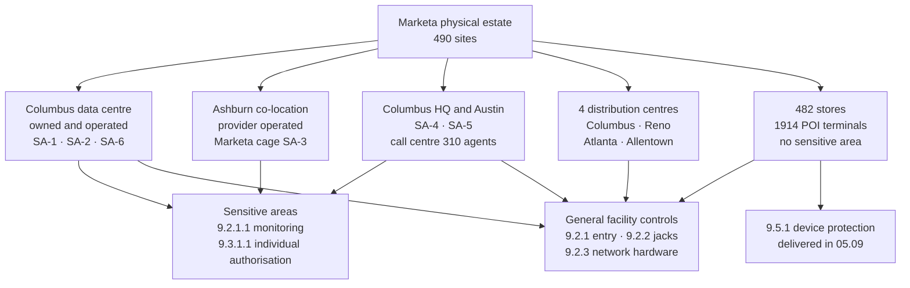

# 05.08 — Physical Security and Facilities

| Field | Value |
|---|---|
| Document ID | MRG-PCI-2026-508 |
| Program | Marketa Retail Group — PCI DSS v4.0.1 Compliance Program |
| Phase | 05 — Access Control &amp; Physical Security |
| Version | 1.0 |
| Status | Approved |
| Owner | Trevor Kim, Director of Infrastructure &amp; Network |
| Approver | Naomi Bhatt, Chief Information Security Officer |
| Date | 2026-07-15 |
| Classification | Confidential — Cardholder Data Environment // Illustrative Portfolio Sample |

## Purpose

Requirements 7 and 8 decide who may reach a system and prove who they are. **Requirement 9 assumes both have been defeated and asks a different question: what stops a person who is simply standing next to the machine?**

This document delivers **9.1** (policies and roles), **9.2** (facility entry controls, monitoring of sensitive areas, network jacks, networking hardware and consoles) and **9.3** (authorising and managing physical access for personnel and for visitors) across **490 Marketa sites** — the Columbus data centre, the Ashburn co-location, the Columbus headquarters, the Austin technology office, four distribution centres and 482 stores.

Two of Requirement 9's harder problems are deliberately not here. **9.4**, media handling and destruction, is **05.10**. **9.5.1**, the protection of 1,914 POI devices from tampering and substitution, is **05.09** and is the largest single control in this half of the phase.

One position is settled at the outset because everything about the Ashburn estate depends on it.

> **Physical security at a co-location facility is a control somebody else performs on Marketa's behalf. It is not a control Marketa inherits. The difference is that an inherited control has no evidence and a performed one does, and §6 is about closing that gap rather than assuming it away.**

## 1. What Requirement 9 Obliges, and Who Discharges It

| Sub-requirement | The obligation, stated plainly | Where |
|---|---|---|
| **9.1.1** | Policies and procedures for Requirement 9 documented, current, in use and known to all affected parties | §2; the Physical Security Standard adopted in Phase 07 |
| **9.1.2** | Roles and responsibilities for Requirement 9 activities documented, assigned and understood | §2 |
| **9.2.1** | Appropriate facility entry controls in place to restrict physical access to systems in the CDE | §4 |
| **9.2.1.1** | **Individual physical access to sensitive areas monitored** with video and/or physical access-control mechanisms; the collected data **retained for at least three months**, reviewed and correlated with other entries, unless otherwise restricted by law | §4.2 |
| **9.2.2** | Physical and/or logical controls restrict use of **publicly accessible network jacks** | §5 |
| **9.2.3** | Physical access to **wireless access points, gateways, networking and communications hardware, and telecommunication lines** restricted | §5.2 |
| **9.2.4** | Access to **consoles in sensitive areas** restricted by locking when not in use | §5.3 |
| **9.3.1** | Physical access for **personnel** authorised — access authorised based on job function, revoked immediately on termination, and all physical access mechanisms returned or disabled | §7 |
| **9.3.1.1** | Physical access to **sensitive areas** for personnel — **individually authorised**, access revoked on termination, and all physical access mechanisms returned or disabled | §7.2 |
| **9.3.2** | **Visitor** access authorised before entry, escorted at all times within the CDE, and accompanied by an identification method distinguishing visitors from personnel with an expiry | §8 |
| **9.3.3** | Visitor **badges or identification surrendered or deactivated** before leaving the facility or at expiry | §8.2 |
| **9.3.4** | A **visitor log** maintained containing the visitor's name, the firm represented and the personnel authorising access, **retained for at least three months** unless otherwise restricted by law | §8.3 |

| Activity | Accountable | Responsible | Consulted | Informed |
|---|---|---|---|---|
| The Physical Security Standard | Naomi Bhatt | Owen Castellanos | Trevor Kim, Adaeze Nwosu | PCI Steering Committee |
| Columbus data centre and the Ashburn cage | **Trevor Kim** | Data centre operations | Naomi Bhatt | Owen Castellanos |
| Columbus HQ and Austin office physical controls | Trevor Kim | Facilities management | Elena Marchetti, Bill Traynor | Naomi Bhatt |
| Four distribution centres | Trevor Kim | DC operations leads | Adaeze Nwosu | Owen Castellanos |
| **482 stores** | **Adaeze Nwosu** | Regional operations managers; store managers | Trevor Kim | Naomi Bhatt |
| Designation of a sensitive area | **Naomi Bhatt personally** | — | Trevor Kim, Elena Marchetti | Rosa Delgado |
| Visitor authorisation into a sensitive area | Trevor Kim | The named host | — | Marcus Hale |

Designation of a sensitive area is not delegated for the same reason full-PAN authorisation is not delegated in 05.01 §2: **the population of areas subject to 9.2.1.1 and 9.3.1.1 determines the population of obligations**, and an entity that lets each site decide what counts as sensitive will find that none of them do.

## 2. What "Sensitive Area" Means, and What It Does Not

The standard's definition is narrower than most entities apply and wider than most entities like. A **sensitive area** is any data centre, server room or area housing systems that **store, process or transmit cardholder data**. It expressly **excludes public-facing areas where point-of-sale terminals are present** — a store checkout is not a sensitive area, however much account data passes across it.

That exclusion does most of the work in Marketa's estate, and it is worth being precise about why it is correct here rather than merely convenient.

| Population | Sensitive area? | Reasoning |
|---|---|---|
| Columbus data centre halls holding CDE and connected-to components | **Yes** | They house the eight CDE components and the Z3 estate |
| Ashburn caged suite holding the six DR components | **Yes** | A replica of a CDE component is a CDE component — 02.08's position on CT-03, restated physically |
| Columbus HQ Payment Operations secure area | **Yes** | Account data is **processed and displayed** there. The CDE-06 sessions that render issuer imagery to the nine dispute analysts terminate on screens in that room |
| Columbus HQ media and evidence store | **Yes** | It holds the offline media in 05.10 §3 |
| Columbus data centre carrier and demarcation room | **Yes** | Telecommunication lines carrying the CDE's transit paths terminate there |
| **482 store checkout areas and sales floors** | **No** | The standard's explicit exclusion, and the substantive reason is P2PE — the lane holds no account data Marketa can read. **9.5.1 applies in full regardless**, which is the point |
| **482 store back-of-house and network cabinets** | **No** | They house no system that stores, processes or transmits cardholder data. They are controlled anyway under 9.2.3 and the store physical standard, and **R-38** is the register's entry for what happens if they are not |
| Austin call-centre floor | **No** | Agent desktops are outside the CDE by design; the digits the customer keys are suppressed at Cadence upstream of Marketa's telephony |
| Four distribution centres | **No** | 96 systems across four sites, none holding account data — verified by the discovery exercise in 02.02. Controlled under 9.2.2 and general facility entry |

**Six areas are designated sensitive.** That designation is what triggers 9.2.1.1's monitoring and retention obligation and 9.3.1.1's individual-authorisation obligation, and the list is reviewed at each 12.5.2 scope confirmation rather than when someone remembers.

| ID | Sensitive area | Site | Houses | Individuals authorised | Authoriser |
|---|---|---|---|---|---|
| **SA-1** | Z1 CDE cabinet suite | Columbus data centre | CDE-01 to CDE-08 | **19** | Trevor Kim, countersigned Naomi Bhatt |
| **SA-2** | Z3 security and administrative services hall | Columbus data centre | CT-01, CT-02, CT-08, CT-11 to CT-37 and the Z3 estate | **44** | Trevor Kim |
| **SA-3** | Marketa caged suite | Ashburn co-location | CT-03, CT-09, CT-35, CT-45 and two DR components | **11** | Trevor Kim, countersigned Naomi Bhatt |
| **SA-4** | Payment Operations secure area | Columbus HQ | Workstations rendering CDE-06 sessions; the disputes desk | **41** | Elena Marchetti |
| **SA-5** | Media and evidence store | Columbus HQ | Offline media under 9.4.1.1; assessment evidence | **6** | Trevor Kim, countersigned Owen Castellanos |
| **SA-6** | Carrier and demarcation room | Columbus data centre | Telecommunication lines, carrier terminations | **9** | Trevor Kim |

## 3. The Estate

| Site class | Sites | Assessed components on site | Sensitive areas | Physical security operated by |
|---|---|---|---|---|
| Columbus data centre | 1 | **8 CDE + 57 connected-to** | SA-1, SA-2, SA-6 | **Marketa** |
| Ashburn co-location | 1 | **6 connected-to** | SA-3 | **The provider**, outside the cage; **Marketa** inside it |
| Columbus HQ | 1 | 0 — endpoints only | SA-4, SA-5 | Marketa |
| Austin technology office | 1 | 0 | none | Marketa |
| Distribution centres | 4 | 0 | none | Marketa |
| **Stores** | **482** | 0 assessed; **1,914 POI** and the store estate carried in the connected-to band for governance | none | Marketa, executed by store colleagues |
| **Total** | **490** | **71** | **6** | |

The asymmetry in the third column is the reason this document is shorter than 05.09 and the reason 05.09 is the harder one. **Sixty-five of the seventy-one assessed components sit inside one building that Marketa owns, staffs and monitors.** The remaining physical exposure — 1,914 devices on public counters in 482 buildings — is not concentrated at all, and no amount of data-centre control touches it.

## 4. Facility Entry Controls — 9.2.1 and 9.2.1.1

### 4.1 Entry controls

| Site | Layers between the public street and an assessed component | Mechanism |
|---|---|---|
| **Columbus data centre** | **Four** — perimeter and vehicle gate, staffed reception with photographic identity check, hall door, cabinet suite door | Badge with PIN at the hall door; badge plus biometric at SA-1; anti-passback enforced at every reader; mantrap at the hall entrance permitting one person per authorisation |
| **Ashburn co-location** | **Four** — provider perimeter, provider reception, provider hall door, **Marketa cage door** | The first three are the provider's mechanisms under its own controls. The fourth is **Marketa's own reader on Marketa's own cage**, issuing to Marketa's badge population and logging to Marketa's CT-19 |
| **Columbus HQ** | **Three** to SA-4 — building lobby with staffed reception, floor door, secure-area door | Badge at each; SA-4 additionally enforces anti-passback and does not permit tailgating through a held door without a second badge presentation |
| **Austin office** | Two | Badge at lobby and floor |
| **Distribution centres** | Two | Badge at personnel entrance; goods entrances staffed during operating hours and secured outside them |
| **Stores** | One to back-of-house | Keyed or coded door between the sales floor and back-of-house; the network cabinet inside it is separately locked — §5.2 |

Anti-passback deserves its own line because it is what makes the 9.2.1.1 record mean anything. **A reader that records entries but not exits produces a log in which everybody is always inside.** Marketa's readers at SA-1 to SA-6 require a badge presentation to leave as well as to enter, refuse a second entry by a badge already recorded inside, and generate an exception where an exit is missing. Twenty-eight such exceptions were raised in the twelve months to 2026-06-30, all resolved as a person leaving behind another through a held door, and all followed by a note to the individual.

### 4.2 Monitoring individual entry and exit to sensitive areas — 9.2.1.1

9.2.1.1 is one of the sub-requirements entities most often part-meet. It requires **monitoring of individual physical access** to sensitive areas by video, access-control mechanisms, or both; that the collected data be **retained for at least three months**; and that it be **reviewed and correlated with other entries**. Retention alone is not the control. A camera recording to a disk nobody reads satisfies the first half of the sentence and none of the second.

| Sensitive area | Access-control monitoring | Video monitoring | Video retention | Access-event retention | Correlation |
|---|---|---|---|---|---|
| **SA-1** | Badge plus biometric, individual, entry **and** exit | Two cameras covering the suite door and the aisle | **120 days** | **12 months** in CT-19 | Access events correlated with CT-11 privileged check-outs and CDE authentication records |
| **SA-2** | Badge plus PIN, individual, entry and exit | Camera at the hall door and two aisle cameras | **120 days** | 12 months in CT-19 | As SA-1 |
| **SA-3** | **Marketa's own cage reader**, individual, entry and exit | Provider hall cameras; **no Marketa camera inside the cage** | **90 days**, provider-operated and contractually specified | 12 months in CT-19 | Marketa's cage events correlated with CT-11 and with the provider's hall record on request |
| **SA-4** | Badge, individual, entry and exit, anti-passback | One camera covering the door only; **no camera covers a screen** | **90 days** | 12 months in CT-19 | Correlated with MFA-04 broker sessions and 10.2.1.1 full-PAN view records |
| **SA-5** | Badge, individual, entry and exit; second badge required for the safe | One camera covering the door and the safe | 90 days | 12 months in CT-19 | Correlated with the media movement log in 05.10 §5 |
| **SA-6** | Badge, individual, entry and exit | One camera at the door | 120 days | 12 months in CT-19 | Correlated with carrier work orders |

Three deliberate positions in that table.

**No camera in SA-4 points at a screen.** The room renders full account numbers to nine dispute analysts. A camera positioned to read the screen would create a video record of PAN, which is a new repository of account data created by a control intended to protect it. The camera covers the door, and the residual — a colleague photographing a screen with a personal device — is the same residual 05.01 §7 named and is treated by policy, briefing and the CDE-06 watermark rather than by a lens.

**Marketa holds no camera inside the Ashburn cage.** The provider's video covers the hall; the cage interior is not covered. That is a real limitation and it is stated rather than glossed: for SA-3, Marketa's 9.2.1.1 evidence is **access-control data alone**. The requirement permits video **and/or** access control, so a badge-only implementation meets it — but "meets it" and "is as strong as SA-1" are different statements, and Marketa records the second as well as the first.

**Retention exceeds the three-month floor everywhere**, at 90 or 120 days for video and twelve months for access events. The twelve months is not generosity; access events flow into CT-19 as a log source under Requirement 10 and inherit its retention, which is what makes correlation possible in the first place. **An access record held in a building-management system that the SIEM cannot read is retained and is not correlated.**

Review is monthly and is a real activity rather than a signature. Marcus Hale's team reviews SA-1 and SA-3 access records against the CT-11 privileged check-out record and asks one question of every entry: **was there a reason to be in the room?** In the period the review produced **six** queries. Five were engineers performing scheduled hardware work whose change record named a different individual. One was a facilities contractor escorted into SA-2 whose escort had badged in and out separately, leaving a nine-minute window where the log cannot prove the contractor was accompanied — treated as a control failure rather than an anomaly, and the escort procedure now requires the escort to badge the visitor through rather than badge alongside them.

## 5. The Physical Attack Surface That Is Not a Door

### 5.1 Publicly accessible network jacks — 9.2.2

| Location | Jacks in publicly accessible areas | Control | Verification |
|---|---|---|---|
| **482 store sales floors and customer areas** | Approximately **18,300** switch ports across the estate, of which **4,912** are unused | Every unused port is administratively shut into VLAN 999 under the `ROLE-UNUSED` template established in 03.04 §7. A live port is bound by port security to a known device class and, for colleague devices, by 802.1X with a device certificate | Port-state asserted centrally from CT-48 and reconciled monthly; the same assertion mechanism as **CA-2** and **CA-3** in 04.11, reused rather than reinvented |
| **Columbus HQ and Austin lobbies, meeting rooms and public corridors** | **214** | All administratively shut. Meeting-room connectivity is wireless-only on the guest SSID, which has no path to any in-scope zone | Monthly assertion; quarterly physical spot-check of 20 jacks |
| **Columbus data centre visitor areas and reception** | **0** | No jack is provisioned in any area a visitor reaches unescorted | Verified at the annual site inspection |
| **Distribution centre offices and driver waiting areas** | **86** | Administratively shut; the four DCs hold no in-scope component in any case | Monthly assertion |

One honest observation belongs here, because it is the most useful thing physical port control taught this programme. **The Ironwood tester who broke Marketa's store segmentation in May 2026 did not need a network jack.** They entered store 0417 through the front door as a customer, associated with the guest wireless, and reached Z5 through a misconfigured trunk in nineteen minutes — 03.07 §4. Physical port control is a necessary control and it was not the failure mode. **A requirement family can be fully met and still not be where the exposure is**, and an entity that reads 9.2.2 as the answer to store physical risk has drawn the wrong conclusion from the right control.

### 5.2 Networking hardware, wireless access points and telecommunication lines — 9.2.3

| Population | Count | Physical control | Detection |
|---|---|---|---|
| **Store network cabinets** | **482** | Keyed lock, one key per store held by the store manager under a key-control register with a named holder and a return obligation; the cabinet sits inside back-of-house, behind the sales-floor door | **Cabinet-open sensor** reporting to CT-48. **1,204 open events** in the twelve months; all but **17** matched to a work order |
| **Wireless access points** | **1,612** — 1,388 store, 164 distribution centre, 60 office | Ceiling-mounted above the reachable plane on security-screw mounts with a tamper switch on the bracket | Mount-tamper events reported to CT-49; continuous over-the-air monitoring already established in 03.06 §6 |
| **Store switches and routers** | Inside the 482 cabinets | As the cabinets | Configuration and reachability asserted continuously under DA-1 to DA-6 |
| **Distribution centre and office network rooms** | 6 | Badged, keyed, no public access | Access events to CT-19 |
| **Columbus data centre network hardware** | Inside SA-1, SA-2 and SA-6 | Locked cabinets inside a monitored sensitive area | As §4.2 |
| **Telecommunication lines** | Carrier terminations in **SA-6**; store demarcation inside the locked network cabinet; Ashburn carrier entry is the provider's | Physical separation of carrier space from Marketa space at Columbus; carrier engineers escorted | Carrier work orders reconciled against SA-6 access records monthly |

The seventeen unmatched cabinet-open events are the finding worth reporting from this section. None involved a network change, none coincided with a configuration divergence, and all seventeen were traced to the same behaviour: **store colleagues using the network cabinet to store stock.** It is not an attack, it is not a violation anybody thought of as one, and it defeats the control completely — a cabinet that is opened routinely for a legitimate reason is a cabinet whose open event carries no information. The corrective action was physical rather than procedural: the cabinets were cleared, re-signed, and where the store genuinely lacked storage the regional manager was required to solve that problem rather than the colleague. **R-38** describes exactly this failure mode and the register scores it Low 6 because the segmentation model does not depend on the cabinet alone — but the register's reasoning assumed the cabinets were closed, and for at least seventeen store-visits they were not.

### 5.3 Consoles in sensitive areas — 9.2.4

9.2.4 obliges access to consoles in sensitive areas to be restricted by **locking them when not in use**. It is a short requirement with a narrow scope and it is worth reading literally: it applies to consoles, and it applies in sensitive areas.

| Console | Location | Restriction | Verified |
|---|---|---|---|
| **3 KVM consoles** | SA-1 and SA-2, Columbus | Housed in a locked rack drawer; the drawer key is held with the suite key and signed out; the console session itself requires authentication at CT-05 with a security key and logs to CT-18 | Quarterly physical inspection; console authentication records |
| **2 serial console servers** | SA-2, Columbus | No local keyboard or display; reachable only from a CT-11 brokered session under MFA-19 | CT-11 session records |
| **1 KVM console** | SA-3, Ashburn cage | As the Columbus KVMs; the drawer key is held by the two Marketa individuals authorised to escort into the cage | Annual site inspection with photographs |
| **Store back-office servers** | 482 stores — **not a sensitive area** | **No attached keyboard, monitor or console.** The physical console port is disabled in the platform configuration | Confirmed physically in the 24-store walkthroughs of 02.04 §5 and asserted centrally thereafter |
| **POI terminals** | 482 stores | Not consoles. Their protection is **9.5.1** and is 05.09's subject | — |

The store row is a determination rather than a control, and it is recorded because it is the one an assessor will probe. Marketa does not claim 9.2.4 compliance in stores by locking store consoles; it establishes that **no console exists in a store that reaches an assessed system component, and that the store is not a sensitive area in any case.** Both halves of that sentence had to be true, and the first was verified by walking into stores rather than by reading a build standard.

## 6. Ashburn — Where Somebody Else Performs the Control

The Ashburn co-location holds six assessed connected-to components, including **CT-03** (the Active Directory replica), **CT-09** (the DR jump host), **CT-35** (the backup target that held the 33 PAN-02 copies) and **CT-45** (the DR segmentation firewall cluster). 02.08 records the principle: *a replica of an identity store is an identity store*. Physical security has to reach the same conclusion, and it has to reach it about controls Marketa does not perform.

### 6.1 The responsibility boundary, evidenced

| Sub-requirement | Performed by | Evidence Marketa holds | Grade |
|---|---|---|---|
| **9.1.1 · 9.1.2** policies and roles | **Both** — each party for its own layer | Marketa's Physical Security Standard; the provider's documented physical security policy supplied under the master services agreement | E1 / E3 |
| **9.2.1** facility entry to the building and the hall | **Provider** | Provider SOC 2 Type II report, physical controls section; annual written attestation naming the controls; **Marketa's own annual site inspection with dated photographs** | E3, raised to E2 by the site inspection |
| **9.2.1.1** individual entry and exit monitoring, **hall** | **Provider** | Provider attestation of individual badge monitoring and 90-day video retention; retention period **contractually specified**, not assumed | E3 |
| **9.2.1.1** individual entry and exit monitoring, **Marketa cage** | **Marketa** | Marketa's own reader; events in CT-19 with 12-month retention; monthly review | **E1** |
| **9.2.2** network jacks in provider-controlled space | Provider | Attestation; observed at site inspection | E3 |
| **9.2.3** hall networking hardware and carrier entry | Provider | Attestation; carrier space physically separate from the Marketa cage, observed | E3 |
| **9.2.3** networking hardware **inside the cage** | **Marketa** | Locked cabinets inside the cage; asserted with the rest of the estate | E1 |
| **9.2.4** the cage console | **Marketa** | Locked drawer, keyed to the two escorting individuals | E1 |
| **9.3.1 · 9.3.1.1** personnel authorisation to the cage | **Marketa** | 11 individually authorised identities; the same HR-driven revocation as §7 | E1 |
| **9.3.2 · 9.3.3 · 9.3.4** visitors into the cage | **Marketa** | Marketa's own cage visitor log — **37 visits** in the period; badges issued and surrendered by Marketa's escort | E1 |
| **9.3.2 · 9.3.4** visitors to the building | Provider | Provider's log, available to Marketa on request; requested and sampled once, 2026-04-22 | E3 |
| **9.4.1.1** offline media held in the Ashburn vault | **Both** | Provider's vault controls attested; Marketa's media inventory and movement log — 05.10 §5 | E2 |

### 6.2 The finding

The shared-responsibility analysis produced something the programme did not expect and reports rather than repairs quietly.

> **The Ashburn co-location provider was not carried in the 01.09 third-party service provider register.**

The omission had a reason, and the reason was wrong. The provider was excluded at Phase 01 on the basis that it "touches no account data" — which is true. It holds sealed cabinets in a cage it cannot open, containing components whose contents it cannot read. On the 12.8.1 test, however, the question is not whether a provider handles account data. It is whether the provider **could affect the security of the cardholder data environment**, and a party that performs three of Marketa's Requirement 9 controls plainly can.

| Action | Owner | Date |
|---|---|---|
| Gap identified during the 9.2.1.1 evidence walk | Owen Castellanos | 2026-06-09 |
| Provider added to the register as **TPSP-06**, facilities class, no account data | Owen Castellanos | 2026-06-24 |
| Written responsibility matrix requested under **12.8.2** and **12.8.5**, itemising the 9.x controls above | Owen Castellanos | Requested 2026-06-24 |
| **Quarterly TPSP forum population moves from five providers to six** from Q3 2026 | Owen Castellanos | 2026-09-30 |
| Matrix received, reviewed and signed; annual 12.8.4 monitoring extended to TPSP-06 | Owen Castellanos | **Open — OI-05-02**, due 2026-09-30, into Phase 06 |

The correction is recorded here rather than by amending 01.09, following the convention 04.12 §1 used for the 6.4.1 supersession: **an approved document from a prior phase is corrected in the phase that found the error, not rewritten behind the reader's back.**

Two further points of precision. **Requirement 12.9 — the obligation on a service provider to acknowledge in writing its responsibility for the security of account data it holds — is a service-provider-only requirement.** It binds TPSP-06 in its own assessment, if it has one; it was **never within Marketa's 306** and is therefore not among the ROC's four Not Applicable entries. And the assurance Marketa obtains over TPSP-06 is **12.8's**, delivered in Phase 06, not Requirement 9's. Requirement 9 says the control must exist. Requirement 12.8 says Marketa must know it exists at somebody else's site.

### 6.3 ADR-0016

| Field | Position |
|---|---|
| **Decision** | **ADR-0016 — Physical security at a third-party facility is evidenced control by control, never inherited from an attestation.** Where a provider performs a Requirement 9 control on Marketa's behalf, Marketa states which control, obtains a written responsibility matrix, grades the evidence, and — where the gap between the provider's evidence and Marketa's own would otherwise be total — installs its own mechanism |
| Consequence 1 | **Marketa's own reader on Marketa's own cage door.** Without it, every 9.2.1.1 claim at Ashburn would rest on the provider's word about the provider's hall |
| Consequence 2 | An **annual Marketa site inspection** with dated photographs, performed 2026-04-22 by Trevor Kim, converting the provider's E3 attestation into E2 corroborated evidence for the entry-control layers |
| Consequence 3 | The provider enters the TPSP register, and the 12.8 machinery applies to it |
| Cost | An additional reader, a cage-door cabling change, an annual trip to Virginia, and a sixth provider in a quarterly forum |
| Rejected alternative | Relying on the provider's SOC 2 Type II. A SOC 2 is a report about the provider's control environment against the provider's own criteria. **It is evidence that a control exists at a facility. It is not evidence about Marketa's cage** |

## 7. Authorising and Managing Physical Access for Personnel — 9.3.1 and 9.3.1.1

### 7.1 The general population

| Control | Implementation |
|---|---|
| Authorisation basis | Physical access is granted **by job function**, from the same HR classification that drives the logical model in 05.01 §4. A badge profile is the physical analogue of a catalogue role, and neither is granted to an individual by request |
| Requester, approver, implementer | Three different people, per **ACP-5**. Facilities implements; the site owner approves; the manager requests |
| Badge issuance | In person, against photographic identity, with the photograph captured at issuance |
| **Revocation on termination** | **The badge system consumes the same HR termination event as the directory.** There is no separate physical offboarding trigger, no form and no email |
| Return or disablement of mechanisms | Badge, any issued key, and any cabinet or safe combination held. Where a mechanism cannot be recovered it must be **disabled**, and the record states which of the two occurred |
| Review | Badge populations for all sites reviewed with the six-monthly 7.2.4 access review; sensitive-area populations reviewed individually — §7.2 |

Integration of the badge system with the HR event is the single most useful control in this section and it is worth naming why. 05.04 §6 measures logical revocation at a median of **11 minutes** enterprise-wide and **4 minutes** in scope, because it is automated from an authoritative event. Physical access at most entities is revoked by a person remembering to tell facilities. Marketa's measured physical revocation across the twelve months to 2026-06-30:

| Measure | Enterprise | In-scope population |
|---|---|---|
| Terminations with a badge to deactivate | **7,662** | **9** |
| Median time from HR effective time to badge deactivation | **14 minutes** | **6 minutes** |
| Maximum | 5 hours 40 minutes | **19 minutes** |
| Badges physically returned | 84.1% | **7 of 9** |
| Badges **deactivated** whether returned or not | **100%** | **9 of 9** |
| Keys and cabinet combinations recovered or changed | n/a | 4 of 4 issued |

The 84.1% return rate is the honest number and it is the reason the row beneath it exists. **A badge that is deactivated is controlled whether or not it comes back**; a programme that measures returns rather than deactivations is measuring courtesy. The 5-hour-40-minute enterprise maximum was the same retroactive HR entry that produced 05.04's 4-hour-12-minute logical outlier — one cause, two symptoms, one corrective action to the HR process.

### 7.2 Individual authorisation to sensitive areas — 9.3.1.1

9.3.1.1 adds three things to 9.3.1 for sensitive areas: authorisation must be **individual**, access must be revoked on termination, and all physical access mechanisms must be returned or disabled. "Individual" is the word that does the work, and it rules out the ordinary implementation in which a badge profile grants a group of people access to a room.

| Control | Implementation | Position at 2026-07-15 |
|---|---|---|
| Individual authorisation record | Each of the **130 authorisations** across SA-1 to SA-6 is a named individual, a named area, a stated business reason, a named authoriser and a date. There is no group grant to any sensitive area | 130 records; **19 + 44 + 11 + 41 + 6 + 9** |
| Approval level | Trevor Kim for SA-2 and SA-6; Trevor Kim countersigned by Naomi Bhatt for SA-1 and SA-3; Elena Marchetti for SA-4; Trevor Kim countersigned by Owen Castellanos for SA-5 | Recorded per authorisation |
| Time bounding | An authorisation with no end date is permitted only for a permanent role holder. **Every contractor, vendor and temporary authorisation carries an end date the reader enforces** | 14 of 130 are end-dated |
| Six-monthly review | Sensitive-area authorisations are reviewed as a distinct packet in the 7.2.4 cycle, by the area owner, with last-use data attached | Cycle 2 removed **11 of 141** authorisations, taking the population to 130 |
| Revocation on termination | The HR event, as §7.1 | 9 of 9 in the period |
| Mechanisms returned or disabled | Badge, key, safe combination. **A combination that cannot be "returned" is changed** — SA-5's safe combination was changed twice in the period on the departure of a holder | 2 changes |

The eleven removals in Cycle 2 are the useful number. Nine were people whose role had changed and whose logical access had already been corrected by the mover process in 05.04 §3.1 while their badge profile had not — **the mover gap survives longer in the physical plane than in the logical one**, because a badge that still opens a door produces no error message. The remaining two were engineers authorised to SA-1 for a 2025 migration that finished. Both had last used the door more than 300 days earlier, which is what the last-use column exists to surface.

## 8. Visitors — 9.3.2, 9.3.3 and 9.3.4

### 8.1 Authorisation, escort and identification — 9.3.2

| Requirement element | Implementation |
|---|---|
| **Authorised before entering** | A visit is registered in advance by a named host with a stated purpose. Reception cannot admit an unregistered visitor to any floor; a walk-in is held in reception until a host authorises |
| **Escorted at all times within the CDE and sensitive areas** | Escort is **one host per visitor** into SA-1 and SA-3, and one host per two visitors elsewhere. The escort badges the visitor through each reader personally — the change made after the nine-minute gap in §4.2 |
| **Identification distinguishing visitors from personnel** | A **red** visitor badge, physically distinct in colour and shape from the blue personnel badge, bearing the word VISITOR, the date, and the host's name |
| **Expiry** | The badge carries a **printed expiry date** and an encoded expiry the reader enforces at end of day. A visitor badge does not open a door the day after it was issued, whether or not it was surrendered |

### 8.2 Surrender and deactivation — 9.3.3

| Measure, 12 months to 2026-06-30 | Value |
|---|---|
| Visitor badges issued across all sites with badge systems | **1,281** |
| Surrendered at exit | **1,277** |
| **Not surrendered** | **4** — 3 subsequently posted back by the visitor's employer; 1 never recovered |
| Deactivated regardless of surrender | **1,281 of 1,281** |
| Badges that opened a door after their issue date | **0** — asserted from the reader record, not from the badge stock count |

The last row is the one that matters and it is measured rather than assumed. A programme that reports a 99.7% surrender rate has described its stationery. **The control is that an unsurrendered badge is inert**, and the evidence is the absence of any authentication by an expired visitor credential across the reader estate.

### 8.3 The visitor log — 9.3.4

| Element | Requirement | Marketa |
|---|---|---|
| Visitor name | Required | Captured at reception against photographic identity |
| Firm represented | Required | Captured; free text is not accepted for a recurring vendor, which is selected from a list |
| Personnel authorising access | Required | The host, recorded as an identity rather than a typed name |
| Date and time in | Marketa's addition | Captured by the reception system |
| Date and time out | Marketa's addition | **Captured by the badge reader at egress where one exists; by the escort where one does not** — §8.4 |
| Areas entered | Marketa's addition | Derived from the reader record |
| **Retention** | **At least 3 months** | **12 months**, held with the access-event record in CT-19 |

| Site | Visits, 12 months | Of which entered a sensitive area |
|---|---|---|
| Columbus data centre | **1,148** | **214** |
| Columbus HQ | 4,317 | **96** into SA-4 or SA-5 |
| Ashburn cage — Marketa's own log | **37** | 37 |
| Austin office | 1,904 | 0 |
| Distribution centres | 2,660 | 0 |

### 8.4 The visitor-log finding

A quarterly audit of the visitor log by Owen Castellanos found **11 entries across the Columbus data centre with no exit time recorded**. In every case the escort had signed the visitor out on paper at reception and the electronic record had not been closed, because the data centre's egress path at the reception boundary had a push-bar rather than a reader.

The finding is small and the reasoning behind treating it as a control failure is not. **9.3.4 obliges a log; 9.2.1.1 obliges monitoring of individual entry and exit.** A record that establishes when a person entered a facility and relies on a colleague's memory for when they left does not establish the second, and eleven such records in a population of 1,148 is not a rounding error — it is eleven occasions on which the estate cannot say who was in the building.

| Action | Owner | Date |
|---|---|---|
| Finding raised at the Q2 evidence review | Owen Castellanos | 2026-06-18 |
| Interim control — escort must close the electronic record before leaving reception, enforced by the receptionist | Trevor Kim | 2026-06-22 |
| **Egress badge readers installed at the Columbus data centre reception boundary** | Trevor Kim | **Open — OI-05-04**, due 2026-09-30 |
| Re-audit of the visitor log, full population | Owen Castellanos | 2026-10-15 |

## 9. Position at 2026-07-15, and What This Document Does Not Claim

**9.1.1 and 9.1.2 — In Place.** Policies documented and owned; roles assigned, with sensitive-area designation reserved to the CISO. **9.2.1 — In Place** across all 490 sites, with four physical layers between the public street and any assessed component at Columbus and Ashburn. **9.2.1.1 — In Place** at all six sensitive areas, by individual access-control monitoring at all six and video at five, with retention of 90 to 120 days for video and 12 months for access events against a three-month floor, and a monthly correlated review that produced six queries and one control change. **9.2.2 — In Place**, with every unused port shut under `ROLE-UNUSED` and asserted monthly. **9.2.3 — In Place**, with 482 locked cabinets, 1,612 tamper-mounted access points and separated carrier space, and with seventeen unmatched cabinet-open events reported. **9.2.4 — In Place**, on six consoles in sensitive areas and a recorded determination that no store console reaches an assessed component. **9.3.1 and 9.3.1.1 — In Place**, 130 individual sensitive-area authorisations, HR-driven revocation at a 6-minute in-scope median, and 100% deactivation whether or not a badge was returned. **9.3.2, 9.3.3 and 9.3.4 — In Place**, with 1,281 visitor badges issued, all deactivated, none used after issue date, and a twelve-month log — subject to the eleven missing exit times in §8.4.

| Claim | Position |
|---|---|
| That the Ashburn co-location's physical security is Marketa's | It is not. Three of Marketa's Requirement 9 controls at that site are performed by a provider that was **absent from the TPSP register until 2026-06-24**. Marketa installed its own cage reader precisely so that the strongest 9.2.1.1 evidence at that site is its own |
| That a SOC 2 Type II report evidences Marketa's compliance | It evidences the provider's control environment. Four rows of the §6.1 table are graded **E3** and are the weakest evidence in this document |
| That store physical controls are strong | 482 back-of-house doors and 482 keyed cabinets, of which at least seventeen were being opened routinely to retrieve stock. **R-38** is Low because the network design does not depend on the cabinet alone, not because the cabinet is well controlled |
| That 9.2.2 addresses the store physical risk | It does not. The store segmentation failure of May 2026 required no jack, no badge and no pretext. §5.1 states this rather than letting a met requirement imply a treated risk |
| That the visitor log is complete | Eleven of 1,148 data centre entries have no exit time. The finding is stated, the interim control is stated, and the permanent fix is an open item with a date |
| That physical security is the weaker half of Requirement 9 for this entity | It is the **smaller** half. Sixty-five of 71 assessed components are in one building Marketa owns. The exposure that is not concentrated at all is 1,914 devices on public counters, and that is **05.09** |

## Cross-References

| Reference | Relevance |
|---|---|
| 01.09 — Third-Party Service Provider Register | TPSP-01 to TPSP-05, and the **TPSP-06** addition in §6.2 |
| 02.08 — Connected-To &amp; Security-Impacting Systems | Building management, CCTV and physical access control as **in the assessment but not assessed components**; the Ashburn six |
| 02.09 — Assessed System Component Inventory | The site distribution of the 71 components in §3 |
| 03.04 — Store Network Architecture | `ROLE-UNUSED` and the port templates behind 9.2.2 |
| 03.06 — Wireless Security | The 1,612 access points and the detection layer behind 9.2.3 |
| 03.07 — Segmentation Penetration Test | Why store physical port control was not the failure mode |
| 03.11 — Risk Register | **R-38** store cabinets; **R-16** rogue access points; **R-03** store network flatness; **R-11** provider responsibility gaps |
| 04.11 — Configuration Baseline Compliance | **CA-2** and **CA-3**, reused for port-state assertion |
| 05.01 — Access Control Principles | **ACP-5** applied to badge issuance; the physical counterpart of deny by default |
| 05.04 — Identity &amp; Account Lifecycle | The HR termination event that drives both logical and physical revocation |
| **05.09 — POI Device Protection** | **9.5.1** across 1,914 terminals — the physical control this document does not cover |
| 05.10 — Media Handling &amp; Destruction | **9.4**, and the offline media held in SA-5 and at Ashburn |
| ADR-0016 — Evidenced, Not Inherited, Physical Security at a Third-Party Facility | §6.3 |
| Phase 06 — Monitoring, Testing &amp; Third Parties | **12.8.2**, **12.8.4** and **12.8.5** for TPSP-06; the responsibility matrix in OI-05-02 |

---
[⬅ Previous](05.07-application-and-system-accounts.md) · [🏠 Phase 05 Home](05.00-README.md) · [Next ➡](05.09-poi-device-protection.md)
