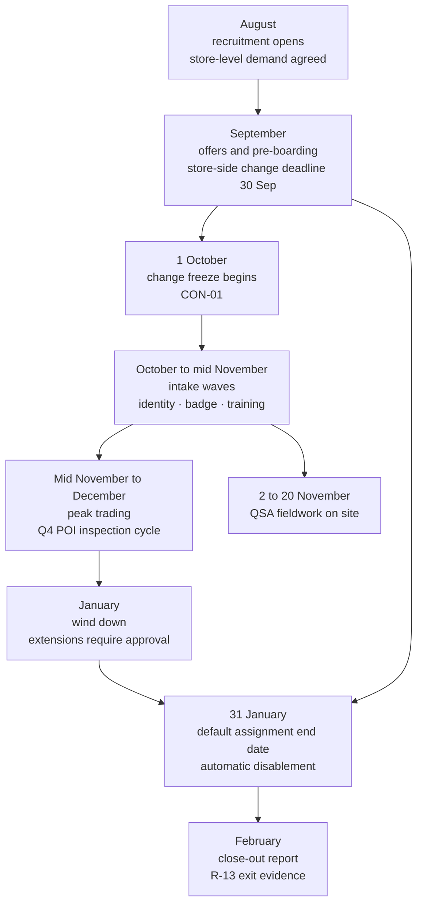

# 05.11 — Seasonal Workforce Access

| Field | Value |
|---|---|
| Document ID | MRG-PCI-2026-511 |
| Program | Marketa Retail Group — PCI DSS v4.0.1 Compliance Program |
| Phase | 05 — Access Control &amp; Physical Security |
| Version | 1.0 |
| Status | Approved |
| Owner | Adaeze Nwosu, Director of Store Operations |
| Approver | Naomi Bhatt, Chief Information Security Officer |
| Date | 2026-07-15 |
| Classification | Confidential — Cardholder Data Environment // Illustrative Portfolio Sample |

## Purpose

**There is no requirement numbered "seasonal workforce".** There is no sub-requirement an assessor tests, no testing procedure to sample against, and no line in the ROC where this document's subject appears under its own name.

It is nonetheless one of the two hardest control problems in Marketa's estate, and the reason is arithmetic. **Up to 6,800 temporary colleagues join between October and January.** That is a 23% increase in the store workforce, arriving in a single quarter, inside the **October-to-January change freeze**, at **peak transaction volume**, in the same weeks that the quarterly POI inspection cycle runs and the QSA is on site. Every requirement this phase has delivered — 7.2.4's six-monthly review, 8.2.1's unique identification, 8.2.4's approved provisioning, 8.2.5's immediate revocation, 9.3.1's physical authorisation, 9.5.1.3's device training, 12.6.3's awareness — has to work for a person who joined six weeks ago and will be gone by February.

**R-13** is the register's entry for what happens if it does not: *seasonal workforce access — up to 6,800 temporary colleagues onboarded at speed in October and offboarded slowly or not at all in February, inside the change freeze and at peak transaction volume.* **Moderate 12**, owner Adaeze Nwosu, treating requirements 8.2.4, 8.2.5, 8.2.6, 7.2.4, 7.2.5 and 12.6.3.

This document sets out the design, the readiness position, the evidence base from the season before the controls existed, and — plainly — the fact that **the design has never run.**

## 1. The Shape of the Problem

| Dimension | Value | Consequence |
|---|---|---|
| Permanent store colleagues | **≈ 29,600** | The baseline population performing 9.5.1.2 |
| **Seasonal intake, October to January** | **up to 6,800** | A 23% workforce increase in one quarter |
| Total workforce at peak | ≈ **40,800** | Roughly 34,000 permanent plus the seasonal intake |
| Stores receiving intake | **482** — all of them | **CON-02**: any seasonal control is a 482-fold operation |
| Distribution centres receiving intake | 4 | Roughly 18% of the intake goes to the DCs |
| **Change freeze** | **October – January**, **CON-01** | No change to store systems, store networks or the POS estate. Not waivable by the programme |
| Card-present volume in the same window | The year's peak | The devices the intake will inspect carry the most transactions in the quarter they are least familiar |
| QSA fieldwork | **2026-11-02 to 2026-11-20** | Sable Ridge will observe stores staffed by people who joined in October |
| Charter awareness bar | **≥ 95%** completion under 12.6.3 | **CON-09** states plainly that the bar exists because of this population |

Three of those rows compound in a way that is worth saying out loud rather than leaving a reader to assemble.

**The freeze and the intake coincide by design, not by accident.** Marketa freezes the estate in October because that is when trading matters most; it hires 6,800 people in October for the same reason. So the quarter in which the workforce is least experienced is also the quarter in which no technical control may be changed, no configuration corrected and no new mechanism deployed. **Anything that has to be true about seasonal access in December must be true and working by 30 September.**

**A campaign-based control cannot work at this scale in this window.** The obvious design — onboard fast, then run a February sweep to clean up — asks 482 store managers to perform an administrative task in the month after their hardest quarter, about people who have already left. It is the design that produced the prior season's numbers in §2.

**The seasonal colleague is not a lesser risk.** They work the same lanes, handle the same terminals, stand in the same back-of-house, and — because they are new — are the population least equipped to refuse an adult in a high-visibility jacket who says they have come to service the terminal. §7.3 of 05.09 measured exactly that: both failed repair-personnel verification tests occurred where the shift lead had joined within five weeks.

## 2. The Evidence Base — the 2025–26 Season

The controls described below were implemented in April 2026. The evidence that they were needed comes from the season before them, reviewed in February 2026 as part of the programme's scoping work.

| Measure, 2025–26 season | Value |
|---|---|
| Seasonal colleagues engaged | **6,412** |
| Identities created | 6,412 — every one with a unique identifier, so **8.2.1 held** |
| Identities carrying an **assignment end date** at hire | **1,904 of 6,412 — 29.7%** |
| Accounts **still enabled 30 days after the colleague's last worked shift** | **1,118** |
| Longest interval between last worked shift and disablement | **214 days** |
| Seasonal colleagues who held membership of a store-systems group not required by their role | **7** |
| Badges physically returned at end of assignment | **71%** |
| Badges deactivated at end of assignment | **83%** |
| Seasonal colleagues in the **assessed in-scope population** | **0** |
| 12.6.3 awareness completion, seasonal cohort | **93.8%** — below the charter's ≥95% bar |
| 9.5.1.3 POI training completion, seasonal cohort | 95.7% |

Two of those rows carry the argument.

**Zero seasonal colleagues were ever in the assessed in-scope population**, and that is the reason R-13 is Moderate rather than High. No temporary colleague has held a catalogue role, reached a CDE component, or been able to see an account number. What they hold is a store identity, a badge, and — critically — a role in the operation of **9.5.1.2**, which is a Requirement 9 control on 1,914 devices carrying 74% of Marketa's transactions.

**1,118 accounts enabled 30 days after the last worked shift is the finding.** Not one of them reached anything in scope. All of them were live credentials, on a corporate directory, belonging to people who had stopped working for Marketa, in the population most exposed to credential reuse and phishing. It is a clean illustration of the difference between "no PCI DSS finding" and "no exposure", and the register scores the second.

## 3. The Seasonal Calendar

| Phase | Dates | What must be true |
|---|---|---|
| Recruitment | August | Store-level demand agreed; no identity created |
| **Pre-boarding** | September | **Everything technical is finished. 2026-09-30 is the store-side deadline under CON-01** |
| Freeze begins | **1 October** | No change to store systems, store networks or the POS estate |
| Intake waves | October to mid-November | Identity, badge and training issued per wave. **No new mechanism is built during this period** |
| Peak and Q4 inspection | Mid-November to December | The Q4 POI cycle runs with the largest seasonal population of the year |
| Wind-down | January | Extensions are an affirmative act with an approver; the default is unchanged |
| **Default assignment end date** | **31 January** | Automatic disablement, no manager action, no sweep |
| **Close-out** | February | The report that is R-13's exit criterion — §8 |

## 4. The Six Controls

| ID | Control | What it replaces | Requirement anchor |
|---|---|---|---|
| **SEA-1** | **Every seasonal identity carries a mandatory assignment end date, set on the day of hire.** The field cannot be left empty and the default is 31 January | A leaver process that depends on somebody filing a termination | 8.2.4, 8.2.5 |
| **SEA-2** | **Disablement at the end date is automatic and requires no human action** — and disabling an account is not a change to a system, so it needs no freeze exemption | The February sweep | 8.2.5, 8.2.6 |
| **SEA-3** | **Extension is an affirmative act with a named approver**, granting a new bounded end date. There is no indefinite extension | Silent continuation | 8.2.4 |
| **SEA-4** | **The badge expires at the reader on the same date**, whether or not it is handed back | A badge-return process with a 71% success rate | 9.3.1 |
| **SEA-5** | **No abridged training.** Seasonal colleagues receive the full 12.6.3 awareness module and the full 9.5.1.3 POI module, in paid time, in the first shift | A shortened version for people who will not be here long | 12.6.3, 9.5.1.3 |
| **SEA-6** | **No seasonal colleague holds a catalogue role, a sensitive-area authorisation or any in-scope access.** This is enforced by the model rather than by intention | A judgement made 6,800 times by 482 managers | 7.2.1, 7.2.2, 9.3.1.1 |

**SEA-5 was contested and is recorded as ADR-0019.** The proposal put to the Steering Committee in May 2026 was an abridged module for seasonal colleagues — the argument being that 6,800 people times 31 minutes is roughly 3,500 hours of paid time in the tightest labour quarter of the year, spent on people who will be gone by February. The decision was to refuse it, on one ground: **an abridged module trains the least-experienced people the least, in the quarter when the devices are least watched.** The cost was accepted explicitly, by name, at the committee that owns the trading calendar rather than by the security function alone.

SEA-2 contains the sentence the design turns on, and it is worth isolating: **disabling an account is not a change to a system.** The freeze prohibits changes to store systems, store networks and the POS estate. It does not prohibit the ordinary operation of an identity lifecycle, and it never did — but an organisation whose offboarding depends on a manual campaign will experience the freeze as though it does, because the campaign competes with trading. Making disablement a property of the identity rather than an activity performed on it takes the whole population out of the freeze's path.

## 5. Identity Lifecycle at Scale — 8.2.4 and 8.2.5

### 5.1 The joiner path

| Step | Control | Why it works at 6,800 |
|---|---|---|
| Hire recorded in the **HR system of record** | The only source of a human identity — 05.04 §1. There is no store-level identity creation path | The 19 contractor records found off-system in access review Cycle 1 are the counter-example; that gap was closed in April 2026 with 1,340 records migrated |
| **Assignment end date captured, mandatory** | The record cannot be submitted without it. Default 31 January; a shorter date is permitted, a longer one requires the same approval as an extension | One mandatory field, set once, by the person who already knows the answer |
| Unique identifier minted, never recycled | 8.2.1. A returning seasonal colleague receives a **new** identifier linked to the prior record for HR purposes only | Roughly 31% of Marketa's seasonal intake are returners; identifier recycling would be the natural shortcut and is prohibited |
| **No role granted by default** | The classification makes a store profile available; access still requires the store manager's request. **No catalogue role is available to a seasonal classification at all** — SEA-6 | The strongest control in the set, because it is a property of the model rather than a decision anybody makes |
| Badge issued with a **printed and encoded expiry** matching the end date | 9.3.1 | §7 |
| Training assigned to the first shift | SEA-5 | §6 |

### 5.2 The leaver path

| Property | Design |
|---|---|
| Trigger | **The assignment end date**, reached. Not a termination filing, not a manager's action, not a report |
| Elapsed | Disablement at 00:01 on the day following the end date, enterprise target ≤ 30 minutes from the scheduled time |
| What is disabled | Directory account, CT-04 federation sessions already issued, store application access, workforce app access, and the **badge**, which expires at the reader independently |
| Early leaver | A colleague who stops before the end date is a normal leaver under 8.2.5 — HR effective time, ≤ 30 minutes enterprise, fully automated. **The end date is a ceiling, not a substitute** |
| Extension | **SEA-3.** A new bounded end date, requested by the store manager, approved by the regional operations manager, recorded. The record shows who extended whom and until when |
| Conversion to permanent | A **mover** event under 05.04 §3.1 — old profile removed at the effective date, new classification and any role requested and approved fresh. Additive re-entitlement is prohibited for this population as for every other |
| Records that survive the identity | **Inspection records, training completions and badge history persist.** The person's access ends; the evidence of what they did does not. This matters directly for 9.5.1.2 — a QSA sampling a Q4 inspection in February must be able to attribute it to a colleague who no longer works here |

### 5.3 Inactivity, and why it is not the control

8.2.6 requires inactive user accounts to be removed or disabled within 90 days of inactivity. It applies to the seasonal population and it is not the mechanism Marketa relies on.

| Mechanism | Bound |
|---|---|
| **SEA-2 — assignment end date** | Disablement on a **known date**, typically 31 January |
| 8.2.6 — enterprise inactivity threshold | 90 days after last successful authentication |
| The gap | A colleague who stops working on 2 January and whose end date is 31 January is disabled in **29 days**. Under inactivity alone the same account would live until **early April** |

The distinction is the whole design. **An inactivity rule is a backstop that measures absence; an end date is a control that measures the engagement.** Marketa runs both, states which is doing the work, and does not present the 90-day threshold as its seasonal control.

## 6. Awareness and Competence for a Six-Week-Old Population

### 6.1 The constraint

**12.6.3** requires personnel to receive security awareness training upon hire and at least once every 12 months, with acknowledgement, covering the entity's information security policy and procedures and the threats and vulnerabilities that could affect the security of the CDE. For a permanent colleague, "at least once every 12 months" means several exposures, a refresh, a phishing simulation and a manager who has said the same things all year. **For a seasonal colleague hired on 12 October, it means one.**

The charter's **≥95%** completion bar exists because of this, and **CON-09** says so in those words. A bar set for a stable workforce would be met by ignoring the intake; a bar of 95% across roughly 34,000 permanent plus up to 6,800 seasonal cannot be met without the intake, because the intake is 17% of the denominator.

### 6.2 What is delivered, and when

| Module | Length | When | Population | Paid time |
|---|---|---|---|---|
| **12.6.3 security awareness** | 22 minutes | **First shift**, before the colleague works a lane | Every seasonal colleague | Yes |
| **9.5.1.3 POI device awareness** | 9 minutes | First shift, immediately after | Every seasonal colleague in a store | Yes |
| Acceptable use and authentication policy acknowledgement | 6 minutes | First shift | Every seasonal colleague | Yes |
| **December refresher** | 4 minutes, in-app, 6 questions | First week of December | Every seasonal colleague still engaged | Yes |
| Aid card at the lane | — | Permanently present | — | — |

The December refresher is the one addition made specifically for this population, and its justification is the shape of the season rather than the requirement. A colleague trained in the second week of October has, by mid-December, worked through the busiest eight weeks of Marketa's year and has not thought about the module since. **The refresher is four minutes and six questions, and it lands in the week before the highest-volume fortnight of the year.**

### 6.3 The honest limitation

Marketa does not claim that one 22-minute module in a first shift produces the same security competence as a year of exposure. It claims something narrower and testable: that **the specific behaviours the estate depends on from this population are few, concrete, and trainable in one sitting** — do not let anyone touch a terminal without a work order you can see; if something looks added, glued, raised or a different colour, press REPORT; nobody gets in trouble for a false alarm; your password is yours; report anything odd.

That list is five items long because that is what fits. Everything else in the awareness curriculum — phishing simulations, role-specific content for developers, the 12.6.3.1 additional requirements for personnel with CDE responsibilities — applies to populations that will still be here in March.

| Measure | 2025–26 season, before the controls | Programme position at 2026-07-15 |
|---|---|---|
| 12.6.3 completion, seasonal cohort | **93.8%** — below the bar | Target ≥95%; blended programme figure **97.1%** across 34,000 plus seasonal |
| 9.5.1.3 completion, seasonal cohort | 95.7% | Blended 9.5.1.3 figure **97.6%** — 05.09 §7.1 |
| Completion measured **before the colleague works a lane** | Not measured | Instrumented; reported weekly through the intake to the store readiness call — **OI-05-09** |

The third row is the one that changed. The prior season measured completion by the end of the season, which is a figure that cannot be acted on. **The measure that matters is whether the module was completed before the colleague first stood at a terminal**, and it is now instrumented per person, reported weekly during the intake, and escalated by region rather than tallied in March.

## 7. Physical Access for Temporary Personnel — 9.3.1

| Control | Implementation | 2025–26 season | Design position |
|---|---|---|---|
| Authorisation basis | Job function, from the HR classification. A seasonal store classification grants back-of-house and sales floor at **one named store** | Store-level, largely correct | Unchanged |
| **Sensitive-area access** | **None.** No seasonal colleague is individually authorised to SA-1 to SA-6, and the seasonal classifications cannot be selected in the authorisation workflow — **SEA-6** | 0 of 6,412 | 0, enforced by the model |
| Badge issue | In person, against photographic identity, photograph captured | Performed | Unchanged |
| **Badge expiry** | **Printed expiry date and an encoded expiry the reader enforces**, matching the assignment end date | Printed only on some regions' stock | **SEA-4** — encoded expiry estate-wide from April 2026 |
| Badge return | Requested at end of assignment | **71% returned** | Still requested. **No longer relied upon** |
| Badge deactivation | Automatic at the encoded expiry, independent of return | 83% | Target 100% by construction |
| Distribution centre intake | Warehouse and dock areas only; no network room, no office server area | Performed | Unchanged |

> **A badge you cannot collect must be a badge that stops working.**
>
> Twenty-nine percent of 6,412 badges — roughly 1,860 credentials — were not handed back at the end of the 2025–26 season. That is not a discipline problem to be solved with a stronger reminder; it is the predictable outcome of asking people who have finished a temporary job to make a trip. The design response is to make the return irrelevant to the control: the badge expires at the reader on a date fixed when it was issued, and whether it comes back is a stationery question.

## 8. Deprovisioning, and the February Close-Out

The close-out is a **scheduled programme deliverable with a named owner and a date**, not an observation somebody will make afterwards. It is R-13's exit criterion and it is the only thing that will move the rating.

| Element | Detail |
|---|---|
| Owner | **Adaeze Nwosu**, with Trevor Kim for the identity data |
| Due | **2027-02-28** |
| Goes to | PCI Steering Committee, Audit Committee, and Phase 09's close position |
| Carried as | **OI-05-03** |

| What the report must state | Why |
|---|---|
| Seasonal identities created, by wave and by region | The denominator |
| Identities carrying an assignment end date at hire | **Target 100%.** The prior season was 29.7% |
| Identities disabled **at** the end date without human action | **Target ≥99%**, the exit threshold |
| Extensions granted, by approver, with the new end date | Extensions are legitimate; unrecorded ones are not |
| Median and maximum interval from end date to disablement | The equivalent of 05.04 §6's revocation table for this population |
| Accounts still enabled 30 days after the end date | **Target 0.** The prior season was 1,118 |
| Badges deactivated at expiry, and badges returned | Reported separately, deliberately — §7 |
| Seasonal colleagues who held any in-scope access at any point | **Target 0**, verified against the catalogue rather than asserted |
| 12.6.3 and 9.5.1.3 completion, and completion **before first lane shift** | Against the ≥95% bar |
| Seasonal colleagues who performed a Q3 or Q4 POI inspection, and the quality proxies for those inspections | The load-bearing link between this document and 05.09 |
| Anything that failed | The report has a section for it before it is written |

### 8.1 Readiness at 2026-07-15

The mechanism exists and has been tested against synthetic data. It has not met a season.

| Readiness item | Status |
|---|---|
| Mandatory assignment end date live in the HR system of record | **Complete**, April 2026 |
| 1,340 contractor records migrated to carry an end date | **Complete**, April 2026 |
| Automatic disablement at end date, with the enterprise revocation sequence | **Complete**, April 2026 |
| **Dry run** against a synthetic cohort of **500 records** with staggered end dates | **Complete**, 2026-06-11. **500 of 500 disabled**, median **3 minutes** after the scheduled time, maximum 22 minutes |
| Badge encoded-expiry stock and reader configuration, all sites | **Complete**, May 2026 |
| Seasonal classifications blocked from the catalogue role workflow | **Complete**, April 2026 |
| Training modules and the December refresher built and translated | **Complete**, June 2026 |
| Weekly intake completion reporting instrumented | **OI-05-09**, due 2026-11-30 |
| Extension approval workflow with the regional operations manager as approver | **Complete**, June 2026 |
| **Store-side deadline under CON-01** | **2026-09-30.** Nothing in this list may slip past it |

## 9. R-13, and Why It Is Held

| Element | Position |
|---|---|
| Baseline | **Moderate 12** — likelihood 4, impact 3 |
| Phase 05 contribution | **SEA-1 to SEA-6**; the structural end-date design in 05.04 §6.1; 9.3.1 badge expiry; unabridged 12.6.3 and 9.5.1.3 delivery; the catalogue block preventing any in-scope grant |
| Standing | **Primary.** Phase 05 owns the treatment |
| **Position at 2026-07-15** | **Held at Moderate 12** |
| Why held | **The mechanism has never run.** It was implemented in April 2026, is first exercised in October 2026, and is first proved in February 2027. A dry run against 500 synthetic records is a test of the automation, not of the season |
| Exit criterion | The **2027-02-28 close-out report** showing ≥99% disablement at the end date, zero accounts enabled 30 days after the end date, zero seasonal in-scope access at any point, and 12.6.3 completion at or above the charter bar |
| Expected residual | **Moderate**, per the close position restated in 04.12 §7. R-13 is in the **Moderate → Moderate** band, and it stays Moderate even after a successful season |

That last row is worth defending because it looks like pessimism. **R-13 does not go to Low even if the February close-out is perfect**, and the reason is that the underlying condition does not change: 6,800 people will join again the following October, in the freeze, at peak, and the control will have one season of history. Likelihood falls from 4 to 3 on a successful close-out; impact stays at 3, because the population's exposure is what it is. Three times three is nine, which is still Moderate. **A structural condition treated by a good control is a Moderate risk, and calling it Low would be scoring the control rather than the exposure.**

## 10. What This Document Does Not Claim

| Claim | Position |
|---|---|
| That the seasonal control works | **It has never run.** Implemented April 2026, first exercised October 2026, first proved February 2027. This document describes a design and a dry run against synthetic data |
| That 500 synthetic records prove 6,800 real ones | It proves the automation fires on a date. It says nothing about 482 store managers, extension requests, mid-season conversions, rehires, or a person who works three shifts and disappears |
| That the prior season's numbers are the current design's baseline | They are the evidence that a campaign-based design fails at this scale. **1,118 accounts and 214 days** are what the old process produced, and they are why the new one is structural |
| That zero seasonal in-scope access makes this a low-consequence problem | No seasonal colleague reaches a CDE component. **Every seasonal colleague in a store operates 9.5.1.2 on devices carrying 74% of Marketa's transactions**, and two of nine repair-personnel verification tests failed where the shift lead was five weeks in |
| That awareness training closes the competence gap | One 22-minute module in a first shift is one exposure. The claim is narrower: **five concrete behaviours, trainable in one sitting**, measured before the colleague first works a lane |
| That the ≥95% bar is a stretch target | It is a floor, and the 2025–26 seasonal cohort came in at **93.8%**. The programme's 97.1% blended figure includes a permanent population with several exposures a year |
| That R-13 will close | It will not. It is expected to remain **Moderate** at the Phase 09 close even after a successful season, because the condition recurs every October |

## Cross-References

| Reference | Relevance |
|---|---|
| 01.06 — Program Charter &amp; Objectives | The **≥95%** awareness bar and why it exists |
| 01.08 — Scope Assumptions &amp; Constraints | **CON-01** the freeze, **CON-02** the 482× multiplier, **CON-09** the seasonal workforce |
| 03.11 — Risk Register | **R-13** Moderate 12 — treated here and held; **R-40** awareness completion during seasonal onboarding |
| 04.08 — Change Control | The freeze, and why disabling an account is not a change to a system |
| 05.02 — Role Definitions &amp; Access Model | The 24-role catalogue that a seasonal classification cannot select from |
| **05.04 — Identity &amp; Account Lifecycle** | **8.2.1**, **8.2.4**, **8.2.5** and **8.2.6**; §6.1's structural seasonal treatment, which this document operationalises |
| 05.03 — Access Reviews | The 19 off-system contractor records and the 1,340 migrated records behind §5.1 |
| 05.08 — Physical Security &amp; Facilities | **9.3.1** badge issuance and revocation; the sensitive areas no seasonal colleague may enter |
| **05.09 — POI Device Protection** | **9.5.1.3** training; the Q3 and Q4 inspection cycles this population performs; the two failed verification tests |
| 05.12 — Control-to-Risk Traceability | **R-13**'s standing and expected residual |
| ADR-0019 — No Abridged Control Training for Seasonal Colleagues | §4, and the cost accepted at the Steering Committee |
| Phase 06 — Monitoring, Testing &amp; Third Parties | The intake reporting and the operating evidence that will support the close-out |
| Phase 09 — Executive Reporting &amp; Continuous Compliance | The **2027-02-28** close-out report as R-13's exit evidence |

---
[⬅ Previous](05.10-media-handling-and-destruction.md) · [🏠 Phase 05 Home](05.00-README.md) · [Next ➡](05.12-control-to-risk-traceability.md)
