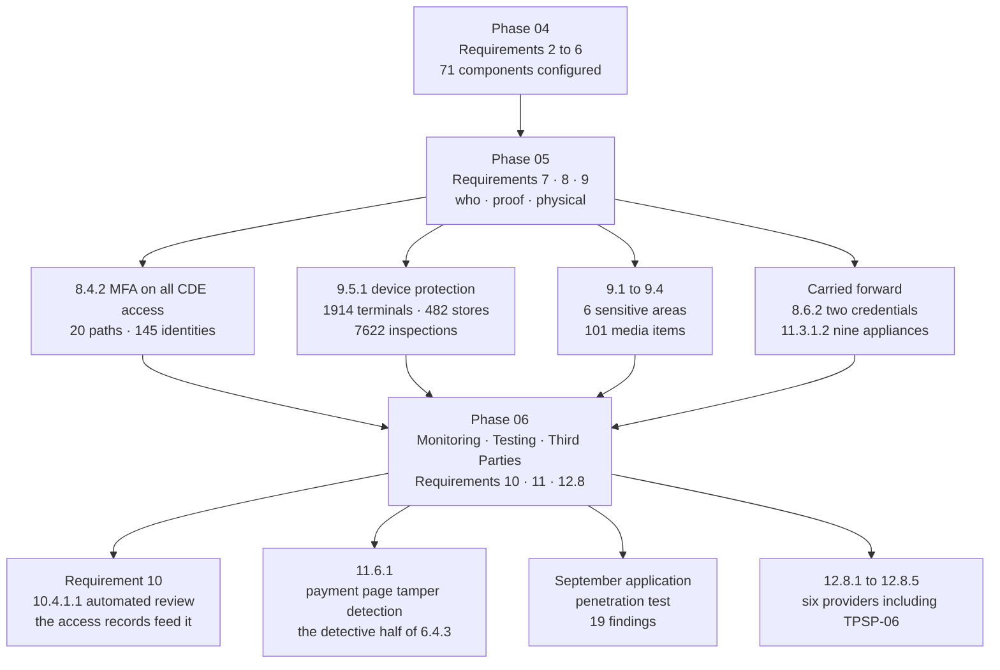

# 05.13 — Phase Summary and Transition

| Field | Value |
|---|---|
| Document ID | MRG-PCI-2026-513 |
| Program | Marketa Retail Group — PCI DSS v4.0.1 Compliance Program |
| Phase | 05 — Access Control &amp; Physical Security |
| Version | 1.0 |
| Status | Approved |
| Owner | Naomi Bhatt, Chief Information Security Officer |
| Approver | Raymond Voss, Chief Financial Officer |
| Date | 2026-07-15 |
| Classification | Confidential — Cardholder Data Environment // Illustrative Portfolio Sample |

## Purpose

The close of Phase 05. What the phase committed to, what it delivered, what it found, what it did about what it found, and what Phase 06 inherits.

Phase 04 handed over a **measured configuration estate** and two warnings: that a hardened server with a shared administrator credential is hardened and not controlled, and that 1,914 inspections cannot be evidenced by a policy. Phase 05's job was Requirements **7, 8 and 9** — who may reach what, proof of who they are, and the physical protection of the devices on which three-quarters of Marketa's transactions begin.

The phase delivered all three requirement families and the programme's **only customized approach**. It also produced the programme's **second Not in Place finding**, found 63 accounts nobody owned and 19 contractors nobody had recorded, discovered that the co-location provider performing three of Marketa's Requirement 9 controls was absent from the third-party register, ran nine unannounced tests of the repair-personnel rule and failed two of them, escalated six seal discrepancies that all turned out to be maintenance and tightened the procedure anyway, and found an offline backup volume sitting in a disaster-recovery test kit.

**Every one of those was found by a control this phase built, except the one this phase inherited and refused to soften.** That is the phase's actual output. The requirement coverage is the by-product.

## 1. What Phase 05 Committed To

Ten commitments came into this phase — seven from Phase 04's handover, two from earlier phases, and one from the programme charter.

| # | Commitment | Source | Status |
|---|---|---|---|
| **1** | Implement Requirements **7, 8 and 9** in full across the 71 assessed components and the 482-store estate | Charter; 306 applicable sub-requirements | **Delivered.** 05.01 to 05.11 |
| **2** | **8.4.2 — MFA for all access into the CDE**, not only administrative access | 04.13 §6.2; future-dated requirement now in force | **Delivered.** 20 access paths, 145 identities, 100% enrolment at 2026-06-30, 5 exceptions of which 4 closed and 1 permanent by design |
| **3** | **8.6.1 to 8.6.3** across the application and system account population | 04.13 §6.1 | **8.6.1 and 8.6.3 delivered.** **8.6.2 Not in Place** on 2 of 142 accounts, remediation **2027-01-31** |
| **4** | A **9.5.1 inspection regime executable by store colleagues on shift**, deployed before the freeze | **CON-01**, **CON-02**; 04.13 §6.2 | **Delivered** and operating. 7,622 inspections, 99.56% coverage, 0 terminals uninspected across the year |
| **5** | The **8.3.9 customized approach** scoped exactly as the Phase 01 addendum fixed it — the residual connected-to and vendor-managed population where a password remains the sole factor | 01 addenda; 04.13 §6.2 | **Delivered** unchanged. 19 components, 61 accounts, **ADR-0014** |
| **6** | Three targeted risk analyses — **TRA-7.2.5.1**, **TRA-8.6.3**, **TRA-9.5.1.2.1** | 01.11 §6, analyses 3, 4 and 5 of the fourteen | **Delivered**, each with six elements, an approver and a review date |
| **7** | Close the **seven POI device-register serial mismatches** carried from Phase 02 | 02.04 §7 and §9.2 | **Closed.** All seven re-verified physically, by telemetry and against Verition provisioning records; the swap procedure hard-gated. **Two were reconstructed rather than evidenced, and are recorded as such** |
| **8** | **OI-03-03** — the contractor switch-replacement procedure requiring imaging from CT-48 before patching | 03.13; assigned to Phase 05 in 04.13 §6.1 | **Delivered.** Folded into the store contractor standard alongside the POI port verification requirement from 02.04 §9.1 |
| **9** | Treat **R-13** structurally rather than by campaign | 03.11; 04.13 §6.3 | **Designed and dry-run.** **SEA-1 to SEA-6**, 500-record synthetic run at 100%. **Not proved.** R-13 held at Moderate 12; close-out **2027-02-28** |
| **10** | Everything store-side complete by **2026-09-30** | **CON-01** | **On track.** The inspection regime, the training, the badge expiry stock and the seasonal mechanism are all live at 2026-07-15; two open items carry September dates |

## 2. What the Phase Delivered

### 2.1 Deliverables register

| Doc | Title | Owner | What it establishes |
|---|---|---|---|
| **05.01** | Access Control Principles | Elena Marchetti | Requirement 7. **ACP-1 to ACP-8**; the four-layer model; the five enforcement planes; **fourteen people may see a full PAN** and why nine of them must |
| **05.02** | Role Definitions &amp; Access Model | Elena Marchetti | **RC-01 to RC-24**; 134 assignments, 118 internal and 27 external identities, 76 privileged; 7.2.3 approval and 7.2.6 repository query; **ADR-0013** |
| **05.03** | Access Reviews | Owen Castellanos | 7.2.4 and 7.2.5.1; two cycles reported honestly — **214 revocations against 1,247 entitlements**, then **9 against 134**; the 63 orphans; **TRA-7.2.5.1** |
| **05.04** | Identity &amp; Account Lifecycle | Trevor Kim | 8.1 and 8.2. Joiner, mover, leaver at 34,000 scale; 11 break-glass accounts; 8.2.8 idle re-authentication; 27 third-party individuals across 214 activation windows |
| **05.05** | Authentication &amp; Multi-Factor Authentication | Trevor Kim | 8.3, 8.4 and 8.5.1. The programme's **largest single workstream**; 20 access paths; **8.4.2 is not "MFA for administrators"**; five exceptions; **ADR-0015** |
| **05.06** | Customized Approach for 8.3.9 | Trevor Kim | The programme's **only** customized approach. Targeted risk analysis, controls matrix, QSA-derived testing procedures; **ADR-0014**; the two candidates that were refused |
| **05.07** | Application &amp; System Accounts | Trevor Kim | 7.2.5 and 8.6. **142 accounts**; **TRA-8.6.3**; **8.6.2 Not in Place**, stated without softening, with both the rotation argument and the compensating-control argument refused |
| **05.08** | Physical Security &amp; Facilities | Trevor Kim | 9.1, 9.2, 9.3. **SA-1 to SA-6**; 130 individual authorisations; the Ashburn shared-responsibility boundary and the **TPSP-06** correction; **ADR-0016** |
| **05.09** | POI Device Protection | Adaeze Nwosu | **9.5.1 across 1,914 terminals in 482 stores.** The device list, **TRA-9.5.1.2.1**, the five-check inspection, 9.5.1.3 training, four quarterly cycles, and the hardest problem stated plainly. **ADR-0017**, **ADR-0018** |
| **05.10** | Media Handling &amp; Destruction | Elena Marchetti | 9.4. **MED-1 to MED-6**; 101 registered items; Halberd's six serialised certificates; the **611** PAN-02 paper originals |
| **05.11** | Seasonal Workforce Access | Adaeze Nwosu | The 6,800. **SEA-1 to SEA-6**; the prior season's 1,118 accounts and 214 days; **ADR-0019**; the February 2027 close-out as R-13's exit |
| **05.12** | Control-to-Risk Traceability | Owen Castellanos | 24 of 44 risks touched, primary for 9; nothing moved and why; the reverse test; **why the TPSP-06 finding raised no new risk** |
| **05.13** | Phase Summary &amp; Transition | Naomi Bhatt | This document |

### 2.2 The phase in numbers

| Metric | Value |
|---|---|
| Assessed system components covered | **71** — 8 CDE, 63 connected-to |
| Access control principles; catalogue roles; role assignments | **8** · **24** · **134** |
| Identities in the assessed population — internal, external, privileged assignments | **118** · **27** · **76** |
| **Individuals authorised to see a full primary account number** | **14** |
| Access review cycles executed; revocations in each | **2** · **214 of 1,247** then **9 of 134** |
| Orphan accounts found in Cycle 1; contractor records off-system | **63** · **19**, with **1,340** contractor records migrated |
| Shared and generic accounts, all break-glass; unplanned uses | **11** · **0** |
| Third-party individuals; activation windows; sessions recorded | **27** · **214** · **214 of 214** |
| **MFA access paths; identities migrated; enrolment; exceptions** | **20** · **145** · **100%** · **5**, of which 4 closed |
| Steady-state MFA challenges per week; challenge failure rate | **≈ 9,640** · **0.9%** |
| Customized approaches; components and accounts in scope of it | **1** · **19** components, **61** accounts |
| Application and system accounts; interactive-use exceptions; rotations and rollbacks | **142** · **6** · **214** and **3** |
| **Targeted risk analyses delivered in this phase** | **3** — TRA-7.2.5.1, TRA-8.6.3, TRA-9.5.1.2.1 |
| Sites; sensitive areas; individual sensitive-area authorisations | **490** · **6** · **130** |
| Visitor badges issued; deactivated; used after issue date | **1,281** · **1,281** · **0** |
| **POI terminals; stores; spare pool** | **1,914** · **482** · **74** |
| **POI inspections performed; coverage; terminals never inspected** | **7,622 of 7,656** · **99.56%** · **0** |
| **Discrepancies raised; escalated as suspected tamper; confirmed tampering** | **49** · **7** · **0** |
| 9.5.1.3 training completion, blended; unannounced repair-personnel tests passed | **97.6%** · **7 of 9** |
| Registered media items; movements, all pre-approved; destruction certificates; items destroyed | **101** · **18** · **6** · **412** plus 611 hard-copy documents |
| Register entries Phase 05 touches; where it is the primary treating phase | **24 of 44** · **9** |
| **Requirements assessed Not in Place in this phase** | **1 — 8.6.2** |

## 3. What the Phase Found

| # | Finding | Where | What it says |
|---|---|---|---|
| **1** | **Two hard-coded credentials remain in two legacy batch integrations** — `batch-icq` on CDE-05 and `gl-extract` on CDE-04 | 05.07 §5 | **8.6.2 Not in Place.** Marketa has no source rights to one wrapper and the other's vendor library requires a static credential at initialisation. Both remediations fall the far side of the seasonal freeze |
| **2** | **63 accounts with no identifiable owner** on in-scope components, and **19 contractors engaged through a manager's spreadsheet** with no joiner record and no termination trigger | 05.03 §7; 05.04 §1 | Every assumption in the four-layer access model failed for those people **silently and simultaneously**. 24 of the 63 were application accounts miscatalogued as users |
| **3** | **The Ashburn co-location provider was absent from the TPSP register**, while performing three of Marketa's Requirement 9 controls | 05.08 §6.2 | Excluded at Phase 01 because it "touches no account data" — true, and the wrong test. 12.8.1 asks whether a party **could affect the security of the CDE** |
| **4** | **Two of nine unannounced repair-personnel verification tests failed** — access granted to a person presenting as a Verition engineer with no work order | 05.09 §7.3 | Both failures fell on the same profile: a shift lead who had joined within five weeks, with no manager on site. **A training gap in the design, not in the individual** |
| **5** | **Six terminals with tamper-evident seal discrepancies in Q3, all cleared as maintenance** | 05.09 §8.4 | Five of the six were caused by **Marketa's own service process** failing to write reseal codes back to the register. The inspection found a register defect while looking for something else |
| **6** | **Seventeen cabinet-open events with no work order**, all traced to colleagues storing stock in store network cabinets | 05.08 §5.2 | A cabinet opened routinely for a legitimate reason is a cabinet whose open event carries no information |
| **7** | **Eleven visitor records at the Columbus data centre with no exit time** | 05.08 §8.4 | Eleven occasions on which the estate cannot say who was in the building. The egress path had a push-bar rather than a reader |
| **8** | **One offline backup volume unaccounted for at the annual inventory**, located in four hours inside the DR test kit | 05.10 §6.2 | A gap between two correct processes. The exercise runbook had no media return step |
| **9** | **Two of six destruction collections had a reconciliation discrepancy** — one item never collected at all | 05.10 §8.2 | A certificate is necessary evidence and is not self-verifying. **A drive the certificate does not name has not been destroyed** |
| **10** | **Two of the seven Phase 02 device-register mismatches had no RMA record**, and were reconstructed from a field engineer's job record and a store maintenance log | 05.09 §4 | The devices' provenance was confirmed by Verition. **Marketa's own contemporaneous custody record did not exist** |
| **11** | **Three of 27 sampled access review decisions were not supported by the evidence in the packet** | 05.03 §4 | All three were retentions with a last-use date beyond 120 days and a reviewer note reading "still required". Two were revoked on re-review |
| **12** | **Two MFA-fatigue attempts, both denied by number matching** | 05.05 §15.3 | The concrete argument for number matching over simple approve/deny push, and the reason simple push is used nowhere in the matrix |

### 3.1 The finding that matters most, in one paragraph

Six terminals in six stores were found in Q3 with a tamper-evident seal that did not match what the register expected. Every one was escalated as a suspected tamper within two hours, taken out of service and investigated with Verition. **All six were cleared as maintenance.** Five were resealed devices from a September service wave whose new seal codes had never been written back; the sixth had a seal degraded by a cleaning contractor's solvent. The natural response at that point is to close the six, note that the process worked and move on — and the response Marketa chose instead is the most transferable thing in this phase. **"All cleared" is not the same as "nothing to learn".** A reseal is now a register event, hard-gated through the same flow as a device swap. Verition service waves are pre-notified with a device list. Cleaning contractors are named in the store physical standard with an approved product list. A quarterly seal-code reconciliation now runs independently of the inspection, because the inspection found this by accident and a control should not depend on that twice. And the escalation path was deliberately left **unchanged** — a seal discrepancy remains a suspected tamper and the terminal still comes out of service — because the temptation after six false positives is to raise the threshold, and **the sixth false positive is exactly what makes the seventh event dangerous.**

## 4. Requirement Coverage at Phase Close

| Requirement family | Position at 2026-07-15 | Document |
|---|---|---|
| **7.1, 7.2.1 to 7.2.4, 7.2.6, 7.3.1 to 7.3.3** | Met — a four-layer model in which only a catalogue role is grantable; 24 roles, 134 assignments; five enforcement planes covering all 71, of which one is 19 locally reconciled realms; two review cycles with Internal Audit challenge | 05.01, 05.02, 05.03 |
| **7.2.5, 7.2.5.1** | Met — least privilege per account across 142, one account per purpose, a named human owner on all 142, six-monthly under **TRA-7.2.5.1** | 05.07, 05.03 |
| **8.1, 8.2.1, 8.2.2, 8.2.4 to 8.2.8** | Met — a single HR system of record; unique non-recycled identifiers; 11 break-glass accounts with dual release and zero unplanned uses; 15-minute idle re-authentication with server-side invalidation; **9 of 9** in-scope leavers inside target | 05.04 |
| **8.2.3** | **Service-provider-only. Never within the 306** and therefore **not** one of the ROC's four Not Applicable entries | 05.04 §9 |
| **8.3.1 to 8.3.8, 8.3.11** | Met — two factor types with biometrics explicitly not claimed; breach-corpus screening at set and daily; 12-character minimum estate-wide and 16 in scope; history of 12 with similarity checking; 302 authenticators individually bound | 05.05 |
| **8.3.9** | Met by the **customized approach** under 12.3.2 — continuous behavioural authentication analytics in place of 90-day rotation, scoped to the 19 components and 61 accounts where a password remains the sole factor | 05.06 |
| **8.3.10, 8.3.10.1** | **Service-provider-only. Never within the 306** | 05.05 §10 |
| **8.4.1, 8.4.2, 8.4.3, 8.5.1** | Met — MFA on all 20 access paths covering all 71 components with zero gaps; no bypass route surviving quarterly negative testing; **one documented permanent exception**, MFA-EX-04, authorised in writing under 8.5.1's exception provision and recorded as **ADR-0015** | 05.05 |
| **8.6.1** | Met — interactive use prevented on 136 of 142 and verified quarterly by attempted login; 6 documented exceptions with identity confirmed before credential release and 19 attributed activations | 05.07 |
| **8.6.2** | **Not in Place** — 2 of 142 accounts. Remediation **2027-01-31**; re-assessment **2027-02-18**; AOC filed non-compliant | 05.07 §5 |
| **8.6.3** | Met — frequency and complexity determined per account class by **TRA-8.6.3**; 214 rotations with 3 automatic rollbacks | 05.07 §6 |
| **9.1.1, 9.1.2** | Met — policies documented and owned; sensitive-area designation reserved to the CISO | 05.08 |
| **9.2.1, 9.2.1.1** | Met — four physical layers at Columbus and Ashburn; individual entry and exit monitoring at all six sensitive areas with anti-passback; retention of 90–120 days for video and 12 months for access events against a three-month floor; monthly correlated review | 05.08 §4 |
| **9.2.2, 9.2.3, 9.2.4** | Met — every unused port shut under `ROLE-UNUSED` and asserted monthly; 482 locked cabinets, 1,612 tamper-mounted access points, separated carrier space; six consoles locked in sensitive areas and a recorded determination that no store console reaches an assessed component | 05.08 §5 |
| **9.3.1, 9.3.1.1** | Met — 130 individual sensitive-area authorisations; badge revocation driven by the same HR event as logical revocation, 6-minute in-scope median; **100% deactivation whether or not the badge was returned** | 05.08 §7 |
| **9.3.2, 9.3.3, 9.3.4** | Met — visitors authorised before entry, escorted badge-by-badge, red expiring badges, 1,281 issued and 1,281 deactivated, a twelve-month log. **Subject to the eleven missing exit times**, with an interim control and a dated fix | 05.08 §8 |
| **9.4.1 to 9.4.7** | Met — 101 registered items in three secure locations; annual location review and annual physical inventory both performed with findings; 18 movements all pre-approved and couriered; six serialised destruction certificates reconciled, with two discrepancies found and resolved | 05.10 |
| **9.5.1, 9.5.1.1, 9.5.1.2, 9.5.1.2.1, 9.5.1.3** | Met — 1,914 devices with two independently sourced serials; **TRA-9.5.1.2.1** setting quarterly full visual and serial verification plus five event triggers; 7,622 inspections at 99.56% coverage; 97.6% blended training; the work-order rule with a system-generated refusal | 05.09 |
| **12.9** | **Service-provider-only.** It binds TPSP-06 in its own assessment; it was **never within Marketa's 306** | 05.08 §6.2 |

**Requirement 9 produced no Not Applicable determination.** The ROC's four Not Applicable entries are merchant-applicable sub-requirements determined not to apply to Marketa's environment, and Phase 08 names them individually. None of the service-provider-only requirements named above is among them, because a requirement that never entered the applicable population cannot be excluded from within it.

## 5. Open Items Carried Out of Phase 05

| ID | Item | Owner | Due | Goes to |
|---|---|---|---|---|
| **OI-05-01** | **8.6.2 remediation** — vendor release 9.4 deployed for `batch-icq`, the ERP interface upgrade deployed for `gl-extract`, both credentials moved to CT-14 retrieval, source files re-scanned. Requires a freeze exemption approved 2026-12-17 | Trevor Kim | **2027-01-31** | Phase 06; **ROC finding in Phase 08**; re-assessment 2027-02-18 |
| **OI-05-02** | **TPSP-06 responsibility matrix** under 12.8.2 and 12.8.5 for the Ashburn co-location provider, received, reviewed and signed; 12.8.4 annual monitoring extended; quarterly TPSP forum population moved from five to six | Owen Castellanos | 2026-09-30 | Phase 06 |
| **OI-05-03** | **The February 2027 seasonal close-out report** — R-13's exit evidence, against the ten measures listed in 05.11 §8 | Adaeze Nwosu | **2027-02-28** | Phase 06, Phase 09 |
| **OI-05-04** | **Egress badge readers** at the Columbus data centre reception boundary, followed by a full re-audit of the visitor log | Trevor Kim | 2026-09-30 | Phase 06 |
| **OI-05-05** | **Unannounced repair-personnel verification tests expanded from 9 a year to 48** — one per region per quarter — with results reported to the monthly store readiness call | Adaeze Nwosu | 2026-09-30 | Phase 06 |
| **OI-05-06** | **22 unexercised entitlements** identified by the first exercised-privilege report removed or re-justified, and the report established as a standing input to the 7.2.5.1 review | Trevor Kim | 2026-10-31 | Phase 06 |
| **OI-05-07** | **Access review Cycle 3** executed with last-use and dwell-time evidence attached to every packet, and the three Cycle 2 unsupported decisions re-tested | Owen Castellanos | 2026-12-31 | Phase 06 |
| **OI-05-08** | **Media return added as a completion criterion** of the disaster-recovery exercise runbook, verified at the next exercise | Trevor Kim | 2026-12-31 | Phase 06 |
| **OI-05-09** | **Seasonal training completion instrumented and reported weekly through the intake**, measured **before the colleague first works a lane** rather than tallied at season end | Adaeze Nwosu | 2026-11-30 | Phase 06 |
| **OI-05-10** | **Q1 2027 POI inspection coverage** reported to the Steering Committee **against the Q3 2026 figure specifically**, to test whether 100% coverage four weeks before fieldwork was the regime or the observer | Adaeze Nwosu | 2027-04-30 | Phase 09 |

## 6. Transition to Phase 06

Phase 06 is **Monitoring, Testing &amp; Third Parties — Requirements 10, 11 and 12.8.** It is the phase that establishes whether anything Phases 03, 04 and 05 built actually **runs**, and it holds the detective counterparts to two of the programme's most important preventive controls.

### 6.1 What Phase 06 inherits

| Inheritance | Detail |
|---|---|
| **An identity estate that produces attributable events** | Every authentication on every one of the 71 components resolves to a unique identifier, through the directory, a federation assertion or a brokered check-out record. **Requirement 10 is only as good as the attribution beneath it**, and 8.2.1 is what makes a log entry mean a person |
| **Twenty enumerated access paths** | The MFA matrix is also a **monitoring** map. Every path into the CDE is named, its population is known, and its authentication records are already flowing to CT-05 and CT-18. Phase 06 does not have to discover where to watch |
| **Physical access as a log source** | Access events from all six sensitive areas flow into **CT-19** with twelve-month retention and are already correlated monthly against CT-11 privileged check-outs. **9.2.1.1's "reviewed and correlated with other entries" is discharged through Requirement 10's machinery**, not alongside it |
| **A store-side control with a full year of operating evidence** | 7,622 POI inspection records, each dated, attributable, geo-bound and photographed. This is the largest single evidence population the QSA will sample in November |
| **Three targeted risk analyses with review dates** | TRA-7.2.5.1, TRA-8.6.3 and TRA-9.5.1.2.1, each with an annual review date and a documented trigger set. Five of the fourteen are now complete |
| **A sixth third-party provider** | **TPSP-06**, added on 2026-06-24, with its responsibility matrix outstanding as OI-05-02. The 12.8 population Phase 06 works with is **six**, not five |
| **The 8.6.2 finding, undressed** | Two hard-coded credentials, a dated plan, an accommodation explicitly labelled as one, and **both the rotation argument and the compensating-control argument refused on the record** |
| **A schedule constraint that has now bitten twice** | **CON-01** freezes the estate October to January. It is why the 8.6.2 remediation is dated 2027-01-31 rather than 2026-11-30, and it is why everything store-side had to finish by 2026-09-30 |

### 6.2 The three workstreams that define Phase 06

| Workstream | Why it matters, and what Phase 05 hands it |
|---|---|
| **11.6.1 — payment-page change- and tamper-detection** | The **detective counterpart to 6.4.3**, and the pairing the Phase 02–04 addenda fix explicitly: 6.4.3 is preventive and lives in 04.10; 11.6.1 is detective and lives in Phase 06; **neither substitutes for the other**. The requirement's floor is a weekly check; Marketa's targeted risk analysis sets alerting inside **24 hours**. It is carried as **OI-04-01**, due 2026-08-31, and it is the control on which **R-01 — the register's highest-scored entry at High 20** — depends for its movement to Moderate |
| **The September application penetration test** | Nineteen findings — **2 Critical, 5 High, 7 Medium, 5 Low** — including an **unauthenticated admin interface on the chargeback application**, which is a Requirement 7 and 8 finding discovered by a Requirement 11 activity. Phase 05 supplied two scoped objectives to that test: **assertion replay and OTP reuse against the MFA implementation**, both of which failed, and the negative testing of 8.5.1's no-bypass claim. **A claim that MFA cannot be bypassed is evidenced by someone competent trying, not by a policy export** |
| **Requirement 10 and 12.8** | 10.2.1.1's individual-user-access logging is what makes the **14 full-PAN viewers** an auditable population rather than an authorised one; 10.4.1.1's automated review is what turns 9,640 weekly MFA challenges into something a human can act on; and 12.8.1 to 12.8.5 now cover **six** providers, including the one Phase 05 found missing |

### 6.3 What Phase 06 must not assume

| Do not assume | Because |
|---|---|
| That an access control with a complete design is an access control that operates | Phase 05's own controls produced **twelve findings about themselves**, of which five were failures of the control rather than discoveries about the estate. **Monitoring exists to find the sixth** |
| That 9.5.1's evidence population is uniform because the coverage figure is high | **99.56% coverage conceals a Q3 at 100% and a Q1 at 98.7%**, and the difference is four weeks of proximity to an assessment. 05.09 §8.3 says so, and **OI-05-10** is the test |
| That the MFA matrix proves 8.4.2 | Enrolment is coverage. Effectiveness is the negative testing, the September replay work, and the absence of any single-factor authentication in the CT-05 record — and **all three need a year, not a quarter** |
| That the access records will correlate because they are in the same SIEM | They correlate because somebody reviews them monthly and asks whether there was a reason to be in the room. **That review produced six queries and one control change**, and it is a human activity that Requirement 10's automation supports rather than replaces |
| That the 8.6.2 remediation is a formality | It depends on a **vendor release** and an **ERP interface upgrade**, neither of which Marketa controls, both of which land inside or adjacent to the freeze, and one of which requires a freeze exemption approved by the Steering Committee on 2026-12-17 |
| That the seasonal population is a Phase 05 problem now closed | The mechanism has **never run**. It first meets a season in October, during Phase 06, and the QSA will observe stores staffed by people who joined weeks earlier. **R-13's exit is a February 2027 report, not a July 2026 design** |
| That physical security at Ashburn is settled | Three of Marketa's Requirement 9 controls at that site are performed by a provider whose responsibility matrix is **outstanding**. Four rows of the shared-responsibility table are graded **E3**, the weakest evidence in Phase 05 |

## 7. Assurance Statement

Marketa Retail Group has implemented PCI DSS v4.0.1 Requirements 7, 8 and 9 across the **71 system components** in its assessed population — 8 cardholder data environment components and 63 connected-to or security-impacting systems — across **490 physical sites**, and across **1,914 point-of-interaction terminals in 482 stores**.

As at 2026-07-15:

- Access is granted only through a **24-role catalogue** derived from job classification and function, under an access control system set to deny by default across five enforcement planes covering all 71 components. **No mechanism exists for granting a permission to an individual.**
- **Fourteen people in an organisation of about 34,000 may see a full primary account number.** Nine of them must, because the dispute process is imposed by the card brands and the evidence is imagery Marketa did not create. Each authorisation is signed personally by a named executive, re-confirmed annually, and every view is logged individually.
- Every user account and access privilege has been reviewed twice in the period, with management acknowledgement, independent challenge by Internal Audit, and **three of twenty-seven sampled decisions found unsupported and re-reviewed**.
- Every human identity originates in a single HR system of record, carries a unique never-recycled identifier, and is revoked on the HR termination event at an in-scope median of **four minutes** logically and **six minutes** physically.
- **Multi-factor authentication is enforced on all twenty access paths into the cardholder data environment**, for every one of 145 identities, administrative and non-administrative, remote and on-premises — because **8.4.2 is not the administrative-access requirement it replaced**. No bypass route survived quarterly negative testing; one permanent exception exists for eleven break-glass accounts, is authorised in writing, and is reviewed twice a year.
- **142 application and system accounts** are enumerated, owned by named individuals, prevented from interactive use on 136 with quarterly verification by attempted login, and rotated per class at a frequency and complexity set by targeted risk analysis.
- Physical access to six designated sensitive areas is individually authorised for **130 people**, monitored by access-control mechanisms at all six and video at five, retained for 90 to 120 days and twelve months respectively against a three-month floor, and reviewed monthly against privileged-session records.
- **Media containing cardholder data is a registered population of 101 items** in three named secure locations, moved only on prior management approval by bonded courier, inventoried physically once a year, and destroyed by a certified vendor under serialised certificates that Marketa reconciles rather than files.
- **All 1,914 POI terminals were inspected in every quarterly cycle of the year**, 7,622 inspections at 99.56% coverage with **no terminal left uninspected**, against a device list holding two independently sourced serial numbers, under a frequency and type determined by **TRA-9.5.1.2.1**.

Four statements are made without qualification because they are less comfortable than the nine above.

**Requirement 8.6.2 is Not in Place.** Two legacy batch integrations still authenticate with a credential written in a shell script and a properties file. Marketa has no source rights to one and no callback hook in the other. Interim measures — a restricted repository, file integrity monitoring, single-source-host restriction, out-of-window alerting and monthly two-person rotation — reduce risk and **do not make the requirement met**, and the programme refused both the argument that monthly rotation is equivalent and the argument that a Compensating Controls Worksheet would carry it. **R-17 is held at High 16.** The remediation is dated **2027-01-31** and the re-assessment **2027-02-18**.

**The control protecting 1,914 payment terminals is operated by approximately 29,600 store colleagues, in a workforce that grows by up to 6,800 people between October and January.** They are not security professionals, they did not choose the task, and for most of them it appears four times a year between two customers. Marketa's response has been to make the task small enough to be performed honestly — five checks, ninety seconds, on the device they already carry, in words that tested at 94% comprehension rather than 61% — and to measure whether it was performed rather than whether it was recorded. **Two of nine unannounced tests of the repair-personnel rule failed.** Three hundred and forty-one inspection records were submitted in under twenty-five seconds and were re-inspected, of which three found something the fast pass had missed. Those numbers are reported because a control with human operators whose failure modes are invisible is not a control that has been assured.

**Physical security at the Ashburn co-location is performed by a provider that was absent from Marketa's third-party register until 2026-06-24.** Its controls were operating, attested and corroborated by Marketa's own site inspection throughout. The register was wrong, the test applied at Phase 01 was the wrong test, and the correction — a register entry, a responsibility matrix and a sixth provider in the quarterly forum — is recorded here rather than by rewriting an approved document.

**Nothing in the register moved.** Twenty-four of the forty-four entries carry Phase 05 treatment and every one is held at its baseline rating, because on the day a control is published the only available evidence is that it exists. The two entries the phase most wants to move cannot: **R-17 waits on a vendor release**, and **R-13 waits on a season**.

No statement in this phase asserts that a PCI DSS Attestation of Compliance constitutes compliance with any law, that the QSA's opinion binds a card brand or an acquirer, or that a merchant can be certified against PCI DSS. PCI DSS is **contractual, not statutory**; the Council writes the standard and does not enforce it. Marketa is privately held, is not an SEC registrant, and has no SOX control population.

And the sentence this phase exists to earn:

> **Marketa can name every one of its 1,914 payment terminals, say who inspected it, when, and what they saw — and prove what it did about the six that looked wrong.**
>
> That sentence is worth something only because the answer to the last clause was not "nothing". All six seal discrepancies found in Q3 were cleared as maintenance. Five of them were caused by Marketa's own service process. The escalation path worked, the estate lost no data, and the honest reading is that the inspection found a defect in the register while looking for a skimmer. **The procedure was tightened anyway**, because six correct answers in a row is how an organisation learns to expect the seventh, and the seventh is the one that matters.
>
> The harder truth sits underneath it. **This is a control with 29,600 operators and no automation available to it.** No console asserts it, no agent reports it, no configuration proves it. Its evidence is 7,622 photographs taken by people between customers, and its quality is a function of how simple Marketa made the task and how honestly Marketa measures whether it was done. **R-02 stays at High 15 until a year of that measurement says otherwise**, and the number to watch is not this year's 99.56%. It is the first quarter of 2027, when nobody is coming.

## Cross-References

| Reference | Relevance |
|---|---|
| 01.06 — Program Charter &amp; Objectives | The commitments Phase 05 was accountable for; the **≥95%** awareness bar |
| 01.08 — Scope Assumptions &amp; Constraints | **CON-01** the freeze, **CON-02** the 482× multiplier, **CON-03** the vendor-locked appliances, **CON-09** the seasonal workforce |
| 01.11 — Compliance Calendar &amp; Obligations | The fourteen targeted risk analyses, of which this phase delivered three; the quarterly 9.5.1.2 obligation |
| 02.04 — Card-Present Channel Scope | **PIM v4.2**, conditions **P2PE-C1 to P2PE-C9**, and the seven serial mismatches closed in 05.09 §4 |
| 03.11 — Risk Register | The 44-entry baseline this phase is measured against; **R-02**, **R-13**, **R-17** |
| 03.12 — Control-to-Risk Traceability | The forward map naming Phase 05's risks |
| 04.13 — Phase Summary &amp; Transition | The eight inheritances and six warnings this phase was given; **OI-03-03**, discharged here |
| 05.01 to 05.12 | The phase's twelve preceding deliverables |
| **Phase 06 — Monitoring, Testing &amp; Third Parties** | Requirements 10, 11 and 12.8; **11.6.1** as the detective counterpart to 6.4.3; the **September application penetration test**; TPSP-06 |
| Phase 07 — Security Policy, Risk &amp; Incident Response | **12.6.3** awareness, **12.10.4** incident-response training, and the exercise programme the seven POI-8 escalations foreshadow |
| Phase 08 — QSA Assessment &amp; ROC Production | The **8.6.2** Not in Place entry, the four Not Applicable entries, and the 2027-02-18 re-assessment |
| Phase 09 — Executive Reporting &amp; Continuous Compliance | The close position measured against 05.12 §7; the February 2027 seasonal close-out |

---
[⬅ Previous](05.12-control-to-risk-traceability.md) · [🏠 Phase 05 Home](05.00-README.md) · [Next ➡](../06-monitoring-testing-third-parties/06.00-README.md)
