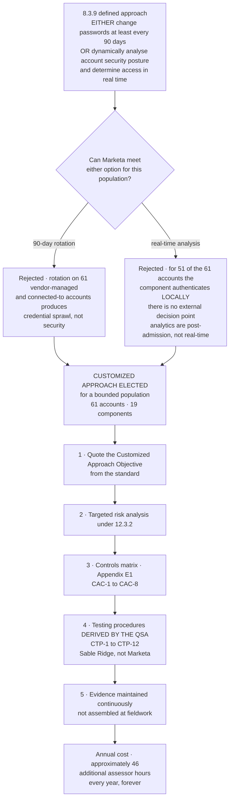

# The Customized Approach at 8.3.9

## Why this document exists

Most PCI portfolios never show a customized approach, because most entities never use one. It is the genuinely new idea in v4, and it is also the expensive one: **the entity does not write its own test.** The assessor derives the testing procedures, the entity satisfies them, and the derivation is redone at every assessment.

Marketa uses it **exactly once**, for a bounded population where the defined approach's second option cannot honestly be stretched to fit. The scoping matters as much as the argument: 8.4.2's MFA already removes password-only *user* access to the CDE, so what remains is the residual set of connected-to and vendor-managed components where a password is still the sole factor.

## Source
`05.06-customized-approach-8-3-9.md`.
