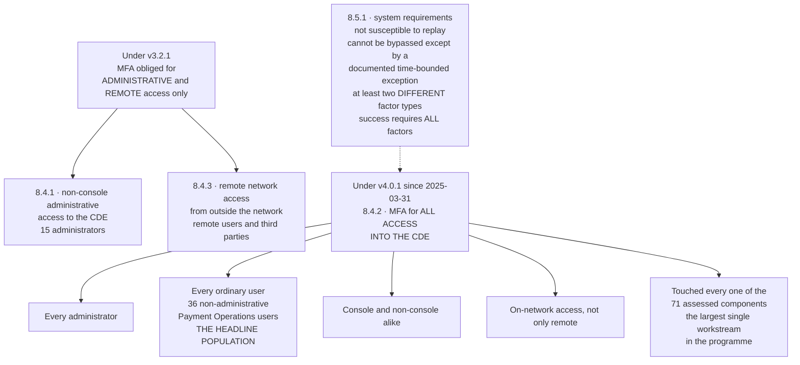

# MFA — What 8.4.2 Actually Changed

## The sentence entities misread

**8.4.2 is not "MFA for admins".** It is MFA for *all* access into the cardholder data environment. An organisation that already had MFA on administrative and remote access under v3.2.1 — as Marketa did — can read 8.4.2 and conclude it is already compliant.

It is not. The population that changes is the **ordinary user who logs into a CDE system from inside the corporate network**: the disputes analyst, the settlement clerk, the refunds administrator. At Marketa that is **36 people who had never used a second factor to reach those systems**, against 15 administrators who always had.

## Source
`05.05-authentication-and-mfa.md`.
