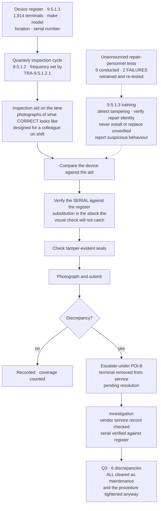

# POI Device Inspection — Designed for the Shift

## The hard problem, stated plainly

This control is executed by roughly **29,600 store colleagues** with high turnover, during a shift, and it is not the most urgent thing they are doing. Its quality is a function of **training and simplicity**, not of policy language.

Everything in the design follows from that: an inspection aid showing what *correct* looks like rather than a description of what tampering looks like; serial verification against the register, because substitution is the attack a visual check misses; photograph capture so the evidence exists without a written report.

**Two of nine unannounced repair-personnel identity tests failed.** That is the number that says whether the training worked, and it is more informative than the inspection coverage figure.

## Source
`05.09-poi-device-protection.md`.
