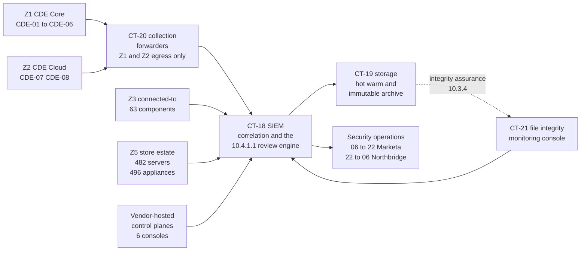

# 06.01 — Logging Strategy &amp; Architecture

| Field | Value |
|---|---|
| Document ID | MRG-PCI-2026-601 |
| Program | Marketa Retail Group — PCI DSS v4.0.1 Compliance Program |
| Phase | 06 — Monitoring, Testing &amp; Third Parties |
| Version | 1.0 |
| Status | Approved |
| Owner | Marcus Hale, Security Operations Manager |
| Approver | Naomi Bhatt, Chief Information Security Officer |
| Date | 2026-07-15 |
| Classification | Confidential — Cardholder Data Environment // Illustrative Portfolio Sample |

## Purpose

Requirement **10.1** and **10.2** — the documented procedures and assigned roles that make logging a programme rather than a setting, and the audit log content itself: logs enabled and active on every system component, the **seven event classes** at 10.2.1.1 to 10.2.1.7, and the **six record fields** at 10.2.2.

Requirement 10 is the requirement that decides what an investigation is able to establish. Every other requirement in this portfolio is a statement about what should be true; Requirement 10 is the only one that produces the record by which anybody could later find out whether it was. That is why the two Not in Place findings in this programme both concern **knowledge** — a vulnerability state that is unknown on nine components, and a credential whose use cannot be attributed to a person — and why both were detectable at all.

**Scope of this document: all 71 assessed system components** — 8 CDE and 63 connected-to — together with the store estate, the POI telemetry path and the third-party control planes that Marketa does not operate. Retention and protection of what is collected is **06.02**; the review of it is **06.03**; time and failure detection are **06.04**.

## 1. What Requirement 10 Actually Obliges

The requirement is often summarised as "keep logs". It is more specific than that, and the specificity is where entities fail.

| Sub-requirement | Obligation in one line | Where delivered |
|---|---|---|
| **10.1.1** | Security policies and operational procedures for Requirement 10 documented, kept current, in use and known to affected parties | §2 |
| **10.1.2** | Roles and responsibilities for Requirement 10 activities documented, assigned and understood | §2.2 |
| **10.2.1** | Audit logs **enabled and active** for all system components and cardholder data | §4 |
| **10.2.1.1 – 10.2.1.7** | Seven specific event classes captured | §5 |
| **10.2.2** | Six specific fields present in every record | §6 |
| 10.3.1 – 10.3.4 | Read access limited, modification prevented, prompt central backup, integrity monitoring on the logs | **06.02** |
| 10.4.1 – 10.4.3 | Daily review, automated mechanisms, periodic review of the rest, exceptions addressed | **06.03** |
| 10.5.1 | 12 months retained, 3 months immediately available | **06.02** |
| 10.6.1 – 10.6.3 | Time synchronisation, correct and consistent time, protected time settings | **06.04** |
| 10.7.1 – 10.7.3 | Detection, alerting and response for failures of critical security control systems | **06.04** |

Two words in 10.2.1 carry more weight than the rest of the sentence. **"Enabled"** is a configuration state and is easy to evidence. **"Active"** is an operating state and is not — a component with logging enabled and a full disk, a broken forwarder or a rotated-away destination is enabled and not active, and it looks identical from the configuration side. Marketa evidences 10.2.1 from the receiving end rather than the emitting end for exactly this reason, and the mechanism is in §4.2.

## 2. Documented Procedures and Assigned Roles — 10.1.1 and 10.1.2

### 2.1 The procedure set — 10.1.1

10.1.1 obliges the Requirement 10 procedures to be documented, kept up to date, in use, and **known to all affected parties**. The last limb is the one an assessor tests by interview, and it is the reason the procedure set is short enough to be read.

| Procedure | Content | Review cycle | Affected parties who must know it |
|---|---|---|---|
| **LOG-P1 — Log source onboarding** | How a system component becomes a log source: the event classes required, the parser, the expected volume band, the acceptance test | Annual, and on any new component class | Infrastructure engineering, cloud engineering, application owners |
| **LOG-P2 — Log content standard** | The 10.2.1.x event set and the 10.2.2 field set expressed per platform, with the specific audit policy or configuration that produces each | Annual, and on any platform version change | Platform owners, build engineering |
| **LOG-P3 — Log source health and silence** | Volume-band modelling, the silence alert, and the 10.7.2 escalation when a source stops | Annual | Security operations, Northbridge after-hours SOC |
| **LOG-P4 — Review and adjudication** | The daily automated review, the disposition states, and what an analyst must record — **06.03** | Semi-annual | Security operations analysts, Northbridge |
| **LOG-P5 — Retention, protection and retrieval** | Retention tiers, immutability, restoration and the evidence-request path — **06.02** | Annual | Security operations, Internal Audit, Legal |
| **LOG-P6 — Time synchronisation** | Time source hierarchy, drift thresholds, and change control on time settings — **06.04** | Annual | Infrastructure engineering |

"Known to all affected parties" is evidenced three ways: the procedures are linked from the runbook each team actually opens rather than from a policy library nobody browses; LOG-P1 is executed by the platform teams themselves at every onboarding, so the procedure is used by the people it names; and the QSA interviewed **nine** individuals across four teams during fieldwork, including two store-side and one Northbridge, on the procedures relevant to their role.

### 2.2 Roles and responsibilities — 10.1.2

10.1.2 is a separate sub-requirement from 10.1.1 because documenting a procedure and assigning somebody to perform it are different acts, and the second is the one that is usually implicit.

| Activity | Accountable | Responsible | Consulted | Understanding evidenced by |
|---|---|---|---|---|
| Requirement 10 control ownership overall | Naomi Bhatt, CISO | Marcus Hale | Owen Castellanos | Annual attestation; Steering Committee reporting |
| Log source onboarding and coverage | Marcus Hale | Platform owners per component | Trevor Kim | The 12.5.1 monthly reconciliation, step 4 |
| Log content configuration on CDE components | Marcus Hale | Elena Marchetti's application teams; Trevor Kim's platform teams | Sable Ridge | Baseline conformance reports from CT-26 |
| Daily automated review and adjudication | Marcus Hale | Security operations analysts, 06:00–22:00 | Northbridge Managed Services, 22:00–06:00 | Adjudication records with named analyst |
| After-hours monitoring and first-line triage | Marcus Hale | **Northbridge Managed Services** under the 12.8.5 responsibility matrix | Marcus Hale | The matrix, and the quarterly handover test in 06.10 |
| Log source health and 10.7.2 failure response | Marcus Hale | Security operations | Trevor Kim | Failure register; §4.2 |
| Retention, immutability and retrieval | Marcus Hale | Trevor Kim for the storage tier | Frank Mueller for legal hold | Restoration drill results — 06.02 §6 |
| Time synchronisation | Trevor Kim | Network engineering | Marcus Hale | Drift telemetry — 06.04 |
| Store estate log coverage | Adaeze Nwosu | Trevor Kim's field engineering | Marcus Hale | Store estate coverage reporting — §7 |

The after-hours row is the one that carries programme risk. **R-11** — a responsibility gap between Marketa and Northbridge such that an event is seen by neither party — is Low 6 in the register, and it is Low because the matrix exists and the handover is tested, not because the arrangement is inherently safe. An outsourced overnight watch that has never been tested at 03:00 is an assumption, not a control.

## 3. The Architecture

Marketa's logging architecture has one design property that matters more than any other: **the CDE does not hold its own audit record.** Logs leave Z1 and Z2 within seconds of generation and come to rest in a zone the CDE cannot write to. An adversary who fully compromises a CDE component can stop that component producing further logs; the record of how they arrived is already elsewhere and is already immutable.

| Element | Component | Function | Requirement engaged |
|---|---|---|---|
| Collection from the CDE | **CT-20** | The only path by which Z1 and Z2 audit data leaves the CDE. One-way by firewall rule: the forwarders may write outward and cannot be reached inward | 10.2.x, 10.3.2, **10.7.2** |
| Correlation and review | **CT-18** | Normalisation, correlation, and the automated review engine that discharges **10.4.1.1** | 10.4.1, 10.4.1.1, 10.4.2 |
| Storage | **CT-19** | Hot, warm and immutable archive tiers across Columbus and Ashburn | **10.5.1**, 10.3.2, 10.3.3 |
| Change detection on the logs themselves | **CT-21** | Integrity assurance over the stored audit record | **10.3.4**, 11.5.2 |
| Human watch | Security operations and Northbridge | Adjudication of what the engine raises | 10.4.1, 10.4.3 |

### 3.1 The numbers

| Measure | Value |
|---|---|
| Assessed system components producing audit logs | **71 of 71** |
| Distinct log sources across the 71 (a component emits several streams) | **612** |
| Additional in-scope log sources from the store estate and the boundary | **1,704** |
| Sustained ingest, normalised | **41,000 events per second**, peaking at **96,000** during the November trading ramp |
| Normalised volume per day | ~**2.8 TB** |
| Median time from event generation to searchable in CT-18 | **6 seconds** for CDE sources; **34 seconds** for the store estate |
| Parsers under version control | **83**, each with a regression test fixture |

The ingest-latency row exists because it is the number a responder cares about and it is almost never measured. A six-second path means an alert on a CDE event is actionable inside the same minute. A thirty-four-second path across 482 stores over a wide-area network is the honest figure for the estate and it is reported rather than averaged away.

## 4. Audit Logs Enabled and Active — 10.2.1

10.2.1 obliges audit logs to be **enabled and active** for all system components and for cardholder data. There is no sampling in this requirement and no materiality threshold: a component in the assessed population either logs or it does not.

### 4.1 Coverage by population

| Population | Count | Logging mechanism | Position |
|---|---|---|---|
| CDE components — Z1 | 6 | OS audit subsystem, database audit, application audit stream; forwarded by CT-20 | **Enabled and active, all 6** |
| CDE components — Z2 | 2 | Cloud provider audit trail, workload agent, managed database audit, VPC flow logs | **Enabled and active, both** |
| Connected-to — G1 to G13 | 63 | Platform-native audit, agent, API poll or provider event stream depending on class | **Enabled and active, all 63** |
| Vendor-hosted SaaS control planes | 6 of the 63 | Provider audit API polled at 5-minute intervals; no agent is possible | Enabled and active; **§4.3** |
| Store back-office servers | 482 | Agent, forwarded via the store WAN edge | Enabled and active |
| Store-estate appliances | 496 | Syslog to the store server, relayed | Enabled and active where the appliance supports it; **9 CON-03 appliances forward only what their firmware exposes** |
| POI devices | 1,914 | Device telemetry via Verition's management path; Marketa holds no account data from them | Received as a device-state feed, not as an audit log |

**The nine CON-03 appliances appear here as well as in 06.05.** The same vendor constraint that prevents credentialed scanning limits what they will emit. They forward authentication events and service state; they do not expose a general audit stream. This is recorded as a coverage limitation on those nine, not as a 10.2.1 failure, because logging is enabled and active to the extent the platform provides it — and the requirement Marketa cannot meet on them is 11.3.1.2, which is recorded as Not in Place in 06.05 rather than distributed quietly across several requirements.

### 4.2 How "active" is evidenced

Configuration proves enabled. Only arrival proves active.

| Mechanism | What it does | Cadence |
|---|---|---|
| **Expected-source register** | Every one of the 612 log sources has a record: component, stream, parser, expected volume band derived from 90 days of history, and owner | Maintained continuously |
| **Volume-band monitoring** | A source whose volume falls outside its band raises an alert. The band is per-source and per-hour-of-week, so the store estate's overnight quiet is not an alert and a Tuesday-afternoon silence is | Continuous |
| **Silence alert** | A source producing nothing for longer than its defined maximum quiet interval raises an alert **regardless of whether the agent reports itself healthy** | Continuous |
| **Monthly register reconciliation** | 02.09 §7.1 step 4: every register entry must appear in the expected-source list and must have produced logs in the period. **Silence is a finding, not an absence** | Monthly |
| **Synthetic event injection** | A known benign event is injected into each CDE component's audit stream weekly and its arrival in CT-18 confirmed. A path that is broken end-to-end fails this test even if every component in it reports healthy | Weekly |

The synthetic injection test is the one worth explaining. Volume monitoring detects a source that stops. It does not detect a source that continues to send while a downstream parser silently discards its records — the failure mode behind **R-28**, automated log review failing silently behind a dashboard that still looks healthy. Injecting an event with a known signature and asserting that it is searchable end-to-end tests the whole chain rather than each link's opinion of itself.

In the operating period this test failed **four** times: twice on a parser regression after a platform upgrade changed a timestamp format, once on a forwarder that had been left in a maintenance state after a change window, and once on a cloud audit trail whose delivery to the collection bucket had been interrupted by a policy change. All four were invisible to agent health reporting. All four are recorded in the 10.7.2 failure register in 06.04 §5.

### 4.3 The six control planes Marketa does not operate

Six of the 63 connected-to components are vendor-hosted consoles with administrative authority over an in-scope function. Marketa cannot install an agent, cannot set an audit policy and cannot guarantee an event schema. Each provider's audit API is polled every five minutes into CT-18, the poll itself is monitored for failure under 10.7.2, and the events are normalised on ingest so that a provider schema change breaks a parser rather than silently changing the record. The provider's own retention is irrelevant to 10.5.1 as Marketa meets it, because the retained copy is Marketa's, in CT-19.

What Marketa cannot do is prove the provider logged everything it should. **That is a 12.8.5 responsibility-allocation matter** — recorded in the matrix, tested at the quarterly TPSP review, delivered in the second half of this phase — and not a scope exclusion.

## 5. The Event Set — 10.2.1.1 to 10.2.1.7

Seven event classes. Each is a separate sub-requirement, each is separately assessed, and an entity that logs "everything" without mapping its configuration to these seven cannot demonstrate any of them.

| Sub-req | Event class | What Marketa captures | Where it is produced |
|---|---|---|---|
| **10.2.1.1** | **All individual user access to cardholder data** | Every rendering of a dispute image on CDE-03 and CDE-06; every query returning cardholder name or truncated PAN from CDE-02 or CDE-08; every settlement exception record opened on CDE-04 that carries a full PAN from the brand record layout | Application audit stream plus database audit; correlated to a named individual, never to a shared account |
| **10.2.1.2** | **All actions taken by any individual with administrative access, including interactive use of application and system accounts** | Full command capture on privileged sessions through CT-08 to CT-13; cloud control-plane API calls attributed to the assuming principal; **any interactive authentication by one of the 142 application and system accounts** | PAM session recording, cloud audit trail, and the interactive-use detection in 05.07 |
| **10.2.1.3** | **All access to audit logs** | Every read of the CT-19 archive, every search executed in CT-18, every export, every API retrieval — with the requesting identity and the query text | CT-18 and CT-19 self-audit, forwarded to a separate index — §5.1 |
| **10.2.1.4** | **All invalid logical access attempts** | Failed authentication on every component and every access path, including failed MFA challenges, failed vault retrievals, failed jump-host sessions and failed cloud API authorisations | Directory services, CT-14 vault, PAM, cloud audit trail, application authentication |
| **10.2.1.5** | **All changes to identification and authentication credentials** | Account creation, deletion and disablement; privilege elevation; all changes, additions and deletions to accounts with administrative access; credential resets; MFA enrolment and re-enrolment; certificate issuance from CT-16; vault secret rotation | Directory services, CT-14, CT-16, cloud IAM, application account stores |
| **10.2.1.6** | **All initialisation of new audit logs, and all starting, stopping or pausing of existing audit logs** | Audit subsystem start and stop, log rotation and reinitialisation, agent service state transitions, audit policy modification, cloud trail creation, modification, suspension and deletion | OS audit subsystem, agent state, cloud audit trail's own events — §5.2 |
| **10.2.1.7** | **All creation and deletion of system-level objects** | Package installation and removal, service and daemon creation, scheduled task and cron creation, kernel module load, database schema object creation and drop, cloud resource creation and deletion within the CDE accounts | OS audit rules, database audit, cloud audit trail |

### 5.1 10.2.1.3 — logging access to the logs

Logging access to the audit logs is the sub-requirement most likely to be met partially, because the natural implementation writes the access record into the same system being accessed. Marketa's arrangement separates them: **CT-18's and CT-19's own access records are written to a distinct index with a distinct access model**, readable by Internal Audit and by two named security operations staff, and not writable by the SIEM administrators whose activity it records.

This is the same reasoning as 10.3.1 in 06.02 and it produces the one question worth asking of any logging platform: *who can delete the evidence that they searched?* At Marketa the answer is nobody, because the deletion capability sits with a role that cannot read the index and the read capability sits with a role that cannot delete.

### 5.2 10.2.1.6 — the event that describes the absence of events

Stopping audit logging is the first act of a competent intruder and the last act of an inconvenienced administrator. 10.2.1.6 exists so that the act itself leaves a record.

| Signal | Detection | Response |
|---|---|---|
| Audit subsystem stopped on a CDE component | Event forwarded before the subsystem stops, plus the silence alert in §4.2 as a second, independent signal | Immediate P1; treated as an incident under 12.10, not as a service fault |
| Cloud audit trail suspended, modified or deleted | The trail logs its own modification; the cloud control-plane monitor holds an independent record | Immediate P1; automatic re-enablement is **not** configured — see below |
| Agent service stopped or uninstalled | Agent state transition, plus volume-band alert | P2 during a change window with a matching record; P1 otherwise |
| Audit policy narrowed | Configuration drift detection at CT-26 against the Phase 04 baselines | P2, with the change record required within one working day |

Automatic re-enablement of a disabled cloud audit trail is deliberately **not** configured. An automated repair that silently restores the trail also silently removes the evidence that somebody disabled it, and the second fact is worth more than the twenty minutes of coverage the repair would recover. The trail is restored by a human, with the incident record open, after the reason has been established.

### 5.3 What is deliberately not logged

| Not captured | Reason |
|---|---|
| Full PAN in any log field | 3.4.1 and the Phase 04 logging standard. **PAN-03 was a debug log**, and the control that prevents its recurrence is a content rule at the collector that quarantines any record matching a PAN pattern and raises a 12.10.7 event |
| Sensitive authentication data of any kind | Never stored after authorisation, and never in a log. Enforced at the collector as well as at the source |
| Authentication secrets, vault payloads, private key material | Redacted at the source; the collector rule is the second layer |
| Customer browsing behaviour on non-payment pages | Not an audit log; belongs to analytics, and mixing the two puts marketing data in a forensic store |

The collector-side content rule is the layer that matters, because the source-side redaction depends on every application team having done the right thing. In the operating period the rule quarantined **7** records, all from a single non-CDE application's error handler, and all seven produced a 12.10.7 review under the procedure built after PAN-04.

## 6. The Record Fields — 10.2.2

10.2.2 obliges **six** fields in the audit log entries for all events. It is a short requirement and a demanding one, because the fields must be present in every record from every platform, and platforms differ in what they natively emit.

| Field | Marketa's normalised attribute | Hard cases and how they are resolved |
|---|---|---|
| **User identification** | `actor.id` plus `actor.type` — human, application account, workload identity, or provider principal | Cloud service-linked roles and provider-internal principals are normalised to a named principal, never to "system". A record whose actor cannot be resolved is flagged, not discarded |
| **Type of event** | `event.class` from a controlled vocabulary of 41 classes, mapped to the 10.2.1.x set | Vendor event codes are mapped in the parser. **An unmapped code is a parser finding, not an "other"** |
| **Date and time** | `event.timestamp` in UTC to millisecond precision, plus the receiving timestamp at CT-18 | Both are retained. The gap between them is the ingest latency in §3.1 and is itself monitored — 06.04 |
| **Success or failure indication** | `event.outcome` — success, failure, or unknown | "Unknown" is permitted only where the platform genuinely does not report an outcome, and each such source is listed. **Eleven sources**, all appliance-class, all in the store estate |
| **Origination of event** | `source.host`, `source.ip`, `source.zone` and, where the event arrives through a broker, the originating client address | Sessions brokered through CT-42 or a jump host record both the broker and the true origin, because a log showing every administrative action originating from the jump host is a log that has lost the attribute an investigation needs |
| **Identity or name of affected data, system component, resource or service** | `target.id`, `target.type` and `target.zone` | The hardest field to get right on application events. Marketa's standard requires the specific object — the dispute case number, the settlement batch identifier, the account identifier — not the module name |

### 6.1 The field-completeness measurement

The 10.2.2 position is not asserted. It is measured, continuously, against sampled records from every one of the 612 sources.

| Measure | Result at 2026-07-15 |
|---|---|
| Sources sampled per day | **612 of 612**, 50 records each |
| Records with all six fields populated | **99.4%** — 0.5% being permitted `event.outcome` = unknown on the 11 listed appliance-class sources, and 0.1% traced to two parsers, both corrected by 2026-06-30 |
| Records with an unresolved `actor.id` | **0** on CDE components; 0.2% on store-estate sources, all appliance service processes with no user context |
| **CDE-component records with all six fields** | **100%** |

The last row is the one the assessor tests hardest, and it is the only one Marketa presents as complete. The store estate's 0.2% is reported as it is rather than rounded, because an appliance service process genuinely has no user context and the honest record of that is a listed exception rather than a fabricated actor.

## 7. The Store Estate

482 stores, 482 servers, 496 appliances, 1,914 POI devices and a wide-area network. The store estate is not in the CDE, and its logging is not optional: **R-14** exists because a store network reached a governed zone, and the only reason anybody could say what happened at store 0417 is that the store produced logs.

| Source | What it produces | Volume | Retention treatment |
|---|---|---|---|
| Store server audit stream | Authentication, privilege use, service state, package change, scheduled task creation | ~1.4 GB per store per day | Full, in the standard tiers |
| Store switch and WAN edge | Interface state, port transitions, ACL denies, configuration change, trunk allowed-VLAN state | ~0.2 GB per store per day | Full. **Configuration-change events are treated as CDE-class** because they determine segmentation |
| Wireless controller CT-49 | Association, authentication, rogue classification, SSID switching-mode changes | Centralised | Full; feeds 11.2.1 in 06.07 |
| Store-estate appliances | Syslog where supported | ~0.05 GB per store per day | Full where produced |
| POI device telemetry | Device state, tamper indication, firmware version, PIM conformance | Via Verition's management path | Feeds the 9.5.1 programme; not an audit log |

Two design decisions in the store estate are worth recording. **Store network configuration-change events are treated as CDE-class events** — same alerting, same review priority, same retention — because a trunk configuration in a store decides whether 482 servers are in scope, and 03.04 §5 is the evidence that it can change without anybody intending it to. And **the store WAN edge buffers locally for 72 hours**, so a store that loses its circuit does not lose its audit record; on reconnection the buffer drains and the records arrive with their original timestamps, which is why the receiving timestamp is retained separately in §6.

## 8. Coverage Position at 2026-07-15

| Requirement | Position | Evidence |
|---|---|---|
| **10.1.1** | Met — six procedures, current, in use, with the knowledge limb evidenced by interview across four teams | LOG-P1 to LOG-P6; review records; QSA interview notes |
| **10.1.2** | Met — nine activities with named accountable and responsible parties, including the Northbridge boundary in the 12.8.5 matrix | The RACI in §2.2; the responsibility matrix |
| **10.2.1** | Met — enabled and active on **71 of 71**, evidenced from the receiving end by volume band, silence alert, monthly reconciliation and weekly synthetic injection | Expected-source register; 4 detected failures with records |
| **10.2.1.1 – 10.2.1.7** | Met, each limb separately mapped and evidenced — individual access to cardholder data attributed to named users on the five CDE components that hold or render it; full privileged session capture including interactive use of application and system accounts; SIEM and archive access written to a separately governed index; invalid attempts across all 20 authentication paths; credential and account lifecycle events from directory, vault, certificate authority and cloud IAM; audit start, stop, pause and reinitialisation with a second independent silence signal; and system-level object creation and deletion across operating system, database and cloud | Application and database audit; PAM recordings; the separate 10.2.1.3 index; authentication event streams; the 4 detected 10.2.1.6 failures and the deliberate absence of auto-repair; audit rule sets and CT-26 baseline conformance |
| **10.2.2** | Met — six fields normalised and measured daily; **100% on CDE components**, 99.4% overall with the 11 exceptions listed | Daily completeness measurement |

## 9. Risks Treated

| Risk | Rating | How this document treats it | Residual |
|---|---|---|---|
| **R-26** — cloud logging disabled, diverted or not monitored for absence | Moderate 8 | The trail logs its own modification; the silence alert is independent of agent health; automatic re-enablement is deliberately not configured so the disabling act survives as evidence | Low |
| **R-28** — automated log review fails silently behind a healthy-looking dashboard | Moderate 12 | Weekly synthetic event injection tests the chain end to end rather than each link's self-report. **Four failures found this way in the period, none of which agent health reporting showed** | Moderate — the detection-engineering treatment is 06.03 |
| **R-25** — a cloud segmentation boundary changed by a single API call with no symptom other than a log entry | Moderate 12 | 10.2.1.7 and 10.2.1.2 capture the call and the principal; the boundary-change detection is 06.03 §5 | Moderate |
| **R-12** — insider misuse where full PAN is legitimately visible | Moderate 12 | 10.2.1.1 attributes every rendering to a named individual, never to a shared account | Moderate |
| **R-11** — a responsibility gap with Northbridge such that an event is seen by neither party | Low 6 | The 10.1.2 assignment names Northbridge for 22:00–06:00 explicitly and the handover is tested quarterly | Low |
| **R-42** — evidence not retained in a form the assessor can sample | Low 6 | The field-completeness measurement produces a dated, populated record for every source every day | Low |

## Cross-References

| Reference | Relevance |
|---|---|
| 02.08 — Connected-To &amp; Security-Impacting Systems | CT-18 to CT-22 as defined, with their requirement mapping; the six vendor-hosted control planes |
| 02.09 — Assessed System Component Inventory | The 71 this coverage is measured against; reconciliation step 4, under which silence is a finding |
| 03.02 — Nine-Zone Architecture | Z1 to Z9, and why CDE audit data leaves the CDE to a zone the CDE cannot write to |
| 03.04 — Store Network Architecture | Why store configuration-change events are treated as CDE-class |
| 03.11 — Risk Register | R-11, R-12, R-25, R-26, R-28, R-42 |
| 04.01 — Secure Configuration Standards | The baselines that produce the 10.2.1.x audit policy on each platform |
| 05.02 — Role Definitions &amp; Access Model | The 14 identities authorised to see full PAN, whose access 10.2.1.1 records |
| 05.07 — Application &amp; System Accounts | Interactive use of application and system accounts under 10.2.1.2 |
| 06.02 — Log Retention &amp; Protection | 10.3 and 10.5 — what happens to everything collected here |
| 06.03 — Automated Log Review | 10.4, and the detection engineering that consumes this architecture |
| 06.04 — Time Synchronisation &amp; Failure Detection | 10.6 and 10.7; the failure register referenced in §4.2 |
| Phase 08 — QSA Assessment &amp; ROC Production | Requirement 10 evidence sampling |

---
[⬅ Previous](06.00-README.md) · [🏠 Phase 06 Home](06.00-README.md) · [Next ➡](06.02-log-retention-and-protection.md)
