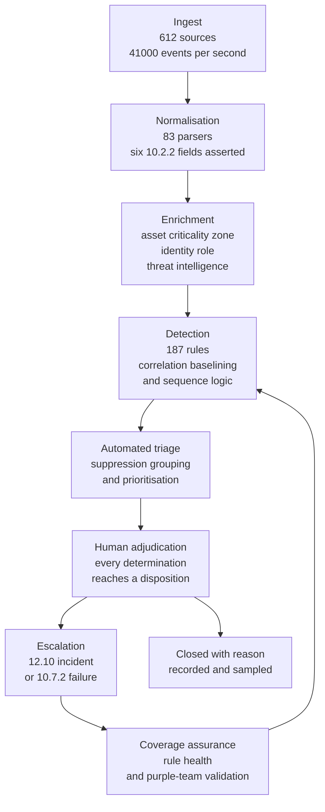

# 06.03 — Automated Log Review

| Field | Value |
|---|---|
| Document ID | MRG-PCI-2026-603 |
| Program | Marketa Retail Group — PCI DSS v4.0.1 Compliance Program |
| Phase | 06 — Monitoring, Testing &amp; Third Parties |
| Version | 1.0 |
| Status | Approved |
| Owner | Marcus Hale, Security Operations Manager |
| Approver | Naomi Bhatt, Chief Information Security Officer |
| Date | 2026-07-15 |
| Classification | Confidential — Cardholder Data Environment // Illustrative Portfolio Sample |

## Purpose

Requirement **10.4** — the review of what 06.01 collects and 06.02 protects. Four sub-requirements, one of them future-dated and now in force, and one of them carrying a targeted risk analysis.

| Sub-requirement | Obligation |
|---|---|
| **10.4.1** | The following are **reviewed at least once daily**: all security events; logs of all system components that store, process or transmit account data; logs of all critical system components; logs of all servers and system components that perform security functions |
| **10.4.1.1** | **Automated mechanisms** are used to perform audit log reviews — future-dated, mandatory since **2025-03-31** |
| **10.4.2** | Logs of all **other** system components are reviewed periodically |
| **10.4.2.1** | The **frequency** of periodic reviews under 10.4.2 is defined in the entity's **targeted risk analysis performed according to 12.3.1** — delivered in full at §6 |
| 10.4.3 | Exceptions and anomalies identified during the review process are **addressed** |

This is the document where Requirement 10 stops being an architecture problem and becomes a detection problem. Everything before it produces a record. **10.4 is the requirement that obliges somebody, or something, to look.**

## 1. What "Automated" Has To Mean

10.4.1.1 was best practice until 31 March 2025 and is now mandatory. It is the shortest requirement in this phase and the easiest to claim falsely, because almost every entity already owns a product that could be described as automating log review.

> **A SIEM dashboard nobody opens is not automated review. Neither is a nightly report emailed to a distribution list. Neither is a search saved by an analyst who left in 2024.**

The requirement's purpose statement is about scale: manual log review is not feasible at the volumes modern estates produce, and automation exists so that the review actually covers the population rather than covering whatever a person had time for. That purpose supplies the test. **A mechanism satisfies 10.4.1.1 when it applies a defined analytical determination to the whole in-scope log population, on the required cadence, and produces an output that is itself accounted for.** Three limbs, and entities fail on different ones.

| Limb | What it obliges | The common failure |
|---|---|---|
| **Applies a determination** | Something must decide. A rule, a correlation, a statistical model, a signature — a mechanism that classifies rather than merely presents | A dashboard **presents**. It classifies nothing. The determination is still being made by whichever human happens to look, which is manual review with a nicer interface |
| **Across the whole population, on the cadence** | Every source in the 10.4.1 population, every day, with coverage measurable | Rules exist for three noisy sources and none for the other four hundred. Coverage is never measured, so the gap is never visible |
| **Producing an accounted-for output** | Every output reaches a defined disposition. Nothing is generated and ignored | The output goes to a queue with a five-figure backlog, or to a mailbox rule. **An alert nobody adjudicated is indistinguishable from an alert nobody generated** |

Marketa's position, recorded so it can be challenged: the third limb is the one that decides whether the control is real. The first two are procurement and configuration. The third is an operating discipline, and it is the only one that produces evidence an assessor can sample — a named person, a timestamp, a decision, and a reason.

### 1.1 What Marketa does not claim

Automation does not remove the human; it changes what the human does, from reading logs to adjudicating determinations, and **10.4.3 still obliges exceptions to be addressed, which is a human act**. Continuous alerting is not the same thing as daily review and Marketa evidences both separately — §3.3. A model that cannot say why it flagged something is used to prioritise, never to close. And coverage of the log population is not coverage of the threat: 187 detection rules cover what Marketa thought of, and §4.4 measures that gap rather than asserting there is none.

## 2. The Review Populations

10.4.1 defines its population by four limbs. 10.4.2 takes everything else. The split has to be made explicitly, because an entity that never draws the line has implicitly claimed the daily population is whatever it happens to review daily.

| 10.4.1 limb | Marketa's population |
|---|---|
| All **security events** | Every event classified into one of the 41 event classes as security-relevant, from any source in the assessment — including sources outside the 71, such as the 482 store servers and the wireless controller |
| Logs of all components that **store, process or transmit account data** | The **8 CDE components**. CDE-03, CDE-04, CDE-05 and CDE-06 process or transmit full PAN; CDE-02 and CDE-08 store truncated PAN and cardholder name |
| Logs of all **critical system components** | The 8 CDE components plus the connected-to components on which CDE availability, integrity or boundary state depends |
| Logs of all servers and components that **perform security functions** | Identity, privileged access, secrets, logging, endpoint, patch and configuration, vulnerability scanning, backup, virtualisation and cloud control plane, boundary enforcement, payment-page integrity, and core network foundation services |

### 2.1 The split across the 71

| Population | Count | Composition |
|---|---|---|
| **10.4.1 — reviewed daily** | **60 of 71** | The 8 CDE components, plus 52 connected-to components that are critical to the CDE or perform a security function |
| **10.4.2 — reviewed periodically** | **11 of 71** | Below |
| **Total** | **71** | |

| 10.4.2 sub-population | Components | Count | Why it is not in the 10.4.1 population |
|---|---|---|---|
| Contact-centre telephony boundary | CT-58, CT-59, CT-60 | 3 | In scope because they determine the DTMF suppression point and the recording state. They hold no account data — masking is upstream at Cadence — perform no security function for the CDE, and have no permitted path to Z1 or Z2 |
| Payment-page delivery and caching tier | CT-53, CT-54, CT-55 | 3 | Content delivery and caching. Their integrity is addressed preventively by 6.4.3 in 04.10 and detectively by 11.6.1 in 06.09; **the tag-management console and the page-integrity monitor are not in this group** and are reviewed daily |
| Virtualisation and storage platforms carrying no CDE tenancy | CT-38, CT-39, CT-41 | 3 | Host connected-to workloads only. The Z1 CDE runs on dedicated physical hardware in dedicated cabinets with no shared hypervisor or storage fabric — 03.02 — so these platforms cannot present a CDE workload |
| Archive and replication media tier | CT-35, CT-37 | 2 | The backup **control planes** CT-34 and CT-36 are in the daily population because they can restore and therefore alter. These two are the media and replication targets |
| **Total** | | **11** | |

Two components in that table are close calls and are recorded as such. **CT-37** holds a synchronous replica of CDE-02 at Ashburn, which is a restorable copy of a CDE datastore; it is in the 10.4.2 population only because access to it is brokered exclusively through CT-34, whose logs are reviewed daily, and because the replica is encrypted under keys held by CT-17. **CT-55** sits in the delivery path of a payment page, which is the highest-consequence content in the estate; it is in the 10.4.2 population only because the detective control over that page's integrity is 11.6.1 running continuously from a separate provider, and not because the component is unimportant. Both determinations are re-examined at each annual review of TRA-10.4.2.1, and both would move to the daily population on any change to those conditions.

**Crucially: placing a component in the 10.4.2 population changes the review cadence, not the alerting.** Automated detection runs against all 71 continuously. A boundary-relevant event on CT-58 raises an alert in the same minute as one on CDE-01. What differs is the cadence of the attested human review of the automated output, which is the thing 10.4.2 and 10.4.2.1 actually govern. Entities that conflate the two end up either reviewing nothing daily or alerting on nothing periodically, and both are worse than the split.

## 3. The Daily Review — 10.4.1

### 3.1 The mechanism

| Stage | What it does | Requirement limb served |
|---|---|---|
| Normalisation | 83 parsers map vendor events into 41 classes and assert the six 10.2.2 fields | 10.2.2, and the precondition for any determination |
| Enrichment | Adds asset criticality, zone, owner, identity role, privileged status, and threat-intelligence context | Makes a determination about **this** environment rather than about an event type |
| Detection | 187 rules across signature, correlation, sequence, threshold and behavioural-baseline classes | **10.4.1.1 — the analytical determination** |
| Automated triage | Deduplication, grouping into cases, suppression against approved change records, priority assignment | Keeps the adjudication queue at a size a human can actually clear |
| Adjudication | An analyst reaches a disposition on every case | **10.4.1 review, and 10.4.3 addressing** |
| Coverage assurance | Rule health, silent-rule detection, and quarterly adversary-simulation validation | The answer to "how do you know it would have fired?" |

### 3.2 Volumes, and why they are the wrong metric on their own

| Measure | Daily average | Note |
|---|---|---|
| Events ingested | ~3.5 billion | The population, not the workload |
| Events matching a detection rule | 41,800 | Before triage |
| Cases presented for adjudication after triage | **112** | The number a human sees |
| Cases adjudicated within the same operating day | **112** — 100% | The 10.4.1 daily obligation |
| Cases escalated to a 12.10 incident | 1.4 | 512 across the operating period |
| Cases escalated as a 10.7.2 control failure | 0.06 | 21 across the period — 06.04 §5 |
| Median time from presentation to disposition | **8 minutes** for P1 and P2; 4 hours for P3 and P4 | Within the operating day by design |
| Oldest unadjudicated case at any daily close | **0** | The queue is cleared daily. §3.4 |

An entity that reports 3.5 billion events has reported the size of its estate. An entity that reports **112 adjudicated cases with a zero-aged queue** has reported whether its review happens. Marketa reports both, in that order, because the second is the one the requirement is about.

### 3.3 Continuous alerting and daily review are different obligations

| | **Continuous alerting** | **Daily review** |
|---|---|---|
| What it is | Detection fires in real time; P1 and P2 cases page a responder immediately, day or night | A defined review point at which the day's determinations are accounted for |
| What it evidences | That an event is acted on when it happens | That **10.4.1** happened — every day, over the whole population |
| At Marketa | 24 hours, Marketa security operations 06:00–22:00 and Northbridge 22:00–06:00 | A daily review at **09:00** covering the preceding 24 hours, with a named reviewer and a signed record |
| Evidence produced | Case records with response timestamps | **365 daily review records** in the operating period, each naming the reviewer, the population covered, the case counts by disposition, and the coverage exceptions |

The daily review record is the artefact the assessor samples, and it exists as a distinct thing precisely because continuous alerting does not produce one. An entity operating a 24-hour SOC and no daily review point has an excellent detection capability and no evidence that 10.4.1 occurred, which is an avoidable finding.

The daily record also carries what the day's automation **did not** cover: sources in a failed state, rules disabled, parsers in regression. That is the part that turns a review record from a performance report into a control record.

### 3.4 Zero aged cases, and why that is not automatically good

A cleared queue can mean a well-sized detection set. It can also mean rules tuned until they stop firing. The two look identical from outside, and Marketa records four measures that distinguish them.

| Measure | Value | What it shows |
|---|---|---|
| True-positive rate across adjudicated cases | **17.4%** | Cases whose investigation found a real condition, benign or otherwise. A rate near zero indicates noise; a rate near one indicates under-detection |
| Cases closed as "expected activity, matched to an approved change" | 46.1% | Correlation against the change record is automatic; these are cheap to close and are counted separately so they cannot inflate the true-positive rate |
| **Rules that produced no case in 90 days** | **12 of 187** | Reviewed individually — 8 retained as low-frequency high-value, 3 retuned, **1 retired as unreachable in the current architecture** |
| Detections the quarterly adversary simulation raised that no rule caught | **4 across the year** | The honest coverage figure. §4.4 |

## 4. Detection Engineering

The interesting part of 10.4.1.1 is not the platform. It is the question of what the automation is looking for, who decided that, and how anybody knows it works.

### 4.1 The rule set

| Class | Rules | What it catches | Example determination |
|---|---|---|---|
| **Identity and access** — authentication, privileged activity, application and system accounts | **60** | Credential attacks, MFA fatigue, impossible travel, administrative action outside change windows or from unexpected origins, and **interactive use** of a non-interactive account | A cloud role assumed from an unseen network location; a batch account authenticating outside its window — the control that partly mitigates the two accounts behind the 8.6.2 finding |
| **Cloud control plane** | 24 | Identity, key, network and logging configuration change in the Z2 accounts | **Modification or deletion of an audit trail** |
| **Malware and endpoint** | 21 | Detection, quarantine failure, agent state change, execution from unexpected paths | EDR agent stopped on a CDE component |
| **Boundary and segmentation** | 19 | Traffic or configuration change that alters what a zone can reach | **A trunk allowed-VLAN list changing on a store switch** — the store 0417 signature |
| **Data movement and account data access** | 30 | Access to cardholder data outside expected role, volume or hour; volume, destination and content anomalies including the PAN-pattern quarantine | A disputes analyst rendering images at a rate inconsistent with the case queue |
| **Audit and logging integrity** | 9 | 10.2.1.6 events, source silence, parser failure, lock-policy divergence | An audit subsystem stopping outside a maintenance record |
| **Payment-page, third-party integration and store estate** | 24 | Publication path and tag-manager activity, provider interface behaviour outside profile, store port transitions and wireless classification changes | A change to a payment template outside the release process |
| **Total** | **187** | | |

### 4.2 Where the rules come from

Six sources feed the rule set. **The risk register** — 44 risks, each mapped to the detections that would show it materialising, with R-25 producing four rules on its own. **Penetration test findings** — 19 findings across the segmentation and application tests produced 11 new rules. **The two evidence-raised risks** — R-14 produced the store-switch configuration rules, R-31 the PAN-pattern quarantine and its 12.10.7 route. **Incidents and near-misses**, each closing with a detection review. **Threat intelligence** from the Retail and Hospitality ISAC, POS malware families and e-commerce skimming tradecraft. And **the requirements themselves**: 10.2.1.1 to 10.2.1.7 each generate at least one detection, because an event class worth logging is an event class worth a determination.

The second source is the discipline worth naming. **A penetration test finding is a detection failure as well as a control failure.** The tester reached Z5 from Z7 at store 0417 in nineteen minutes, and the first question Marketa asked after remediation was not "how do we stop it" but "what would we have seen". The answer at the time was: the port transition, and nothing else. There are now seven store-estate detections where there were two.

### 4.3 Rule lifecycle

| Stage | Control |
|---|---|
| Proposal | Any analyst, any incident review, any risk owner. Recorded with the threat it addresses and the log sources it requires |
| Development | Written against a test fixture with positive and negative cases; a rule with no negative case is rejected because it has not been shown to discriminate |
| Validation | Run in shadow for **14 days** against production data; the projected case volume must be adjudicable |
| Promotion | Approved by the Security Operations Manager; version-controlled; the change is itself a logged event |
| Health monitoring | Firing rate, true-positive rate and source dependency monitored continuously. **A rule whose required source has failed is reported as a rule failure, not as a quiet zero** |
| Review | Every rule reviewed at least annually; the 12 silent rules in §3.4 reviewed at 90 days |
| Retirement | Requires the same approval as promotion, with the reason recorded. **One retirement in the period** |

The health-monitoring row is the direct treatment of **R-28** — automated log review failing silently. A rule depends on a source; if the source fails, the rule stops firing and the dashboard stays green. Marketa's rules declare their source dependencies, and a failed dependency degrades the rule's status explicitly rather than silently.

### 4.4 Proving the automation works

| Method | Cadence | Result in the period |
|---|---|---|
| **Detection validation by controlled execution** | Quarterly, with Ironwood Security Labs | 46 techniques executed across the CDE and the store estate. **42 detected**, 4 not |
| Synthetic event injection end to end | Weekly | 4 chain failures found — 06.01 §4.2 |
| Rule regression testing on every change | Per change | 3 regressions caught before promotion |
| Penetration test detection review | Per engagement | The 19 findings mapped to detection coverage; 11 rules added |
| Northbridge handover test | Quarterly | An injected P2 case at 03:00, unannounced. **All four passed**; the slowest acknowledgement was 6 minutes |

The four undetected techniques are the honest number in this document. They were: credential dumping from process memory on a connected-to Windows host, where the EDR prevented but did not alert in a form the SIEM consumed; an over-permissive cloud role modified in a way that fell below the rule's threshold; a DNS-based exfiltration channel from the store estate; and a scheduled-task creation on a store server that the store-estate rule set did not cover. **All four now have rules.** The number is reported rather than the 42, because 42 detections describes a rule set and 4 misses describes its edge.

## 5. Exceptions and Anomalies — 10.4.3

10.4.3 obliges exceptions and anomalies identified during the review process to be **addressed**. It does not say "investigated", "logged" or "triaged". Addressing means reaching an outcome.

| Disposition | Definition | Share of cases | Evidence produced |
|---|---|---|---|
| **Expected activity** | Correlated to an approved change, a scheduled job, or a documented business process | 46.1% | The correlating record, automatically attached |
| **Benign anomaly** | Real and unexpected, with a determined non-security cause | 24.0% | The cause, named. **"Probably a scanner" is not a cause** |
| **Control condition** | A control is not operating as intended | 11.4% | A 10.7.2 failure record if the control is a critical security control system; otherwise a defect with an owner and a date |
| **Security incident** | Escalated under 12.10 | 1.2% | An incident record |
| **Tuning** | The determination was correct and the rule is imprecise | 12.6% | A rule change through the §4.3 lifecycle. **A tuning disposition requires a rule change to be raised; it cannot be used to close a case without one** |
| **Unresolved** | Investigated without reaching a cause | **4.7%** | Retained open for 30 days with a named owner, then closed as unresolved with the evidence preserved |

Two rules govern this table and both exist to stop the disposition set from becoming a way to make cases disappear.

**A tuning disposition must produce a rule change.** Otherwise "tuning" becomes the closure reason for anything inconvenient, and the rule keeps firing while everybody knows to ignore it — which is the state that precedes every missed alert in every incident post-mortem ever written.

**Unresolved is a permitted disposition and is reported.** 4.7% of cases were investigated and no cause was established. Forcing every case to a determined cause produces fabricated causes, and a plausible story recorded as a fact is how a detection programme stops being able to see. The unresolved rate is reported monthly to the Steering Committee and its trend matters more than its level.

### 5.1 Independent re-performance

Rosa Delgado's internal audit function re-performs a sample of adjudications independently: **40 cases per quarter**, selected at random and weighted toward cases closed as expected activity.

**Ten disagreements arose across the four cycles** — five in Q1, two in Q2, one in Q3 and two in Q4. Three were closures as expected activity where the correlating change record did not in fact cover the observed action, four were benign closures with no named cause, one was an under-classified severity, one was an expected-activity closure against an expired change record, and one was a tuning disposition with no rule change raised — the disagreement that produced the tuning rule stated above.

Ten out of 160 sampled cases is the figure that shows adjudication is being performed rather than approved. A re-performance that never disagrees is evidence about the re-performance, not about the adjudication.

## 6. TRA-10.4.2.1 — Frequency of Periodic Review for Other System Components

Requirement **10.4.2** obliges logs of all other system components to be reviewed periodically. **10.4.2.1** obliges the frequency of those reviews to be defined in the entity's **targeted risk analysis performed according to 12.3.1**. This is that analysis. It is **#6 of the programme's fourteen** targeted risk analyses. Phase 06 carries **four** of the fourteen: TRA-10.4.2.1 (#6), TRA-11.3.1.1 (#7), **TRA-11.6.1 (#8)** and the elective **TRA-12.8.4 (#13)** — the last two delivered in the second half of this phase.

| Field | Value |
|---|---|
| Analysis ID | **TRA-10.4.2.1** |
| Requirement | 10.4.2.1 — frequency of periodic log review for system components not covered by 10.4.1 |
| Performed under | **12.3.1** |
| Owner | Marcus Hale, Security Operations Manager |
| Contributors | Trevor Kim, Bill Traynor, Sonia Rendell, Owen Castellanos |
| Approver | Naomi Bhatt, Chief Information Security Officer |
| Date performed | 2026-05-06 |
| Date approved | 2026-05-13 |
| Next review due | **2027-05-13**, and on any significant change under SIG-1 to SIG-10 |
| **Determination** | **Monthly**, as an attested human review of the automated output for the 11 components — with **continuous automated detection and real-time alerting retained across all 71** |

### 6.1 Element 1 — Assets being protected

| Asset | Description |
|---|---|
| The **11 components** in the 10.4.2 population | The telephony boundary that determines the DTMF suppression point; the payment-page delivery and caching tier; three virtualisation and storage platforms with no CDE tenancy; the archive and replication media tier |
| The **scope reductions those components hold up** | CT-58 to CT-60 carry condition **MOTO-C2** — the suppression point staying upstream of Marketa. CT-53 to CT-55 sit in the delivery path of a page whose integrity keeps 15.7M e-commerce transactions out of Marketa's CDE |
| The **audit record itself** | CT-35 and CT-37 hold copies of data whose primary is in the CDE, and copies of the audit history in 06.02 |
| The assessed population's boundary | Each of the 11 is in scope because of a connectivity or determination relationship. **A component in scope for a reason nobody reviews is a component whose reason can change unobserved** |

### 6.2 Element 2 — Threats the requirement protects against

| Threat | Realisation in Marketa's environment |
|---|---|
| **A scope-determining condition changes without anybody noticing** | The dominant threat, and it is specific. A telephony routing change moves the DTMF suppression point downstream of Marketa and puts spoken account data into Marketa's estate — **R-23**, and condition MOTO-C2 |
| **Delivery-path compromise ahead of the payment page** | A cache or delivery-tier change alters what a consumer's browser receives. **R-01** at High 20 is the register's highest entry, and the delivery tier is one of its paths |
| **Slow, low-signal reconnaissance** | Activity that no single rule elevates but that a periodic look across a month would surface as a pattern |
| **Configuration drift on a platform nobody watches** | A hypervisor or storage platform accumulating changes that individually mean nothing and collectively change what the platform can present |
| **Silent loss of a log source in the periodic population** | A source whose absence would not be noticed for a month if the only control were the periodic review — mitigated outside this analysis by the 10.7.2 silence alert |

### 6.3 Element 3 — Factors contributing to likelihood and impact

| Factor | Direction | Weight | Basis |
|---|---|---|---|
| **All 11 components are covered by continuous automated detection regardless of this frequency** | Reduces likelihood **and** impact | **High** | The review cadence governs the human look at the output, not whether an alert fires. A P1 on CT-58 pages a responder in the same minute as a P1 on CDE-01 |
| Population size — **11 components**, small enough for a complete review with no sampling | Reduces likelihood | Moderate | A monthly review of 11 components is a real review; a monthly review of 400 would be a spot check calling itself a review |
| **None of the 11 has a permitted path to Z1 or Z2** | Reduces impact | High | 03.02 reachability computation; confirmed by the 11.4.5 re-test |
| **CT-58 to CT-60 hold condition MOTO-C2**, whose failure puts account data into Marketa's estate | **Increases impact** | **High** | **R-23** at Moderate 10, with impact 5. The consequence is a scope event, not a data-loss event, and a scope event discovered late is discovered after months of accumulated exposure |
| **CT-53 to CT-55 sit in the delivery path of a payment page** | **Increases impact** | **High** | **R-01** at High 20. Mitigated by 11.6.1 continuous tamper detection from 06.09, which is an independent detective control on the same path |
| CT-37 holds a synchronous replica of a CDE datastore | Increases impact | Moderate | Encrypted under CT-17 keys; access brokered exclusively through CT-34, which is in the daily population |
| Change rate across the 11 is low — **19 changes in the operating period**, against 27 significant changes per quarter estate-wide | Reduces likelihood | Moderate | Change records; the telephony platform in particular changes rarely and materially |
| The **October–January freeze** suppresses change across the store-adjacent estate for four months | Reduces likelihood in that window | Low | Does not apply to the telephony or cloud delivery components, which are not frozen |
| Detection coverage on these 11 is **thinner** than on the CDE — 23 of 187 rules reference them | Increases likelihood | Moderate | Measured. Recorded here rather than assumed away |

### 6.4 Element 4 — The resultant analysis and its justification

Four candidate frequencies were considered.

| Candidate | Argument for | Argument against | Decision |
|---|---|---|---|
| **Daily** | Simplest to describe; identical treatment for all 71; no line to draw and no line to defend | Adds 11 components to a daily review that already clears 112 cases, for a population with a measured change rate of 19 changes in a year. **The cost is not the machine time; it is reviewer attention, which is the scarce input.** Diluting the daily review is a real reduction in the quality of the review of the 8 CDE components | Rejected |
| **Weekly** | Bounds unobserved drift to seven days; aligns to the 11.5.2 weekly comparison cadence | The 19 changes in the period would produce, on average, a review with nothing in it 39 weeks out of 52. A recurring review that is usually empty is a review people stop opening — the failure mode this document opens by naming | Rejected |
| **Monthly** | Bounds unobserved drift to 31 days against a measured change rate of roughly 1.6 changes per month across the population. Aligns to the **12.5.1 monthly component reconciliation** and the monthly condition-verification cycle, so the reviewer sees the log evidence and the register evidence for the same component in the same sitting. Produces a review with content in it | 31 days is a long window for a scope-determining condition such as MOTO-C2 | **Adopted**, with the compensations below |
| **Quarterly** | Lowest cost; aligns to the TPSP review | Exceeds the drift window implied by the change rate, and would allow a telephony routing change to sit unobserved across a full quarter — which is exactly the R-23 scenario | Rejected |

**Determination: monthly**, executed within the first five working days of each month across all 11 components, covering the automated output for the preceding calendar month, with a named reviewer and a signed record on the same pattern as the daily record in §3.3.

Three compensations make the monthly cadence defensible, and they are part of the determination rather than commentary on it.

| Compensation | Effect |
|---|---|
| **Continuous automated detection and real-time alerting are retained across all 11** | The monthly cadence governs the attested review. It does not govern detection latency, which remains real-time. This is the substantive point of the determination and the reason the analysis does not reduce to "how long can we not look" |
| **Four event triggers force an out-of-cycle review** | Below |
| **The three MOTO-C2 components carry a daily automated condition assertion** | The suppression point's position is asserted daily by a technical check against the telephony configuration, independent of log review. The monthly review reads the assertion history; it is not the control protecting MOTO-C2, and this analysis records that explicitly |

| Trigger | Scope of the out-of-cycle review |
|---|---|
| Any **significant change** under SIG-1 to SIG-10 affecting one of the 11 | The affected component, before the change is closed |
| Any change to a **telephony routing, recording or suppression** configuration | CT-58, CT-59 and CT-60, immediately |
| Any **11.6.1 tamper alert** on a payment page, from 06.09 | CT-53, CT-54 and CT-55, immediately, as part of the incident |
| Any **10.7.2 failure** affecting a source in the periodic population | The affected component, on restoration, covering the full failure window |

The last trigger closes the obvious gap. A source that fails for eleven days inside a month would otherwise be reviewed once, after restoration, with the failure window silently absent from the population reviewed. The trigger obliges the restored window to be reviewed on its own.

### 6.5 Element 5 — Annual review of this analysis

Reviewed at least once every twelve months, next due **2027-05-13**, by Marcus Hale with Trevor Kim and Bill Traynor, approved by Naomi Bhatt. The review asks whether the factors in §6.3 have moved: the composition of the 11, the change rate, the detection-rule coverage on those components, whether 11.6.1 has operated for a full cycle on the payment-page delivery path, and whether the two close calls — CT-37 and CT-55 — still meet the conditions that keep them out of the daily population.

### 6.6 Element 6 — Triggers for an updated analysis before the annual date

| Trigger | Effect |
|---|---|
| Any component entering or leaving the 10.4.2 population | The analysis is re-performed for the changed population before the next monthly cycle |
| A change to the DTMF suppression point or the telephony provider arrangement | **Immediate re-performance.** MOTO-C2 is the condition this analysis is most sensitive to |
| Any incident originating on a component in the 10.4.2 population | Re-performance within 30 days, whatever the incident's outcome |
| A material change in the change rate across the population — more than double the measured 19 per year | Re-performance |
| A 11.6.1 detection failure on the payment-page delivery path | Re-performance; the analysis relies on that control as an independent detective layer |
| Any change to the 10.4.1 population definition, including a QSA challenge to the split in §2.1 | Re-performance |

## 7. Coverage Position at 2026-07-15

| Requirement | Position | Evidence |
|---|---|---|
| **10.4.1** | Met — **60 of 71** components in the daily population under all four limbs, with a named reviewer and a signed daily record; **365 records** in the operating period; zero aged cases at any daily close | Daily review records; case adjudication history |
| **10.4.1.1** | Met — 187 version-controlled detection rules applying a determination across the whole population, with an accounted-for output; validated quarterly by controlled execution (**42 of 46 techniques detected**) and weekly by synthetic injection | Rule repository; validation results; the 4 undetected techniques and their remediating rules |
| **10.4.2** | Met — **11 of 71** components reviewed monthly with a signed record; continuous automated detection retained across all 11 | Monthly review records |
| **10.4.2.1** | Met — **TRA-10.4.2.1** performed 2026-05-06, approved 2026-05-13, determination **monthly** with four event triggers and a daily condition assertion on the MOTO-C2 components | §6 in full; the 12.3.1 register |
| **10.4.3** | Met — six defined dispositions, every case reaching one, a tuning disposition requiring a rule change, an unresolved rate of 4.7% reported rather than eliminated, and independent re-performance of 160 cases producing 10 disagreements | Disposition records; internal audit re-performance results |

## 8. Risks Treated

| Risk | Rating | How this document treats it | Residual |
|---|---|---|---|
| **R-28** — automated log review fails silently behind a healthy dashboard | Moderate 12 | Rules declare their source dependencies and degrade explicitly when a dependency fails; 12 silent rules reviewed at 90 days; quarterly controlled execution measures what the rule set misses rather than what it catches | **Moderate.** The 4 undetected techniques are why it is not reduced further |
| **R-25** — a cloud boundary changed by one API call with no symptom | Moderate 12 | 4 dedicated detections in the cloud control-plane class; the change is a case within minutes and correlates automatically against the change record | Low by Phase 09 |
| **R-23** — the DTMF suppression point moves downstream of Marketa | Moderate 10 | Daily automated condition assertion, plus an immediate out-of-cycle review trigger under TRA-10.4.2.1 | Moderate — the condition is contractual and operational, not technical |
| **R-01** — unauthorised script on a payment page | High 20 | 8 payment-page detections and the delivery-tier triggers here; the substantive detective control is **11.6.1 in 06.09** | High until 11.6.1 has operated for a full cycle |
| **R-12** — insider misuse where full PAN is legitimately visible | Moderate 12 | 14 account-data-access detections keyed to role, volume and hour rather than to permission | Moderate |
| **R-11** — a responsibility gap with Northbridge | Low 6 | The unannounced 03:00 handover test, quarterly; four passes with a slowest acknowledgement of 6 minutes | Low |
| **R-43** — incident procedures not exercised against the scenarios this estate produces | Low 6 | Detection validation executes the scenarios rather than tabletopping them | Low |

## Cross-References

| Reference | Relevance |
|---|---|
| 02.06 — Call Centre / MOTO Channel Scope | Condition MOTO-C2 and the suppression point, central to TRA-10.4.2.1 |
| 02.08 — Connected-To &amp; Security-Impacting Systems | CT-18 as the automated review engine; the components in the 10.4.2 population |
| 03.07 — Segmentation Penetration Test | The store 0417 finding, and the detection question it produced |
| 03.11 — Risk Register | R-01, R-11, R-12, R-23, R-25, R-28, R-43 |
| 04.08 — Change Control | The change records against which 46.1% of cases close as expected activity |
| 05.07 — Application &amp; System Accounts | The interactive-use detections, and the two accounts behind the 8.6.2 finding |
| 06.01 — Logging Strategy &amp; Architecture | The 612 sources, the 41 event classes and the synthetic injection test |
| 06.02 — Log Retention &amp; Protection | The hot tier this review queries |
| 06.04 — Time Synchronisation &amp; Failure Detection | 10.7.2, and the 21 control failures escalated from adjudication |
| 06.09 — Payment Page Tamper Detection | **11.6.1**, on which TRA-10.4.2.1 relies as an independent detective layer. Foreshadowed here, delivered there |
| Phase 07 — Security Policy, Risk &amp; Incident Response | 12.10 escalation from adjudication; the 12.3.1 register holding this analysis |
| Phase 08 — QSA Assessment &amp; ROC Production | 10.4.1.1 as a future-dated requirement in its first assessment |

---
[⬅ Previous](06.02-log-retention-and-protection.md) · [🏠 Phase 06 Home](06.00-README.md) · [Next ➡](06.04-time-synchronisation-and-failure-detection.md)
