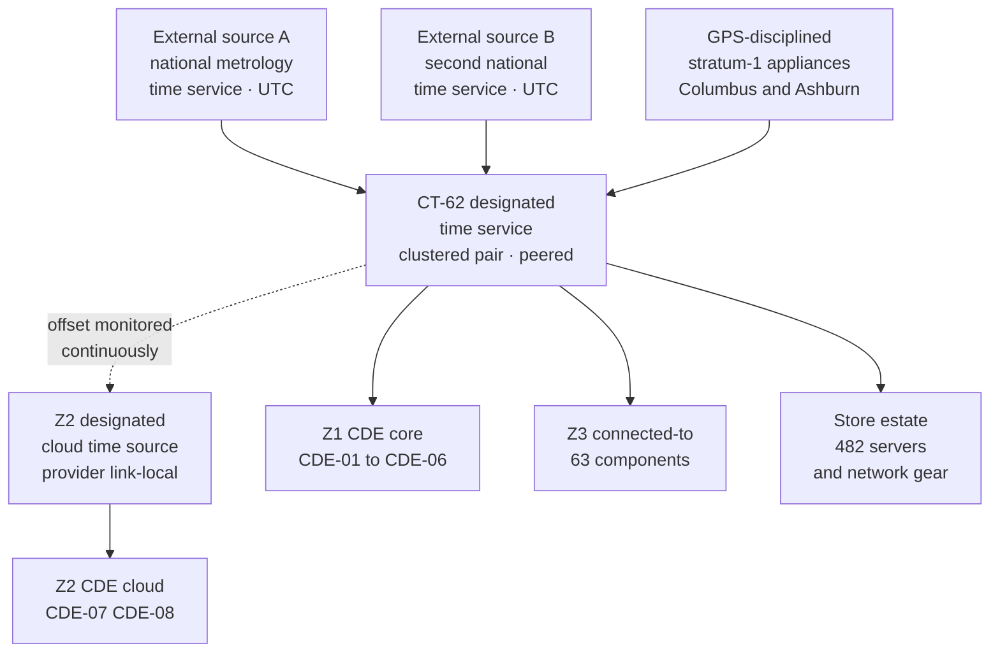

# 06.04 — Time Synchronisation &amp; Failure Detection

| Field | Value |
|---|---|
| Document ID | MRG-PCI-2026-604 |
| Program | Marketa Retail Group — PCI DSS v4.0.1 Compliance Program |
| Phase | 06 — Monitoring, Testing &amp; Third Parties |
| Version | 1.0 |
| Status | Approved |
| Owner | Marcus Hale, Security Operations Manager |
| Approver | Naomi Bhatt, Chief Information Security Officer |
| Date | 2026-07-15 |
| Classification | Confidential — Cardholder Data Environment // Illustrative Portfolio Sample |

## Purpose

Requirement **10.6** — time synchronisation — and **10.7** — detection, alerting and response for failures of critical security control systems. Two requirement families that appear unrelated and are not: **10.6 decides whether the audit record can be assembled into a sequence, and 10.7 decides whether anybody finds out when a control stopped producing one.**

| Sub-requirement | Obligation | Applies to Marketa? |
|---|---|---|
| **10.6.1** | System clocks and time are synchronised using time-synchronisation technology | Yes |
| **10.6.2** | Systems are configured to the correct and consistent time — six specific conditions | Yes |
| **10.6.3** | Time synchronisation settings and data are protected; changes to time settings on critical systems are logged, monitored and reviewed | Yes |
| **10.7.1** | Failures of critical security control systems detected, alerted and addressed promptly | **No — service providers only.** §4.1 |
| **10.7.2** | The same obligation, with a longer control list, **for all entities** — future-dated, in force since **2025-03-31** | **Yes** |
| **10.7.3** | Failures of critical security control systems **responded to promptly**, with seven specified elements including duration and root cause | Yes |

## 1. Why Time Is a Security Control

An audit record without reliable time is a set of assertions in no particular order. Every question an investigation asks is a question about sequence: did the authentication precede the privilege change, did the boundary change precede the traffic, did the file modification precede the process execution. On a single host the ordering is local and reliable. **Across 71 components in nine zones, two data centres, two cloud regions and 482 stores, ordering exists only because the clocks agree.**

**R-44** in the register — time synchronisation drifts or a log source is lost without alerting, degrading the forensic record on which any investigation would depend — is Low 4. It is Low because the controls in this document work, and it is in the register at all because the failure mode is silent: nothing breaks when a clock drifts. Transactions still settle. Logs still arrive. The only symptom is that a future investigation reaches a wrong conclusion, and by then nobody is looking for a clock.

## 2. Time Synchronisation Technology — 10.6.1

10.6.1 obliges system clocks and time to be synchronised using time-synchronisation technology. Marketa's hierarchy is three levels deep and no component is more than two hops from a reference clock.

| Level | Element | Detail |
|---|---|---|
| Reference | **Two GPS-disciplined stratum-1 appliances** at Columbus and Ashburn, plus two external national time services over authenticated network time | Three independent classes of source, so no single failure or manipulation moves the hierarchy |
| Designated servers | **CT-62**, a clustered pair, one at Columbus and one at Ashburn, **peered with one another** | The 10.6.2 peering condition. Each holds the other's opinion of the time and neither can drift alone without being seen |
| Cloud | The provider's link-local time service, **designated** as the Z2 time source, with its offset against CT-62 monitored continuously | §3.2 records why this is a designation rather than an exception |
| Clients | All 71 assessed components, the 482 store servers, the store network estate and the wireless controllers | Configured to the designated servers only |

Protocol is authenticated network time throughout: symmetric key authentication to the store estate and to appliance-class clients that support nothing better, and network time security to the data-centre and cloud client population. Unauthenticated time is accepted from nowhere.

## 3. Correct and Consistent Time — 10.6.2

10.6.2 sets **six** conditions, and they are worth listing individually because entities routinely satisfy four of them and assume the requirement.

| Condition | Marketa's position | Evidence |
|---|---|---|
| **One or more designated time servers are in use** | CT-62, a peered pair | Configuration; the client-side assertion in §3.1 |
| **Only the designated central time servers receive time from external sources** | Only CT-62 has an external time association. No other component in the assessment holds one; egress on the time protocol from any other source is denied at the boundary | Firewall rule set; the daily client-side assertion |
| **Time received from external sources is based on International Atomic Time or UTC** | Both external services and both GPS appliances deliver UTC | Source documentation; observed stratum and reference identifier |
| **Designated servers accept time updates only from specific, industry-accepted external sources** | Four named sources, pinned by address and authenticated. **No pool, no discovery, no fallback to an unnamed source** | CT-62 configuration; §3.3 |
| **Where there is more than one designated time server, the servers peer with one another** | The Columbus and Ashburn members peer | Configuration; peer-offset telemetry |
| **Internal systems receive time information only from the designated central time servers** | Enforced by configuration and by boundary rule; asserted daily against every component | §3.1 |

### 3.1 The daily client-side assertion

Configuration proves intent. The assertion proves state, and it is the control that would catch a component pointed somewhere else by a build image, a vendor default or a well-meaning engineer.

| Assertion, run daily across all in-scope components | Result at 2026-07-15 |
|---|---|
| The component's configured time source is a designated server, and only a designated server | **71 of 71** assessed components conform; **482 of 482** store servers conform |
| The component's measured offset from CT-62 | CDE components: **maximum 11 milliseconds**, median 2. Connected-to: maximum 34 ms. Store estate: maximum **critically 610 ms** at one site during a circuit degradation, otherwise under 90 ms |
| The component's synchronisation state is "synchronised", not "unsynchronised" or "holdover" | 71 of 71; 480 of 482 store servers, the two exceptions being sites with an open circuit fault |
| No component holds an external time association | Confirmed; **1 exception found and corrected** — §3.4 |

Alert thresholds are set by consequence rather than by a single number: **100 milliseconds** on any CDE component or any component whose logs establish sequence across a boundary, and **one second** elsewhere. The store-estate threshold is deliberately looser because a wide-area link with a variable path cannot hold a hundred milliseconds, and an alert that fires on physics teaches people to ignore it.

### 3.2 The cloud determination

Z2's workloads take time from the provider's link-local time service rather than from CT-62. This is the one place where a literal reading of "internal systems receive time information only from designated central time servers" needs an explicit determination rather than a configuration.

| Question | Determination |
|---|---|
| Is the provider's service an external source, making Z2 workloads non-conformant? | **No.** The provider's link-local service is **designated** as a central time source for Z2 in Marketa's time standard, which is what the requirement contemplates — the requirement obliges designation, not a single server |
| Why not point Z2 workloads at CT-62 across the boundary? | It would require a time association from the CDE cloud VPC to Z3 on every workload, in an environment where workloads are immutable and replaced continuously, and would make time in Z2 depend on a network path that has a failure mode the link-local service does not |
| How is consistency across the two designated sources evidenced? | **Continuous offset monitoring between CT-62 and the Z2 designated source**, alerting at 50 milliseconds. Maximum observed offset in the period: **7 milliseconds** |
| Was this reviewed? | Yes — presented to Sable Ridge at the 2026-06 checkpoint and recorded, because a determination an assessor sees for the first time in November is a finding rather than a determination |

### 3.3 Why the source list is pinned

The four external sources are named and pinned. Marketa uses no public time pool anywhere in the assessment, and the reason is that a time source is an unauthenticated, trusted input that no operating system treats with suspicion. An adversary able to influence time on the designated servers can move every clock in the estate, expire or un-expire certificates, shift authentication token validity windows, and — most usefully — **make the audit record of their own activity land in a window nobody is looking at.**

Three defences: the sources are pinned and authenticated; the hierarchy holds three independent classes of source so a single manipulated one is outvoted; and a step change greater than one second is **never** applied automatically — CT-62 refuses it, alerts, and requires a human decision.

### 3.4 The one exception found

A store-estate appliance class — 41 devices across 29 stores — was found in April 2026 holding a vendor-default external time association in its firmware, alongside the designated server. The devices were taking time from whichever source answered first.

The offset was never material; the finding is that the condition existed at all, undetected, from deployment until the day the daily assertion was extended to cover appliance-class devices. Corrected by 2026-05-08 by firmware configuration and by an egress deny on the time protocol at the store WAN edge, which is the control that would have prevented it in the first place. The event is recorded because it is the second time in this programme that a store-estate default has quietly established a path nobody designed — the first being the trunk configuration behind **R-14**.

## 4. Failures of Critical Security Control Systems — 10.7

### 4.1 10.7.1 is a service-provider requirement

**10.7.1 applies to service providers only.** Marketa is a merchant. The requirement is therefore **not part of Marketa's applicable requirement set** and was **never among the 306** applicable sub-requirements assessed.

That distinction matters for how the ROC reads. Service-provider-only requirements — 10.7.1, 11.5.1.1, 11.4.6, 12.5.2.1, 12.5.3, 12.4.2, 3.6.1.1 and the Appendix A1 and A3 sets — were excluded from the applicable population at scoping, not marked Not Applicable during assessment. **The ROC's four Not Applicable entries are merchant-applicable sub-requirements determined not to apply to Marketa's specific environment**, and conflating the two categories would misstate both. Phase 08 names the four.

**10.7.2 imposes materially the same obligation on all entities** and has been mandatory since 2025-03-31. It is one of the 51 future-dated requirements and 2026 is Marketa's first assessment with it in force. Its control list is longer than 10.7.1's: it adds **audit log review mechanisms** and **automated security testing tools** to the eight classes 10.7.1 names.

### 4.2 What counts as a critical security control system at Marketa

10.7.2 enumerates the classes. Marketa maps each to named components, because a requirement about the failure of a control system is unanswerable until the entity has said which systems those are.

| ID | 10.7.2 control class | Marketa's systems | Failure means |
|---|---|---|---|
| **CSC-1** | Network security controls | CT-43 to CT-51 — perimeter, zone boundary, cloud boundary and store WAN edge | A boundary stops enforcing, or stops being able to report that it is enforcing |
| **CSC-2** | Intrusion detection and prevention | CT-22 and the sensors at the Z1 and Z2 perimeters and internal critical points | Traffic passes unexamined |
| **CSC-3** | Change-detection mechanisms | CT-21 file integrity monitoring across the 71 | Unauthorised file modification stops generating an alert |
| **CSC-4** | Anti-malware solutions | CT-23 endpoint detection and response, CT-24 definition distribution and removable-media policy | A component runs unprotected, or definitions stop updating |
| **CSC-5** | Physical access controls | Badge and access-control systems at Columbus and Ashburn, and the sensitive-area controls in 05.08 | Physical entry stops being controlled or recorded |
| **CSC-6** | Logical access controls | CT-01 to CT-13 — directory, MFA, privileged access brokering, the CT-14 vault | Authentication or authorisation degrades, or MFA fails open |
| **CSC-7** | Audit logging mechanisms | CT-18, CT-19, CT-20 and the agents — the whole of 06.01 and 06.02 | The record stops being produced or stops being kept |
| **CSC-8** | Segmentation controls | CT-48 and the boundary enforcement in CSC-1, where used to reduce scope | The scope reduction stops being true |
| **CSC-9** | **Audit log review mechanisms** | CT-18's detection and correlation engine, the 187 rules, the 83 parsers | **The logs are still produced and nothing looks at them** — the 10.7.2 addition, and the direct treatment of **R-28** |
| **CSC-10** | **Automated security testing tools** | CT-31, CT-32 vulnerability scanners, CT-33 posture management, CT-57 page-integrity monitoring | Testing reports clean because it did not run |

CSC-9 is the class most entities omit, because a review mechanism failing does not look like a failure — the logs keep arriving and the storage keeps filling. It is in 10.7.2's list and not in 10.7.1's, and its inclusion is the clearest evidence that the Council's drafting anticipated exactly the failure mode this programme carries as R-28.

### 4.3 How failure is detected

Each class needs its own detection, because "is it working" means something different for a firewall and for a correlation rule.

| Class | Primary detection | Secondary, independent detection | Maximum time to detect |
|---|---|---|---|
| CSC-1 | Platform health, interface state, policy-commit state, and rule-hit telemetry | **Synthetic traffic probes** across each boundary asserting that a denied flow is still denied and a permitted flow still permitted | 5 minutes |
| CSC-2 | Sensor health, signature version age, traffic-seen counters | Synthetic signature test traffic injected weekly | 5 minutes; 7 days for the efficacy test |
| CSC-3 | Agent state, baseline age, comparison completion | **A deliberate benign file change on a canary path**, weekly, which must alert | 15 minutes; 7 days for the efficacy test |
| CSC-4 | Agent state, definition age, scan completion | The 5.3.x test-file execution on a sample of components | 15 minutes |
| CSC-5 | Panel and reader health, controller heartbeat | Manual door test on the sensitive-area doors during the 9.5.1 quarterly round | 15 minutes |
| CSC-6 | Directory and MFA service health, authentication success and failure rates against baseline | **Synthetic authentication** through each of the 20 access paths from 05.05, every 15 minutes, asserting that MFA is demanded | 15 minutes |
| CSC-7 | Volume band, silence alert, ingest and archive latency | **Weekly synthetic event injection end to end** — 06.01 §4.2 | 10 minutes; 7 days for the chain test |
| CSC-8 | Daily assertion across all 482 stores and every boundary that the segmentation-determining configuration matches intent | The 11.4.5 annual penetration test | 24 hours |
| CSC-9 | **Rule firing rates against baseline; declared source dependencies; parser error rates; case volume against forecast** | The quarterly controlled-execution validation in 06.03 §4.4 | 60 minutes; 90 days for a fully silent rule |
| CSC-10 | Scan job completion, target-list reconciliation against the 71, authentication success per target | The monthly 12.5.1 reconciliation step 3 | Per scan cycle |

The secondary column is the substance. **Every primary detection in that table is a system reporting on itself**, and a system that has failed is not a reliable narrator of its own state. The secondary detections are all external assertions — a probe, an injected event, a deliberate file change, a synthetic authentication — and they are the reason the failures in §5 were found rather than assumed absent.

### 4.4 Alerting and response routing

| Severity | Definition | Route | Target acknowledgement |
|---|---|---|---|
| **P1** | A critical security control system serving a CDE component has failed, or a failure affects a control that holds a scope reduction | Immediate page to the on-call responder; CISO notified within 30 minutes | **15 minutes**, 24 hours a day |
| **P2** | A critical security control system has failed on connected-to components, or a redundant element of a CDE-serving control has failed | Page during hours; queued to Northbridge overnight with a 1-hour acknowledgement | 1 hour |
| **P3** | Degradation without loss of function — a definition file ageing, a scan window missed with a rescheduled run | Case in the adjudication queue | Same operating day |

Every 10.7.2 failure, at any severity, produces a **failure record** with the 10.7.3 fields in §6. There is no severity at which a failure is handled without a record, because the record is the requirement.

## 5. The Failure Register — the Operating Period

**Twenty-one** failures of critical security control systems were detected, recorded and responded to in the operating period. The number is reported as a positive figure. An entity reporting zero 10.7.2 failures across a year, 71 components, 482 stores and ten control classes is reporting a detection gap, not an achievement.

| Control class | Failures | Detected by primary | Detected only by the **secondary** detection |
|---|---|---|---|
| CSC-7 Audit logging mechanisms | **6** | 2 | **4** |
| CSC-9 Audit log review mechanisms | **4** | 1 | **3** |
| CSC-4 Anti-malware | 3 | 3 | 0 |
| CSC-1 Network security controls | 2 | 1 | 1 |
| CSC-6 Logical access controls | 2 | 2 | 0 |
| CSC-3 Change-detection mechanisms | 2 | 1 | 1 |
| CSC-2 Intrusion detection and prevention | 1 | 1 | 0 |
| CSC-8 Segmentation controls | 1 | 1 | 0 |
| CSC-5 Physical access controls | 0 | — | — |
| CSC-10 Automated security testing tools | 0 | — | — |
| **Total** | **21** | **12** | **9** |

**Nine of twenty-one failures were invisible to the failing system's own health reporting.** That is the finding this register exists to produce, and it is the argument for the secondary column in §4.3 stated as a measurement rather than as a principle.

### 5.1 Five failures in detail

| Ref | Date | Class | What failed | Duration | Root cause | Security issue arising |
|---|---|---|---|---|---|---|
| **F-03** | 2026-03-04 | CSC-7 | A parser regression after a platform upgrade changed a timestamp format; **three log sources were ingested and silently discarded** | **2026-03-04 08:12 to 2026-03-05 09:40 — 25 hours 28 minutes** | Vendor upgrade changed a field format; the parser's regression fixture did not cover that platform version | **Yes** — 25 hours of audit history for three connected-to components was lost. Reconstructed in full from the source-side local files, which were still within their local retention |
| **F-07** | 2026-04-12 | CSC-9 | **A detection rule's source dependency failed**; the rule stopped firing and reported healthy | 2026-04-12 02:00 to 2026-04-14 11:05 — **57 hours 5 minutes** | The rule referenced a field the source stopped emitting after a configuration change. The rule did not declare its dependency | **No event occurred in the window.** Established by retrospective execution of the rule against the retained logs — which is possible only because 10.5.1 retention exists |
| **F-11** | 2026-05-22 | CSC-1 | A zone boundary's policy-commit failed silently; the running policy was one revision behind intent for **an added deny rule** | 2026-05-22 19:30 to 2026-05-23 07:15 — 11 hours 45 minutes | A platform defect on partial commit; health reporting showed committed | **Yes, potentially** — the intended deny was not in force. Traffic analysis over the window found no matching flow |
| **F-14** | 2026-06-19 | CSC-7 | **A new archive bucket prefix did not inherit the object-lock policy**; nine hours of one log class was archived without immutability | 2026-06-19 00:00 to 2026-06-19 09:05 — 9 hours 5 minutes | Lock policy applied at prefix level rather than account level | No modification occurred; the hash chain over the window verifies |
| **F-18** | 2026-09-02 | CSC-8 | The daily segmentation-determining configuration assertion failed to run for **four consecutive days** across the store estate | 2026-09-02 to 2026-09-06 — **4 days** | A scheduling change moved the job into a window where its service account's session was expiring | **Yes** — four days in which a segmentation-determining divergence would not have been detected within 24 hours. Retrospective assertion re-run against the retained configuration snapshots found **no divergence** in the window, which is an answer rather than an assumption |

F-07 is the one worth dwelling on. A detection rule stopped working for fifty-seven hours, reported itself healthy throughout, and the question "did anything happen in the window" was answerable **only because the logs were retained**. Retention is not a compliance formality; it is what converts a detection failure from an unanswerable question into a bounded one. This is also the failure that produced the declared-source-dependency requirement in the rule lifecycle at 06.03 §4.3.

## 6. Prompt Response — 10.7.3

10.7.3 obliges failures of critical security control systems to be responded to promptly, including **seven** specified elements. Marketa's failure record has seven mandatory fields for that reason, and a record is not closeable with any of them empty.

| 10.7.3 element | Field in the failure record | Discipline applied |
|---|---|---|
| **Restoring security functions** | Restoration action, actor, and the timestamp at which function was verified restored — not the timestamp at which the fix was applied | The two differ, and only the second closes the duration |
| **Identifying and documenting the duration of the failure — date and time start to end** | **Start** and **end**, to the minute, with the basis for the start time recorded | **The start is the failure, not the detection.** F-07's start is 02:00, when the rule stopped, not 11:05 when it was found. An entity measuring from detection reports a shorter outage and a fictional one |
| **Identifying and documenting the cause of the failure, including root cause** | Immediate cause and root cause, recorded separately | "The service stopped" is a cause. "A scheduling change moved the job into a session-expiry window" is a root cause |
| **Identifying and addressing any security issues that arose during the failure** | Security issue arising — yes, no, or potentially — with the analysis that supports it | **This is the field that requires retrospective work.** F-07's answer required re-running the rule against retained logs; F-18's required re-running four days of assertions and found a real divergence |
| **Determining whether further actions are required** | Further actions, with owner and date | Includes whether the failure changes a risk rating, a TRA, or a control design |
| **Implementing controls to prevent the cause from recurring** | Preventive control, with a verification date | F-03 produced per-version parser fixtures; F-07 produced declared source dependencies; F-14 produced account-level lock policy; F-18 produced job-execution monitoring on the assertion itself |
| **Resuming monitoring of security controls** | Monitoring resumed, verified by a positive test rather than by absence of alerts | For F-03 this was a synthetic injection through the repaired parser, not simply observing that events arrived |

### 6.1 Response performance

| Measure | Target | Actual across the 21 |
|---|---|---|
| P1 acknowledgement | 15 minutes | Median **4 minutes**; slowest 12 |
| Security function restored, P1 | 4 hours | Median **51 minutes**; slowest 11 hours 45 minutes — F-11, bounded by a vendor platform defect |
| Failure record opened | At detection | 21 of 21 |
| Duration recorded from **failure start**, not detection | Mandatory | 21 of 21 |
| Root cause recorded, distinct from immediate cause | Mandatory | 21 of 21 |
| Security-issue-arising analysis completed | 5 working days | 21 of 21; **3 concluded "yes" or "potentially"** — F-03, F-11, F-18 |
| Preventive control implemented and verified | 30 days | 20 of 21; one at 44 days awaiting a vendor release, recorded as an exception |
| Median gap between failure start and detection | — | **38 minutes.** Excluding the four secondary-detection-only failures with weekly cadence, **9 minutes** |

The last row is the honest measure of the whole arrangement. Failures found by continuous primary detection are found in minutes. Failures found only by a weekly secondary assertion are found in up to a week — and those are the nine that the primary detection could not see at all. **The choice is between a week and never**, and the register's value is that it makes the difference visible enough to fund shortening it.

## 7. Coverage Position at 2026-07-15

| Requirement | Position | Evidence |
|---|---|---|
| **10.6.1** | Met — three independent classes of reference source, a peered designated pair at CT-62, authenticated time protocol throughout, no component more than two hops from a reference clock | Hierarchy configuration; stratum and reference telemetry |
| **10.6.2** | Met — all six conditions individually evidenced; **71 of 71** and **482 of 482** conform to the daily client-side assertion; the Z2 cloud designation reviewed with Sable Ridge at the 2026-06 checkpoint | The §3.1 assertion results; the §3.2 determination |
| **10.6.3** | Met — time settings modifiable by 4 named individuals; every change produces a 10.2.1.x event, alerts, and is reviewed in the daily cycle; step changes over one second refused automatically and escalated | Access records; change events; the 41-appliance exception and its correction |
| **10.7.1** | **Not applicable — service-provider requirement.** Never part of the 306, and therefore **not** one of the ROC's four Not Applicable entries | The scoping determination in 02.09 and 01.05 |
| **10.7.2** | Met — ten control classes mapped to named systems, each with a primary and an **independent secondary** detection; **21 failures detected and recorded**, 9 of them invisible to primary health reporting | The failure register; the §4.3 detection design |
| **10.7.3** | Met — seven mandatory record fields, duration measured from failure start, root cause distinct from immediate cause, security-issue analysis performed retrospectively where required, preventive control verified | 21 complete failure records; the §6.1 performance measures |

## 8. Risks Treated

| Risk | Rating | How this document treats it | Residual |
|---|---|---|---|
| **R-44** — time drifts or a log source is lost without alerting, degrading the forensic record | Low 4 | Pinned authenticated sources, a peered designated pair, a daily client-side assertion across every component, consequence-based drift thresholds, and refusal of automatic step changes | Low |
| **R-28** — automated log review fails silently | Moderate 12 | **CSC-9** makes the review mechanism itself a critical security control system whose failure is a 10.7.2 event. **Four CSC-9 failures recorded**, three found only by secondary detection | Moderate |
| **R-26** — cloud logging disabled, diverted or not monitored for absence | Moderate 8 | CSC-7 detection covers the cloud trail; F-14 is the recorded instance of the class | Low |
| **R-14** — store segmentation not effective | High 16 | **CSC-8** treats the daily assertion as a critical security control system in its own right; F-18 is the recorded failure of it, answered by retrospective re-assertion against retained snapshots rather than by assumption | High until the 90-day exit criterion is met |
| **R-37** — change-detection coverage lapses on a component | Low 6 | **CSC-3**, with a deliberate benign canary change weekly as the secondary detection | Low |
| **R-19** — decommissioned assets remain powered and reachable | Moderate 9 | **CSC-10** ties scanner target-list reconciliation to the 12.5.1 monthly reconciliation | Low |

## Cross-References

| Reference | Relevance |
|---|---|
| 01.05 — PCI DSS v4 Requirements Overview | The applicable-population determination that excludes 10.7.1 |
| 02.08 — Connected-To &amp; Security-Impacting Systems | CT-62 and the 10.6.x basis for its inclusion; CT-18 to CT-22 |
| 03.02 — Nine-Zone Architecture | The boundaries CSC-1 and CSC-8 enforce |
| 03.08 — Remediation &amp; Re-Test | R-14's exit criterion. The retrospective re-assertion for F-18 found **no divergence** in the four-day window, so the exit clock is **not** reset by it — but the four days of undetected coverage are recorded rather than discounted |
| 03.11 — Risk Register | R-14, R-19, R-26, R-28, R-37, R-44 |
| 05.05 — Authentication &amp; MFA | The 20 access paths through which CSC-6 synthetic authentication runs |
| 05.08 — Physical Security — Facilities | The access-control systems mapped as CSC-5 |
| 06.01 — Logging Strategy &amp; Architecture | The synthetic injection test that found four of the six CSC-7 failures |
| 06.02 — Log Retention &amp; Protection | The retention that made F-07's security-issue analysis answerable; F-14's object-lock gap |
| 06.03 — Automated Log Review | The 21 failures escalated from adjudication; CSC-9 and the rule lifecycle |
| 06.05 — Vulnerability Scanning | CSC-10, and the scanner target-list reconciliation |
| Phase 07 — Security Policy, Risk &amp; Incident Response | 12.10 escalation where a failure becomes an incident |
| Phase 08 — QSA Assessment &amp; ROC Production | 10.7.2 as a future-dated requirement in its first assessment; the four Not Applicable entries |

---
[⬅ Previous](06.03-automated-log-review.md) · [🏠 Phase 06 Home](06.00-README.md) · [Next ➡](06.05-vulnerability-scanning.md)
