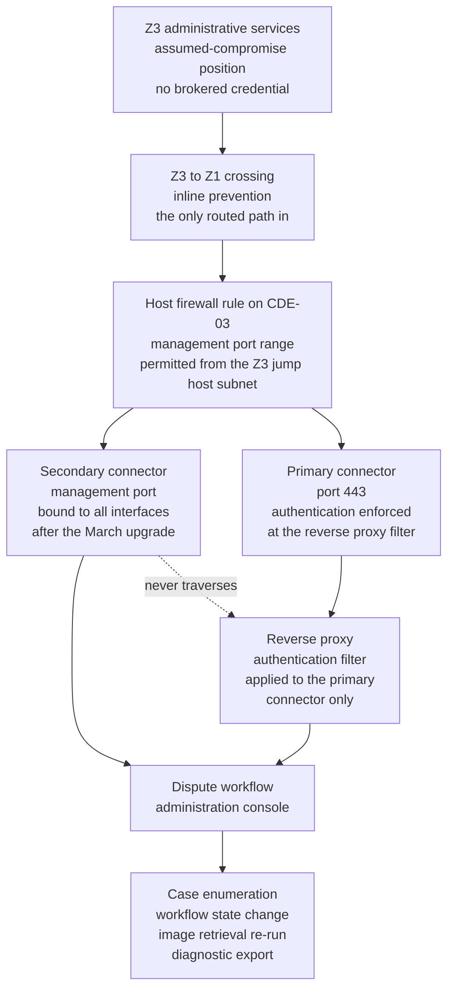

# 06.08 — Application Penetration Test

| Field | Value |
|---|---|
| Document ID | MRG-PCI-2026-608 |
| Program | Marketa Retail Group — PCI DSS v4.0.1 Compliance Program |
| Phase | 06 — Monitoring, Testing &amp; Third Parties |
| Version | 1.0 |
| Status | Approved |
| Owner | Naomi Bhatt, Chief Information Security Officer |
| Approver | Raymond Voss, Chief Financial Officer |
| Date | 2026-07-15 |
| Classification | Confidential — Cardholder Data Environment // Illustrative Portfolio Sample |

## Purpose

Requirement **11.4** — the penetration testing methodology, internal testing, external testing, and the correction and re-testing of what the testing finds.

| Sub-requirement | Obligation |
|---|---|
| **11.4.1** | A **defined penetration testing methodology** covering industry-accepted approaches; coverage of the CDE perimeter and critical systems; testing from inside and outside the network; testing to validate any segmentation and scope-reduction controls; **application-layer testing covering at minimum the vulnerabilities in 6.2.4**; network-layer testing; review of threats and vulnerabilities experienced in the last 12 months; a documented approach to assessing and addressing the risk of what is found; and **retention of results and remediation activities for at least 12 months** |
| **11.4.2** | **Internal** penetration testing performed per the 11.4.1 methodology, at least once every 12 months and after any significant infrastructure or application upgrade or change, by a qualified internal resource or qualified external third party with organisational independence |
| **11.4.3** | **External** penetration testing performed per the 11.4.1 methodology, at least once every 12 months and after any significant infrastructure or application upgrade or change, by a qualified resource with organisational independence |
| **11.4.4** | **Exploitable vulnerabilities and security weaknesses** found during penetration testing are corrected in accordance with the entity's assessment of the risk they pose, **and penetration testing is repeated to verify the corrections** |
| 11.4.5 | Penetration testing on segmentation controls and methods — **delivered in 03.07 and 03.08**, not re-delivered here |
| 11.4.6 | **Service-provider only.** Never within Marketa's 306 applicable sub-requirements — 03.07 §2 |

**This document delivers the September 2026 application penetration test by Ironwood Security Labs: eleven findings — 1 Critical, 3 High, 4 Medium, 3 Low.** The Critical is an **unauthenticated administrative interface on the chargeback application, CDE-03**. It is worked end to end in §5: how it was reachable, what it exposed, why it existed, how it was contained, how it was remediated, and how the fix was proved.

§8 then reconciles the two engagements into the programme's consolidated **19-finding** position — 2 Critical, 5 High, 7 Medium, 5 Low — all remediated and re-tested.

## 1. The Two Engagements, and Why They Are Two

Requirement 11.4 does not oblige an entity to run two penetration tests. It obliges a methodology that covers segmentation validation, application-layer testing and network-layer testing, from inside and from outside. An entity may discharge all of that in one engagement.

Marketa ran two, and the reason is scheduling rather than doctrine.

| Engagement | Date | Requirement focus | Document |
|---|---|---|---|
| **Segmentation test** | 2026-05-11 → 2026-05-22 | **11.4.5**, and the internal-network and network-layer limbs of 11.4.1 | **03.07** — it **failed**; **03.08** records the June re-test |
| **Application test** | 2026-09-07 → 2026-09-25 | **11.4.2 and 11.4.3**, and the application-layer and external limbs of 11.4.1 | **This document** |

The segmentation test had to run in May because its result determines the scope of everything that follows: if segmentation is not effective, the population the application test should cover is larger. It was not effective, the store estate classification collapsed pending remediation, and the application test's scope was not fixed until the June re-test passed.

**Running the application test first would have tested the wrong population.** That sequencing is deliberate and is recorded because the opposite sequence — application test in spring, segmentation test in autumn — is the more common arrangement and produces a scope statement written before it can be known to be true.

## 2. The 11.4.1 Methodology

The methodology is Marketa's, not the tester's. That distinction matters: 11.4.1 obliges **the entity** to define a methodology, and an entity that adopts its supplier's standard testing offering has purchased a service rather than defined a method. Ironwood executes against Marketa's methodology and reports against it, and its own approach is one input to element **PTM-1** rather than the whole of it.

| Element | Obligation under 11.4.1 | Marketa's discharge |
|---|---|---|
| **PTM-1** | Industry-accepted penetration testing approaches | Penetration Testing Execution Standard for engagement structure; **OWASP Testing Guide and Application Security Verification Standard Level 2** for the application limb; **NIST SP 800-115** for the network limb; the PCI SSC's own penetration testing guidance for scope framing. Named in the statement of work, not implied |
| **PTM-2** | Coverage of the **entire CDE perimeter** and **critical systems** | All 8 CDE components; both CDE perimeters — the Z3-to-Z1 crossing and the Z2 VPC boundary; the 9 applications; the 6 payment page templates; the external footprint of 57 addresses and 32 hostnames; and the connected-to components on which CDE access depends. **63 of the 71 assessed components were in scope of at least one test limb** |
| **PTM-3** | Testing **from inside** the network | Four assumed-compromise start positions: an ordinary Z4 corporate laptop, a Z3 administrative-services host without brokered credentials, a Z8 cloud workload identity, and a Z5 store back-office position |
| **PTM-4** | Testing **from outside** the network | Unauthenticated from the public internet against the external footprint, and authenticated as an ordinary customer and as a registered account holder against the storefront and the six payment templates |
| **PTM-5** | Testing to validate **segmentation and scope-reduction controls** | Discharged by the 11.4.5 engagement in 03.07 and 03.08, with a **confirmatory limb repeated in September** — §4.1 — so that six months of change since the June re-test does not sit unexamined |
| **PTM-6** | **Application-layer testing covering at minimum the vulnerabilities in 6.2.4** | The five 6.2.4 classes and the 6.3.1 high-risk limb, each an explicit test objective with a required evidence output. **§3.2** maps every class to what was executed and what was found |
| **PTM-7** | **Network-layer testing** of components supporting network functions and of operating systems | Service enumeration and exploitation attempts against all in-scope hosts; boundary device management planes; operating-system and platform configuration; authentication services |
| **PTM-8** | Review and consideration of **threats and vulnerabilities experienced in the last 12 months** | A mandatory pre-engagement briefing pack — §2.1 |
| **PTM-9** | A documented approach to **assessing and addressing the risk** posed by what is found | Findings ranked by Ironwood, re-ranked by Marketa under the **6.3.1** model in 04.06, and treated under the SLA bands. **The re-ranking may raise a severity and may not lower one without the tester's written agreement** |
| **PTM-10** | **Retention of results and remediation activities for at least 12 months** | Reports, raw evidence, remediation records and re-test reports retained for **three years** in the evidence repository under the 12.5.2 evidence standard; the 12-month floor is a floor |

### 2.1 PTM-8 — what the tester was told before starting

The limb entities most often skip is PTM-8, because it obliges the entity to hand the tester its own bad news. A tester who is not told what has already gone wrong will re-derive it at the client's expense, or miss it.

Ironwood received, before fieldwork: the **segmentation test result** — SEG-PT-01, the seven other findings, the remediation and the June re-test, with the store estate declared a *tested-and-remediated* population rather than a clean one; the **ASV year**, including the Q1 failure and its scope-management root cause; the internal scanning output, stating explicitly that **the 9 CON-03 appliances' vulnerability state cannot be observed**; the **6.4.3 finding** and its tag-manager root cause; the year's incidents and control conditions, including the four techniques the quarterly controlled execution found undetected; **Phase 05's two scoped objectives** — assertion replay and one-time-passcode reuse against the 8.4.2 implementation, and negative testing of the 8.5.1 no-bypass claim; and the two known weak points Marketa volunteered — **the 8.6.2 hard-coded credentials** and the residual single-factor population behind the 8.3.9 customized approach.

Volunteering the 8.6.2 credentials is the item worth defending. An entity that conceals a known weakness from its tester buys a report that omits it, and then has to explain to an assessor why a documented gap does not appear in a penetration test that covered the component. **The tester was given the credentials' location and asked what could be done with them.** The answer — lateral movement to a second connected-to host, no CDE path — is in §4 and is worth more than their absence from the report would have been.

## 3. The Engagement

| Field | Value |
|---|---|
| Requirements discharged | **11.4.1, 11.4.2, 11.4.3, 11.4.4**, and the confirmatory limb of **11.4.5** |
| Tester | **Ironwood Security Labs** |
| Engagement reference | **IWSL-MRG-2026-APP-01** |
| Qualification | Team of five; lead tester holding current offensive-security certification with application specialism; two testers holding cloud platform specialisms; **no member of the team has performed advisory or implementation work for Marketa** |
| **Organisational independence** | External to Marketa; independent of E-Commerce Engineering, Infrastructure and Payment Operations; **independent of the QSA** — Sable Ridge neither selects nor reviews Ironwood's work, and Ironwood's report is delivered to Naomi Bhatt and provided to the QSA unaltered |
| Fieldwork | **2026-09-07 → 2026-09-25** |
| **Critical finding demonstrated** | **2026-09-16, 14:20 ET** |
| Report issued | **2026-10-02** |
| Findings | **11 — 1 Critical, 3 High, 4 Medium, 3 Low** |
| Re-test | **2026-10-08**; one finding partially remediated and re-tested again **2026-10-15** |
| Overall result | **Findings identified and remediated; no unremediated exploitable finding at the close of re-testing** |

### 3.1 Rules of engagement

| Rule | Content |
|---|---|
| Production testing | Permitted against production for read-only and reachability testing; **state-changing exploitation only in the production-equivalent environment**, except where a state change was required to prove a finding and was authorised case by case. **Three such authorisations were granted**, each by Elena Marchetti in writing |
| Account data | **The tester was not authorised to retrieve, retain or transmit any primary account number.** Where a path to account data was demonstrated, the proof required was reachability and capability, not extraction |
| **Stop-and-notify** | Any finding assessed by the tester as Critical, or any evidence of a pre-existing compromise, **stops the relevant test thread and is notified within one hour**. Invoked once — §5.3 |
| Denial of service | Prohibited. Availability-affecting techniques out of scope, consistent with 06.05's scan-policy exclusion |
| Social engineering and physical intrusion | **Out of scope**, and recorded as such in 06.11 §5 rather than left as an unstated gap |
| Cloud provider infrastructure | Bounded by the provider's customer testing policy. Recorded as a limitation, not worked around |
| Evidence handling | All tester evidence encrypted in transit and at rest, retained by Ironwood for 90 days and then destroyed under certificate; Marketa's copy retained for three years |

### 3.2 The 6.2.4 coverage map — PTM-6

11.4.1's application-layer limb requires coverage of, **at minimum**, the vulnerabilities listed in 6.2.4. Marketa's methodology turns that into six named objectives with a required output, so that "we did application testing" cannot stand in for evidence of the classes.

| 6.2.4 class | What Ironwood executed | Findings produced |
|---|---|---|
| **Injection** — SQL, LDAP, XPath, command, parameter, object and fault injection | Parameter fuzzing and payload testing across 1,204 request parameters on the 9 applications; template and expression injection; deserialisation probing on every endpoint accepting a serialised payload | **APP-PT-04** — stored cross-site scripting in the dispute-notes field of CDE-01. No SQL, command or object injection found; the ORM and the deserialisation allow-list held |
| **Attacks on data and data structures** | Boundary, size and depth abuse; the one native dependency in the estate — the storefront image-processing library — fuzzed on its supported formats | None. The edge size and depth limits and the sandboxed native process held |
| **Attacks on cryptography usage** | TLS configuration across all in-scope endpoints; token and session-identifier entropy; certificate validation behaviour of every outbound client; key handling in application configuration | **APP-PT-11** — a deprecated cipher suite offered by an internal administrative endpoint of CDE-01. **No hard-coded key material found in application configuration** |
| **Attacks on business logic** | Refund, adjustment and dispute lifecycles abused through the API and out of order; price, total and eligibility manipulation; idempotency and replay; gift-card balance enumeration | **APP-PT-06** and **APP-PT-07** |
| **Attacks on access control** | The full authorisation matrix — every endpoint against every role and an unauthenticated principal; object-level authorisation; session management; **administrative surface enumeration** | **APP-PT-01**, **APP-PT-02**, **APP-PT-05** |
| **High-risk vulnerabilities from 6.3.1** | The 12 months of scanner and advisory intake reviewed for classes to target; the KEV-listed items relevant to the platform set attempted directly | None exploitable. Every KEV-relevant item was already patched, which is the 04.06 SLA evidencing itself under adversarial test |

Two rows are worth reading together. **The access-control row produced the Critical, and the injection row produced one High.** The industry's mental model of application testing is dominated by injection, and Marketa's result is the more common modern shape: the injection defences were built into the pipeline and held, and the failure was an administrative surface that authentication was never applied to.

## 4. What Held

A penetration test report that lists only findings tells the reader what failed and nothing about what was tried. The controls below were attacked directly and did not yield, and each is a claim made elsewhere in the portfolio that now has adversarial evidence behind it.

| Claim, and where it is made | What Ironwood attempted | Result |
|---|---|---|
| **8.4.2 — MFA on all 20 access paths**, 05.05 | SAML assertion replay against the federation for the CDE-06 desktop pool and the Z2 console path; one-time-passcode reuse inside and outside the validity window; token capture and re-presentation from a compromised Z4 laptop | **No path.** Assertions single-use and audience-bound; passcodes rejected on reuse. **Phase 05's two scoped objectives both failed to produce a bypass** |
| **8.5.1 — no MFA bypass**, 05.05 | Direct authentication to each path's underlying service, bypassing the front door; the 11 break-glass accounts probed | **No bypass.** The break-glass exception behaved as documented, and its use raised a case in the daily review within 4 minutes |
| **7.x — deny by default**, 05.01 | The authorisation matrix executed in full — every endpoint, every role, an unauthenticated principal | **Two exceptions**, and they are APP-PT-01 and APP-PT-02. Every other combination denied |
| **8.6.2 — the two hard-coded credentials**, 05.07 | Credentials used from their source host and from three other positions; lateral movement attempted | Authentication succeeded **only from the permitted source host**. From there, read access to one further connected-to datastore and **no path to Z1 or Z2**. The interim measures did what 05.07 says they do and no more |
| **No CDE component reachable from the internet**, 03.02 | Unauthenticated enumeration and exploitation from the public internet | Confirmed. No Z1 or Z2 component presented an interface |
| **The Truvance iframe boundary holds**, 02.05 | Full parent-document compromise, then attempts to read the card fields | Confirmed. **The tester could do everything §1 of 04.10 describes instead**, which is the point that requirement makes |
| **No human write access to the payment-page origin**, 04.10 | Interactive paths to the origin enumerated | Confirmed. Publication is by the pipeline identity |
| **The Z3-to-Z1 crossing is the only routed path into the Columbus CDE**, 03.02 | Routing and reachability from every internal position | Confirmed, **and it is where the Critical was reached from. A single correct path is still a path** |
| **CDE-03 dispute images cannot be saved locally**, 02.09 | The desktop-pool save, print, clipboard and drive-redirection controls attacked directly | Desktop-pool control **held**. **The Critical provided a different route to the same outcome** — §5.2, and it is stated as a contradiction rather than a nuance |

### 4.1 The confirmatory segmentation limb — PTM-5

The June re-test in 03.08 established that the store estate boundary held. Six months of change sat between that result and the QSA's November fieldwork, so the September engagement repeated a bounded segmentation limb: **11 stores selected by Ironwood from strata Marketa proposed under ADR-0009**, including a stratum of stores with a local network change since June, plus the Z4, Z8 and Z9 boundary classes.

**No path to Z5 from Z7 at any of the 11 stores. No path to Z1 or Z2 from any position tested.** The daily port-state and trunk-configuration assertion introduced after SEG-PT-01 had flagged and corrected two configuration divergences at other stores during the intervening period, both inside 24 hours, and the re-confirmation is what allows 06.11 to describe segmentation as tested twice in the year rather than once.

## 5. The Critical — APP-PT-01

> **An administrative interface on the chargeback and dispute management application, CDE-03, accepted requests without authentication from any host permitted to reach the application's management port.**

That sentence is the finding. Everything below is why it was true, what it could have done, and what was done about it.

### 5.1 How it was reachable

The dotted edge is the whole finding. **Authentication was a property of the path, not of the application.** The reverse proxy in front of CDE-03 enforced authentication, session validation and role checks on everything arriving at the primary connector. The application's own administration console trusted that this had happened.

A platform minor-version upgrade on **2026-03-24** changed the default binding of the secondary management connector from loopback to all interfaces. The connector had existed, bound to loopback, since the application was built. After the upgrade it listened on the component's Z1 address. A host firewall rule permitting the platform's management port range from the Z3 jump host subnet — written for the platform's own administrative tooling, correctly, and reviewed — now admitted requests to a connector that had never been intended to receive them.

Three conditions had to hold simultaneously, and each was individually defensible:

| Condition | Why it was reasonable on its own |
|---|---|
| Authentication enforced at the proxy rather than in the application | A standard and widely recommended pattern. It centralises session handling and keeps authentication logic out of nine applications |
| A management connector bound to all interfaces | The platform vendor's new default, documented in the release notes, and appropriate for a clustered deployment. **Nobody read the release notes for a minor version** |
| A firewall rule permitting the management port range from the administrative zone | Required for the platform's administrative tooling to function at all. Written by the same team that operates the platform, approved, and reviewed at the quarterly rule review |

**No single decision here was wrong.** That is the characteristic shape of a serious finding in a mature estate, and it is why the remediation in §5.5 is a structural change rather than a corrected setting.

### 5.2 What it exposed

The console is the dispute-workflow administration surface. Unauthenticated, an actor reaching it could:

| Capability | Consequence |
|---|---|
| **Enumerate dispute cases** — case identifier, merchant reference, amount, issuer, status | Metadata, not account data. Sufficient to select a target case |
| **Change workflow state** on any case | Financial-process integrity. A representment could be abandoned or a case closed |
| **Re-run image retrieval** against the Truvance portal for any case | **This is the serious one.** Issuer dispute images bear full PAN because the issuer generated them, and flow **F-05** is exactly this retrieval. The console could cause CDE-03 to fetch them |
| **Invoke a diagnostic export** writing the retrieved artefact to a path on the component | **The route around a control the portfolio claims.** 02.09 records that dispute images are rendered in session and cannot be saved locally. That control is enforced in the CDE-06 secure desktop pool. **The console did not use the desktop pool** |
| Read the application's own configuration | Service-account identifiers and integration endpoints. **No key material and no credentials** — those are retrieved from CT-14 at run time, as 04.03 claims, and that claim held |

The combination of the third and fourth rows is what makes this Critical rather than High. An unauthenticated interface that discloses metadata is serious. An unauthenticated interface that can cause a CDE component to retrieve full primary account numbers from a third-party portal and write them to disk is a path to account data, and it is graded on that basis regardless of whether anyone used it.

**Marketa's re-ranking under PTM-9 agreed with Ironwood's Critical and did not lower it.** The temptation was available — the interface was not internet-reachable, the position required was an assumed compromise of Z3, and no evidence of use existed. All three are true and none of them is a reason to reduce a severity. The severity describes what the flaw permits.

### 5.3 Containment

| Time | Event |
|---|---|
| **2026-09-16, 14:20** | Ironwood reaches the console unauthenticated from the Z3 assumed-compromise position and enumerates cases. **Stop-and-notify invoked immediately**; no image retrieval executed, no export invoked, no case state altered |
| 14:41 | Notification received by Naomi Bhatt and Marcus Hale. Test thread suspended. **A 12.10 incident record is opened, not a defect ticket** |
| 15:05 | Elena Marchetti and Trevor Kim joined. Ironwood demonstrated the capability set in a screen-shared session against the production-equivalent environment rather than production |
| 15:52 | Interim containment: the host firewall rule narrowed to the two specific management source addresses the platform tooling requires; the console's route disabled at the application |
| **17:00** | Full containment: the secondary connector **re-bound to loopback**; the component restarted in the change window; reachability re-tested by Ironwood and confirmed closed. **Two hours forty minutes from demonstration to containment** |
| 2026-09-17 | Forensic review commissioned across the exposure window |
| 2026-09-18 | Estate-wide listener enumeration commissioned across all 8 CDE components and the 20 connected-to components running Marketa applications |
| 2026-09-21 | Ironwood resumed the suspended thread against the remediated configuration |

### 5.4 The forensic question, answered with evidence rather than with comfort

The exposure window ran from the platform upgrade on **2026-03-24** to containment on **2026-09-16** — **176 days**. The question is whether anything reached the console in that window other than the tester.

Marketa could answer it, and the reason it could is a control built for a different purpose. **The Z3-to-Z1 crossing carries inline prevention with full flow recording** — 06.07 §5.1 — and those records are retained under 10.5.1 with a 15-month retention and a 6-month hot tier. Every TCP session to CDE-03's management port across the whole window is enumerable.

| Question | Answer |
|---|---|
| Sessions to the management port on CDE-03, 2026-03-24 to 2026-09-16 | **47** |
| From Ironwood's tester, 2026-09-16 and 2026-09-21 | **41** |
| From the platform's own clustered peer over the loopback-equivalent path | **6**, all matching the health-check profile and interval |
| **From any other source** | **0** |
| Application-layer request logging on the secondary connector | **Not enabled.** Recorded as a limitation of the evidence, not glossed |
| Dispute image retrievals on flow F-05 in the window, reconciled against the case management record | **All reconciled.** Every retrieval corresponded to a case being worked by an identified analyst in an authorised session |
| Diagnostic exports written to the component's file system in the window | **0**, confirmed by CT-21 file integrity monitoring, whose baseline covers the export path |
| Determination | **No account data compromise occurred.** No obligation **C5** notification arose |

Two disciplines govern how that is stated. The first is the one 03.07 §10.1 applied: **the absence of evidence is recorded as the absence of evidence.** Here Marketa is in the stronger position of having positive evidence — a complete enumeration of sessions from an independent control, not merely a search that found nothing. The second is that **the determination does not soften the finding.** A control failure occurred whether or not it was exploited, and the finding's severity is unchanged by the forensic outcome.

### 5.5 Remediation — and why it is not "we closed the port"

Closing the port fixes this instance. Four changes were made because the instance is not the problem.

| Change | What it addresses | Status |
|---|---|---|
| **Authentication moved into the application**, enforced deny-by-default at the central policy enforcement point for every request on every connector | **The root cause.** Authentication is now a property of the application, not of the route the request took. A future connector, a future proxy bypass, a future default change — none of them yields an unauthenticated surface | Deployed 2026-09-24 on CDE-03; rolled across all 9 applications by 2026-10-30 |
| **The automated authorisation test suite** — every endpoint against every role **including an unauthenticated principal**, failing the build on any unexpected success | The regression. 04.07 §5 records that this suite exists **because of this finding**, and the honest sequence — finding first, control second — is stated there and repeated here | In the pipeline from 2026-10-05 |
| **Listener inventory asserted daily** on all 8 CDE components and the 20 connected-to components running Marketa applications, compared to a declared intent | The discovery gap. **Three further undeclared listeners were found in the estate-wide enumeration** — two metrics endpoints and one clustered-cache port, all benign, two bound to all interfaces and re-bound | Assertion live 2026-10-12; a new detection rule on listener-state change added to the 187 |
| **SIG-4 amended**: a platform minor-version upgrade on a CDE component now triggers a listener-and-authentication-path review before the change closes | The classification gap. A minor version upgrade was correctly classified as a minor version upgrade, and the classification did not ask the right question | 04.08's definition amended 2026-10-19; the same definition governs 11.3.1.3 and 12.5.2 |

### 5.6 The detection failure underneath it

06.03 §4.2 records the programme's rule that **a penetration test finding is a detection failure as well as a control failure.** Applied here, the answer is uncomfortable and instructive.

| Control that should have seen it | What it actually did |
|---|---|
| **11.3.1.3 change-driven scanning** — the March upgrade triggered a scan | The scan ran, authenticated, and **reported the new listener as an informational finding**: an unrecognised HTTP service on a non-standard port. The scanner authenticated to the host; it could not determine that the service behind the port had no authentication of its own. Ranked Low. Nobody read it as a control question |
| **11.5.2 file integrity monitoring** | The upgrade was a correlated, approved change. The configuration file whose default changed **was in the baseline and was updated by the change**, so the modification correlated and closed automatically. Correct behaviour, useless outcome |
| **10.4.1 daily review** | The listener generated no events, because nothing connected to it |
| **The quarterly network security control rule review** | Reviewed the firewall rule and found it correct. **It was correct.** The rule review's question is whether a rule is justified, not what has newly appeared behind it |

Four controls behaved exactly as designed and none of them asked the question that mattered. The change that closes it is the third row of §5.5 — an assertion that compares **what is listening** against **what is declared** — and the scan-policy change that follows it: **an unrecognised service on a CDE component is now ranked High by rule pending determination**, not informational. The 6.3.1 ranking model gained a third hard override rule as a result.

## 6. The Eleven Findings

Severity is Ironwood's, confirmed or raised by Marketa under **PTM-9**. **Retest** records the date each finding was independently re-tested by Ironwood and the outcome.

| ID | Severity | Finding | Component | Remediation | Retest |
|---|---|---|---|---|---|
| **APP-PT-01** | **Critical** | Unauthenticated administrative interface — the dispute-workflow administration console reachable without authentication on a secondary management connector, permitting case enumeration, workflow state change, re-run of full-PAN dispute image retrieval on flow F-05, and diagnostic export to disk | **CDE-03** Chargeback and Dispute Management | Connector re-bound to loopback and firewall rule narrowed within 2h40m; **authentication moved into the application at the central policy enforcement point** across all 9 applications; automated authorisation test suite added to the build; daily listener assertion; SIG-4 amended | **2026-10-08 — closed.** Re-tested from all four assumed-compromise positions; no unauthenticated surface on any connector |
| **APP-PT-02** | **High** | Object-level authorisation gap — substituting a refund case identifier in an API request returned another operator's refund record including tokenised instrument and truncated PAN, where the route-level role check passed but the object-level check was absent | **CDE-07** Refunds and Adjustments Service | Object-level authorisation added at the data-access layer rather than the controller; the whole endpoint set audited for the same pattern, finding 2 further instances; authorisation test suite extended to object-level cases | **2026-10-08 — closed.** All three instances re-tested |
| **APP-PT-03** | **High** | Server-side request forgery in the dispute document retrieval component — a supplied document-source parameter was fetched without destination validation, allowing CDE-03 to issue arbitrary outbound HTTP requests to internal Z1 and Z3 addresses on the tester's behalf | **CDE-03** Chargeback and Dispute Management | Destination allow-list enforced at the HTTP client rather than at the parameter; the shared client wrapper hardened for all 9 applications; egress from CDE-03 constrained to named destinations at the boundary | **2026-10-08 — closed.** Internal address ranges, cloud metadata endpoints and redirect chains all re-tested and blocked |
| **APP-PT-04** | **High** | Stored cross-site scripting — script supplied in a dispute-notes field was stored unencoded and executed in the authenticated session of any analyst subsequently opening the case, within the CDE application context | **CDE-01** Payment Operations Application | Context-aware output encoding applied at the template layer; a Content Security Policy with nonces applied to the internal application, which previously had none; SAST rule added failing the build on unencoded output in a template | **2026-10-08 — closed.** Payload set re-executed across all free-text fields in the 9 applications |
| **APP-PT-05** | **Medium** | Verbose error responses on the integration gateway's API disclosed internal hostnames, framework versions and partial stack frames under malformed input — an internal topology disclosure and a reconnaissance accelerant | **CDE-05** Payment Integration Gateway | Error handling standardised to an opaque correlation identifier; response inspection added at the boundary; the same pattern corrected on two further services | **2026-10-08 — closed** |
| **APP-PT-06** | **Medium** | Gift-card balance lookup rate limiting was enforced at the edge by hostname; requests to an alternate hostname resolving to the same origin bypassed the limit, permitting closed-loop stored-value balance enumeration | Storefront / **TPL-06** balance lookup path — SCR-27 | Rate limiting moved from the edge hostname to the origin service and keyed on the requesting principal and the card range; alternate hostnames consolidated; velocity alerting added | **2026-10-08 — partially remediated.** The origin limit was in place; one alternate hostname remained unconsolidated. **Re-tested 2026-10-15 — closed** |
| **APP-PT-07** | **Medium** | Refund velocity threshold and second-authorisation requirement were enforced in the operator-facing service but **not** on the batch adjustment endpoint, permitting a value above the threshold to be posted without the second authorisation | **CDE-07** Refunds and Adjustments Service | Threshold and second-authorisation enforcement moved into the domain service so that every entry point inherits it; the batch path re-tested against the abuse-case suite; daily anomaly reporting extended to batch-originated adjustments | **2026-10-08 — closed** |
| **APP-PT-08** | **Medium** | `frame-ancestors` and `X-Content-Type-Options` absent from the responses serving two payment templates following an edge configuration change on 2026-09-11, leaving the account-management payment templates framable by a third-party origin | **TPL-04** and **TPL-05** payment page templates | Headers restored at the edge and at the origin; **header assertion added to the release gate and to the 11.6.1 baseline** so that a header regression fails a release rather than being detected after it | **2026-10-08 — closed.** All six templates re-tested against the full header set |
| **APP-PT-09** | **Low** | Account enumeration — the storefront password-reset response distinguished a registered from an unregistered email address by response content and timing | Storefront authentication service | Response and timing normalised; rate limiting and alerting applied to the reset endpoint | **2026-10-08 — closed** |
| **APP-PT-10** | **Low** | A non-session preference cookie set on the guest checkout template carried no `SameSite` attribute and no `Secure` flag, permitting cross-site inclusion of a value that influences rendered content | **TPL-03** guest checkout template | Cookie attributes corrected; a pipeline check added asserting attributes on every cookie set by any payment template | **2026-10-08 — closed** |
| **APP-PT-11** | **Low** | A deprecated cipher suite was offered by the internal administrative endpoint of the payment operations application, reachable only from the CT-11 brokered path | **CDE-01** Payment Operations Application | Cipher configuration aligned to the Phase 04 baseline; the baseline check extended to internal administrative endpoints, which had been outside its object set | **2026-10-08 — closed** |

**Eleven findings: 1 Critical, 3 High, 4 Medium, 3 Low.**

### 6.1 The partial remediation is reported, not smoothed

**APP-PT-06 failed its first re-test.** The origin-side rate limit was correctly implemented; one alternate hostname had not been consolidated, and the bypass still worked through it. Ironwood recorded the finding as partially remediated, Marketa completed the consolidation, and the finding closed on 2026-10-15.

That is reported prominently for a reason. **A re-test in which every finding closes first time is a re-test worth being suspicious of** — either the findings were trivial or the re-test was shallow. One partial closure out of eleven, found by the tester rather than by Marketa's own verification, is the evidence that 11.4.4's "testing is repeated to verify the corrections" was performed as an independent test rather than as a confirmation exercise.

### 6.2 ADR-0020 — the finder re-tests, not the fixer

| Field | Position |
|---|---|
| **Decision** | **ADR-0020 — Remediation of a penetration test finding is verified by the party that found it, not by the party that fixed it.** Marketa may verify its own fix internally; that verification does not close the finding. A finding closes on the tester's written re-test result |
| Context | 11.4.4 obliges testing to be repeated to verify corrections. It does not say by whom, and the cheapest reading is that the entity re-tests its own fix and reports the result to the assessor |
| Rationale | The person who wrote the fix knows what they changed and tests that. The person who found the flaw knows what they exploited and tests **that**, which is a different thing. APP-PT-06 is the demonstration: Marketa's internal verification passed, and Ironwood's did not |
| Cost | A second engagement day per test cycle, and the scheduling dependency of waiting for a tester's availability to close a finding |
| Consequence | Re-test is contracted as part of the engagement rather than procured afterwards, so it cannot be dropped when a budget is reviewed. The re-test report is a separate artefact retained under **PTM-10** |
| Rejected alternative | Internal verification with tester spot-checks. It saves a day and produces a closure record whose independence has to be argued rather than shown |

## 7. Internal and External Testing — 11.4.2 and 11.4.3

The two sub-requirements are often collapsed into one activity. They are different obligations with different vantage points, and Marketa evidences them separately.

| | **11.4.2 — internal** | **11.4.3 — external** |
|---|---|---|
| Vantage | From **inside** the network — assumed-compromise positions in Z3, Z4, Z8 and Z5 | From **outside** the network — the public internet, unauthenticated and as an authenticated customer |
| What it tests | Whether an adversary already inside can reach the CDE and what it can do there | Whether the perimeter, the storefront and the payment pages yield anything from a position anybody can occupy |
| Cadence | At least every 12 months **and after any significant infrastructure or application upgrade or change** | Identical |
| Marketa's annual discharge | September 2026, four internal start positions; plus the May and June segmentation engagements | September 2026, external limb across 57 addresses and 32 hostnames and all 6 payment templates |
| Findings produced | APP-PT-01, 02, 03, 04, 05, 07, 11 — **7** | APP-PT-06, 08, 09, 10 — **4** |
| Qualified, independent | Ironwood Security Labs for both | Ironwood Security Labs for both |

### 7.1 After significant change

Both sub-requirements carry an "and after any significant infrastructure or application upgrade or change" limb, and it is the limb entities most often leave unevidenced — an annual test is a calendar entry, whereas a change-triggered test requires somebody to decide that a change qualified.

Marketa uses the **SIG-1 to SIG-10** definition from 04.08, the same definition that drives 11.3.1.3, 11.3.2.1, 11.4.5 and 12.5.2. One definition, five obligations.

| Significant change in the period | Classification | Testing performed |
|---|---|---|
| Z2 cloud architecture change consolidating the refunds service ingress | SIG-2, SIG-6 | Targeted internal and external penetration testing of the changed boundary and the affected application surface, 2026-04. **1 Medium**, resolved before cutover |
| Major version upgrade of the payment operations application | SIG-4 | Full application-layer test of the upgraded surface in pre-production, 2026-06. **0 findings.** Under the amended SIG-4, this class of change now also carries the listener-and-authentication-path review |
| New payment page template introduced for a seasonal storefront hostname | SIG-5 | External testing of the template and its script set before publication, 2026-10. **0 findings**; the template entered the 6.4.3 inventory and the 11.6.1 baseline before it served a customer |
| Store estate boundary remediation following SEG-PT-01 | SIG-1, SIG-3 | The June segmentation re-test in 03.08, and the September confirmatory limb in §4.1 |
| Platform minor-version upgrade on CDE-03, 2026-03-24 | **Classified as routine at the time** | **None — and this is the change that produced APP-PT-01.** The classification is what SIG-4's amendment corrects |

The last row is in the table because leaving it out would be dishonest. **The change-triggered testing obligation was met for four significant changes and was not engaged by the change that caused the programme's Critical finding**, because that change was not classified as significant. The definition, not the discipline, was the failure, and the definition has changed.

## 8. The Consolidated Programme Position — 19 Findings

| Engagement | Date | Critical | High | Medium | Low | Total | Result |
|---|---|---|---|---|---|---|---|
| **Segmentation test** — 03.07 | 2026-05 | **1** | 2 | 3 | 2 | **8** | **FAIL** — re-tested clean 2026-06 |
| **Application test** — this document | 2026-09 | **1** | 3 | 4 | 3 | **11** | Findings remediated; re-tested 2026-10 |
| **Programme total** | | **2** | **5** | **7** | **5** | **19** | **All remediated and re-tested** |

The two Criticals:

| Engagement | Finding reference | What it was | Where the root cause sat |
|---|---|---|---|
| Segmentation, May | SEG-PT-01 | Store back-office VLAN reachable from store guest wireless through a misconfigured trunk at store 0417, with 37 stores carrying the latent precondition | **Estate drift from a correct design.** The build standard was right; 482 deployments were not |
| Application, September | APP-PT-01 | Unauthenticated administrative interface on CDE-03 reachable from Z3 | **A vendor default change meeting an architectural assumption.** Three individually defensible decisions intersecting |

They have almost nothing in common, which is the useful observation. One was found by deliberately sampling the messy estate under ADR-0009; the other was found by systematically enumerating an application's surface from a position the architecture permits. **A testing programme that only did the second would have missed the first, and vice versa** — which is the argument for 11.4.1's insistence that a methodology cover segmentation, application layer and network layer rather than whichever the entity is best at.

### 8.1 Remediation and re-test across all 19

| Measure | Segmentation | Application | Total |
|---|---|---|---|
| Findings | 8 | 11 | **19** |
| Remediated | 8 | 11 | **19** |
| Re-tested by Ironwood | 8 | 11 | **19** |
| Closed at first re-test | 8 | 10 | **18** |
| Closed at second re-test | — | 1 — APP-PT-06 | **1** |
| **Open at 2026-12-31** | **0** | **0** | **0** |
| Median days from report to remediation, Critical and High | 6 | **5** | — |
| Median days from report to remediation, Medium and Low | 21 | 17 | — |
| **New detection rules produced** | 7 | **4** | **11** — the figure 06.03 §4.2 attributes to penetration testing |
| Requirements documents amended as a consequence | 03.03, 03.04, 03.06 | **04.07, 04.08, 04.10, 02.09** | — |

## 9. Coverage Position at 2026-07-15

| Requirement | Position | Evidence |
|---|---|---|
| **11.4.1** | **In Place** — a documented, entity-owned methodology with ten named elements **PTM-1 to PTM-10**, covering industry-accepted approaches, the whole CDE perimeter and critical systems, internal and external vantage, segmentation validation, the five 6.2.4 attack classes plus the 6.3.1 limb, network-layer testing, a mandatory 12-month threat and vulnerability briefing, a documented risk-assessment approach for findings, and 3-year retention against a 12-month floor | The methodology document; the statement of work naming the standards; the PTM-8 briefing pack; the retained reports and re-test reports |
| **11.4.2** | **In Place** — internal penetration testing from four assumed-compromise positions, September 2026, producing 7 of the 11 findings; plus change-triggered internal testing on four significant changes; performed by an external firm with documented organisational independence | IWSL-MRG-2026-APP-01; the change-triggered test records |
| **11.4.3** | **In Place** — external penetration testing across 57 addresses, 32 hostnames and all 6 payment templates, September 2026, producing 4 of the 11 findings; change-triggered external testing on the SIG-5 template introduction; annual cadence established | IWSL-MRG-2026-APP-01; the change-triggered test records |
| **11.4.4** | **In Place** — **19 of 19** findings across both engagements corrected and re-tested by the tester that found them under **ADR-0020**; 18 closed at first re-test, 1 at second; **0 open at year end**; four requirements documents amended as a consequence | Re-test reports 2026-10-08 and 2026-10-15; the 03.08 segmentation re-test; remediation records linked to change records |
| **11.4.5** | In Place — delivered in 03.07 and 03.08; **re-confirmed in September** across 11 stores selected by the tester from Marketa-proposed strata under ADR-0009 | 03.08; §4.1 |
| **11.4.6** | **Service-provider requirement.** Never within the 306; **not** one of the ROC's four Not Applicable entries | The scoping determination; 03.07 §2 |

## 10. Risks Treated

| Risk | Rating | How this document treats it | Residual |
|---|---|---|---|
| **R-35** — an application flaw in the storefront exposes order data, tokens or customer records | Low 6 | The engagement's whole application limb. Four storefront-side findings, all remediated and re-tested; the abuse-case suite and the authorisation test suite now run per build | **Low**, and now evidenced adversarially rather than by design |
| **R-12** — insider misuse where full PAN is legitimately visible | Moderate 12 | **APP-PT-01 is the inverse of R-12** — a route to the same data requiring no insider at all. Authentication moved into the application; every dispute retrieval reconciled to a named analyst in the forensic review | **Moderate.** The route is closed; the population of legitimate viewers is unchanged |
| **R-27** — administrative-services zone concentration yields multiple paths into the CDE | High 15 | The Critical was reached **from Z3**, which is the concentration R-27 prices. The finding is the strongest available evidence that the risk is correctly rated | **High.** This document raises confidence in the rating, not the rating itself |
| **R-32** — a boundary-affecting change classified as routine | Moderate 12 | The direct treatment: SIG-4 amended so a platform minor-version upgrade triggers a listener-and-authentication-path review; one definition still governs all five obligations | **Moderate.** The definition improved because a change escaped it |
| **R-14** — segmentation controls in the store estate are not effective | High 16 | The September confirmatory limb across 11 stores selected by the tester; no path found; two configuration divergences caught by the daily assertion during the intervening period | **High.** Two clean tests are not yet a trend; 06.12 §5 states why it is held |
| **R-42** — evidence not retained in a form the assessor can sample | Low 6 | PTM-10 retention at three years; the re-test reports as separate artefacts; the forensic enumeration retained with its query and its limitation stated | **Low** |
| **R-01** — unauthorised script on a payment page | High 20 | **APP-PT-08** is a payment-page finding and it is a header regression, not a script. The script control is **6.4.3 in 04.10 and 11.6.1 in 06.09**, and this test is a third independent look at the same surface | Treated in **06.09**, where it reduces |

## Cross-References

| Reference | Relevance |
|---|---|
| 02.09 — Assessed System Component Inventory | **CDE-03** and the local-save control claim that APP-PT-01 contradicted; the 8 CDE components |
| 03.02 — Nine-Zone Architecture | The Z3-to-Z1 crossing, the only routed path into the Columbus CDE and the position the Critical was reached from |
| **03.07 — Segmentation Penetration Test** | **The 8 findings, SEG-PT-01, and the §9.1 reconciliation this document completes** |
| 03.08 — Segmentation Re-Test | The June clean re-test whose result fixed this engagement's scope |
| 04.06 — Vulnerability Management | The 6.3.1 ranking model applied under PTM-9; the third hard override rule added by §5.6 |
| **04.07 — Secure Software Development** | The **6.2.4** attack classes tested under PTM-6; the authorisation test suite built **because of APP-PT-01** |
| 04.08 — Change Control | **SIG-1 to SIG-10**, and the SIG-4 amendment |
| 04.10 — Payment Page Script Management | **6.4.3**; the six templates tested in the external limb; APP-PT-08's header set |
| 05.05 — Authentication &amp; Multi-Factor Authentication | The assertion replay and passcode reuse objectives, and the 8.5.1 negative testing — all held |
| 05.07 — Application &amp; System Accounts | The 8.6.2 credentials volunteered to the tester, and what they yielded |
| 06.05 — Internal Vulnerability Scanning | 11.3.1.3 change-driven scanning, and why its informational finding on the new listener did not surface the Critical |
| 06.07 — Wireless &amp; Intrusion Detection | 11.1.1 and 11.1.2 — **TEST-P3** is this activity's procedure |
| **06.09 — Payment Page Tamper Detection** | **11.6.1**, which independently detected the header regression behind APP-PT-08 |
| 06.11 — Security Testing Programme | Where this engagement sits in the consolidated programme; the untested surface in §6 |
| ADR-0009 — Deliberately Sample the Messy Estate | The stratified sampling rule applied to the September confirmatory segmentation limb |
| **ADR-0020 — The Finder Re-Tests, Not the Fixer** | §6.2 |
| Phase 07 — Security Policy, Risk &amp; Incident Response | The 12.10 incident opened on 2026-09-16 rather than a defect ticket |
| Phase 08 — QSA Assessment &amp; ROC Production | 11.4.1 to 11.4.4 evidence; the 19-finding position in the ROC |

---
[⬅ Previous](06.07-wireless-and-intrusion-detection.md) · [🏠 Phase 06 Home](06.00-README.md) · [Next ➡](06.09-payment-page-tamper-detection.md)
