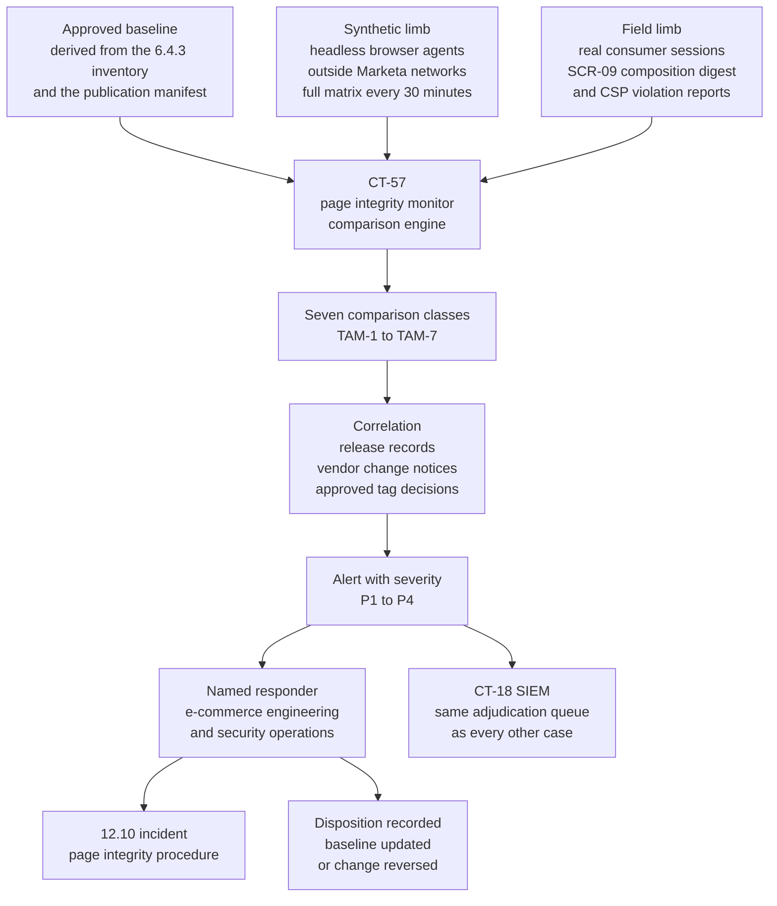

# 06.09 — Payment Page Tamper Detection

| Field | Value |
|---|---|
| Document ID | MRG-PCI-2026-609 |
| Program | Marketa Retail Group — PCI DSS v4.0.1 Compliance Program |
| Phase | 06 — Monitoring, Testing &amp; Third Parties |
| Version | 1.0 |
| Status | Approved |
| Owner | Sonia Rendell, Director of E-Commerce Engineering |
| Approver | Naomi Bhatt, Chief Information Security Officer |
| Date | 2026-07-15 |
| Classification | Confidential — Cardholder Data Environment // Illustrative Portfolio Sample |

## Purpose

Requirement **11.6.1** — a change- and tamper-detection mechanism deployed to alert personnel to unauthorised modification, **including indicators of compromise, changes, additions and deletions**, to the **HTTP headers and the contents of payment pages as received by the consumer browser**, with the mechanism **evaluating the received HTTP headers and payment page at least once every seven days, or at a frequency defined by the entity's targeted risk analysis performed according to 12.3.1**.

One of the 51 future-dated requirements, mandatory since **31 March 2025**, and — with 6.4.3 — one of the two requirements in the standard that reaches past the merchant's servers into a browser the merchant does not own.

**This is the document the portfolio has been building toward since Phase 02.**

> **6.4.3 authorises and binds integrity at deployment. 11.6.1 detects modification afterwards. Neither substitutes for the other, and risk R-01 could not reduce until both existed.**

04.10 delivered 6.4.3 across **6 payment page templates and 38 scripts, 11 of them third-party**, and recorded that **3 were unauthorised at first inventory** — SCR-36, a marketing tag container permanently refused, and SCR-37 and SCR-38, two pixels it injected, re-justified and conditionally re-authorised on **2026-05-19**. That document stated, four separate times, that the control was not complete until its detective half operated. **§10 of this document states that it now does.**

**11.6.1 went live on 2026-08-13.** Operating results in §8 cover the period from go-live to the close of the assessment year, on the same reporting convention Phase 06 uses throughout.

## 1. Reading the Requirement Precisely

11.6.1 is short and every clause in it does work. Entities lose the requirement by reading past three of them.

| Clause | What it obliges | The reading that fails |
|---|---|---|
| **"a change- and tamper-detection mechanism is deployed"** | A mechanism, deployed and operating — not a policy, not a contractual assurance from a provider | "Our payment provider monitors its own page." The provider's page is not the page 11.6.1 is about |
| **"to alert personnel"** | An alert reaching a human who can act. The mechanism's output must have a destination and a disposition | A dashboard. A weekly report. A log the mechanism writes to itself |
| **"to unauthorised modification"** | **Modification against an authorised state.** The requirement presupposes that an authorised state exists and is known — which is 6.4.3's output | Alerting on all change, which at any real scale means alerting on nothing |
| **"including indicators of compromise, changes, additions and deletions"** | Four categories. **Deletions count** — a removed security header is a modification | Monitoring only for added scripts |
| **"to the HTTP headers"** | The response headers, not just the body. Content Security Policy, `Strict-Transport-Security`, `frame-ancestors`, cookie attributes, cache directives | Body-only monitoring, which misses the single most efficient attack on a payment page: stripping the policy that constrains it |
| **"and the contents of payment pages"** | The page contents — the document, its scripts, and what they do | Monitoring the file on the origin server. That is **11.5.2**, and it is a different requirement |
| **"as received by the consumer browser"** | **The decisive clause.** The object of the control is the page a customer receives, after every edge, cache, injection point and third-party fetch has had its turn | Any origin-side check whatever |
| **"at least once every seven days, or at a frequency defined by the entity's targeted risk analysis"** | A weekly floor with an entity-defined alternative, and the alternative requires a **12.3.1** analysis | Adopting a longer frequency without the analysis; or adopting the weekly floor without asking whether it is fast enough |

### 1.1 The clause that decides the architecture

**"As received by the consumer browser."**

Every other design decision in this document follows from that clause. It means the measurement point cannot be Marketa's file system, cannot be Marketa's build pipeline, cannot be Marketa's origin server, and cannot be a check that runs inside Marketa's network where a compromised edge would serve it the same content it serves nobody else.

It means the mechanism has to fetch the page the way a customer fetches it — from outside, over the public internet, executing JavaScript, with cookies and consent state, from a device profile a real customer might have — and compare what came back against what was authorised.

**That is a fundamentally different instrument from file integrity monitoring**, and 06.07 §6.2 says so in the file-integrity document rather than only here, because the two are routinely conflated.

## 2. What 6.4.3 Cannot Do

04.10 is a strong implementation of 6.4.3. Thirty-eight scripts inventoried by three independent discovery methods required to reconcile; a named authorising individual per script with conditions verified by capture; Subresource Integrity for all 27 first-party scripts on a signed deterministic bundle; SRI pinning for two more; self-hosting through the tag proxy for three; a Content Security Policy in enforcing mode with nonces, set at the edge **and** the origin; publication-manifest reconciliation failing a release on a mismatch; and no human with write access to the payment-page origin.

It still cannot answer the question 11.6.1 asks.

| What 6.4.3 establishes | The gap it leaves |
|---|---|
| Every script on a payment template is authorised, justified and owned | **An authorised script can be changed by the party that hosts it.** Six of the 38 are vendor-hosted and intentionally mutable; SRI is unusable for them by construction |
| Every first-party script's content matches a hash generated at build | The hash proves what Marketa **published**. It says nothing about what a browser **assembled** |
| The CSP constrains where script may load from | **A CSP does not judge the content of an allowed origin.** If a permitted vendor is compromised, the policy faithfully permits the malicious version |
| The CSP is set at the edge as well as the origin | It can still be absent from a response for a reason nobody intended — **APP-PT-08**, where an edge configuration change dropped `frame-ancestors` from two templates |
| Publication reconciliation catches a script entering through the build path | It cannot see a script that never enters the build path, because it was injected at run time by a compromised third-party dependency |
| The tag manager is removed and its origin denied | It removes one mechanism. It does not remove the class |

> **The single sentence that justifies 11.6.1's existence as a separate requirement:**
>
> **A payment page can pass every 6.4.3 control on the day it is published and be serving skimming code to customers a week later, without any Marketa artefact changing, without any Marketa system being compromised, and without any Marketa control being misconfigured.**

The mechanism is post-authorisation modification at a third-party origin. Marketa authorises a script; the vendor serves it; the vendor's build system, content delivery network, dependency, or account is compromised; the vendor's next release carries something extra; Marketa's CSP permits the origin because Marketa authorised the origin; and the browser executes it. Every control did what it was designed to do.

**11.6.1 is the only requirement in PCI DSS that looks at that.**

## 3. TRA-11.6.1 — Frequency of Evaluation

11.6.1 sets a floor of **once every seven days** and permits a different frequency where the entity performs a **targeted risk analysis under 12.3.1**. This is that analysis. It is **#8 of the programme's fourteen**, and it is the analysis Phase 04 foreshadowed in 04.10 §10 and 01.11 §6.

| Field | Value |
|---|---|
| Analysis ID | **TRA-11.6.1** |
| Requirement | 11.6.1 — frequency of evaluation of received HTTP headers and payment page content |
| Performed under | **12.3.1** |
| Owner | **Sonia Rendell, Director of E-Commerce Engineering** |
| Contributors | Naomi Bhatt, Marcus Hale, Elena Marchetti, Owen Castellanos |
| Approver | Naomi Bhatt, Chief Information Security Officer |
| Date performed | **2026-06-15** |
| Date approved | **2026-06-24** |
| Next review due | **2027-06-24**, and on any **SIG-5** change under 04.08 |
| **Determination** | **Continuous evaluation, with an alert reaching a named responder within 24 hours of the modification occurring — in practice within minutes.** The synthetic limb evaluates the full template, device, geography and consent matrix **every 30 minutes**; the field limb evaluates continuously from real consumer sessions. **The seven-day floor is exceeded by a factor of approximately 336** |

### 3.1 Element 1 — Assets being protected

| Asset | Description |
|---|---|
| **The six payment page templates** | TPL-01 to TPL-06, including **TPL-04** card-on-file registration and **TPL-05** amended-order balance payment — the low-traffic account-management templates that 04.10 §2 identifies as where an unauthorised script survives longest |
| **The consumer's browser session** | The actual asset. Not a Marketa system, not a Marketa network, and not a system any Marketa control operates on |
| **15.7 million e-commerce transactions a year** | 23% of 68.4M card transactions; approximately **$924M** of revenue, 22% of $4.2B |
| **The card data that never touches Marketa** | The PAN is typed into a Truvance-origin iframe. The iframe protects the field. **A skimmer on the parent document does not need the field** — it draws its own |
| **The scope reduction the architecture holds up** | 246 AWS e-commerce workloads sit outside the CDE because PAN never reaches them. That reduction is real and it is irrelevant to this threat |
| **The brand** | A skimming incident on a national retailer's checkout is a customer-facing event whose cost is reissuance, forensic investigation and brand-programme consequences assessed against the acquirer, not a disclosure event |

### 3.2 Element 2 — Threats the requirement protects against

| Threat | Realisation in Marketa's environment |
|---|---|
| **Post-authorisation modification at a third-party origin** | **The dominant threat.** Six of the 38 scripts are vendor-hosted and intentionally mutable. A compromise of any of those six vendors' delivery paths puts code on Marketa's payment pages with no Marketa system involved |
| **Compromise of a self-hosted third-party artefact at update** | Three scripts are self-hosted through the tag proxy. Marketa owns the update cadence, which means Marketa also owns the risk of shipping a poisoned vendor release |
| **Header stripping or weakening** | Removing or loosening the CSP, `frame-ancestors` or `Strict-Transport-Security` at any point between origin and browser converts a constrained page into an unconstrained one. **This is a deletion, and 11.6.1 names deletions explicitly** |
| **Injection through a compromised edge or cache** | The delivery tier — CT-53 to CT-55 — sits between Marketa's origin and the customer. TRA-10.4.2.1 §6.2 names this path and relies on **this** control as its independent detective layer |
| **Re-emergence of the 6.4.3 finding's mechanism** | The tag container is removed and its origin denied. **A different container, a different console, a different permission granted at site granularity** is the same failure with a new name |
| **A dependency of an authorised script** | An authorised vendor script loading its own dependency from an origin Marketa never reviewed. The CSP constrains it; the CSP is also the thing an attacker would remove first |
| **A new payment template nobody declared** | Condition **ECOM-C3**. Every mechanism in 6.4.3 and 11.6.1 operates on known templates. A seventh template introduced by a team that did not know TPL-04 counted is invisible to all of them |
| **Targeted delivery** | Malicious content served only to real consumer devices, geographies or sessions and never to a monitoring agent. A monitoring design that only uses synthetic agents is defeated by a targeting rule — **which is exactly how SCR-37 and SCR-38 evaded the earliest synthetic runs in 04.10 §7.1** |

### 3.3 Element 3 — Factors contributing to likelihood and impact

| Factor | Direction | Weight | Basis |
|---|---|---|---|
| **The threat is the highest-rated entry in the register** | Increases both | **High** | **R-01 at High 20** — likelihood 4, impact 5, the only entry at that pairing across the 44 |
| **Likelihood 4 is measured, not estimated** | **Increases likelihood** | **High** | 04.10 §7: three unauthorised scripts were executing on all six payment templates at first inventory, two of them for 14 and 10 months. **The base rate of unauthorised script presence at Marketa is 1** |
| **Six of 38 scripts are assured by detection rather than prevention** | Increases likelihood | High | 04.10 §6. SRI is unavailable for a vendor-updated artefact by construction |
| Preventive controls are strong and recent — CSP enforcing at edge and origin, SRI on 27 first-party plus 5 third-party, tag proxy, no human origin write access | Reduces likelihood | High | 04.10 §5, §6, §9. **They are three months old at the analysis date and have no operating history** |
| **Exposure is continuous, not periodic** | **Increases impact per unit time** | **High** | Checkout runs 24 hours a day. There is no maintenance window, no freeze and no low-traffic period during which the page is not being used |
| **Transaction volume per unit time** | **Increases impact per unit time** | **High** | 15.7M transactions a year is approximately **43,000 a day, 1,800 an hour, 30 a minute.** A seven-day detection window is roughly **300,000 checkouts** |
| Peak concentration in the October–January trading period | Increases impact | Moderate | The four months where volume is highest are also the months where change is frozen, which cuts both ways: less change to cause an incident, less capacity to respond |
| **The mechanism cannot prevent** | Increases impact | High | Every minute between modification and alert is a minute of live exposure. **Frequency is the only lever this control has** |
| Marginal cost of a higher frequency is near zero | Reduces the cost of a strict determination | High | The synthetic matrix is compute; the field telemetry already exists through **SCR-09**, deployed under 6.4.3. **There is no operational reason to choose a slower cadence** |
| Alert volume rises with frequency, and an unread alert is worse than none | **Constrains the determination** | Moderate | The determination has to be paired with a triage design that keeps the human queue small — §6 |
| The delivery tier is in the **10.4.2 periodic** log-review population | Increases likelihood | Moderate | TRA-10.4.2.1 §6.3 places CT-53 to CT-55 there **only because this control exists**. The two analyses are load-bearing on each other and both say so |

### 3.4 Element 4 — The resultant analysis and its justification

Four candidate frequencies were considered.

| Candidate | Argument for | Argument against | Decision |
|---|---|---|---|
| **Weekly — the requirement's floor** | Compliant without an analysis. Lowest alert volume. Simplest to evidence | **Approximately 300,000 checkouts inside one detection window.** The floor is a floor for entities where a payment page is a low-volume artefact; Marketa's is a 43,000-a-day channel. Adopting a floor because it is the floor is the reasoning 04.10 §10 already rejected in advance | **Rejected** |
| **Daily** | A material improvement on weekly at negligible cost. Aligns to the daily content diff already run on the vendor-hosted scripts under 6.4.3 | Still roughly **43,000 checkouts** inside a window, and the daily content diff it aligns to is an origin-side artefact check, not a browser-side page check. Aligning a browser-vantage control to an origin-vantage cadence imports the wrong instrument's assumptions | **Rejected** |
| **Continuous evaluation with an alert inside 24 hours** | Bounds the **guaranteed** alerting window at 24 hours while the actual mechanism runs far faster; the 24-hour ceiling is the commitment that can be evidenced against, and the measured performance is reported separately. Field telemetry from real sessions defeats targeting rules; the synthetic matrix defeats sampling bias in the field population. The marginal cost is compute, which is not the constraint | The alert volume needs a triage design, and a mechanism this sensitive will produce measurement artefacts | **Adopted** |
| **Real-time blocking rather than detection** | Would prevent rather than detect | **11.6.1 is a detective requirement and blocking is 6.4.3's job.** A blocking mechanism inline in the consumer's page is itself a script on the payment page, with the availability and integrity consequences that implies. Marketa's prevention lives in the CSP, which is enforced by the browser rather than by a Marketa agent | **Rejected as a substitution**; retained as a description of what the CSP already does |

**Determination: continuous evaluation with alerting inside 24 hours.** Three properties make it a determination rather than an aspiration:

| Property | Content |
|---|---|
| **The commitment is a ceiling, not an average** | 24 hours is the maximum permitted interval between a modification occurring and an alert reaching a named responder. Performance against it is measured per alert and reported monthly; **an alert exceeding 24 hours is a 10.7.2 control failure under CSC-10**, not a slow month |
| **Two independent limbs, with different failure modes** | The synthetic limb has coverage and no sampling bias; the field limb has real browsers and defeats targeting. **Neither alone is sufficient and the analysis says which threat each closes** |
| **The mechanism is proved, not assumed** | A controlled modification is injected quarterly and must alert. **ADR-0022.** 04.10 §10 committed to this before the mechanism existed, and §9 reports what it found |

### 3.5 Element 5 — Annual review of this analysis

Reviewed at least once every twelve months, next due **2027-06-24**, by Sonia Rendell with Naomi Bhatt and Marcus Hale, approved by the CISO. The review asks whether the factors in §3.3 have moved: the count of scripts assured by detection rather than prevention — currently **6 of 38**, and the target is fewer; transaction volume and its distribution; the measured alert-to-disposition time; the false-positive rate and whether it has begun to erode response; whether **OI-06-03** has moved SCR-29 and SCR-33 onto the tag proxy; and whether the quarterly proof-of-life tests have found a coverage gap.

### 3.6 Element 6 — Triggers for an updated analysis before the annual date

| Trigger | Effect |
|---|---|
| **A new payment page template** — any **SIG-5** change | **Immediate.** The template enters the 6.4.3 inventory and the 11.6.1 baseline **before it serves a customer**, and the analysis is re-performed for the changed population |
| A third-party script added to, or removed from, a payment template | Re-performance within 30 days; the count of detection-assured scripts is a named factor |
| **Any 11.6.1 alert dispositioned as a genuine unauthorised modification** | **Immediate re-performance**, whatever the outcome |
| A change of payment service provider, gateway or iframe origin | Immediate re-performance |
| A quarterly proof-of-life test that fails, or that alerts outside the expected window | Re-performance. **Triggered once** — the November test in §9 |
| A material change in e-commerce transaction volume or its intra-day distribution | Re-performance |
| A change to the delivery or caching tier's architecture — CT-53 to CT-55 | Re-performance, and notification to the owner of **TRA-10.4.2.1**, which relies on this control |
| False-positive rate exceeding 25% of alerts in a quarter | Re-performance. **A control whose alerts are usually wrong is a control people stop reading** |

## 4. How the Mechanism Works

### 4.1 The two limbs

**The synthetic limb** operates from a monitoring provider's infrastructure on the public internet. It is not hosted in Marketa's cloud accounts, does not egress through Marketa's network, and holds no Marketa credentials beyond a test account for the authenticated templates. That separation is deliberate: a mechanism that fetches Marketa's page from inside Marketa's network is testing Marketa's opinion of its page.

| Dimension | Values | Why |
|---|---|---|
| Templates | **6** — TPL-01 to TPL-06 | The whole 6.4.3 population, including the two low-traffic account templates |
| Geographies | **4** — US East, US West, US Central, and one European vantage | Content delivery networks resolve differently by location; a compromised edge node is a regional condition |
| Device profiles | **4** — desktop, mobile Android, mobile iOS, tablet | 04.10's discovery used four; script behaviour and targeting rules differ by user agent |
| Consent states | **2** — consent granted and consent declined | Conditional tags fire on consent. A monitoring run in one state sees one page |
| **Permutations per cycle** | **192** | 6 × 4 × 4 × 2 |
| Cycle interval | **30 minutes** | 48 cycles a day; **9,216 page evaluations a day** |
| Authenticated templates | TPL-04 and TPL-05 fetched under a test account session | Otherwise the two templates 04.10 identifies as highest-risk are the two the mechanism cannot see |

**The field limb** operates from real consumer browsers through **SCR-09**, the CSP violation reporter and page-integrity beacon authorised under 6.4.3 by Naomi Bhatt personally. It reports two things: browser-generated Content Security Policy violation reports, and a **page-composition digest** — an ordered, hashed summary of the scripts that executed, the origins contacted, and the structural elements around the payment frame. It carries no customer data, no form values and no session content, and that constraint was an authorisation condition verified by capture.

| Dimension | Value |
|---|---|
| Sampling | **1 in 20 payment-page sessions** produce a full composition digest; **100%** of sessions produce CSP violation reports |
| Volume in the period | Approximately **4.1 million** composition digests and **11,400** CSP violation reports |
| What it defeats | **Targeting rules.** A script that fires only for real consumers in a real geography on a real device with a real referrer is invisible to a synthetic agent and visible here |
| What it cannot do | Attribute, or see anything a compromised script chooses not to expose to the beacon. **It is a corroborating source, not a forensic one** |

### 4.2 The seven comparison classes

| ID | Class | What is compared | What it catches |
|---|---|---|---|
| **TAM-1** | **HTTP response headers** | The full response header set against the approved profile per template: `Content-Security-Policy` directive by directive, `Strict-Transport-Security`, `X-Content-Type-Options`, `Referrer-Policy`, `Permissions-Policy`, cache directives, and every `Set-Cookie` attribute | Header **deletion** — the requirement's explicit fourth category. **This class produced APP-PT-08 independently of the penetration test** |
| **TAM-2** | **Script inventory** | The set of scripts that executed, by origin and load order, against the **38-row 6.4.3 inventory** | An **addition** — a script the inventory does not contain. The direct detection of the 04.10 §7 finding class |
| **TAM-3** | **Script content** | The fetched content of every script, hashed and diffed against the last approved fetch; SRI attribute presence and correctness asserted per element | **Post-authorisation modification at a third-party origin** — the threat 6.4.3 structurally cannot address |
| **TAM-4** | **DOM composition** | A structural digest of the document around the payment frame: form elements, input fields, overlay and positioned elements, iframe elements and their attributes | An **overlay** — a pixel-accurate fake card form drawn on top of the real one, which adds no script and changes no header |
| **TAM-5** | **Network destinations** | Every origin contacted during page execution, against the CSP `connect-src`, `form-action` and `frame-src` allow-lists | **Exfiltration** — a destination that should not be reachable, whether or not the CSP blocked it |
| **TAM-6** | **Payment frame and form targets** | The `src` of the Truvance iframe and the `action` of every form on the page, asserted against the exact expected values | **Frame replacement and destination rewriting** — two of the five attack paths in 04.10 §1 |
| **TAM-7** | **Delivery chain** | The TLS certificate chain, the responding edge identity, and the redirect chain from first request to final document | A **delivery-path substitution** upstream of the origin |

TAM-4 and TAM-6 are the classes an entity building this control from a script-inventory mindset omits, and they cover the two attacks that add no script at all. **An overlay is HTML and CSS. A frame swap is one attribute.** A mechanism that only watches scripts sees neither.

### 4.3 The baseline, and where it comes from

**The baseline is not a snapshot.** A mechanism baselined on "what the page looked like on Tuesday" alerts on every legitimate release and is tuned into silence within a month.

| Baseline element | Source | Updated by |
|---|---|---|
| Authorised script set per template | **The 6.4.3 inventory** — 38 scripts, 143 script-template execution instances | The 6.4.3 authorisation workflow. **A script added to the inventory is added to the baseline; nothing else can add to it** |
| First-party script hashes | The **publication manifest** emitted by every release, with the K-08 signature | Automatically, on a signed publication. **An unsigned or unreconciled publication does not update the baseline** |
| Third-party script content | The last **reviewed and approved** fetch of each vendor artefact | A human, on review of a content diff. **A vendor release does not silently become the new baseline** |
| Header profile per template | The approved edge and origin configuration | A change record. Since **APP-PT-08**, the header profile is also asserted at the release gate |
| Expected network destinations | The CSP allow-lists | The CSP change process |
| Frame and form targets | The Truvance integration configuration | A change record, jointly approved by Sonia Rendell and Elena Marchetti |

The third row carries the discipline that makes the mechanism worth operating. **A vendor pushing a new version of an authorised script produces an alert, a human review of the diff, and an explicit re-baseline.** The alternative — auto-accepting a new hash from an authorised origin — reduces the mechanism to a change log, and would have accepted the incident in §9.1 without a human ever seeing it.

### 4.4 ADR-0021 — monitor from the consumer's position

| Field | Position |
|---|---|
| **Decision** | **ADR-0021 — The 11.6.1 mechanism observes the payment page from the consumer's position and never from Marketa's.** Its measurement points are headless browser agents on the public internet, outside Marketa's networks and cloud accounts, and real consumer browsers. **No limb of the control reads the origin file system, the build output or an internal endpoint** |
| Context | The cheapest compliant-looking implementation is an internal job that fetches the page from inside the estate, or a file-integrity rule extended to the template directory. Both produce a comparison record on the required cadence and both answer a different question |
| Rationale | 11.6.1's operative clause is **"as received by the consumer browser."** A page fetched from inside Marketa's network has not passed the edge the way a customer's request passes it, may be served by a different node, will not carry a real consumer's consent state or device profile, and — decisively — **a compromised edge would serve an internal fetcher exactly what it serves nobody else** |
| Consequence 1 | The synthetic limb is operated by an external monitoring provider from infrastructure Marketa does not run, which makes the monitor itself a dependency governed under **CSC-10** and, for its service terms, under **12.8** |
| Consequence 2 | The field limb requires a script on the payment page — **SCR-09** — which is itself subject to 6.4.3 and was authorised personally by the CISO with data-minimisation conditions verified by capture. **The monitor is in the population it monitors, and that is stated rather than left to be noticed** |
| Cost | An external service, a script on the page, and the acceptance that the control's evidence comes from a party Marketa does not employ |
| Rejected alternative | Extending **11.5.2** file integrity monitoring to the payment templates and calling it 11.6.1. That coverage exists and is retained — 06.07 §6.2 — and it proves the file on the origin is unchanged, which is not the claim 11.6.1 requires |

## 5. Where This Sits Among the Controls That Look Like It

Four controls in this portfolio look superficially similar and answer four different questions.

| Control | Requirement | Vantage | Question it answers |
|---|---|---|---|
| **Publication reconciliation** | 6.4.3(a) | The build pipeline | *Did Marketa publish what it intended?* Blind to everything after publication |
| **File integrity monitoring** | 11.5.2 | The origin file system | *Has the template file on the server changed?* Blind to a third-party script fetched at run time, which never touches Marketa's disk |
| **ASV scanning** | 11.3.2 | The internet, unauthenticated | *Does the external attack surface present a failing vulnerability?* **Blind to a script injected into a page served correctly by a perfectly healthy host** — 06.06 §8 |
| **11.6.1 tamper detection** | 11.6.1 | **The consumer's browser** | *Is the page a customer receives the page Marketa authorised?* **It cannot prevent** — §7 |

**All four were operating on the six payment templates throughout the period, and only one of them would have detected a compromised vendor release.**

## 6. Alerting and Triage

### 6.1 Severity and route

| Severity | Trigger | Route | Target response |
|---|---|---|---|
| **P1** | An unrecognised script executing on a payment template — TAM-2; a change to a frame or form target — TAM-6; a network destination outside the allow-list observed in a **field** session — TAM-5; a DOM overlay over the payment frame — TAM-4 | Pages the on-call e-commerce engineer **and** the on-call security responder simultaneously. **A 12.10 incident record opens automatically** | Acknowledged in 15 minutes; containment decision in 60 |
| **P2** | Content change in a third-party script with no correlating vendor notice — TAM-3; a security header removed or weakened — TAM-1; a delivery chain change — TAM-7 | Pages the on-call e-commerce engineer; a case in the CT-18 adjudication queue | Acknowledged in 30 minutes; disposition in 4 hours |
| **P3** | Content change in a third-party script **with** a correlating vendor notice; a header change correlating to an approved change; a DOM change on a non-payment region | Case in the adjudication queue | Disposition within the operating day |
| **P4** | A difference the correlation layer matched to an approved Marketa release | Recorded, auto-closed, sampled monthly | Sampled |

Alerts route into **CT-18** and become cases in the **same adjudication queue** as every other detection, on the principle 06.07 §5.2 states: a dedicated console with its own watcher is a second queue, and a second queue is the one nobody is looking at.

### 6.2 The containment options, decided in advance

The single most common failure in tamper detection is that the alert arrives and nobody knows what they are allowed to do. Marketa's containment options are pre-authorised, so the decision at 03:00 is which one, not whether.

| Option | Effect | Who may authorise |
|---|---|---|
| **Tighten the CSP at the edge** — remove an origin from the allow-list | The browser refuses the script. Effective in seconds, reversible, and does not require a release | On-call e-commerce engineer, unilaterally, for any P1 |
| **Remove the script from the template** | Requires a release. Slower, permanent until reversed | Sonia Rendell |
| **Serve the minimal payment template** — a reduced template carrying only the scripts required to mount the frame and complete a payment | Checkout continues; analytics, personalisation and support tooling do not. **The commercial cost is accepted in advance** | Sonia Rendell or Naomi Bhatt; **pre-authorised by the Steering Committee for any confirmed unauthorised script** |
| **Disable the affected template** | Checkout path unavailable. The last option and the only one with a revenue consequence measured in the six figures per hour | Naomi Bhatt with Elena Marchetti; Raymond Voss notified |
| Notify Cardinal under obligation **C5** | Within 24 hours of a suspected compromise of account data | Owen Castellanos, on the CISO's determination |

The minimal payment template is the option worth building before it is needed. It exists as a maintained artefact, is deployed to production-equivalent monthly, and is exercised as part of the quarterly proof-of-life test. **A degraded mode designed during an incident is a degraded mode that does not work.**

### 6.3 What the responder establishes first

Five questions, in order: is the change present in the **field** limb, the **synthetic** limb, or both — field-only suggests targeting, synthetic-only suggests a measurement artefact; which templates, geographies, device profiles and consent states, which scopes the exposure; does it correlate to a Marketa release, an approved tag decision or a vendor notice, which closes three of the four dispositions; **what can the changed content reach**, which the CSP `connect-src` and `form-action` bound and which decides whether this is a defect or an incident; and how long has it been present, which the comparison history answers to the cycle.

## 7. What This Control Cannot Do

Stated at length, because a detective control described without its limits invites a reader to treat it as a preventive one.

| Limitation | Consequence | What compensates |
|---|---|---|
| **It cannot prevent anything** | Every minute between modification and alert is live exposure. Detection at 9 minutes on a 30-transactions-per-minute channel is not zero | Prevention is **6.4.3** — CSP enforcement, SRI, the tag proxy, removal. This control's value is entirely a function of how fast a human acts, which is why §6.2 pre-authorises the actions |
| **It cannot see inside the Truvance iframe** | The same-origin policy that protects the card fields also blinds the monitor to them | Correct, and it is the desired property. **Truvance's page is Truvance's 11.6.1 obligation**, covered by its own AOC — 06.10 §5 |
| **A targeted attack can serve clean content to synthetic agents** | The threat 04.10 §7.1 already demonstrated with two advertising pixels and a targeting rule | **The field limb.** 4.1 million real-browser digests and 100% CSP violation reporting. The two limbs exist because neither is sufficient |
| **The field limb samples** | 1 in 20 sessions produce a digest. A change affecting a very small population may not appear quickly | CSP violation reports are unsampled and cover the most consequential category — script from a disallowed origin |
| **A change that occurs and reverts inside a synthetic cycle may be missed by that limb** | A 30-minute window is a window | The field limb is continuous; a revert-before-next-cycle change on a live channel will appear in a real session |
| **It cannot attribute** | The mechanism reports that the page changed, not who changed it | Attribution comes from the 10.2.1 log record, the release history and the vendor relationship — a 12.10 investigation, not a monitoring output |
| **It cannot judge intent** | A vendor's legitimate release and a vendor's compromised release are both "content changed at an authorised origin" | A human reads the diff. **56 vendor releases were reviewed and re-baselined in the period; one was reviewed and refused** — §9.1 |
| **It operates only on known templates** | An eighth template nobody declared is invisible to it, exactly as it is invisible to 6.4.3 | **SIG-5** makes template creation a significant change; template enumeration is reconciled against the release pipeline per release; condition **ECOM-C3** names the collapse consequence |
| **It is a third-party service** | The monitoring provider is itself a dependency, and an unavailable monitor reports nothing | Monitor health is a **CSC-10** critical security control system under 10.7.2 — an evaluation cycle that does not complete is a failure record, not a quiet gap |

## 8. Operating Results

Period: **2026-08-13** go-live to **2026-12-31**, 140 days.

### 8.1 Volume and performance

| Measure | Value |
|---|---|
| Synthetic page evaluations | **~1,290,000** — 192 permutations × 48 cycles × 140 days |
| Field composition digests from real consumer sessions | **~4,100,000** |
| CSP violation reports received | **11,400** |
| Evaluation cycles that failed to complete | **3** — all monitoring-provider availability, all recorded as **CSC-10** failures under 10.7.2, longest gap **68 minutes** |
| **Alerts raised** | **214** |
| **Median time from modification to alert** | **9 minutes** |
| **Longest time from modification to alert** | **41 minutes** |
| **Alerts exceeding the 24-hour ceiling** | **0** |
| Median time from alert to human disposition, P1 and P2 | **24 minutes** |
| P1 alerts | **8** |
| P1 alerts acknowledged inside 15 minutes | **8 of 8** |

### 8.2 The 214 alerts

| Disposition | Count | Share | Note |
|---|---|---|---|
| Correlated to an **approved Marketa release or change** | **99** | 46.3% | Auto-closed at P4; sampled monthly |
| **Vendor release** within an authorised origin, diff reviewed by a human and re-baselined | **56** | 26.2% | The work that makes the mechanism honest. Each produced a reviewed diff and an explicit re-baseline decision |
| **Measurement artefact** — the mechanism was wrong | **34** | **15.9%** | §8.4 |
| **Control condition** — a control was not operating as intended | **21** | 9.8% | §8.3 |
| **Escalated to a 12.10 incident** | **3** | 1.4% | §9 |
| **Unresolved** — investigated without establishing a cause | **1** | 0.5% | A single-session field digest reporting an unrecognised inline element, never reproduced. Held open 30 days, closed as unresolved with the evidence preserved, on the 06.03 §5 discipline |

By comparison class: **TAM-1** headers **96**, driven by edge configuration changes and cache-directive variation; **TAM-3** script content **71**, driven by vendor releases at the six intentionally mutable origins; **TAM-4** DOM composition **21**, experiment variants and locale rendering; **TAM-5** network destinations **18**, analytics endpoint rotation and one genuine; **TAM-2** script inventory **5** — the most consequential class and the quietest, four release-process artefacts and one genuine; **TAM-6** frame and form targets **3**, all correlated to an approved Truvance integration change; **TAM-7** delivery chain **0**. Total **214**.

### 8.3 The 21 control conditions

These are the alerts that found something wrong with a control rather than with the page's content, and they are the mechanism's most under-appreciated output.

| Condition | Count | What it revealed |
|---|---|---|
| **Security header missing or weakened** on a template | **9** | Including the `frame-ancestors` regressions in §9.2. Edge configuration is changed by a different team, on a different cadence, from template code |
| **SRI attribute absent** on an element that should carry one | 4 | Three from a build-cache condition, one from a manually edited template fragment. All corrected; the pipeline assertion tightened |
| CSP directive drift between the edge-set and origin-set policies | 3 | The two policies must be identical. They were set by two processes. **Now generated from one source** |
| A vendor artefact served without the expected cache directives | 3 | Made content diffing unreliable for that artefact for two days |
| Consent-state enforcement not applied on one template | 2 | A conditional tag fired before consent resolved on TPL-06. A 6.4.3 authorisation condition not being met, found by the detective control |

**Nine of the 21 are header conditions, and 11.6.1's header limb is the one entities most often omit.** The requirement names headers before it names content, and this is why.

### 8.4 The 34 measurement artefacts

A 15.9% false-positive rate is reported rather than engineered away, because the engineering that removes it is the engineering that produces a silent mechanism.

| Artefact class | Count | Treatment |
|---|---|---|
| Content delivery edge-node variation — different node, byte-identical content, different response metadata | 12 | Comparison normalised on the metadata fields that legitimately vary; **the header value set is not normalised**, only the transport metadata |
| Experiment variant rendering under SCR-31 | 9 | Variant payloads registered as a known structural set. **Executable variants remain prohibited**, so the registration cannot be used to hide code |
| Locale and currency rendering differences across geographies | 6 | Locale-aware DOM digesting |
| Consent-state race — the digest captured mid-resolution | 5 | Digest emission deferred until consent state settles |
| Test-account session artefacts on TPL-04 and TPL-05 | 2 | Test-account-specific elements excluded by named rule with an owner |

Every one of the five classes was closed by **narrowing the comparison to what is semantically meaningful**, not by suppressing the alert. The distinction is recorded because the ordinary path from a noisy detector to a quiet one runs through suppression, and a suppressed class is a blind spot with a ticket number.

**The tuning discipline from 06.03 §5 applies unchanged: a tuning disposition requires a rule change to be raised, and cannot be used to close a case without one.**

## 9. The Three Incidents

### 9.1 The vendor release that added a destination — 2026-09-29

| Field | Detail |
|---|---|
| Detection | **TAM-3** content diff on **SCR-29**, the third-party analytics core library, at **19:14**. **TAM-5** flagged a new outbound destination in the same evaluation |
| Time from modification to alert | **11 minutes** |
| What changed | The vendor published a new library version adding a secondary telemetry endpoint on a domain not in Marketa's CSP `connect-src` allow-list |
| **What the CSP did** | **Blocked it.** The browser refused the connection and generated a violation report. **Prevention worked** |
| What 11.6.1 added | **The knowledge that it had happened.** Without it, Marketa would have had 340 CSP violation reports in a stream and no reason to look at them, and the next vendor release could have used an allow-listed destination |
| Severity | Raised P2, escalated to a **12.10 incident** because a third-party script on a payment page changed in a way that attempted an undeclared network connection |
| Investigation | The artefact was retrieved, diffed in full, and reviewed against the vendor's published release notes. The change was **a legitimate product feature**, documented, and not a compromise |
| **The failure it exposed** | **The vendor's contractual change notification arrived on 2026-10-03 — four days after the release reached Marketa's payment pages.** SCR-29's authorisation record carries contractual change notification as an integrity method. **The contract did not perform** |
| Outcome | Destination reviewed and **refused**; the vendor's configuration changed to disable the secondary endpoint; notification terms escalated to a contract remedy at renewal — **OI-06-08**; **SCR-29's migration onto the tag proxy raised in priority** — OI-06-03 |

This is the incident that justifies the requirement in one paragraph. **A vendor changed the code executing on Marketa's payment pages, four days before telling Marketa, and the mechanism that found out was neither the contract nor the inventory nor the scanner.** The CSP contained it; 11.6.1 revealed it; and the pairing of a preventive control that blocks and a detective control that reports is exactly the arrangement 04.10 §10 predicted would be necessary.

### 9.2 The header regression — 2026-08-19 and 2026-09-11

| Event | Date | Detail |
|---|---|---|
| **First detection** | **2026-08-19**, day 7 of operation | **TAM-1** alerted that `frame-ancestors` and `X-Content-Type-Options` were absent from responses serving **TPL-04** and **TPL-05**, following an edge configuration change. Alert at **6 minutes**; P2 |
| Remediation | 2026-08-21 | Headers restored at the edge; change record raised retrospectively; the edge configuration owner identified as a different team on a different change cadence |
| **The regression** | **2026-09-11** | A subsequent edge change **reverted the fix on TPL-05**. **TAM-1 alerted again at 8 minutes.** The alert was dispositioned and a release scheduled |
| **Independent confirmation** | 2026-09-14 | **Ironwood observed the same missing headers during the penetration test fieldwork and raised APP-PT-08.** Two controls found the same condition three days apart |
| Why both records exist | — | The finding appears in **06.08 §6 as APP-PT-08** and here as a control condition. **It is not deduplicated.** A tester's independent observation and a monitor's continuous observation are different evidence about the same fact, and collapsing them would hide that the monitor found it first |
| Structural remediation | 2026-10-02 | **Header assertion added to the release gate and to the 11.6.1 baseline.** A release that would serve a payment template without the full approved header set now fails. The edge and origin policies are generated from one source |

The uncomfortable part is stated plainly: **the mechanism detected the condition, the fix was applied, and the fix regressed three weeks later because the change path that caused it was outside the release process.** Detection worked twice. **Detecting the same thing twice is a signal that the remediation was at the wrong layer**, and the release gate is the response.

### 9.3 The unrecognised script — 2026-11-06

| Field | Detail |
|---|---|
| Detection | **TAM-2** — a first-party script executing on TPL-01, TPL-02 and TPL-03 whose hash was not in the publication manifest and whose identity was not in the 38-row inventory. **P1** |
| Time to alert | **14 minutes** |
| Response | Paged both on-call responders; **12.10 incident opened automatically**; containment decision taken within 22 minutes to hold rather than tighten the CSP, because the origin was Marketa's own |
| What it was | A hotfix build of the checkout progress stepper — **SCR-21** — published from a branch that bypassed the manifest-emitting release job during an urgent defect fix on the Friday before a promotional weekend |
| Was it malicious? | **No.** The artefact was Marketa's own code, signed with K-08, functionally identical to the authorised script but for the defect fix |
| Was it a control failure? | **Yes, unambiguously.** A publication reached a payment template without a reconciled manifest. That is a 6.4.3 limb (a) failure whatever the content was |
| Outcome | The hotfix path removed; **every publication route to the payment-page origin now emits a manifest or fails**; the release engineer's account reviewed; the incident reported to the Steering Committee on 2026-11-12 |
| What it proves | **The mechanism detects an unrecognised script on a payment page in 14 minutes, from the outside, with no prior knowledge of what was going to change.** It found a Marketa failure, which is the harder case — the content was legitimate and the process was not |

## 10. Proving the Detector — ADR-0022

04.10 §10 committed, before the mechanism existed, to a rule: **a detection mechanism that has never fired is not evidence of a clean page.** That commitment is discharged here.

| Field | Position |
|---|---|
| **Decision** | **ADR-0022 — The tamper-detection mechanism is proved quarterly by controlled modification, in an environment that reproduces production delivery, and the result is reported whether or not it is good** |
| Method | A benign, authorised modification is introduced into the production-equivalent payment templates behind the same edge and delivery configuration as production. The mechanism must alert, at the expected severity, inside the expected window. **The test is designed by security operations and is not disclosed to the e-commerce team in advance** |
| Cadence | Quarterly, and after any material change to the mechanism or the delivery architecture |
| Failure treatment | A test that does not alert, or alerts outside the expected window, is a **CSC-10** failure under 10.7.2 and a trigger for re-performance of **TRA-11.6.1** |

| Test | Date | Modification | Result |
|---|---|---|---|
| **PoL-1** | **2026-09-30** | An additional benign script element injected into TPL-02, from an origin not on the allow-list | **Alerted in 4 minutes at P1.** TAM-2 and TAM-5 both fired. Containment path exercised end to end, including deployment of the minimal payment template |
| **PoL-2** | **2026-11-24** | The **content** of a vendor artefact modified, and served **only to one geography and only to mobile device profiles** — a deliberate reproduction of the targeting behaviour that defeated the earliest 6.4.3 synthetic discovery | **Alerted at 38 minutes at P2.** Inside the 24-hour ceiling; **nine times slower than PoL-1**, because the affected permutation is reached once per cycle and the change landed just after that permutation ran |

**PoL-2 is the more valuable of the two results.** It confirmed the mechanism catches a targeted modification, and it measured the cost of the matrix design: a narrowly targeted change waits for its permutation. The determination in TRA-11.6.1 was re-performed under trigger 5, and two changes followed — **the geography and device-profile rotation frequency doubled**, and the field limb's digest sampling raised from 1 in 20 to 1 in 10 sessions for the mobile profiles. Both are carried as **OI-06-04**.

Reporting the 38 minutes rather than the 4 is the point of the ADR.

## 11. The Script Control Is Now Complete

| | **6.4.3 — 04.10** | **11.6.1 — this document** |
|---|---|---|
| Character | **Preventive** | **Detective** |
| Delivered | Phase 04, complete at 2026-06-02 | Phase 06, live **2026-08-13** |
| Question | *Is every script that should be here authorised, justified and integrity-assured?* | *Has anything on the page changed without authorisation?* |
| Object | The scripts, as a managed population of **38 across 6 templates, 11 third-party** | **The page as the consumer receives it** — headers and content |
| Vantage | The build pipeline and the origin | **A browser on the public internet, and 4.1 million real consumer sessions** |
| Frequency | Continuous at publication; 12-monthly review; immediate on SIG-5 | **Continuous, alert inside 24 hours** — TRA-11.6.1, exceeding the weekly floor by roughly 336× |
| What it produced | 38 authorisation records; 3 unauthorised scripts found and removed; a container permanently refused; publication rights cut from 19 accounts to 6; 4 refusals; the five-day tag SLA | 214 alerts; 21 control conditions; **3 incidents**; 2 proof-of-life tests; 56 vendor releases reviewed and re-baselined |
| **Its blind spot** | Post-authorisation modification at a third-party origin | **It cannot prevent** |
| **What closes that blind spot** | **11.6.1** | **6.4.3** |

Three statements, made without hedging:

**First — the script control is complete.** 6.4.3 authorises and binds integrity at deployment; 11.6.1 detects modification afterwards. Both are implemented, both are operating, both have been tested by a party that did not build them, and each one's blind spot is the other one's purpose.

**Second — neither alone would have been sufficient, and the period proves it rather than asserting it.** 6.4.3 alone would have permitted the SCR-29 vendor release to reach payment pages unobserved: an authorised script, from an authorised origin, with an integrity method that was a contract, and the contract arrived four days late. 11.6.1 alone would have had no authorised state to compare against — every one of the 214 alerts would have looked identical, and at 214 in 140 days the outcome would have been a tuned-down mechanism inside a quarter. **The first incident is the argument for the detective half; the 99 auto-closed release correlations are the argument for the preventive half.**

**Third — R-01 reduces here, and only here.** 04.10 §13 held it at High 20 with the reason stated: the controls were strong, three months old, six of 38 scripts were assured by detection rather than prevention, and **11.6.1 was not yet live**. 06.06 §8 and 06.07 §8 each declined to reduce it for the same reason, in the same words. That condition is now discharged.

| Element | Position |
|---|---|
| **R-01** | Unauthorised or malicious script executing in the consumer browser on a payment page |
| Baseline | **High 20** — likelihood 4 × impact 5, the highest entry in the 44-risk register |
| Likelihood movement | **4 → 2.** Likelihood 4 was measured rather than estimated: three unauthorised scripts were present at first inventory. The mechanism that put them there is removed, the capability no longer exists in the console, the CSP denies the origin, and **a recurrence is now detected in minutes rather than in months** — evidenced by three detections in 140 days, two of them of Marketa's own failures |
| Impact movement | **5 → 5. Held.** Impact does not fall while Marketa serves a page into a browser it does not control on a channel carrying 15.7M transactions a year. **No detective control reduces impact** |
| **Residual** | **Moderate 10** |
| What would move it back | Loss of either half. **6.4.3 without 11.6.1 is an inventory that goes stale silently; 11.6.1 without 6.4.3 is an alert stream with nothing to compare against** |

## 12. Coverage Position at 2026-07-15

| Requirement | Position | Evidence |
|---|---|---|
| **11.6.1 — mechanism deployed** | **In Place** — **CT-57** page-integrity monitoring with two independent limbs: 192-permutation synthetic evaluation from outside Marketa's networks every 30 minutes, and continuous field telemetry from real consumer sessions through SCR-09 | The mechanism configuration; the evaluation history; the monitoring-provider engagement |
| **11.6.1 — alerts personnel** | **In Place** — four severity classes routing into the CT-18 adjudication queue with named responders, pre-authorised containment options, and automatic 12.10 incident opening at P1. **214 alerts, all dispositioned; 8 P1 alerts, all acknowledged inside 15 minutes** | Alert records; disposition records; the 3 incident records |
| **11.6.1 — unauthorised modification, including indicators of compromise, changes, additions and deletions** | **In Place** — seven comparison classes **TAM-1 to TAM-7** covering additions (script inventory), changes (script content, DOM, headers), deletions (**header removal, the class that produced 9 control conditions**) and indicators of compromise (undeclared network destinations, frame and form target changes, delivery chain changes) | The comparison configuration; the class-by-class alert breakdown |
| **11.6.1 — HTTP headers** | **In Place** — the full response header set compared directive by directive per template, including CSP, HSTS, `frame-ancestors`, `Referrer-Policy`, `Permissions-Policy`, cache directives and every cookie attribute | TAM-1; the 96 header alerts; the 9 header control conditions |
| **11.6.1 — contents of payment pages** | **In Place** — script inventory, script content, DOM composition, network destinations and frame and form targets, across all **6 templates** and the **38-script** authorised population | TAM-2 to TAM-6 |
| **11.6.1 — as received by the consumer browser** | **In Place** — measured from outside Marketa's networks by headless browser agents across 4 geographies, 4 device profiles and 2 consent states, and corroborated by **~4.1 million real consumer session digests**. **No limb of this control observes the origin file system** | The monitoring provider's vantage documentation; the field telemetry volumes |
| **11.6.1 — frequency** | **In Place** — **TRA-11.6.1** performed 2026-06-15, approved 2026-06-24; determination **continuous with alerting inside 24 hours**, exceeding the seven-day floor; **0 alerts exceeded the ceiling**; median modification-to-alert **9 minutes** | §3 in full; the 12.3.1 register; the performance measures in §8.1 |
| **Mechanism assurance** | **In Place** — quarterly controlled-modification testing under **ADR-0022**; 2 tests in the period, both alerting, the second at 38 minutes producing a matrix change; monitor availability treated as **CSC-10** under 10.7.2 with 3 recorded failures | PoL-1 and PoL-2 records; the 10.7.2 failure register |

## 13. Risks Treated

| Risk | Rating | How this document treats it | Residual |
|---|---|---|---|
| **R-01** — unauthorised or malicious script executing in the consumer browser on a payment page | **High 20** | **The completion of the control.** 6.4.3 preventive from 04.10 plus 11.6.1 detective here; two independent measurement limbs; seven comparison classes; 214 alerts and 3 incidents in 140 days; quarterly proof of the detector | **Moderate 10** — likelihood 4 → 2, impact held at 5. §11 |
| **R-34** — the payment-page script inventory drifts as tooling is added by people who cannot tell a payment template from a product page | Moderate 12 | The container is gone and the capability removed; **and now an added script is detected from the outside in minutes**. TAM-2 fired once in the period and found a Marketa release-process failure, which is the drift class with a different author | **Low 6** |
| **R-09** — third-party service provider concentration | High 15 | Not treated here, and the relationship is worth naming: **Truvance's AOC covers Truvance's page, not Marketa's.** This control is the evidence that Marketa is not relying on a provider's validation for a control the provider does not hold. The provider assurance position is **06.10** | Treated in **06.10** |
| **R-35** — an application flaw in the storefront exposes order data, tokens or customer records | Low 6 | TAM-5 and TAM-6 bound where a compromised script could send data and confirm the frame and form targets are what they should be, continuously rather than at release | **Low** |
| **R-23** — the DTMF suppression point moves downstream of Marketa | Moderate 10 | Not treated here. Named because **TRA-10.4.2.1 §6.4 places the payment-page delivery tier in the periodic review population on the strength of this control**, and a failure of this control triggers re-performance of that analysis | Treated in 06.03 and 06.10 |
| **R-43** — incident procedures not exercised against the scenarios this estate produces | Low 6 | The page-integrity incident path was exercised **three times in production** and once in each proof-of-life test, including deployment of the minimal payment template | **Low**, and evidenced |

## Cross-References

| Reference | Relevance |
|---|---|
| 01.11 — Compliance Calendar &amp; Obligations | Targeted risk analysis **#8 of 14**; the 11.6.1 evaluation frequency |
| **02.05 — E-Commerce Channel Scope** | The 6 templates, the 38 scripts, the iframe boundary, and conditions **ECOM-C1 to ECOM-C7** including **ECOM-C3** |
| 02.08 — Connected-To &amp; Security-Impacting Systems | **CT-52** payment-page origin; **CT-53 to CT-55** delivery and caching tier; **CT-57** page-integrity monitoring |
| 03.11 — Risk Register | **R-01 at High 20 — the register's highest entry, reduced here**; R-09; R-34; R-35 |
| **04.10 — Payment Page Script Management** | **6.4.3 in full** — the 38-script inventory this control baselines against, the 3 unauthorised scripts, SCR-36 refused, SCR-37 and SCR-38 re-authorised 2026-05-19, and the §10 division of preventive and detective that this document completes |
| 04.07 — Secure Software Development | The publication manifest and K-08 signing that feed the baseline; the claim that the pipeline cannot prove what executes |
| 04.08 — Change Control | **SIG-5** — template, script, tag-manager and CDN changes as significant changes |
| 06.03 — Automated Log Review | The adjudication queue these alerts enter; the tuning and unresolved disciplines applied unchanged; **TRA-10.4.2.1 relies on this control** |
| 06.04 — Time Synchronisation &amp; Failure Detection | **CSC-10** — CT-57 as a critical security control system; the 3 evaluation-cycle failures |
| 06.06 — ASV Scanning | Why a passing external scan says nothing about a script injected into a healthy page |
| 06.07 — Wireless &amp; Intrusion Detection | **11.5.2** file integrity monitoring on the templates **at rest**, and why that is a different claim |
| **06.08 — Application Penetration Test** | **APP-PT-08** — the header regression this mechanism detected first, recorded in both places rather than deduplicated |
| 06.10 — Third-Party Service Provider Management | **12.8.5** — 6.4.3 and 11.6.1 as wholly Marketa's, the most commonly mis-allocated pair in hosted-payment-page architectures; the SCR-29 notification failure as a 12.8.2 contract question |
| **ADR-0021 — Monitor From the Consumer's Position** | §4.1 — the mechanism observes from outside Marketa's networks and never from the origin file system |
| **ADR-0022 — Prove the Detector, Quarterly** | §10 |
| Phase 07 — Security Policy, Risk &amp; Incident Response | The **12.10.1** page-integrity incident procedure exercised three times here |
| Phase 08 — QSA Assessment &amp; ROC Production | 11.6.1 as a future-dated requirement in its first assessment; **TRA-11.6.1** in the 12.3.1 register |
| Phase 09 — Executive Reporting &amp; Continuous Compliance | R-01's movement reported against the close position |

---
[⬅ Previous](06.08-application-penetration-test.md) · [🏠 Phase 06 Home](06.00-README.md) · [Next ➡](06.10-third-party-service-provider-management.md)
