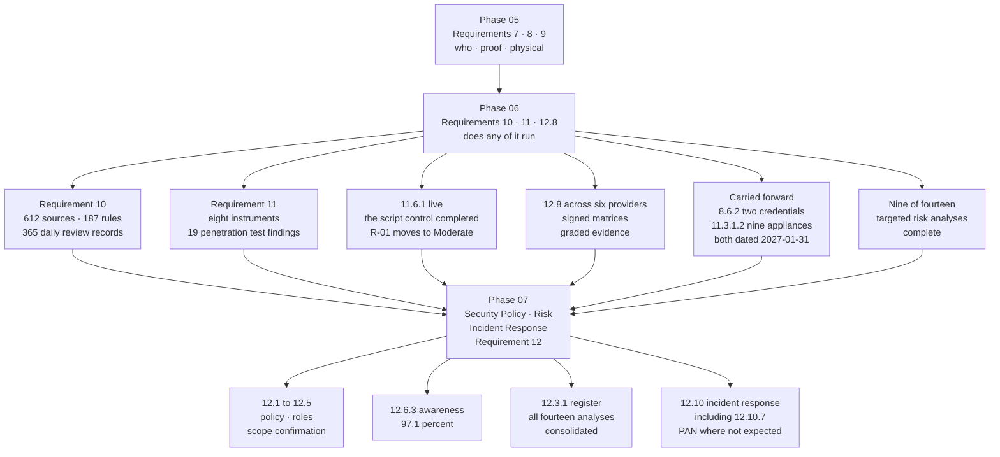

# 06.13 — Phase Summary &amp; Transition

| Field | Value |
|---|---|
| Document ID | MRG-PCI-2026-613 |
| Program | Marketa Retail Group — PCI DSS v4.0.1 Compliance Program |
| Phase | 06 — Monitoring, Testing &amp; Third Parties |
| Version | 1.0 |
| Status | Approved |
| Owner | Naomi Bhatt, Chief Information Security Officer |
| Approver | Raymond Voss, Chief Financial Officer |
| Date | 2026-07-15 |
| Classification | Confidential — Cardholder Data Environment // Illustrative Portfolio Sample |

## Purpose

Phase 06 delivered **Requirements 10 and 11 in full, and Requirement 12.8** — the logging, monitoring, testing and third-party assurance that establish whether everything Phases 03, 04 and 05 built actually runs.

This document records what the phase committed to, what it delivered, what it found, what remains open, and what Phase 07 inherits.

## 1. What Phase 06 Committed To

05.13 §6 handed this phase eight inheritances, six warnings and three defining workstreams. Each commitment is answered here.

| # | Commitment | Source | Outcome |
|---|---|---|---|
| **1** | **11.6.1 as the detective counterpart to 6.4.3**, live August 2026, at a frequency set by targeted risk analysis rather than at the weekly floor | 05.13 §6.2; 04.10 §10; Phase 02–04 addenda | **Delivered.** Live **2026-08-13**; **TRA-11.6.1** sets continuous evaluation with alerting inside 24 hours; **214 alerts, median 9 minutes, 0 exceeding the ceiling**. **06.09** |
| **2** | **The September application penetration test**, including the objectives Phase 05 supplied | 05.13 §6.2 | **Delivered.** **11 findings — 1 Critical, 3 High, 4 Medium, 3 Low**; all remediated and re-tested. **Phase 05's assertion-replay and passcode-reuse objectives both failed to produce a bypass.** **06.08** |
| **3** | **12.8 across six providers, not five**, with TPSP-06's responsibility matrix closed | 05.13 §6.1; **OI-05-02** | **Delivered.** Matrix received 2026-08-27, two disagreements resolved, **signed 2026-09-18** — 12 days early. **06.10** |
| **4** | **10.4.1.1 automated log review** as a real mechanism rather than a dashboard | 05.13 §6.2 | **Delivered.** 187 version-controlled rules, 112 cases adjudicated daily with a zero-aged queue, **365 daily review records**, and the four techniques the quarterly controlled execution found undetected reported rather than the 42 it caught. **06.03** |
| **5** | **The 11.3.1.2 position stated honestly**, whatever it turned out to be | ADR-0004; 05.07's precedent | **Delivered as a finding.** **NOT IN PLACE on 9 of 71 components.** A compensating control was drafted and **refused**. **CAP-06**, 2027-01-31. **06.05** |
| **6** | A **consolidated testing programme** with a calendar, an independence position and a stated untested surface | 01.11; ADR-0009 | **Delivered.** Eight instruments, a month-by-month calendar built backwards from QSA fieldwork, and **thirteen rows of untested surface published under ADR-0025**. **06.11** |
| **7** | **Four of the fourteen targeted risk analyses** | 01.11 §6 | **Delivered.** TRA-10.4.2.1 (#6), TRA-11.3.1.1 (#7), **TRA-11.6.1 (#8)** and the elective **TRA-12.8.4 (#13)**. **Nine of fourteen complete** |
| **8** | **The first movement in the risk register** | 03.12; 04.12 §7; 05.12 §7 | **Delivered.** **Six entries moved on measured operating evidence**, including **R-01 from High 20 to Moderate 10**. Twenty-two held with stated reasons. **06.12** |

## 2. What the Phase Delivered

### 2.1 Deliverables register

| Document | Title | Owner | Content |
|---|---|---|---|
| **06.01** | Logging Strategy &amp; Architecture | Marcus Hale | 10.1, 10.2, 10.3.1–10.3.3. **LOG-P1 to LOG-P6**; 612 sources; 41 event classes; 83 parsers; the six vendor-hosted control planes; weekly synthetic event injection |
| **06.02** | Log Retention &amp; Protection | Marcus Hale | 10.3.2–10.3.4, 10.5.1. **15 months** retained against a 12-month floor; **6 months** immediately available against a 3-month floor; object lock; the annual restoration test |
| **06.03** | Automated Log Review | Marcus Hale | 10.4.1–10.4.3. **187 rules**; **60 of 71** daily and **11 of 71** periodic; **TRA-10.4.2.1**; six dispositions; 42 of 46 techniques detected; **10 Internal Audit disagreements in 160** |
| **06.04** | Time Synchronisation &amp; Failure Detection | Marcus Hale | 10.6, 10.7.2, 10.7.3. **CSC-1 to CSC-10**; **21 recorded control failures**; the CSC-9 addition that treats the review mechanism itself as a control system |
| **06.05** | Internal Vulnerability Scanning | Marcus Hale | 11.3.1, 11.3.1.1, **11.3.1.2**, 11.3.1.3. **TRA-11.3.1.1**; 284 component-scans, **248 authenticated**; **the Not in Place finding and the refused compensating control**; **CAP-06** |
| **06.06** | ASV Scanning | Owen Castellanos | 11.3.2, 11.3.2.1. Four quarters, **Q1 failed and rescanned clean in 11 days**; four attestations inside the C4 window; the scope-management root cause |
| **06.07** | Wireless &amp; Intrusion Detection | Marcus Hale | 11.1, 11.2, 11.5. **TEST-P1 to TEST-P6**; **488 of 488** facilities × 4 cycles; 3 unauthorised access points; 5 critical points within the CDE; **CAP-05** status |
| **06.08** | **Application Penetration Test** | Naomi Bhatt | **11.4.1 to 11.4.4**. **PTM-1 to PTM-10**; **APP-PT-01 to APP-PT-11**; the Critical worked end to end; the 19-finding programme position; **ADR-0020** |
| **06.09** | **Payment Page Tamper Detection** | Sonia Rendell | **11.6.1**. **TRA-11.6.1**; **TAM-1 to TAM-7**; two measurement limbs; 214 alerts and 3 incidents; two proof-of-life tests; **the script control completed**; **ADR-0021**, **ADR-0022** |
| **06.10** | **Third-Party Service Provider Management** | Owen Castellanos | **12.8.1 to 12.8.5**. **Six providers**; **MT-1 to MT-3**; the elective **TRA-12.8.4**; the 22-area signed matrix; 80 graded evidence rows; **ADR-0023**, **ADR-0024** |
| **06.11** | Security Testing Programme | Owen Castellanos | Eight instruments; the annual calendar; the selection rule; the consolidated year; **the untested surface**; **ADR-0025** |
| **06.12** | Control-to-Risk Traceability | Owen Castellanos | 28 of 44 risks touched, primary for 15; **six entries moved**; six holdings stated individually; the close position reconciled four ways |
| **06.13** | Phase Summary &amp; Transition | Naomi Bhatt | This document |

### 2.2 The phase in numbers

| Measure | Value |
|---|---|
| Assessed system components | **71** — 8 CDE, 63 connected-to |
| Log sources | **612**; event classes **41**; parsers **83**; detection rules **187** |
| Events ingested daily | ~3.5 billion; **112 cases adjudicated daily** with a zero-aged queue |
| Daily review records | **365** |
| Log review split | **60 of 71** daily under 10.4.1; **11 of 71** monthly under 10.4.2 |
| Log retention | **15 months**, **6 months** immediately available |
| Internal scan cycles | **4**; **284** component-scans; **248 authenticated**; **52 of 52** Critical and High resolved with confirming rescan |
| **Authenticated scanning coverage** | **62 of 71.** **9 components cannot be** — **11.3.1.2 NOT IN PLACE** |
| ASV scans | **4** — Q1 **failed**, rescanned clean in **11 days**; Q2–Q4 passed first time |
| Wireless cycles | **4** across **488 of 488** facilities; **1,952** facility-scans; **3** unauthorised access points, all removed inside 24 hours |
| Authorised access points | **1,612** |
| **Penetration test findings** | **19 across two engagements — 2 Critical, 5 High, 7 Medium, 5 Low**; split **8 segmentation + 11 application**; **19 of 19** remediated and re-tested |
| **Payment-page population** | **6 templates · 38 scripts · 11 third-party**; **3 unauthorised at first inventory** |
| **11.6.1 operation** | Live **2026-08-13**; **~1.29M** synthetic evaluations; **~4.1M** real-browser digests; **214 alerts**; median **9 minutes**; **0** exceeding the 24-hour ceiling; **3 incidents**; **2 proof-of-life tests** |
| **Third-party service providers** | **6** — TPSP-01 to TPSP-06; **36** MT-1 verifications; **6** signed responsibility matrices; **80** graded evidence rows, 35 of them E3 |
| Control failures under 10.7.2 | **21** across **CSC-1 to CSC-10** |
| Targeted risk analyses delivered | **4** — #6, #7, **#8**, **#13**. **9 of 14 complete** |
| Architecture decisions | **ADR-0020 to ADR-0025** |
| Risks touched | **28 of 44**; primary for **15**; **6 moved**; **1 accommodation** |
| **Not in Place findings carried** | **2** — 11.3.1.2 raised here, 8.6.2 from Phase 05. **Both dated 2027-01-31** |

## 3. What the Phase Found

Phase 06 is the phase whose job is to find things, and it found seven that changed something.

| Finding | Where | What changed |
|---|---|---|
| **11.3.1.2 is Not in Place on 9 of 71 components** | 06.05 §5 | The programme's second Not in Place entry. **The documentation allowance does not reach a component whose credentials the entity has not obtained** — the distinction is between a property of the technology and a property of a contract. **CAP-06** is a renewal negotiation, not an engineering task |
| **APP-PT-01 — an unauthenticated administrative interface on CDE-03** | 06.08 §5 | Authentication moved from the proxy into the application across all 9 applications; an automated authorisation test suite in the build; a daily listener assertion; **SIG-4 amended**; a third hard override rule in the 6.3.1 ranking model |
| **Four controls saw the change that produced the Critical and none asked the right question** | 06.08 §5.6 | The scan policy now ranks an unrecognised service on a CDE component as High pending determination, rather than informational |
| **A vendor changed the code on Marketa's payment pages four days before telling Marketa** | 06.09 §9.1 | The CSP blocked the undeclared destination; **11.6.1 revealed that it had happened**. Contract remedy at renewal; the vendor's migration onto the tag proxy raised in priority |
| **A payment-page header fix regressed three weeks after it was applied** | 06.09 §9.2 | Detected twice by 11.6.1 and independently by the penetration test. **Detecting the same thing twice is a signal that the remediation was at the wrong layer** — a header assertion now sits in the release gate |
| **A hotfix reached three payment templates without a reconciled manifest** | 06.09 §9.3 | Found in 14 minutes from outside, with no prior knowledge of what was going to change. Every publication route to the payment-page origin now emits a manifest or fails |
| **Truvance's AOC scope statement changed at re-issue while its status stayed valid** | 06.10 §5.7 | The subtler form of R-10. Confirmed benign in writing within 15 days. **The trigger fired because somebody reads the scope statement rather than the status line** |

### 3.1 The finding that matters most, in one paragraph

**The programme's Critical finding was produced by three individually correct decisions intersecting.** Authentication enforced at a reverse proxy is a recommended pattern. A management connector bound to all interfaces was the platform vendor's new default, documented in a minor version's release notes. A firewall rule permitting the platform's management port range from the administrative zone was required for the platform's own tooling and was reviewed and approved. Nobody was careless, nothing was misconfigured against its own intent, and the result was an interface on a cardholder data environment component that accepted administrative requests without authentication for **176 days**. Marketa could establish that nothing else reached it, because a control built for a different purpose — inline prevention with flow recording at the Z3-to-Z1 crossing — retains every session for fifteen months. **The remediation is structural rather than a corrected setting, because the setting was not the problem.**

## 4. Requirement Coverage at Phase Close

| Requirement | Position |
|---|---|
| **10.1.1, 10.1.2** | Met — six procedures current and in use, with the knowledge limb evidenced by interview across four teams |
| **10.2.1.1 to 10.2.1.7, 10.2.2** | Met — 41 event classes across 612 sources; the six 10.2.2 fields measured continuously rather than asserted |
| **10.3.1 to 10.3.4** | Met — access restricted, files protected from modification, backed to a separate credential domain, and modification alerting evidenced separately from 11.5.2 |
| **10.4.1, 10.4.1.1, 10.4.2, 10.4.2.1, 10.4.3** | Met — **60 of 71** daily, **11 of 71** monthly under **TRA-10.4.2.1**; 187 rules applying a determination with an accounted-for output; six dispositions with a tuning rule and a reported unresolved rate |
| **10.5.1** | Met with margin — 15 months retained, 6 months immediately available, both measured |
| **10.6.1 to 10.6.3** | Met — pinned authenticated sources, daily client-side assertion, consequence-based drift thresholds |
| **10.7.2, 10.7.3** | Met — **CSC-1 to CSC-10**, 21 failures recorded, each with a security-issue-arising analysis |
| **10.7.1** | **Service-provider requirement.** Never within the 306 |
| **11.1.1, 11.1.2** | Met — **TEST-P1 to TEST-P6** across six executing organisations |
| **11.2.1, 11.2.2** | Met — 4 cycles across 488 of 488 facilities; 3 detections; 1,612 authorised access points |
| **11.3.1, 11.3.1.1, 11.3.1.3** | Met — 4 cycles, 71 of 71 each cycle; **TRA-11.3.1.1** with automatic escalation, which fired 43 times |
| **11.3.1.2** | **NOT IN PLACE** — **62 of 71**; **9 vendor-locked appliances**; **no compensating control recorded**; **CAP-06**, remediation **2027-01-31**; **R-36 held at High 16** |
| **11.3.2, 11.3.2.1** | Met — 4 ASV scans with 4 attestations inside the C4 window; 15 change-driven external scans at the ASV standard |
| **11.4.1 to 11.4.4** | Met — **PTM-1 to PTM-10**; internal and external testing; **19 of 19** findings corrected and re-tested by the finder under **ADR-0020** |
| **11.4.5** | Met — May **failed**, June re-test passed, September confirmatory limb passed |
| **11.4.6, 11.5.1.1** | **Service-provider requirements.** Never within the 306; **not** among the ROC's four Not Applicable entries |
| **11.5.1, 11.5.2** | Met — both CDE perimeters and five critical points within; all 71 under change detection with a weekly full baseline comparison |
| **11.6.1** | Met — **TRA-11.6.1**; continuous evaluation with alerting inside 24 hours; **214 alerts, 0 exceeding the ceiling**; quarterly proof of the detector |
| **12.8.1 to 12.8.5** | Met — **six** providers; agreements with the acknowledgement engaged on the correct limb; the elective **TRA-12.8.4** and tiered monitoring; six signed matrices with graded evidence |
| **12.9.1, 12.9.2** | **Service-provider requirements.** Never within the 306; recorded because 12.9.2 is the duty Marketa's 12.8.5 relies on |

## 5. Open Items Carried Out of Phase 06

| ID | Item | Owner | Due | Goes to |
|---|---|---|---|---|
| **OI-06-01** | **11.3.1.2 remediation — CAP-06.** A contractual right to credentialed scanning and agent installation on the 9 POS back-office appliances at the FY2027 renewal, or platform replacement as the costed fallback; verified by an authenticated scan of all 9 with per-target authentication assertion | Trevor Kim | **2027-01-31** | **ROC finding in Phase 08**; re-assessment 2027-02-18; Phase 09 |
| **OI-06-02** | **8.6.2 remediation**, carried from **OI-05-01** — vendor release 9.4 for `batch-icq`, the ERP interface upgrade for `gl-extract`, both credentials moved to CT-14 retrieval. Requires a freeze exemption approved 2026-12-17 | Trevor Kim | **2027-01-31** | **ROC finding in Phase 08**; re-assessment 2027-02-18 |
| **OI-06-03** | **SCR-29 and SCR-33 migrated onto the Marketa tag proxy**, converting two vendor-hosted mutable scripts into pinnable self-hosted ones and reducing the detection-assured population from 6 of 38 | Sonia Rendell | 2027-03-31 | Phase 09 |
| **OI-06-04** | **11.6.1 matrix change after PoL-2** — geography and device-profile rotation frequency doubled, field digest sampling raised to 1 in 10 for mobile profiles, verified by a further proof-of-life test | Sonia Rendell | 2027-01-31 | Phase 09 |
| **OI-06-05** | **CAP-05** — the legacy pre-shared key population to zero; frozen at 203 devices across 133 stores until February 2027 | Trevor Kim | 2027-06-30 | Phase 09 |
| **OI-06-06** | **TPSP-06's first full 12.8.4 annual review**, with the annual site inspection as its corroborating evidence and the E3 rows re-graded | Owen Castellanos | 2027-06-30 | Phase 09 |
| **OI-06-07** | **A phishing and pretext-calling test programme** proposed for 2027, closing one of the thirteen untested-surface rows published under ADR-0025 | Marcus Hale | 2027-06-30 | Phase 07, Phase 09 |
| **OI-06-08** | **Contract remedy for the SCR-29 change-notification failure** at the vendor's renewal, with notification terms that perform | Frank Mueller with Sonia Rendell | 2027-02-28 | Phase 07 |
| **OI-06-09** | **The four undetected techniques' new rules validated** at the next quarterly controlled execution, so that the rules written after a miss are proved rather than assumed | Marcus Hale | 2027-03-31 | Phase 09 |
| **OI-06-10** | **The second annual segmentation penetration test**, which is **R-14's exit criterion** alongside 90 days of clean CSC-8 assertion | Trevor Kim | 2027-05-31 | Phase 09 |

**Two of the ten are the programme's Not in Place findings, and both carry the same date.** That date is **2027-01-31**, it falls after the **2026-12-11** ROC and AOC, and it is why the AOC is filed as non-compliant with a dated remediation plan and a re-assessment achieving full compliance is issued **2027-02-18**.

## 6. Transition to Phase 07

Phase 07 is **Security Policy, Risk &amp; Incident Response — Requirement 12**, less the 12.8 population this phase has just closed.

### 6.1 What Phase 07 inherits

| Inheritance | Detail |
|---|---|
| **Nine of the fourteen targeted risk analyses** | TRA-7.2.5.1, TRA-8.6.3, TRA-9.5.1.2.1 from Phase 05; TRA-10.4.2.1, TRA-11.3.1.1, **TRA-11.6.1** and the elective **TRA-12.8.4** from this phase; plus the two delivered earlier in the programme. **Phase 07 delivers the remaining five and consolidates all fourteen into the 12.3.1 register** with owners, dates, review dates and trigger sets |
| **An incident population that is real** | 12.10 was exercised in production this year, not tabletopped: the Critical finding's stop-and-notify at 14:20 on 2026-09-16; three rogue access points under 12.10.5; two file-integrity escalations; **three page-integrity incidents under 11.6.1**; and the four unexpected-PAN locations from Phase 02 under **12.10.7** |
| **A monitoring capability that can support incident response** | 15 months of retained logs with 6 months immediately available; a median 6-second ingest latency for CDE sources; **an evidenced ability to enumerate every session to a port on a CDE component across a 176-day window** |
| **A tested detection estate with a measured edge** | 187 rules, 42 of 46 techniques detected, and **the 4 that were not, reported rather than the 42** |
| **A closed 12.8 population** | Six providers, six signed matrices, tiered monitoring, and **35 evidence rows graded E3** that Phase 07's risk work should read as a standing exposure |
| **Both Not in Place findings, undressed** | 8.6.2 and 11.3.1.2, each with a dated plan, each with a compensating control **drafted and refused**, each held at High in the register |
| **A register that has moved for the first time** | Six entries, on measured operating evidence, with the reasoning in 06.12 §4 and the twenty-two holdings in §5 |

### 6.2 The workstreams that define Phase 07

| Workstream | Why it matters, and what Phase 06 hands it |
|---|---|
| **12.3.1 — the fourteen targeted risk analyses consolidated** | Four were delivered here, and two of them are the phase's most consequential documents: **TRA-11.6.1**, which sets a frequency 336 times stricter than the requirement's floor and justifies it on transaction volume per unit time; and the **elective TRA-12.8.4**, performed against a requirement that delegates nothing, because the question was worth asking. Phase 07 must hold all fourteen with owners, dates and triggers, and must be able to show that each analysis has a review date somebody is accountable for |
| **12.6.3 — awareness at 97.1%** | Against a charter bar of **≥95%**, across ~34,000 colleagues plus a seasonal intake of up to 6,800. Phase 06's contribution is unglamorous and specific: **the three unauthorised access points were all installed by people solving an ordinary problem**, and the procedure changes that followed were a procurement standard and a contractor equipment reconciliation, not a training module. Awareness is necessary and it is not the control |
| **12.10 — incident response, including 12.10.7** | **12.10.7 — procedures for PAN discovered where it is not expected — is a future-dated requirement in its first assessment**, and Marketa has four real instances: 11,400 call recordings, 2,187 scanned dispute documents, an application debug log on a decommissioned host, and a store manager's emailed spreadsheet of 34 records. Phase 06 hands Phase 07 the detection side: the **PAN-pattern quarantine rule** raised after R-31, the data-movement detection class, and a 12.10.5 route that has been invoked five times in production this year |

### 6.3 What Phase 07 must not assume

| Do not assume | Because |
|---|---|
| That a control tested once is a control assured | Every movement in 06.12 §4 rests on **one operating cycle**, and 11.6.1's rests on **140 days**. The largest single change in the register has the shortest evidence base in it, and 06.12 §8 says so |
| That the risk register is now largely settled | Six entries moved and **twenty-two were held**, six of them uncomfortably. **R-36 is held at High while the requirement it treats is Not in Place**, and R-14 is held while two clean tests are not yet a trend across 482 stores |
| That 12.8 assurance is a governance exercise | Three providers sit between Marketa and its ability to accept payment at all, **35 of 80 graded evidence rows are uncorroborated provider statements**, and Marketa cannot audit its largest provider. 06.10 §8 is the risk input Phase 07's Requirement 12 work should read first |
| That the incident procedures are proved because they were used | They were used for a rogue access point, a file-integrity escalation and a page-integrity alert. **None of those was a confirmed compromise of account data.** The procedures have been exercised against detections, not against a breach |
| That awareness explains the human findings | Two of nine unannounced repair-personnel verification tests failed; 341 inspection records were submitted in under 25 seconds; a marketing analyst published a pixel to six payment templates without a change record. **All three are design problems that awareness training would not have prevented** |
| That the 12.3.1 analyses are documents | Each of the fourteen carries **six elements, an annual review date and a trigger set**. **TRA-11.6.1's trigger 5 already fired**, on the November proof-of-life test, and produced a real change to the mechanism. An analysis whose triggers never fire is an analysis nobody is testing against |
| That 12.10.7 is about procedure | It is about the four places PAN was actually found, one of which existed because **DTMF masking protects recordings made after deployment and says nothing about the archive** — an assumption Phase 02 disproved on evidence and which raised R-31 |

## 7. Assurance Statement

Marketa Retail Group has implemented PCI DSS v4.0.1 **Requirements 10 and 11 in full, and Requirement 12.8**, across the **71 system components** in its assessed population — 8 cardholder data environment components and 63 connected-to or security-impacting systems — across 488 facilities, 1,914 point-of-interaction terminals, **6 payment page templates** and **6 third-party service providers**.

As at 2026-07-15:

- **612 log sources** produce an audit trail across 41 event classes, with the six 10.2.2 fields measured continuously rather than asserted, retained for **15 months** against a 12-month obligation and **immediately searchable for 6 months** against a 3-month one.
- **187 version-controlled detection rules** apply an analytical determination across the whole in-scope log population, presenting **112 cases a day** to a named reviewer who clears the queue to zero on every one of **365 operating days**, with six defined dispositions, a tuning rule that requires a rule change, and an unresolved rate of **4.7% reported rather than eliminated**.
- **Ten classes of critical security control system** are asserted independently of their own health reporting, producing **21 recorded failures** in the year — each with a duration, a cause, a security-issue-arising analysis and a preventive control.
- **All 71 components were scanned in every quarterly cycle**, with **52 of 52** Critical and High findings resolved and confirmed by rescan, and every Medium and Low finding treated under a banded targeted risk analysis whose two-consecutive-scan escalation rule fired **43** times and closed every one.
- **Four ASV scans** were performed by an Approved Scanning Vendor and four Attestations of Scan Compliance were transmitted to Cardinal Merchant Bank inside the 30-day window. **One of the four failed**, and it is reported first in 06.06 rather than last.
- **Every facility was scanned for unauthorised wireless access points in every quarter** — 1,952 facility-scans, no sampling — finding **three** devices attached to a Marketa network, all removed inside 24 hours, none with any path to the cardholder data environment.
- **Two independent penetration testing engagements produced 19 findings — 2 Critical, 5 High, 7 Medium, 5 Low.** All 19 were remediated and re-tested **by the firm that found them**, 18 closing at first re-test and one at second, with none open at year end.
- **A change- and tamper-detection mechanism evaluates Marketa's six payment pages as a consumer's browser receives them**, from outside Marketa's networks, across 192 permutations every 30 minutes and 4.1 million real consumer sessions, comparing headers, script inventory, script content, page composition, network destinations and payment-frame targets against an authorised baseline. **It raised 214 alerts, none of which exceeded its 24-hour ceiling, at a median of 9 minutes.**
- **Six third-party service providers** are registered with a described service, a written agreement carrying the security acknowledgement on the limb that applies, a signed responsibility matrix across 22 control areas, and monitoring tiered above the annual floor.

Five statements are made without qualification because they are less comfortable than the nine above.

**Requirement 11.3.1.2 is Not in Place.** Authenticated internal vulnerability scanning is complete on 62 of 71 components and impossible on nine, because the support agreement for a POS back-office appliance platform provides neither administrative credential release nor agent installation rights. The gap is not technological; it is a term in a contract nobody negotiated for. **Marketa argued the requirement's documentation allowance and the argument failed on the distinction between a system that cannot accept credentials and a system whose credentials the entity has not obtained.** A Compensating Controls Worksheet was drafted and refused on three of its four tests, on the same reasoning that refused one for 8.6.2 in Phase 05. **R-36 is held at High 16.** The remediation is dated **2027-01-31**.

**An administrative interface on a cardholder data environment component accepted requests without authentication for 176 days.** It was found by a penetration tester on 2026-09-16 and contained in two hours forty minutes. Four Marketa controls observed the change that created it — a change-driven authenticated scan, file integrity monitoring, the daily log review and the quarterly firewall rule review — and **all four behaved exactly as designed while none of them asked the question that mattered.** Marketa can state that nothing else reached the interface, and can state it from a complete enumeration of 47 sessions rather than from a search that found nothing, because a control built for a different purpose retained the flow records. **The remediation moved authentication into the application across all nine applications, because the setting was not the problem.**

**A third-party vendor changed the code executing on Marketa's payment pages four days before telling Marketa.** The Content Security Policy blocked the undeclared destination the new version attempted, and the tamper-detection mechanism reported the change in eleven minutes. **Neither the contract, nor the script inventory, nor the vulnerability scanner, nor the file integrity monitor, nor the ASV scan detected it, and none of them could have.** Marketa's integrity method for that script was a contractual notification duty, and the duty did not perform.

**Scope reduction converted a technical control problem into a third-party assurance problem, and Phase 06 is where the bill arrives.** Marketa reduced its assessed population from 604 systems to 71 by putting the primary account number somewhere else. Three providers now sit between Marketa and its ability to accept payment at all. Marketa cannot audit its largest one, holds no right of inspection, and would not obtain one by asking. **Thirty-five of eighty graded assurance rows are provider statements Marketa cannot corroborate.** The trade was correct — the alternative is holding 68.4 million primary account numbers a year across 482 stores staffed by a workforce that grows by 6,800 people every October — and it is not free, and 06.10 §8 states the price rather than implying that diligence reaches inside a provider.

**Six entries moved in the risk register and twenty-two were held.** This is the first phase in which anything moved, because it is the first phase whose evidence is operation rather than design. **R-01 — unauthorised script executing in the consumer browser on a payment page, the register's highest entry at 20 — falls to Moderate 10**, on a likelihood reduction from 4 to 2 and an impact deliberately held at 5. Four documents across two phases declined to move it, in almost identical words, and every one of them named the same condition.

And the sentence this phase exists to earn:

> **Marketa can prove that the payment page a customer received this morning is the page Marketa authorised — from outside its own network, in a browser it does not own, in nine minutes.**
>
> That sentence is worth something only because the mechanism has said no. It said no three times in 140 days: once to a vendor who changed an authorised script before telling anyone, once to a security header that a fix had restored and an edge change had removed again, and once to Marketa's own engineers, who published a hotfix to three payment templates on a Friday afternoon without a reconciled manifest. **Two of the three findings were Marketa's own, which is the harder detection case and the more useful result.**
>
> The other half of the sentence is the half that took two phases to earn. **6.4.3 authorises and binds integrity at deployment. 11.6.1 detects modification afterwards.** 6.4.3 alone would have let an authorised vendor's release reach a payment page unobserved, because its integrity method for that script was a contract. 11.6.1 alone would have produced 214 alerts with no authorised state to compare them against, and would have been tuned into silence inside a quarter. **Neither substitutes for the other, the portfolio said so four times before it could prove it, and the proof is that each one caught what the other structurally could not.**
>
> The uncomfortable coda: **the mechanism cannot prevent anything.** Every minute between a modification and an alert is a minute in which roughly thirty checkouts complete on a page nobody has yet examined. Nine minutes is not zero. The control's entire value is a function of how fast a human acts on what it says, which is why the containment options are pre-authorised, why the minimal payment template is built and exercised before it is needed, and why the number Marketa reports from its proof-of-life testing is **the 38 minutes, not the 4**.

No statement in this phase asserts that a PCI DSS Attestation of Compliance constitutes compliance with any law, that a QSA's opinion binds a card brand or an acquirer, or that a merchant can be certified against PCI DSS. **PCI DSS is contractual, not statutory**; the Council writes the standard and does not enforce it. Marketa is privately held, is not an SEC registrant, and has no SOX control population. No fine, fee or penalty amount is stated anywhere in this programme.

## Cross-References

| Reference | Relevance |
|---|---|
| 01.06 — Program Charter &amp; Objectives | The commitments Phase 06 was accountable for; the ≥95% awareness bar |
| 01.08 — Scope Assumptions &amp; Constraints | **CON-01** the freeze, **CON-02** the 482× multiplier, **CON-03** the vendor-locked appliances behind CAP-06 |
| 01.09 — Third-Party Service Provider Register | The register and process 06.10 executes across six providers |
| 01.11 — Compliance Calendar &amp; Obligations | The fourteen targeted risk analyses, of which this phase delivered four |
| 02.10 — Scope Reduction Analysis | **604 → 71**, the decision whose price 06.10 §8 states |
| 03.07 · 03.08 — Segmentation Penetration Test and Re-Test | 11.4.5; the 8 findings reconciling with this phase's 11 |
| 03.11 — Risk Register | The 44-entry baseline; **R-01, R-09, R-10, R-14, R-19, R-26, R-34, R-36** |
| **04.10 — Payment Page Script Management** | **6.4.3**, the preventive half of the control **06.09** completes |
| 05.07 — Application &amp; System Accounts | The **8.6.2** Not in Place finding carried into this phase as OI-06-02 |
| 05.08 — Physical Security &amp; Facilities | **TPSP-06** and **ADR-0016**, which **ADR-0023** extends to all six providers |
| **05.13 — Phase Summary &amp; Transition** | The eight inheritances, six warnings and three workstreams answered in §1 |
| **06.01 to 06.12** | The phase's twelve preceding deliverables |
| **Phase 07 — Security Policy, Risk &amp; Incident Response** | **Requirement 12**; the fourteen targeted risk analyses consolidated; **12.6.3 at 97.1%**; **12.10.7 PAN found where it is not expected** |
| Phase 08 — QSA Assessment &amp; ROC Production | The two Not in Place entries; the non-compliant AOC of 2026-12-11 and the 2027-02-18 re-assessment |
| Phase 09 — Executive Reporting &amp; Continuous Compliance | CAP-05 and CAP-06 closure; the close position measured against 06.12 §7 |

---
[⬅ Previous](06.12-control-to-risk-traceability.md) · [🏠 Phase 06 Home](06.00-README.md) · [Next ➡](../07-security-policy-risk-incident-response/07.00-README.md)
