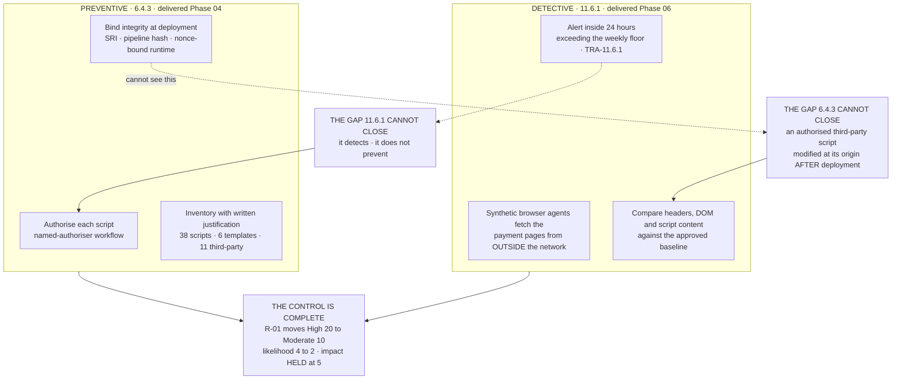

# The Script Control Completes

## Why R-01 could not move in Phase 04

Phase 04 implemented 6.4.3 in full — inventoried all 38 scripts, removed three that nobody had authorised, and closed the tag-manager publication path entirely. **R-01 was held at High 20 anyway**, and four separate documents said why: 6.4.3 is preventive, and a preventive control alone leaves the post-authorisation modification path open.

An entity that moved the risk in Phase 04 would have been rewarding itself for half a control. The register waited for the evidence.

**Impact stays at 5.** A skimming script on a payment page is a card-data compromise whatever else is true; only the likelihood moved.

## Source
`06.09-payment-page-tamper-detection.md`, `04.10-payment-page-script-management.md`.
