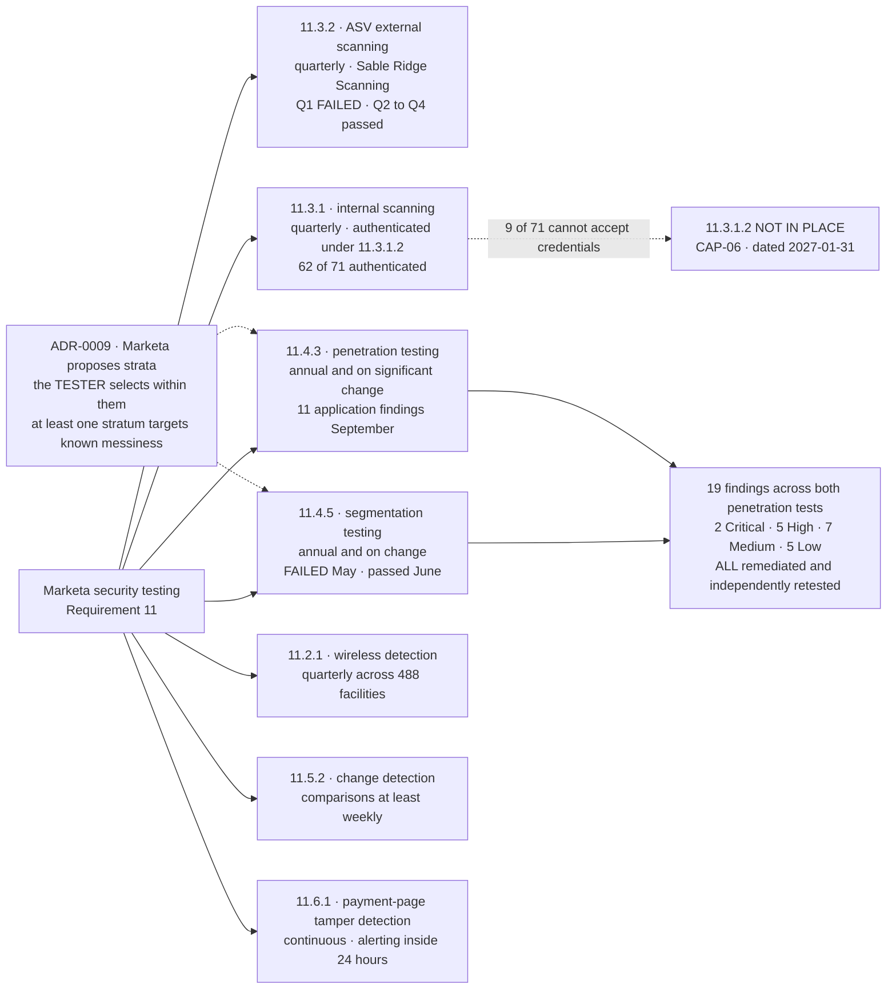

# The Security Testing Programme

## The inverse question

A testing programme is defined as much by what it does not test. Marketa's stated exclusions are recorded rather than implied: the P2PE decryption environment (Verition's, not Marketa's), the Truvance token vault, and the Cadence masking platform are all outside Marketa's testing scope — and all three are therefore **third-party assurance problems** handled under 12.8, not testing problems handled under 11.

That is the trade scope reduction made, stated in the one place a reader would think to check.

## Source
`06.11-security-testing-programme.md`, `06.05`, `06.06`, `06.08`.
