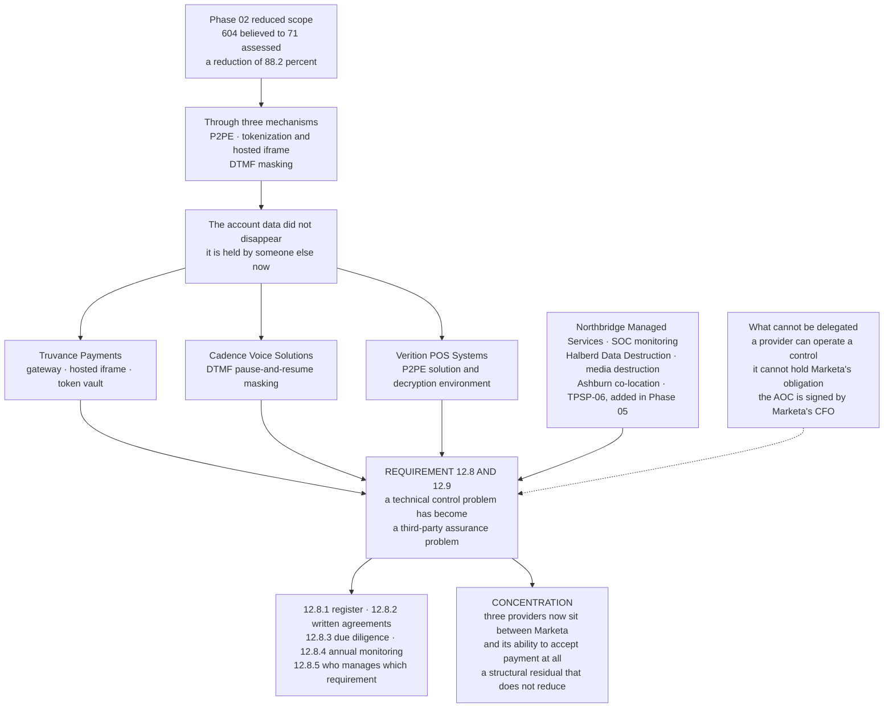

# Where the Bill for Scope Reduction Arrives

## The honest accounting

Phase 02 presented scope reduction as the highest-leverage activity available to a merchant, and it is. It also said plainly, in `02.10`, that **scope reduction is not risk reduction** — the data still exists, it is just held by someone else.

This phase is where that statement stops being a caveat and becomes a workload. Six providers, six responsibility matrices, AOC currency tracking, and an annual monitoring programme whose frequency is itself set by a targeted risk analysis.

## Source
`06.10-third-party-service-provider-management.md`, `02.10-scope-reduction-analysis.md`.
