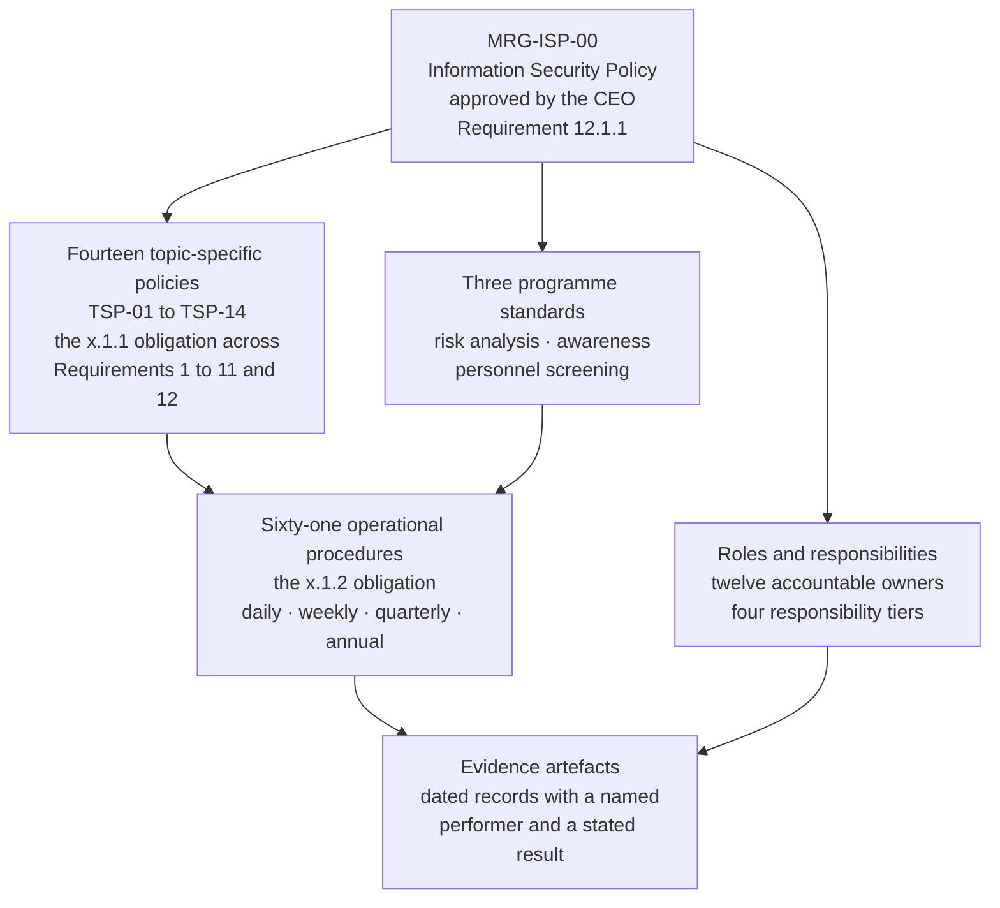

# 07.01 — Information Security Policy

| Field | Value |
|---|---|
| Document ID | MRG-PCI-2026-701 |
| Program | Marketa Retail Group — PCI DSS v4.0.1 Compliance Program |
| Phase | 07 — Security Policy, Risk &amp; Incident Response |
| Version | 1.0 |
| Status | Approved |
| Owner | Naomi Bhatt, Chief Information Security Officer |
| Approver | Diane Okafor, Chief Executive Officer |
| Date | 2026-07-15 |
| Classification | Confidential — Cardholder Data Environment // Illustrative Portfolio Sample |

## Purpose

Requirement 12.1 is four verbs and one appointment. The policy must be **established**, **published**, **maintained** and **disseminated**; the roles and responsibilities within it must be **defined** and **acknowledged**; and responsibility for information security must be **formally assigned** to a Chief Information Security Officer or another executive with information security knowledge.

Three of those four verbs are easy to evidence and one is not. Establishing a policy is a drafting exercise. Publishing it is a file location. Maintaining it is a review record with a date. **Disseminating it to ~34,000 colleagues across 482 stores, four distribution centres and two offices, plus up to 6,800 seasonal colleagues arriving inside a change freeze, plus the relevant vendors and business partners the requirement also names — that is the part that is actually work**, and it is the part this document spends most of its length on.

This document sets out Marketa's policy architecture, how each layer is disseminated to the population it binds, the 2026 annual review under 12.1.2, the roles-and-responsibilities definition under 12.1.3 with its acknowledgement mechanics, and the formal assignment under 12.1.4.

**What this document does not cover.** The acceptable use policy and the full topic-specific suite are **07.02**. The awareness programme that carries the policy to people is **07.04**. Personnel screening and the roles as they operate in practice are **07.05**. Third-party obligations under 12.8 were delivered in **Phase 06** and are referenced, not re-delivered.

## 1. What 12.1 Requires, Sub-Requirement by Sub-Requirement

| Sub-req | The obligation, in the standard's own terms | Marketa's discharge | Where evidenced |
|---|---|---|---|
| **12.1.1** | An overall information security policy is **established, published, maintained and disseminated** to all relevant personnel, **as well as to relevant vendors and business partners** | **MRG-ISP-00**, approved by the CEO, published in four channel formats, reviewed annually, disseminated to 100% of the in-scope personnel population and to all six third-party service providers through the 12.8.2 agreement pack | §2, §3 |
| **12.1.2** | The policy is **reviewed at least once every 12 months** and **updated as needed** to reflect changes to business objectives or to the risk environment | Review performed 2026-06-08 to 2026-06-26; **nine amendments**; approved 2026-07-15; the review record states what did **not** change and why | §4 |
| **12.1.3** | The security policy **clearly defines information security roles and responsibilities for all personnel**, and all personnel **acknowledge their understanding and acceptance** | Four responsibility tiers with named accountable owners for all twelve requirements; acknowledgement fused to the 12.6.3 module completion; **97.1%** | §5, and 07.05 |
| **12.1.4** | Responsibility for information security is **formally assigned to a Chief Information Security Officer or other executive** with information security knowledge and responsibility | Assigned by the CEO to **Naomi Bhatt, CISO**, in writing, with the assignment recorded in the programme charter and reported to the Audit Committee quarterly | §6 |

### 1.1 Two neighbouring requirements that are not Marketa's

| Sub-req | Position |
|---|---|
| **12.4.1** | **Service-provider requirement only** — executive management establishing responsibility for the protection of account data and a PCI DSS compliance programme. Marketa is a Level 1 **merchant**. This sub-requirement was **never within the 306** applicable sub-requirements and is therefore **not** among the ROC's four Not Applicable entries |
| **12.4.2** | **Service-provider requirement only** — quarterly reviews confirming personnel are performing security tasks in accordance with policy. Also **never within the 306** |

The distinction matters and the programme has repeated it since Phase 02. **A requirement that never applied to an entity of this type is not "Not Applicable"; it is out of population.** The four Not Applicable entries in the ROC are merchant-applicable sub-requirements determined not to apply to Marketa's specific environment, and Phase 08 names them. Conflating the two categories is one of the most common ways an ROC misrepresents its own scope.

Marketa nonetheless performs the substance of 12.4.1 voluntarily — the CFO chairs the Steering Committee, the CEO signs the overarching policy, and the Audit Committee receives quarterly reporting — because the governance is worth having, not because the requirement reaches it. That is stated here so nobody later mistakes a voluntary practice for a compliance obligation.

## 2. The Policy Architecture

Marketa operates **one overarching policy, fourteen topic-specific policies, three programme standards and sixty-one operational procedures.** The shape is deliberate: 12.1.1 asks for *an overall* policy, and 12.6.1 requires personnel to be made aware of *the entity's information security policy and procedures* — which in v4.0.1 practice means the topic-specific set that discharges the `x.1.1` and `x.1.2` sub-requirements running through Requirements 1 to 11.

| Layer | Count | What it does | Approval authority | Review cadence |
|---|---|---|---|---|
| **Overarching policy** — MRG-ISP-00 | 1 | States the Company's commitment, the scope of the information security programme, the four responsibility tiers, the disciplinary position, and the exception route | **Diane Okafor, CEO** | At least every 12 months — **12.1.2** |
| **Topic-specific policies** — TSP-01 to TSP-14 | 14 | Discharge the `x.1.1` limb for each requirement area; state what must be true, not how it is achieved | Naomi Bhatt, CISO, with the requirement's accountable owner | At least every 12 months, and on significant change |
| **Programme standards** — PS-1 to PS-3 | 3 | The targeted risk analysis standard (12.3), the security awareness standard (12.6), the personnel screening standard (12.7) | Naomi Bhatt, CISO | At least every 12 months |
| **Operational procedures** | 61 | Discharge the `x.1.2` limb — documented, kept up to date, in use, and **known to all affected parties** | The requirement's accountable owner | On change, and confirmed current at the annual review |

The `x.1.2` sub-requirements are the ones entities most often under-evidence, because their fourth limb is not a document property. **A procedure can be documented, current and in use, and still fail its requirement if the people who have to follow it do not know it exists.** Phase 06 evidenced that limb for Requirement 10 by interview across four teams rather than by producing the document; the same method is applied across the suite, and 07.02 §6 records the results.

## 3. Dissemination — the Part That Is Actually Work

### 3.1 The population, and why one channel cannot reach it

| Population | Size | Working conditions | Channel that reaches them |
|---|---|---|---|
| Corporate — Columbus HQ and Austin | ≈ 2,300 | Assigned workstation, corporate mailbox, daily intranet use | Intranet policy library; LMS assignment; email |
| Distribution centres — 4 sites | ≈ 2,100 | Shared terminals; a minority hold individual mailboxes | Shift-start LMS kiosk; printed pack at the shift office; supervisor briefing |
| **Store colleagues — 482 stores** | **≈ 29,600** | **No assigned workstation, no individual corporate mailbox for the majority, a shared back-office terminal, and a shift pattern that does not include desk time** | Store portal on the back-office terminal; the **printed policy pack** held in every store; the store manager briefing; the LMS module in paid time |
| **Seasonal colleagues** | **up to 6,800** | Arrive October to January, inside the change freeze, at peak trading, in waves | First-shift onboarding in paid time — **SEA-5**, unabridged |
| Contractors and agency personnel | Variable | Engaged through a supplier, not on the Marketa directory | Contractual annex plus the same LMS module where they hold an identity |
| **Relevant vendors and business partners** | **6 third-party service providers** | Outside Marketa entirely | The **12.8.2 agreement pack**, which carries a policy extract annex and the acknowledgement |

**The store row is the requirement.** Roughly 87% of Marketa's people work in a building with no assigned desk, no individual mailbox and one shared terminal in a back room, and a policy programme designed around an intranet reaches almost none of them. Every design decision in §3.2 exists because of that row.

The vendor row is the limb that is most often missed altogether. **12.1.1 names vendors and business partners explicitly**, and an entity that disseminates flawlessly to its own staff and not at all to its providers has not met the sub-requirement. Marketa's route is the written agreement itself: the 12.8.2 pack that Phase 06 executed with all six providers carries an annex of the policy provisions the provider is bound by, and the provider's countersignature is the dissemination evidence. **It is not a mailing list.**

### 3.2 The four dissemination mechanisms

| ID | Mechanism | Population reached | Evidence produced | The design reason |
|---|---|---|---|---|
| **DIS-1** | **LMS assignment with per-version tracking.** The policy version identifier is bound to the assignment; a new version raises a new assignment rather than silently replacing the old one | All personnel holding a Marketa identity — ≈ 34,000 plus the seasonal intake | Per-person, per-version completion and acknowledgement records with timestamps | A completion against "the policy" is worthless when the policy has changed. A completion is against **a version** |
| **DIS-2** | **The store portal**, served on the back-office terminal, with the current policy set as a landing item and no login beyond the store identity already in use | ≈ 29,600 store colleagues | Portal access logs; the annual findability test in §3.3 | The only screen a store colleague reliably touches is the one they already use to clock in |
| **DIS-3** | **The printed policy pack**, one per store and one per distribution centre shift office, reprinted on every version change, with the version identifier on every page | 486 physical locations | Distribution manifest and store-manager receipt confirmation per version | A terminal that is down, a colleague mid-shift on the floor, and an assessor asking a colleague to show them the policy. **Paper answers all three** |
| **DIS-4** | **The 12.8.2 agreement annex**, countersigned | 6 third-party service providers; contracted service organisations | Countersigned agreements held by Frank Mueller; the TPSP register | The vendor limb of 12.1.1, discharged contractually rather than by circulation |

### 3.3 The findability test — because a policy nobody can find is not disseminated

Publication is a location. Dissemination is a state of the population. Marketa measures the gap with an unannounced test run twice in the year, in July and again in the week before QSA fieldwork.

| Test | Method | 2026 result |
|---|---|---|
| **FIND-1** — store colleague | An unannounced request to 48 colleagues across 48 randomly selected stores: *show me where the information security policy is* | **41 of 48** located the current version unaided, median 66 seconds. Seven could not; **five of the seven produced the printed pack when prompted with the words "the binder"**, which is a labelling failure rather than a dissemination failure, and the pack was retitled |
| **FIND-2** — corporate | The same request to 30 corporate colleagues | **30 of 30**, median 24 seconds |
| **FIND-3** — version currency | Whether the copy located was the **current** version | **71 of 78** located the current version. The seven stale copies were all local downloads saved by individuals; the intranet and portal copies were current in every case |
| **FIND-4** — vendor | Whether each of the six providers could produce the policy annex it had countersigned | **6 of 6** |

FIND-3 is the useful one. Nobody was doing anything wrong: seven people had saved a copy so they could find it again, which is what a person does when they expect finding it to be hard. The remediation was not a training message. **The saved-copy behaviour was treated as a symptom of DIS-2's discoverability, and the portal landing item was moved above the fold**, after which the July re-run found two stale local copies rather than seven.

## 4. Maintenance — the 12.1.2 Annual Review

12.1.2 obliges the policy to be reviewed at least once every 12 months **and updated as needed** to reflect changes to business objectives or the risk environment. The two limbs are separable, and the second is where the substance lives: a review that produces no change is still a review, but it must be able to say what it examined and concluded, or it is a date on a form.

| Attribute | 2026 review |
|---|---|
| Review window | **2026-06-08 to 2026-06-26** |
| Performed by | Owen Castellanos, with the twelve requirement owners |
| Inputs | The 44-entry risk register; the fourteen targeted risk analyses; the 2026 threat briefing prepared for the penetration testers under PTM-8; Internal Audit's seven recommendations; the four unexpected-PAN findings; the v4.0.1 future-dated requirement set now in force |
| Approved by | **Diane Okafor, CEO**, 2026-07-15 |
| Amendments made | **9** |
| Sections examined and deliberately left unchanged | **17**, each recorded with its reason |

### 4.1 The nine amendments

| # | Change | Trigger class |
|---|---|---|
| 1 | The scope statement rewritten to describe the **assessed population of 71 components** rather than "systems that handle payments" | Business objective — the Phase 02 determination |
| 2 | Payment-page script integrity added as a named policy obligation, binding the e-commerce function rather than only the security function | Risk environment — **R-01**, and the three unauthorised scripts |
| 3 | The prohibition on sending PAN by end-user messaging restated, with the explicit note that it is **stricter than 4.2.2 requires** | Clarity — 4.2.2 obliges strong cryptography, it does not prohibit |
| 4 | The exception route rewritten to require a named approver, an expiry date and a compensating measure. **An exception with no expiry is now invalid on its face** | Risk environment — the VE-nn deferral discipline |
| 5 | Third-party provider obligations aligned to the 12.8.5 responsibility matrix language, so the policy and the matrices use one vocabulary | Business objective — six providers |
| 6 | The account-data discovery obligation extended to **unstructured repositories and archives**, not only systems | Risk environment — **R-31**, the call-recording archive |
| 7 | The seasonal workforce named as a bound population in its own right rather than by implication | Business objective — 6,800 colleagues, **SEA-1 to SEA-6** |
| 8 | The disciplinary position restated with the General Counsel's wording on consistency of application | Legal review |
| 9 | The policy's own version and review provisions restated so the annual review is a **policy obligation**, not only a compliance obligation | Maintenance |

### 4.2 What the review deliberately did not change

Three of the seventeen unchanged sections are worth naming, because leaving them alone was the decision:

| Section | Why it was examined and left | The argument that was rejected |
|---|---|---|
| The prohibition on storing sensitive authentication data after authorisation | It is absolute, and 3.3.1 makes it absolute. There is no business case route | A proposal to permit a bounded exception for dispute investigation. Refused — **the requirement does not have an exception route and neither does the policy** |
| The requirement that every information security exception carries a compensating measure | Two exceptions in the year were argued as low-risk enough to need none | Refused. A risk small enough to need no measure is small enough to fix |
| The statement that PCI DSS is a **contractual** obligation and not a legal one | Proposed for deletion as "confusing for colleagues" | Retained. A colleague who believes PCI DSS is law will draw the wrong conclusion when they meet an obligation that actually is |

## 5. Roles, Responsibilities and Acknowledgement — 12.1.3

12.1.3 has two limbs and entities routinely evidence only the first. The policy must **clearly define information security roles and responsibilities for all personnel**, and **all personnel must acknowledge their understanding and acceptance**.

### 5.1 The four responsibility tiers

| Tier | Who | What the policy makes them responsible for | Population |
|---|---|---|---|
| **T1 — Executive** | CEO, CFO, CISO, CIO | Establishing the programme, funding it, assigning responsibility, receiving and acting on reporting | 4 |
| **T2 — Requirement owner** | The twelve named accountable owners in 01.07 §2 | A named requirement being met and evidenced across the assessment period. **Ownership is of the outcome, not of every task** | 9 individuals across 12 requirements |
| **T3 — Role-holder in scope** | Anyone holding a catalogue role, administering an assessed component, handling account data, or performing a named periodic obligation | The specific control obligations attached to their role, listed by name in their role description | ≈ 640 |
| **T4 — All personnel** | Everyone else, including every store and seasonal colleague | Acceptable use; reporting suspected incidents; not creating account data where it does not belong; POI device awareness where applicable | ≈ 34,000 + up to 6,800 |

T3's population is the one an assessor will sample, and its boundary is drawn by role rather than by department. The **fourteen people who can see a full PAN, nine of whom must** — the population 06.12 §5 records under R-12 — all sit in T3, and each of them carries an individually-named responsibility line rather than a generic one.

### 5.2 Acknowledgement mechanics

| Element | Position |
|---|---|
| What is acknowledged | Understanding **and acceptance** of the policy and of the responsibilities of the acknowledger's tier. Two statements, not one |
| Frequency | **On hire, on tier change, on every policy version change, and at least annually** — the annual limb aligns to 12.6.3 |
| Mechanism | Final step of the LMS module under DIS-1, bound to the policy version identifier |
| Store colleagues | Same mechanism, on the back-office terminal, in paid time |
| Seasonal colleagues | Same mechanism, first shift, unabridged — **SEA-5** |
| Personnel without an LMS identity | Wet-signature acknowledgement held by HR, reconciled monthly against the directory |
| **2026 completion** | **97.1%** across ~34,000 colleagues plus the seasonal intake, against the charter bar of **≥95%** |
| Evidence | Per-person, per-version records with timestamp; the population is the directory, reconciled monthly |

### 5.3 The design decision that produced one number instead of two

Marketa deliberately **fused the 12.1.3 acknowledgement to the 12.6.3 training completion.** A colleague completes the awareness module and the final screen is the acknowledgement; there is no separate acknowledgement campaign, and consequently there is one number — 97.1% — reported against both requirements.

The advantage is real: two campaigns against 40,800 people, one of which nobody understands the purpose of, produces two mediocre numbers. The disadvantage is equally real and is recorded rather than left implicit.

> **One number can hide two failures.** A colleague who clicks through a module and acknowledges at the end has produced evidence for 12.1.3 and 12.6.3 simultaneously, and neither piece of evidence is stronger than the click. The fusion is defensible only because the module carries knowledge checks that must be passed rather than dismissed, and because 07.04 §7 reports what the completion figure does **not** establish rather than presenting it as an outcome measure.

## 6. Formal Assignment of Responsibility — 12.1.4

| Element | Position |
|---|---|
| Requirement | Responsibility for information security **formally assigned to a Chief Information Security Officer or other executive** with information security knowledge and responsibility |
| Assignee | **Naomi Bhatt, Chief Information Security Officer** |
| Assigned by | **Diane Okafor, Chief Executive Officer**, in writing |
| Recorded in | The programme charter (01.06), the overarching policy MRG-ISP-00 §3, and the CISO's terms of reference |
| What the assignment carries | The policy suite; the risk register; the fourteen targeted risk analyses; approval of compensating controls; the 12.5.2 scope confirmation; the incident response plan under 12.10 |
| Independence | Standing quarterly reporting to the Audit Committee, chaired by **Priya Raghunathan**, with a mandatory escalation route that does not pass through the CIO or the CFO |
| What the assignment does **not** carry | The AOC signature, which sits with the CFO under **ADR-0002**, and remediation ownership, which sits with the requirement owners |

The separation in the last row is intentional and was argued at the time. **The executive accountable for security should not also be the executive who attests to the acquirer that security is adequate**, and ADR-0002 placed the AOC signature with Raymond Voss for that reason. It is a small governance point that becomes a large one on the day the attestation is filed non-compliant — which is what happens on 2026-12-11.

12.1.4 does not require the assignee to hold the title "CISO"; it requires an executive with information security knowledge and responsibility. Marketa's position is straightforward because the title exists. **An entity where it does not should expect the assessor to test the "knowledge" limb**, and naming a general executive with no security background satisfies the org chart and not the requirement.

## 7. Requirement Coverage

| Sub-req | Position | Evidence |
|---|---|---|
| **12.1.1** | **Met** — MRG-ISP-00 established, published in four formats, maintained under §4, disseminated to 100% of the personnel population by DIS-1 to DIS-3 and to all six providers by DIS-4 | The policy; the version register; DIS-1 completion records; the store distribution manifest; six countersigned agreement annexes |
| **12.1.2** | **Met** — reviewed 2026-06-08 to 2026-06-26, nine amendments, seventeen sections examined and left unchanged with reasons, approved by the CEO | The review record; the amendment register; the version history |
| **12.1.3** | **Met** — four tiers, twelve named requirement owners, individually named responsibilities for the T3 population, **97.1%** acknowledgement | Role descriptions; per-person per-version acknowledgement records; the HR wet-signature reconciliation |
| **12.1.4** | **Met** — assigned in writing by the CEO to the CISO, recorded in three places, with an Audit Committee reporting line | The assignment letter; the charter; the terms of reference; four quarters of committee minutes |
| **12.4.1, 12.4.2** | **Service-provider requirements.** Never within the 306; **not** among the ROC's four Not Applicable entries. The substance is performed voluntarily and recorded as voluntary | §1.1 |

## 8. What This Document Does Not Claim

| Limitation | Statement |
|---|---|
| **A 97.1% acknowledgement is not 97.1% understanding** | It is a measure of a completed transaction. 07.04 §7 sets out what the figure establishes and what it does not, and the answer is narrower than the number looks |
| **Dissemination was measured on 78 people** | FIND-1 to FIND-3 sampled 78 colleagues from a population above 40,000. The result is a sample, and the sampling method is published so a reader can judge it rather than take the percentage |
| **The vendor limb is discharged contractually** | A countersigned annex proves the provider received the obligations. It does not prove the provider's own personnel were told, and Marketa has **no right of inspection at its largest provider** — the position 06.10 §8 states in full |
| **The policy is one year old in this form** | It has been reviewed once under v4.0.1. The review found nine things; a policy suite that finds nine things every year is being read, and one that finds none is not |
| **Nothing here is a legal opinion** | PCI DSS is contractual, not statutory. The Council writes the standard and does not enforce it. **There is no PCI DSS certification for a merchant.** Marketa is privately held, is not an SEC registrant, and has no SOX control population |

## Cross-References

| Reference | Relevance |
|---|---|
| 01.06 — Program Charter &amp; Objectives | The charter recording the 12.1.4 assignment and the ≥95% awareness bar |
| 01.07 — Roles, Responsibilities &amp; RACI | The twelve requirement owners who populate tier T2 |
| 01.11 — Compliance Calendar &amp; Obligations | 12.1.2 as an annual obligation with its owner and evidence artefact |
| ADR-0002 — AOC Signature with the CFO | Why the attestation signature sits away from the CISO |
| 02.12 — Scope Validation &amp; Phase Summary | The assessed population the policy scope statement was rewritten to describe |
| 03.11 — Risk Register | The 44 entries that were an input to the 12.1.2 review |
| 05.11 — Seasonal Workforce Access | **SEA-5**, the refusal of an abridged module, and the population DIS-1 has to reach in waves |
| 06.10 — Third-Party Service Provider Management | The 12.8.2 agreement pack that carries DIS-4 |
| **07.02 — Acceptable Use &amp; Topic-Specific Policies** | The fourteen topic-specific policies this document establishes the frame for |
| **07.04 — Security Awareness Programme** | 12.6, and the mechanism that carries the acknowledgement |
| **07.05 — Personnel Screening &amp; Roles** | 12.1.3 in practice, and 12.7.1 |
| Phase 08 — QSA Assessment &amp; ROC Production | The four Not Applicable entries, which do **not** include 12.4.1 or 12.4.2 |

---
[⬅ Previous](07.00-README.md) · [🏠 Phase 07 Home](07.00-README.md) · [Next ➡](07.02-acceptable-use-and-topic-policies.md)
