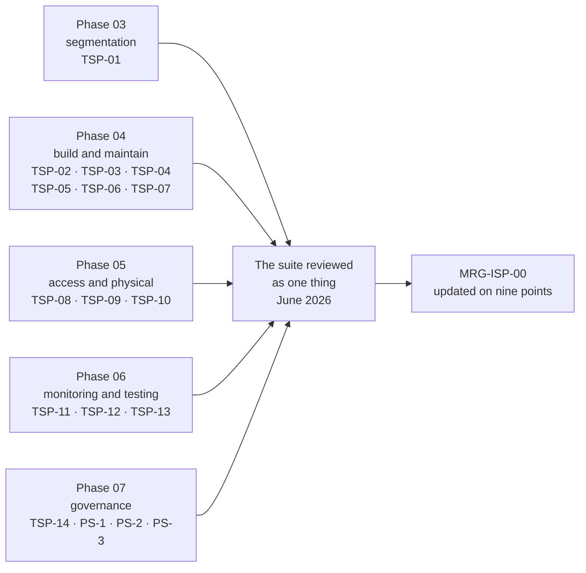

# 07.02 — Acceptable Use &amp; Topic-Specific Policies

| Field | Value |
|---|---|
| Document ID | MRG-PCI-2026-702 |
| Program | Marketa Retail Group — PCI DSS v4.0.1 Compliance Program |
| Phase | 07 — Security Policy, Risk &amp; Incident Response |
| Version | 1.0 |
| Status | Approved |
| Owner | Owen Castellanos, Payment Card Compliance Manager |
| Approver | Naomi Bhatt, Chief Information Security Officer |
| Date | 2026-07-15 |
| Classification | Confidential — Cardholder Data Environment // Illustrative Portfolio Sample |

## Purpose

Two subjects, joined because they are the same subject seen from two distances.

**Requirement 12.2.1** obliges acceptable use policies for end-user technologies to be **defined and implemented**, and it names three things they must include: **explicit approval by authorised parties**, **acceptable uses of the technology**, and **a list of products approved by the company for employee use**. It is a short sub-requirement that is failed more often than almost any other in Requirement 12, and it is failed in a specific way: the entity produces an acceptable use policy that describes behaviour and never produces the list.

**The topic-specific policy suite** is the wider frame. Every requirement from 1 to 12 carries an `x.1.1` sub-requirement obliging security policies and operational procedures to be documented, kept up to date, in use, and **known to all affected parties**, and an `x.1.2` sub-requirement obliging roles and responsibilities to be documented, assigned and understood. That is twenty-two sub-requirements — nearly 7% of the 306 — discharged by a policy suite rather than by a technical control, and an entity that treats them as paperwork discovers in fieldwork that they are tested by interview.

This document delivers Marketa's acceptable use policy under 12.2.1, the fourteen topic-specific policies mapped so a reader can see which policy discharges which requirement, the currency and ownership regime, and the measurement of the limb that cannot be evidenced by producing a file.

## 1. Acceptable Use — 12.2.1

### 1.1 The three named elements

| Element the requirement names | What it actually asks for | Marketa's discharge |
|---|---|---|
| **Explicit approval by authorised parties** | Use of an end-user technology is **approved**, by somebody with the authority to approve it, before it is used — not tolerated, not assumed | Six authorising roles, a named approval record per technology class, and a default-deny position for anything not on the approved list |
| **Acceptable uses of the technology** | What the technology may be used for, stated positively, and the uses that are prohibited | AUP §4, expressed per technology class rather than as a single generic paragraph |
| **A list of products approved by the company for employee use** | An actual list. Of products. Maintained | **EUT-01 to EUT-09** — nine approved product classes with named products and versions, reviewed quarterly, published alongside the AUP |

The third element is the one entities miss, and the reason is that it is the only one that requires ongoing maintenance rather than a paragraph. A policy saying "only approved software may be installed" without an accompanying list of what is approved **defines the rule and withholds the answer**, which in practice means the rule is either ignored or enforced by whoever happens to be asked. Marketa's list is published in the same location as the policy, carries a version identifier, and is reviewed quarterly by the Working Group.

### 1.2 The approved end-user technology list

| ID | Technology class | Approved products in the class | Authorising party | Notes and boundaries |
|---|---|---|---|---|
| **EUT-01** | Managed laptops and desktops | Two corporate hardware standards, one managed OS build per platform | Trevor Kim | Enrolment in management is a condition of network access. Unmanaged devices are denied by 802.1X, not by policy alone |
| **EUT-02** | Mobile devices | Corporate-issued handsets; enrolled personal devices restricted to mail, calendar and MFA | Trevor Kim | **No mobile device may hold a payment application or reach an assessed component** |
| **EUT-03** | Store back-office terminals | The store build image and the applications within it | Adaeze Nwosu | Any addition is a **SIG-10** significant change — a change to 482 networks executed once |
| **EUT-04** | Productivity and collaboration | The corporate suite, the ticketing platform, the LMS, the intranet | Curtis Lang | The messaging estate carries the **prohibition on transmitting PAN**, which is stricter than 4.2.2 requires and is described that way |
| **EUT-05** | Developer tooling | Named IDEs, source control clients, container and cloud CLIs | Sonia Rendell | Package and dependency sources are constrained separately under Requirement 6 |
| **EUT-06** | Administrative and remote access | The privileged access broker, the jump host clients, the approved VPN client | Trevor Kim | **3.4.2** technical controls preventing copy or relocation of PAN during remote access attach here |
| **EUT-07** | Removable electronic media | Two encrypted USB models, issued and registered | Marcus Hale | **5.3.3** anti-malware scanning on removable media attaches here. Unregistered media is blocked at the endpoint |
| **EUT-08** | Call-centre agent technology | The agent desktop image, the softphone, the pause-and-resume control | Bill Traynor | Agent desktops are **out of the CDE by design**; the technology list is what keeps them there |
| **EUT-09** | Browser extensions and add-ins | An allow-list of eleven; everything else denied | Trevor Kim | Added in 2026 after a marketing analyst's tag-manager publication reached six payment templates. **A browser extension is software installed by somebody who does not think of it as installing software** |

### 1.3 The acceptable use controls

| ID | Control | Requirement anchor | How it is enforced |
|---|---|---|---|
| **AUP-1** | **Explicit approval before use.** A technology class not on EUT-01 to EUT-09 is not approved, and use requires an approval record naming the approver and the business reason | 12.2.1 | Endpoint application control; 802.1X; the change record for any addition |
| **AUP-2** | **Stated acceptable uses per class**, positively expressed, with the prohibited uses named rather than implied | 12.2.1 | Policy text; the awareness module under **12.6.3.2** |
| **AUP-3** | **The approved product list is published with the policy** and reviewed quarterly | 12.2.1 | The EUT list, version-controlled, in the same location as the AUP |
| **AUP-4** | **Account data may not be created, stored or transmitted on an end-user technology**, in any channel, in any format | 3.2.1, 4.2.2, 12.10.7 | DLP telemetry; the PAN-pattern quarantine rule raised after **R-31**; discovery scanning |
| **AUP-5** | **Remote access carries the copy-and-relocation prevention control**, and remote sessions to assessed components run through the broker, never directly | **3.4.2**, 8.4.2 | Broker enforcement; clipboard and drive-mapping controls; session recording |
| **AUP-6** | **Removable media is registered, encrypted and scanned** | **5.3.3**, 9.4.1 | Endpoint media control; the scan-on-mount policy; the media register |
| **AUP-7** | **Personal use is permitted within bounds and the bounds are stated**, because a policy that pretends personal use does not happen is a policy nobody believes | 12.2.1 | Policy text; monitoring notice; the disciplinary route in MRG-ISP-00 |
| **AUP-8** | **Loss, theft or suspected compromise of an end-user technology is an incident**, reportable through the 12.10 route | 12.10.1, 12.10.5 | The incident route; 14 reported instances in the period, none reaching an assessed component |

AUP-7 is deliberate. Every acceptable use policy that prohibits all personal use is a policy that 34,000 people break before lunch, and the cost is not the personal use — it is that the document stops being credible, which makes AUP-4 and AUP-6 harder to enforce for no gain. **The bounds are stated so that the prohibitions that matter are read as real.**

### 1.4 What 12.2.1 does not reach

| Not covered by 12.2.1 | Where it sits instead |
|---|---|
| Technical enforcement of the approved list | Requirement 2 secure configuration and the endpoint application control; **12.2.1 asks for a policy that is defined *and implemented***, so the two are joined, but the enforcement evidence is Phase 04's |
| Acceptable use **training** | **12.6.3.2**, delivered in 07.04. The policy and the training are separate obligations and both are tested |
| Third-party personnel using their own technology | The 12.8.2 agreements and the responsibility matrices, delivered in Phase 06 |

## 2. The Topic-Specific Policy Suite

### 2.1 The map — which policy discharges which requirement

| Policy | Title | Discharges `x.1.1` for | Accountable owner | Operational procedures beneath it |
|---|---|---|---|---|
| **TSP-01** | Network Security Controls Policy | **1.1.1** | Trevor Kim | 6 |
| **TSP-02** | Secure Configuration Policy | **2.1.1** | Trevor Kim | 5 |
| **TSP-03** | Account Data Protection &amp; Retention Policy | **3.1.1** | Elena Marchetti | 7 |
| **TSP-04** | Cryptography &amp; Key Management Policy | **3.1.1** (3.5–3.7 limb), **4.1.1** | Trevor Kim | 6 |
| **TSP-05** | Malicious Software Protection Policy | **5.1.1** | Marcus Hale | 4 |
| **TSP-06** | Secure Software Development Policy | **6.1.1** | Sonia Rendell | 5 |
| **TSP-07** | Change Management Policy | **6.1.1** (6.5 limb) | Sonia Rendell | 4 |
| **TSP-08** | Access Control Policy | **7.1.1** | Elena Marchetti | 4 |
| **TSP-09** | Identity &amp; Authentication Policy | **8.1.1** | Trevor Kim | 5 |
| **TSP-10** | Physical Security &amp; Media Handling Policy | **9.1.1** | Adaeze Nwosu / Trevor Kim | 6 |
| **TSP-11** | Logging &amp; Monitoring Policy | **10.1.1** | Marcus Hale | 5 |
| **TSP-12** | Security Testing Policy | **11.1.1** | Marcus Hale | 4 |
| **TSP-13** | Third-Party Security Policy | **12.8.1** | Owen Castellanos | 3 |
| **TSP-14** | **Acceptable Use Policy** | **12.2.1** | Owen Castellanos | 2 |
| **PS-1** | Targeted Risk Analysis Standard | 12.3.1, 12.3.2 | Naomi Bhatt | — |
| **PS-2** | Security Awareness Standard | 12.6.1 | Owen Castellanos | — |
| **PS-3** | Personnel Screening Standard | 12.7.1 | Owen Castellanos | — |
| | **Total operational procedures** | | | **61** |

Two mapping decisions are worth stating rather than leaving for a reader to infer.

**TSP-04 spans two requirements and that is not a mapping error.** Cryptography appears in Requirement 3 for data at rest and Requirement 4 for data in transit, and splitting one cryptographic standard across two policies produces two documents that disagree about cipher suites within a year. One policy, two anchors, one annual review under **12.3.3**.

**Change management is TSP-07 rather than a section of TSP-06.** 6.5 is a distinct control family with its own significant-change definition — **SIG-1 to SIG-10** — that five other requirements depend on. Burying it inside a software development policy makes it invisible to the infrastructure and store-operations populations that trigger most of it.

### 2.2 The `x.1.2` limb — roles and responsibilities, assigned and understood

`x.1.2` is a separate obligation from `x.1.1` and is evidenced separately. It requires that the roles and responsibilities for performing the activities in each requirement are **documented, assigned and understood**.

| Requirement | Accountable owner | Delegated performers named in the policy | How "understood" is evidenced |
|---|---|---|---|
| 1 | Trevor Kim | Network engineering; cloud platform team | Interview at the annual review; the 1.2.7 six-monthly rule-set review record naming its performer |
| 2 | Trevor Kim | Server, network and cloud engineering | Baseline ownership per BL-WIN, BL-LNX, BL-NET, BL-AWS, BL-DB, BL-APP |
| 3 | Elena Marchetti | Payment operations; data engineering; Marcus Hale for discovery tooling | The quarterly 3.2.1 retention verification record with a named performer |
| 4 | Trevor Kim | Network engineering; Sonia Rendell for the e-commerce tier | The 4.2.1.1 certificate inventory owner |
| 5 | Marcus Hale | Endpoint team; DC and store operations for removable media | **TRA-5.2.3.1** and **TRA-5.3.2.1** owner records |
| 6 | Sonia Rendell | Application teams; Trevor Kim for patching | The 6.3.1 ranking model owner; the 27 change records naming approvers |
| 7 | Elena Marchetti | Identity team; system owners | The six-monthly 7.2.4 review with manager sign-off |
| 8 | Trevor Kim | Identity team; application owners for system accounts | **TRA-8.6.3**; the account-class register |
| 9 | Adaeze Nwosu / Trevor Kim | Store managers; facilities; Halberd Data Destruction | 1,914 per-terminal inspection records naming the inspector |
| 10 | Marcus Hale | SOC; Northbridge Managed Services out of hours | **365 daily review records** with a named reviewer; the signed responsibility matrix |
| 11 | Marcus Hale / Sonia Rendell | Sable Ridge Scanning Services; Ironwood Security Labs | **TEST-P1 to TEST-P6** across six executing organisations |
| 12 | Naomi Bhatt | Owen Castellanos; Frank Mueller; Bill Traynor; Adaeze Nwosu | This phase's document set; the acknowledgement records |

Phase 06 evidenced the "understood" limb for Requirement 10 by interviewing four teams rather than by producing the procedure, and recorded the result. **That is the correct method and it is the method an assessor will use**, because the limb is a property of people and not of files. §6 records the 2026 results across the whole suite.

## 3. Currency and Ownership

A policy suite fails in three ways, and only one of them is visible from the document itself.

| Failure mode | What it looks like | Marketa's control |
|---|---|---|
| **Stale** | The policy describes a control that was replaced eighteen months ago | Every policy carries a review date and an owner; a policy past its review date is reported to the Working Group weekly and to the Steering Committee monthly until it is closed |
| **Orphaned** | The named owner has left, changed role, or never agreed to be the owner | Ownership is reconciled against the directory monthly; the calendar's five-business-day ownership-change rule applies |
| **Unknown** | The policy is current, correct, owned — and the people who have to follow it have never read it | The `x.1.2` interview limb in §6; the findability testing in 07.01 §3.3; the 12.6.3 module |

| Element | Position |
|---|---|
| Version control | Every document carries a version identifier, an effective date, an owner, an approver and a review date. **A change to a policy raises a new version; it does not edit the current one in place** |
| Review cadence | Overarching policy **at least every 12 months** under 12.1.2; topic-specific policies at least every 12 months and on significant change; the EUT list quarterly |
| Change triggers | A **SIG-1 to SIG-10** significant change; a penetration test or audit finding; an incident; a targeted risk analysis review; a requirement interpretation change; a provider change |
| Approval | Overarching policy — CEO. Topic-specific — CISO with the requirement owner. Procedures — the requirement owner |
| Currency at 2026-07-15 | **17 of 17** policies and standards within their review date; **61 of 61** procedures confirmed current at the annual review |
| Exceptions | Named approver, expiry date, compensating measure. **An exception without an expiry is invalid on its face** — the 2026 policy amendment #4 |

## 4. Where Each Policy Was Actually Built

The suite is not a Phase 07 artefact pretending to have existed all year. Each policy was written in the phase that built the control it describes, and Phase 07 is where the suite is consolidated, reconciled and reviewed as a whole for the first time.

The consolidation found four inconsistencies between policies written months apart, which is the point of reviewing a suite rather than a document:

| # | Inconsistency | Resolution |
|---|---|---|
| 1 | TSP-02 and TSP-09 gave different definitions of "sensitive area" | TSP-09's definition adopted; TSP-02 now delegates rather than restating |
| 2 | TSP-05 described anti-malware coverage using the **v3.2.1** "systems commonly affected" framing | Rewritten to v4.0.1's inverted default — coverage everywhere except where a **5.2.3** evaluation excuses it |
| 3 | TSP-03 and TSP-11 both claimed ownership of the quarterly 3.2.1 retention verification | Assigned to Elena Marchetti in TSP-03; TSP-11 now references it |
| 4 | TSP-06 still referenced **6.4.1** as a live option | Corrected to **6.4.2**, which has been the sole route since 2025-03-31. Recorded as *superseded*, **not** as a Not Applicable entry |

Inconsistency 2 is the most consequential and the least visible. A policy that starts from "systems commonly affected by malicious software" inverts the v4.0.1 default and would have produced a coverage argument the assessor rejects — and it would have done so quietly, because the policy reads perfectly well.

## 5. Requirement Coverage

| Sub-req | Position | Evidence |
|---|---|---|
| **12.2.1** | **Met** — acceptable use policy defined and implemented, with explicit approval by six named authorising parties, acceptable uses stated per technology class, and **the approved product list published as EUT-01 to EUT-09** and reviewed quarterly | TSP-14; the EUT list with version history; four quarterly review records; the endpoint application control configuration |
| **1.1.1 to 12.1.1** — the `x.1.1` limb | **Met** — 14 topic-specific policies and 3 programme standards, all within their review date, mapped in §2.1 | The policy suite; the version register; the June 2026 consolidated review |
| **1.1.2 to 12.1.2** — the `x.1.2` limb | **Met** — roles documented, assigned to named individuals, and the understanding limb evidenced by interview rather than asserted | §2.2; the interview records in §6; 01.07 §2 |
| **12.6.1** | Delivered in **07.04** — the awareness programme that makes personnel aware of this suite | 07.04 |
| **12.8.x** | Delivered in **Phase 06** — TSP-13 is the policy; the six providers, agreements and matrices are 06.10 | 06.10 |

## 6. The Limb That Cannot Be Evidenced by Producing a File

`x.1.2` requires roles to be **understood**. Marketa tested it the only way it can be tested, across seven teams, unannounced, in the week of 2026-06-15.

| Team | Question asked | Result |
|---|---|---|
| Network engineering | Who is accountable if the six-monthly 1.2.7 review does not happen, and what do you do if you cannot complete it in the window? | **Answered correctly by 5 of 5** |
| Store operations — 12 store managers | What do you do if a terminal's seal looks wrong, and who do you tell before you touch it? | **11 of 12.** The twelfth described the correct escalation but would have removed the device first. Procedure re-briefed across the region |
| Payment operations | Who approves an exception to the retention rule, and what must the exception carry? | **4 of 4** |
| E-commerce engineering | What happens if a script appears on a payment template that is not in the inventory? | **6 of 6** |
| Security operations | Who is accountable for the daily log review on a day you are not working? | **5 of 5**, including the Northbridge handover |
| Call centre | What do you do if a customer reads a card number aloud despite the masking? | **7 of 9.** Two described deleting the recording, which is the wrong answer — **the correct route is the 12.10.7 procedure**, and the module was amended |
| Identity team | Who approves a new application account, and what makes it different from a user account? | **4 of 4** |

**Forty-two of forty-six answered correctly.** The four who did not are the useful part of the result, and two of them — the store manager who would have removed the device, and the two agents who would have deleted the recording — were both about to destroy the evidence of an incident while following an instinct that looks like diligence. Both produced procedure amendments. Neither would have been visible from reading the policy.

## 7. What This Document Does Not Claim

| Limitation | Statement |
|---|---|
| **A complete suite is not an effective suite** | Seventeen documents within their review date is a maintenance result. §6 is the only section that measures whether any of it reached anybody, and it sampled 46 people |
| **The EUT list is a snapshot** | It is reviewed quarterly and the estate changes daily. **EUT-09 exists because a class of software nobody thought of as software was installed by somebody who did not think of it as installing** |
| **Policy did not prevent this year's findings** | The unauthenticated administrative interface, the vendor script change and the hotfix without a manifest were all covered by current, correct, owned policies. **Policy sets the obligation; it does not perform the control** |
| **The consolidated review happened once** | Four inconsistencies were found in a suite written across five phases. A second consolidation next year will find more, and a year in which it finds none should be treated as a failure of the review rather than a success of the suite |

## Cross-References

| Reference | Relevance |
|---|---|
| 01.07 — Roles, Responsibilities &amp; RACI | The twelve accountable owners underlying the `x.1.2` map |
| 01.11 — Compliance Calendar &amp; Obligations | The periodic obligations the 61 procedures execute |
| 04.06 — Vulnerability Management | 6.3.3 patch bands, the elective analysis formalised in 07.03 |
| 04.08 — Change Control | **SIG-1 to SIG-10**, the definition TSP-07 carries |
| 04.10 — Payment Page Script Management | 6.4.3; the inventory obligation TSP-06 and TSP-07 both reference |
| 05.10 — Media Handling &amp; Destruction | The removable media regime behind AUP-6 and EUT-07 |
| 06.10 — Third-Party Service Provider Management | **12.8, delivered there.** TSP-13 is the policy; the providers, agreements and matrices are not re-delivered here |
| **07.01 — Information Security Policy** | MRG-ISP-00, the overarching policy this suite sits beneath |
| **07.04 — Security Awareness Programme** | **12.6.3.2** — awareness of the acceptable use of end-user technologies |
| Phase 08 — QSA Assessment &amp; ROC Production | The `x.1.1` and `x.1.2` sub-requirements tested by document review **and** interview |

---
[⬅ Previous](07.01-information-security-policy.md) · [🏠 Phase 07 Home](07.00-README.md) · [Next ➡](07.03-targeted-risk-analyses-consolidated.md)
