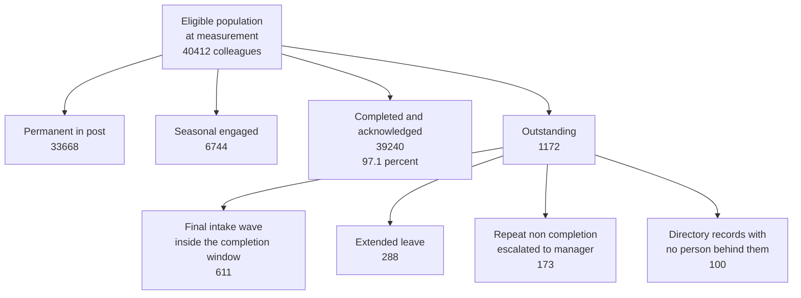

# 07.04 — Security Awareness Programme

| Field | Value |
|---|---|
| Document ID | MRG-PCI-2026-704 |
| Program | Marketa Retail Group — PCI DSS v4.0.1 Compliance Program |
| Phase | 07 — Security Policy, Risk &amp; Incident Response |
| Version | 1.0 |
| Status | Approved |
| Owner | Owen Castellanos, Payment Card Compliance Manager |
| Approver | Naomi Bhatt, Chief Information Security Officer |
| Date | 2026-07-15 |
| Classification | Confidential — Cardholder Data Environment // Illustrative Portfolio Sample |

## Purpose

Requirement 12.6 is five sub-requirements and one number that everybody quotes.

The number is **97.1%** — Marketa's 12.6.3 completion figure, against a charter bar of **≥95%**, across a population of roughly 34,000 colleagues plus a seasonal intake of up to 6,800. It is a good number, it was hard to achieve in a retail estate of 482 stores, and **it establishes considerably less than it appears to.** §7 of this document is about that gap, and it is the section the programme considers most important.

Before it, the programme: a formal awareness programme under **12.6.1**, reviewed annually under **12.6.2**, delivered on hire and at least every twelve months through multiple methods of communication under **12.6.3**, covering the threats that could affect the security of account data — **including phishing and related attacks and social engineering** under **12.6.3.1** — and the acceptable use of end-user technologies under **12.6.3.2**.

**12.6.2 has no service-provider variant.** Unlike 12.4, 12.5.2 and 11.4.5, every sub-requirement in 12.6 applies to Marketa exactly as written, and none of them is among the requirements that were never in the 306.

## 1. The Population, and Why It Is the Design Constraint

| Population | Size | Delivery conditions | Completion route |
|---|---|---|---|
| Corporate — Columbus and Austin | ≈ 2,300 | Assigned workstation, individual mailbox | LMS, at the desk |
| Distribution centres — 4 sites | ≈ 2,100 | Shared terminals; shift-based | LMS kiosk at shift start, in paid time |
| **Store colleagues — 482 stores** | **≈ 29,600** | **Shared back-office terminal; no individual mailbox for most; no desk time in the shift pattern** | LMS on the back-office terminal, **rostered as paid time**, with the store manager accountable for the roster |
| **Seasonal colleagues** | **up to 6,800**, engaged Oct–Jan | Arrive in waves, inside the change freeze, at peak trading | **First shift, unabridged, in paid time — SEA-5** |
| Contractors and agency personnel | Variable | Engaged through a supplier | The same module where a Marketa identity exists; the contractual annex where it does not |

Roughly **87% of the population works in a store**, and the awareness programme's entire architecture follows from that one fact. A programme designed for corporate colleagues reaches 5,000 people well and 35,000 people not at all, and it produces a completion figure in the low sixties that nobody can move because the mechanism never reached the population.

Two constraints compound it:

**The freeze and the intake coincide.** The 6,800 seasonal colleagues arrive between October and January — the same window as peak trading, the Q4 POI inspection cycle and the QSA fieldwork. Nothing new can be built during it. Whatever the awareness programme is going to be in December has to exist and work by **30 September**.

**The seasonal cohort is the population most likely to meet the threat and least equipped to refuse it.** 05.09 measured it directly: **both failed unannounced repair-personnel verification tests occurred where the shift lead had joined within five weeks.** A colleague six weeks into their first retail job, at peak trading, faced with an adult in a high-visibility jacket who says they have come to service the terminal, is the exact scenario 12.6.3.1 exists for.

## 2. The Programme — 12.6.1

| ID | Component | Audience | Length | Cadence | Requirement anchor |
|---|---|---|---|---|---|
| **AW-1** | **Core security awareness module** — the policy, account data, acceptable use, incident reporting, phishing and social engineering | **All personnel** | 31 minutes | On hire and at least annually | 12.6.1, 12.6.3, 12.6.3.1, 12.6.3.2 |
| **AW-2** | **POI device awareness** — tamper and substitution recognition, repair-personnel verification, what to do and what **not** to do | All store and DC colleagues who handle or work near a terminal | 14 minutes | On hire and at least annually | **9.5.1.3**, 12.6.3.1 |
| **AW-3** | **Role-based modules** — nine variants for the T3 in-scope population, keyed to the catalogue role | ≈ 640 | 20–45 minutes | On role assignment and annually | 12.6.1, 12.1.3 |
| **AW-4** | **Secure development** — for the application and platform population | ≈ 180 | 3 hours | Annually | 6.2.2, referenced from Phase 04 |
| **AW-5** | **Incident recognition and reporting** — what an incident looks like from a store, a call desk and a keyboard | All personnel, embedded in AW-1; extended for the response roster | Embedded / 2 hours extended | Annually; **semi-annually for the core response team under TRA-09** | 12.10.4, 12.10.4.1 |
| **AW-6** | **Continuous communications** — the non-module layer described in §3 | All personnel | Continuous | Continuous | 12.6.3, "multiple methods of communication" |

**AW-1 is unabridged for seasonal colleagues, and that was contested.** The proposal put to the Steering Committee in May 2026 was a shortened module for the seasonal cohort; 6,800 people times 31 minutes is roughly 3,500 hours of paid time in the tightest labour quarter of the year, spent on colleagues who will be gone by February. It was refused and recorded as **ADR-0019**, on one ground: **an abridged module trains the least-experienced people the least, in the quarter when the devices are least watched.** The cost was accepted by name, at the committee that owns the trading calendar.

## 3. Multiple Methods of Communication — 12.6.3

12.6.3 obliges the programme to use **multiple methods** of communication. It is easy to satisfy badly — an e-learning module plus an email is technically two methods and functionally one, because both arrive through a screen the store population does not sit in front of.

| Method | Population it actually reaches | What it carries | Frequency |
|---|---|---|---|
| **LMS module** | Everyone with an identity | AW-1 to AW-5; the knowledge checks; **the 12.1.3 acknowledgement** | On hire, annually, on version change |
| **Store huddle cards** | Store colleagues, at shift start | One topic per fortnight, in the store manager's own briefing | Fortnightly |
| **Break-room digital signage and printed posters** | Store and DC colleagues | Rotating threat topics; the incident reporting number; the "verify before you let them touch it" message | Continuous, refreshed monthly |
| **Payslip insert** | Everyone paid | Twice a year, timed to the seasonal intake and the annual completion push | Twice yearly |
| **Intranet and email** | Corporate and DC | Threat notices; policy version changes; targeted campaigns | As required |
| **Targeted role briefings** | T3 in-scope roles | Live sessions on specific control obligations, run by the requirement owner | Quarterly |
| **The printed policy pack** | 486 physical locations | The policy itself, the reporting route and the acceptable use summary | On every version change |

The huddle card is the method that moves the store estate, and it works for a reason that has nothing to do with content: **it is delivered by the store manager in the shift briefing that already happens**, rather than requiring a colleague to go somewhere and do something. A method that requires an additional act from a person mid-shift in December is a method that reaches the compliant and misses everybody else.

## 4. Content — 12.6.3.1 and 12.6.3.2

### 4.1 Threats and vulnerabilities that could affect the security of account data — 12.6.3.1

The requirement names **phishing and related attacks** and **social engineering** explicitly. Marketa's module covers both and then covers the four threats that are specific to a retailer, because a generic module about suspicious email attachments does not describe this estate's threat surface.

| Threat covered | Why it is in Marketa's module rather than a generic one | Evidence it belongs |
|---|---|---|
| **Phishing and credential harvesting** | Named by the requirement. **R-21** is the register entry | Two MFA-fatigue attempts denied by number matching in June; 41 breach-corpus rejections at password set; 7 force-resets |
| **Social engineering by pretext, in person** | Named by the requirement, and in a retailer it is a physical attack | **Two of nine unannounced repair-personnel verification tests failed**, both where the shift lead had joined within five weeks |
| **POI tamper and substitution** | 1,914 terminals in 482 buildings unattended overnight, carrying 74% of transactions | **Six seal discrepancies in Q3**, all cleared as maintenance and all found because somebody looked |
| **Spoken account data on a call** | 310 agents, DTMF masking, and a customer who reads the number aloud anyway | **11,400 recordings** with audible PAN found in the archive — **R-31** |
| **Account data created as a by-product** | A scanned dispute document, an emailed spreadsheet, a debug log | **2,187 scanned documents; a store manager's spreadsheet of 34 records** |
| **Payment-page and script risk** | A marketing colleague adding a tag is making a change to a payment page | **3 of 38 scripts unauthorised at first inventory**; a pixel published to six templates without a change record |

The last row is the one most awareness programmes never contain, because the population that needs it does not think of itself as touching payments. **A marketing analyst publishing an analytics tag is not doing something reckless; they are doing their job with a tool they were given.** The module names the payment templates by their business names so the person recognises them, and the control that actually prevents it — removing the publication capability from the console — is in Phase 04, because awareness was never going to be the control here.

### 4.2 Acceptable use of end-user technologies — 12.6.3.2

| Covered | How |
|---|---|
| What is on the approved product list and what to do when something is not | **EUT-01 to EUT-09** shown in the module as the actual list, not as a reference to a policy |
| Removable media — registration, encryption, the scan-on-mount | AW-1 plus a role-based extension for the DC and store populations |
| Remote access and the prohibition on relocating account data during a session | AW-3, for the population that has remote access at all |
| Personal use, and where its boundary is | Stated positively, because a rule 34,000 people break daily makes the rules next to it unbelievable |
| Reporting a lost or stolen device as an **incident**, not as an IT ticket | AW-1 and AW-5. **14 devices reported in the period; none reached an assessed component** |

## 5. Annual Review of the Programme — 12.6.2

12.6.2 obliges the awareness programme to be **reviewed at least once every 12 months and updated as needed** to address new threats and vulnerabilities that may impact the security of account data, and to communicate to personnel about their role in protecting account data.

| Attribute | 2026 review |
|---|---|
| Performed | 2026-06-15, by Owen Castellanos with Adaeze Nwosu, Bill Traynor and Marcus Hale |
| Inputs | The 44-entry risk register; the four unexpected-PAN findings; the 19 penetration test findings; the two failed repair-personnel verification tests; the Q3 seal discrepancies; Internal Audit's recommendations; the incident population |
| Approved by | Naomi Bhatt, CISO |
| Changes made | **Seven** |

| # | Change to the programme | Driven by |
|---|---|---|
| 1 | Repair-personnel verification moved from a paragraph in AW-2 to a **scripted, practised sequence** with a card at the terminal | The two failed verification tests |
| 2 | The call-centre content corrected: a recording containing spoken PAN is a **12.10.7 report**, not something to delete | The `x.1.2` interview in 07.02 §6, where two of nine agents described deleting it |
| 3 | Payment-page and tag content added for the marketing and merchandising population, naming templates by their business names | The pixel published to six payment templates without a change record |
| 4 | A store-manager extension covering what to do **before** touching a suspected tampered device | The store manager who described the correct escalation and would have removed the device first |
| 5 | The seasonal module's delivery moved from "within the first week" to **the first shift** | The 2025–26 seasonal cohort's **93.8%** completion, below the charter bar |
| 6 | Knowledge checks rewritten so they cannot be passed by elimination | A first-pass rate that was implausibly high on four questions |
| 7 | Incident reporting route simplified to one number and one intranet button, on every method in §3 | Reporting volume, which §7.3 treats as the programme's best outcome signal |

Change 4 is the clearest illustration of what 12.6.2 is for. Nothing about the threat changed; **Marketa's understanding of how its own people would respond to it changed**, because it tested and found out. A review that only ingests external threat intelligence misses that entirely.

## 6. Completion — the Number

| Measure | Value |
|---|---|
| Eligible population at measurement | **40,412** — 33,668 permanent colleagues in post, plus 6,744 seasonal colleagues engaged |
| Completed AW-1 **and** acknowledged the policy | **39,240** |
| **Completion** | **97.1%** |
| Charter bar | **≥ 95%** |
| Store population completion | 96.8% |
| Corporate and DC completion | 99.4% |
| **Seasonal cohort completion** | **96.2%** — against **93.8%** for the 2025–26 cohort under the previous design |
| AW-2 POI module, store population | 98.1% |
| AW-3 role-based modules, T3 population | **640 of 640 — 100%.** A T3 role is not granted until the module is complete |
| Median time in AW-1 | **34 minutes** against a designed 31 |
| Knowledge-check first-pass rate | **84.2%**; 6,388 colleagues took more than one attempt |

### 6.1 The denominator, stated because it is where these figures are usually manipulated

**Marketa counts the final seasonal intake wave in the denominator even though those colleagues are still inside their completion window.** Six hundred and eleven people who are not yet late are counted as not yet complete, and they cost roughly 1.5 percentage points. Excluding them would produce **98.6%**, and every reasonable definition of the eligible population would support it.

The programme reports 97.1% because a denominator adjusted to flatter the numerator is the single most common way an awareness figure lies, and because the alternative convention would have hidden the 2025–26 season's real problem: a cohort that arrives in waves and is measured after it leaves looks compliant no matter what happens.

The other three outstanding groups are reported rather than netted off. **The hundred directory records with no person behind them are a data-quality finding**, referred to the identity team, and they are exactly the population 05.11 §2 found last year in a different form — 1,118 accounts still enabled thirty days after their holder's last worked shift.

## 7. What a Completion Percentage Does and Does Not Tell You

This is the section that matters.

### 7.1 What 97.1% establishes

| Establishes | Because |
|---|---|
| That a defined module was **assigned** to a defined population and a completion transaction was recorded against 39,240 identities | The LMS record carries a person, a version, a timestamp and a result |
| That the **delivery mechanism reaches the store estate**, which is the hard part | 96.8% of 29,600 colleagues without desks completed a 31-minute module in paid time |
| That **12.6.3's cadence limb is satisfied** — on hire and at least once every twelve months | Per-person dates against joiner dates |
| That the **12.1.3 acknowledgement** was collected from the same population | The acknowledgement is the module's final step |

### 7.2 What it does not establish

| Does not establish | Why not |
|---|---|
| **That anybody learned anything** | Completion is a transaction. The 84.2% first-pass knowledge-check rate is a better signal and it is still a signal about a multiple-choice question, not about behaviour under pressure at 19:00 in December |
| **That the trained population would resist the attack** | Marketa ran **no phishing simulation programme in 2026.** It can report that 97.1% of colleagues completed training covering phishing; **it cannot report what proportion would click.** That gap is one of the thirteen untested-surface rows published under **ADR-0025**, and **OI-06-07** proposes the programme for 2027 |
| **That completion means engagement** | A 34-minute median against a 31-minute design says the population did not uniformly click through, and it says nothing about the tail. **341 POI inspection records were submitted in under 25 seconds** in the year — those colleagues had all completed AW-2 |
| **That the human findings would have been prevented** | Three of the year's findings involved people doing exactly what they were asked to do: three unauthorised wireless access points **all installed by people solving an ordinary problem**; a marketing analyst publishing a pixel with a tool they were given; a contractor's equipment left connected. **The remediations were a procurement standard, an equipment reconciliation and the removal of a console capability. None of them was a training module** |
| **That the 2.9% is the risk** | The 1,172 outstanding are mostly not-yet-due and on leave. **The risk is distributed across the 97.1%**, and a completion figure cannot locate it |

### 7.3 The outcome signals Marketa reports alongside it

Because completion is an input measure, the programme reports three output measures next to it. None is a substitute; together they are the only evidence that the programme changed anything.

| Signal | 2025 | 2026 | Interpretation |
|---|---|---|---|
| **Incident reports raised by store colleagues** | 118 | **402** | The clearest positive signal in the programme. More reports is the goal; a quiet reporting channel is a broken one, not a safe estate |
| **False-positive rate on those reports** | 71% | **79%** | Rose, and that is **accepted deliberately.** Driving it down means teaching people to filter, and a store colleague who filters is a store colleague who does not report the one that mattered |
| **Reports concerning a POI device** | 4 | **27** | Twenty-seven reports, all resolved as benign — packaging, a cable, a legitimate engineer without a scheduled visit. **The value is the twenty-seven, not the zero findings** |
| **Repair-personnel verification tests passed** | not run | **7 of 9** | The two failures are the programme's most useful result and drove change 1 in §5 |

**The honest summary is one sentence.** Marketa can demonstrate that its awareness programme reached almost everybody, that it is current, that it covers what the requirement names, and that reporting behaviour changed measurably in the direction it was supposed to. It cannot demonstrate that a trained colleague resists an attack, because it did not test that, and it says so rather than letting 97.1% imply it.

## 8. Requirement Coverage

| Sub-req | Position | Evidence |
|---|---|---|
| **12.6.1** | **Met** — a formal programme, **AW-1 to AW-6**, making all personnel aware of the information security policy and procedures and of their role in protecting account data | PS-2; the module set; the assignment records |
| **12.6.2** | **Met** — reviewed 2026-06-15 with seven changes, four of them driven by Marketa's own tested findings rather than by external threat intelligence | The review record; the change list in §5 |
| **12.6.3** | **Met** — on hire and at least every 12 months, **seven methods of communication**, and personnel acknowledging at least annually that they have read and understood the policy and procedures. **97.1%** | Per-person, per-version completion and acknowledgement records; the denominator statement in §6.1 |
| **12.6.3.1** | **Met** — phishing and related attacks and social engineering covered explicitly, plus four estate-specific threats | The module content; the AW-2 extension; §4.1 |
| **12.6.3.2** | **Met** — acceptable use of end-user technologies covered, with the approved product list shown as a list | The module content; **EUT-01 to EUT-09** |
| **9.5.1.3** | **Met** — POI personnel training on hire and at least annually, embedded in seasonal onboarding under **SEA-5** | AW-2; store training records; 98.1% |
| **12.10.4, 12.10.4.1** | Delivered in the **second half of this phase**; the training frequency is set by **TRA-09** | 07.03 §2; 07.08 |

## 9. What This Document Does Not Claim

| Limitation | Statement |
|---|---|
| **The programme is one year old in this form** | The seasonal design has run for one season. The 96.2% seasonal figure is one data point against the previous season's 93.8% |
| **No susceptibility measurement exists** | Without a phishing simulation programme there is no baseline click rate, no trend and no way to know whether the phishing content works. **OI-06-07** carries it into 2027 and it is published as untested surface rather than left as an implication |
| **Awareness is necessary and it is not the control** | Every significant finding of the year was closed by a technical or procedural change, not by a training module. Where a module was amended it was amended **in addition**, never instead |
| **Sampling bounds the outcome signals** | Nine repair-personnel verification tests across 482 stores is a small sample. It found two failures, which is informative; it is not a rate |
| **Completion is a lagging measure of the wrong thing** | It measures the programme's reach. §7.3 measures its effect, imperfectly, and the programme reports both rather than the flattering one |

## Cross-References

| Reference | Relevance |
|---|---|
| 01.06 — Program Charter &amp; Objectives | The **≥95%** completion bar and the reason CON-09 states it exists |
| 01.11 §5 — Compliance Calendar &amp; Obligations | 12.6.2, 12.6.3, 12.6.3.1 and 12.6.3.2 as annual obligations |
| 02.03 — Unexpected PAN Locations &amp; Response | The four findings behind the account-data content in §4.1 |
| 03.11 — Risk Register | **R-40** awareness completion during seasonal onboarding; **R-21** phishing; **R-02** POI tampering |
| 05.09 — POI Device Protection | 9.5.1.3; the two failed repair-personnel verification tests; the 341 fast submissions |
| **05.11 — Seasonal Workforce Access** | **SEA-5** and **ADR-0019**, the refusal of an abridged module; the 2025–26 cohort's 93.8% |
| 06.07 — Wireless &amp; Intrusion Detection | The three unauthorised access points **installed by people solving an ordinary problem** |
| 06.11 — Security Testing Programme | **ADR-0025** and the untested-surface row covering phishing susceptibility |
| **07.01 — Information Security Policy** | 12.1.3, and the decision to fuse the acknowledgement to this module |
| **07.02 — Acceptable Use &amp; Topic-Specific Policies** | The EUT list and the acceptable use content behind 12.6.3.2 |
| **07.05 — Personnel Screening &amp; Roles** | The T3 population that carries AW-3, and the screening that precedes it |
| **07.08 — Incident Response Plan** *(second half of this phase)* | **12.10.4** response-team training at the **TRA-09** frequency |

---
[⬅ Previous](07.03-targeted-risk-analyses-consolidated.md) · [🏠 Phase 07 Home](07.00-README.md) · [Next ➡](07.05-personnel-screening-and-roles.md)
