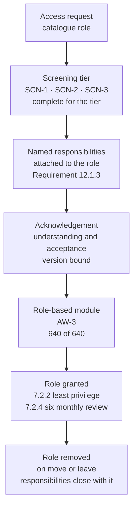

# 07.05 — Personnel Screening &amp; Roles

| Field | Value |
|---|---|
| Document ID | MRG-PCI-2026-705 |
| Program | Marketa Retail Group — PCI DSS v4.0.1 Compliance Program |
| Phase | 07 — Security Policy, Risk &amp; Incident Response |
| Version | 1.0 |
| Status | Approved |
| Owner | Owen Castellanos, Payment Card Compliance Manager |
| Approver | Naomi Bhatt, Chief Information Security Officer |
| Date | 2026-07-15 |
| Classification | Confidential — Cardholder Data Environment // Illustrative Portfolio Sample |

## Purpose

Two subjects that only make sense together.

**12.1.3** obliges the security policy to clearly define information security roles and responsibilities for all personnel. 07.01 established the definition; this document is the definition **in practice** — the role catalogue, the named responsibilities attached to it, and how a role grant and a responsibility acknowledgement are joined so that neither can happen without the other.

**12.7.1** obliges that potential personnel who will have access to the cardholder data environment are **screened, within the constraints of local law, prior to hire, to minimise the risk of attacks from internal sources.** It is one sentence and it contains three qualifiers that do most of the work: *who will have access to the CDE*, *within the constraints of local law*, and *prior to hire*.

Each qualifier bounds the requirement, and each bound is where an honest programme has something to say. The first defines a population much smaller than "everybody". The second means the screening is not uniform across **38 states**. The third means the control is a photograph — and Marketa's cardholder data environment is operated by people whose median tenure is measured in years, most of whom were photographed a long time ago.

**12.7.1 is a merchant requirement.** It applies to Marketa exactly as written and is within the 306.

## 1. The Population 12.7.1 Actually Reaches

The requirement attaches to personnel **who will have access to the cardholder data environment**. It does not attach to the whole workforce, and an entity that applies it to the whole workforce has usually stopped being able to evidence it for the population that matters.

| Population | Size | Does 12.7.1 attach? | Marketa's screening tier |
|---|---|---|---|
| **Direct access to a CDE component** — the 8 CDE systems | **96** individuals | **Yes** | **SCN-3 — enhanced** |
| **Administrative access to a connected-to or security-impacting component** — the 63 | 178 individuals, overlapping the 96 | Not by the requirement's literal wording; **Marketa applies it** | **SCN-3 — enhanced** |
| **Wider T3 in-scope role-holders** — anyone with a catalogue role or a named periodic obligation | **640** total, inclusive of the above | No | **SCN-2 — standard** |
| Permanent colleagues with no in-scope role | ≈ 33,000 | No | **SCN-1 — baseline** |
| **Seasonal colleagues** | up to **6,800** | **No — zero seasonal colleagues hold any in-scope access, by design under SEA-6** | **SCN-1 — baseline**, applied voluntarily |
| Contractors and agency personnel with in-scope access | **214** across 11 suppliers | Yes, and it is discharged **contractually** — §4 | **SCN-3 equivalent, attested** |

Of the ninety-six, **fourteen can see a full primary account number and nine of them must** — the population 06.12 §5 records under R-12. Those fourteen carry individually named responsibilities rather than role-generic ones, and they are the sample an assessor will ask for by name.

**Marketa screens the connected-to administrative population at the enhanced tier even though 12.7.1's wording does not compel it.** The reason is the same one that made the administrative-services zone a High risk in the register: an administrator of the identity provider, the privileged access broker or the patching service has a path to the cardholder data environment that does not require them to have access to it. Screening the CDE population and not that one satisfies the sentence and misses the risk.

## 2. The Three Screening Tiers

| Tier | Applied to | Components | Performed |
|---|---|---|---|
| **SCN-1 — baseline** | All personnel, including the seasonal intake | Identity verification; right to work; employment eligibility; reference contact for the most recent employer | Prior to first shift |
| **SCN-2 — standard** | T3 in-scope role-holders without CDE or administrative access | SCN-1, plus employment history verification across the preceding seven years and verification of any credential the role requires | Prior to hire, or prior to role grant for an internal move |
| **SCN-3 — enhanced** | The 96 with CDE access and the 178 with in-scope administrative access | SCN-2, plus criminal history screening **where permitted and where job-related**, sanctions and debarment screening, and — for a defined subset of finance-facing roles only — a consumer report **where permitted and role-justified** | **Prior to hire**, or prior to role grant; re-run on promotion into the population |

Two design points sit behind that table.

**The tier attaches to the role, not to the department.** An internal move into a CDE role triggers SCN-3 before the role is granted, exactly as an external hire does. This is not what 12.7.1 says — the requirement says *prior to hire* — and Marketa applies it anyway, because an organisation that screens external candidates rigorously and moves people internally without a check has built a queue rather than a control.

**No tier includes anything not defensibly related to the role.** The screening standard PS-3 requires each element to carry a stated job-relatedness rationale, reviewed by the General Counsel. An element that cannot state why the role needs it is removed, and two were removed in the 2026 review.

## 3. "Within the Constraints of Local Law" — 38 States

This phrase is the reason 12.7.1 cannot be discharged with a single national process, and it is also the phrase most often used to explain away a screening programme that was never designed.

Marketa operates in **38 states**, and the jurisdictions differ on what may be asked, when it may be asked, how far back an inquiry may reach, what must be disclosed to the candidate, and what process must follow an adverse finding. Some jurisdictions restrict when criminal history may be raised in a hiring process at all; some limit the lookback period; some restrict consumer reports except for defined role types; some impose their own notice and individualised-assessment obligations on top of the federal consumer-reporting framework. Marketa does not attempt a summary of any of it in this document, and nothing here is legal advice.

| Element | Position |
|---|---|
| Who owns the boundary | **Frank Mueller, General Counsel**, with external employment counsel. **Not** the security function and **not** the compliance programme |
| How it is operationalised | A **jurisdiction matrix** maintained by counsel, keyed to work location and role, that determines which SCN-3 elements are performed and in what sequence |
| Review cadence | At least annually, and on any change counsel identifies |
| Changes in the 2026 review | Sequencing changed for four jurisdictions; two elements removed nationally as insufficiently job-related; the individualised-assessment step made mandatory everywhere rather than only where required |
| What happens where an element cannot be performed | **The element is not performed and the omission is recorded against the individual's screening record with its reason.** The role grant then requires a documented compensating judgement by the hiring executive and the CISO |
| **What Marketa does not do** | Treat "within the constraints of local law" as a general excuse. **A constraint is a specific element in a specific jurisdiction, recorded per individual**, not a blanket statement in a policy |

That last row is the one an assessor should test, and it is worth being explicit about why. **"We screen within the constraints of local law" is a sentence that satisfies 12.7.1's wording and can conceal a programme that screens almost nobody.** The evidence that Marketa's is real is per-individual: for each of the 96, the record shows which elements were performed, which were not, and — where one was not — which constraint applied and who made the compensating judgement.

In 2026, **7 of the 96 records carry at least one omitted element**, all in jurisdictions where counsel determined the element could not be performed for that role. Every one carries the compensating judgement and both signatures.

### 3.1 Adverse findings

| Measure | 2026 |
|---|---|
| SCN-3 screenings performed | **41** — 29 external hires and 12 internal moves into the population |
| Screenings producing an adverse finding | **3** |
| Findings resulting in the role not being granted | **1** |
| Findings where individualised assessment concluded the finding was not job-related and the role was granted | **2** |
| Findings disclosed to the security function | **0 of 3** — the security function receives the **outcome** and never the underlying information |

The last row is deliberate and is recorded because it will look like a gap. The CISO does not see criminal history data; she sees a screening outcome and, where a role was granted after an adverse finding, a statement that the individualised assessment was performed and by whom. **12.7.1 asks whether screening was performed. It does not ask the security function to hold the results, and holding them would create an exposure the requirement never contemplated.**

## 4. Contractors and Agency Personnel

**214 individuals from 11 suppliers hold in-scope access.** They are not Marketa employees, they were not hired by Marketa, and 12.7.1's "prior to hire" language does not describe how they arrived.

| Element | Position |
|---|---|
| Contractual obligation | Every supplier agreement covering in-scope work carries a screening clause requiring screening **equivalent to SCN-3**, subject to the same jurisdictional constraints, performed before the individual is proposed |
| Evidence Marketa holds | A **per-individual attestation** from the supplier that the screening was performed and its outcome was acceptable, dated before the access grant |
| Evidence Marketa does **not** hold | **The screening itself.** Marketa does not receive, inspect or re-perform it |
| Access grant control | No in-scope access is granted without the attestation on file. **214 of 214** carry one |
| Verification performed | A **quarterly sample of 20** attestations is checked back to the supplier for confirmation that the named individual was screened. **80 checks in the year; 78 confirmed; 2 could not be confirmed within the response window** |
| The two that could not be confirmed | Both from one supplier with a records-retention practice shorter than the engagement. **Access was suspended pending re-screening**; both were re-screened and restored. The supplier's agreement now carries a retention term |

**This is a contractual control and it should be read as one.** Marketa's assurance over 214 people's screening rests on somebody else's process and a piece of paper, tested at a 25% annual sample. That is a weaker instrument than the one applied to the 96 employees, and it applies to a population more than twice their size. It is stated here rather than folded into a compliance summary, and it is the same class of dependency 06.10 §8 states for the six service providers: **an attestation is evidence about a process Marketa cannot see.**

## 5. The Seasonal Intake — 6,800 People Inside the Freeze

| Question | Answer |
|---|---|
| Does 12.7.1 attach to seasonal colleagues? | **No.** **SEA-6** enforces that no seasonal colleague holds a catalogue role, a sensitive-area authorisation or any in-scope access, and the 2025–26 season's measured position was **zero seasonal colleagues in the assessed in-scope population** |
| Does Marketa screen them anyway? | **Yes — SCN-1 baseline**, prior to first shift, for all of them |
| Why, if the requirement does not reach them? | They work the lanes, handle the terminals, and stand in the back-of-house. **9.5.1 is a Requirement 9 control performed on 1,914 devices carrying 74% of Marketa's transactions, and seasonal colleagues perform part of it** |
| What does that cost, operationally? | Up to **6,800 baseline screenings in roughly ten weeks**, inside the change freeze, in the tightest labour quarter of the year, across 486 locations |
| Where does it strain? | **Throughput.** A screening process that takes four days per candidate does not clear 6,800 candidates before the season starts, and a store that cannot roster a colleague loses trading. The pressure is real and the pressure is on the control |
| How is the pressure managed rather than absorbed by the control? | Screening is a **gate on the first shift, not on the offer**. A candidate whose baseline screening is incomplete cannot be rostered; the offer stands and the start date moves. **The store manager cannot override it**, because the roster system enforces it rather than the policy asking for it |

The design point is the last row and it is the same one that made **SEA-2** work. A control that depends on 482 managers choosing correctly under trading pressure in December is a control with a known failure rate. **A control expressed as a property of the system — the roster will not accept an unscreened identity — has no such rate**, and it takes the whole population out of the path of the pressure.

## 6. Roles and Responsibilities in Practice — 12.1.3 Operationalised

### 6.1 The role catalogue and the join to responsibility

| Gate | What it enforces | Evidence |
|---|---|---|
| **Screening complete for the tier** | An unscreened identity cannot receive an in-scope role | Screening record dated before the grant |
| **Responsibilities presented and acknowledged** | The individual has seen the specific obligations the role carries, not a generic policy | Version-bound acknowledgement record |
| **Role-based module complete** | **AW-3**, the module for that role class | **640 of 640 — 100%.** A T3 role is not granted until the module is complete |
| **Grant recorded against a catalogue role** | 7.2.2 least privilege; the role, not the person, defines the entitlement | The access record; the six-monthly 7.2.4 review |
| **Removal on move or leave** | Responsibilities close with the role, so nobody accumulates obligations they no longer perform | 8.2.5 revocation records; the 7.2.4 review |

The gates run in that order, and the ordering is the control. **Screening before responsibility, responsibility before training, training before the grant.** An organisation that grants first and back-fills has produced all the same artefacts in a sequence that proves nothing.

### 6.2 The named responsibilities

12.1.3 requires roles and responsibilities to be **clearly defined**. Marketa's test for "clearly" is whether the individual can be asked, without notice, what theirs are — which is exactly what the `x.1.2` interview in 07.02 §6 does.

| Responsibility class | Population | Example of the named obligation | Where it is tested |
|---|---|---|---|
| **Requirement ownership** — T2 | 9 individuals across 12 requirements | "Requirement 10 is met and evidenced across the assessment period" | The annual review; the ROC |
| **Periodic obligation performance** | ≈ 210 | "The six-monthly 1.2.7 network security control configuration review, performed and recorded" | The calendar; the evidence artefact |
| **Account data handling** | **14**, of whom **9 must** see full PAN | "Every PAN rendering is attributable to me individually and is reviewed" | 10.2.1.1 attribution; the 14 access detections |
| **Device inspection** | ≈ 1,900 store colleagues in rotation | "Quarterly visual and serial verification of the terminals in my store, recorded per device" | 1,914 inspection records; the 341-fast-submission finding |
| **Incident recognition and reporting** | **All personnel** | "If I see it, I report it, and I do not touch it first" | 402 reports raised; the two agents who would have deleted the recording |
| **Response team duties** | The core and extended IR rosters | Set out in the second half of this phase, trained at the **TRA-09** frequency | 07.08 |

## 7. The Honest Limitation — Screening Is a Photograph

12.7.1 requires screening **prior to hire**. It does not require re-screening, continuous monitoring, or any check of any kind after the person is in post. Marketa complies with the requirement in full, and the following is true at the same time.

| Measure | Value | What it means |
|---|---|---|
| Individuals in the CDE-access population | **96** | The population the requirement protects |
| Median tenure of that population | **4.7 years** | Most were screened years ago |
| Screened **under the current SCN-3 standard** | **41** — 29 external hires and 12 internal moves in the period | **55 of 96 were screened at hire under whatever standard applied at the time**, in some cases before Marketa had a defined tier structure at all |
| Re-screening programme | **None** | Not required by 12.7.1, and not performed |
| Continuous monitoring of the population | **None** | Not required, not performed, and not proposed |
| Turnover of the wider workforce | High, and seasonal by design | The population most exposed to the estate is the population that changes fastest — and it is the population the requirement does not reach |

Three consequences follow, and the programme states them rather than resting on compliance.

**A control performed once, years ago, tells you about a person years ago.** The requirement is about minimising the risk of attacks from internal sources, and the internal source that matters is a person's circumstances now. Screening cannot see that, was never designed to, and the register does not claim otherwise: **R-12 — insider misuse where full PAN is legitimately visible — is scored at Moderate 12 and is held there**, because the treating controls are authorisation and monitoring, not screening.

**The compensating control is Requirement 10, not Requirement 12.** What actually reduces insider exposure at Marketa is that every rendering of a PAN is attributed to a named individual, that fourteen detections are keyed to role, volume and hour, and that the access index is unreadable by the SIEM administrators. Screening is a filter at the door; **detection is the control that operates for the next 4.7 years.**

**Marketa has considered a re-screening programme and has not implemented one.** The argument for it is the table above. The arguments against were cost, the jurisdictional complexity of running periodic checks across 38 states, and a real concern that a periodic criminal-history sweep of existing colleagues is a different proposition from a pre-hire check and carries consequences the requirement does not ask for. **The decision is to monitor rather than re-screen, and it is recorded here as a decision rather than as an oversight**, so that a reader can disagree with it on the facts.

## 8. Requirement Coverage

| Sub-req | Position | Evidence |
|---|---|---|
| **12.7.1** | **Met** — the 96 with CDE access and the 178 with in-scope administrative access screened at **SCN-3 prior to hire or prior to role grant**, within the constraints of local law, with every omitted element recorded per individual with its jurisdictional reason and a compensating judgement | Per-individual screening records; the counsel-maintained jurisdiction matrix; 41 SCN-3 screenings in the period; the 7 records carrying an omission |
| **12.7.1 — contracted personnel** | **Met contractually** — 214 of 214 with an equivalent-screening attestation dated before the access grant, tested at a 25% annual sample | The attestations; 80 verification checks; the two suspensions and re-screenings |
| **12.1.3** | **Met in practice** — role catalogue with named responsibilities, gated in sequence behind screening, acknowledgement and role-based training; **640 of 640** | The gate records; AW-3 completion; the `x.1.2` interview results |
| **12.6.3 / 9.5.1.3** | Cross-referenced — the training that follows the role grant is 07.04 | 07.04 |

## 9. What This Document Does Not Claim

| Limitation | Statement |
|---|---|
| **Screening does not predict behaviour** | It excludes a defined set of prior findings, within what the law permits, on the day it is performed. Nothing more is claimed for it |
| **Fifty-five of ninety-six were screened under an earlier standard** | Compliant, and stated plainly, because a reader would otherwise assume 96 of 96 were screened to the tier this document describes |
| **The contractor population rests on attestation** | 214 people — more than twice the employee population 12.7.1 reaches — assured by a supplier's statement, sampled at 25%. **Two of eighty checks could not be confirmed**, which is the only reason anybody knows the sample is worth running |
| **Nothing here is legal advice** | The jurisdictional boundary is owned by the General Counsel with external employment counsel. This document describes that a matrix exists, who owns it and how it is applied; it does not summarise any jurisdiction's law |
| **The seasonal position rests on SEA-6 holding** | 12.7.1 does not reach 6,800 people **because none of them holds in-scope access.** If SEA-6 ever fails for one person, the requirement reaches that person retrospectively and the screening was not performed to the tier |

## Cross-References

| Reference | Relevance |
|---|---|
| 01.07 — Roles, Responsibilities &amp; RACI | The twelve requirement owners and the T2 population |
| 01.11 §5 — Compliance Calendar &amp; Obligations | 12.7.1 as a pre-hire obligation with HR and the Payment Card Compliance Manager as owners |
| 03.11 — Risk Register | **R-12** insider misuse; **R-13** seasonal workforce access |
| 05.02 — Role Definitions &amp; Access Model | The catalogue roles the grant gates attach to |
| 05.03 — Access Reviews | The six-monthly 7.2.4 review that re-tests every grant |
| 05.04 — Identity &amp; Account Lifecycle | 8.2.4 and 8.2.5, the joiner and leaver mechanics behind the gates |
| **05.11 — Seasonal Workforce Access** | **SEA-1 to SEA-6**; the 2025–26 evidence base; why zero seasonal colleagues are in scope |
| 06.10 — Third-Party Service Provider Management | The attestation-based assurance model §4 mirrors for contracted personnel |
| **07.01 — Information Security Policy** | 12.1.3 as defined; this document is 12.1.3 as operated |
| **07.04 — Security Awareness Programme** | **AW-3**, the role-based module that gates the grant |
| **07.08 — Incident Response Plan** *(second half of this phase)* | The response roster whose responsibilities are named there and trained at the **TRA-09** frequency |
| Phase 08 — QSA Assessment &amp; ROC Production | 12.7.1 sampled per individual; the 7 records carrying a jurisdictional omission |

---
[⬅ Previous](07.04-security-awareness-programme.md) · [🏠 Phase 07 Home](07.00-README.md) · [Next ➡](07.06-annual-scope-confirmation.md)
