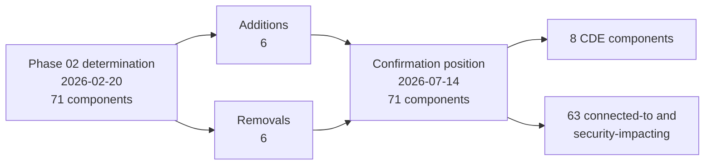

# 07.06 — Annual Scope Confirmation

| Field | Value |
|---|---|
| Document ID | MRG-PCI-2026-706 |
| Program | Marketa Retail Group — PCI DSS v4.0.1 Compliance Program |
| Phase | 07 — Security Policy, Risk &amp; Incident Response |
| Version | 1.0 |
| Status | Approved |
| Owner | Owen Castellanos, Payment Card Compliance Manager |
| Approver | Naomi Bhatt, Chief Information Security Officer |
| Date | 2026-07-15 |
| Classification | Confidential — Cardholder Data Environment // Illustrative Portfolio Sample |

## Purpose

**Requirement 12.5.2 is the requirement Phase 02 exists to satisfy.**

Phase 02 scanned 1,842 systems, traced three payment channels end to end, found account data in four places nobody had recorded, argued a 604-to-71 reduction with the QSA, and published thirty-five conditions that hold the reduction up. All of that work — three months of it, and the largest single document set in the portfolio — discharges **one sub-requirement**: *PCI DSS scope is documented and confirmed by the entity at least once every 12 months and upon significant change to the in-scope environment.*

That relationship is worth stating at the front of this document, because 12.5.2 reads like an administrative obligation and is nothing of the kind. **Scope is the only determination in PCI DSS that decides which other determinations matter.** An entity with a wrong scope has assessed the wrong systems, and every "In Place" it recorded is a statement about the wrong population.

This document is the **2026 annual confirmation**. It records the method, who performed it, what changed since the Phase 02 determination, the reconciliation to the **71 assessed components — 8 CDE and 63 connected-to** — and the re-verification of the thirty-five conditions. It also delivers the elective **TRA-14**, the analysis that defines what a significant change is, because 12.5.2's second limb is unusable without it.

**It is the document the QSA will open first**, and it is written on that assumption.

## 1. What Requirement 12.5 Obliges

| Sub-req | Obligation | Applies to Marketa? | Discharge |
|---|---|---|---|
| **12.5.1** | An **inventory of system components in scope**, including a description of function and use, is maintained and kept current | **Yes** | The 71-entry assessed component register under an eleven-attribute schema, reconciled monthly against four inventory sources — §2 |
| **12.5.2** | **PCI DSS scope is documented and confirmed by the entity at least once every 12 months and upon significant change** to the in-scope environment, covering the seven elements the requirement lists | **Yes** | This document — §4, §5 |
| **12.5.2.1** | Scope confirmed **at least once every six months** and upon significant change | **No — service-provider requirement.** Marketa is a Level 1 **merchant**. **Never within the 306**, and therefore **not** among the ROC's four Not Applicable entries | Recorded so nobody adopts it by mistake and nobody is surprised by its absence |
| **12.5.3** | A review of the impact of **significant organisational change** on PCI DSS scope, with results communicated to executive management | **No — service-provider requirement.** Also **never within the 306** | The equivalent discipline is applied voluntarily through acquirer obligation **C7**, and is described as voluntary |

The 12.5.2.1 and 12.5.3 rows repeat a distinction the portfolio has made since Phase 02 and will make again in Phase 08. **A requirement that never applied to an entity of this type is out of population; it is not "Not Applicable".** Reporting it as N/A inflates the applied population and misdescribes the assessment, and it is a common enough error that the programme states the position in every document where the temptation arises.

## 2. The Inventory — 12.5.1

| Attribute | Position |
|---|---|
| Population | **71** — **8 CDE** components and **63** connected-to or security-impacting components |
| Schema | Eleven attributes per entry, including function and use, which is the limb 12.5.1 names explicitly |
| Reconciliation | **Monthly, on the fifth working day**, against four sources — the CMDB, the AWS inventory APIs, Active Directory computer objects, and the vulnerability scanner's discovered-asset list |
| Why four sources | **The CMDB alone missed 19 systems** during Phase 02 discovery. A single-source reconciliation reconciles the register to a document, not to the estate |
| Reconciliations performed in the period | **12 of 12** |
| Systems newly classified across the period | **387**, of which **6** entered the register |
| Register position at every monthly reconciliation | **71** |
| Owner | Marcus Hale for the reconciliation; Owen Castellanos for the scope-delta review |

**A register that never moves is not automatically a healthy register.** In an estate of 1,842 systems, stability at 71 is as consistent with a reconciliation that is not looking hard as with an environment that is not changing, which is why the process counts the systems **classified** as well as the systems **added**. Three hundred and eighty-seven classifications produced six additions; the other 381 were determined out of scope against the decision tree, each with a recorded determination.

## 3. TRA-14 — What Counts as a Significant Change

12.5.2's second limb obliges confirmation **upon significant change to the in-scope environment**, and PCI DSS does not define the term. It uses it in 6.5.2, in 11.3.1, in 11.4.2 and 11.4.3, and here — and leaves the entity to say what it means.

> **An entity that never writes the definition down has, in practice, defined it as *nothing*, because a trigger nobody can recognise never fires.**

Marketa's definition is **SIG-1 to SIG-10**, established in 04.08 §4 and supported by the elective targeted risk analysis **TRA-14**, consolidated in 07.03. It is elective because the standard compels no analysis for this judgement; it exists because the judgement is a risk decision and because it determines when five separate requirements fire.

| Trigger | What it captures | 12.5.2 relevance |
|---|---|---|
| **SIG-1** | A new component added to the CDE or the connected-to population, or moved into either | Directly changes the assessed population |
| **SIG-2** | Replacement or major upgrade of hardware or software on an assessed component, including a firmware release that changes platform defaults | Changes what the component is, not whether it is in scope |
| **SIG-3** | Any change to the flow, storage, processing or transmission of account data, in any channel, **including the introduction or removal of a provider in the path** | **The trigger that decides whether the CDE is still the CDE** |
| **SIG-4** | Any segmentation-affecting change, delegating to the 1.2.2 list rather than duplicating it | Changes what is segmented out, and therefore what is in |
| **SIG-5** | Any change to a payment page template, its scripts, or the tag-management or CDN configuration serving one | 6.4.3's population is defined by this trigger |
| **SIG-6** | Engagement of a new third-party service provider, or a material change to what an existing provider does | Also acquirer obligation **C6** |
| **SIG-7** | A change to an authentication, authorisation or cryptographic control on an assessed component | Controls whose failure is silent |
| **SIG-8** | A new physical location processing or storing account data, a new merchant identifier, a **new sales channel**, or an acquisition — **extended in 2026 to include a DNS record change repointing a Marketa-branded name to an externally-hosted origin** | **Scope arrives through the business, not through IT** |
| **SIG-9** | A change to a logging, monitoring or detection source covering an assessed component | R-28's failure mode |
| **SIG-10** | A store build image revision, or any change executed simultaneously across the 482-store estate | A build image is a change to 482 networks executed once |

### 3.1 The extension to SIG-8, and why it is an extension rather than an eleventh trigger

The **Q1 ASV scan failed** on three findings. The root cause was not a vulnerability management failure: a marketing subdomain had been repointed to a stale-image edge host, with no scope-delta review, because a DNS record change was not a significant change under any of the ten triggers.

**TRA-14's own trigger fired on that** — *any change that was not classified as significant and subsequently required a scope revisit* — and the analysis was reviewed out of cycle. The determination was to **extend SIG-8 rather than add SIG-11**, on a specific ground: SIG-8 already captured "a new sales channel", and a Marketa-branded name serving content from an origin nobody assessed is a sales channel arriving without anybody deciding to open one. Adding an eleventh trigger would have described the instance; extending the eighth describes the class.

**Four things remain deliberately not significant**, and naming them is as important as naming the ten: a patch applied within an existing baseline and pattern; a rule change inside an already-approved flow that does not widen it; a capacity addition using an existing asserted image; and a content change to a non-payment page. **A definition that captures everything triggers nothing, because the organisation stops believing it.**

### 3.2 The twenty-seven significant changes and what they did to scope

| Trigger | Instances | Scope-delta reviews producing an amendment | Determinations that scope was unaffected |
|---|---|---|---|
| **SIG-1** — component added to the assessed population | 4 | **4** | 0 |
| **SIG-2** — replacement or major upgrade | 6 | 0 | 6 |
| **SIG-3** — account-data flow change | 1 | **1** | 0 |
| **SIG-4** — segmentation-affecting | 9 | 0 | 9 |
| **SIG-5** — payment page or script change | 3 | **1** | 2 |
| **SIG-7** — authentication or cryptographic control | 3 | 0 | 3 |
| **SIG-9** — logging or detection source | 1 | 0 | 1 |
| **Total** | **27** | **6** | **21** |

**SIG-3's single instance is the one to pause on.** The change that triggered it **removed** an account-data flow — the store special-order Truvance payment link — rather than creating one. An entity that only classifies additions as significant misses it entirely, and **a removed flow changes the scope determination exactly as much as an added one does.** The 12.5.2 confirmation records which flows no longer exist as carefully as it records which ones do, and one component left the assessed population as a direct consequence.

Twenty-one of twenty-seven produced a recorded determination that scope was unaffected. **Those twenty-one are evidence, not overhead.** A confirmation that only documents the changes that moved something cannot demonstrate that the others were examined.

## 4. The 2026 Annual Confirmation Record

| Attribute | Value |
|---|---|
| Confirmation type | **Annual confirmation under 12.5.2** |
| Underlying scope determination | **2026-02-20**, recorded in 02.12 §2 |
| Confirmation window | **2026-07-06 to 2026-07-14** |
| Performed by | **Owen Castellanos**, Payment Card Compliance Manager, with **Elena Marchetti**, VP Payment Operations |
| Independent challenge | **Trevor Kim** and **Sonia Rendell** for the segmentation and payment-page elements, each reviewing the element they do not own |
| Confirmed and approved by | **Naomi Bhatt, Chief Information Security Officer**, 2026-07-15 |
| Endorsed by | PCI Steering Committee, chaired by **Raymond Voss** |
| Reviewed with | **Sable Ridge Assurance, LLC** — lead QSA **Grant Whitfield**, QSA **Amara Osei** |
| Assessment period covered | 2026 assessment year; fieldwork **2026-11-02 to 2026-11-20** |
| **Pre-fieldwork re-confirmation** | Scheduled for **October 2026**, inside the freeze, limited to a delta against this confirmation |
| Next full confirmation due | Within twelve months, and on significant change |
| Method | Re-verification of each of the seven 12.5.2 elements against evidence produced in the period, **not** re-affirmation of the Phase 02 conclusion |

### 4.1 The method, stated because it is where an annual confirmation usually degrades

An annual scope confirmation degrades in a predictable way. In year one it is a determination. In year two it is a review of the year-one document. By year four it is a signature on a document nobody has tested against the estate, and the estate has moved.

Marketa's method is written to resist that, and it has three rules:

| Rule | What it means | Why |
|---|---|---|
| **Confirm against evidence, not against the prior document** | Each of the seven elements is re-verified against artefacts produced during the operating period — captures, scans, reconciliations, test results — rather than by reading 02.12 and agreeing with it | The prior document is the hypothesis. Confirming it against itself proves nothing |
| **The person who owns an element does not confirm it alone** | Segmentation is challenged by somebody who does not own segmentation; the payment-page element by somebody who does not own e-commerce | An owner confirming their own element is reporting, not confirming |
| **A qualification survives into the confirmation** | Where an element cannot be confirmed without a caveat, the caveat is carried, not resolved by wording | 02.12's element 5 carried exactly such a qualification, and §5 records what happened to it |

## 5. The Seven Elements, Re-Verified

12.5.2 lists seven things the confirmation must cover. This is each of them, what has changed since the 2026-02-20 determination, and the evidence the 2026 confirmation rests on.

| # | Element | Position at the Phase 02 determination | **What changed** | 2026 confirmation status |
|---|---|---|---|---|
| **1** | Identify **all data flows** across payment stages and acceptance channels | Eight named flows across three channels, traced from observed captures | **One flow removed** — the store special-order Truvance payment link, under SIG-3. **Seven named flows**, three carrying account data to a Marketa component | **Confirmed.** Re-traced from fresh captures in July, not from the February diagrams |
| **2** | Update all **data-flow diagrams** under 1.2.4 | Four diagrams rebuilt from packet, browser and media captures | Two diagrams amended — the removed flow, and the tag-manager removal from all six payment templates | **Confirmed** |
| **3** | Identify **all locations where account data is stored, processed or transmitted**, including outside the currently defined CDE | 100% discovery across 1,842 systems, 41 shares and 6 archives; four unexpected locations found | **A second full discovery run**, 2026-08-17 to 2026-08-28, across the same populations plus the restored backup sets, **returning zero account data instances** | **Confirmed**, and this is **R-31's exit criterion met** |
| **4** | Identify **all system components** in the CDE, connected to it, or able to affect its security | **71** — 8 CDE, 63 connected-to across 13 functional groups | **Six additions and six removals**, net zero — §6 | **Confirmed at 71** |
| **5** | Identify **all segmentation controls** and the environments segmented out, with **justification** for out-of-scope environments | Nine-zone model; nine segmentation-enforcing components in group G10. **Qualified — justification rested on configuration evidence pending the 11.4.5 test** | **The 11.4.5 test happened. It failed.** One path proved segmentation was not effective; remediation completed; re-test passed 2026-06-26; a confirmatory limb at 11 tester-selected stores passed in September | **Confirmed — and the qualification is replaced by a different one.** §5.1 |
| **6** | Identify **all connections from third parties** with access to the CDE | TPSP register reconciled against observed flows; one unrecorded connection found and added | **Six providers, up from five** — the Ashburn co-location added as **TPSP-06**, found absent from the register by a control looking for something else. All six carry a signed 12.8.5 responsibility matrix | **Confirmed** |
| **7** | Confirm the above are documented, in scope where they should be, and **accurately reflect the current environment** | The determination, with the register reconciled monthly against four sources | Twelve monthly reconciliations; 27 significant changes with 27 scope-delta reviews; the condition register re-verified — §7 | **Confirmed** |

### 5.1 Element 5 — the qualification that changed shape rather than disappearing

At the Phase 02 determination, element 5 was the only qualified element: the justification for the out-of-scope environments rested on **configuration evidence**, because the segmentation penetration test had not yet been performed.

The test was performed in May 2026 and **it failed**. A path existed from a lower-trust store zone into a governed zone, at store 0417, exploited in nineteen minutes. Segmentation was remediated, re-tested clean in June, and confirmed again in September at eleven tester-selected stores.

So the February qualification is discharged: the justification no longer rests on configuration evidence alone. **It is replaced by a narrower and more honest one.**

| The old qualification | The new one |
|---|---|
| Segmentation effectiveness is asserted from configuration, and has not been tested | Segmentation effectiveness is **tested**, and the test population is a sample of a 482-store estate. **R-14 is held at High**, because two clean tests are a result and not yet a trend, and because the 90-day no-divergence count was reset once by a real recurrence at store 0629 on 2026-07-03 |

**A qualification that changes shape is a better outcome than one that disappears**, and it is the honest one: the scope determination now rests on evidence that segmentation works at the stores that were tested, on the dates they were tested, plus a daily assertion (**CSC-8**) that has itself failed once and was caught.

## 6. Reconciliation to the 71

| Movement | Component | Trigger | Classification |
|---|---|---|---|
| **In** | **CT-31** — the authenticated vulnerability scanner | SIG-1 | Connected-to / security-impacting |
| **In** | The **log-content sampling pipeline** | SIG-1 | Security-impacting |
| **In** | **Z2 workload** — payment operations reporting service | SIG-1 | Connected-to |
| **In** | **Z2 workload** — settlement file transfer service | SIG-1 | Connected-to |
| **In** | A rebuilt jump host, replacing its predecessor like for like | SIG-2 | Connected-to |
| **In** | A successor vendor-hosted console, replacing a retired product | SIG-2 | Connected-to — an un-baselined SaaS control plane |
| **Out** | The predecessor jump host | SIG-2 | Retired; procedure **P-3** data-destruction attestation on file |
| **Out** | The retired vendor-hosted console | SIG-2 | Access terminated; provider data-return confirmed |
| **Out** | **Two legacy administrative jump hosts**, retired on completion of the privileged access broker rollout | SIG-7 | Retired; **P-3** attestations on file |
| **Out** | A standalone patch distribution point, consolidated into the enterprise patching service | SIG-2 | Retired; **P-3** attestation on file |
| **Out** | A reporting host that left scope when the **SIG-3** change removed the store special-order account-data flow | **SIG-3** | **Reclassified out of scope with a recorded determination**, not retired — the machine still runs |
| **Net** | **+6 / −6 = 0** | | **71 — 8 CDE + 63 connected-to** |

Two rows carry the substance.

**The last "Out" row is a reclassification, not a decommission**, and those are the dangerous ones. A component that leaves scope because a flow was removed is still powered, still reachable and still owned; only its classification changed. The determination is recorded, the machine remains in the CMDB, and step 6 of the monthly reconciliation would raise it again if the flow returned. **R-19 exists for exactly this class** — assets that are treated as gone and are not.

**No CDE component was added or removed.** The eight are the same eight determined in February, which is what one would expect of a cardholder data environment that did not change shape, and is stated so that the stability is on the record rather than assumed.

## 7. The Thirty-Five Conditions, Re-Verified

The 88.2% scope reduction rests on **thirty-five conditions**. They are not assumptions; each has an owner, a verification method, a frequency and a reversal trigger. **A condition that fails is a scope event**, and re-verifying them is a substantive part of the annual confirmation rather than an appendix to it.

| Reduction | Conditions | Continuously verified | Verified on a cycle | Verified annually only | Held at confirmation |
|---|---|---|---|---|---|
| **P2PE** — 482 components | 9 | 1 | 6 | 2 | **9 of 9** |
| **Hosted iframe** — 23 components and 6 templates | 7 | 3 | 3 | 1 | **7 of 7** |
| **Tokenization** — 8 components and the wider token estate | 5 | 1 | 2 | 2 | **4 of 5** |
| **DTMF suppression** — 11 components and 310 agents | 8 | 2 | 4 | 2 | **8 of 8** |
| **Segmentation** — enables all of the above | 6 | 1 | 4 | 1 | **5 of 6** |
| **Total** | **35** | **8** | **19** | **8** | **33 of 35 unqualified** |

### 7.1 The two that required action

| Condition | What happened | Resolution | Status at confirmation |
|---|---|---|---|
| **Tokenization** — the condition that Truvance's validation covers the services Marketa relies on | The annual 12.8.4 review found a **Truvance AOC scope statement that did not clearly cover a service Marketa relies on**, while the provider's validation status remained valid. **The trigger fired because somebody reads the scope statement rather than the status line** | Clarified with the provider and **re-issued in writing within 15 days** | **Restored.** The condition holds, and the review cadence for AOC scope statements is now separate from the status check |
| **Segmentation** — the condition that no segmentation-determining divergence exists across the store estate | The 90-day no-divergence count was **reset on 2026-07-03** by a real recurrence at store 0629, five weeks after the June re-test | The count restarted and ran clean to its completion; the September confirmatory limb passed at 11 tester-selected stores | **Held, qualified.** The condition is met at the confirmation date and **R-14 remains High** until a second annual test |

### 7.2 The eight annual-only conditions

**Eight of the thirty-five are verified once a year**, and they are the weakest points in the structure. Two of them are also among the most consequential: that Marketa holds **no decryption capability** (**P2PE-C6**), and that **no account data remains in the recording estate** (**MOTO-C7**).

**MOTO-C7 was false for seven years.** That is not a hypothetical about annual verification; it is the finding that raised **R-31**. The programme's response is not to claim the annual conditions are stronger than they are, but to pair each with a **detective control that runs faster than the verification cycle** — continuous DLP telemetry, continuous discovery on high-risk repositories, the daily authorisation-to-session reconciliation, and the 10.7.2 monitoring-failure alerting.

MOTO-C7's 2026 verification is the second full discovery run recorded in element 3: **2026-08-17 to 2026-08-28, across the same populations, returning zero.** That is the strongest evidence in this confirmation, and it is worth being precise about what it establishes: **it establishes that the historical account data is gone. It does not establish that the archive could not fill again**, which is why the detective layer exists and why the condition is verified rather than closed.

## 8. Requirement Coverage

| Sub-req | Position | Evidence |
|---|---|---|
| **12.5.1** | **Met** — a 71-entry inventory with function and use per entry, reconciled monthly against four sources, **12 of 12** reconciliations performed, 387 systems classified in the period | The assessed component register; twelve reconciliation records; the classification determinations |
| **12.5.2** | **Met** — annual confirmation performed 2026-07-06 to 2026-07-14 across all seven elements against period evidence, with independent challenge on the two elements most exposed to owner bias, approved by the CISO and endorsed by the Steering Committee; **27 significant changes with 27 scope-delta reviews**; a pre-fieldwork delta re-confirmation scheduled for October | This document; the seven-element evidence set; the scope decision records; the 27 change records |
| **12.5.2.1** | **Service-provider requirement.** Never within the 306; **not** among the ROC's four Not Applicable entries | §1 |
| **12.5.3** | **Service-provider requirement.** Never within the 306. The equivalent discipline is applied voluntarily through acquirer obligation **C7** | §1 |
| **TRA-14** *(elective)* | **Delivered** — the significant-change definition, **SIG-1 to SIG-10**, with four named exclusions, an out-of-cycle review after its own trigger fired, and the SIG-8 extension | 07.03; 04.08 §4; §3.1 here |

## 9. What This Confirmation Does Not Claim

| Limitation | Statement |
|---|---|
| **A confirmation is a statement about a date** | Scope was correct on 2026-07-14 and the estate changed the next morning. The **October pre-fieldwork delta** exists because of that, and it is a delta, not a second full confirmation |
| **Element 5 remains the qualified element** | It is better qualified than it was in February. It is still the element where a reader should push hardest, and **R-14 is held at High** for the same reason |
| **Thirty-three of thirty-five held is not thirty-five** | Two conditions required action in the period, both were resolved, and both were found by a control rather than by the annual verification. **The annual verification found nothing this year, which is a result about the annual verification** |
| **The reduction is somebody else's control now** | Scope reduction is not risk reduction. 604 to 71 was achieved by putting the primary account number somewhere else, and three providers now sit between Marketa and its ability to accept payment at all. **Thirty-five of eighty graded assurance rows are provider statements Marketa cannot corroborate** — 06.10 §8 |
| **The QSA reviewed the determination; the QSA did not make it** | Sable Ridge challenged the determination three times in Phase 02 and reviewed this confirmation. **Scope is the entity's determination**, and 12.5.2 says so — *documented and confirmed **by the entity***. An assessor's agreement is corroboration, not authorship |

## Cross-References

| Reference | Relevance |
|---|---|
| 01.11 §5 — Compliance Calendar &amp; Obligations | 12.5.2 as an annual obligation owned by the CISO; the deliberately-not-applicable list |
| **02.09 — Assessed System Component Inventory** | The 71-entry register, its eleven-attribute schema and the monthly reconciliation this document reports against |
| **02.10 — Scope Reduction Analysis** | The **35 conditions**, their verification frequencies and their reversal triggers |
| **02.12 — Scope Validation &amp; Phase Summary** | The **2026-02-20 determination** and the original seven-element record this confirmation re-verifies |
| 03.07 · 03.08 — Segmentation Penetration Test and Re-Test | The 11.4.5 test that discharged element 5's February qualification by failing |
| **04.08 §4 — Change Control** | **SIG-1 to SIG-10**, the twenty-seven significant changes, and the four deliberate exclusions |
| 06.06 — ASV Scanning | The **Q1 failure** whose root cause produced the SIG-8 extension |
| 06.10 — Third-Party Service Provider Management | **TPSP-06** and the Truvance AOC scope statement behind §7.1 |
| **07.03 — Targeted Risk Analyses, Consolidated** | **TRA-14**, and its trigger firing once in the period |
| **07.07 — Risk Register Position** | **R-14, R-19, R-31, R-33** — the entries this confirmation bears on |
| Phase 08 — QSA Assessment &amp; ROC Production | The document the assessment opens with; the four Not Applicable entries, which do **not** include 12.5.2.1 or 12.5.3 |
| Phase 09 — Executive Reporting &amp; Continuous Compliance | Inherits the confirmation cycle and the condition register |

---
[⬅ Previous](07.05-personnel-screening-and-roles.md) · [🏠 Phase 07 Home](07.00-README.md) · [Next ➡](07.07-risk-register-position.md)
