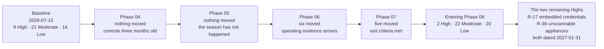

# 07.07 — Risk Register Position

| Field | Value |
|---|---|
| Document ID | MRG-PCI-2026-707 |
| Program | Marketa Retail Group — PCI DSS v4.0.1 Compliance Program |
| Phase | 07 — Security Policy, Risk &amp; Incident Response |
| Version | 1.0 |
| Status | Approved |
| Owner | Owen Castellanos, Payment Card Compliance Manager |
| Approver | Naomi Bhatt, Chief Information Security Officer |
| Date | 2026-07-15 |
| Classification | Confidential — Cardholder Data Environment // Illustrative Portfolio Sample |

## Purpose

The consolidated risk position entering the QSA assessment.

Phase 03 published a **44-entry baseline — 9 High, 21 Moderate, 14 Low** — dated 2026-07-15, and said that every later movement would be measured against it. Phases 04 and 05 moved nothing and said why. Phase 06 moved six entries on a year of operating evidence. This phase moves five more, formally adopts the register into the policy set, and states the position the programme carries into Phase 08.

That position is **2 High · 22 Moderate · 20 Low**, and the two High entries are **R-17** and **R-36** — the two risks held by the programme's **two Not in Place findings**, both dated **2027-01-31**.

**This is the honest position rather than a tidy one.** A programme that reached its assessment with no High risks and no Not in Place findings would be either a very different programme or a less truthful document set. Marketa's enters with two of each, they are the same two, they share a remediation date that falls after the ROC is issued, and there is no float before the re-assessment. All of that is stated here rather than discovered in Phase 08.

## 1. The Position in One Table

| Rating | **Baseline** 2026-07-15 | After Phase 04 | After Phase 05 | After Phase 06 | **After Phase 07 — entering the assessment** | Expected at Phase 09 close |
|---|---|---|---|---|---|---|
| **High** | **9** | 9 | 9 | 7 | **2** | **0** |
| **Moderate** | **21** | 21 | 21 | 19 | **22** | **13** |
| **Low** | **14** | 14 | 14 | 18 | **20** | **31** |
| **Total** | **44** | 44 | 44 | 44 | **44** | **44** |

**No entry has been closed or removed at any point.** The register has been 44 entries since the baseline, including the two raised on evidence, including the four PAN discovery findings that were remediated in full, and including the two that have now fallen from High to Low. A register that shrinks as work completes stops being a description of exposure and becomes a record of activity.

## 2. The Movement Rule

Stated before any movement, unchanged from 06.12:

> **A rating moves on measured operating evidence, never on delivery.**

| Term | Meaning |
|---|---|
| **Movement** | A change in likelihood or impact, proposed only by the risk owner, with named evidence. Recorded by the Payment Card Compliance Manager. **Movement into or out of the High band requires the CISO's approval** |
| **Held** | The rating is unchanged. **Held is a determination, not an absence of one**, and every holding carries a reason |
| **Exit criterion** | Where an entry carries a published exit criterion, the entry moves when the criterion is met — **not when somebody argues it should**. Two entries in this phase move on criteria published in Phase 03 before anybody knew whether they would be met |
| **Closure** | Not used. Entries do not close; they move to Low and stay in the register |

## 3. Phases 04 and 05 — Why Nothing Moved

Two phases delivered the majority of the programme's technical controls and neither moved a single rating. That was deliberate and it was stated in advance in both phases.

| Phase | What it delivered | Why nothing moved |
|---|---|---|
| **Phase 04** | Requirements 2, 3, 4, 5 and 6 — baselines, cryptography, malware protection, vulnerability management, change control, **6.4.3 payment-page script management** | **A control published in July has no operating history, and a control with no operating history does not lower a rating.** 04.12 recorded it, and 04.10 §13 named in advance the exact conditions that would be required to move **R-01** — every one of which was discharged two phases later |
| **Phase 05** | Requirements 7, 8 and 9 — access model, MFA, the **8.3.9 customized approach**, physical security, POI device protection, the seasonal design | The same discipline, plus one specific reason: **the seasonal design had never run.** 05.11 said so plainly. A control designed for a population that arrives in October cannot be rated in July on the strength of its design |

**The value of two phases of holding is realised in Phase 06 and this one.** R-01 fell from the register's highest entry at 20 to Moderate 10 on 140 days of operation, three real detections and two proof-of-life tests — and the movement means something precisely because four documents across two phases declined to make it earlier in almost identical words.

## 4. Phase 06 — Six Entries Moved

| Risk | Baseline | Movement | Residual | Evidence it moved on |
|---|---|---|---|---|
| **R-01** — unauthorised or malicious script on a payment page | **High 20** — L4 × I5 | **L 4 → 2**; impact **held at 5** | **Moderate 10** | **The script control completed.** 6.4.3 preventive plus 11.6.1 detective; 214 alerts in 140 days, median 9 minutes, 0 exceeding the 24-hour ceiling, 3 incidents, 2 proof-of-life tests. **Impact does not fall while Marketa serves a page into a browser it does not control** |
| **R-09** — third-party service provider concentration | High 15 — L3 × I5 | **L 3 → 2**; impact **held at 5** | **Moderate 10** | A full year of six-provider assurance: 36 MT-1 verifications, six signed responsibility matrices, four passed handover tests, and **the Truvance AOC scope-statement change detected at review before the provider raised it** |
| **R-10** — a provider's validation lapses inside the compliance year | Moderate 12 — L3 × I4 | **L 3 → 2**; **I 4 → 3** | **Low 6** | Monthly verification against authoritative published sources; a 60-day pre-expiry watch; **and the suspension rule recorded in advance**, which is what reduces impact |
| **R-19** — decommissioned assets remain powered, reachable and unscanned | Moderate 9 — L3 × I3 | **L 3 → 2** | **Low 6** | Twelve monthly reconciliations against four inventory sources with 71 of 71 scanned every quarter; **CSC-10** making a reconciliation failure a 10.7.2 event |
| **R-26** — cloud logging disabled, diverted or unmonitored for absence | Moderate 8 — L2 × I4 | **L 2 → 1** | **Low 4** | The trail logs its own modification; the object-locked archive copy exists within seconds; the silence alert is independent of agent health |
| **R-34** — payment-page script inventory drift | Moderate 12 — L4 × I3 | **L 4 → 2** | **Low 6** | The publication mechanism **removed** rather than governed; four reconciliation mechanisms; **TAM-2 detecting an unrecognised script from the consumer's position in 14 minutes** |

## 5. Phase 07 — Five Entries Moved

Phase 07's evidence is of a different kind from Phase 06's. Where Phase 06 moved entries on the operation of detective controls, this phase moves them on **published exit criteria being met**, on the annual confirmations that re-verify the conditions the whole scope determination rests on, and on the governance layer that Requirement 12 delivers. Two of the five move on criteria written in Phase 03 before anybody knew whether they would be satisfied.

| Risk | Position entering | Movement | Residual | Evidence it moved on |
|---|---|---|---|---|
| **R-14 ‡** — segmentation controls in the store estate are not effective | **High 16** — L4 × I4 | **L 4 → 2**; **I 4 → 3** | **Low 6** | **Its own published exit criterion, met.** 03.11 §4 set it in advance: *a clean re-test plus 90 consecutive days with no segmentation-determining divergence across 482 stores.* The count was reset on 2026-07-03 by a real recurrence at store 0629, restarted, and **ran clean to completion on 2026-10-01**. The September confirmatory limb passed at **11 tester-selected stores**. **CSC-8** asserts the state daily and has itself failed once, and that failure was caught. **Impact 4 → 3** because the path the test proved was **Z7 to Z5** — guest wireless into store back-office, a connected-to zone — and the Z3-to-Z1 crossing into the CDE is separately enforced at an inline prevention point with fifteen months of flow recording |
| **R-31 ‡** — historical account data persists in the call-recording estate and other unstructured stores | **High 16** — L4 × I4 | **L 4 → 2**; **I 4 → 3** | **Low 6** | **Its own published exit criterion, met.** 03.11 §4 required *a second full discovery run across the same populations returning nothing*, due 2026-08-31. Performed **2026-08-17 to 2026-08-28**, across the same 1,842 systems, 41 shares, 6 archives and the restored backup sets, **returning zero account data instances**. Halberd certificates of destruction on file for the disposed populations. **Impact 4 → 3** because the historical corpus is destroyed and evidenced; the residual is the forward-only creation path, which DTMF masking, DLP telemetry and quarterly unowned-repository discovery address continuously |
| **R-02** — POI device tampering, skimmer overlay or whole-device substitution | **High 15** — L3 × I5 | **L 3 → 2**; impact **held at 5** | **Moderate 10** | **Four full quarterly inspection cycles at all 1,914 terminals with no sampling — 7,656 device-inspections.** The mechanism produced findings rather than silence: **six seal discrepancies in Q3**, all cleared as maintenance, procedure tightened. **9.5.1.3 training at 98.1%**, unabridged for the seasonal cohort under **SEA-5** and **ADR-0019**. Colleague-raised POI reports rose from **4 to 27**. **Impact held at 5**: a substituted device captures data before the SRED function ever sees it |
| **R-05** — a P2PE condition fails at one or more stores | **High 15** — L3 × I5 | **L 3 → 2**; impact **held at 5** | **Moderate 10** | **The 2026 annual scope confirmation re-verified all nine P2PE conditions and all nine held** — 07.06 §7. Verition's Council listing verified twice under **MT-1**; PIM adherence obligations made contractual; the daily per-store POI-to-VLAN assertion under **CSC-8**; **the three non-conforming stores of February 2026 closed with no recurrence** across four inspection cycles. **Impact held at 5**: a P2PE failure invalidates the reduction that removes 1,914 lanes and 482 servers from the assessed population |
| **R-27** — administrative-services zone concentration | **High 15** — L3 × I5 | **L 3 → 2**; impact **held at 5** | **Moderate 10** | **The thinnest movement in this document, and §5.1 says so.** The population holding Z3 administrative authority fell as **two legacy administrative jump hosts were retired** on completion of the privileged access broker rollout; **SCN-3 enhanced screening** was extended to the 178 in-scope administrative personnel even though 12.7.1's wording does not compel it; phishing-resistant FIDO2 covers every administrative path; the **12.3.4** technology review found no unsupported component on the Z3 path and the **12.3.3** review removed TLS 1.0 and 1.1 across it. **Impact held at 5**: the concentration is a design trade under principle SP-4 and is unchanged |

### 5.1 The movement with the thinnest margin, recorded as such

**R-27 is the one a reader should push on.** 06.12 §5 held it explicitly, in these terms: *APP-PT-01 was reached from Z3. Phase 06 raised confidence that the rating is correct; it did not reduce the concentration.* Three months later this phase moves it.

The argument for moving it is that **likelihood, not concentration, is what changed**: fewer principals hold Z3 administrative authority, all of them now screened at the enhanced tier, all of them behind phishing-resistant authentication, on a path whose technology currency and cryptographic posture have both been reviewed and corrected in the period.

The argument against is that none of that touches the thing the entry describes. **The concentration is deliberate**, it exists because routing every crossing through one zone makes the boundary testable, and the register's job is to price the trade rather than to reward the controls placed around it.

| Element | Record |
|---|---|
| Proposed by | Trevor Kim, risk owner |
| Approved by | Naomi Bhatt, CISO — required, because it is a movement out of the High band |
| **Dissent minuted** | **Yes.** Recorded at the Steering Committee: that the movement rests on likelihood factors around a concentration that has not itself reduced, and that a Critical finding **was** reached from this zone in the operating period |
| Condition attached | **R-27 returns to High on any finding reached from Z3 in the 2027 penetration test**, without further argument |

**A movement with a dissent minuted and a return condition attached is a better record than a movement everybody agreed with**, and it is published here so that Phase 08 and Phase 09 can be measured against it.

### 5.2 Two candidates tested against ADR-0005, and why neither raised an entry

**ADR-0005** obliges a new register entry when discovery **disproves an assumption**, not whenever a control produces a finding. Phase 07 produced two candidates and both were tested.

| Candidate | The test | Conclusion |
|---|---|---|
| **Two of nine call-centre agents described deleting a recording containing spoken PAN**, in the unannounced `x.1.2` interview | Was an assumption disproved? The assumption that a documented procedure is a known procedure — which **R-43** already describes as *incident response procedures documented but not exercised against the scenarios this estate actually produces*. Would a new entry say anything R-43 and **R-22** do not? | **No entry raised.** Recorded as an instance under R-43 and R-22; the treatment is the module amendment and the scripted 12.10.7 route in the second half of this phase |
| **One hundred directory records with no person behind them**, found by the awareness completion denominator | Was an assumption disproved? That the directory describes the workforce — which is precisely **R-13**'s subject, and which 05.11 §2 already measured in a different form as 1,118 accounts enabled thirty days after their holder's last worked shift | **No entry raised.** Recorded as an instance under **R-13**, referred to the identity team, and carried as an input to the February 2027 seasonal close-out |

**The register remains at 44.** The standing reason, from 05.12 §6.1 and repeated in 06.12 §6.1: *a register that grows by one entry every time a control produces a finding stops describing exposure and starts describing activity.*

## 6. The Position Entering the Assessment

### 6.1 The reconciliation, so a reader can check it

| Check | Working | Result |
|---|---|---|
| High | 7 after Phase 06, minus R-02, R-05, R-14, R-27, R-31 | **2** ✔ — **R-17** and **R-36** |
| Moderate | 19 after Phase 06, plus R-02, R-05, R-27 arriving from High, minus none leaving | **22** ✔ |
| Low | 18 after Phase 06, plus R-14 and R-31 arriving from High | **20** ✔ |
| Total | 2 + 22 + 20 | **44** ✔ — no entry closed or removed |
| Against the Phase 09 prediction | 22 Moderate − 9 leaving for Low (R-04, R-08, R-18, R-21, R-22, R-23, R-28, R-32, R-33) = **13** ✔ · 20 Low + 9 + R-17 + R-36 = **31** ✔ · 2 High − 2 = **0** ✔ | **Reconciles** |

The prediction has been restated unchanged since 03.12 — through 04.12, 05.12 and 06.12 — so that Phase 09 reports against **one** forecast rather than five successively adjusted ones.

### 6.2 Distribution entering the assessment

| Category | Entries | High | Moderate | Low |
|---|---|---|---|---|
| Account Data | 6 | 0 | 3 | 3 |
| Network &amp; Segmentation | 5 | 0 | 4 | 1 |
| Identity &amp; Access | 5 | **1** | 4 | 0 |
| Payment Channel | 5 | 0 | 3 | 2 |
| Vulnerability &amp; Change | 6 | **1** | 3 | 2 |
| Third Party | 3 | 0 | 1 | 2 |
| Physical &amp; Device | 3 | 0 | 1 | 2 |
| Monitoring &amp; Detection | 4 | 0 | 1 | 3 |
| Cloud | 2 | 0 | 1 | 1 |
| Governance &amp; People | 5 | 0 | 1 | 4 |
| **Total** | **44** | **2** | **22** | **20** |

## 7. The Two That Remain High

Both are held by a **Not in Place** finding. Neither is held by an argument, an opinion or a judgement about likelihood: each is held because a requirement is not met, and a register that scored those entries below High would be scoring against its own programme's assessment.

### 7.1 R-17 — embedded credentials in application and system accounts

| Element | Position |
|---|---|
| Entry | Application and system accounts hold embedded, non-rotatable credentials in legacy batch integrations, with interactive use possible and no individual attribution |
| Score | **L4 × I4 = 16 — High.** Unchanged since the baseline |
| Owner | Trevor Kim |
| The requirement | **8.6.2 — Not in Place.** Hard-coded credentials remaining in **two** legacy batch integrations |
| Compensating control | **Drafted and refused.** The same discipline applied three months later to 11.3.1.2 |
| What was done in the interim | Interactive use blocked, network origin constrained, usage monitored and attributed at the flow level. **Phase 06 tested the credentials adversarially in 06.08 §4.1 and confirmed the interim measures do exactly what 05.07 claims and no more** |
| Remediation | Vendor release 9.4 for `batch-icq`; the ERP interface upgrade for `gl-extract`; **both credentials moved to CT-14 vault retrieval.** Requires a freeze exemption approved 2026-12-17 |
| Date | **2027-01-31** — **OI-06-02**, carried from OI-05-01 |
| Why it does not move | **The requirement is not met.** Interim measures reduce the paths to a credential; they do not remove a credential that is embedded, non-rotatable and unattributable |

### 7.2 R-36 — components that cannot accept credentialed assessment

| Element | Position |
|---|---|
| Entry | Nine vendor-locked POS back-office appliances cannot be authenticated-scanned under constraint **CON-03**, leaving their vulnerability state unknown on components inside the assessed population |
| Score | **L4 × I4 = 16 — High.** Unchanged since the baseline |
| Owner | Trevor Kim |
| The requirement | **11.3.1.2 — Not in Place.** Authenticated internal scanning achieved on **62 of 71** components |
| The argument that failed | Marketa argued the requirement's documentation allowance and **the QSA rejected it**, on the distinction between *a system technically unable to accept credentials* and *an entity contractually unable to obtain them* |
| Compensating control | A worksheet was **drafted and refused on three of its four tests** |
| Accommodations in place | Weekly unauthenticated scanning; monthly firmware reconciliation; quarterly vendor patch attestation under 12.8.5; network isolation; the vendor advisory feed as a named 6.3.1 source. **None of them establishes what is installed and unfixed** |
| Remediation | **CAP-06** — a contractual right to credentialed scanning and agent installation at the FY2027 renewal, or platform replacement as the costed fallback. Verified by an authenticated scan of all nine with per-target authentication assertion |
| Date | **2027-01-31** — **OI-06-01** |
| Why it does not move | **The requirement is not met, and CAP-06 is a renewal negotiation rather than an engineering task.** 12.3.4's technology review found the platform supported, patched and advised — and unverifiable, which is 07.03 §5.1 |

### 7.3 The sequencing, stated rather than smoothed

| Date | Event | Consequence for the register |
|---|---|---|
| **2026-11-02 → 11-20** | QSA fieldwork | Both findings observed in their current state |
| **2026-12-11** | **ROC and AOC issued — non-compliant on two requirements** | The register carries two High entries and the ROC carries two Not in Place findings. **They are the same two things seen from two documents** |
| **2026-12-17** | Board and Audit Committee report; freeze exemption approved for the 8.6.2 work | Remediation can begin |
| **2027-01-31** | **Both remediations due.** The freeze lifts at the end of January, which is precisely why the date is the last day of the month — **the 11.3.1.2 work touches vendor-locked appliances in the store estate and cannot begin until it lifts** | The exit condition for both entries |
| **2027-02-18** | **Re-assessment — full compliance; revised ROC and AOC issued** | **Eighteen days after the remediation date. There is no float** |

**The register and the ROC disagree at a point in time because they measure different things on different dates.** The Phase 09 close is reported after the re-assessment, which is why the forecast of 0 High reconciles. The programme states the sequence rather than aligning the numbers.

## 8. Formal Adoption of the Register

03.11 §6 recorded that formal adoption of the risk register into the policy set would happen in Phase 07, where 12.3 is discharged in full. This is that adoption.

| Element | Position |
|---|---|
| Owning policy | **MRG-ISP-00 §6**, with the operating detail in **PS-1**, the targeted risk analysis standard |
| Accountable owner | **Naomi Bhatt, CISO** |
| Relationship to 12.3 | The register **supplies context** to the fourteen targeted risk analyses and the one customized approach; **it does not replace them.** A 12.3.1 analysis is about one control's frequency; the register is about exposure |
| Review cadence | High entries **monthly** at the PCI Steering Committee; full refresh **quarterly**; Audit Committee **quarterly**; out of cycle on any disproved assumption, penetration test finding, incident or control-coverage gap |
| Score change control | Proposed only by the risk owner with evidence; recorded by the Payment Card Compliance Manager; **movement into or out of the High band approved by the CISO**, with dissent minuted where it exists |
| Acceptance | A High entry requires **written CFO acceptance with an expiry date**. **None has been accepted** at any point in the programme, including the two entering the assessment |
| Tracker | Generated by parsing this document's tables, with assertions on the counts, so the workbook cannot drift from the prose |

**No High risk in this register has ever been accepted.** The CFO acceptance route exists, it has an expiry-date requirement attached to make acceptance a decision rather than a disposal, and it has not been used — including for the two entries whose remediation dates fall after the ROC.

## 9. What Comes Next in This Phase

Incident response — **Requirement 12.10** — is the second half of Phase 07 and is deliberately not delivered here. Four register entries wait on it: **R-43** (procedures not exercised against the scenarios this estate produces), **R-20** (destructive malware interrupting trading), **R-22** (customer-initiated account data) and **R-07** (account data at rest in the messaging estate). None of them moves in this document.

Two things are worth foreshadowing rather than claiming:

**12.10.7 — procedures for PAN discovered where it is not expected — is a future-dated requirement in its first assessment, and Marketa has four real instances**: 11,400 call recordings, 2,187 scanned dispute documents, an application debug log on a decommissioned host, and a store manager's emailed spreadsheet of 34 records.

**The incident procedures have been exercised against detections, not against a breach.** They were used for a rogue access point, a file-integrity escalation, three page-integrity alerts and the September Critical's stop-and-notify at 14:20 on 2026-09-16. **None of those was a confirmed compromise of account data**, and 06.13 §6.3 warned Phase 07 not to treat use as proof.

## 10. What This Position Does Not Prove

| Limitation | Statement |
|---|---|
| **Eleven movements rest on one operating cycle each** | Every entry that moved did so on a single year, and **R-01's rests on 140 days** — the largest single change in the register on the shortest evidence base in it |
| **Two entries moved on criteria they set themselves** | R-14 and R-31 met exit criteria published in Phase 03. That is the strongest form of movement available — the criterion was written before the outcome was known — and it is still a criterion Marketa chose |
| **R-27's movement is contested and is published as contested** | With the dissent minuted and a return condition attached. A reader who disagrees has everything needed to disagree |
| **Twenty-two entries are Moderate and nine of them are forecast to fall in Phase 09** | That forecast has been restated unchanged five times. It is a prediction, not a result, and Phase 09 reports against it entry by entry |
| **The two Highs are not risks the programme can manage down** | R-17 waits on a vendor release and an ERP upgrade; **R-36 waits on a contract renegotiation.** Neither is an engineering task, and neither can be accelerated by Marketa alone |
| **The register bounds the analysis** | It cannot find a risk nobody thought of. **R-14 and R-31 are what it looks like when testing and discovery find one instead** — and both are now Low, which is the outcome, not the lesson |
| **Nothing here is a statement about anything but exposure** | No monetary loss estimate is attached to any entry. No fine, fee or penalty amount is stated anywhere in this programme. Brand-programme consequences are described only as categories assessed against the acquirer and passed through under the merchant agreement |

## Cross-References

| Reference | Relevance |
|---|---|
| ADR-0005 — Raise a Risk When Discovery Disproves an Assumption | Applied twice in §5.2 and **not** triggered either time |
| 03.10 — Risk Assessment Methodology | The scoring model, the impact dimension and the movement rules |
| **03.11 — Risk Register** | The **44-entry baseline** — 9 High, 21 Moderate, 14 Low — and the published exit criteria for **R-14** and **R-31** |
| 03.12 — Control-to-Risk Traceability | The close-position forecast, restated unchanged since |
| 04.12 · 05.12 — Control-to-Risk Traceability | The two phases that moved nothing, and said why in advance |
| 05.07 — Application &amp; System Accounts | **8.6.2 Not in Place**; the interim measures behind **R-17** |
| 05.09 — POI Device Protection | The inspection cycles, the seal discrepancies and the verification tests behind **R-02**'s movement |
| **06.12 — Control-to-Risk Traceability** | The six Phase 06 movements and the twenty-two holdings |
| 06.05 — Internal Vulnerability Scanning | **11.3.1.2 Not in Place**; **CAP-06**; the refused compensating control behind **R-36** |
| 06.13 — Phase Summary &amp; Transition | The two Not in Place findings, undressed, and the seven things Phase 07 must not assume |
| **07.03 — Targeted Risk Analyses, Consolidated** | The fourteen analyses this register supplies context to and does not replace |
| **07.06 — Annual Scope Confirmation** | The nine P2PE conditions behind **R-05**; the second discovery run behind **R-31**; the segmentation position behind **R-14** |
| **07.08 — Incident Response Plan** *(next)* | **R-43, R-20, R-22, R-07** — the entries Requirement 12.10 treats |
| Phase 08 — QSA Assessment &amp; ROC Production | **In Place 297 · Compensating Control 3 · Not Applicable 4 · Not Tested 0 · Not in Place 2**; the AOC filed non-compliant on 2026-12-11 |
| Phase 09 — Executive Reporting &amp; Continuous Compliance | The close position — **0 High · 13 Moderate · 31 Low** — reported after the 2027-02-18 re-assessment |

---
[⬅ Previous](07.06-annual-scope-confirmation.md) · [🏠 Phase 07 Home](07.00-README.md) · [Next ➡](07.08-incident-response-plan.md)
