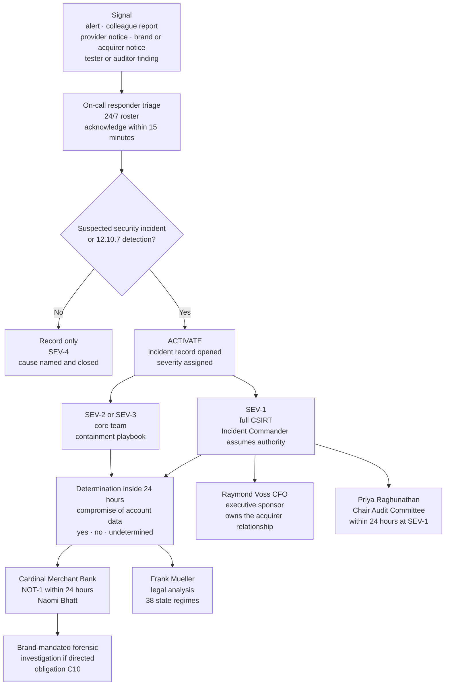

# 07.08 — Incident Response Plan

| Field | Value |
|---|---|
| Document ID | MRG-PCI-2026-708 |
| Program | Marketa Retail Group — PCI DSS v4.0.1 Compliance Program |
| Phase | 07 — Security Policy, Risk &amp; Incident Response |
| Version | 1.0 |
| Status | Approved |
| Owner | Naomi Bhatt, Chief Information Security Officer |
| Approver | Raymond Voss, Chief Financial Officer |
| Date | 2026-07-15 |
| Classification | Confidential — Cardholder Data Environment // Illustrative Portfolio Sample |

## Purpose

Requirement 12.10.1 obliges an incident response plan to **exist and to be ready to be activated in the event of a suspected or confirmed security incident**. Two words in that sentence carry the requirement. *Ready* means the plan is not a document that would need to be assembled at the moment it is needed. **Suspected** means the trigger is a state of belief, not a state of fact — and an entity whose plan activates only on confirmation has a plan that activates after the window in which activation would have mattered.

This document is Marketa's plan as approved: the severity model, who may activate it and on what, the composition and standing authority of the computer security incident response team, the escalation path to the Chief Financial Officer and to the Chair of the Audit Committee, the notification obligations owed to Cardinal Merchant Bank and — through Cardinal — to the four card brands, the business recovery and continuity provisions, the data backup processes the response depends on, the analysis of legal reporting requirements across 38 states, and the coverage of all 71 assessed system components through ten named playbooks.

**What this document does not cover.** The annual test and the training programme, including **TRA-09**, are **07.09**. Monitoring and response to alerts under 12.10.5, and the lessons-learned loop under 12.10.6, are **07.10**. The 12.10.7 procedures for PAN discovered where it is not expected are **07.11**, and they are the one part of this plan that Marketa exercised for real before it wrote it down.

## 1. What 12.10.1 Requires, Element by Element

12.10.1 names seven things the plan must contain. Entities routinely deliver five of them well, treat the sixth as a paragraph, and omit the seventh entirely.

| # | The element, in the standard's terms | Where it lives in Marketa's plan | Section |
|---|---|---|---|
| **1** | **Roles, responsibilities, and communication and contact strategies** in the event of a suspected or confirmed security incident, **including notification of payment brands and acquirers, at a minimum** | The CSIRT composition and standing authorities; the contact register maintained as a live artefact; **NOT-1 to NOT-7**, of which NOT-1 is the 24-hour acquirer obligation | §3, §5 |
| **2** | **Incident response procedures with specific containment and mitigation activities** for different types of incidents | Ten playbooks, **IR-P1 to IR-P10**, each with pre-authorised containment options so that the decision at 03:00 is *which one*, not *whether* | §6 |
| **3** | **Business recovery and continuity procedures** | Recovery objectives per business function; the channel-by-channel continuity position, which is unusual at Marketa because two of the three acceptance channels survive the loss of Marketa's own environment | §7 |
| **4** | **Data backup processes** | The backup estate that a response depends on: the immutable audit archive, the CDE application backups, the store build images, and the annual restoration test that treats the retention claim as a hypothesis | §8 |
| **5** | **Analysis of legal requirements for reporting compromises** | The General Counsel's standing analysis across 38 states, maintained separately from the contractual obligations and **not** conflated with them | §9 |
| **6** | **Coverage and responses of all critical system components** | Every one of the **71** assessed components mapped to at least one playbook, with the mapping reconciled at the monthly 12.5.1 reconciliation so a new component cannot arrive uncovered | §6.2 |
| **7** | **Reference to or inclusion of incident response procedures from the payment brands** | Annex A of the plan, carrying each brand's account data compromise procedure, with the standing note that Marketa reports **through Cardinal** and not to a brand directly | §5.4 |

Element 7 is the one most often missing altogether, and its absence is usually not laziness. It is a category error: the entity assumes that because it reports to its acquirer, the brand procedures are somebody else's document. **They are not. The requirement says reference or inclusion, and the reason is that the brand procedures set out what the entity will be asked for on the day** — the containment expectations, the forensic investigator mandate, the account-range reporting — and an entity reading them for the first time during an incident is reading them at the worst possible moment.

## 2. Activation — What "Suspected" Does

### 2.1 The severity model

| Severity | Definition | Activation | Acquirer clock | Audit Committee |
|---|---|---|---|---|
| **SEV-1** | **Suspected or confirmed compromise of account data**, or loss of administrative control of a cardholder data environment component, or any event a brand or the acquirer notifies to Marketa as an account data compromise | Full CSIRT, immediately, at any hour | **Started at declaration** — the determination under NOT-1 must be reached inside 24 hours | Chair notified within 24 hours |
| **SEV-2** | A control failure or security event with a **credible path to account data** and no evidence that account data was reached | Core CSIRT — Incident Commander, technical lead, detection lead, scribe | Not started; **re-evaluated at every status point**, and any evidence of reach escalates to SEV-1 | Reported at the next quarterly meeting, or immediately at the Commander's discretion |
| **SEV-3** | A security event on an assessed component with no path to account data, or a 10.7.2 critical security control failure with a security issue arising | Incident Commander plus the owning technical lead | Not applicable | Aggregate reporting |
| **SEV-4** | An event closed at first triage with a determined cause and no further action beyond the record | On-call responder alone | Not applicable | Aggregate reporting |

The model has one property worth stating explicitly: **severity is assigned on what the event permits, not on what it is known to have done.** That is the same rule the programme applied to the September penetration test Critical, where the temptation to reduce a severity because nobody had used the flaw was available and refused. A severity that falls whenever the evidence of exploitation is absent will fall in every incident, because the evidence of exploitation is absent at the start of every incident.

### 2.2 Who may activate, and the rule that matters

| Authority | Who | Scope |
|---|---|---|
| **Declare any severity, including SEV-1** | Naomi Bhatt (CISO); Owen Castellanos (deputy); Marcus Hale (Security Operations Manager) | Standing, 24/7 |
| **Declare up to SEV-2** | The **on-call security responder** on the 12.10.3 roster, whoever is holding it | Standing, 24/7. **No approval required and none may be sought before declaring** |
| **Declare up to SEV-2 within their own domain** | Sonia Rendell (payment pages), Trevor Kim (infrastructure and network), Elena Marchetti (payment operations) | Standing |
| **Cause an activation** | **Any colleague, any contractor, any provider, any customer** | Through the single reporting route — one telephone number and one intranet button, carried on every awareness method in 07.04 §3 |

> **ADR-0026 — A suspected incident activates the plan.**
>
> The on-call responder activates on suspicion and is **explicitly forbidden from waiting for confirmation**, and no part of the plan permits an activation to be reversed as a criticism of the person who raised it. The decision recorded at the Steering Committee names the cost: Marketa will activate for events that turn out to be nothing, and it did — **458 of 512 incident records in the operating period closed at SEV-4**, most of them within the hour. The alternative is a plan whose first step is a judgement made under uncertainty by a person who knows they will be asked to justify it, and that plan activates late every time.

The rule has a corollary that the call centre `x.1.2` interview in 07.02 §6 made concrete. Two of nine agents, asked what they would do if a customer read a card number aloud despite the masking, said they would delete the recording. **Both were trying to help, and both would have destroyed the evidence of an incident.** The plan therefore states its first instruction in the negative and repeats it in the awareness content: *report it, and change nothing.*

### 2.3 The activation and escalation path

**The escalation to the Audit Committee Chair does not pass through the CIO or the CFO**, and that is deliberate. 07.01 §6 records the same independence provision for the CISO's standing reporting line, and it exists for the case the programme hopes never to test: an incident whose handling is itself contested inside the executive. A reporting line that can be filtered by the people whose decisions are the subject of the report is not a reporting line.

## 3. The CSIRT

### 3.1 Composition and standing authority

| Role | Holder | Deputy | What this role may decide without further approval |
|---|---|---|---|
| **Incident Commander** | Naomi Bhatt, CISO | Owen Castellanos | Severity; activation and stand-down; commissioning forensics; the determination under NOT-1 jointly with the General Counsel |
| **Detection &amp; forensics lead** | Marcus Hale | The senior on-call analyst | Evidence preservation; log scope extension; engagement of Northbridge beyond the standing use-case set |
| **Infrastructure &amp; network lead** | Trevor Kim | Network engineering duty lead | Network isolation of any assessed component; disabling any account; blocking any flow at a zone boundary |
| **E-commerce &amp; payment page lead** | Sonia Rendell | E-commerce duty engineer | The four pre-authorised payment-page containment options in 06.09 §6.2, including tightening the Content Security Policy at the edge unilaterally at P1 |
| **Payment operations lead** | Elena Marchetti | Payment operations duty manager | Suspension of a payment flow or an acceptance route; invoking the channel continuity provisions in §7 |
| **Store operations lead** | Adaeze Nwosu | Regional operations manager on call | Removal of a point-of-interaction terminal from service across any number of stores |
| **Call centre lead** | Bill Traynor | Call centre duty supervisor | Suspension of the MOTO acceptance route; recording estate quarantine under **P-1** |
| **Legal &amp; regulatory** | Frank Mueller, General Counsel | Deputy General Counsel | Legal hold; the statutory notification analysis; countersigning the compromise determination |
| **Executive sponsor** | Raymond Voss, CFO | — | External communication; the acquirer relationship; commitment of unbudgeted spend |
| **Evidence custodian and scribe** | Nominated from the compliance team | Second nominee | Nothing. **The scribe decides nothing and records everything**, and the role is filled before the first technical action, not after |
| **Independent observer** | Rosa Delgado, Director of Internal Audit | — | Nothing. Attends SEV-1 by right, reports to the Audit Committee independently of the CSIRT's own report |

Two of these rows are unusual and both were argued.

**The scribe is a named role filled at activation, not a note-taking duty that lands on whoever is least busy.** Every incident Marketa has run in the period produced a contemporaneous record with times, decisions and the person who made each one, and the reason is that somebody's only job was to produce it. The September Critical's timeline in 06.08 §5.3 — 14:20 demonstration, 14:41 notification, 15:52 interim containment, 17:00 full containment — exists in that form because a scribe was appointed at 14:45.

**The independent observer attends by right and cannot be excluded by the Incident Commander.** Rosa Delgado's presence at a SEV-1 is not a review function; it is a witnessing function, and it exists because the Audit Committee's account of an incident should not be wholly derived from the account written by the team that handled it.

### 3.2 The contact strategy, as an artefact rather than an appendix

12.10.1's first element names *communication and contact strategies*, and this is the part of an incident response plan most likely to be stale on the day it is needed.

| Element | Marketa's position |
|---|---|
| Contact register | Every CSIRT role, every deputy, every provider incident contact, Cardinal's designated incident contact, Ironwood, Sable Ridge and Halberd. **Primary and secondary channel for each, with a personal mobile number for every SEV-1 role** |
| Currency | Verified **monthly** by an automated call and message to every number, with a required human acknowledgement. A number that does not acknowledge twice is escalated to the role holder's manager |
| Out-of-band capability | The register exists in printed form at three locations and on an out-of-band messaging service, because **an incident affecting Marketa's identity provider or messaging estate takes the contact list with it** |
| Provider contacts | Truvance, Cadence, Northbridge, Verition, the Ashburn co-location and Halberd, each with the contractual response commitment recorded next to the number, so the CSIRT knows what it is entitled to before it asks |
| What the monthly verification found | **Two failures in twelve cycles.** One provider's escalation number had been reassigned; one internal deputy's mobile was three roles out of date. Both corrected inside the cycle. The **third** failure was found by the annual test rather than by the verification, and 07.09 §5.3 reports it because it is the more interesting one |

## 4. Incident Handling — the Standing Sequence

Every playbook inherits the same eight-stage sequence and varies only in what each stage means for that incident class.

| Stage | What it obliges | The discipline attached |
|---|---|---|
| **1 — Detect and report** | The signal reaches a human who can act | One route, one number, one button. **Reporting is never penalised** — the rule established for P-4 in Phase 02 and now a plan-wide provision |
| **2 — Triage and declare** | Severity assigned; incident record opened; scribe appointed | Acknowledge within 15 minutes at any hour. **Declare on suspicion — ADR-0026** |
| **3 — Contain** | Stop the harm continuing, using a pre-authorised option | **Containment precedes deletion, always.** The instinct on finding account data is to delete it, and deleting it destroys the extent, the access history and the root cause |
| **4 — Preserve** | Evidence secured before remediation touches it | Time-bounded responder access to the 15-month audit archive under 06.02 §3; legal hold raised by the General Counsel; **no responder holds export rights by default** |
| **5 — Determine** | Was account data compromised — yes, no, or undetermined | **A determination is required inside 24 hours of declaration at SEV-1**, and *undetermined* is a permitted answer that starts the notification clock in the same way *yes* does |
| **6 — Notify** | NOT-1 to NOT-7, on the obligations that have been engaged | Each obligation has a named owner and a stated deadline. **A decision not to notify is a decision and is evidenced as one** |
| **7 — Recover** | Service restored, integrity verified, monitoring confirmed | Restoration is timestamped at **verification of function**, not at application of the fix — the 10.7.3 discipline from 06.04 §6 |
| **8 — Learn** | Root cause; process gap; preventive control with an owner and a date | **An incident does not close until stage 8 completes.** The lessons-learned loop and what it has actually changed are 07.10 §6 |

Stage 5 deserves its own note because it is where the acquirer obligation is won or lost. Cardinal's obligation requires notification **within 24 hours of determination**, and a clock that starts at the entity's own determination is a clock the entity can decline to start by never determining anything. Marketa closes that loop by obliging the determination itself: **the outer bound from suspicion to notification is 48 hours**, being 24 to determine and 24 to notify, and the Incident Commander must record *undetermined* rather than let the first 24 hours lapse in silence. The 2026 tabletop tested exactly this and produced an uncomfortable number, reported in 07.09 §5.

## 5. Notification — Payment Brands and the Acquirer

### 5.1 The obligations, with their instruments and owners

| ID | Obligation | Instrument | Trigger | Deadline | Owner |
|---|---|---|---|---|---|
| **NOT-1** | Notify **Cardinal Merchant Bank** of any **suspected or confirmed account data compromise** — acquirer obligation **C5** | Written notice via Cardinal's designated incident contact | Declaration of SEV-1, or a determination of *compromised* or *undetermined* at any severity | **Within 24 hours of determination**, with Marketa's own 24-hour determination bound in front of it | Naomi Bhatt |
| **NOT-2** | Notify Cardinal of **material change** to the cardholder data environment, acceptance channels or processing arrangements — obligation **C7** | Written notice | Any post-incident architectural change meeting **SIG-1 to SIG-10** | Within 30 days | Elena Marchetti |
| **NOT-3** | **Card brand notification** — Visa **CISP**, Mastercard **SDP**, American Express **DSOP**, Discover **DISC** | **Through Cardinal.** Marketa reports to its acquirer; the acquirer reports to the brands | Engaged automatically by NOT-1 | Set by the brand programme, administered through the acquirer | Naomi Bhatt with Raymond Voss |
| **NOT-4** | **Cooperate with any brand-mandated forensic investigation** — obligation **C10**, and the PCI Forensic Investigator mandate a brand may impose | As directed by the brand through Cardinal | A brand direction following NOT-1/NOT-3 | On demand | Frank Mueller with Naomi Bhatt |
| **NOT-5** | **Third-party service provider notification**, in both directions | The **12.8.5 responsibility matrices** signed with all six providers | A provider notifies Marketa, or Marketa's incident touches a provider's environment | Per matrix; Truvance and Cadence carry contractual notification commitments | Owen Castellanos |
| **NOT-6** | **Statutory breach notification** where a state regime is engaged | As required by the applicable state law | The General Counsel's determination under §9 | Statutory, and **independent of anything PCI DSS requires** | Frank Mueller |
| **NOT-7** | **Governance notification** — CFO, CEO, and the **Chair of the Audit Committee** | Direct, by the Incident Commander | SEV-1 declaration | Within 24 hours; **the Audit Committee route does not pass through the CIO or the CFO** | Naomi Bhatt |

### 5.2 A precision the plan states rather than assumes

Two facts about NOT-1 and NOT-3 are recorded at the front of the plan because they are the two an entity is most likely to get wrong under pressure.

**Marketa does not notify a card brand directly.** The relationship is with Cardinal, the merchant agreement is with Cardinal, and the brands' account data compromise programmes are administered through acquirers. An incident commander who spends the first two hours of a SEV-1 trying to reach four brands has spent two hours not notifying the one party contractually entitled to be told.

**The 24-hour obligation is contractual, not statutory.** It arises from the merchant agreement, and it is separate from — and shorter than — every state breach notification regime in §9. Confusing the two produces one of two failures: an entity that treats the contractual clock as legal advice, or an entity that satisfies the statutory regime and misses the contractual one by weeks. **Frank Mueller owns the statutory analysis and Naomi Bhatt owns the contractual notification, and neither of them owns both.**

### 5.3 What a notification contains

| Content | Why the plan pre-defines it |
|---|---|
| What is known, what is suspected, and **what is not yet known**, kept as three separate statements | The single most common failure in a first notification is presenting a working hypothesis as a finding, which must then be withdrawn |
| The acceptance channels potentially affected, and the window | Cardinal's next question in every scenario Marketa has run |
| Whether Marketa holds any account data itself, and in what form | The answer is unusual and useful: **Marketa stores tokens and truncated PAN only.** The full account numbers live at Truvance |
| The containment already applied | Demonstrates the entity is acting, and bounds the window |
| The forensic position — engaged, being engaged, or not yet warranted, with the reason | Anticipates the PFI question rather than waiting for it |
| A named contact available continuously | Because the acquirer will call back, and a general mailbox at 02:00 is a non-answer |

### 5.4 Annex A — the payment brand procedures, referenced and included

12.10.1's seventh element is discharged by Annex A, maintained by Owen Castellanos and re-verified at the annual review.

| Brand | Programme | What Annex A carries | Currency |
|---|---|---|---|
| Visa | **Cardholder Information Security Program (CISP)** | The brand's account data compromise procedure and its reporting expectations, as administered through the acquirer | Re-verified at the 12.10.2 annual review |
| Mastercard | **Site Data Protection (SDP)** | The brand's account data compromise process and forensic requirements | Re-verified annually |
| American Express | **Data Security Operating Policy (DSOP)** | Incident reporting obligations for merchants | Re-verified annually |
| Discover | **Discover Information Security &amp; Compliance (DISC)** | Compromise handling and reporting | Re-verified annually |
| PCI SSC | **PCI Forensic Investigator programme** | How a PFI is engaged, by whom, and what Marketa's cooperation obligation under **C10** means in practice | Re-verified annually |

**Four generalisations hold across all four brand programmes and the annex makes no others.** They require compliance with PCI DSS and specify how it is validated by level. They are administered through acquirers. They provide for financial consequences for non-compliance and for compromise, assessed against the acquirer and passed through under the merchant agreement — **no amount is stated anywhere in this programme.** And they can escalate a merchant to Level 1 following a compromise regardless of transaction volume, and can mandate a forensic investigation. Marketa is already Level 1, which removes one consequence and none of the others.

## 6. Playbooks — Coverage of All Critical System Components

### 6.1 The ten playbooks

| ID | Incident class | Containment options pre-authorised | Primary lead | Where the capability was built |
|---|---|---|---|---|
| **IR-P1** | **Account data compromise** in any channel, suspected or confirmed | Suspend an acceptance route; isolate a CDE component; revoke provider API credentials; invoke NOT-1 | Naomi Bhatt | This document; Phase 02's determination method |
| **IR-P2** | **Payment page integrity** — unauthorised script, header change, frame or form target change, DOM overlay | Tighten the CSP at the edge; roll back the template; serve the **minimal payment template**; remove a script origin | Sonia Rendell | 04.10 (6.4.3) and 06.09 (11.6.1); exercised **3 times** in the period |
| **IR-P3** | **POI device tamper or substitution** | Remove the terminal from service; isolate the lane; quarantine the device for inspection; escalate across the region | Adaeze Nwosu | 05.09; **7,656 device-inspections** across four cycles |
| **IR-P4** | **Malware, including destructive malware and ransomware**, on an assessed component | Network isolation; restore from the immutable backup estate; invoke §7 continuity | Marcus Hale | 04.05; the backup estate in §8; treats **R-20** |
| **IR-P5** | **Unauthorised access or credential compromise** | Disable the account; revoke sessions and tokens; force re-authentication; block the origin at the zone boundary | Trevor Kim | 05.03–05.07; the CT-14 credential vault |
| **IR-P6** | **Rogue wireless access point** | Shut the switch port identified by wired-side correlation; physical removal at next visit | Marcus Hale | 06.07; invoked **3 times**, all removed inside 24 hours |
| **IR-P7** | **Critical security control system failure** under 10.7.2 | Restore the control; assert the state independently; determine whether a security issue arose in the window | Marcus Hale | 06.04; **CSC-1 to CSC-10**; **21 failures** in the period |
| **IR-P8** | **Third-party service provider incident** | Suspend the integration; invoke the matrix; verify the provider's own notification obligation performed | Owen Castellanos | 06.10; six signed 12.8.5 matrices |
| **IR-P9** | **PAN found where it is not expected** — **12.10.7** | Restrict access; preserve; **do not delete yet**; adjudicate under dual control | Elena Marchetti | **07.11**; procedures **P-0 to P-4**, written in Phase 02 against four real findings |
| **IR-P10** | **Insider misuse or unauthorised administrative action** | Suspend access; preserve; refer to HR and the General Counsel | Naomi Bhatt | 06.07 §5; **2** such incidents in the period, both on connected-to components |

### 6.2 Coverage across the 71, and how it stays covered

12.10.1's sixth element obliges *coverage and responses of all critical system components*. Marketa reads that as a completeness obligation over the assessed population rather than as a statement of intent, and evidences it as one.

| Component group | Count | Playbooks that reach it | The completeness check |
|---|---|---|---|
| **CDE components** | **8** | IR-P1, IR-P4, IR-P5, IR-P7, IR-P9, IR-P10 | Every CDE component is named in IR-P1's asset list with its owner, its recovery objective and its containment option |
| **Connected-to and security-impacting** | **63** | IR-P4 to IR-P10 as applicable by function | Mapped by function in the assessed component register's eleventh attribute |
| **Payment page templates** | 6 templates, 38 scripts | IR-P2 | The template list is the 6.4.3 inventory, so the two cannot diverge |
| **Point-of-interaction terminals** | 1,914 across 482 stores | IR-P3 | Covered as a class, not individually; the class is the inspection population |
| **Provider environments** | 6 TPSPs | IR-P8 | Covered through the matrices, not through Marketa's own playbooks — **the incident is Marketa's whoever's environment it began in** |

**The mapping is reconciled at the monthly 12.5.1 reconciliation, as step 7.** A component that enters the assessed population without a playbook mapping raises an exception in the same reconciliation that would raise it for a missing owner or a missing baseline. That is the only mechanism that stops the coverage claim from being true on the day it was written and false four months later, which is what happened to every element of Marketa's pre-2026 plan.

## 7. Business Recovery and Continuity

### 7.1 The unusual thing about Marketa's continuity position

Most merchants' continuity planning for a payment incident starts from the premise that if the entity's environment is down, the entity cannot take payment. **Marketa's scope reduction has made that false in two of three channels, and the plan says so, because it is the single most useful fact an incident commander has.**

| Channel | Volume | What it depends on | If Marketa's corporate CDE is lost |
|---|---|---|---|
| **Card present** — 1,914 lanes, 482 stores | ≈ 50.6M transactions | P2PE terminals encrypting at swipe or tap; **Verition** decrypts and hands authorisation to **Truvance**, which routes to Cardinal | **Acceptance continues.** The authorisation path does not traverse Marketa's corporate CDE. Settlement reconciliation and chargeback handling stop; taking money does not |
| **E-commerce** — hosted checkout iframe | ≈ 15.7M transactions | Marketa's pages **embed** a Truvance-hosted iframe | **Acceptance continues while Marketa can serve a page.** The **minimal payment template** — a stripped page carrying the iframe and nothing else — is built, held, and exercised, so the containment option at IR-P2 is also the continuity option |
| **MOTO / call centre** — 310 agents | ≈ 2.1M transactions | Cadence DTMF suppression into a Truvance secure payment session | **Acceptance continues** for the telephony path. The documented fallback where the agent path is unavailable is a Truvance-hosted payment link sent to the customer — the same route store special orders now use |
| **Payment operations** — the 8 CDE components | — | Marketa's own environment entirely | **This is what stops.** Settlement reconciliation, chargebacks, refunds and dispute handling are the functions with genuine recovery objectives |

The honest inverse is stated in the same breath. **Marketa's continuity in two channels is a provider's availability.** Three providers sit between Marketa and its ability to accept payment at all, and 06.10 §8 states that price in full. Continuity planning that reads "acceptance continues" without adding "because Truvance is up" has substituted a dependency for a control.

### 7.2 Recovery objectives

| Business function | Components | RTO | RPO | Verified by |
|---|---|---|---|---|
| Settlement reconciliation | 2 CDE | 24 hours | 4 hours | Annual recovery exercise, 2026-05-19 |
| Chargeback and dispute handling | 2 CDE | 48 hours | 24 hours | Annual recovery exercise |
| Refunds and adjustments | 1 CDE | 24 hours | 4 hours | Annual recovery exercise |
| Payment operations reporting | 2 CDE | 72 hours | 24 hours | Annual recovery exercise |
| Token-to-order reference mapping | 1 CDE | 12 hours | 1 hour | Annual recovery exercise; **the function whose loss is felt in every other one** |
| Security monitoring and log ingest | Connected-to | 4 hours | 0 — the archive is append-only and object-locked | The annual restoration test, §8.2 |
| Identity and authentication | Connected-to | 4 hours | 1 hour | Failover exercise, quarterly |

**The recovery exercise is separate from the tabletop.** 07.09's tabletop tests decisions; the May recovery exercise tests restoration, and it is run by the platform teams against real backup sets. Combining them produces an exercise that does neither properly, because the people who need to be in the room are different.

## 8. Data Backup Processes

### 8.1 The estate a response depends on

| Backup set | What it protects | Frequency | Retention | Immutability |
|---|---|---|---|---|
| **Audit log archive** | The 15-month record every investigation runs on | Continuous | **15 months**, with **6 months immediately available** | **Object lock.** The archive copy exists within seconds and cannot be shortened or deleted, including by the highest-privileged credential available |
| CDE application and database backups | The 8 CDE components | Daily full, hourly incremental | 90 days | Retention lock; restore requires dual authorisation |
| Configuration and baseline snapshots | The 71 assessed components across six baselines | On change, plus daily | 12 months | Version-controlled; the source of truth for a post-incident integrity comparison |
| Store build images and switch configurations | 482 stores | On revision, plus weekly capture | 12 months | The basis of the daily **CSC-8** segmentation assertion, and the recovery artefact for a store-estate incident |
| Payment page templates and the script manifest | 6 templates, 38 scripts | On release | 12 months | The **authorised state** 11.6.1 compares against; without it, tamper detection has nothing to detect against |

### 8.2 The restoration test, and the two steps that matter most

Retention is asserted by configuration and proved by retrieval. The 2026 test was executed on **2026-06-15**.

| Step | Test | Result |
|---|---|---|
| 1 | Retrieve a named event from 11 months and 20 days ago on a CDE component | Retrieved in 9 minutes 40 seconds; all six 10.2.2 fields intact |
| 2 | Retrieve a full day of audit history for a store server from 13 months ago | Retrieved in 14 minutes; record count matched the ingest-day counter |
| 3 | Verify the hash chain across a randomly selected 30-day archive window | Verified; no divergence |
| 4 | **Attempt to delete a locked archive object** with the highest-privileged credential available | **Denied.** The denial event is the evidence |
| 5 | **Attempt to shorten the retention lock** | **Denied** |

Steps 4 and 5 are the incident response steps, not steps 1 to 3. An entity facing destructive malware needs to know that its backups survive an adversary holding its most privileged credential, and the only way to know is to try it with that credential and be refused. **The denial event is the evidence for the claim; the configuration screenshot is not.**

The forensic value of the same property was demonstrated in production rather than in a test. The September Critical's exposure window ran 176 days, and Marketa could enumerate **every session to the affected management port across the whole window — 47, of which 41 were the tester's and 6 were the platform's own health checks, and none were anything else.** That answer exists because the flow records were retained and could not be modified. Retention is not a compliance formality; it is what converts *we found nothing* into *there was nothing*.

## 9. Analysis of Legal Requirements for Reporting Compromises

12.10.1's fifth element obliges an **analysis of legal requirements for reporting compromises**. It does not oblige the entity to be right about the law; it obliges the entity to have done the analysis, in advance, so that the question is not opened for the first time during an incident.

| Element | Marketa's position |
|---|---|
| Owner | **Frank Mueller, General Counsel.** Not the CISO, and not the compliance function |
| Scope | Personal information breach notification regimes in the **38 states** Marketa trades in, plus the states of residence of affected individuals where they differ, which in a national retailer is effectively all of them |
| Form | A standing matrix — trigger definition, notification recipient, deadline, content requirements, regulator notification threshold, and whether encryption or tokenisation provides a safe harbour in that state |
| Refresh | Reviewed at least annually and on legislative change; last reviewed **2026-06-30** |
| The distinction that governs everything | **PCI DSS is contractual, not statutory.** The 24-hour obligation to Cardinal arises from the merchant agreement. **No PCI DSS requirement, and no Attestation of Compliance, determines compliance with any law**, and the Council does not enforce anything |
| Why the safe-harbour column matters most | Marketa's architecture means the data elements most likely to be exposed in a Marketa-side incident are **tokens and truncated PAN**, not full account numbers. Whether that engages a state regime is a legal question with a different answer in different states, and it is answered in advance rather than argued at hour six |
| What Marketa is **not** subject to | **No SOX and no SEC reporting obligation** — Marketa is privately held. The plan states this so nobody imports a disclosure timetable that does not apply |

**The safe-harbour analysis is the part that repays the effort.** In the four Phase 02 findings, the determination that no compromise had occurred was made jointly by the CISO and the General Counsel and countersigned by both — including for PAN-02, where the file-server access logs did not extend far enough back and **the limitation was recorded rather than resolved by inference.** A decision not to notify is a decision, and it needs to be as evidenced as the alternative, particularly the one where the evidence has a hole in it and the determination was made anyway.

## 10. Requirement Coverage

| Sub-req | Position | Evidence |
|---|---|---|
| **12.10.1** | **Met** — a plan that exists, is approved, and is ready to activate on **suspicion**, containing all seven named elements: roles, responsibilities and contact strategies including **NOT-1** acquirer notification and **NOT-3** brand notification through the acquirer; ten playbooks with pre-authorised containment; business recovery and continuity across four functions and three channels; five backup sets with a proved restoration and immutability position; a 38-state legal analysis owned by the General Counsel; coverage of all **71** components reconciled monthly; and **Annex A** carrying the four brand programmes and the PFI mandate | The plan; the contact register with 12 monthly verifications; the playbook set; the recovery exercise record; the 2026-06-15 restoration test; the legal matrix; the coverage reconciliation; Annex A |
| **12.10.2 · 12.10.3 · 12.10.4 · 12.10.4.1** | Delivered in **07.09** | — |
| **12.10.5 · 12.10.6** | Delivered in **07.10** | — |
| **12.10.7** | Delivered in **07.11** | — |
| **12.5.3** | **Service-provider requirement.** Never within the **306**, and therefore **not** among the ROC's four Not Applicable entries. The equivalent review of significant organisational change is performed voluntarily and recorded as voluntary | 07.06 §1 |

## 11. What This Plan Does Not Claim

| Limitation | Statement |
|---|---|
| **The plan has never been activated for a confirmed compromise of account data** | It has been activated for a rogue access point, two file-integrity escalations, three page-integrity incidents, twenty-one critical security control failures and a penetration test Critical. **None of those was a breach**, and 06.13 §6.3 warned this phase not to treat use as proof. §2 of 07.09 reports what the tabletop found instead |
| **Two of three channels continue without Marketa, and that is a dependency** | "Acceptance continues" is true because Truvance and Verition are up. The plan contains no provision that keeps a provider up, and **35 of 80 graded assurance rows across the six providers are provider statements Marketa cannot corroborate** |
| **The 24-hour clock starts when Marketa says it starts** | Cardinal's obligation runs from **determination**, which is Marketa's own act. The plan binds the determination to 24 hours from suspicion to close that loop, and the 2026 tabletop showed the bound is tighter than it looks |
| **A contact register verified monthly was still wrong once** | The monthly verification found two failures and missed a third, which the annual test found. **A control that verifies itself will miss the failure mode it was not designed to see** |
| **Recovery objectives are exercised, not measured under duress** | The May recovery exercise restored real backup sets on a planned date with the right people available. No objective in §7.2 has been met during an actual incident, because no actual incident has required one |
| **Nothing here is a legal opinion** | PCI DSS is contractual, not statutory. No AOC is a determination of compliance with any law, the Council does not enforce, and **there is no PCI DSS certification for a merchant.** No fine, fee or penalty amount is stated anywhere in this programme |

## Cross-References

| Reference | Relevance |
|---|---|
| 01.04 — Acquirer &amp; Card Brand Obligations | **C5** the 24-hour compromise notification, **C7** material change, **C10** forensic cooperation; the four brand programmes behind Annex A |
| 01.07 — Roles, Responsibilities &amp; RACI | The named owners who populate the CSIRT |
| **02.03 — Unexpected PAN Locations &amp; Response** | The four findings, the determination method, and the decision not to notify, evidenced |
| 04.05 — Malicious Software Protection | The capability behind **IR-P4** and the treatment of **R-20** |
| **04.10 — Payment Page Script Management** | **6.4.3**, the authorised state **IR-P2** restores to |
| 05.09 — POI Device Protection | The inspection and escalation capability behind **IR-P3** |
| 06.02 — Log Retention &amp; Protection | The 15-month archive, the object lock, and the **2026-06-15** restoration test |
| 06.04 — Time Synchronisation &amp; Failure Detection | **CSC-1 to CSC-10** and the 10.7.3 restoration discipline behind **IR-P7** |
| 06.08 — Application Penetration Test | The **2026-09-16** stop-and-notify, opened as a 12.10 incident rather than a defect ticket |
| **06.09 — Payment Page Tamper Detection** | The pre-authorised containment options **IR-P2** inherits |
| 06.10 — Third-Party Service Provider Management | The six 12.8.5 matrices behind **NOT-5** and **IR-P8** |
| **07.02 — Acceptable Use &amp; Topic Policies** | The call-centre interview result that shaped the plan's first instruction |
| **07.09 — Incident Response Testing &amp; Training** *(next)* | 12.10.2, 12.10.3, 12.10.4 and **TRA-09** |
| **07.10 — Monitoring &amp; Response to Alerts** | 12.10.5 and 12.10.6 — how a signal becomes an activation |
| **07.11 — PAN Found Where Unexpected** | 12.10.7 and **IR-P9** |
| Phase 08 — QSA Assessment &amp; ROC Production | The plan sampled and its elements tested against 12.10.1 |

---
[⬅ Previous](07.07-risk-register-position.md) · [🏠 Phase 07 Home](07.00-README.md) · [Next ➡](07.09-incident-response-testing-and-training.md)
