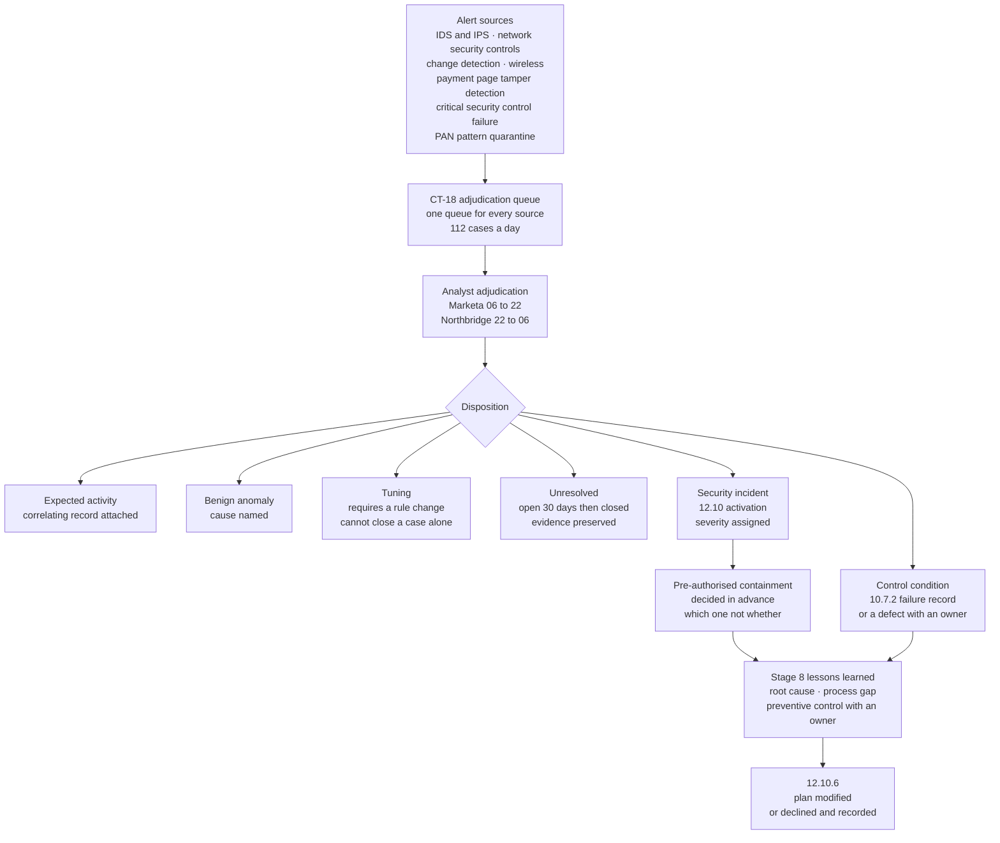

# 07.10 — Monitoring &amp; Response to Alerts

| Field | Value |
|---|---|
| Document ID | MRG-PCI-2026-710 |
| Program | Marketa Retail Group — PCI DSS v4.0.1 Compliance Program |
| Phase | 07 — Security Policy, Risk &amp; Incident Response |
| Version | 1.0 |
| Status | Approved |
| Owner | Marcus Hale, Security Operations Manager |
| Approver | Naomi Bhatt, Chief Information Security Officer |
| Date | 2026-07-15 |
| Classification | Confidential — Cardholder Data Environment // Illustrative Portfolio Sample |

## Purpose

Phase 06 built the detection estate: 612 log sources, 187 version-controlled rules, intrusion detection across both cardholder data environment perimeters and five critical points within, change detection on all 71 assessed components, wireless scanning across 488 facilities, ten classes of critical security control system asserted independently of their own health reporting, and a mechanism that evaluates Marketa's six payment pages as a consumer's browser receives them.

**None of that is incident response.** 12.10.5 is the requirement that joins them: the incident response plan must **include monitoring and responding to alerts from security monitoring systems**, and it names the systems — intrusion detection and prevention, network security controls, change-detection mechanisms for critical files, detection of unauthorised wireless access points, and, as one of the requirements that became mandatory on 2025-03-31, **the change- and tamper-detection mechanism for payment pages**.

12.10.6 is the other half of the same joint, running backwards: the plan is **modified and evolved according to lessons learned and to incorporate industry developments.** Detection feeds response, and response feeds the plan. An entity with excellent detection, a competent response team and no mechanism connecting either to the document has three things that are individually fine and a control that does not exist.

This document sets out the alert sources and their routes, the single adjudication queue and the severity mapping into the plan, the triage path, **what actually happens at three in the morning**, the year's incident population, and the nine amendments the lessons-learned loop produced — including the one it declined to make and recorded as declined.

## 1. 12.10.5 — the Named Sources, and What Each Produced

| Source class named by 12.10.5 | Marketa's mechanism | Volume in the operating period | Route | Declared incidents |
|---|---|---|---|---|
| **Intrusion detection and prevention** | 11.5.1 sensors at both CDE perimeters and **five critical points within**; inline prevention with full flow recording at the Z3-to-Z1 crossing | **1,914** sensor alerts reaching adjudication | CT-18 queue; P1 pages both on-call roles | **31** |
| **Network security controls** | Zone boundary policy, the 1.2.2 change-controlled rule sets, and **CSC-1** synthetic traffic probes asserting every five minutes that a denied flow is still denied | Boundary and policy-commit events feeding the 187-rule set; **2** CSC-1 failures | CT-18; a policy-commit divergence is a 10.7.2 failure and an incident, not a service ticket | **2** |
| **Change-detection mechanisms for critical files** | **11.5.2** across all **71** components with a weekly full baseline comparison; **CSC-3** proved weekly by a deliberate benign change on a canary path that must alert | File integrity events across the estate; **2** CSC-3 failures | CT-18 | **2** |
| **Detection of unauthorised wireless access points** | **11.2.1** quarterly scanning across **488 of 488** facilities — 1,952 facility-scans, no sampling | **16,955** unknown radios observed; **3** attached to a Marketa network | Immediate; **12.10.5 invoked for each**, as a security incident and not a network fault | **3** |
| **The change- and tamper-detection mechanism for payment pages — 11.6.1** | Continuous evaluation from **outside** Marketa's networks across 192 permutations every 30 minutes, plus ~4.1M real-browser digests; **TAM-1 to TAM-7** | **214** alerts; median detection **9 minutes**; **0** exceeding the 24-hour ceiling | CT-18; **a 12.10 incident record opens automatically at P1** | **3** |
| ***Marketa's addition*** — **critical security control system failure, 10.7.2** | **CSC-1 to CSC-10**, asserted independently of their own health reporting | **21** recorded failures | CT-18, with a mandatory security-issue-arising analysis | **4** |
| ***Marketa's addition*** — **account data appearing where it is not expected** | The collector-side PAN-pattern quarantine rule; DLP across the messaging estate; quarterly unowned-repository discovery | **7** quarantined log records; DLP enforcement live 2026-04-10 | **12.10.7 route — P-0 to P-4** | **0 declared**, **7 reviews** — 07.11 §7 |

Two of the seven rows are additions Marketa made to 12.10.5's list, and both are worth stating as additions rather than presenting as obligations.

**A critical security control system failure is an alert about the alerting.** 12.10.5 does not name it, and 10.7.2 requires only that it be detected and responded to promptly. Marketa routes it through the incident process because a control that has stopped working is the condition under which every other row in this table produces silence, and silence is indistinguishable from safety until somebody asserts otherwise.

**A PAN-pattern hit is not an attack.** It is usually a process failure, and treating it as a monitoring event that produces a ticket rather than an incident is how four unexpected PAN locations existed for up to seven years without anybody noticing. 12.10.7 is delivered in 07.11; its detection layer belongs here.

## 2. One Queue

Every alert in §1 becomes a case in **CT-18**, the same adjudication queue as every other detection, handled by the same analysts against the same disposition set.

| Design decision | The alternative Marketa rejected | Why |
|---|---|---|
| **One queue** | A dedicated console per detection technology, each with its own watcher | **A second queue is the one nobody is looking at.** 06.07 §5.2 states the principle; the tamper-detection mechanism was deliberately routed into the general queue rather than given the specialist console its vendor supplies |
| **Six dispositions, and a tuning disposition must produce a rule change** | A free-text closure reason | Otherwise *tuning* becomes the closure reason for anything inconvenient, the rule keeps firing, everybody learns to ignore it, and that is the state preceding every missed alert in every post-mortem ever written |
| **An unresolved case is closed as unresolved, with the evidence preserved** | Closing it as benign | **4.7%** of cases were unresolved and the figure is reported rather than eliminated. A queue with no unresolved rate is a queue whose analysts have learned which answer closes a case |
| **Rules declare their source dependencies** | A rule that silently stops firing when its source fails | The direct treatment of **R-28**. A failed dependency degrades the rule's status explicitly. **CSC-9** treats the review mechanism itself as a control system |

### 2.1 The severity mapping

Detection severities and incident severities are different scales and the plan maps them explicitly, because an alert priority is a statement about how fast to look and an incident severity is a statement about what is at stake.

| Detection priority | What it means | Incident consequence | Response commitment |
|---|---|---|---|
| **P1** | An unrecognised script on a payment template; a frame or form target change; a field-observed destination outside the allow-list; a DOM overlay over the payment frame; an intrusion signature on a CDE path; a critical security control failure on a CDE-serving control | **An incident record opens automatically**, at **SEV-3 minimum**, and the on-call responder must assess for SEV-2 or SEV-1 within the first hour | Acknowledged in **15 minutes**; containment decision in **60** |
| **P2** | Third-party script content change with no correlating vendor notice; a security header removed or weakened; a delivery-chain change; a critical security control failure on connected-to components | Case in CT-18; incident record opened on the analyst's determination | Acknowledged in **30 minutes** in hours, **1 hour** overnight; disposition in **4 hours** |
| **P3** | A change correlating to an approved release or a vendor notice; a DOM change on a non-payment region | Case; incident only if the correlation fails | Disposition within the operating day |
| **P4** | A difference the correlation layer matched to an approved Marketa release | Recorded, auto-closed, **sampled monthly** | Sampled |

**A P1 opens an incident record before a human has decided anything.** That is ADR-0026's rule expressed in the tooling rather than in the plan: the machine activates on suspicion, and the human's first job is to assess severity rather than to decide whether an incident exists.

## 3. The Triage Path

## 4. What Happens at Three in the Morning

The honest answer is that it depends on the priority, and the plan says which signals wake a person and which do not. An entity whose plan implies that everything wakes somebody has a plan that will wake nobody within a quarter, because the roster will stop answering.

| Time | Actor | What happens |
|---|---|---|
| 03:00 | The mechanism | The alert fires. For the payment-page detector this is one of 192 permutations evaluated every 30 minutes from outside Marketa's networks; for the intrusion sensors it is a signature on a monitored path; for **CSC-1** it is a synthetic probe finding that a denied flow is no longer denied |
| 03:00 + seconds | CT-18 | The case is created with its source, its priority and its declared dependencies. **At P1 an incident record opens automatically** |
| 03:00 + minutes | **Northbridge**, on the 22:00–06:00 watch | First-line triage against the agreed use-case set. Northbridge can see what it needs and **cannot export**. Northbridge does not decide whether this is an incident |
| **Within 15 minutes at P1** | The **Marketa on-call security responder** | Paged directly, in parallel with Northbridge rather than after it. Acknowledges. **May declare up to SEV-2 without approval and may not seek approval before declaring** |
| Within 30 minutes | The domain on-call | E-commerce for a payment-page P1; infrastructure for a boundary or host P1. **Holds pre-authorised containment**: the e-commerce engineer may tighten the Content Security Policy at the edge unilaterally, in seconds, reversibly, with no release |
| Within 60 minutes | The responder | **Containment decision made** — which pre-authorised option, not whether one is permitted. A scribe is appointed if the incident is SEV-2 or above |
| At declaration of SEV-1 | The **duty Incident Commander** | Wakes. Assumes authority. The 24-hour determination clock starts, and the Audit Committee Chair is notified inside 24 hours on a route that does not pass through the CIO or the CFO |
| 06:00 | Handover | Northbridge to Marketa security operations, with the case state and the open actions. The **09:00 daily review** covers the preceding 24 hours with a named reviewer and a signed record |

**Two measurements make that table more than an intention.** The quarterly Northbridge handover test injects an unannounced P2 case at 03:00; **all four passed and the slowest acknowledgement was 6 minutes.** The quarterly unannounced out-of-hours activation test pages the Marketa responder for real and requires a genuine declaration and containment decision; three produced acknowledgements at 4, 9 and 11 minutes, and **the fourth, at 02:47 on 2026-08-19, produced no acknowledgement from the primary at all** — reported in 07.09 §2.4 with its cause and its remediation.

### 4.1 The overnight signal that did not wake anybody, and was right not to

At **00:00 on 2026-06-19**, a new archive bucket prefix did not inherit the object-lock policy, and nine hours of one log class was archived without immutability. **CSC-7** detected the condition. It was a P2 on a connected-to control path, it was queued to Northbridge with a one-hour acknowledgement rather than paging the on-call responder, and it was closed at **09:05** — a duration of **9 hours 5 minutes**, recorded in the 10.7.2 failure register as **F-14**.

Nobody was woken and the plan says nobody should have been. The record then does the thing that makes the decision defensible rather than convenient: it asks whether a security issue arose in the window, and answers it with evidence — **no modification occurred, and the hash chain over the window verifies.** The lock policy was moved from prefix level to account level.

**A plan that wakes people for everything is a plan that will be ignored at the one alert that mattered.** The corollary is that the decision not to wake somebody has to be made in advance, in writing, by priority class, and has to be revisited whenever a queued alert turns out to have been the important one. That has not yet happened at Marketa, and the sentence is written in the present perfect deliberately.

## 5. The Incident Population

| Measure | Value |
|---|---|
| Cases adjudicated | **112 per day**, with a zero-aged queue on every one of **365** operating days |
| **Incident records opened** | **512** across the operating period — the 1.2% of cases escalated under 12.10, plus escalations arriving from wireless scanning, tamper detection, 10.7.2 and human report |
| **SEV-1** | **0** |
| **SEV-2** | **5** |
| **SEV-3** | **49** |
| **SEV-4** | **458** — closed at first triage with a determined cause |
| Median time from alert to acknowledgement, P1 | **7 minutes** |
| Incidents closed without completing stage 8 | **0.** An incident does not close until root cause, process gap and a preventive control with an owner and a date are recorded |

### 5.1 The five SEV-2 incidents

| # | Incident | Source | Why SEV-2 and not SEV-1 | What it produced |
|---|---|---|---|---|
| 1 | **An unauthenticated administrative interface on a CDE component**, reached by a penetration tester from an assumed-compromise position on **2026-09-16** | Test, not detection — and that is the finding | The interface permitted a path to account data. **Complete enumeration of all 47 sessions to that port across the 176-day window established that nothing else reached it** — an answer, not a search that found nothing | Authentication moved into the application across all nine applications; a daily listener assertion; **SIG-4** amended; **TRA-09 trigger T1** fired |
| 2 | **A third-party vendor changed the code executing on Marketa's payment pages four days before telling Marketa** | **11.6.1**, in 11 minutes | The Content Security Policy blocked the undeclared destination the new version attempted; no account data path was open | Contract remedy at renewal — **OI-06-08**; the vendor's migration onto the tag proxy raised in priority |
| 3 | **A payment-page security header regressed three weeks after it was fixed** | **11.6.1**, twice, and independently by the penetration test | A weakened header is an exposure, not a compromise | **Detecting the same thing twice is a signal that the remediation was at the wrong layer.** A header assertion now sits in the release gate |
| 4 | **A hotfix reached three payment templates without a reconciled manifest** | **11.6.1**, in **14 minutes**, from outside, with no prior knowledge of what was going to change | Marketa's own engineers, Marketa's own code, no unauthorised content | Every publication route to the payment-page origin now emits a manifest or fails |
| 5 | **The daily segmentation-determining configuration assertion failed to run for four consecutive days** across the store estate — **F-18** | **CSC-8**, by its own absence | Four days in which a divergence would not have been detected within 24 hours. **Retrospective assertion against the retained configuration snapshots found no divergence** | The job's service-account session handling corrected; the assertion's own execution added to the monitored set |

**Three of the five were Marketa's own doing**, which is the harder detection case and the more useful result: a mechanism that only catches outsiders is a mechanism that has never been tested against the party with legitimate access.

## 6. 12.10.6 — Lessons Learned and Industry Developments

### 6.1 The loop, and the rule that keeps it honest

> **ADR-0028 — A lesson either changes the plan or is recorded as declined.**
>
> Stage 8 of every incident produces a proposed change. The proposal goes to the plan owner and receives one of two answers: **adopted**, with a version number and a date, or **declined**, with a reason recorded in the same register. Marketa adopted the rule after observing the failure mode it prevents — a lessons-learned register that accumulates good observations nobody ever actioned, which reads as diligence and functions as a filing cabinet. **Eleven lessons were raised in the period. Nine were adopted and two were declined, and the two declined are §6.4.**

### 6.2 The nine amendments, and where each came from

The plan moved from **v2.0** to **v3.0** at the 12.10.2 annual review, approved 2026-07-15.

| # | Amendment | Driver | Class |
|---|---|---|---|
| 1 | **NOT-1 may and must be discharged on an `undetermined` determination**, with the outer bound from suspicion to notification stated as 48 hours | **TTF-2** — the exercise determination took 9 hours 20 minutes | Lessons learned |
| 2 | Pre-authorised containment re-expressed against **incident severity** rather than alert severity, so the payment-page options are available however the incident arrived | **TTF-5** | Lessons learned |
| 3 | **Annex A** extended with a *who decides what* table covering PFI engagement and brand direction | **TTF-4** | Lessons learned — and industry, since the brand procedures are the source |
| 4 | Contact register verification now calls the **out-of-hours number at a randomised hour** | **TTF-3** — a full voicemail box that twelve monthly verifications had passed | Lessons learned |
| 5 | A monthly automated **critical-alert delivery test to every roster device** | The 2026-08-19 activation test, where a do-not-disturb exemption had been lost at an operating system update | Lessons learned |
| 6 | An **operational incident runbook agreed with Truvance's incident team**, naming a contact, a request format and a target for incident-driven token resolution | **TTF-1**, the exercise's disproof | Lessons learned |
| 7 | **IR-P2 rewritten around the vendor-release case**: a legitimate, authorised third party changing an authorised script is now the playbook's primary scenario rather than its edge case | SEV-2 incident 2, and the industry pattern behind it | **Industry development** |
| 8 | **IR-P4 extended for double-extortion ransomware** — the exfiltration-then-encrypt pattern, where restoring from backup resolves availability and resolves nothing else | Retail and Hospitality ISAC briefing; the threat briefing prepared for the penetration testers under **PTM-8** | **Industry development** |
| 9 | **IR-P9 extended to media and to cloud object stores** as first-class locations rather than as variants of a file | The four Phase 02 findings, and the collector-side quarantine rule's 7 hits | Lessons learned |

### 6.3 Industry developments, tracked deliberately

12.10.6 names industry developments alongside lessons learned, and an entity that only ingests its own incidents evolves its plan against the threats it has already survived.

| Source | What it feeds | Cadence |
|---|---|---|
| **Retail and Hospitality ISAC** | POS malware families; e-commerce skimming tradecraft; seasonal fraud patterns | Continuous; formally reviewed quarterly |
| PCI SSC bulletins and supplementary guidance | The future-dated requirement set; guidance on 6.4.3 and 11.6.1 | On publication |
| Card brand programme updates through **Cardinal** | Compromise handling expectations; validation changes | On issue |
| Provider security advisories — Truvance, Cadence, Verition, Northbridge | Provider-side incident classes Marketa would inherit | On issue; reviewed at the quarterly TPSP review |
| Penetration testers and the QSA | Tradecraft observed elsewhere in the sector, generalised | At each engagement and each monthly checkpoint |

### 6.4 The two lessons that were declined

| Proposed change | Why it was declined |
|---|---|
| **Add a dedicated payment-page incident console with its own overnight watcher**, proposed after the second page-integrity incident | Declined. **A second queue is the one nobody is looking at.** The proposal would have improved the response to the class of incident Marketa had just had, at the cost of the class it had not. The detection stays in CT-18 |
| **Lower the wireless detection response from an incident to a network fault**, proposed on the basis that all three rogue access points in the year were installed by colleagues solving ordinary problems | Declined, and the reasoning is recorded at length. **The intent of the person who plugs in an access point is not visible at detection time**, and 11.2.1 obliges 12.10.5 incident response to be invoked on detection. The three cases produced a procurement standard and a contractor equipment reconciliation — **process changes, not a downgrade** |

**The second declined proposal is the more instructive.** It came from the right instinct — three incidents, three benign causes, an obvious inference — and the inference is only available in retrospect. A response process calibrated on the outcomes of the events it has already handled will be calibrated wrongly for the first event that is different.

## 7. Requirement Coverage

| Sub-req | Position | Evidence |
|---|---|---|
| **12.10.5** | **Met** — the plan includes monitoring and response for every source class the requirement names: **intrusion detection and prevention** (1,914 alerts, 31 incidents), **network security controls** (CSC-1 synthetic assertion every five minutes), **change detection for critical files** (11.5.2 across all 71, CSC-3 proved weekly), **unauthorised wireless access points** (488 of 488 facilities, 3 detections, 12.10.5 invoked for each), and **the change- and tamper-detection mechanism for payment pages** (11.6.1, 214 alerts, median 9 minutes, 0 exceeding the 24-hour ceiling, automatic incident opening at P1). Marketa additionally routes **10.7.2 control failures** and **PAN-pattern detections** through the same process | The CT-18 case records; the 512 incident records; the 11.6.1 alert and disposition records; the wireless scan attestations; the 10.7.2 failure register; the disposition rules |
| **12.10.6** | **Met** — the plan modified from v2.0 to **v3.0** with **nine amendments**, six from lessons learned and three from industry developments, each traced to a named incident, exercise finding or intelligence source; **two proposals declined with reasons recorded** under **ADR-0028** | The plan version history; the lessons-learned register with 11 entries and 2 declines; the exercise findings; the quarterly ISAC review records |
| **11.2.1's 12.10.5 limb** | **Met** — incident response invoked on all three detections, each treated as a security incident rather than as a network fault | 06.07; the three incident records |
| **11.6.1's alerting limb** | **Met** — four severity classes into the same adjudication queue with named responders, pre-authorised containment and automatic 12.10 incident opening at P1 | 06.09; **8 P1 alerts, all acknowledged inside 15 minutes** |

## 8. What This Document Does Not Claim

| Limitation | Statement |
|---|---|
| **Zero SEV-1 incidents is not evidence that none occurred** | It is evidence that none was **detected and declared**. The 46 techniques executed under quarterly controlled execution produced 42 detections and **4 misses**, and the misses describe the edge of the rule set. A compromise using one of those four would not have appeared in §5 |
| **512 incident records and 458 closed at SEV-4** | The distribution is what ADR-0026 predicts and it is also what a queue looks like when it is being fed by an over-sensitive rule set. Marketa reports the number rather than tuning toward a comfortable one, and the **4.7% unresolved rate** is reported for the same reason |
| **The payment-page mechanism cannot prevent anything** | Every minute between a modification and an alert is a minute in which roughly thirty checkouts complete on a page nobody has examined. **Nine minutes is not zero**, and the control's value is a function of how fast a human acts on what it says |
| **Nine amendments in a year is a plan being read** | It is not evidence that the plan is now correct. Six of the nine came from a single exercise, which means the plan's improvement rate is currently bounded by how often Marketa runs exercises |
| **The 03:00 path has been tested eight times** | Four Northbridge handover tests and four unannounced activation tests, across a year containing roughly 2,900 hours of the overnight window. **One of the eight found a failure**, which is a better argument for testing more often than for confidence |

## Cross-References

| Reference | Relevance |
|---|---|
| 06.01 — Logging Strategy &amp; Architecture | The 612 sources, the after-hours boundary, and the collector-side PAN quarantine rule |
| 06.03 — Automated Log Review | **187 rules**, the six dispositions, the tuning rule, the 4.7% unresolved rate and the 512 escalations |
| 06.04 — Time Synchronisation &amp; Failure Detection | **CSC-1 to CSC-10**; the 21 failures; **F-14** and **F-18** |
| 06.07 — Wireless &amp; Intrusion Detection | 11.2.1 and 11.5.1; the three rogue access points; the one-queue principle |
| **06.09 — Payment Page Tamper Detection** | **11.6.1**, the four severity classes, the pre-authorised containment options and the three page-integrity incidents |
| 06.10 — Third-Party Service Provider Management | The Northbridge responsibility matrix that bounds what an outsourced watch may decide |
| **07.08 — Incident Response Plan** | The severity model, **ADR-0026**, and the ten playbooks these alerts activate |
| **07.09 — Incident Response Testing &amp; Training** | The six exercise findings that produced six of the nine amendments |
| **07.11 — PAN Found Where Unexpected** *(next)* | The 12.10.7 route the last row of §1 feeds |
| **07.12 — Control-to-Risk Traceability** | **R-28**, **R-11**, **R-25** and **R-43** — the entries this document's controls treat |
| Phase 08 — QSA Assessment &amp; ROC Production | 12.10.5's source coverage and 12.10.6's amendment history, both sampled |

---
[⬅ Previous](07.09-incident-response-testing-and-training.md) · [🏠 Phase 07 Home](07.00-README.md) · [Next ➡](07.11-pan-found-where-unexpected.md)
