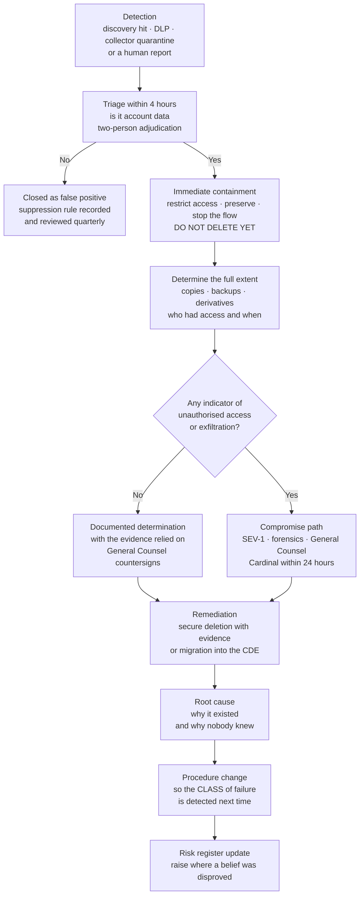

# 07.11 — PAN Found Where Unexpected

| Field | Value |
|---|---|
| Document ID | MRG-PCI-2026-711 |
| Program | Marketa Retail Group — PCI DSS v4.0.1 Compliance Program |
| Phase | 07 — Security Policy, Risk &amp; Incident Response |
| Version | 1.0 |
| Status | Approved |
| Owner | Elena Marchetti, VP Payment Operations |
| Approver | Naomi Bhatt, Chief Information Security Officer |
| Date | 2026-07-15 |
| Classification | Confidential — Cardholder Data Environment // Illustrative Portfolio Sample |

## Purpose

**Requirement 12.10.7** obliges an entity to have incident response procedures **in place, to be initiated upon the detection of stored PAN anywhere it is not expected**, including determining what to do if PAN is discovered outside the cardholder data environment. The requirement names three things those procedures must cover:

1. **Determining what to do** if PAN is discovered outside the CDE — including **identifying whether the PAN is in an unexpected location**;
2. **Securely deleting it, or migrating it into the currently defined CDE**;
3. **Determining how it got there, and remediating the data leakage or process gaps** that resulted in it being there.

It is one of the 51 requirements that were best practice until **2025-03-31** and are now mandatory. **2026 is Marketa's first assessment with it in force.**

Marketa's position on this requirement is unusual and this document states it plainly at the front rather than arranging it into something more flattering. **The procedures were written in Phase 02, in January and February 2026, in response to four real discoveries, before the requirement was formally documented as a control in Marketa's programme.** Marketa entered its discovery exercise with a general incident response plan that assumed an incident meant an attacker, found account data in a place nobody expected it on the fifth day, and wrote the first procedure the day after that. That is not the order anybody would choose. It is the order that produced procedures that work, and it is recorded honestly for the same reason the rest of the portfolio is.

**The third limb is the one entities skip.** Securely deleting the PAN is the easy part — a deletion command and a manifest. Determining how it got there and fixing the process gap is the requirement, and **all four of Marketa's procedures exist because that limb was taken seriously.** Take it out and Marketa would have four deletion records and four locations that would have refilled.

## 1. What "Unexpected" Means at Marketa, and Why the Answer Is Unusual

12.10.7's first limb obliges the entity to identify **whether the PAN is in an unexpected location**. That is a comparison, and it requires the entity to have written down where PAN is *expected*.

| Question | Marketa's answer |
|---|---|
| Where does Marketa **expect** to find stored primary account numbers? | **Nowhere.** The set is empty |
| Why | P2PE encrypts at swipe or tap in 1,914 lanes; the e-commerce checkout is a **Truvance-hosted iframe** and PAN never reaches a Marketa server; the call centre suppresses DTMF upstream of the agent and the recorder; and the **token vault is Truvance's**. Marketa stores **tokens and truncated PAN only** |
| So what is the identification test? | Trivially simple and deliberately absolute: **any stored PAN found on any Marketa-controlled asset is, by definition, in an unexpected location.** There is no allow-list to check against and no legitimate store to exclude |
| The one exception, which is temporary by construction | The **quarantine, hold and adjudication locations** created during a 12.10.7 response itself — an encrypted, access-controlled volume inside the CDE, and the hold location for material under a preservation obligation. These are expected **for the duration of the response and no longer**, are recorded as CDE while they hold data, and are closed on the manifest |

**Most merchants cannot write that table.** An entity that stores PAN legitimately in three applications has to maintain an expected-locations register, keep it current, and answer the identification question against a moving baseline — and the register becomes the control. Marketa's scope reduction removed that problem and replaced it with a different one, which §8 states: an empty expected set makes identification easy and makes **detection** the entire control, because there is no reconciliation step that would catch what discovery misses.

## 2. The Position, Stated Plainly

| Fact | Position |
|---|---|
| Procedures existed at the start of Phase 02 | **No.** A general incident response plan under 12.10.1 existed and assumed an incident meant an attacker |
| First finding | **2026-01-28** — the legacy chargeback dispute file share, on the first pass of the share crawler, five days into the exercise |
| First procedure written | **2026-01-29** — the day after |
| Findings handled under a procedure written mid-exercise | **All four** |
| Procedures at the end of Phase 02 | **Five** — **P-0**, a general procedure, and **P-1 to P-4**, one per finding class |
| Formal delivery of 12.10.7 as a requirement | **This document**, Phase 07 |
| Second full discovery run | **2026-08-17 to 2026-08-28**, across the same 1,842 systems, 41 shares, 6 archives and the restored backup sets — **zero account data instances** |
| Detections since | **7** collector-side log-record quarantines, each producing a 12.10.7 review; **0** confirmed stored-PAN locations |

**Marketa exercised the procedure for real before writing it down, and that sequence has a specific consequence worth naming.** A procedure derived from four real events is calibrated on how the events actually behaved — that OCR of a faxed dispute packet produces malformed candidates requiring visual adjudication, that a recording estate cannot be quarantined without a plan for the contact centre, that a preservation obligation and a deletion instruction will conflict, that a backup set under a retention lock cannot be surgically edited. **None of those would appear in a procedure written from the requirement text.** The requirement text does not know that faxes exist.

## 3. P-0 — the General Procedure

P-0 governs every detection and the four class procedures extend it. It was written on 2026-01-29 and has been amended twice since.

Three provisions of P-0 carry most of its value.

**Containment precedes deletion, always.** The instinct on finding a card number is to delete it. Deleting it destroys the evidence needed to establish extent, access history and root cause — which means it destroys the ability to answer the only question the acquirer will ask, and the ability to satisfy the requirement's third limb.

**The decision *not* to escalate is documented as carefully as a decision to escalate.** "We concluded there was no compromise" is a determination somebody will want to see the basis for, possibly years later. All four Phase 02 determinations were made jointly by the CISO and the General Counsel and countersigned by both, and **the PAN-02 determination records that the file-server access logs did not extend back far enough, as a limitation rather than as something resolved by inference.**

**The procedure is not complete until the root cause is recorded and a preventive control is assigned an owner and a date.** That is the third limb, expressed as a closure condition. An instance cannot be closed by deletion alone.

## 4. The Four Class Procedures

Each of the four exists because a real finding exposed a class of location the general procedure did not handle, and — the requirement's third limb — a process gap that would have refilled the location if only the data had been removed.

| ID | Procedure | Class of location | The finding that produced it | What the process gap was | Detective control now in place |
|---|---|---|---|---|---|
| **P-1** | **Account data discovered in media** — estate quarantine without service interruption; dual-control audio adjudication; deletion manifest that evidences destruction without reproducing the data; handling a preservation obligation that conflicts with a deletion instruction; **retrospective review whenever a capture-affecting control changes** | Audio, video and image media — call recordings, QA archives, CCTV, scanned imagery | **PAN-01** — **~11,400 call recordings** in the QA archive containing an audible PAN, spanning 2019-03 to 2023-06; PAN in all 11,400 and expiry additionally in 8,940; **no CVC, no track data, no PIN**. Detected 2026-02-03, contained the same day, remediated 2026-03-27 | **A control was deployed and nobody asked what it meant for the data that already existed.** DTMF suppression prevents account data entering recordings made *after* deployment and never claimed otherwise; the organisation reasoned from the control to a state of the world, and the control was newer than the world. Contributing: seven-year retention outliving the process it served, and an archive that was a storage tier rather than a system, so it appeared in no inventory | Speech-recognition sampling of the recording estate on a scheduled cycle; retention reduced from seven years to **13 months** under a 12.3.1 analysis; and the standing rule that **any change to a control affecting what is captured triggers a retrospective review of what was captured before it** — the control that generalises the finding |
| **P-2** | **Account data in unstructured repositories with no owning application** — named individual owner and explicit retention rule mandatory for every repository; unowned-repository discovery as a standing quarterly task; deletion evidenced by manifest **and** post-deletion re-scan; the pre-approved immutable-backup exception pattern | Network shares, collaboration sites and document repositories with no owning system | **PAN-02** — **2,187 scanned dispute documents** on an unowned SMB share, plus **33 copies** in Ashburn backup sets. Full PAN, cardholder name and expiry, legible on issuer packets, 2017 to 2021, **unencrypted**, accessible to a 63-member inherited group of whom **22** had no dispute role. Detected 2026-01-28, contained the same day, remediated 2026-02-13; backup copies tracked to natural expiry **2026-05-31** | **A migration project scoped to move the process and not to retire the data.** The 2021 move to Truvance's dispute portal was completed properly; the archive was simply never dispositioned, its creator had left, ownership was recorded as a department, and a department cannot make a retention decision. **The project's definition of done was "cases are in the portal", not "the old data is gone"** | Quarterly unowned-repository discovery reconciled across three independent enumeration methods; a mandatory named individual owner and retention rule for every repository; and a **data-disposition step in the definition of done of every migration project**, signed off by the receiving process owner |
| **P-3** | **Decommissioning as a data event** — no CMDB status change to decommissioned without a completed discovery scan of every attached storage volume, a named data-destruction attestation, and, for cloud resources, evidence of **termination and volume and snapshot deletion**. Standing rule: **stopped is not terminated** | Orphaned and decommissioned assets — retained volumes, snapshots, stopped instances, retired hosts | **PAN-03** — a **1.4 GB application debug log containing 1,143 distinct PAN instances** on an EC2 instance recorded as decommissioned in 2024 but **stopped, not terminated**, with a 400 GB volume and a retained snapshot. Detected 2026-02-09, contained the same day, remediated 2026-02-16. The CVC field was redacted and the PAN was not, because the redaction **deny-list** named `cvv`, `cvc`, `securityCode` and `pin`, and the field was called `cardNumber` | **Two gaps, and the second is the general one.** A decommissioning process with no data-destruction gate, in which "decommissioned" was a status in a database that nothing reconciled against the cloud provider's inventory. And a **temporary configuration change with no closure check** — a log level raised to `DEBUG` under a ticket during a 2022 incident and never reverted, for seven months. **A deny-list redacts what somebody remembered; an allow-list emits only what somebody authorised** | Monthly reconciliation of the assessed register against **four** inventory sources including the AWS inventory APIs; **CSC-10** making a reconciliation failure a 10.7.2 event; pattern-based log redaction replacing the deny-list; a pipeline guardrail rejecting any production deployment configured with a debug log level; and a change-closure check requiring every temporary change to carry a revert action with a verification step |
| **P-4** | **Unsolicited account data received by message** — do not forward, do not reply with the data quoted, do not print; report to security operations within one hour; the team purges every copy including journals with e-discovery evidence; the customer receives a safe payment route in reply. **Reporting is expected and is never penalised**, and that instruction is repeated in the awareness content | Inbound customer-initiated account data — email, chat, message, and anything a customer sends unprompted | **PAN-04** — a spreadsheet of **34 records** collated by a store manager from 34 customers who emailed their own card details to a published store address, present in **11 copies** across 3 mailboxes and 2 archives once forwards and journal copies were counted. Detected 2026-02-11, contained 2026-02-12, remediated 2026-02-24. **4.2.2 breached, squarely** | **An awareness programme that covered the prohibition and not the response.** Colleagues were told never to ask a customer for card details by email; nothing told them what to do when a customer sends them anyway, which is the situation that actually occurs. Compounded by the absence of any DLP rule in the messaging estate, and by there being **no compliant route as fast as the non-compliant one** for a store manager trying to get 34 orders processed before the seasonal cut-off | **DLP live 2026-04-10**: inbound messages containing a Luhn-valid PAN are quarantined and the sender receives an automated reply explaining how to pay securely; outbound and internal messages are blocked with the sender and security operations notified. Plus a store-facing module, and store special orders changed so a customer wanting to prepay is sent a **Truvance-hosted payment link** — **the compliant path is now the fast path** |

### 4.1 The pattern across all four

Read the fifth column on its own and the four findings stop looking like four accidents.

| Finding | The gap, in one line |
|---|---|
| PAN-01 | A new control was assumed to describe the past |
| PAN-02 | A completed migration was assumed to have retired what it replaced |
| PAN-03 | A status in a database was assumed to describe a machine |
| PAN-04 | A prohibition was assumed to constitute an instruction |

**Every one is an assumption about a state of the world, held sincerely, on good grounds, and untested.** None of them is a control failure in the ordinary sense; three of the four involved controls that worked exactly as designed. That is why the third limb produces procedures rather than deletions: the data was a symptom, and the four symptoms had four different diseases.

## 5. Limb 2 — Delete Securely, or Migrate into the CDE

The requirement offers two dispositions and Marketa used both. The decision rule is written down, because it is made under pressure and the wrong answer in either direction is expensive.

| Disposition | When it applies | Evidence required | Instances |
|---|---|---|---|
| **Secure deletion** | The default. The data has no live business need, or the need can be met from a system that holds tokens instead | A **deletion manifest** carrying identifier, date and deletion timestamp and **no account data**; plus a **post-deletion re-scan** of the location returning zero. For cloud resources the API call records are the destruction evidence — **there is no certificate for an EBS volume** | 11,400 recordings; 2,187 documents; 1 debug log with 1,143 instances; 11 message copies and the 34 originating customer emails |
| **Migration into the currently defined CDE** | The data is subject to a live preservation obligation, or a live business process genuinely requires it and cannot be re-created from tokens | The migration destination is treated as CDE and controlled as CDE — encrypted, access-restricted, logged — with a **documented review date**, because a hold with no review date is a new archive | **11 recordings** under a live preservation obligation, moved to an encrypted access-controlled hold inside the CDE; **19 dispute documents** for two chargebacks still in lifecycle, **re-created in the Truvance portal by case reference** and the originals destroyed |
| **Neither — the documented exception** | Surgical deletion is not available, as with an immutable backup set | A formal exception with an owner and an **expiry date**; restore rights reduced to two named individuals with dual authorisation; a technical control requiring documented approval for any restore; and expiry verified by **catalogue evidence, not assumed from the retention policy** | **33 Ashburn backup sets**, last set aged out **2026-05-31**, five months before QSA fieldwork |

**The exception row is the one worth reading twice.** Purging selected objects from a retention-locked backup would have required either breaking the lock — degrading a control that matters more than the finding does — or restoring, editing and rewriting whole sets, which multiplies handling of the data it is meant to protect. Marketa took the third option, documented it, and **added it to P-2 as a pre-approved handling pattern so the next team facing an immutable copy does not have to invent the answer under pressure.**

There is a discipline underneath all three rows that the programme states in every document where it arises. **A location holding account data is a CDE system for as long as it holds it.** The quarantine volumes, the isolated analysis environment and the hold location for the 11 preserved recordings were all treated as CDE during the response and controlled accordingly, and each transition was recorded in the scope determination rather than quietly reversed. Handling a card data finding in an uncontrolled environment because it is "only temporary" is how a discovery exercise creates the exposure it was run to find.

## 6. Limb 3 — the One Entities Skip

### 6.1 Why it is skipped

The third limb asks the entity to determine **how the PAN got there** and to **remediate the data leakage or process gaps that resulted in it being there**. It is skipped for reasons that are entirely understandable and uniformly wrong.

| Reason it gets skipped | Why it does not survive contact with the requirement |
|---|---|
| The data is gone, so the exposure is gone | The exposure is gone for **that instance**. The mechanism that created it is untouched, and every one of Marketa's four locations was created by a mechanism still running on the day the data was found |
| The root cause is obvious | It rarely is. PAN-03's obvious cause was "a developer left debug logging on". Its **actual** causes were a decommissioning process with no data-destruction gate, a change process with no closure check, and a redaction design based on a deny-list — three separate remediations, none of which is "tell developers not to do that" |
| Root cause analysis is a project and the incident is closed | Which is why P-0 makes root cause a **closure condition**. An instance that cannot be closed until the cause is recorded and a preventive control has an owner and a date is an instance nobody can quietly file |
| It implicates a process somebody owns | PAN-04 implicated a store manager who was solving a real problem for 34 customers. **It was handled explicitly as a process failure, not a disciplinary matter, and the CISO recorded that decision** — because a programme that disciplines the first person caught improvising guarantees the next one hides it, and the whole value of 12.10.7 depends on people reporting account data where they find it |

### 6.2 What the limb actually produced

| Finding | Preventive controls delivered | Owner | Where built |
|---|---|---|---|
| **PAN-01** | Retrospective-review rule on any capture-affecting control change; retention cut to 13 months under a 12.3.1 analysis; scheduled speech-recognition sampling of the recording estate; **MOTO-C7** re-verified annually with continuous detective backstops beneath it | Bill Traynor with Elena Marchetti | Phase 02; verified in 07.06 §7.2 |
| **PAN-02** | Mandatory named owner and retention rule per repository; quarterly unowned-repository discovery; deletion evidenced by manifest **and** re-scan; data-disposition step in every migration's definition of done; the immutable-backup exception pattern | Elena Marchetti | Phase 02; Phase 04 |
| **PAN-03** | Pattern-based log redaction replacing the deny-list; pipeline guardrail rejecting debug log levels in production; change-closure verification for temporary changes; four-source monthly inventory reconciliation; **CSC-10** | Trevor Kim with Sonia Rendell | Phase 04; Phase 06 |
| **PAN-04** | DLP inbound quarantine and outbound blocking, live **2026-04-10**; the customer-facing automated safe-payment reply; the Truvance-hosted link for store special orders; the awareness content change that tells colleagues **what to do**, not only what not to do | Adaeze Nwosu with Marcus Hale | Phase 04; 07.04 §5 change 2 |

**Four findings produced fourteen preventive controls and one standing rule, and not one of them is "delete the data".** That is the third limb doing what it is for.

## 7. Detection Since — Keeping the Empty Set Empty

An empty expected-locations set is only meaningful if something is looking.

| Mechanism | Cadence | Coverage | Result in the period |
|---|---|---|---|
| **Full account data discovery** | Annual, plus on significant change | **1,842 of 1,842 systems**, 41 network shares, 6 email archives, plus the restored backup sets | Run 1: **4 locations**. **Run 2, 2026-08-17 to 2026-08-28: zero** |
| **Quarterly unowned-repository discovery** | Quarterly | Shares, collaboration sites, document repositories, reconciled across three enumeration methods | 4 cycles; **0** repositories holding account data; 3 unowned repositories found and assigned owners |
| **Collector-side PAN-pattern quarantine** | Continuous | Every record entering the log platform | **7** records quarantined, all from one non-CDE application's error handler, **all seven producing a 12.10.7 review** under the P-3 lineage |
| **DLP across the messaging estate** | Continuous, enforcing since 2026-04-10 | Inbound, outbound and internal mail | Inbound quarantines with automated safe-payment replies; **0** internal transmissions of a Luhn-valid PAN since enforcement |
| **Decommissioning gate** | On every status change | Every asset leaving the estate | Applied to all decommissions in the period, including the **four retired hosts** in the 12.5.2 confirmation, each with a **P-3** attestation on file |
| **Human report** | Continuous | 40,000+ colleagues, one number and one intranet button | Reporting volume is the programme's best outcome signal; colleague-raised POI reports alone rose from **4 to 27** |

### 7.1 The second full run, and what it does and does not establish

The second run is **R-31's published exit criterion**, written into the risk register in Phase 03 before anybody knew whether it would be met. It was performed **2026-08-17 to 2026-08-28**, across the same 1,842 systems, the same 41 shares, the same 6 archives, plus the restored backup sets, and it **returned zero account data instances.** Halberd certificates of destruction are on file for the disposed populations.

> **It establishes that the historical account data is gone. It does not establish that the archive could not fill again.**

That distinction is the reason the detective layer in §7 exists and the reason **MOTO-C7** is verified rather than closed. The condition that no account data remains in the recording estate was **false for seven years** and nobody knew, and the honest lesson is not that the annual verification is stronger than it looked. It is that every annual-only condition needs a detective control that runs faster than its verification cycle.

## 8. Requirement Coverage

| Sub-req | Position | Evidence |
|---|---|---|
| **12.10.7** | **Met** — incident response procedures **in place** and initiated on detection of stored PAN anywhere it is not expected: **P-0** general plus **P-1 to P-4** by class, covering (1) identification against an expected-locations set that is **empty by design**, with the temporary CDE quarantine and hold locations named as the sole bounded exception; (2) secure deletion evidenced by manifest **and** post-deletion re-scan, or migration into the CDE with a documented review date, plus the documented immutable-backup exception; and (3) **root cause and process-gap remediation as a mandatory closure condition**, which produced fourteen preventive controls across four findings. Exercised against **four real detections** before the requirement was formally documented, and against **7** further detections since | The five procedures; the four case files with containment timings, access-history analyses and countersigned determinations; the deletion manifests and re-scans; the Halberd certificates; the AWS deletion API records; the e-discovery purge evidence; the **2026-08-17 to 2026-08-28** second discovery run; the 7 collector-quarantine reviews; the **IR-P9** drill records |
| **3.2.1** | Referenced, not re-delivered. All four locations breached it for the period they existed; retention and disposal were rebuilt in Phase 04 | 02.03 §6; Phase 04 |
| **4.2.2** | Referenced. **PAN-04 breached it squarely**, inbound and internally. Marketa's outright prohibition is a **stricter policy choice** than 4.2.2's obligation to secure PAN with strong cryptography | 02.03 §6; 07.01 §4.1 |
| **12.5.2** | Each finding made its host location a CDE system for as long as it held data, and each transition is recorded as a scope transition rather than quietly reversed | 02.03 §6; 07.06 |

## 9. What This Document Does Not Claim

| Limitation | Statement |
|---|---|
| **The procedures were written after the findings, not before** | Marketa entered its discovery exercise without a 12.10.7 procedure and wrote the first one the day after the first finding. **The requirement is met at assessment; the sequence is recorded rather than tidied**, and a reader is entitled to weigh it |
| **An empty expected-locations set makes detection the entire control** | There is no reconciliation step that would catch what discovery misses. If a scan does not look somewhere, nothing else will notice — which is why the discovery denominator is **1,842 systems and not a sample**, and why ADR-0007 exists |
| **Two clean results are not a trend** | One second full run returned zero. **R-31 moves to Low on that criterion because the criterion was published in advance**, and the entry stays in the register rather than closing |
| **Remediation does not repair a disproved belief** | All four findings are remediated and the data is evidenced gone. **None of that makes A-04 true again.** A-04 and A-07 are recorded as disproved, permanently, and will not be reinstated |
| **The 7 quarantined log records were reviews, not incidents** | They were determined not to be stored PAN in an unexpected location; the reviews are the evidence of that determination. **A determination is only as good as the adjudication behind it**, and all seven were adjudicated under dual control |
| **Nothing here bears on any legal obligation** | The compromise determinations in all four cases were made jointly by the CISO and the General Counsel. PCI DSS is contractual, not statutory, and no statement here is a legal opinion or a determination of compliance with any law |

## Cross-References

| Reference | Relevance |
|---|---|
| 01.08 — Scope Assumptions &amp; Constraints | **A-04** and **A-07**, disproved; **A-05** restated in testable form |
| 01.09 — Third-Party Service Provider Register | Cadence's forward-only position, recorded **before** PAN-01 was found |
| **02.02 — Cardholder Data Discovery** | The 100% denominator and how each of the four was detected |
| **02.03 — Unexpected PAN Locations &amp; Response** | **The four findings in full**, and where **P-0 to P-4** were created |
| 02.11 — Assumption Test Results | The disproofs recorded against the assumption register |
| 04.06 · 04.08 — Vulnerability Management, Change Control | The pipeline guardrail and the change-closure check behind **P-3** |
| 06.01 — Logging Strategy &amp; Architecture | The collector-side PAN-pattern quarantine rule and its **7** hits |
| 06.05 · 06.10 | **CSC-10**; Cadence's 12.8.5 row naming **12.10.7 where PAN is found in a recording** |
| **07.06 — Annual Scope Confirmation** | Element 3 and the **second full discovery run**; **MOTO-C7** among the eight annual-only conditions |
| **07.08 — Incident Response Plan** | **IR-P9**, and the general handling sequence P-0 extends |
| **07.09 — Incident Response Testing &amp; Training** | The 12.10.7 procedure drill, run against the four findings as live case material |
| **07.10 — Monitoring &amp; Response to Alerts** | The detection layer that feeds this route |
| **07.12 — Control-to-Risk Traceability** *(next)* | **R-31**, **R-22**, **R-07** and **R-19** — the entries these procedures treat |
| Phase 08 — QSA Assessment &amp; ROC Production | 12.10.7 assessed for the first time as a mandatory requirement, against four real instances |

---
[⬅ Previous](07.10-monitoring-and-response-to-alerts.md) · [🏠 Phase 07 Home](07.00-README.md) · [Next ➡](07.12-control-to-risk-traceability.md)
