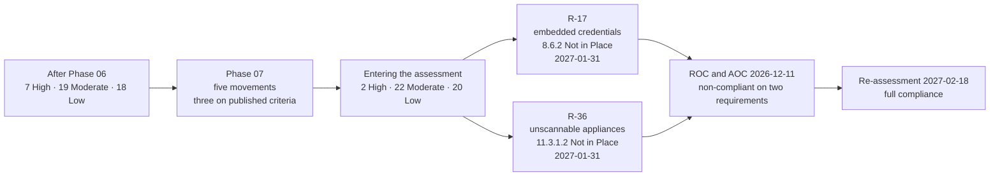

# 07.12 — Control-to-Risk Traceability

| Field | Value |
|---|---|
| Document ID | MRG-PCI-2026-712 |
| Program | Marketa Retail Group — PCI DSS v4.0.1 Compliance Program |
| Phase | 07 — Security Policy, Risk &amp; Incident Response |
| Version | 1.0 |
| Status | Approved |
| Owner | Owen Castellanos, Payment Card Compliance Manager |
| Approver | Naomi Bhatt, Chief Information Security Officer |
| Date | 2026-07-15 |
| Classification | Confidential — Cardholder Data Environment // Illustrative Portfolio Sample |

## Purpose

Every control Phase 07 delivered, mapped to the risks it treats, with the movement each risk made and the residual position the programme carries into the QSA assessment.

Phase 07 is the governance phase, and governance controls have a reputation for being untraceable to exposure — a policy suite treats everything and nothing, an awareness programme is asserted to reduce every human-factor risk, and an incident response plan is mapped to whatever the register happens to contain. **This document refuses that.** A control is recorded as *primary* for a risk only where it is the mechanism the register's own treatment column names, and the five entries that move do so on named evidence, three of them on criteria published before anybody knew whether they would be met.

The position entering the assessment is **2 High · 22 Moderate · 20 Low**. The two High entries are **R-17** and **R-36**, they are the two risks held by the programme's **two Not in Place findings**, and both carry a remediation date of **2027-01-31** — after the ROC is issued and eighteen days before the re-assessment.

## 1. The Movement Rule, Restated

Unchanged since 06.12 and restated in 07.07 §2:

> **A rating moves on measured operating evidence, never on delivery.**

| Term | Meaning |
|---|---|
| **Movement** | A change in likelihood or impact, proposed only by the risk owner, with named evidence, recorded by the Payment Card Compliance Manager. **Movement into or out of the High band requires the CISO's approval** |
| **Held** | The rating is unchanged. **Held is a determination**, and every holding carries a reason |
| **Exit criterion** | Where an entry carries a published exit criterion it moves when the criterion is met, **not when somebody argues it should** |
| **Primary** | A control is primary for a risk where it is the mechanism the register's treatment column names. Everything else is **contributing**, and contributing controls do not move ratings |
| **Closure** | Not used. Entries do not close; they move to Low and stay in the register at **44** |

## 2. What Phase 07 Delivered, and What It Treats

### 2.1 The first half — policy, analysis, people, scope

| Control delivered | Requirement | Risks treated — **primary in bold** | Document |
|---|---|---|---|
| Overarching policy MRG-ISP-00, disseminated by **DIS-1 to DIS-4** across ≈34,000 colleagues, 486 locations and 6 providers; nine amendments at the annual review | 12.1.1, 12.1.2 | **R-41**, R-40, R-43 | 07.01 |
| Four responsibility tiers; twelve named requirement owners with individually named responsibilities for the T3 population; acknowledgement fused to training at **97.1%**; formal 12.1.4 assignment to the CISO with an Audit Committee line | 12.1.3, 12.1.4 | **R-12**, R-41, R-38 | 07.01, 07.05 |
| Acceptable use policy and the fourteen topic-specific policies with **61** operational procedures; the `x.1.2` understanding limb tested by unannounced interview across seven teams — **42 of 46** | 12.2.1, every `x.1.1` and `x.1.2` | **R-21**, R-22, R-43 | 07.02 |
| **Fourteen targeted risk analyses consolidated** with owners, review dates and trigger sets; **12.3.3** cryptographic review; **12.3.4** technology currency review | 12.3.1–12.3.4 | **R-24**, R-36, R-27, R-04 | 07.03 |
| Awareness programme **AW-1 to AW-6**, multiple methods, annual review with seven changes, **97.1%** completion against a ≥95% bar | 12.6.1–12.6.3.2 | **R-40**, R-02, R-16, R-21, R-22 | 07.04 |
| Personnel screening **SCN-1 to SCN-3** across 38 states, contractors, and the seasonal intake; the role catalogue joined to named responsibilities | 12.7.1, 12.1.3 | **R-13**, R-12, R-27 | 07.05 |
| **The 2026 annual scope confirmation** — seven elements re-verified against period evidence, 71 components, 27 significant changes, **35 conditions re-verified** | 12.5.1, 12.5.2 | **R-33**, **R-05**, **R-14**, R-19, R-31 | 07.06 |
| Formal adoption of the 44-entry register into the policy set, with score change control and CFO acceptance requiring an expiry date | 12.3 | Contributing across the register; **primary for none** | 07.07 |

### 2.2 The second half — incident response

| Control delivered | Requirement | Risks treated — **primary in bold** | Document |
|---|---|---|---|
| The incident response plan — severity model **SEV-1 to SEV-4**, activation on suspicion under **ADR-0026**, the CSIRT with standing authorities, escalation to the CFO and the Audit Committee Chair, **NOT-1 to NOT-7**, ten playbooks **IR-P1 to IR-P10** covering all 71 components, continuity across three channels, five backup sets, and the 38-state legal analysis | **12.10.1** | **R-43**, **R-20**, R-12, R-25 | 07.08 |
| The annual test **TT-2026-01** with all seven 12.10.1 elements covered, six findings and one disproof; the **12-person 24/7 roster** with four unannounced out-of-hours activation tests; the training syllabus; **TRA-09** | **12.10.2, 12.10.3, 12.10.4, 12.10.4.1** | R-43, R-11, R-09 | 07.09 |
| Monitoring and response across every source 12.10.5 names, into one adjudication queue with a severity mapping into the plan; **512 incident records**; the lessons-learned loop producing **nine plan amendments** and two recorded declines under **ADR-0028** | **12.10.5, 12.10.6** | **R-16**, R-25, R-28, R-01, R-37 | 07.10 |
| **P-0 to P-4** delivered as 12.10.7, with an empty expected-locations set, the deletion-or-migration decision rule, the immutable-backup exception pattern, and root cause as a mandatory closure condition; the second full discovery run returning clean | **12.10.7** | **R-31**, **R-22**, **R-07**, **R-06**, R-19, R-24 | 07.11 |

### 2.3 Coverage

| Measure | Value |
|---|---|
| Register entries touched by a Phase 07 control | **31 of 44** |
| Entries for which a Phase 07 control is **primary** | **16** |
| Entries moved in this phase | **5** |
| Entries touched and **held** | **26** |
| Entries not touched by this phase at all | **13** — predominantly the network, cryptography and vulnerability entries whose primary treatment is Phases 03, 04 and 06 |
| New entries raised | **0.** Two candidates were tested against **ADR-0005** and neither disproved an assumption — 07.07 §5.2 |

## 3. The Five Movements

Each movement was proposed by the risk owner, approved by the CISO because each is a movement out of the High band, and recorded with the evidence it rests on. **Three of the five rest on criteria published in advance.**

| Risk | Entering Phase 07 | Movement | Residual | The evidence it moved on |
|---|---|---|---|---|
| **R-14** | **High 16** — L4 × I4 — segmentation controls in the store estate are not effective | **L 4 → 2**; **I 4 → 3** | **Low 6** | **Its own published exit criterion, met.** 03.11 §4 set it in Phase 03, before the first test was run: *a clean re-test plus 90 consecutive days with no segmentation-determining divergence across 482 stores.* The May test **failed**, remediation followed, the June re-test passed, the count was **reset on 2026-07-03** by a real recurrence at store 0629, restarted, and **ran clean to completion on 2026-10-01**. The September confirmatory limb passed at **11 tester-selected stores**. **CSC-8** asserts the state daily and has itself failed once — **F-18**, four days — and that failure was caught and answered retrospectively against retained snapshots. **Impact 4 → 3** because the path the test proved was **Z7 to Z5**, guest wireless into a connected-to store zone, while the Z3-to-Z1 crossing into the CDE is separately enforced at an inline prevention point with fifteen months of flow recording |
| **R-31** | **High 16** — L4 × I4 — historical account data persists in the call-recording estate and other unstructured stores | **L 4 → 2**; **I 4 → 3** | **Low 6** | **Its own published exit criterion, met.** 03.11 §4 required *a second full discovery run across the same populations returning nothing*, due 2026-08-31. Performed **2026-08-17 to 2026-08-28** across the same **1,842 systems, 41 shares, 6 archives** and the restored backup sets, **returning zero account data instances**. Halberd certificates of destruction on file for the disposed populations; the 33 immutable backup sets aged out **2026-05-31**, verified by catalogue evidence. **Impact 4 → 3** because the historical corpus is destroyed and evidenced; the residual is the forward-only creation path, held down by DTMF suppression, DLP telemetry, quarterly unowned-repository discovery and the collector-side quarantine rule — **the detective layer 07.11 §7 exists to keep an empty set empty** |
| **R-02** | **High 15** — L3 × I5 — POI device tampering, skimmer overlay or whole-device substitution | **L 3 → 2**; impact **held at 5** | **Moderate 10** | **Four full quarterly inspection cycles at all 1,914 terminals with no sampling — 7,656 device-inspections.** The mechanism produced findings rather than silence: **six seal discrepancies in Q3**, all at distinct stores, all cleared as maintenance, and the procedure tightened anyway under ADR-0018. **9.5.1.3 training at 98.1%**, unabridged for the seasonal cohort under **SEA-5** and **ADR-0019**. Colleague-raised POI reports rose from **4 to 27**, which is the outcome signal 07.04 §7.3 treats as the programme's best. **IR-P3** gives the finder a route that does not require judgement. **Impact held at 5**: a substituted device captures data before the SRED function ever sees it |
| **R-05** | **High 15** — L3 × I5 — a P2PE condition fails at one or more stores | **L 3 → 2**; impact **held at 5** | **Moderate 10** | **The 2026 annual scope confirmation re-verified all nine P2PE conditions and all nine held** — 07.06 §7. Verition's Council listing verified twice under **MT-1**; PIM adherence obligations made contractual; the daily per-store POI-to-VLAN assertion under **CSC-8**; **the three non-conforming stores of February 2026 closed with no recurrence** across four inspection cycles. **Impact held at 5**: a P2PE failure invalidates the reduction that removes 1,914 lanes and 482 store servers from the assessed population, and no control Marketa operates changes that consequence |
| **R-27** | **High 15** — L3 × I5 — administrative-services zone concentration | **L 3 → 2**; impact **held at 5** | **Moderate 10** | **The thinnest movement in the phase, and §4 says so.** The population holding Z3 administrative authority fell as **two legacy administrative jump hosts were retired** on completion of the privileged access broker rollout, recorded as removals in the 12.5.2 reconciliation. **SCN-3 enhanced screening** was extended to the **178** in-scope administrative personnel although 12.7.1's wording does not compel it. Phishing-resistant FIDO2 covers every administrative path. The **12.3.4** technology review found no unsupported component on the Z3 path and the **12.3.3** review removed TLS 1.0 and 1.1 across it. **Impact held at 5**: the concentration is a deliberate design trade under principle **SP-4** and is unchanged |

### 3.1 What "published in advance" buys, and what it does not

**R-14 and R-31 moved on exit criteria written in Phase 03**, in a document dated before the segmentation test failed and before the second discovery run was scheduled. That is the strongest form of movement available in a risk register, because the criterion could not have been reverse-engineered from the outcome.

It is still a criterion Marketa chose. **Ninety days of clean drift detection is a number the programme selected**, and an entity that wanted an easier exit would have written sixty. What makes the criterion credible is not its stringency but its history: **the count was reset once, by a real recurrence at store 0629 five weeks after the June re-test, and Marketa restarted it rather than arguing the recurrence away.** A criterion that has been enforced against the entity that wrote it is a criterion.

**R-05's movement rests on the third form of evidence** — an annual re-verification of conditions rather than a criterion or an operating measurement. It is weaker than R-14's and stronger than R-27's, and 07.06 §9 already records the qualification that the annual verification found nothing this year, **which is a result about the annual verification.**

## 4. R-27 — the Movement a Reader Should Push On

06.12 §5 held R-27 explicitly, in these terms: *APP-PT-01 was reached from Z3. Phase 06 raised confidence that the rating is correct; it did not reduce the concentration.* Three months later this phase moves it.

| Element | Record |
|---|---|
| The argument for | **Likelihood changed, not concentration.** Fewer principals hold Z3 administrative authority; all of them are screened at the enhanced tier; all are behind phishing-resistant authentication; the path's technology currency and cryptographic posture have both been reviewed and corrected in the period |
| The argument against | **None of that touches the thing the entry describes.** The concentration is deliberate — routing every crossing through one zone makes the boundary testable — and the register's job is to price the trade, not to reward the controls placed around it |
| Proposed by | Trevor Kim, risk owner |
| Approved by | **Naomi Bhatt, CISO** — required, because it is a movement out of the High band |
| **Dissent minuted** | **Yes.** Recorded at the PCI Steering Committee: that the movement rests on likelihood factors around a concentration that has not itself reduced, and that **a Critical finding was reached from this zone in the operating period** |
| **Return condition** | **R-27 returns to High on any finding reached from Z3 in the 2027 penetration test, without further argument.** No re-analysis, no committee discussion, no owner's proposal required |

**A movement with a dissent minuted and a return condition attached is a better record than a movement everybody agreed with.** It is published here, as it was in 07.07 §5.1, so that Phase 08's assessment and Phase 09's close can be measured against it rather than against a smoothed account.

## 5. The Holdings That Matter

Twenty-six entries were touched by a Phase 07 control and held. Four of them are the entries Requirement 12.10 was expected to treat, and **not one of them moves**, which requires an explanation rather than a silence.

| Risk | Rating | What Phase 07 delivered against it | Why it is held |
|---|---|---|---|
| **R-43** — incident response procedures documented but not exercised against the scenarios this estate actually produces | **Low 6** — already the register's assessment of the risk, and it is Low because the exposure is a response quality problem rather than a data exposure one | The plan; ten playbooks covering all 71 components; **TT-2026-01** with all seven 12.10.1 elements; a 12-person 24/7 roster; **TRA-09**; nine plan amendments | **Held, and the reason is the entry's own words.** The plan has been exercised against **detections**, not against a breach: a rogue access point, two file-integrity escalations, three page-integrity incidents, twenty-one control failures and a penetration test Critical. **None was a confirmed compromise of account data.** R-43's own exit criterion is a second annual exercise plus one incident handled end to end through determination and notification, and neither has happened |
| **R-20** — destructive malware interrupting trading | Moderate | **IR-P4**, extended in the period for the double-extortion pattern; the immutable backup estate with the deletion and lock-shortening attempts **denied**; the recovery exercise of 2026-05-19; the channel continuity position | **Held.** The backups are proved restorable and proved immutable, and neither fact addresses the exfiltration half of the current threat pattern. **Restoring from backup resolves availability and resolves nothing else** — the reason amendment 8 exists, and the reason the entry does not move on it |
| **R-22** — customer-initiated account data | Moderate | **P-4**; DLP enforcing since **2026-04-10**; the Truvance-hosted payment link making the compliant path the fast path; the awareness change that tells colleagues what to **do** | **Held on a specific and dated reason.** PAN-04 happened in **October and November 2025**, at the seasonal peak, to a store manager under time pressure. The controls that treat it have not yet met a seasonal peak — **the 2026–27 season completes in January 2027, after the assessment.** A control designed for a population that arrives in October cannot be rated in July, and 05.11 said the same thing about the seasonal access design |
| **R-07** — account data arrives in the messaging and collaboration estate | **Low 6** — already Low at baseline, because the volume a message carries is small and the detection path is short | DLP inbound quarantine and outbound blocking; **0** internal transmissions of a Luhn-valid PAN since enforcement; the second discovery run's clean pass across all 6 email archives | **Held for the same seasonal reason as R-22, plus one more.** The messaging estate is the one place where the creation path is **another party's behaviour** — customers send what they send — and Marketa's control is detection and response, not prevention. Detection with a five-month operating history against an annual seasonal pattern is one observation |

Two further holdings are worth naming because a reader might expect them to have moved.

**R-13 — the directory does not describe the workforce.** The awareness completion denominator found **100 directory records with no person behind them**, referred to the identity team, recorded as an instance under R-13 and **not** as a new entry under ADR-0005. The finding is evidence the risk is real, which is not evidence the risk is smaller.

**R-28 — automated log review failing silently.** 07.10 delivers the response side, and the detection side is Phase 06's: declared source dependencies, **CSC-9** treating the review mechanism itself as a control system, and a rule whose source has failed reported as a rule failure rather than a quiet zero. The entry was **held in Phase 06 and is held again here**, because this phase added a route for the alert and not a capability to raise it — and because **F-07** showed a rule reporting itself healthy for fifty-seven hours while not working.

## 6. The Position Entering the Assessment

### 6.1 Reconciliation, so a reader can check it

| Check | Working | Result |
|---|---|---|
| **High** | 7 after Phase 06, minus R-02, R-05, R-14, R-27, R-31 | **2** ✔ — **R-17** and **R-36** |
| **Moderate** | 19 after Phase 06, plus R-02, R-05 and R-27 arriving from High, minus none leaving | **22** ✔ |
| **Low** | 18 after Phase 06, plus R-14 and R-31 arriving from High | **20** ✔ |
| **Total** | 2 + 22 + 20 | **44** ✔ — **no entry closed or removed at any point in the programme** |
| Against the Phase 09 forecast | 22 Moderate − 9 leaving for Low = **13** ✔ · 20 Low + 9 + R-17 + R-36 = **31** ✔ · 2 High − 2 = **0** ✔ | **Reconciles** |

The Phase 09 forecast has been restated unchanged since 03.12 — through 04.12, 05.12, 06.12 and 07.07 — so that the close is reported against **one** prediction rather than five successively adjusted ones.

### 6.2 Distribution

| Category | Entries | High | Moderate | Low |
|---|---|---|---|---|
| Account Data | 6 | 0 | 3 | 3 |
| Network &amp; Segmentation | 5 | 0 | 4 | 1 |
| Identity &amp; Access | 5 | **1** | 4 | 0 |
| Payment Channel | 5 | 0 | 3 | 2 |
| Vulnerability &amp; Change | 6 | **1** | 3 | 2 |
| Third Party | 3 | 0 | 1 | 2 |
| Physical &amp; Device | 3 | 0 | 1 | 2 |
| Monitoring &amp; Detection | 4 | 0 | 1 | 3 |
| Cloud | 2 | 0 | 1 | 1 |
| Governance &amp; People | 5 | 0 | 1 | 4 |
| **Total** | **44** | **2** | **22** | **20** |

### 6.3 The two that remain High

| Entry | Score | Requirement | Why it does not move |
|---|---|---|---|
| **R-17** — embedded, non-rotatable credentials in legacy batch integrations | **L4 × I4 = 16**, unchanged since baseline | **8.6.2 — Not in Place**, two integrations | **The requirement is not met.** Interim measures reduce the paths to a credential; they do not remove a credential that is embedded, non-rotatable and unattributable. A compensating control was **drafted and refused**. Phase 06 tested the credentials adversarially and confirmed the interim measures do exactly what 05.07 claims and no more |
| **R-36** — components that cannot accept credentialed assessment | **L4 × I4 = 16**, unchanged since baseline | **11.3.1.2 — Not in Place**, authenticated scanning on **62 of 71** | **The requirement is not met, and CAP-06 is a renewal negotiation rather than an engineering task.** The QSA rejected the documentation allowance on the distinction between *a system technically unable to accept credentials* and *an entity contractually unable to obtain them*. A worksheet was drafted and **refused on three of its four tests**. 12.3.4 found the platform supported, patched, advised — **and unverifiable** |

**Neither entry is held by an argument about likelihood.** Each is held because a requirement is not met, and a register that scored them below High would be scoring against its own programme's assessment. **No High risk in this register has ever been accepted**, including these two, and the CFO acceptance route with its mandatory expiry date remains unused.

## 7. What This Traceability Does Not Establish

| Limitation | Statement |
|---|---|
| **Eleven movements across the programme rest on one operating cycle each** | Six in Phase 06, five here. **R-01's rests on 140 days** — the largest single change in the register on the shortest evidence base in it |
| **A governance control's traceability is weaker than a technical one's** | A firewall rule treats a named flow. A policy treats a class of behaviour, and the join between "the policy says so" and "the exposure fell" is an inference. This document records governance controls as **primary for only 16 entries** for that reason, and it is the number a reader should test |
| **Four entries that 12.10 was expected to treat did not move** | R-43, R-20, R-22 and R-07, each with a stated reason and two of them waiting on a seasonal peak that completes **after the assessment**. That is the honest position and it makes the phase look less productive than the deliverable count suggests |
| **R-27's movement is contested and published as contested** | Dissent minuted, return condition attached. A reader who disagrees has everything needed to disagree, including the fact that a Critical was reached from that zone this year |
| **The register bounds the analysis** | It cannot find a risk nobody thought of. **R-14 and R-31 are what it looks like when testing and discovery find one instead** — and both are now Low, which is the outcome and not the lesson |
| **No monetary figure is attached to any entry** | No fine, fee or penalty amount is stated anywhere in this programme. Brand-programme consequences are described only as categories assessed against the acquirer and passed through under the merchant agreement. Marketa is privately held; there is no SOX or SEC population |

## Cross-References

| Reference | Relevance |
|---|---|
| ADR-0005 — Raise a Risk When Discovery Disproves an Assumption | Tested twice in the phase; **not triggered** either time |
| **03.11 — Risk Register** | The 44-entry baseline and the **published exit criteria for R-14 and R-31** |
| 03.12 · 04.12 · 05.12 — Control-to-Risk Traceability | The close forecast, restated unchanged; the two phases that moved nothing and said why in advance |
| 05.07 — Application &amp; System Accounts | **8.6.2 Not in Place**; the interim measures behind **R-17** |
| 05.09 — POI Device Protection | The four inspection cycles behind **R-02** |
| **06.12 — Control-to-Risk Traceability** | The six Phase 06 movements and the twenty-two holdings, including R-27's |
| 06.05 — Internal Vulnerability Scanning | **11.3.1.2 Not in Place**; **CAP-06**; the refused worksheet behind **R-36** |
| **07.06 — Annual Scope Confirmation** | The nine P2PE conditions behind **R-05**; the second discovery run behind **R-31**; the segmentation position behind **R-14** |
| **07.07 — Risk Register Position** | The same five movements in their register form, with the formal adoption of the register |
| **07.08 to 07.11** | The Requirement 12.10 controls this document maps |
| **07.13 — Phase Summary &amp; Transition** *(next)* | The open-item position and the transition to fieldwork |
| Phase 08 — QSA Assessment &amp; ROC Production | **In Place 297 · Compensating Control 3 · Not Applicable 4 · Not Tested 0 · Not in Place 2** |
| Phase 09 — Executive Reporting &amp; Continuous Compliance | The close position — **0 High · 13 Moderate · 31 Low** — reported after the **2027-02-18** re-assessment |

---
[⬅ Previous](07.11-pan-found-where-unexpected.md) · [🏠 Phase 07 Home](07.00-README.md) · [Next ➡](07.13-phase-summary-and-transition.md)
