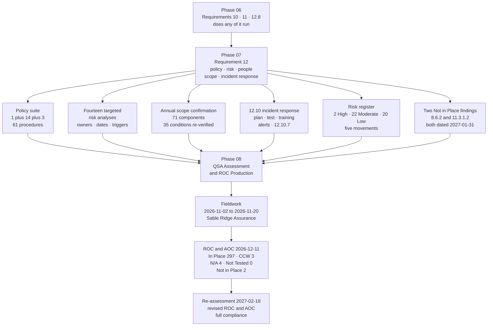

# 07.13 — Phase Summary &amp; Transition

| Field | Value |
|---|---|
| Document ID | MRG-PCI-2026-713 |
| Program | Marketa Retail Group — PCI DSS v4.0.1 Compliance Program |
| Phase | 07 — Security Policy, Risk &amp; Incident Response |
| Version | 1.0 |
| Status | Approved |
| Owner | Naomi Bhatt, Chief Information Security Officer |
| Approver | Raymond Voss, Chief Financial Officer |
| Date | 2026-07-15 |
| Classification | Confidential — Cardholder Data Environment // Illustrative Portfolio Sample |

## Purpose

Phase 07 delivered **Requirement 12 in full**, less the 12.8 third-party population Phase 06 closed: the policy suite, the fourteen targeted risk analyses, the security awareness programme, personnel screening, the annual scope confirmation, the formal adoption of the risk register, and **incident response under 12.10 including 12.10.7**.

This is the **last build phase before the QSA assessment.** This document records what the phase committed to, what it delivered, what it found, the complete open-item position entering fieldwork, and the transition to **Phase 08 — QSA Assessment &amp; ROC Production**.

It ends with an assurance statement that says two uncomfortable things in plain terms, because the alternative is a summary that reads better than the programme it summarises.

## 1. What Phase 07 Committed To

06.13 §6.1 handed this phase seven inheritances and §6.2 named three defining workstreams. Each is answered.

| # | Commitment | Source | Outcome |
|---|---|---|---|
| **1** | **Deliver the remaining five targeted risk analyses and consolidate all fourteen** with owners, review dates and trigger sets | 06.13 §6.1 | **Delivered.** **TRA-09** (12.10.4.1) and **TRA-14** (elective, 12.5.2) published here; the register in **07.03** carries all fourteen with an ID, an owner, a next-review date and a trigger set, and reconciles the "nine of fourteen" and "twelve" counts rather than smoothing them |
| **2** | Treat the **incident population as real** — 12.10 was exercised in production, not tabletopped | 06.13 §6.1 | **Delivered, and qualified.** **512 incident records** across the period, **0 SEV-1**, **5 SEV-2**. And the qualification 06.13 demanded: **none of them was a confirmed compromise of account data**, which is why **R-43 does not move** |
| **3** | Use the **monitoring capability** Phase 06 built as the input to response | 06.13 §6.1 | **Delivered.** Every source 12.10.5 names routes into one adjudication queue with a severity mapping into the plan; the 15-month retained record answered the September Critical's 176-day forensic question with a **complete enumeration of 47 sessions** |
| **4** | Read the **35 E3-graded provider evidence rows** as a standing exposure in the Requirement 12 work | 06.13 §6.1 | **Delivered, and it produced the phase's most uncomfortable finding.** **TTF-1** is the operational form of the same exposure: Marketa cannot scope an account data compromise on its own evidence, and the provider agreement carries no response-time commitment for the enumeration |
| **5** | Carry **both Not in Place findings undressed** into the assessment | 06.13 §6.1; **ADR-0004** | **Delivered.** **R-17** and **R-36** are the register's only two High entries, both held by a requirement that is not met, both dated **2027-01-31**, **neither accepted** by the CFO acceptance route that exists and has never been used |
| **6** | **12.6.3 awareness at 97.1%**, with the honest reading that awareness is necessary and is not the control | 06.13 §6.2 | **Delivered.** 97.1% against a ≥95% bar on a denominator that **includes 611 people who are not yet late**, and 07.04 §7 states what the figure does not establish rather than presenting it as an outcome |
| **7** | **12.10 including 12.10.7**, against four real instances | 06.13 §6.2 | **Delivered across four documents — 07.08 to 07.11.** 12.10.7 presented with the sequence stated plainly: **the procedures were written in Phase 02 against four real findings, before the requirement was formally documented as a control** |
| **8** | Do not assume the plan is proved because it was used | 06.13 §6.3 | **Honoured.** The plan was tested by an exercise **designed by Internal Audit and not disclosed in advance**, which disproved one of its load-bearing assumptions |

## 2. What the Phase Delivered

### 2.1 Deliverables register

| Document | Title | Owner | Content |
|---|---|---|---|
| **07.01** | Information Security Policy | Naomi Bhatt | 12.1.1–12.1.4. **MRG-ISP-00**; **DIS-1 to DIS-4**; the findability tests **FIND-1 to FIND-4**; nine amendments and seventeen sections left unchanged; the 12.1.4 assignment |
| **07.02** | Acceptable Use &amp; Topic-Specific Policies | Owen Castellanos | 12.2.1 and every `x.1.1`/`x.1.2`. **TSP-01 to TSP-14**, **PS-1 to PS-3**, **61** procedures; the understanding limb tested by unannounced interview — **42 of 46** |
| **07.03** | **Targeted Risk Analyses, Consolidated** | Naomi Bhatt | 12.3.1–12.3.4. **TRA-01 to TRA-14**; ten compelled and four elective; **12.3.3** and **12.3.4** annual reviews; four trigger sets that fired |
| **07.04** | Security Awareness Programme | Owen Castellanos | 12.6.1–12.6.3.2. **AW-1 to AW-6**; seven methods; seven review changes; **97.1%** on a stated denominator |
| **07.05** | Personnel Screening &amp; Roles | Owen Castellanos | 12.7.1 and 12.1.3 in practice. **SCN-1 to SCN-3** across 38 states; contractors; the seasonal intake; the role catalogue |
| **07.06** | **Annual Scope Confirmation** | Owen Castellanos | 12.5.1, 12.5.2. Seven elements re-verified; **71** components; **27** significant changes; **35 conditions**, 33 unqualified; **TRA-14** |
| **07.07** | Risk Register Position | Owen Castellanos | The 44 entries; **five movements**; the register formally adopted into the policy set; **2 High · 22 Moderate · 20 Low** |
| **07.08** | **Incident Response Plan** | Naomi Bhatt | **12.10.1**. **SEV-1 to SEV-4**; **ADR-0026**; the CSIRT; **NOT-1 to NOT-7**; **IR-P1 to IR-P10** across all 71 components; continuity, backups, the 38-state legal analysis, **Annex A** |
| **07.09** | **Incident Response Testing &amp; Training** | Marcus Hale | **12.10.2, 12.10.3, 12.10.4, 12.10.4.1**. **TRA-09** in full; the 12-person 24/7 roster; **TT-2026-01** and **TTF-1 to TTF-6**; **ADR-0027** |
| **07.10** | Monitoring &amp; Response to Alerts | Marcus Hale | **12.10.5, 12.10.6**. Every named source into one queue; **512** incident records; **nine plan amendments** and two recorded declines; **ADR-0028** |
| **07.11** | **PAN Found Where Unexpected** | Elena Marchetti | **12.10.7**. **P-0** plus **P-1 to P-4**; the empty expected-locations set; the third limb; the second full discovery run returning clean |
| **07.12** | Control-to-Risk Traceability | Owen Castellanos | **31 of 44** touched, primary for **16**; the five movements; the four 12.10 holdings; the position reconciled |
| **07.13** | Phase Summary &amp; Transition | Naomi Bhatt | This document |

### 2.2 The phase in numbers

| Measure | Value |
|---|---|
| Policy architecture | **1** overarching policy · **14** topic-specific · **3** programme standards · **61** operational procedures |
| Policy dissemination | **≈34,000** colleagues plus up to **6,800** seasonal; **486** physical locations; **6** providers by countersigned annex |
| Policy review | **9** amendments; **17** sections examined and deliberately unchanged |
| **Targeted risk analyses** | **14** — 9 compelled under 12.3.1, 1 customized approach under 12.3.2, **4 elective**. Four trigger sets fired |
| Awareness | **97.1%** against a **≥95%** bar, on a denominator of **40,412**; **640 of 640** role-based modules; POI module **98.1%** |
| Screening | Three tiers across 38 states; **178** in-scope administrative personnel at the enhanced tier |
| **Scope confirmation** | **71** components — 8 CDE, 63 connected-to; **27** significant changes with 27 scope-delta reviews; **35** conditions re-verified, **33 unqualified** |
| **Incident records** | **512** — **0 SEV-1**, **5 SEV-2**, 49 SEV-3, 458 SEV-4 |
| 24/7 response | **12** designated individuals across two tiers; **52 weeks with no uncovered hour**; **8** unannounced out-of-hours tests, **1** of which found a failure |
| Incident response training | Core team **12**, semi-annual, **100%** in both cycles; extended roster **47**, annual, **47 of 47**; **10 of 10** playbooks drilled |
| **Annual test** | **TT-2026-01**, 2026-06-24, **17 attendees**, scenario designed by Internal Audit; **6 findings**, **1 disproof** |
| Plan evolution | **9 amendments** — 6 from lessons learned, 3 from industry developments; **2 proposals declined and recorded** |
| **12.10.7** | **5 procedures** — P-0 plus P-1 to P-4; **4** real findings; **7** collector-quarantine reviews; **second full discovery run returned zero** |
| Risk register | **44** entries; **5 moved**; **26 touched and held**; **0 raised**; **2 High** entering the assessment |
| Architecture decisions | **ADR-0026, ADR-0027, ADR-0028** |
| **Not in Place findings carried** | **2** — **8.6.2** and **11.3.1.2**, both dated **2027-01-31** |

## 3. What the Phase Found

Phase 07 is a governance phase, and governance phases are not supposed to find things. This one found six.

| Finding | Where | What changed |
|---|---|---|
| **Marketa cannot scope an account data compromise on its own evidence** | 07.09 §5.2 — **TTF-1** | The scope reduction moved the primary account number to Truvance and **did not move the obligation to answer questions about it**. An operational incident runbook was agreed with Truvance's incident team; **OI-07-01** seeks a contractual response-time commitment at the 2027-03-31 renewal. **It is not closed** |
| **The compromise determination took 9 hours 20 minutes of exercise clock** | 07.09 §5.3 — **TTF-2** | The room tried to reach a conclusion before notifying. Plan v3.0 now states that **NOT-1 may and must be discharged on an `undetermined` determination**, with an outer bound of 48 hours from suspicion |
| **Twelve monthly contact verifications passed while the General Counsel's after-hours number was a full voicemail box** | 07.09 §5.3 — **TTF-3** | Verification now calls the **out-of-hours** number at a randomised hour. **A control that only tests the path that works will pass forever** |
| **Two of nine call-centre agents would have deleted a recording containing spoken PAN** | 07.02 §6 | Both were trying to help; both would have destroyed the evidence of an incident. The awareness content was amended to route it as a **12.10.7 report**, and the plan's first instruction is stated in the negative: *report it, and change nothing* |
| **An on-call responder did not answer a 02:47 page** because a paging application's critical-alert exemption was lost silently at an operating system update | 07.09 §2.4 | The secondary answered inside the commitment. A **monthly automated critical-alert delivery test to every roster device** is now the thirteenth row of the contact register verification — **OI-07-02** |
| **One hundred directory records with no person behind them** | 07.04 §6.1 | Found by an awareness completion denominator, not by an identity control. Recorded as an instance under **R-13**, referred to the identity team, carried as **OI-07-03** into the February 2027 seasonal close-out. **Tested against ADR-0005 and no new entry raised** |

### 3.1 The finding that matters most, in one paragraph

**TTF-1 is the bill for the scope reduction arriving in the one place the programme had not looked for it.** Marketa reduced its assessed population from 604 systems to 71 by putting the primary account number somewhere else. 06.10 §8 stated the price in assurance terms — three providers between Marketa and its ability to accept payment, thirty-five of eighty graded evidence rows uncorroborable, no right of inspection at the largest provider. TT-2026-01 stated it in operational terms, on a scenario chosen precisely because it did not start with a Marketa alert: **an acquirer calls with somebody else's evidence of a compromise, asks the merchant to scope it, and the merchant's honest answer is that the enumeration is a third party's service level and the service level does not exist.** The trade was still correct — the alternative is holding 68.4 million primary account numbers a year across 482 stores staffed by a workforce that grows by 6,800 people every October — and the finding is what it costs, stated rather than implied.

## 4. Requirement Coverage at Phase Close

| Requirement | Position |
|---|---|
| **12.1.1 to 12.1.4** | **Met** — policy established, published in four formats, maintained through a nine-amendment annual review, disseminated to 100% of the personnel population and all six providers; four responsibility tiers with **97.1%** acknowledgement; responsibility formally assigned to the CISO with an Audit Committee reporting line |
| **12.2.1** | **Met** — acceptable use covering the three named elements, an approved end-user technology list, and the controls that enforce it |
| **12.3.1** | **Met** — **nine** compelled entity-defined frequencies, each with a documented analysis carrying six mandatory elements, an owner, a trigger set and a staggered review date |
| **12.3.2** | **Met** — **one** customized approach, for **8.3.9**, with an Appendix E controls matrix and testing procedures **derived by the QSA** |
| **12.3.3 · 12.3.4** | **Met** — cryptographic review with an inventory **per termination point** and a three-change anticipated-change strategy; technology currency review across all 71 components, **66 of 71** on current releases, **0** unsupported, and the nine CON-03 appliances recorded on their own terms |
| **12.4.1 · 12.4.2** | **Service-provider requirements.** Never within the **306**; **not** among the ROC's four Not Applicable entries. The substance is performed voluntarily and recorded as voluntary |
| **12.5.1 · 12.5.2** | **Met** — a 71-entry inventory reconciled monthly against four sources, **12 of 12** cycles; annual confirmation across all seven elements against period evidence, with independent challenge, **27** significant changes and a pre-fieldwork delta scheduled for October |
| **12.5.2.1 · 12.5.3** | **Service-provider requirements.** Never within the 306 |
| **12.6.1 to 12.6.3.2** | **Met** — a formal programme, seven communication methods reaching a population that is 87% deskless, annual review with seven changes, and completion at **97.1%** on a denominator that includes people who are not yet late |
| **12.7.1** | **Met** — three screening tiers within the constraints of local law across 38 states, extended to contractors and to the seasonal intake |
| **12.8.1 to 12.8.5** | **Met** in Phase 06 — six providers, agreements engaging the acknowledgement on the correct limb, six signed responsibility matrices, monitoring tiered above the annual floor |
| **12.9.1 · 12.9.2** | **Service-provider requirements.** Never within the 306; recorded because **12.9.2 is the duty Marketa's 12.8.5 relies on** |
| **12.10.1** | **Met** — a plan ready to activate on **suspicion**, containing all seven named elements, covering all **71** components through ten playbooks, with acquirer and brand notification, continuity, backups, the legal analysis and **Annex A** |
| **12.10.2** | **Met** — reviewed and updated to v3.0; **tested by TT-2026-01** with all seven 12.10.1 elements covered by a stated method |
| **12.10.3** | **Met** — **12 designated individuals**, 52 weeks with no uncovered hour, availability proved by eight unannounced tests. **Northbridge is not presented as a designated responder** |
| **12.10.4 · 12.10.4.1** | **Met** — a defined syllabus with 100% core-team completion across two cycles; **TRA-09** setting semi-annual for the core team and annual for the extended roster, with five triggers of which **T1 fired** |
| **12.10.5** | **Met** — every source class the requirement names, including **the change- and tamper-detection mechanism for payment pages**, routed into one adjudication queue with a mapping into the plan's severity model |
| **12.10.6** | **Met** — **nine amendments** traced to named incidents, exercise findings and intelligence sources, with **two proposals declined and recorded** |
| **12.10.7** | **Met** — **P-0 to P-4**, an empty expected-locations set, deletion-or-migration with evidence, the immutable-backup exception, and **root cause as a mandatory closure condition** |

## 5. The Open-Item Position Entering the Assessment

**Fourteen items are open**: the ten carried from Phase 06 under their original identifiers, and four raised in this phase.

| ID | Item | Owner | Due | Goes to |
|---|---|---|---|---|
| **OI-06-01** | **11.3.1.2 remediation — CAP-06.** A contractual right to credentialed scanning and agent installation on the 9 POS back-office appliances at the FY2027 renewal, or platform replacement as the costed fallback; verified by an authenticated scan of all 9 with per-target authentication assertion | Trevor Kim | **2027-01-31** | **ROC finding in Phase 08**; re-assessment 2027-02-18 |
| **OI-06-02** | **8.6.2 remediation.** Vendor release 9.4 for `batch-icq`; the ERP interface upgrade for `gl-extract`; both credentials moved to CT-14 retrieval. Requires the freeze exemption approved 2026-12-17 | Trevor Kim | **2027-01-31** | **ROC finding in Phase 08**; re-assessment 2027-02-18 |
| **OI-06-03** | **SCR-29 and SCR-33 migrated onto the Marketa tag proxy** | Sonia Rendell | 2027-03-31 | Phase 09 |
| **OI-06-04** | **11.6.1 matrix change after PoL-2**, verified by a further proof-of-life test | Sonia Rendell | 2027-01-31 | Phase 09 |
| **OI-06-05** | **CAP-05** — the legacy pre-shared key population to zero; frozen at 203 devices across 133 stores until February 2027 | Trevor Kim | 2027-06-30 | Phase 09 |
| **OI-06-06** | **TPSP-06's first full 12.8.4 annual review**, with the annual site inspection as corroborating evidence | Owen Castellanos | 2027-06-30 | Phase 09 |
| **OI-06-07** | **A phishing and pretext-calling test programme** for 2027, closing one of the thirteen untested-surface rows under ADR-0025 | Marcus Hale | 2027-06-30 | Phase 09 |
| **OI-06-08** | **Contract remedy for the SCR-29 change-notification failure** at the vendor's renewal | Frank Mueller with Sonia Rendell | 2027-02-28 | Phase 09 |
| **OI-06-09** | **The four undetected techniques' new rules validated** at the next quarterly controlled execution | Marcus Hale | 2027-03-31 | Phase 09 |
| **OI-06-10** | **The second annual segmentation penetration test** — part of **R-14**'s continuing assurance | Trevor Kim | 2027-05-31 | Phase 09 |
| **OI-07-01** | **A contractual response-time commitment from Truvance for incident-driven token resolution**, sought at the 2027-03-31 AOC anniversary and renewal. The operational runbook agreed with Truvance's incident team is the interim measure and **is not a commitment** | Frank Mueller with Owen Castellanos | 2027-03-31 | Phase 09; **TTF-1** |
| **OI-07-02** | **Monthly critical-alert delivery test to every 12.10.3 roster device**, verified across a full quarter | Marcus Hale | 2027-01-31 | Phase 09 |
| **OI-07-03** | **The 100 directory records with no person behind them**, reconciled and carried into the February 2027 seasonal close-out | Trevor Kim | 2027-02-28 | Phase 09; **R-13** |
| **OI-07-04** | **The first full seasonal peak under DLP enforcement and the store payment-link route**, measured at the 2026–27 close-out — the evidence **R-22** and **R-07** are waiting for | Adaeze Nwosu with Marcus Hale | 2027-02-28 | Phase 09 |

**Phase 09 reports 11 open items at programme close.** The reconciliation is straightforward and is stated here rather than discovered later: OI-06-01, OI-06-02 and OI-07-02 close at or before the **2027-02-18** re-assessment, leaving eleven.

### 5.1 The two Not in Place findings, undressed

| | **8.6.2** | **11.3.1.2** |
|---|---|---|
| The finding | Hard-coded, non-rotatable credentials remaining in **two** legacy batch integrations, with interactive use possible and no individual attribution | Authenticated internal vulnerability scanning achieved on **62 of 71** components; **nine** vendor-locked POS back-office appliances cannot be credentialed-scanned |
| Why it is not met | The credential is embedded. Interim measures reduce the paths to it; they do not remove it | The support agreement provides neither administrative credential release nor agent installation rights. **The gap is a term in a contract, not a property of the technology** |
| Compensating control | **Drafted and refused** | **Drafted and refused on three of its four tests** |
| The argument that failed | — | Marketa argued the requirement's documentation allowance and **the QSA rejected it**, on the distinction between *a system technically unable to accept credentials* and *an entity contractually unable to obtain them* |
| Register entry | **R-17 — High 16**, unchanged since baseline | **R-36 — High 16**, unchanged since baseline |
| Remediation | Vendor release plus an ERP interface upgrade; both credentials to CT-14 vault retrieval. Needs the freeze exemption approved 2026-12-17 | **CAP-06** — a renewal negotiation or a costed platform replacement |
| Date | **2027-01-31** | **2027-01-31** |
| Float before re-assessment | **Eighteen days. There is none** | **Eighteen days. There is none** |

**Both dates are the last day of January for the same reason: the seasonal change freeze runs October to January**, and the 11.3.1.2 work touches vendor-locked appliances in the store estate and cannot begin until it lifts. The ROC and AOC are issued **2026-12-11**, six weeks before the remediation is due. **The AOC is therefore filed as non-compliant with a dated remediation plan, and that is a decision taken in advance rather than an outcome discovered late** — which is what ADR-0004 has obliged since Phase 01.

## 6. Transition to Phase 08

### 6.1 What Phase 08 inherits

| Inheritance | Detail |
|---|---|
| **A complete Requirement 12** | 12.1 to 12.10, with the service-provider sub-requirements recorded as **out of population** rather than as Not Applicable — a distinction Phase 08 must preserve when it names the **four** N/A entries |
| **The document the assessment opens with** | **07.06**, the annual scope confirmation, written on the assumption that it is read first. Seven elements re-verified against period evidence, with the one qualified element qualified more narrowly than it was in February |
| **Fourteen targeted risk analyses and one customized approach** | Each with an owner, a review date and a trigger set. **The 8.3.9 customized approach is assessed against testing procedures the QSA derives**, not procedures Marketa proposes |
| **An incident response plan tested by somebody who wanted it to fail** | **TT-2026-01**, designed by Internal Audit, six findings, one disproof, all seven 12.10.1 elements covered with the method for each stated |
| **12.10.7 with four real instances and a clean second run** | And the sequence stated: procedures written against findings, before the requirement was formally documented |
| **Two Not in Place findings, undressed** | With dated plans, refused compensating controls, and **no CFO acceptance** |
| **A register at 44 with two High entries** | Both held by a requirement that is not met, and both the same two things the ROC will record from a different document |
| **Fourteen open items** | Each with a named owner and a date, of which three close at or before the re-assessment |

### 6.2 What Phase 08 must not assume

| Do not assume | Because |
|---|---|
| That the four **Not Applicable** entries include any service-provider requirement | **12.4.1, 12.4.2, 12.5.2.1, 12.5.3, 12.9.1, 12.9.2, 11.4.6, 11.5.1.1, 10.7.1, 3.6.1.1** and Appendix A1/A3 were **never within the 306**. A requirement that never applied to an entity of this type is out of population, not N/A. **Phase 08 must name the four merchant-applicable sub-requirements determined not to apply to Marketa's environment** |
| That a control described in a document was tested | Every phase in this portfolio distinguishes what was built from what was measured. **Eleven register movements rest on one operating cycle each**, and 11.6.1's rests on 140 days |
| That the incident response plan is proved | **Zero SEV-1 incidents means none was detected and declared.** The plan has never handled a confirmed compromise, **R-43 does not move**, and the exercise that came closest disproved one of its assumptions |
| That awareness explains the human findings | Two agents who would have deleted a recording, one store manager who would have removed a device, and one on-call responder whose phone was silent are **design problems, not training problems**, and all three were fixed by changing something other than a module |
| That the register is settled because it moved | **Twenty-six entries were touched and held**, four of them the entries 12.10 was expected to treat, two of those waiting on a seasonal peak that completes **after** the assessment |
| That **R-27**'s movement is uncontested | Dissent is minuted and a **return-to-High condition** is attached: any finding reached from Z3 in the 2027 penetration test returns it, without further argument |
| That the ROC's outcome is a surprise to anybody | **Marketa knows it does not meet two requirements**, has known since Phase 05 and Phase 06 respectively, has priced the consequence, and has scheduled the re-assessment |

### 6.3 The Phase 08 sequence

| Date | Event |
|---|---|
| **October 2026** | Pre-fieldwork scope re-confirmation — a delta against 07.06, inside the freeze |
| **2026-11-02 → 2026-11-20** | **QSA on-site assessment fieldwork.** Sable Ridge Assurance, LLC — lead QSA **Grant Whitfield**, QSA **Amara Osei** |
| **2026-12-11** | **ROC and AOC issued.** **In Place 297 · In Place with Compensating Control 3 · Not Applicable 4 · Not Tested 0 · Not in Place 2.** The AOC is filed with Cardinal **as non-compliant with a dated remediation plan**, twenty days ahead of the 31 December deadline and deliberately so |
| **2026-12-17** | Board and Audit Committee report; the freeze exemption for the 8.6.2 work approved |
| **2027-01-31** | **Both remediations due** |
| **2027-02-18** | **Re-assessment — full compliance; revised ROC and AOC issued** |

## 7. Assurance Statement

Marketa Retail Group has implemented PCI DSS v4.0.1 **Requirement 12 in full** across the **71 system components** in its assessed population — 8 cardholder data environment components and 63 connected-to or security-impacting systems — across 482 stores, 4 distribution centres, 2 offices, 1,914 point-of-interaction terminals, 6 payment page templates, 310 call centre agents and 6 third-party service providers.

As at 2026-07-15:

- **An information security policy approved by the Chief Executive Officer** is established, published in four channel formats, maintained through an annual review that made nine amendments and deliberately left seventeen sections unchanged with reasons, and disseminated to a population that is **87% deskless** by four mechanisms designed for the people they have to reach, and to all six providers by countersigned agreement annex.
- **Fourteen targeted risk analyses** justify every entity-defined frequency in the programme, each carrying six mandatory elements, a named owner, a staggered review date and a trigger set. **Four of the fourteen are elective**, performed where the standard compels nothing, and are recorded as elective so nobody later mistakes them for obligations or drops them believing they were.
- **The 2026 scope confirmation re-verified all seven elements of 12.5.2 against evidence produced in the operating period**, not against the Phase 02 document, with independent challenge on the two elements most exposed to owner bias, and re-verified **thirty-five conditions**, of which **thirty-three held unqualified**.
- **Security awareness reached 97.1%** of a population of 40,412 against a charter bar of ≥95%, on a denominator that deliberately counts **611 people who are not yet late** — because a denominator adjusted to flatter the numerator is the single most common way an awareness figure lies.
- **An incident response plan exists that is ready to be activated on suspicion**, covering all seven elements 12.10.1 names, reaching all 71 assessed components through ten playbooks with pre-authorised containment, with acquirer notification inside 24 hours of determination, brand notification through the acquirer, business continuity across three acceptance channels, five backup sets proved restorable **and proved immutable against the highest-privileged credential available**, and a 38-state legal analysis owned by the General Counsel rather than by the security function.
- **Twelve named individuals are designated and available 24 hours a day**, across 52 weeks with no uncovered hour, with availability proved by eight unannounced tests rather than asserted from a rota.
- **Five procedures respond to primary account numbers found where they are not expected**, exercised against four real discoveries totalling 11,400 call recordings, 2,187 scanned dispute documents, a debug log holding 1,143 account numbers and a spreadsheet of 34 — **and a second full discovery run across 1,842 systems, 41 shares, 6 archives and the restored backup sets returned zero.**

Four statements are made without qualification because they are less comfortable than the seven above.

**Marketa cannot scope an account data compromise on its own evidence.** The annual test put an acquirer's telephone call on the table instead of an alert, and fifty-five minutes later the room reached the correct answer: Marketa holds tokens and truncated primary account numbers, the enumeration is Truvance's, and **the agreement carries no response-time commitment for it.** An operational runbook now exists with the provider's incident team. It is not a contractual commitment, **OI-07-01 is open**, and it does not close until a renewal Marketa has not yet negotiated.

**The incident response plan has never handled a confirmed compromise of account data.** It has handled 512 incident records, five of them serious, none of them a breach. **R-43 — procedures documented but not exercised against the scenarios this estate actually produces — does not move in this phase**, because the evidence for moving it does not exist, and 06.13 warned this phase in advance not to treat use as proof.

**Two register entries are waiting on a seasonal peak that completes after the assessment.** The controls that treat customer-initiated account data and account data in the messaging estate were built in response to a finding that occurred in October and November 2025, at the trading peak, to a store manager under time pressure with 34 customers waiting. Those controls have been enforcing since April and have not yet met an October. **R-22 and R-07 are held for that reason and no other.**

**Marketa enters its assessment knowing it does not meet two requirements.** Hard-coded credentials remain in two legacy batch integrations, and authenticated internal vulnerability scanning is complete on 62 of 71 components and impossible on nine because a support agreement provides neither credential release nor agent installation rights. **A Compensating Controls Worksheet was drafted and refused in both cases.** Both are held at High in the register, **neither has been accepted by the Chief Financial Officer**, both are dated **2027-01-31** — a date chosen because the change freeze lifts at the end of January — and the Report on Compliance and Attestation of Compliance are issued **2026-12-11**, six weeks before that. The Attestation is therefore filed with Cardinal Merchant Bank as **non-compliant with a dated remediation plan**, and full compliance is achieved at a re-assessment on **2027-02-18**, eighteen days after the remediation date. **There is no float.**

And the sentence this phase exists to earn:

> **The programme enters its assessment having built everything it said it would, and with two requirements it knows it does not meet.**
>
> Those two facts belong in the same sentence. A programme that could say only the first would be describing a document set rather than an environment, and a programme that could say only the second would not have earned the right to be assessed at all. **Every commitment made in 01.06 has been delivered, every phase's forecast has been reported against rather than restated, no risk entry has been closed or removed in twelve months, and no High risk has ever been accepted** — including the two that will still be High on the day the assessor arrives.
>
> The uncomfortable coda is the one 12.10 makes unavoidable. **Everything in this phase is a statement about a capability, and the capability has not been tested by the event it exists for.** The plan is complete, the roster is staffed, the training is current, the alerts route correctly, the procedures for account data in the wrong place were written against four real instances and have been exercised eleven times. None of that is the same as having survived a compromise, and the honest position on 2026-07-15 is that Marketa does not know how its plan performs on the worst morning, because it has not had one. **What it has instead is a plan that was tested by somebody who wanted it to fail, and which failed in one specific and now-documented way.** That is not proof. It is the closest thing to proof available before the event, and it is what the programme offers.

No statement in this phase asserts that a PCI DSS Attestation of Compliance constitutes compliance with any law, that a QSA's opinion binds a card brand or an acquirer, or that a merchant can be certified against PCI DSS. **PCI DSS is contractual, not statutory**; the Council writes the standard and does not enforce it. Marketa is privately held, is not an SEC registrant, and has no SOX control population. **No fine, fee or penalty amount is stated anywhere in this programme.**

## Cross-References

| Reference | Relevance |
|---|---|
| 01.06 — Program Charter &amp; Objectives | The commitments Phase 07 was accountable for; the **≥95%** awareness bar |
| 01.04 — Acquirer &amp; Card Brand Obligations | **C5** the 24-hour compromise notification; the 31 December AOC deadline and the deliberate 2026-12-11 filing |
| **ADR-0004 — No "Not Tested" Findings** | Why both gaps are carried as findings rather than reframed |
| 01.11 — Compliance Calendar &amp; Obligations | The fourteen analyses and the annual obligations Phase 09 inherits |
| 02.03 — Unexpected PAN Locations &amp; Response | The four findings and the origin of **P-0 to P-4** |
| 03.11 · 03.12 — Risk Register and Traceability | The 44-entry baseline, the published exit criteria, and the close forecast restated unchanged |
| 05.13 · **06.13** — Phase Summaries | The inheritances and warnings answered in §1 |
| 06.05 · 05.07 | **11.3.1.2** and **8.6.2** — the two Not in Place findings in their originating documents |
| **07.01 to 07.12** | The phase's twelve preceding deliverables |
| **Phase 08 — QSA Assessment &amp; ROC Production** | Fieldwork **2026-11-02 to 2026-11-20**; ROC and AOC **2026-12-11**; **the four Not Applicable entries named explicitly**; re-assessment **2027-02-18** |
| Phase 09 — Executive Reporting &amp; Continuous Compliance | The close position **0 High · 13 Moderate · 31 Low**; **11 open items** at programme close; the staggered 2027 review calendar |

---
[⬅ Previous](07.12-control-to-risk-traceability.md) · [🏠 Phase 07 Home](07.00-README.md) · [Next ➡](../08-qsa-assessment-roc-production/08.00-README.md)
