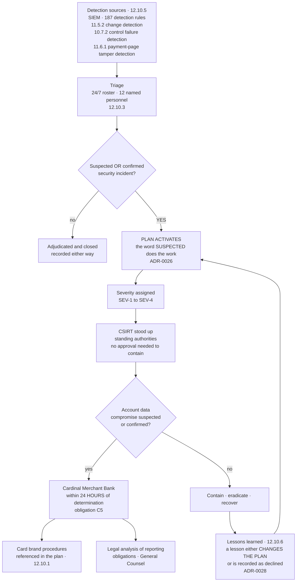

# Incident Response — From Alert to Notification

## The word that does the work

**12.10.1** obliges a plan ready to be activated on a **suspected or confirmed** security incident. "Suspected" is doing most of the work in that sentence, and **ADR-0026** takes it literally: the plan activates on suspicion, not on confirmation.

The alternative — waiting for confirmation before standing up the response — means the response begins after the period in which it would have been most useful. A plan that activates only when you are certain is a plan that activates late by design.

## Source
`07.08-incident-response-plan.md`, `07.10-monitoring-and-response-to-alerts.md`.
