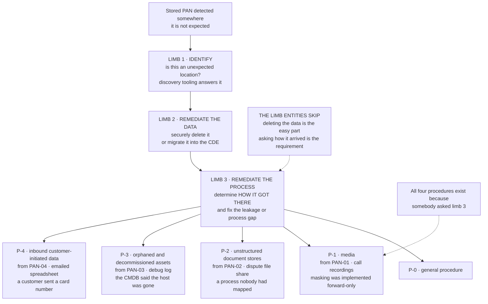

# 12.10.7 — When PAN Turns Up Where It Should Not

## The unusual position

Marketa wrote these procedures in **Phase 02**, in response to four real discoveries, months before 12.10.7 was formally documented as a control in this phase. The requirement was satisfied by having taken the third limb seriously, and the documentation caught up afterwards.

That is the right way round, and it is worth noting because the reverse — a beautifully written procedure that has never been exercised — is the far more common artefact.

**The exit criterion held.** R-31 came down on a **second full discovery run returning clean**, not on the cleanup of the first.

## Source
`07.11-pan-found-where-unexpected.md`, `02.03-unexpected-pan-locations-and-response.md`.
