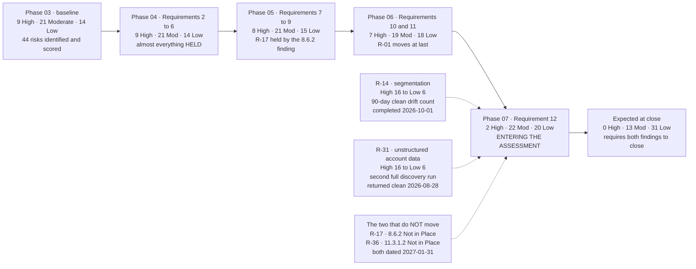

# The Register Across the Programme

## Why the two that moved are the interesting ones

**R-14** and **R-31** were both raised on evidence rather than scored high at the outset, and both were given **exit criteria published in advance** — before anyone knew whether they would be met.

R-14's was ninety days of clean drift detection; the clock was reset once when two further divergences appeared, and it completed on 2026-10-01. R-31's was **a second full discovery run returning nothing** — not the cleanup of the first — and it ran 2026-08-17 to 08-28 across the same populations by the same method, and came back clean.

A risk that comes down on a criterion written six months earlier is a different kind of claim from one that comes down because a phase ended.

## Source
`07.07-risk-register-position.md`, `07.12-control-to-risk-traceability.md`.
