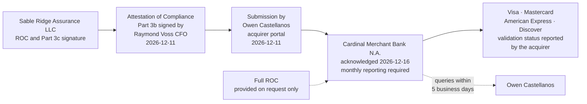

# 08.11 — Attestation of Compliance &amp; Acquirer Submission

| Field | Value |
|---|---|
| Document ID | MRG-PCI-2026-811 |
| Program | Marketa Retail Group — PCI DSS v4.0.1 Compliance Program |
| Phase | 08 — QSA Assessment &amp; ROC Production |
| Document | 08.11 — Attestation of Compliance &amp; Acquirer Submission |
| Version | 1.0 |
| Status | Approved |
| Owner | Raymond Voss, Chief Financial Officer |
| Approver | Frank Mueller, General Counsel |
| Date | 2026-07-15 |
| Classification | Confidential — Cardholder Data Environment // Illustrative Portfolio Sample |

## Purpose

The Report on Compliance is the assessment. **The Attestation of Compliance is the filing.** It is the document Cardinal Merchant Bank receives, the document an officer of Marketa signs, and the document on which the entity's validation status is recorded and passed up the chain to the card brands.

This document records the form used, what each part contains, the compliance status recorded, the Part 4 action plan, who signed what and on what authority, when and how it was submitted, what Cardinal did with it, and — the question the CFO asked and is entitled to an answer to — **what he was actually signing.**

## 1. The AOC and the ROC Are Different Instruments

| | **Report on Compliance** | **Attestation of Compliance** |
|---|---|---|
| Length | **741 pages** | A form of a few pages |
| Author | The assessor | **The assessor and the entity, in separate parts** |
| Content | Every one of the **306** applicable sub-requirements, with testing, evidence and narrative | A summary of the assessment, the entity's declarations, the compliance status, and the action plan for anything not met |
| Who signs | The lead QSA | **An officer of the merchant** at Part 3b, **and** the QSA at Part 3c |
| What is filed with Cardinal | **On request only** | **Routinely — this is the filing** |
| What it establishes | What was found | **What the entity attests to, and what it undertakes to do about what was not met** |

The two are produced together and issued together. They cannot say different things, and the internal quality assurance in **08.09 §5.1** exists partly to make sure they do not: *a non-compliant report with a compliant attestation is the error that ends engagements.*

## 2. The Form and Its Parts

The form used is the Council's **Attestation of Compliance for Onsite Assessments — Merchants**, matching the assessed version, **PCI DSS v4.0.1**.

| Part | Title | Content | Marketa's entry |
|---|---|---|---|
| **Part 1** | Contact information | The assessed entity, its trading names, contact and address; the QSA company, the lead assessor and the assessor's contact details | Marketa Retail Group, Inc., Columbus, Ohio; contact **Owen Castellanos**; **Sable Ridge Assurance, LLC**; lead QSA **Grant Whitfield** |
| **Part 2** | Executive summary | Payment card business description, payment channels, types of payment acceptance, locations, third-party service providers, and eligibility for the assessment performed | **Card-present at 482 stores and 1,914 POI lanes; e-commerce; MOTO through a 310-agent call centre.** Locations: 482 stores across 38 states, 4 distribution centres, 2 offices, 2 data centres, 1 call centre. **6 third-party service providers.** Level 1 merchant validating by on-site assessment |
| **Part 3** | PCI DSS validation and attestation details | The overall compliance status and the declarations supporting it | **Non-Compliant** |
| **Part 3a** | Acknowledgement of status | The entity's acknowledgement of the assessment result and of the obligations that follow from it, including maintenance of compliance and the accuracy of the ROC's scope | Acknowledged as **Non-Compliant with two requirements Not in Place**, with the Part 4 action plan |
| **Part 3b** | **Merchant attestation** | The declaration signed by **an officer of the merchant**, that the information is accurate, that the assessment scope was correctly described, and that the entity will maintain compliance | Signed **2026-12-11** by **Raymond Voss, Chief Financial Officer**, under **ADR-0002** |
| **Part 3c** | **QSA acknowledgement** | The assessor's declaration describing the work performed and confirming that the ROC supports the attestation | Signed **2026-12-11** by **Grant Whitfield**, lead QSA, Sable Ridge Assurance, LLC |
| **Part 3d** | QSA contact information | The assessor's contact details for the acquirer's queries | Grant Whitfield, Sable Ridge Assurance, LLC |
| **Part 4** | **Action plan for non-compliant requirements** | For each of the twelve requirements, whether the entity is compliant; and for each that is not, the remediation actions and the target date | **Requirements 8 and 11 marked NO**, with **8.6.2** and **11.3.1.2** and a target date of **2027-01-31** |

**Two properties of the form drive everything else in this document.**

First, **Part 3b is signed by an officer of the merchant, not by the assessor and not by the security function.** The assessor's signature at 3c attests to the work done; the officer's signature at 3b attests to the entity's own declarations. They are different assertions by different parties, and only one of them is Marketa's.

Second, **Part 4 exists.** The form anticipates that an entity may be non-compliant and provides a structured place to say what will be done about it. **A form that contains an action plan section is a form that expects to receive one**, and an entity treating a non-compliant filing as an aberration has misread the instrument it is filing.

## 3. The Compliance Status

| Field | Value |
|---|---|
| **Overall compliance status** | **Non-Compliant** |
| Basis | **2 of 306** applicable sub-requirements assessed **Not in Place** |
| Requirements marked **NO** in Part 4 | **8** and **11** |
| Requirements marked **YES** | **1, 2, 3, 4, 5, 6, 7, 9, 10, 12** |
| Full result | **In Place 297 · In Place with Compensating Control 3 · Not Applicable 4 · Not Tested 0 · Not in Place 2 = 306** |

**There is no partial status.** The form offers compliant, non-compliant, and compliant-with-legal-exception. Two Not in Place entries out of 306 produce exactly the same status as twenty would, and no arithmetic on the ratio changes it. A merchant at 99.3% of its applicable population is non-compliant, and the number 99.3% appears nowhere on the form because the form does not care.

That is worth stating because it is the fact that makes Part 4 the whole of the argument. **Marketa cannot improve its status; it can only explain it, and the explanation is the two rows in Part 4.**

## 4. Part 4 — The Action Plan

| Requirement | Description | Compliant | Remediation date and actions |
|---|---|---|---|
| **1** | Install and maintain network security controls | **YES** | — |
| **2** | Apply secure configurations to all system components | **YES** | — |
| **3** | Protect stored account data | **YES** | — |
| **4** | Protect cardholder data with strong cryptography during transmission | **YES** | — |
| **5** | Protect all systems and networks from malicious software | **YES** | — |
| **6** | Develop and maintain secure systems and software | **YES** | — |
| **7** | Restrict access to system components and cardholder data by business need to know | **YES** | — |
| **8** | Identify users and authenticate access to system components | **NO** | **8.6.2 — Not in Place.** Hard-coded credentials remain in two legacy batch integrations on CDE-04 and CDE-05. Vendor release deployment for `batch-icq` and ERP interface upgrade for `gl-extract`; both credentials moved to vaulted run-time retrieval; source files re-scanned. Owner Trevor Kim. **Target 2027-01-31** |
| **9** | Restrict physical access to cardholder data | **YES** | — |
| **10** | Log and monitor all access to system components and cardholder data | **YES** | — |
| **11** | Test security of systems and networks regularly | **NO** | **11.3.1.2 — Not in Place.** Authenticated internal vulnerability scanning incomplete on 9 of 71 assessed system components. Contract amendment securing administrative credential release and agent installation rights, with platform replacement as the costed alternative; verified by authenticated scan of all nine with per-target authentication assertion. Owner Trevor Kim. **Target 2027-01-31** |
| **12** | Support information security with organisational policies and programs | **YES** | — |

Three properties of these two rows were decided in advance rather than drafted under deadline:

| Property | Why |
|---|---|
| **Each names a requirement, not a theme** | An action plan against "credential management" is not auditable. An action plan against **8.6.2** is |
| **Each names an owner** | **Trevor Kim** for both. An action plan whose owner is a function rather than a person is an action plan nobody is late on |
| **Each names a verification method, not just a completion** | The 11.3.1.2 row commits to *an authenticated scan of all nine with per-target authentication assertion* — the same assertion whose absence produced the finding |

## 5. Signatures

| Part | Signatory | Role | Date |
|---|---|---|---|
| **Part 3b — merchant attestation** | **Raymond Voss** | **Chief Financial Officer**, Marketa Retail Group, Inc. | **2026-12-11** |
| **Part 3c — QSA acknowledgement** | **Grant Whitfield** | Lead QSA, Sable Ridge Assurance, LLC | **2026-12-11** |
| Part 3d — QSA contact | Grant Whitfield | Sable Ridge Assurance, LLC | — |
| Submission to Cardinal | **Owen Castellanos** | Payment Card Compliance Manager, via the acquirer portal | **2026-12-11** |

### 5.1 What the Chief Financial Officer was actually signing

The question was asked directly at the Steering Committee three weeks before fieldwork and again on the morning of 2026-12-11, and it deserves a direct answer. **Part 3b is not a declaration that Marketa is compliant.** In a non-compliant filing it cannot be, and the form does not ask for one.

| What the signature asserts | What it does not assert |
|---|---|
| That **the information in the AOC and the supporting ROC is accurate** to the best of the officer's knowledge | That the environment is secure |
| That **the scope described is the correct scope** — 71 components, 482 stores, 1,914 terminals, 6 providers, three acceptance channels — and that nothing in scope was excluded from it | That every system Marketa owns was assessed. **1,842 systems exist; 71 were in the assessed population**, and the reduction is described in Part 2 rather than hidden by it |
| That **the entity acknowledges the result**, including the two requirements recorded Not in Place | That the result is acceptable, or that the assessor was wrong |
| That **the entity will maintain compliance** with the requirements it met, continuously and not only on assessment days | That compliance is a state Marketa has entered |
| That **the Part 4 action plan is the entity's undertaking**, with the stated dates | That the dates are guaranteed. They are undertakings, and **the eighteen days between 2027-01-31 and the re-assessment contain no float** |

**The uncomfortable half of the signature is the scope declaration, not the compliance status.** The status is a matter of record and the assessor determined it. The scope is Marketa's own assertion, tested by the assessor but originating with the entity, and it is the assertion a forensic investigator would examine first if an account data compromise were ever found in a system Marketa had described as out of scope. That is the exposure the officer's signature carries, and it is the reason the annual scope confirmation in **07.06** is written to be read first.

### 5.2 Why the signature sits with the Chief Financial Officer

**ADR-0002**, taken in Phase 01, placed the AOC signature with the CFO rather than with the CISO, the CIO or the General Counsel. Four reasons were recorded then and none has changed:

| Reason | Statement |
|---|---|
| **The obligation is contractual and commercial** | PCI DSS reaches Marketa through Cardinal's merchant agreement. **The merchant agreement is a commercial instrument**, and the officer who owns the acquirer relationship owns the attestation made under it |
| **The consequence is financial and existential** | The escalation path in 01.04 §5 ends at termination of card acceptance. That is a risk to the business, not a risk to the security function |
| **It prevents the attestation becoming a technical artefact** | An attestation signed by the person who built the controls is a self-report. **Signed by the officer who has to explain the result to the Board, it is an accountability statement** |
| **It forces the uncomfortable conversation upwards** | A CFO who must sign a non-compliant attestation asks about the findings in March rather than in December. **He did**, and the record of what he expected to sign was minuted in Phase 07 before the assessment began |

## 6. Submission to Cardinal Merchant Bank

| Field | Value |
|---|---|
| Submitted to | **Cardinal Merchant Bank, N.A.** |
| Submitted by | **Owen Castellanos**, via the acquirer portal |
| **Date submitted** | **2026-12-11** |
| Deadline | **31 December 2026** |
| **Margin** | **20 days ahead** |
| Obligation engaged | **C1** — maintain compliance with PCI DSS — validated annually by on-site assessment under **C2** and evidenced by the executed Attestation submitted on or before 31 December under **C3** |
| What was submitted | The executed **AOC**. The **ROC** was made available on request and was not routinely distributed |
| **Cardinal acknowledged** | **2026-12-16** |
| Condition imposed | **Monthly remediation status reporting** until the re-assessment |

### 6.1 ADR-0031 — file early with an honest Part 4, rather than late after trying to close the gaps

> **ADR-0031 — The non-compliant AOC is filed early, not late.** Marketa files on **2026-12-11**, twenty days ahead of the deadline, with an honest Part 4, rather than holding the filing while attempting to close the two findings.

The alternative was real and was argued. The remediation was dated 2027-01-31; a filing held until then would have been three weeks late against a 31 December deadline, and might — if both remediations landed and a re-assessment could be arranged at speed — have produced a compliant attestation instead of a non-compliant one.

| Consideration | Filing early, non-compliant | Holding for a compliant filing |
|---|---|---|
| **Deadline** | **Met, with 20 days to spare** | **Missed.** A missed deadline is a breach of the submission obligation in its own right, independent of the findings |
| **What Cardinal receives** | A complete, signed attestation with a dated plan, in time to review it and respond before year end | Nothing, until an unspecified date, followed by an explanation |
| **What the acquirer can do with it** | Accept the plan and hold enforcement in abeyance while it is executed — **the path 01.04 §5 describes** | Treat the merchant as non-validated with no plan on file |
| **If the remediation slips** | The plan is on file and the slip is a reportable variance against it | The merchant is late **and** non-compliant **and** has filed nothing |
| **What it says about the entity** | That it knows its position and reports it | That its reporting depends on whether the news is good |
| **Effect on the change freeze** | None. The freeze governs the remediation, not the filing | Creates pressure to breach the freeze at the trading peak to rescue a filing date |

The last row is the one that settled it. **Holding the filing would have converted a compliance problem into an operational one**, by creating a commercial incentive to push a settlement-path change through the October–January freeze at peak trading. The freeze exists because a change to a settlement component in December is the most expensive change Marketa can make. **An attestation deadline is not a good reason to make it.**

### 6.2 What Cardinal did

| Date | Event |
|---|---|
| **2026-12-11** | AOC submitted through the acquirer portal with the Part 4 action plan |
| **2026-12-16** | **Cardinal acknowledged receipt** and confirmed the submission as complete and within the deadline |
| **2026-12-16** | Cardinal required **monthly remediation status reporting** until the re-assessment, against the Part 4 dates |
| **2026-12-17** | Board and Audit Committee report; the freeze exemption for the 8.6.2 deployments approved |
| Monthly thereafter | Status reports submitted against **CAP-07** and **CAP-06**, each reporting position against the 2027-01-31 date |
| **2027-02-18** | Revised ROC and AOC issued and submitted |

Cardinal's response is the ordinary one for a merchant that files a credible plan on time, and it is worth naming what it is not: **it is not approval, it is not a waiver, and it is not a statement that Marketa is compliant.** It is an acquirer accepting a dated plan and increasing its own reporting requirement while the plan runs. **The monthly reporting obligation is the price of the accommodation**, and it is a cost the programme absorbed without complaint because it is exactly what the programme would have asked for in Cardinal's position.

### 6.3 Marketa does not submit to the card brands — Cardinal does

| Property of the chain | Consequence |
|---|---|
| **Marketa has no direct contract with the card brands** | Every compliance question Marketa has is a question for **Cardinal**, not for Visa. Marketa does not file with a brand and cannot |
| **Cardinal reports validation status to the brands** | The status the brands see is the status Cardinal reports. Marketa's influence over it is the accuracy of what it files |
| **Cardinal is liable to the brands for its merchants** | Which is why Cardinal has both the incentive to demand evidence and the leverage of the merchant agreement to obtain it |
| **The assessor's opinion binds neither Cardinal nor any brand** | Sable Ridge's conclusion is an expert opinion offered in support of a contractual obligation. **Cardinal forms its own view, and the brands form theirs through Cardinal** |

### 6.4 What Cardinal checks on receipt, and what it does not

An acquirer's review of an incoming attestation is a completeness and consistency review, not a re-performance of the assessment. Knowing which is which tells an entity where an error would actually be caught.

| Cardinal checks | Cardinal does not check |
|---|---|
| That the form is the **current version matching the assessed standard** — v4.0.1 | Whether the assessor's testing was sufficient. **That is the QSA firm's quality process and the Council's oversight of it** |
| That **Part 3b is signed by an officer** and Part 3c by the qualified assessor who performed the work | Whether the officer read the report |
| That the **scope described in Part 2** is consistent with what Cardinal knows of the merchant's channels and volumes | Whether the scope is correct. **The scope declaration is Marketa's assertion, tested by the assessor** |
| That the **compliance status matches the findings**, and that any requirement marked NO carries a Part 4 entry | Whether the remediation plan will succeed |
| That the submission is **within the deadline** | Whether it was easy to produce |
| That the merchant's **quarterly ASV attestations** are on file for the same period | The scan reports themselves, unless a query arises |

**The consistency check is the one that catches manufactured optimism.** A merchant that softens a finding in the attestation while the underlying report records it plainly has produced two documents that disagree, and the acquirer holds both — or can ask for the second. That is one of the three grounds on which **ADR-0030** refused to soften the ROC's language, and it applies with more force to the AOC, because **the AOC is the document Cardinal actually reads.**

### 6.5 Why the AOC and not a self-assessment questionnaire

| Question | Position |
|---|---|
| Which form does Marketa file? | **Attestation of Compliance for Onsite Assessments — Merchants**, produced from a QSA-led on-site assessment |
| Why not a Self-Assessment Questionnaire? | **Marketa is a Level 1 merchant** — over 6M transactions annually for both Visa and Mastercard — and Level 1 validation is by on-site assessment producing a ROC. **The SAQ route is not available**, and would not be appropriate for an entity with three acceptance channels and 71 assessed components in any case |
| Could a compromise change the form? | **Yes, in the other direction.** The brand programmes can escalate a merchant to Level 1 following a compromise regardless of volume, and can mandate a forensic investigation. Marketa is already there |
| Does the form change when the finding is remediated? | **No.** The revised attestation of 2027-02-18 is the same form with a different status and an empty Part 4 |

## 7. No Amount Appears Anywhere

**No fine, fee schedule or penalty amount is stated in this document, in the Attestation, or anywhere in this programme.** The position was set in Phase 01 and has not moved.

| Question | Position |
|---|---|
| Does non-compliance carry a financial consequence? | **Yes.** The brand programmes provide for recurring assessments against the acquirer for a non-validated Level 1 merchant, passed through under the merchant agreement, escalating with duration |
| What is the amount? | **Not stated.** The amounts are set in the brands' operating rules, communicated to acquirers, and passed through under Marketa's merchant agreement. **A figure reproduced from a secondary source into a governance document is how organisations end up planning against numbers that are wrong** |
| Did Marketa incur one? | The document records the filing, the acknowledgement and the reporting condition. **No amount is stated, and the programme does not describe one** |
| What about professional fees? | **Professional fees are not penalties**, and the programme states them: the QSA engagement at **$385,000**, and the **$44,000** re-assessment fee drawn against the **$187,000** contingency line in the **$4,600,000** programme budget. Those are costs of assurance, and 08.12 §7 says so |

## 8. What the Attestation Does Not Establish

| Limitation | Statement |
|---|---|
| **It is not a certification** | **There is no PCI DSS certification for a merchant.** The AOC is an attestation about an assessed period, signed by an officer and acknowledged by an assessor |
| **It is not a determination of compliance with any law** | **PCI DSS is contractual, not statutory.** The obligation reaches Marketa through the merchant agreement. No AOC establishes compliance with any statute, and a card data compromise typically engages both tracks at once with different owners |
| **The Council does not enforce it** | The Council writes the standard, maintains the forms and qualifies the assessors. **Enforcement runs brand → acquirer → merchant**, and Marketa's counterparty is Cardinal |
| **It binds no third party** | The assessor's opinion binds neither the acquirer nor any brand. Acceptance of the Part 4 plan is Cardinal's decision and is revocable on its own terms |
| **It is a point in time** | The attestation describes an assessed period ending **2026-11-20**. **Part 3b's undertaking to maintain compliance is forward-looking; the attestation itself is not** |
| **It does not make the 2026 position disappear** | The revised attestation of **2027-02-18** is additive. **ADR-0032** — the 2026 filing is not withdrawn or replaced, and the record that Marketa was non-compliant on 2026-12-11 stands |

## Cross-References

| Reference | Relevance |
|---|---|
| **ADR-0002 — The AOC Signature Sits with the CFO** | §5.2, and the authority for Raymond Voss's Part 3b signature |
| **ADR-0031 — The Non-Compliant AOC Is Filed Early, Not Late** | §6.1, and the six-row comparison that settled it |
| **ADR-0032 — The 2026 Attestation Is Not Withdrawn** | §8, and the additive revised attestation |
| ADR-0004 — No "Not Tested" Findings Permitted | Why Part 4 has two rows rather than none |
| **01.04 — Acquirer &amp; Card Brand Obligations** | **C1, C2, C3**; the contractual chain; the routine non-compliance path in §5; the submission path in §8 |
| 01.06 — Program Charter &amp; Objectives | The escalation route to the Steering Committee and the Audit Committee |
| 01.08 — Scope Assumptions &amp; Constraints | **CON-01**, the October–January freeze that §6.1's final row turns on |
| 02.10 — Scope Reduction Analysis | The **604 → 71** reduction described in Part 2 |
| 07.06 — Annual Scope Confirmation | The evidence behind the scope declaration the CFO signs |
| 08.09 — Report on Compliance Production | The 741-page report the attestation summarises |
| **08.10 — The Two Not in Place Findings** | The two Part 4 rows in full |
| **08.12 — Remediation Plan &amp; Re-Assessment** | **CAP-07**, **CAP-06**, the monthly reports to Cardinal, and the revised attestation |
| 08.14 — Phase Summary &amp; Transition | The complete position and the standing legal framing |
| Phase 09 — Executive Reporting &amp; Continuous Compliance | The 2027 validation cycle and the continuing acquirer calendar |

---
[⬅ Previous](08.10-the-two-not-in-place-findings.md) · [🏠 Phase 08 Home](08.00-README.md) · [Next ➡](08.12-remediation-plan-and-re-assessment.md)
