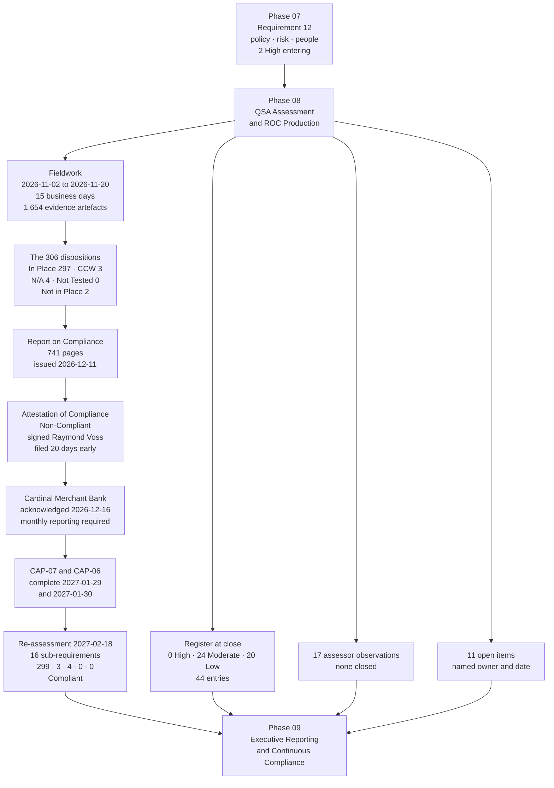

# 08.14 — Phase Summary &amp; Transition

| Field | Value |
|---|---|
| Document ID | MRG-PCI-2026-814 |
| Program | Marketa Retail Group — PCI DSS v4.0.1 Compliance Program |
| Phase | 08 — QSA Assessment &amp; ROC Production |
| Document | 08.14 — Phase Summary &amp; Transition |
| Version | 1.0 |
| Status | Approved |
| Owner | Naomi Bhatt, Chief Information Security Officer |
| Approver | Raymond Voss, Chief Financial Officer |
| Date | 2026-07-15 |
| Classification | Confidential — Cardholder Data Environment // Illustrative Portfolio Sample |

## Purpose

Phase 08 is the phase the previous seven were built for. It records the **QSA assessment** performed by Sable Ridge Assurance, LLC between **2026-11-02 and 2026-11-20**, the production and issue of the **Report on Compliance** and the **Attestation of Compliance** on **2026-12-11**, the filing with Cardinal Merchant Bank, the remediation of the two Not in Place findings, and the **re-assessment on 2027-02-18** at which all 306 applicable sub-requirements were met.

It records what the phase inherited and how each inheritance was answered, the complete position at close, an assurance statement, what **Phase 09 — Executive Reporting &amp; Continuous Compliance** must not assume, and the handover.

It ends, as the last three phase summaries have, with the uncomfortable things stated in plain terms — because the alternative is a summary that reads better than the programme it summarises, and because the single most valuable artefact this phase produced is a filing that says Marketa did not meet two requirements.

## 1. What Phase 08 Committed To

07.13 §6.1 handed this phase eight inheritances, §6.2 issued seven warnings, and §6.3 set a six-event sequence. Each is answered.

| # | Commitment | Source | Outcome |
|---|---|---|---|
| **1** | **Preserve the distinction between Not Applicable and out of population**, and **name the four N/A entries explicitly** | 07.13 §6.1; §6.2; Phase 02–04 addenda | **Delivered. 08.08** names **1.5.1, 3.3.2, 3.5.1.1 and 4.2.1.2**, with the test the assessor applied to each, and lists the **fourteen** service-provider sub-requirements and two Appendices that were never within the 306. **6.4.1 is recorded as superseded by 6.4.2**, not as an N/A |
| **2** | Open the assessment on **07.06, the annual scope confirmation** | 07.13 §6.1 | **Delivered.** The document was written to be read first and it was. Scope, segmentation and the sampling rationale occupy Part I §3 and §4 of the report |
| **3** | Have the **8.3.9 customized approach assessed against testing procedures the QSA derives**, not procedures Marketa proposes | 07.13 §6.1 | **Delivered.** Marketa supplied **CAC-1 to CAC-8** at Appendix E1 and the 12.3.2 analysis. **Sable Ridge derived CTP-1 to CTP-12** at Appendix E2. **In Place via the customized approach**, with the limitation recorded |
| **4** | Carry **both Not in Place findings undressed**, with no late compensating-control argument | 07.13 §6.1; **DEC-710**; **ADR-0004** | **Delivered.** **8.6.2** and **11.3.1.2** are recorded Not in Place, no worksheet was offered for either, and the AOC was filed **Non-Compliant** |
| **5** | Produce a report with **no Not Tested entries** | **ADR-0004**, Phase 01 | **Delivered. Not Tested: 0 of 306**, and 08.08 §5 states what the disposition is normally used for |
| **6** | Treat the **register as unsettled**, and do not release entries the assessment cannot evidence | 07.13 §6.2 | **Delivered.** Seven movements, and **four explicit holds — R-43, R-22, R-07 and R-27** — each stated with the evidence it is waiting for |
| **7** | State the **two findings' shared date and the absence of float** rather than disguising it | 07.13 §5.1 | **Delivered.** Both dated **2027-01-31**, re-assessment **2027-02-18**, **eighteen days, no float** — said in 08.10, 08.11 and 08.12 in the same words |
| **8** | Do not present the ROC's outcome as a surprise | 07.13 §6.2 | **Honoured, and evidenced. 08.10 §7** sets out the chronology: Marketa determined both findings itself, in **Phase 05** and **Phase 06**, and refused a compensating control for each in **June** and **July 2026**. **The assessor confirmed them; it did not discover them** |

## 2. What the Phase Delivered

### 2.1 Deliverables register

| Document | Subject | Owner | Content |
|---|---|---|---|
| **08.01** | Assessment planning and pre-fieldwork readiness | Owen Castellanos | Sable Ridge Assurance, LLC; lead QSA **Grant Whitfield**, QSA **Amara Osei**; the monthly QSA checkpoint from 2026-03; the ASV independence position under **ADR-0003**; the October pre-fieldwork scope delta |
| **08.02** | Sampling methodology | Owen Castellanos | **18 populations, S-01 to S-18**; standardisation demonstrated **before** sampling is permitted; **the entity cannot choose the sample**; **S-12 — no sampling permitted**; store **0417** deliberately included |
| **08.03** | Evidence management and assessor requests | Owen Castellanos | **214 requests — 186 (86.9%) satisfied from existing artefacts**, 28 new production, 6 re-requested, **0 unsatisfied**; **1,654 indexed artefacts**; the **9 in-flight corrections** under **ADR-0029** |
| **08.04** | Fieldwork — interviews, observations and walkthroughs | Naomi Bhatt | **2026-11-02 → 11-20**, 15 business days across three weeks; Columbus, Austin, Ashburn and 28 stores; **47 interviews across 39 individuals**; **61 observations**; the **17 assessor observations**; the **closing meeting 2026-11-20** |
| **08.05** | Requirement-by-requirement assessment results | Owen Castellanos | The **306** across Requirements 1 to 12; **In Place 297 · CCW 3 · N/A 4 · Not Tested 0 · Not in Place 2**; the four contested determinations **D-1 to D-4** |
| **08.06** | Customized approach assessment — Requirement 8.3.9 | Naomi Bhatt | **CAC-1 to CAC-8** at Appendix E1; **CTP-1 to CTP-12** derived by the QSA at E2; **CTP-7 and CTP-11** requiring a second evidence round; **51 assessor hours against 46 estimated** |
| **08.07** | Compensating controls worksheets | Owen Castellanos | **CCW-01 (8.3.6)**, **CCW-02 (2.2.7)**, **CCW-03 (3.4.2)**; all six Appendix C sections on every worksheet; **the two refusals** and the test that distinguishes them |
| **08.08** | **Not Applicable and superseded determinations** | Owen Castellanos | **1.5.1, 3.3.2, 3.5.1.1, 4.2.1.2**; out of population vs N/A vs superseded; **the three rejected exclusions — 5.3.3, 3.5.1.2 and 3.5.1.3**; **Not Tested 0** |
| **08.09** | **Report on Compliance production** | Owen Castellanos | Part I §1–6 and Part II Requirements 1–12 plus Appendix C and E; **741 pages, 1,654 evidence references**; draft **2026-12-01**, QA **12-04 → 12-08**, issued **2026-12-11**; **31 comments, 24 accepted, 7 declined**; **ADR-0030** |
| **08.10** | **The two Not in Place findings** | Naomi Bhatt | **8.6.2** and **11.3.1.2** in Part II and in AOC Part 4; the assessor's wording; why each is a finding rather than a compensating control; **R-17** and **R-36** at High 16, neither accepted |
| **08.11** | **Attestation of Compliance and acquirer submission** | Raymond Voss | AOC Parts 1, 2, 3a–3d and 4; **Non-Compliant**; signed **2026-12-11** by **Raymond Voss** under **ADR-0002**, acknowledged by **Grant Whitfield**; filed **20 days early** under **ADR-0031**; Cardinal acknowledged **2026-12-16** with monthly reporting |
| **08.12** | **Remediation plan and re-assessment** | Trevor Kim | **CAP-07** and **CAP-06**; the two parallel routes; **the remediation removed the finding, not the constraint**; **16 sub-requirements re-tested 2027-02-18**; **299 · 3 · 4 · 0 · 0 = 306, Compliant**; **$44,000** against the **$187,000** contingency; **ADR-0032** |
| **08.13** | Control-to-risk traceability | Owen Castellanos | Seven movements, four explicit holds; **every movement a likelihood movement**; **0 High · 24 Moderate · 20 Low**; the Phase 09 close reconciled |
| **08.14** | Phase summary and transition | Naomi Bhatt | This document |

### 2.2 The phase in numbers

| Measure | Value |
|---|---|
| **Applicable sub-requirements assessed** | **306** |
| **2026 result** | **In Place 297 · In Place with Compensating Control 3 · Not Applicable 4 · Not Tested 0 · Not in Place 2** |
| **2027 re-assessment result** | **In Place 299 · CCW 3 · N/A 4 · Not Tested 0 · Not in Place 0 — Compliant** |
| Assessed system components | **71** — 8 CDE, 63 connected-to |
| Sampled populations | **18** — S-01 to S-18; **4 sampled at or below 5.8%** — S-04, S-05, S-17, S-18; **S-12 not sampled at all** |
| Components sampled | **42 of 71 (59.2%)** — 8 of 8 CDE, 34 of 63 connected-to |
| Stores and terminals | **28 of 482** stores; **96 of 1,914** POI terminals |
| Fieldwork | **2026-11-02 → 2026-11-20**, **15 business days**, four assessors at peak |
| **Indexed evidence artefacts** | **1,654** — 1,284 documents, 228 configuration examinations, 47 interviews, 61 observations, **34 independent assessor testing actions** |
| Interviews | **47** across **39 distinct individuals** |
| **Evidence requests** | **214 — 186 (86.9%) satisfied from existing artefacts**, 28 new production, 6 re-requested, **0 unsatisfied** |
| **In-flight corrections** | **9**, each disclosed under **ADR-0029**; worked example **1.2.8**, corrected 2026-11-05 |
| **Assessor observations** | **17**, none affecting a disposition, **none closed** |
| Contested determinations | **4 — D-1 to D-4.** **One went Marketa's way; three did not** |
| Compensating controls | **3 accepted** — CCW-01, CCW-02, CCW-03; **2 refused** — 8.6.2 and 11.3.1.2 |
| Customized approaches | **1 — 8.3.9**; **CAC-1 to CAC-8**; **CTP-1 to CTP-12**; **51 assessor hours** against **46** estimated |
| Not Applicable determinations | **4 — 1.5.1, 3.3.2, 3.5.1.1, 4.2.1.2**, from **seven exclusions proposed**; **three refused — 5.3.3, 3.5.1.2 and 3.5.1.3**, all three then tested and assessed **In Place** |
| **Report on Compliance** | **741 pages · 1,654 evidence references**; draft 2026-12-01; QA 2026-12-04 → 12-08; **issued 2026-12-11** |
| Factual review | **31 comments — 24 accepted, 7 declined**, all seven seeking characterisation rather than fact |
| **Attestation of Compliance** | **Non-Compliant**; signed **2026-12-11** by **Raymond Voss, CFO**; QSA acknowledgement **Grant Whitfield**; submitted to **Cardinal Merchant Bank, N.A.** the same day, **20 days early** |
| Acquirer response | Acknowledged **2026-12-16**; **monthly remediation status reporting** required until re-assessment |
| Remediation | **CAP-07** complete **2027-01-29**; **CAP-06** complete **2027-01-30**; both against a Part 4 date of **2027-01-31** |
| **Re-assessment** | **2027-02-18** — **16 sub-requirements re-tested** (the 2 findings plus 14 related); revised ROC and AOC issued the same day |
| Re-assessment fee | **$44,000**, drawn against the **$187,000** contingency line. **A professional fee, not a penalty** |
| Risk register | **44** entries; **7 moved**; **4 explicitly held**; **0 raised, closed or removed**; **2 High · 22 Moderate · 20 Low → 0 High · 24 Moderate · 20 Low** |
| Architecture decisions | **ADR-0029, ADR-0030, ADR-0031, ADR-0032** |
| **Open items** | **14 entering**, **11 at programme close** |

## 3. What the Phase Found

An assessment is supposed to find things about the entity. This one also found things about the programme, and six are worth recording.

| Finding | Where | What it changed |
|---|---|---|
| **A policy prohibition is not a technical absence** | 08.08 §4 — **D-1** | Marketa proposed **5.3.3** as Not Applicable on the ground that removable media is prohibited by policy. **USB ports were enabled on 31 of the 71 components.** The proposal was refused, the requirement returned to the tested population, and it was assessed **In Place on the EDR device-control module** — a control Marketa already owned and had not thought to present. **The exemption argument cost more effort than the evidence would have** |
| **Marketa was wrong about 1.2.8** | 08.03; 08.10 §7.1 — **D-4** | Two of nine network security control ruleset backups were held on an unrestricted file share against an In Place assertion. Corrected **2026-11-05**, disclosed under **ADR-0029**, assessed In Place with the correction on the record. **A programme that identifies its own two most serious findings months in advance can still get a file share wrong on the assessor's second working day** |
| **The evidence discipline paid, and the payment is measurable** | 08.03 | **186 of 214 requests (86.9%) were satisfied from artefacts that already existed.** The 28 that were not are point-in-time observations nobody can pre-produce — live configuration reads, a witnessed restore, a witnessed POI inspection. **R-42 moves on this number**, to the register's only likelihood of 1 — and it returns to 2 on 1 January 2027 |
| **A customized approach costs more than the estimate, and the variance is the useful number** | 08.06 | Phase 05 estimated **46 additional assessor hours per year**; the actual was **51**. The variance is recorded because **the 2027 budget uses it**, and because an estimate nobody reconciles is an estimate that will be wrong again next year |
| **Two of twelve derived testing procedures needed a second evidence round** | 08.06 | **CTP-7** — behavioural baseline coverage across all 61 accounts — and **CTP-11** — the response action when an analytics score breaches threshold. Marketa could show the alert and not, initially, an instance of it firing. It produced **3 real firings** from the operating period: two false positives cleared within the hour, and **one genuine credential-sharing case** |
| **Seventeen observations that changed no disposition** | 08.04; 08.13 §7 | They are not findings and they are not closed. **They pass to Phase 09**, and a programme that treats an observation as free advice it may ignore has wasted the most useful part of an assessment |

### 3.1 The finding that matters most, in one paragraph

**The two findings in the report were Marketa's own, and the four disagreements were somewhere else.** Sable Ridge tested 8.6.2 and 11.3.1.2 and reached the same conclusion Marketa had reached five and four months earlier — that a credential in a file is a credential in a file, and that a documentation allowance for systems unable to accept credentials does not reach systems whose credentials the entity has not obtained. Neither determination surprised anybody, because both had been published in **05.07** and **06.05**, reported monthly to the Steering Committee, described to the Audit Committee in March, and carried into November with a compensating-control argument **declined three weeks before fieldwork** on the ground that arguing one then would tell the assessor exactly what the earlier refusals were worth. **The four determinations where the assessor's initial position differed from Marketa's — 5.3.3, 3.5.1.3, 10.4.2 and 1.2.8 — were all requirements Marketa believed it met or believed did not reach it.** **One went Marketa's way and three did not**, which is what a real assessment looks like: **an entity is not usually wrong about the things it already knows are broken. It is wrong about the things it is confident about**, and the value of an independent assessor is concentrated entirely in that second category.

## 4. Requirement Coverage at Phase Close

| Req | Applicable | In Place | CCW | N/A | Not in Place | Position |
|---|---|---|---|---|---|---|
| **1** | 26 | 25 | 0 | **1** | 0 | **1.5.1 Not Applicable** — no device connects both to an untrusted network and the CDE, tested by netflow review and nine-zone egress inspection. **1.2.8** corrected in flight and disclosed |
| **2** | 16 | 15 | **1** | 0 | 0 | **2.2.7 by compensating control — CCW-02**, on the 9 vendor-locked appliances whose management interface supports no protocol offering strong cryptography |
| **3** | 28 | 25 | **1** | **2** | 0 | **3.4.2 by compensating control — CCW-03**, 6 disputes analysts and 1 legacy published application. **3.3.2 and 3.5.1.1 Not Applicable** — Marketa is not a party to authorisation and stores no sensitive authentication data, and no keyed hash operates on a primary account number. **3.5.1.2 and 3.5.1.3 were proposed as Not Applicable, refused, tested and assessed In Place** |
| **4** | 10 | 9 | 0 | **1** | 0 | **4.2.1.2 Not Applicable** — POI terminals wired, store wireless a separate zone with no CDE path. **11.2.1 and 11.2.2 remain fully applicable** |
| **5** | 21 | **21** | 0 | 0 | 0 | Includes **5.3.3**, proposed as N/A by Marketa, **refused**, and assessed In Place on the EDR device-control module |
| **6** | 36 | **36** | 0 | 0 | 0 | **6.4.2** is the operative requirement; **6.4.1 superseded** under **ADR-0010**. 6.4.3 and 11.6.1 assessed as the preventive and detective halves they are |
| **7** | 17 | **17** | 0 | 0 | 0 | Least privilege across 24 role definitions, all examined |
| **8** | 46 | 44 | **1** | 0 | **1** | **8.3.6 by compensating control — CCW-01.** **8.3.9 In Place via the customized approach.** **8.6.2 Not in Place**, 2 of 142 accounts |
| **9** | 31 | **31** | 0 | 0 | 0 | 1,914 terminals under quarterly inspection; 96 observed by the assessor across 28 stores; no store-level finding |
| **10** | 31 | **31** | 0 | 0 | 0 | Includes **10.4.2** at monthly on 11 components — **the assessor tested TRA-10.4.2.1's reasoning, not its conclusion**, and held it |
| **11** | 23 | 22 | 0 | 0 | **1** | **11.3.1.2 Not in Place**, 9 of 71 components. **11.4.6 and 11.5.1.1 were never in the 306** |
| **12** | 21 | **21** | 0 | 0 | 0 | **12.4.1, 12.4.2, 12.5.2.1, 12.5.3, 12.9.1 and 12.9.2 were never in the 306** and are performed voluntarily where performed at all |
| **Total** | **306** | **297** | **3** | **4** | **2** | **Non-Compliant at 2026-12-11 · Compliant at 2027-02-18** |

## 5. The Open-Item Position at Close

**Fourteen items entered this phase. Three close at or before the re-assessment, leaving eleven** — the number Phase 09 reports at programme close, and the reconciliation 07.13 §5 published in advance rather than discovering later.

| ID | Item | Owner | Due | Status at close |
|---|---|---|---|---|
| **OI-06-01** | **11.3.1.2 remediation — CAP-06** | Trevor Kim | 2027-01-31 | **Closed.** Amendment executed 2027-01-08; clean authenticated scan of all nine 2027-01-30; re-tested 2027-02-18 |
| **OI-06-02** | **8.6.2 remediation — CAP-07** | Trevor Kim | 2027-01-31 | **Closed.** `batch-icq` 2027-01-22, `gl-extract` 2027-01-29; re-tested 2027-02-18 |
| **OI-07-02** | Monthly critical-alert delivery test to every 12.10.3 roster device, verified across a full quarter | Marcus Hale | 2027-01-31 | **Closed.** The quarter completed before the re-assessment |
| **OI-06-03** | SCR-29 and SCR-33 migrated onto the Marketa tag proxy | Sonia Rendell | 2027-03-31 | Open → Phase 09 |
| **OI-06-04** | 11.6.1 matrix change after PoL-2, verified by a further proof-of-life test | Sonia Rendell | **2027-01-31** | **Open and 18 days overdue at the phase close** → Phase 09 |
| **OI-06-05** | **CAP-05 — the legacy pre-shared key population to zero**, frozen at 203 devices across 133 stores until February 2027 | Trevor Kim | 2027-06-30 | Open → Phase 09 |
| **OI-06-06** | TPSP-06's first full 12.8.4 annual review | Owen Castellanos | 2027-06-30 | Open → Phase 09 |
| **OI-06-07** | A phishing and pretext-calling test programme for 2027 | Marcus Hale | 2027-06-30 | Open → Phase 09 |
| **OI-06-08** | Contract remedy for the SCR-29 change-notification failure at renewal | Frank Mueller with Sonia Rendell | 2027-02-28 | Open → Phase 09 |
| **OI-06-09** | The four undetected techniques' new rules validated at the next quarterly controlled execution | Marcus Hale | 2027-03-31 | Open → Phase 09 |
| **OI-06-10** | The second annual segmentation penetration test — **R-14**'s continuing assurance | Trevor Kim | 2027-05-31 | Open → Phase 09 |
| **OI-07-01** | A contractual response-time commitment from Truvance for incident-driven token resolution | Frank Mueller with Owen Castellanos | 2027-03-31 | Open → Phase 09; **TTF-1** |
| **OI-07-03** | The 100 directory records with no person behind them, reconciled at the February 2027 seasonal close-out | Trevor Kim | 2027-02-28 | Open → Phase 09; **R-13** |
| **OI-07-04** | The first full seasonal peak under DLP enforcement and the store payment-link route | Adaeze Nwosu with Marcus Hale | 2027-02-28 | Open → Phase 09; the evidence **R-22** and **R-07** are waiting for |

**Eleven open, each with a named owner and a date, running from 2027-01-31 to 2027-06-30.** The three that closed are the three whose closure the assessment required; nothing else was accelerated to improve the count, and nothing was closed by redefinition.

**One of the eleven is already late. OI-06-04 was due 2027-01-31 and is 18 days overdue at the 2027-02-18 phase close**, and it is reported here as overdue rather than re-dated to something it can meet. A phase summary that re-bases its own dates produces a table in which nothing is ever late, and a table in which nothing is ever late is a table nobody has to read. The verifying proof-of-life test is scheduled and the item carries into Phase 09 with its **original** date attached.

## 6. Transition to Phase 09

### 6.1 What Phase 09 inherits

| Inheritance | Detail |
|---|---|
| **A validated position, twice stated** | **Non-Compliant at 2026-12-11** and **Compliant at 2027-02-18**, both filed, **neither withdrawn** — **ADR-0032**. Phase 09 reports both, in that order |
| **A register with no High entries** | **0 High · 24 Moderate · 20 Low as at 2027-02-18**, 44 entries, **none closed or removed in twelve months**, and **three impact reductions in the whole programme — R-10 in Phase 06, R-14 and R-31 in Phase 07 — each named in the phase that made it** |
| **A corrected forecast, and the correction stated in the open** | **R-17 and R-36 are still on the register as Moderate entries at the Phase 09 close.** 06.12 §7 forecast both reaching **Low** on remediation, and **that forecast was wrong**: a remediation that closes a requirement takes a risk to Moderate when impact is held at 4, and leaves it there. **08.13 §6.3 goes further and declines to reconcile the published close of 0 · 13 · 31 at all** — four of the thirteen entries 03.12 §6 moves to Low reached it in Phase 06, and several of the rest are **3 × 4** entries that cannot reach Low on likelihood alone. **On the arithmetic visible from here the forecast is unlikely to be met, and the shortfall will be in the Moderate band.** Phase 09 reports the actual close against the published one — 08.13 §6.3 |
| **Three compensating controls, all live** | **CCW-01, CCW-02, CCW-03.** Two of the three sit on the same nine appliances under the same support agreement, and **the remediation removed the finding, not the constraint** |
| **One customized approach with no forward assurance** | **8.3.9**, met **for the assessed period**, costing **51 assessor hours** against **46** estimated, and requiring re-argument at every assessment |
| **Seventeen assessor observations** | Raised, recorded, affecting no disposition, **and not closed.** This is Phase 09's most under-appreciated inheritance |
| **Eleven open items** | Each with a named owner and a date, running from **2027-01-31** to 2027-06-30 — **including one, OI-06-04, that is already 18 days overdue at handover and is reported as overdue rather than re-dated** |
| **A monthly reporting relationship with the acquirer** | Established by Cardinal's condition of **2026-12-16** and discharged through the re-assessment. **The relationship, and the habit, outlive the condition** |
| **A contractual dependency with a renewal date** | The **Verition** amendment of 2027-01-08 is what makes 11.3.1.2 met. **Route B — replacement of the appliance class — remains on the 2027 roadmap because a control that depends on a contract clause has a renewal date** |
| **A 2028 assessor rotation** | Which resets the customized approach argument to zero and re-opens every sampling rationale and every compensating control |

### 6.2 What Phase 09 must not assume

| Do not assume | Because |
|---|---|
| **That compliance is a state** | **It is a point-in-time attestation about an assessed period.** The 2026 report describes a period ending 2026-11-20 across 71 components; the revised attestation describes **2027-02-18** after re-testing **16 sub-requirements**, not 306. **There is no PCI DSS certification for a merchant**, nothing in either document says anything about the day after it was signed, and the entity's own Part 3b undertaking to maintain compliance is a forward obligation rather than a forward finding |
| **That the three compensating controls are permanent** | **Each must be re-argued annually.** A worksheet is validated against a stated constraint, a stated population and a stated set of controls, and every one of those can move. **CCW-01 and CCW-02 were re-validated at the re-assessment rather than carried forward**, and they survived because the firmware and the management interface did not change. The moment the vendor ships a release that lifts the 10-character cap, CCW-01 stops being a compensating control and starts being an unremediated finding |
| **That the customized approach carries forward** | **It does not.** The QSA recorded the limitation in terms: the objective was met **for the assessed period**. The controls matrix, the 12.3.2 analysis and the evidence must be re-argued at every assessment — **and from scratch when the assessor rotates in 2028**, because CTP-1 to CTP-12 are Sable Ridge's derived procedures and the next assessor derives its own |
| **That the 17 assessor observations are closed** | **They are not.** They affected no disposition, which is precisely why nobody is obliged to act on them and precisely why they are easy to lose. **They are Phase 09's inheritance**, and an observation that reappears next year as a finding is an observation somebody filed |
| **That an earlier phase's forecast is binding on this one** | **06.12 §7 predicted R-17 and R-36 reaching Low and it was wrong**, and 08.13 §6.3 says so rather than restating the prediction as though it had been met. Phase 09 inherits the corrected composition of the eleven, not the original one, and should expect to find at least one more forecast in this programme that does not survive contact with its own evidence |
| **That the register moving means the environment changed** | **Five of the seven movements are the register catching up with controls that had been running since the spring**, corroborated by an assessor over fifteen days. Two moved because a treatment completed. **Nothing about the estate changed in November because an assessor was in it**, and 08.13 §8 says so |
| **That a non-compliant filing was a low-cost event because it ended well** | It cost **$44,000** in re-assessment fees, a monthly reporting obligation to the acquirer, a Board and Audit Committee report on **2026-12-17**, and a remediation executed inside a change freeze under an exemption with **eighteen days of margin and no float**. **It ended well because the plan was credible and the dates were met**, not because the filing was cheap |
| **That the 86.9% evidence figure will recur on its own** | It is the output of seven phases of building evidence as the work was done, and it decays. **The 28 items that required new production are the ones that cannot be pre-produced** — and they are also the ones a programme forgets to schedule in a year when nobody is coming |
| **That R-36's residual is what it was** | **The exposure is now contractual, not technical.** Marketa can scan the nine appliances because a clause says so. Phase 09 owns the renewal date and the Route B decision that would make the clause unnecessary |

### 6.3 The Phase 09 sequence

| Date | Event |
|---|---|
| **2026-12-17** | Board and Audit Committee report; the change-freeze exemption approved |
| Monthly from **2027-01** | Remediation status reporting to Cardinal under the 2026-12-16 condition |
| **2027-01-31** | Part 4 remediation date. **Both CAPs complete ahead of it** |
| **2027-02-01** | The seasonal peak dataset closes — the evidence **R-22** and **R-07** are held for |
| **2027-02-18** | **Re-assessment; revised ROC and AOC; Compliant** |
| **2027-02-28** | **OI-07-03** and **OI-07-04** due; the seasonal close-out |
| **2027-03-31** | **OI-06-03** and **OI-07-01** due — the Truvance renewal and AOC anniversary |
| **2027-05-31** | **OI-06-10** — the second annual segmentation penetration test, **R-14**'s continuing assurance |
| **2027-06-30** | **OI-06-05, OI-06-06, OI-06-07** due |
| **2028** | **Assessor rotation.** The customized approach, every sampling rationale and every compensating control are argued from zero |

## 7. Assurance Statement

Marketa Retail Group has been assessed against **PCI DSS v4.0.1** by a Qualified Security Assessor across **306 applicable sub-requirements**, **71 system components** — 8 cardholder data environment components and 63 connected-to or security-impacting systems — **482 stores** across 38 states, **1,914 point-of-interaction terminals**, 4 distribution centres, 2 offices, 2 data centres, a 310-agent call centre, **6 payment page templates**, **38 payment page scripts** and **6 third-party service providers**.

As at 2026-07-15:

- **Fieldwork was performed on site over 15 business days**, from 2026-11-02 to 2026-11-20, by a team led by **Grant Whitfield** with **Amara Osei** and two supporting assessors, across Columbus, Austin, Ashburn and **28 stores visited by three assessors over three days**.
- **All eighteen populations were sampled or examined in full — four of them at rates between 0.2% and 5.8%** — with the standardisation and centralised management that permit sampling **demonstrated before** any sample was drawn, the rationale for each recorded in the report, **and every sample chosen by the assessor rather than by Marketa**. The nine vendor-locked appliances at **S-12** could not demonstrate standardisation and **were not sampled at all** — all nine were examined. Store **0417 (Dayton OH)**, where the first segmentation test failed, was **deliberately included** by the assessor.
- **1,654 evidence artefacts were indexed** — 1,284 documents, 228 configuration examinations, 47 interviews across 39 distinct individuals, 61 process observations and **34 independent testing actions performed by the assessor itself**.
- **214 evidence requests produced 0 unsatisfied items**, with **186 (86.9%) answered from artefacts that already existed** and 28 requiring new production because they are observations that cannot be pre-produced.
- **Nine matters were corrected during fieldwork and every one is disclosed in the report as corrected during the assessment**, under **ADR-0029**, including **1.2.8** — where Marketa had asserted a requirement In Place and was wrong.
- **Four requirements were determined Not Applicable — 1.5.1, 3.3.2, 3.5.1.1 and 4.2.1.2 — and each was tested rather than accepted.** **Marketa proposed seven exclusions and the assessor refused three of them** — **5.3.3**, on the ruling that **a policy prohibition is not a technical absence** and against evidence that USB ports remained enabled on **31 of 71** components; and **3.5.1.2** and **3.5.1.3**, on the ruling that **absence of use is not absence of the thing**, Marketa running disk-level encryption on components inside the assessed population. **All three were returned to the tested population and all three were assessed In Place.**
- **Three requirements are met by compensating control**, each documented on a worksheet carrying all six Appendix C sections, and **two proposed compensating controls were refused** — at 8.6.2 in June 2026 and at 11.3.1.2 in July 2026 — on a test stated once and applied consistently.
- **One requirement, 8.3.9, is met through the customized approach**, against a controls matrix Marketa supplied and **testing procedures the assessor derived**, with the limitation recorded that the objective was met **for the assessed period** and carries **no forward assurance**.
- **The Report on Compliance runs to 741 pages with 1,654 evidence references**, was drafted 2026-12-01, quality-assured internally by Sable Ridge from 2026-12-04 to 2026-12-08, and **issued 2026-12-11**. Marketa's factual review raised **31 comments: 24 accepted and 7 declined**, and **all seven declined sought to change characterisation rather than fact.**
- **The Attestation of Compliance was signed on 2026-12-11 by Raymond Voss, Chief Financial Officer**, acknowledged by the lead QSA, and **submitted to Cardinal Merchant Bank, N.A. the same day — twenty days ahead of the 31 December deadline.** Cardinal acknowledged it on **2026-12-16** and required monthly remediation status reporting.

Four statements are made without qualification because they are less comfortable than the eleven above.

**Marketa filed a Non-Compliant Attestation of Compliance.** Two of 306 applicable sub-requirements were assessed **Not in Place**: **8.6.2**, hard-coded credentials remaining in two legacy batch integrations, and **11.3.1.2**, authenticated internal vulnerability scanning impossible on nine of seventy-one components because a support agreement provided neither credential release nor agent installation rights. There is no partial status on the form; two findings produce the same status as twenty. **A compensating control was available to be argued in both cases and was refused in both**, five months and four months before the assessor arrived. **Both findings were identified by Marketa, in Phase 05 and Phase 06 respectively. The assessor confirmed them. It did not discover them.**

**The remediation removed the finding, not the constraint.** The **Verition** contract amendment executed 2027-01-08 gave Marketa the right to obtain administrative credentials and install an agent, and the first authenticated scan of all nine appliances completed on 2027-01-27 with a clean confirmatory scan on 2027-01-30. **It did not change the firmware.** The appliances still cap local passwords at ten characters against 8.3.6's twelve, and their management interface still offers no protocol with strong cryptography. **CCW-01 and CCW-02 both survive the re-assessment and the compensating-control count stays at three.** The exposure at **R-36** did not disappear; **it changed shape, from technical to contractual**, and a control that depends on a contract clause has a renewal date.

**Nothing in this phase proves that the environment is secure.** A Report on Compliance is a point-in-time assessment of a defined scope over a defined period, performed against a standard, on a sampled population, using evidence the entity produced. **1,284 of the 1,654 indexed artefacts are Marketa's own documents.** The assessor tested them, performed 34 independent actions of its own, and reached an opinion — and that opinion **binds neither Cardinal Merchant Bank nor any card brand**, establishes nothing about statutory compliance, and says nothing about 2027. **The most expensive outcome available to a breached retailer is a forensic report concluding that requirements attested to as In Place were not in place**, which is the whole reason the two findings were reported rather than argued.

**The programme's last two High risks came down on remediation, eighteen days before they were re-tested, with no float in the plan.** **R-17** and **R-36** sat at **High 16** for twelve months, unchanged by eleven interim measures between them, **never accepted by the Chief Financial Officer**, and moved only when the requirements they were held by were met and re-tested. They moved to **Moderate 8**, not to Low, because **every movement in this phase is a likelihood movement** and with impact held at 4 a Low rating would require a likelihood of 1, which neither entry can support. **The programme has reduced an impact score three times in twelve months and names all three** — **R-10** in Phase 06, **R-14** and **R-31** in Phase 07 — and each was argued on a change in consequence that had actually occurred: a suspension rule recorded in advance, a proved path that ran Z7 to Z5 rather than into the cardholder data environment, and a historical corpus destroyed and evidenced rather than merely controlled. **Impact has never been reduced in this programme as a way of moving a score that likelihood would not move**, nothing of that kind occurred at the re-assessment, and Phase 08 reduces none.

And the sentence this phase exists to earn:

> **Marketa told its acquirer it did not meet two requirements, twenty days before it had to tell it anything, and then met them.**
>
> Every part of that sentence was decided in advance and could have gone the other way. **ADR-0004** made a Not Tested disposition unavailable in Phase 01, ten months before anybody knew which requirements would be uncomfortable. **DEC-710** declined a late compensating-control argument three weeks before fieldwork, on the CISO's reasoning that arguing one then would tell the assessor exactly what the June and July refusals were worth. **ADR-0031** filed the attestation early with an honest Part 4 rather than late after an attempt to close the gaps — which would have converted a compliance problem into an operational one, by creating a commercial incentive to push a settlement-path change through the seasonal freeze at peak trading. **ADR-0030** kept the language in the report the assessor's, when the General Counsel asked whether the findings could be softened and was told they could not. **ADR-0032** left the non-compliant record standing after the revised attestation was issued.
>
> The uncomfortable coda is the one the whole programme has been building towards, and it is not about the findings. **An assessment tests controls against a standard. It does not test an environment against an adversary.** Sable Ridge examined 71 components across 15 days and concluded that 297 of 306 requirements were met, three more were met by compensating control and four did not apply — and every one of those conclusions is about **whether a control exists, operates and can be evidenced**, not about whether it would hold. The programme's own instruments are the ones that answered the second question, and their answers are less comfortable: a penetration tester reached an unauthenticated administrative interface on a cardholder data environment component that had been open for **176 days**; a tamper-detection mechanism caught **two of Marketa's own release failures** on live payment pages; a tabletop designed by somebody who wanted it to fail **disproved a load-bearing assumption** of the incident response plan; and the plan itself **has still never handled a confirmed compromise of account data**, which is why **R-43 has not moved in any phase of this programme**. **A clean assessment and an untested capability are entirely compatible**, and an entity that reads its Compliant attestation as an answer to the second question has misread the instrument it just paid for.

No statement in this phase asserts that a PCI DSS Attestation of Compliance constitutes compliance with any law, that a QSA's opinion binds a card brand or an acquirer, or that a merchant can be certified against PCI DSS. **PCI DSS is contractual, not statutory**; the Council writes the standard and **does not enforce it** — enforcement runs from the brands to the acquirer to the merchant, and Marketa's counterparty is Cardinal Merchant Bank, N.A., not Visa. **There is no PCI DSS certification for a merchant**; a Report on Compliance and an Attestation of Compliance are a **point-in-time attestation about an assessed period**. **No Attestation of Compliance is a determination of compliance with any law.** Marketa is privately held, is not an SEC registrant, and has no SOX control population. **No fine, fee schedule or penalty amount is stated anywhere in this programme** — the professional fees that are stated, including the **$44,000** re-assessment fee drawn against the **$187,000** contingency line, are costs of assurance and are not penalties.

## Cross-References

| Reference | Relevance |
|---|---|
| **ADR-0002 — The AOC Signature Sits with the CFO** | Raymond Voss's Part 3b signature of 2026-12-11 |
| **ADR-0004 — No "Not Tested" Findings Permitted** | Why the report contains two findings and zero Not Tested entries |
| **ADR-0029 — Remediation During Fieldwork Is Disclosed** | The nine in-flight corrections and **1.2.8** |
| **ADR-0030 — Marketa's Review of the ROC Is Limited to Factual Accuracy** | The 31 comments and the seven declined |
| **ADR-0031 — The Non-Compliant AOC Is Filed Early, Not Late** | The 2026-12-11 filing, twenty days ahead |
| **ADR-0032 — The 2026 Attestation Is Not Withdrawn** | The additive revised attestation of 2027-02-18 |
| 01.04 — Acquirer &amp; Card Brand Obligations | **C1, C2, C3**; the contractual chain; the routine non-compliance path |
| 01.06 — Program Charter &amp; Objectives | The commitments Phase 08 was accountable for |
| 01.08 — Scope Assumptions &amp; Constraints | **CON-01** the freeze; **CON-03** the vendor-locked appliances |
| 01.10 — Programme Budget | The **$4,600,000** envelope, the **$385,000** QSA line, the **$187,000** contingency |
| 02.10 — Scope Reduction Analysis | **604 → 71**, described in Part I §3 of the report |
| 05.07 · 06.05 | **8.6.2** and **11.3.1.2** in their originating documents |
| 05.13 · 06.13 · **07.13** — Phase Summaries | The inheritances and warnings answered in §1 |
| **08.01 to 08.13** | The phase's thirteen preceding deliverables |
| **Phase 09 — Executive Reporting &amp; Continuous Compliance** | The close position **0 High · 13 Moderate · 31 Low**; **11 open items**; the **17 assessor observations**; the 2027 calendar and the 2028 assessor rotation |

---
[⬅ Previous](08.13-control-to-risk-traceability.md) · [🏠 Phase 08 Home](08.00-README.md) · [Next ➡](../09-executive-reporting-continuous-compliance/09.00-README.md)
