# The Assessment — From Plan to Revised Attestation

```mermaid
flowchart TD
    PLAN["OCTOBER 2026<br/>Pre-fieldwork scope re-confirmation<br/>a delta against 07.06, inside the freeze"]
    PLAN --> SAMP["Sampling determined by the ASSESSOR<br/>18 populations · 9 examined in full<br/>store 0417 deliberately included"]
    SAMP --> FIELD["FIELDWORK 2026-11-02 to 11-20<br/>15 business days · 3 locations plus 28 stores<br/>1,654 evidence artefacts · 47 interviews"]
    FIELD --> IFC["9 items corrected DURING fieldwork<br/>each disclosed in the report<br/>ADR-0029"]
    FIELD --> DISP["306 sub-requirements dispositioned<br/>297 In Place · 3 CCW · 4 N/A<br/>0 Not Tested · 2 NOT IN PLACE"]
    IFC --> DISP
    DISP --> DRAFT["ROC draft 2026-12-01<br/>Sable Ridge internal QA 12-04 to 12-08<br/>Marketa factual review · 31 comments · 24 accepted"]
    DRAFT --> ISSUE["2026-12-11 · ROC and AOC ISSUED<br/>741 pages · 1,654 evidence references<br/>AOC status NON-COMPLIANT"]
    ISSUE --> SUB["Submitted to Cardinal Merchant Bank 2026-12-11<br/>20 days ahead of the 31 December deadline<br/>obligation C3 · ADR-0031"]
    SUB --> ACK["Cardinal acknowledged 2026-12-16<br/>monthly remediation status required"]
    ACK --> REM["CAP-07 · 8.6.2 complete 2027-01-29<br/>CAP-06 · 11.3.1.2 complete 2027-01-30<br/>against a Part 4 date of 2027-01-31"]
    REM --> RE["2027-02-18 · RE-ASSESSMENT<br/>16 sub-requirements re-tested<br/>299 In Place · 3 CCW · 4 N/A · 0 NT · 0 NIP"]
    RE --> KEEP["The 2026 attestation is NOT withdrawn<br/>the revised one is additive<br/>ADR-0032"]
```

## The eighteen days that have no float

Both remediation dates are **2027-01-31**. The re-assessment is **2027-02-18**. That is eighteen days, and there is no contingency in it — a slip on either plan moves the re-assessment or returns the requirement Not in Place a second time.

The date was not chosen for comfort. **The seasonal change freeze lifts at the end of January**, and the 8.6.2 work touches two production batch integrations in the settlement path. Doing it earlier would have meant a freeze exemption for a change that could have waited; doing it later would have meant missing the re-assessment window before the next annual cycle began.

## Source
`08.01`, `08.04`, `08.09`, `08.11`, `08.12`.
