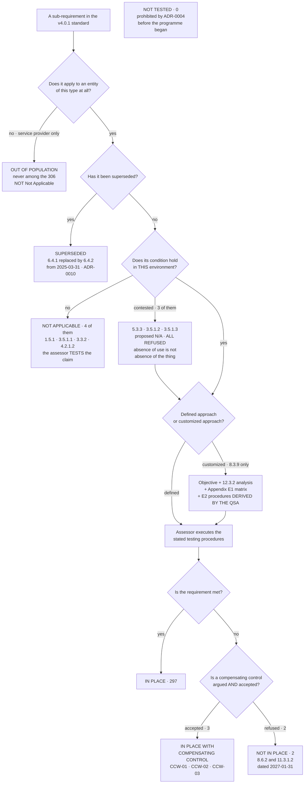

# How One Sub-Requirement Reaches a Disposition

## The two branches entities get wrong

**Marketa proposed seven exclusions. Four were accepted and three were refused** — 5.3.3, 3.5.1.2 and 3.5.1.3 — and all three refused proposals came back **In Place**, which is a stronger disposition than the one the entity argued for.

**Out of population is not Not Applicable.** A requirement that never applied to a merchant — 11.4.6, 12.5.2.1, 3.6.1.1, Appendix A1 — was never in the 306. Recording it as N/A inflates the denominator and makes the assessment look broader than it was.

**A compensating control is not a softer disposition.** It is a different, harder one: the entity must show the control addresses the risk the requirement addresses, goes above and beyond every other PCI DSS requirement, and is commensurate with the additional risk. **Two of Marketa's five arguments failed those tests**, and the answer was a finding rather than a weaker worksheet.

## Source
`08.05`, `08.07`, `08.08`.
