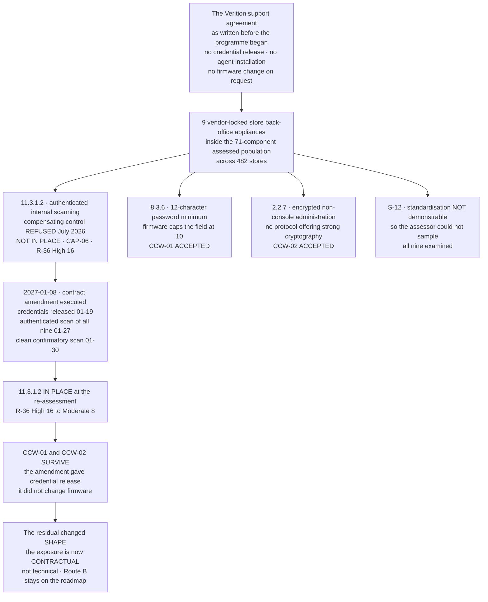

# Nine Devices, One Support Agreement, Three Exceptions

## Why this diagram exists

**One commercial decision made years before the programme started produced one of the two Not in Place findings, two of the three compensating controls, and the only population the assessor was not permitted to sample.** Three of the assessment's five recorded exceptions trace to the same nine devices.

That is worth drawing, because it is the clearest available answer to a question a reader should ask: *where does non-compliance actually come from?* Not, in this programme, from controls nobody built. From a contract nobody read as a security control.

**The remediation removed the finding, not the constraint.** A right to scan that exists because somebody negotiated a clause has a renewal date, and Route B — replacing the appliance class outright — stays on the 2027 roadmap for exactly that reason.

## Source
`08.02`, `08.07`, `08.10`, `08.12`.
