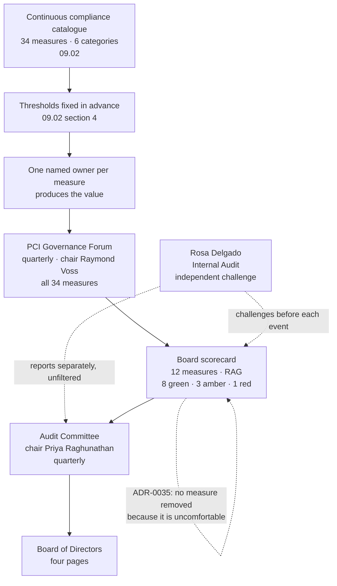

# 09.01 — Board &amp; Audit Committee Reporting

| Field | Value |
|---|---|
| Document ID | MRG-PCI-2026-901 |
| Program | Marketa Retail Group — PCI DSS v4.0.1 Compliance Program |
| Phase | 09 — Executive Reporting &amp; Continuous Compliance |
| Document | 09.01 — Board &amp; Audit Committee Reporting |
| Version | 1.0 |
| Status | Approved |
| Owner | Naomi Bhatt, Chief Information Security Officer |
| Approver | Raymond Voss, Chief Financial Officer |
| Date | 2026-07-15 |
| Classification | Confidential — Cardholder Data Environment // Illustrative Portfolio Sample |

## Purpose

This document records what the Board of Directors and the Audit Committee were actually told about the PCI DSS v4.0.1 compliance programme, when they were told it, and in how many pages.

Three reporting events carry the programme's whole governance story: the report of a **non-compliant Attestation of Compliance** on **2026-12-17**, delivered six days after the Report on Compliance was issued and on the same day the seasonal change-freeze exemption was approved; the quarterly Audit Committee report of the **re-assessment** on **2027-03-11**; and the **programme closure report to the Board** on **2027-06-24**, six days before the programme closed on 2027-06-30.

It also carries the **twelve-measure board scorecard** in the form it was presented, with a red–amber–green rating on every measure. At programme close the scorecard reads **eight green, three amber and one red**, and the red measure is the reason **ADR-0035** exists.

The section this document exists to earn is §6: what a board actually needs — four pages — against the 741-page report, 306 dispositions and 1,654 evidence artefacts that sit behind those four pages, and what happens to the quality of oversight when the two are confused.

## 1. The Three Reporting Events

| Date | Forum | Presented by | Subject | Pages tabled |
|---|---|---|---|---|
| **2026-12-17** | **Board of Directors and Audit Committee**, jointly | Raymond Voss and Naomi Bhatt | The **non-compliant** Attestation of Compliance filed with Cardinal Merchant Bank on 2026-12-11; the two Not in Place findings; the remediation plan and its 2027-01-31 date; the **change-freeze exemption**, approved the same day | 4 |
| **2027-03-11** | **Audit Committee**, quarterly | Raymond Voss and Naomi Bhatt | The **re-assessment of 2027-02-18** and the revised Report on Compliance and Attestation; the acquirer's release from monthly reporting; the risk position; the open-item register | 4 |
| **2027-06-24** | **Board of Directors** | Raymond Voss and Naomi Bhatt, with Rosa Delgado reporting separately | **Programme closure.** The final position, the scorecard, the cost, the eleven open items and their outcomes, the three items carried into business as usual, and the 2028 assessor rotation | 4 |

Rosa Delgado, Director of Internal Audit, reported to the Audit Committee **separately and without management filtering** at each of the three events, as the charter requires. Her October 2026 review produced **seven recommendations, none Critical**, and she confirmed at each event that no recommendation had been closed by redefinition.

### 1.1 2026-12-17 — reporting a non-compliant attestation

The charter makes a decision to file a non-compliant Attestation of Compliance a **mandatory Audit Committee escalation**. It was escalated, and the escalation is the reason the December meeting was a report rather than a discovery.

| Element | What was reported |
|---|---|
| The filing | The Attestation was signed by Raymond Voss on **2026-12-11**, marked **Non-Compliant**, and submitted to **Cardinal Merchant Bank, N.A.** the same day — **twenty days ahead** of the 31 December contractual date under **ADR-0031** |
| The findings | **Two of 306** applicable sub-requirements assessed **Not in Place**: **8.6.2**, hard-coded credentials in two legacy batch integrations, and **11.3.1.2**, authenticated internal vulnerability scanning impossible on **nine of seventy-one** components because a support agreement released neither credentials nor agent installation rights |
| Provenance of the findings | **Both were Marketa's own**, identified in Phase 05 and Phase 06 respectively, published in **05.07** and **06.05**, reported monthly to the Steering Committee, and described to the Audit Committee in **March 2026**. The assessor confirmed them; it did not discover them |
| Why no compensating control | A worksheet was available to be argued in both cases and was **refused in both**, in June and July 2026, on a test stated once and applied consistently. A late argument was declined three weeks before fieldwork under **DEC-710** |
| The remediation | **CAP-06** and **CAP-07**, both dated **2027-01-31** on the Attestation's Part 4, with a re-assessment booked for February. **Eighteen days of margin and no float** |
| The acquirer's position | Cardinal acknowledged the filing on **2026-12-16** and required **monthly remediation status reporting** until re-assessment. No other condition was imposed |
| The exemption | The **October–January seasonal change freeze** had to be broken to deploy either remediation. A **change-freeze exemption** was approved by the PCI Steering Committee on **2026-12-17** — the same day — with full change records, back-out plans, two observed nightly cycles after each deployment, deployment outside trading hours, and an expiry coincident with the freeze |
| What was not claimed | No statement was made that the position would be recovered. The Board was told the plan was credible and that the dates were not yet met |

**Why the exemption was requested rather than the freeze quietly ignored** was reported in one sentence: a remediation delivered by breaching a control is not a remediation, the change-management requirements were themselves re-assessed on 2027-02-18, and an undocumented exception would have created a new finding while closing an old one.

### 1.2 2027-03-11 — the re-assessment

| Element | What was reported |
|---|---|
| The outcome | **2027-02-18** — **16 sub-requirements re-tested** (the two findings plus fourteen related), revised Report on Compliance and Attestation issued the same day: **In Place 299 · Compensating Control 3 · Not Applicable 4 · Not Tested 0 · Not in Place 0 — Compliant** |
| The record | The 2026 non-compliant Attestation was **not withdrawn** — **ADR-0032**. Both filings stand, in that order, and the Committee was told why: an entity that erases a filed position teaches its own people that a bad filing is a temporary condition |
| The cost | **$44,000**, drawn against the **$187,000** contingency line. Described in terms as a **professional fee, not a penalty** |
| The constraint | **The remediation removed the finding, not the constraint.** The nine appliances are the same nine appliances on the same firmware under the same support agreement. **CCW-01 and CCW-02 survive.** The exposure at **R-36** changed shape from technical to contractual |
| The acquirer | Monthly reporting discharged and closed. **The relationship and the habit outlive the condition** |
| The register | **0 High · 24 Moderate · 20 Low** across 44 entries at that date, with the close forecast restated and — for the first time — publicly qualified |

### 1.3 2027-06-24 — programme closure

| Element | What was reported |
|---|---|
| Schedule | Kickoff **2026-01-12**, closure **2027-06-30** — **17.6 months** against a charter duration of approximately twelve |
| Cost | **$4,588,000** against a **$4,600,000** envelope; **$12,000 under**; contingency drawn **$175,000** of $187,000 |
| Position | **Compliant** at the revised Attestation of 2027-02-18; **0 High** risks; **44** register entries, none closed and none removed |
| The forecast | The published close forecast of **0 High · 13 Moderate · 31 Low** was **missed by three entries**. The actual close is **0 High · 16 Moderate · 28 Low**, and the Board was given the arithmetic rather than a narrative |
| Open items | **Eleven** at handover: **8 closed on or before date, 2 closed late, 1 not closed.** Three carry into business as usual as **BAU-01, BAU-02, BAU-03** |
| Observations | **Seventeen** assessor observations, every one dispositioned in writing under **ADR-0034**: 11 adopted, 3 adopted with amendment, 3 declined |
| Business as usual | Programme closes on a fixed date under **ADR-0033**, with a named owner for every recurring obligation. **4.2 FTE and $1,340,000 per year** against a programme average of 11.9 FTE |
| The 2028 rotation | **ADR-0036** — the next assessment is planned as though nothing carries forward |
| The scorecard | Eight green, three amber, **one red** — and the red was tabled first |

## 2. The Board Scorecard

Twelve measures, drawn from the 34-measure continuous compliance catalogue in **09.02**. Each carries a single named owner who can be asked to explain a movement, and each carries a rating that means something specific: **green** — the measure is at or above its threshold and the evidence supporting it is current; **amber** — the measure is below threshold, or at threshold on evidence that depends on something Marketa does not control; **red** — the measure has never been satisfied.

| # | Measure | Catalogue ref | Owner | Position at close (2027-06-30) | RAG |
|---|---|---|---|---|---|
| **BSC-01** | Validation status filed with the acquirer | M-01 | Raymond Voss | **Compliant** — revised Attestation of 2027-02-18 filed and acknowledged; the 2026 non-compliant filing stands on the record | **Green** |
| **BSC-02** | Applicable sub-requirements assessed Not in Place | M-02 | Owen Castellanos | **0 of 306** at re-assessment, from 2 at the 2026 assessment | **Green** |
| **BSC-03** | Risk register entries rated High | M-34 | Naomi Bhatt | **0 of 44.** No High residual was ever accepted by the Chief Financial Officer | **Green** |
| **BSC-04** | Quarters closed with a passing external scan on record | M-19 | Owen Castellanos | **4 of 4.** Q1 failed with 3 findings and was rescanned clean in 11 days, inside the quarter | **Green** |
| **BSC-05** | Penetration test findings outstanding beyond their remediation date | M-21 | Marcus Hale | **0.** All 19 findings from the 2026 tests remediated and retested; the 2027 segmentation test produced **6 findings, 0 Critical** | **Green** |
| **BSC-06** | Payment-page scripts inventoried, authorised and integrity-assured | M-08 | Sonia Rendell | **38 of 38** authorised; 11.6.1 alerting inside 24 hours; the 3 unauthorised scripts found at first inventory removed | **Green** |
| **BSC-07** | Third-party providers with current validation evidence on file | M-25 | Owen Castellanos | **6 of 6**, including TPSP-06's first full 12.8.4 annual review closed 2027-06-24 | **Green** |
| **BSC-08** | Compliance cost against plan | M-28 | Raymond Voss | **$4,588,000 against $4,600,000 — $12,000 under.** BAU run rate set at **$1,340,000** per year | **Green** |
| **BSC-09** | Contractual response-time commitments held for incident-driven provider action | M-26 | Frank Mueller | **None held from Truvance.** Requested at renewal under OI-07-01 and **declined by the provider**. The operational runbook is the only instrument | **Amber** |
| **BSC-10** | Controls whose operation depends on a contract clause rather than a technical property | M-27 | Frank Mueller | **R-36's residual is contractual, not technical.** The right to scan the nine appliances is a clause with a renewal date. **BAU-02** is the treatment | **Amber** |
| **BSC-11** | Compensating controls in force that carry a vendor remediation roadmap | M-03 | Naomi Bhatt | **0 of 3.** CCW-01, CCW-02 and CCW-03 must each be re-argued annually and none has a committed vendor release behind it | **Amber** |
| **BSC-12** | **Incident response capability proved against a real compromise of account data** | M-33 | Naomi Bhatt | **Never demonstrated.** 512 incident records, **5 SEV-2, 0 SEV-1**, no confirmed compromise of account data. **R-43 has not moved in any phase of this programme** | **Red** |

**Eight green, three amber, one red.**

### 2.1 The red measure, and ADR-0035

BSC-12 is red because the thing it measures **has never happened**. Marketa has an incident response plan at version 3.0, a 12.10.3 roster with monthly delivery testing verified across a full quarter, a severity model, a designated Incident Commander, an annual test under 12.10.2, and a tabletop designed by an outsider that ran **9 hours 20 minutes** to a determination the plan assumed would take four. It has 512 incident records across the operating period, of which 458 closed at SEV-4 and five reached SEV-2. **None of them was a compromise of account data.**

That is a good year. It is not evidence. A plan that has handled five credible-path events and no confirmed compromise has been exercised, not proved, and the distinction is the whole content of **R-43** — the register entry that has not moved in any phase of this programme, held explicitly in Phase 06, Phase 07 and Phase 08 with the same sentence each time: **use is not proof**.

Two arguments were put for removing BSC-12 from the scorecard, and both were rejected.

| Argument for removal | Why it was rejected |
|---|---|
| The measure can only be satisfied by an event Marketa is spending $1.34 million a year to prevent, so a permanently red measure is a permanently misleading one | It is not misleading. It is **accurate**, and its accuracy is the point. The Board is entitled to know that the most consequential capability in the programme is the one with the least evidence behind it |
| A scorecard with a red measure that never turns green trains readers to ignore it | A scorecard with **no** red measure trains readers to stop reading. **ADR-0035** records the position: **no measure is removed from the board scorecard because it is uncomfortable.** A scorecard that goes all green is a scorecard that has stopped measuring something |

**ADR-0035** is written narrowly. It does not say that measures may never be retired; it says that discomfort is not a reason, and that the reason for any retirement is minuted and reported to the Audit Committee at the next quarterly meeting.

### 2.2 The three amber measures

**BSC-09 — no contractual response-time commitment from Truvance.** Marketa's acquirer-notification obligation under **C5** runs within 24 hours of determining a suspected or confirmed compromise. Determining one, for a tokenized estate, requires Truvance to resolve tokens to the account data behind them, and Truvance holds the only mapping. **OI-07-01** asked for a contractual response-time commitment on that resolution. The provider **declined at renewal**. The runbook, the escalation contacts and the tested path all remain; what does not exist is an obligation. The measure is amber rather than red because the capability exists and has been exercised — it is the *commitment* that is missing, not the mechanism.

**BSC-10 — R-36's residual is contractual, not technical.** The nine vendor-locked appliances can now be scanned with authentication because the **Verition** amendment of 2027-01-08 says Marketa may obtain administrative credentials and install an agent. Nothing about the appliances changed. If that clause lapses at renewal, **11.3.1.2 returns to the position it occupied in 2026**, and the treatment for that — Route B, replacement of the appliance class — is a capital decision carried into business as usual as **BAU-02**.

**BSC-11 — three compensating controls, none with a vendor roadmap.** CCW-01 (8.3.6), CCW-02 (2.2.7) and CCW-03 (3.4.2) are live, validated and re-argued at the re-assessment rather than carried forward. None of the three has a vendor release behind it that would remove the constraint. The consequence is stated on the scorecard in the terms the Audit Committee asked for: **the moment Verition ships a release lifting the 10-character password cap, CCW-01 stops being a compensating control and becomes an unremediated finding**, because the constraint the worksheet rests on will have disappeared while the configuration has not changed.

### 2.3 How the scorecard is produced, and how it can be challenged

A scorecard whose ratings are set by the people being measured is a self-assessment with colours on it. Four mechanics prevent that, and they are stated because the ratings in §2 are only as good as the process that assigned them.

| Mechanic | Position |
|---|---|
| **Threshold before reading** | Every measure's threshold is written into the catalogue in **09.02 §4** and is fixed before the period it measures. A rating is the result of applying a stated threshold to a measured value, not a judgement about how the year felt |
| **One named owner per measure** | Twelve measures, six named individuals. The owner is the person the Audit Committee asks about a movement, and the question has to land somewhere. No measure is owned by a function or a committee |
| **Independent challenge** | **Rosa Delgado**, Director of Internal Audit, reviews the scorecard before each event and reports separately to the Audit Committee without management filtering. She does not own any measure and does not vote on any programme decision, which is the reason her challenge is worth having |
| **The assessor's own words** | Where a measure restates an assessment outcome — **BSC-01**, **BSC-02**, **BSC-11** — the wording is the assessor's, not Marketa's, under **ADR-0030**. The General Counsel asked in December whether the findings could be softened and was told they could not; softening them in a board paper would have been the same act performed later |

## 3. What Was Told to the Audit Committee in March 2026

The December 2026 report was not a surprise, and it was not a surprise because of a paper tabled nine months earlier.

At the quarterly Audit Committee of **March 2026** — the first at which the programme had a scope position, a register and a set of constraints rather than a plan — the Committee was told four things.

| # | What was said in March 2026 | What it became in December 2026 |
|---|---|---|
| **1** | The charter's own constraints record **nine vendor-managed appliances on which Marketa cannot install an authenticated scanning agent without vendor support**, and that this is a live risk to a v4.0.1 requirement that became mandatory in March 2025 | **11.3.1.2 Not in Place** on exactly those nine components |
| **2** | Legacy batch integrations exist that authenticate with embedded credentials, that Marketa holds no source rights over one vendor wrapper and no callback hook in an ERP interface library, and that **8.6.2 may not be met by the assessment date** | **8.6.2 Not in Place**, 2 of 142 accounts |
| **3** | **ADR-0004**, taken in Phase 01, makes a **Not Tested** disposition unavailable. Any requirement that cannot be evidenced will appear as a finding rather than as a blank | **Not Tested: 0 of 306**, and two findings on the face of the Attestation |
| **4** | Under the charter, a decision to file a **non-compliant** Attestation is a **mandatory** escalation to this Committee, and the Committee should expect that decision to be put to it in the fourth quarter | It was, on 2026-12-17 |

**Priya Raghunathan's minuted response in March was the sentence the programme reported against for the rest of the year**: that the Committee would judge the programme on whether the December report matched the March one, not on whether the December report was good news.

It did. The two findings the Committee was told to expect are the two findings it received, on the components it was told about, for the reasons it was given. No third finding appeared. **That is the whole value of a March conversation, and it is not available retrospectively.**

## 4. What Priya Raghunathan Asked

The Audit Committee chair asked four questions across the three events. Each is recorded with the answer given, because the questions a board asks are a better description of what a board needs than any framework.

| Event | Question | Answer given |
|---|---|---|
| **2026-12-17** | *"Does the assessor's conclusion bind Cardinal Merchant Bank, and can Cardinal reach a different view?"* | **No, and yes.** A Report on Compliance is a Qualified Security Assessor's opinion about an assessed period. It binds neither the acquirer nor any card brand. Cardinal receives the Attestation, sets its own conditions, and did — monthly reporting from 2026-12-16 |
| **2026-12-17** | *"If the remediation slips, what is the exposure, and what is the number?"* | The exposure is described as categories — assessed against the acquirer under the card brand programmes and **passed through to Marketa under the merchant agreement**, alongside the direct costs of forensic investigation and card reissuance in a breach scenario. **There is no number, and the programme does not state one.** What the programme could state is the operational consequence: continued monthly reporting, a live remediation obligation, and a validation position that would carry into the 2027 cycle |
| **2027-03-11** | *"The 2026 filing said non-compliant. Why is it still on the record now that it is not true?"* | Because it was true on 2026-12-11, and **ADR-0032** leaves it standing. The revised Attestation is additive. An entity that withdraws a filed position teaches its own people that a bad filing is a temporary condition, and the next uncomfortable filing gets argued rather than made |
| **2027-06-24** | *"Which of these twelve measures would still be true if the programme's eleven people were four?"* | Eight of the twelve are outputs of mechanisms that run without supervision — the daily assertions, the ASV cadence, the script inventory, the provider register. **Four are not.** BSC-02, BSC-05, BSC-11 and BSC-12 depend on somebody choosing to test something nobody has asked for. **09.04 §6 and 09.07 name that as the programme's principal transfer risk into business as usual** |

## 5. What Raymond Voss Asked

The executive sponsor's questions were about money and about signature exposure, and both belong in this document because the answers shaped the reporting.

| Event | Question | Answer given |
|---|---|---|
| **2026-12-17** | *"Is the $44,000 re-assessment fee a penalty?"* | **No.** It is a professional fee for assessor time to re-test 16 sub-requirements, drawn against the **$187,000** contingency line that exists for exactly this. **No fine, fee schedule or penalty amount is stated anywhere in this programme**, and none has been incurred |
| **2026-12-17** | *"I sign this. What am I signing?"* | Part 3b of the Attestation is the entity's assertion that the information in the Report is accurate and that Marketa will **maintain** compliance. It is an assertion about an assessed period and a **forward obligation**, not a forward finding. **Nothing in it says anything about the day after it was signed** |
| **2027-03-11** | *"What does this cost to keep, as against what it cost to build?"* | **4.2 FTE and $1,340,000 a year**, against a programme that averaged **11.9 FTE** and spent **$4,588,000**. 09.04 §5 sets out which obligations absorb the difference and which are genuinely cheaper to run than to build |
| **2027-06-24** | *"What resets in 2028?"* | **CTP-1 to CTP-12**, all eighteen sampling rationales, all three compensating controls, all four Not Applicable determinations, and the scope boundary itself. **ADR-0036** plans the 2028 assessment as though nothing carries forward. The 51 assessor hours the customized approach cost in 2026 are spent again, from zero, by somebody who has never seen the argument |

## 6. What a Board Needs, and What Sits Behind It

Each of the three reports ran to **four pages**. That was a decision, not a constraint, and it is the most contested decision in this document.

| Page | Content | Why a board needs it |
|---|---|---|
| **1** | **Validation status.** What was filed, with whom, on what date, and what it says. One paragraph on what the instrument is and is not | It is the only fact the Board is contractually exposed to. Everything else in the programme exists to produce it |
| **2** | **The exceptions.** Every disposition that is not a plain In Place — the two findings, the three compensating controls, the four Not Applicable determinations, the one customized approach — each in one line with an owner and a date | A board cannot review 306 dispositions and should not try. It can review **nine exceptions**, and the exceptions are where the judgement was |
| **3** | **The money and the things that could still go wrong.** Budget against actual; the BAU run rate; the open items with dates; the risks that did not move and why | Funding and forward exposure are the two decisions actually reserved to this forum |
| **4** | **The scorecard**, twelve measures with a rating, and the red one first | It is the only page anybody re-reads |

What sat behind those four pages, available on request and never requested in full:

| Artefact | Size |
|---|---|
| Report on Compliance | **741 pages**, 1,654 evidence references |
| Requirement dispositions | **306**, across twelve requirements |
| Indexed evidence artefacts | **1,654** — 1,284 documents, 228 configuration examinations, 47 interviews, 61 observations, 34 independent assessor testing actions |
| Risk register | **44 entries**, each with likelihood, impact, treatment and a movement history |
| Continuous compliance catalogue | **34 measures** across six categories |
| Recurring obligation calendar | **47 dated obligations** for 2027–28 |
| Assessor observations | **17**, each with a written disposition under **ADR-0034** |
| Targeted risk analyses | **14** |

### 6.1 What was deliberately left out, and why

Leaving material out of a board paper is a decision with a failure mode at each end. Six categories were excluded and the reason is recorded for each, because "the Board did not need it" is the sentence that precedes most governance failures.

| Left out | Why | Where a Board member could get it |
|---|---|---|
| The **306** individual dispositions | A board cannot review them and should not try. The **nine exceptions** are where the judgement was, and they were on page two | Report on Compliance Part II; **08.05** |
| The **44** risk register entries in full | Rating movements without the underlying scoring discipline are unreadable. The scorecard carries the only register measure a board can act on — **BSC-03**, entries rated High | **08.13**; the register itself |
| The **18** sampling rationales | They are an argument between Marketa and the assessor about whether standardisation permits a sample. **The assessor chose every sample**, which is the only fact a board needs | **08.02** |
| The **34-measure** catalogue | Twenty-two of the thirty-four are operational measures whose escalation route is the Governance Forum. A board that receives daily-assertion pass rates discusses daily-assertion pass rates | **09.02** |
| The **47** recurring obligations | A calendar is an operating instrument. What the Board was told is that every one has a named owner under **ADR-0033** | **09.09**; 01.11 |
| Any **fine, fee or penalty figure** | **Marketa does not hold that number and could not verify it.** Publishing an estimate would create a false precision the Board would then plan against. The exposure was described as categories only | **09.04 §8** |

**The rule applied was not "what does the Board need to know" but "what could the Board be criticised for not having asked about".** The two questions produce different papers, and the second one produces page three.

**The ratio is the argument.** Four pages sat on top of a 741-page report, and the temptation in both directions is real. A board given forty pages reads none of them and asks no questions; a board given four pages that have been smoothed reads them, believes them, and asks the wrong questions. The discipline that makes four pages defensible is not brevity — it is that **the four pages contain the same bad news as the 741, in the same words**. The Attestation said non-compliant; page one said non-compliant. The assessor's language on the two findings was reproduced rather than paraphrased, because **ADR-0030** had already refused to soften it in the report and softening it in the board paper would have been the same act performed later.

The test applied to every board paper in this programme was a single question: **would a reader of these four pages be surprised by anything in the 741?** For the three events recorded here the answer was no, and the March 2026 conversation in §3 is the reason.

### 6.2 The programme closure paper, page by page

The closure report of **2027-06-24** is reproduced here in structure, because it is the only one of the three that had to summarise seventeen and a half months rather than a single event.

| Page | Content | The number that carried it |
|---|---|---|
| **1** | **Position.** Compliant at the revised Attestation of 2027-02-18; the 2026 non-compliant filing standing on the record under **ADR-0032**; what a Report on Compliance and an Attestation are and are not | **299 · 3 · 4 · 0 · 0 = 306** |
| **2** | **Exceptions.** Three compensating controls, none with a vendor roadmap; one customized approach with no forward assurance; four Not Applicable determinations, each tested rather than accepted; the seventeen assessor observations and their dispositions | **9 exceptional dispositions · 17 observations** |
| **3** | **Money and forward exposure.** Budget against actual; the BAU run rate; the eleven open items and their outcomes; the three BAU carries; the risks that did not move and why | **$4,588,000 against $4,600,000 · 4.2 FTE · 11 items · 3 carries** |
| **4** | **The scorecard**, twelve measures, red first; the close forecast miss reported as a miss; the 2028 rotation | **8 · 3 · 1** and **0 High · 16 Moderate · 28 Low against a forecast 0 · 13 · 31** |

**Page four carried the programme's worst news and its best sentence in the same paragraph.** The close forecast published in 03.12 §6 was missed by three entries, and the reason is that a forecast written in month seven moved thirteen register entries across a band boundary the register's own arithmetic does not permit them to cross. **The Board was given the arithmetic rather than a narrative**, and 09.03 §6.2 and 09.07 §3.1 carry it in full.

## 7. What This Document Does Not Claim

**PCI DSS is contractual, not statutory.** The PCI Security Standards Council writes the standard and does not enforce it; enforcement runs from the card brands to the acquirer to the merchant, and Marketa's counterparty is **Cardinal Merchant Bank, N.A.**, not Visa. **There is no PCI DSS certification for a merchant.** A Report on Compliance and an Attestation of Compliance are a **point-in-time attestation about an assessed period**, and **no Attestation of Compliance is a determination of compliance with any law**. Marketa is privately held, is not an SEC registrant, and has no SOX control population. **No fine, fee schedule or penalty amount is stated anywhere in this programme**; the professional fees recorded here — including the **$44,000** re-assessment fee — are costs of assurance and are not penalties.

Nothing in the twelve-measure scorecard asserts that the environment is secure. Eleven of the twelve measure whether a control exists, operates and can be evidenced. **The twelfth measures whether the capability that matters most has ever been proved, and it is red.**

## Cross-References

| Reference | Relevance |
|---|---|
| **ADR-0035 — The Board Scorecard Keeps Its Red Measure** | §2.1; no measure is removed because it is uncomfortable |
| **ADR-0033 — The Programme Closes on a Fixed Date** | §1.3; the 2027-06-30 close reported to the Board |
| ADR-0002 — The AOC Signature Sits with the CFO | §5; what Raymond Voss signed |
| ADR-0004 — No "Not Tested" Findings Permitted | §3; the March 2026 warning that produced two findings rather than two blanks |
| ADR-0031 — The Non-Compliant AOC Is Filed Early, Not Late | §1.1; the twenty-day margin |
| ADR-0032 — The 2026 Attestation Is Not Withdrawn | §1.2 and §4; why the non-compliant filing stands |
| **09.02 — Executive Metrics &amp; KPI Framework** | The 34-measure catalogue from which the twelve scorecard measures are drawn |
| **09.04 — The Cost of Compliance** | BSC-08; the budget, the framings and the BAU run rate |
| **09.06 — Open Items &amp; Corrective Actions** | BSC-09; OI-07-01 and BAU-01 |
| 01.06 — Program Charter &amp; Objectives | The Audit Committee reporting line, the escalation rules, and the mandatory non-compliant-filing escalation |
| 08.10 — The Two Not in Place Findings | The findings reported on 2026-12-17 |
| 08.11 — Attestation of Compliance &amp; Acquirer Submission | The filing, the signature and Cardinal's 2026-12-16 conditions |
| 08.12 — Remediation Plan &amp; Re-Assessment | The change-freeze exemption approved 2026-12-17; the 2027-02-18 outcome |
| **08.14 — Phase Summary &amp; Transition** | The handover this phase reports against |

---
[⬅ Previous](../08-qsa-assessment-roc-production/08.14-phase-summary-and-transition.md) · [🏠 Phase 09 Home](09.00-README.md) · [Next ➡](09.02-executive-metrics-and-kpi-framework.md)
