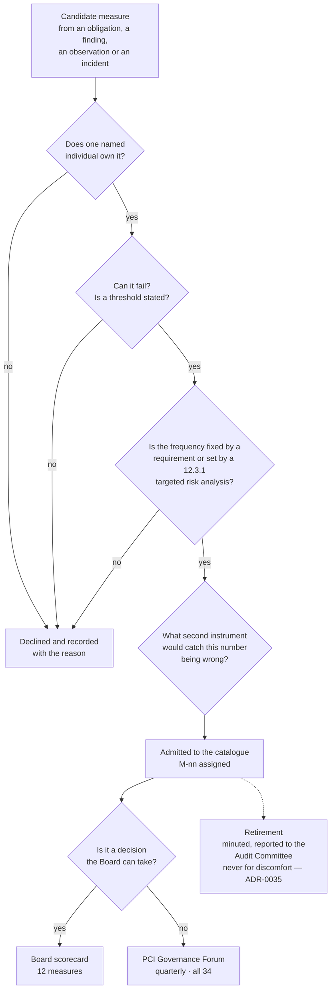

# 09.02 — Executive Metrics &amp; KPI Framework

| Field | Value |
|---|---|
| Document ID | MRG-PCI-2026-902 |
| Program | Marketa Retail Group — PCI DSS v4.0.1 Compliance Program |
| Phase | 09 — Executive Reporting &amp; Continuous Compliance |
| Document | 09.02 — Executive Metrics &amp; KPI Framework |
| Version | 1.0 |
| Status | Approved |
| Owner | Owen Castellanos, Payment Card Compliance Manager |
| Approver | Naomi Bhatt, Chief Information Security Officer |
| Date | 2026-07-15 |
| Classification | Confidential — Cardholder Data Environment // Illustrative Portfolio Sample |

## Purpose

This document is the continuous compliance measurement catalogue: **34 measures across 6 categories**, of which **12 appear on the board scorecard** in 09.01 and 22 do not. **Nine are leading indicators and twenty-five are lagging.**

It states what each measure is, who owns it, how often it is produced, and whether it reaches the Board. It then does the thing a metrics document usually refuses to do, in **§6 — what a metric cannot tell you** — and it does it with the programme's own evidence rather than with a general caution, because the programme produced three cases in which a healthy number sat directly on top of a real defect, and in every one of those three the defect was found by a **second instrument** rather than by the first one's number moving.

The catalogue is the instrument business as usual runs on. **09.08** assigns each measure to a named BAU owner; this document defines them.

## 1. The Rules the Catalogue Is Built On

| # | Rule | Why |
|---|---|---|
| **1** | **Every measure has exactly one named owner** — a person, not a team or a function | A measure with two owners has none. The owner is the person who is asked to explain a movement, and that question has to land somewhere |
| **2** | **Every measure has a stated frequency**, and the frequency is either fixed by a requirement or set by a targeted risk analysis under 12.3.1 | A frequency chosen without an analysis fails 12.3.1 even where the frequency is sensible. A cadence is not a habit with a number attached |
| **3** | **A measure that cannot fail is not a measure.** Every one carries a threshold at which it changes colour | Coverage percentages that only ever read 100% are reporting that the denominator is being managed |
| **4** | **No measure is removed from the board scorecard because it is uncomfortable** — **ADR-0035** | A scorecard that goes all green has stopped measuring something |
| **5** | **A leading measure is one that can move before the outcome does.** Everything else is lagging, and the catalogue says which | Nine of thirty-four are leading. That ratio is stated rather than improved by relabelling |
| **6** | **Every measure names the second instrument that would catch it being wrong** — recorded in §6 for the three cases where the first instrument was wrong | A number that has no independent corroboration is an assertion with a decimal point |

## 2. The Six Categories

| Category | Scope | Measures | Count | On scorecard |
|---|---|---|---|---|
| **A — Validation &amp; Assessment Outcome** | What the annual assessment concluded, and what the assessment cost to produce | M-01 to M-05 | **5** | 3 |
| **B — Scope &amp; Asset Integrity** | Whether the assessed boundary is still the real boundary | M-06 to M-10 | **5** | 1 |
| **C — Technical Control Operation** | Whether the controls inside the boundary are running | M-11 to M-18 | **8** | 0 |
| **D — Testing &amp; Assurance** | What independent testing found, and what it covered | M-19 to M-24 | **6** | 2 |
| **E — Third Party, Contractual &amp; Cost** | Dependencies Marketa does not control, and what the position costs | M-25 to M-28 | **4** | 4 |
| **F — People, Risk, Incident &amp; Governance** | The parts operated by human beings, and the register | M-29 to M-34 | **6** | 2 |
| **Total** | | **M-01 to M-34** | **34** | **12** |

**5 + 5 + 8 + 6 + 4 + 6 = 34.** Three of the six categories carry no majority of the scorecard, and one — **Category C, the largest** — carries none of it at all. That is deliberate and is explained in §5.

## 3. The Full Catalogue

| ID | Measure | Category | Leading / lagging | Owner | Frequency | On board scorecard |
|---|---|---|---|---|---|---|
| **M-01** | Validation status filed with the acquirer | A | Lagging | Raymond Voss | Annual | **Yes — BSC-01** |
| **M-02** | Applicable sub-requirements assessed Not in Place | A | Lagging | Owen Castellanos | Annual | **Yes — BSC-02** |
| **M-03** | Compensating controls in force, and how many carry a vendor remediation roadmap | A | Lagging | Naomi Bhatt | Annual | **Yes — BSC-11** |
| **M-04** | Customized-approach assessor hours consumed against estimate | A | Lagging | Owen Castellanos | Annual | No |
| **M-05** | Evidence requests satisfied from artefacts that already existed | A | Lagging | Owen Castellanos | Annual | No |
| **M-06** | Assessed system components against the confirmed 12.5.2 scope | B | Lagging | Owen Castellanos | Monthly | No |
| **M-07** | 12.5.1 component-register reconciliation exceptions | B | **Leading** | Owen Castellanos | Monthly | No |
| **M-08** | Payment-page scripts inventoried, authorised and integrity-assured | B | Lagging | Sonia Rendell | Monthly | **Yes — BSC-06** |
| **M-09** | Unexpected PAN locations found per full discovery run | B | Lagging | Elena Marchetti | Semi-annual | No |
| **M-10** | Boundary-affecting changes classified as routine and caught by daily assertion | B | **Leading** | Trevor Kim | Monthly | No |
| **M-11** | Critical security control failures — CSC-1 to CSC-10 — and time to restore | C | Lagging | Marcus Hale | Monthly | No |
| **M-12** | Daily drift assertions passing — DA-1 to DA-6 and CA-1 to CA-6 | C | **Leading** | Trevor Kim | Daily | No |
| **M-13** | Automated log-review queue items adjudicated within the day | C | Lagging | Marcus Hale | Daily | No |
| **M-14** | Critical and high patches applied within one month of release | C | Lagging | Trevor Kim | Monthly | No |
| **M-15** | Multi-factor authentication coverage on all access into the CDE | C | Lagging | Trevor Kim | Monthly | No |
| **M-16** | Shared and break-glass account population, reconciled across **both** registers | C | **Leading** | Trevor Kim | Quarterly | No |
| **M-17** | Privileged sessions originating from a privileged access workstation | C | Lagging | Trevor Kim | Monthly | No |
| **M-18** | Payment-page tamper alerts raised, and time from change to alert | C | Lagging | Sonia Rendell | Weekly | No |
| **M-19** | Quarters closed with a passing external scan on record | D | Lagging | Owen Castellanos | Quarterly | **Yes — BSC-04** |
| **M-20** | Authenticated internal scan coverage of in-scope components | D | Lagging | Marcus Hale | Quarterly | No |
| **M-21** | Penetration test findings outstanding beyond their remediation date | D | Lagging | Marcus Hale | Annual | **Yes — BSC-05** |
| **M-22** | Segmentation test findings reaching an in-scope zone | D | Lagging | Trevor Kim | Annual | No |
| **M-23** | Detection rules validated at the quarterly controlled execution | D | **Leading** | Marcus Hale | Quarterly | No |
| **M-24** | POI device inspection coverage across 1,914 terminals | D | **Leading** | Adaeze Nwosu | Quarterly | No |
| **M-25** | Third-party providers with current validation evidence on file under 12.8.4 | E | Lagging | Owen Castellanos | Quarterly | **Yes — BSC-07** |
| **M-26** | Contractual response-time commitments held for incident-driven provider action | E | Lagging | Frank Mueller | Quarterly | **Yes — BSC-09** |
| **M-27** | Controls whose operation depends on a contract clause, by clause renewal date | E | **Leading** | Frank Mueller | Quarterly | **Yes — BSC-10** |
| **M-28** | Compliance cost against plan — programme envelope and BAU run rate | E | Lagging | Raymond Voss | Quarterly | **Yes — BSC-08** |
| **M-29** | Security awareness completion against the 95% charter bar | F | Lagging | Owen Castellanos | Annual | No |
| **M-30** | Unannounced repair-personnel identity tests passed | F | **Leading** | Adaeze Nwosu | Quarterly | No |
| **M-31** | Phishing simulation report rate and click-through | F | **Leading** | Marcus Hale | Semi-annual | No |
| **M-32** | Incident records by severity, and incidents involving account data | F | Lagging | Marcus Hale | Monthly | No |
| **M-33** | **Incident response capability proved against a real compromise of account data** | F | Lagging | Naomi Bhatt | Annual | **Yes — BSC-12** |
| **M-34** | Risk register entries rated High | F | Lagging | Naomi Bhatt | Monthly | **Yes — BSC-03** |

### 3.1 Catalogue reconciliation

| Dimension | Composition | Total |
|---|---|---|
| **By category** | A 5 · B 5 · C 8 · D 6 · E 4 · F 6 | **34** |
| **Leading** | M-07, M-10, M-12, M-16, M-23, M-24, M-27, M-30, M-31 | **9** |
| **Lagging** | The remaining twenty-five | **25** |
| **On the board scorecard** | M-01, M-02, M-03, M-08, M-19, M-21, M-25, M-26, M-27, M-28, M-33, M-34 | **12** |
| **Not on the board scorecard** | The remaining twenty-two | **22** |
| **Owners** | Owen Castellanos 8 · Trevor Kim 7 · Marcus Hale 7 · Naomi Bhatt 3 · Sonia Rendell 2 · Frank Mueller 2 · Adaeze Nwosu 2 · Raymond Voss 2 · Elena Marchetti 1 | **34** |

## 4. Thresholds and What Each Measure Reads at Close

| ID | Threshold at which the measure changes colour | Reading at 2027-06-30 |
|---|---|---|
| M-01 | Anything other than Compliant on the most recent filing | **Compliant** — revised Attestation 2027-02-18 |
| M-02 | Any sub-requirement Not in Place | **0 of 306** |
| M-03 | Any compensating control without a vendor roadmap | **0 of 3 have one** — amber |
| M-04 | Actual hours exceeding estimate by more than 10% | **51 against 46 — 10.9% over** |
| M-05 | Below 80% satisfied from existing artefacts | **86.9%** — 186 of 214 |
| M-06 | Any component in scope and not in the assessed register | **71 of 71** |
| M-07 | Any reconciliation exception unresolved at month close | Exceptions raised and cleared each month |
| M-08 | Any script unauthorised, or any alert later than 24 hours | **38 of 38 authorised** |
| M-09 | Any unexpected PAN location found | **0** at the second full discovery run |
| M-10 | Any misclassification surviving past the next daily assertion | Bounded at 24 hours by **CSC-8** |
| M-11 | Any critical security control failure not restored inside its stated window | Reported monthly; **F-07** is the case §6.3 examines |
| M-12 | Any assertion failing two consecutive days | Twelve assertions, daily |
| M-13 | Any queue item unadjudicated at day close | Daily |
| M-14 | Any critical or high patch beyond one month | Monthly |
| M-15 | Below 100% of access paths into the CDE | **100%** |
| M-16 | Any account in one register and not the other | **20**, reconciled across both registers **2027-04-17** |
| M-17 | Any privileged session from a general-purpose workstation | **178** administrative personnel migrated by 2027-05-29 |
| M-18 | Any alert later than 24 hours from change | Weekly |
| M-19 | Any quarter closing without a passing scan on record | **4 of 4** |
| M-20 | Below 100% of in-scope components authenticated | **71 of 71** since 2027-01-30 |
| M-21 | Any finding past its remediation date | **0** |
| M-22 | Any finding reaching an in-scope zone | **0 reached from Z3** at the 2027-05-21 test |
| M-23 | Any rule not validated at the controlled execution | **3 of 4** at 2027-03-31; the fourth is **BAU-03** |
| M-24 | Below 99% terminal coverage in a cycle | **99.56%** at the last full-year measurement |
| M-25 | Any provider without current validation evidence | **6 of 6** |
| M-26 | Any critical provider without a response-time commitment | **Truvance holds none** — amber |
| M-27 | Any control depending on a clause inside 12 months of renewal | **R-36's scanning right** — amber |
| M-28 | Variance above 10% of the envelope | **−$12,000 on $4,600,000** |
| M-29 | Below the 95% charter bar | **97.1%** |
| M-30 | Any test failed | **2 of 9 failed** in 2026; expanded to 48 tests a year under OI-05-05 |
| M-31 | Click-through above 5%, or any credential submission | **41% report, 2.1% click, 0 submissions** |
| M-32 | Any incident involving account data | **512 records · 5 SEV-2 · 0 SEV-1 · 0 account data** |
| M-33 | Never satisfied | **Red** — see 09.01 §2.1 and **ADR-0035** |
| M-34 | Any entry rated High | **0 of 44** |

## 5. Why Category C Carries None of the Scorecard

Category C is the largest category in the catalogue — eight measures, more than any other — and not one of them reaches the Board.

That is not an accident of triage. The eight measures in Category C describe whether controls are running: assertions passing, queues adjudicated, patches applied, coverage held, alerts raised. Every one of them is important, every one is produced at least monthly, and every one is reviewed at the PCI Governance Forum. **None of them is a decision the Board can take.** A board that receives daily-assertion pass rates will discuss daily-assertion pass rates, which is a discussion the Security Operations Manager is better equipped to have and which displaces the four discussions actually reserved to that forum — funding, forward exposure, the exceptions, and the one capability that has never been proved.

The escalation route is stated instead. **Any Category C measure that breaches its threshold for two consecutive reporting periods is escalated to the PCI Governance Forum, and any that breaches for two consecutive quarters is escalated to the Audit Committee by exception.** A measure that never reaches the Board is not a measure nobody is accountable for; it is a measure whose accountability sits at the level that can act on it.

### 5.1 How a measure enters the catalogue, and how it leaves

**One candidate was declined during Phase 09 and the reason is recorded in 09.05 §3.3.** The assessor's observation **OBS-04** implied a published *unexercised entitlement rate*. It fails the first gate: the report crosses **24 role definitions** and several entitlement-granting systems, and no single named person can be asked why the aggregate moved. **An unowned metric is a number nobody has to explain**, and a number nobody has to explain is reported, noted and never acted on. The report itself continues to run and its output is actioned at the six-monthly access reviews, where the owner is and where an entitlement actually gets removed.

**Retirement is the harder direction.** A measure may be retired when the obligation it evidences no longer exists, when it has been superseded by a measure that subsumes it, or when the population it is computed over has gone. It may **not** be retired because it reads badly. Every retirement is minuted with its reason and reported to the Audit Committee at the next quarterly meeting — the narrow form of **ADR-0035**, which does not forbid retirement and does forbid discomfort as a reason.

### 5.2 The twenty-two that are not on the scorecard

The twenty-two non-scorecard measures are not lesser measures; several of them are the instruments that would detect a real failure first. What distinguishes them is the forum that can act.

| Group | Measures | Where they are acted on |
|---|---|---|
| **Daily and continuous operation** | M-12, M-13 | Daily operational review; failures raise an incident record automatically at **P1** |
| **Monthly control attestation** | M-06, M-07, M-10, M-11, M-14, M-15, M-17, M-32 | Requirement owners, monthly, in the record that survives programme close |
| **Cyclical assurance** | M-18, M-20, M-22, M-23, M-24 | Quarterly and annual testing cycles; **M-23** carries **BAU-03** |
| **Annual and periodic** | M-04, M-05, M-09, M-29 | Annual review; **M-05** is the evidence-discipline measure whose decay 09.07 §3.4 treats as a lesson |
| **Human-factor testing** | M-16, M-30, M-31 | Store operations readiness call and the security testing programme |

**The escalation route is the point.** Any of the twenty-two breaching its threshold for two consecutive reporting periods escalates to the PCI Governance Forum, and for two consecutive quarters to the Audit Committee by exception. **A measure that never reaches the Board is not a measure nobody is accountable for.**

## 6. What a Metric Cannot Tell You

This is the section the catalogue exists to earn.

Every measure in §3 is a number about a population. A number about a population tells you the state of the population it was computed over, at the moment it was computed, along the single dimension it measures. **It does not tell you about the dimension it does not measure, and the failures that matter are almost always in that second category.** The programme produced three cases, each with a healthy number sitting directly on top of a real defect, and each found by a second instrument.

### 6.1 97.1% awareness completion did not predict two agents who would have deleted a call recording

**The number.** Security awareness completion under 12.6.3 reached **97.1%** across approximately 34,000 staff plus the seasonal intake, against a charter bar of **95%**. It is the programme's most quoted figure and it is correct.

**What it measures.** That a person opened a module and completed it. Not what they would do.

**What it did not predict.** A scenario-based comprehension exercise put forty-six colleagues in front of realistic situations. **Forty-two answered correctly.** Two of the four who did not were call-centre agents who said they would **delete a call recording** on discovering it contained spoken account data, and one was a store manager who said he would **remove the terminal** on finding a tamper indicator. All three were about to destroy the evidence of an incident while following an instinct that looks exactly like diligence. Every one of them had completed AW-1 and AW-2. **They are inside the 97.1%.**

**The second instrument.** The scenario exercise — a different instrument, on a different population, measuring a different thing. Both findings produced procedure amendments. **Neither would have been visible from reading the policy, and neither is detectable in a completion percentage at any value including 100%.**

### 6.2 99.56% POI inspection coverage did not predict two of nine failed repair-personnel identity tests

**The number.** **7,622 inspections** across four quarterly cycles at **1,914 terminals** in **482 stores**, at **99.56% coverage**, with **zero terminals uninspected across the year**. The assessor personally observed **96 terminals across 28 stores it chose itself**, including store 0417, with no store-level finding.

**What it measures.** That the inspection happened.

**What it did not predict.** **Nine unannounced tests of the repair-personnel verification rule were run across the year — somebody in a Verition-branded shirt arriving with no work order. Two failed.** In both, the colleague granted access without verifying. Both failures fell on the same profile: a shift lead who had joined within five weeks, with no manager on site. The design produced the failure, not the individuals, and the fix was a design change with a system-generated refusal rather than a training module.

**The second instrument.** An unannounced adversarial test of the *decision* rather than an audit of the *record*. As the CISO put it in the phase that measured it: **"Ninety-nine point five six tells me the inspections happened. Two out of nine tells me what the inspections are worth."** A coverage measure and a detection measure are not two views of one thing; they are two things, and the estate can score 99.56% on the first while scoring 78% on the second.

Two further readings from the same programme belong here, because they show the same shape. **341 inspection records were submitted in under 25 seconds** and were re-inspected — three of the re-inspections found something the fast pass had missed. And **15.8% of inspection photographs had to be retaken.** Both were found by quality gates inside the instrument, not by the coverage percentage the instrument reports.

### 6.3 A healthy log-review dashboard did not predict a rule reporting itself healthy for 57 hours

**The number.** The automated log review mechanism required by **10.4.1.1** reported a healthy rule set, an adjudicated queue and no failed sources. The dashboard was green throughout.

**What it measures.** That the mechanism is running and the queue is clear.

**What it did not predict.** On **2026-04-12** a detection rule's source dependency failed. The source stopped emitting a field the rule referenced after a configuration change, and **the rule stopped firing and reported healthy** — for **57 hours 5 minutes**, from 02:00 on 2026-04-12 to 11:05 on 2026-04-14. Recorded as **F-07**. The rule did not declare its dependency, so nothing in the health model knew the dependency existed. **A rule that cannot fire cannot report that it did not fire.**

**The second instrument.** **CSC-9**, one of the ten critical security control failure detection mechanisms operating under 10.7.2, which watches for the *absence* of expected signal rather than the presence of an unhealthy one. And then a third instrument answered the question the first two could not: whether anything had happened in the window. **Retrospective execution of the rule against the retained logs established that no event occurred**, and that was possible only because the **10.5.1** twelve-month retention obligation exists independently of the detection mechanism.

### 6.4 What the three cases have in common

| | 97.1% awareness | 99.56% POI coverage | Green log-review dashboard |
|---|---|---|---|
| **What the number measured** | Completion of a module | Performance of an inspection | Operation of a mechanism |
| **What it was read as measuring** | Whether people would act correctly | Whether terminals were protected | Whether detection was working |
| **The defect it sat on top of** | Two agents who would have destroyed evidence | Two of nine access decisions failed | A rule silently not firing for 57 hours |
| **The second instrument that found it** | Scenario comprehension exercise, 46 colleagues | Nine unannounced identity tests | **CSC-9**, absence-of-signal detection |
| **Would the first number have moved?** | **No, at any value** | **No** — coverage rose while detection failed | **No** — the dashboard was green throughout |

**Every one of the three was found by a second instrument, not by the first one's number.** That is the catalogue's governing limitation, and it is why §1 rule 6 obliges every measure to name what would catch it being wrong.

Three consequences follow, and they are the working rules of the framework rather than observations about it.

**A number can only fail in the dimension it measures.** Completion measures completion. Coverage measures coverage. Health measures health. Choosing a metric is choosing a failure mode you will see, and by construction choosing the failure modes you will not.

**The instruments that find things are usually adversarial and usually small.** Nine identity tests, forty-six scenario questions, one controlled execution of a rule set, one penetration test. None of them produces a rate — nine tests across 482 stores is informative and is not a percentage — and the temptation is to replace them with something that produces a clean denominator. That temptation is the mechanism by which a measurement programme becomes an assurance theatre.

**A green dashboard is a claim about the dashboard.** The most expensive thing in this section is not the 57 hours; it is that the 57 hours were invisible to the instrument whose whole purpose was visibility. **Every continuous monitoring mechanism in this programme tells you a control stopped. None tells you a control was never right**, and that sentence is repeated in 09.09 without softening.

### 6.5 The instruments that are not metrics

The three second instruments in §6 have something in common that no measure in §3 has: **none of them produces a rate.** Nine identity tests across 482 stores is not a percentage. Forty-six scenario questions is not a coverage figure. One retrospective execution of a rule against retained logs is a single answer to a single question.

The programme's most informative instruments are all of that kind, and they are listed here because a metrics framework that does not name them will eventually be asked to replace them with something that has a denominator.

| Instrument | What it measures that no metric does | What it found |
|---|---|---|
| **Unannounced repair-personnel identity tests** | Whether a colleague refuses a plausible stranger | **2 of 9 failed**, both where the shift lead had joined within five weeks |
| **Scenario comprehension exercise** | What a person would actually do | **4 of 46 wrong**, including two agents who would have deleted a call recording |
| **Segmentation penetration testing** | Whether a boundary holds against somebody trying | **The first test failed** — store 0417, a defect latent at 37 stores |
| **The quarterly controlled execution** | What the detection rule set **misses** | Thirteen technique surfaces recorded as untested; four new rules, **3 of 4** validated |
| **The tabletop, with a scenario chosen by an outsider** | Whether a load-bearing assumption survives | Determination took **9h20m** against a plan that assumed **4** |
| **The second full discovery run** | Whether the estate is clean, rather than whether it was cleaned | Returned nothing — the exit criterion for **R-31** under **ADR-0005** |
| **CSC-1 to CSC-10 absence-of-signal detection** | That an expected signal stopped | **F-07** — a rule reporting healthy for 57 hours 5 minutes |
| **Re-inspection of fast-submitted records** | Whether a completed record was completed honestly | **341** records submitted in under 25 seconds; 3 re-inspections found something the fast pass missed |

**Every one of these is small, adversarial, and expensive per data point.** Every one of them is also the only reason the programme knows what its clean numbers are worth. **The standing instruction is that no instrument in this table is replaced by a measure that reports a rate**, and any proposal to do so is a Governance Forum decision minuted with its reason.

## 7. Reporting Routes

| Route | Cadence | Content | Audience |
|---|---|---|---|
| Daily operational review | Daily | M-12, M-13 | Security operations |
| Monthly control attestation | Monthly | M-06, M-07, M-10, M-11, M-14, M-15, M-17, M-32, M-34 | Requirement owners; PCI Governance Forum secretary |
| **PCI Governance Forum** | **Quarterly**, chaired by Raymond Voss | All 34, with exceptions narrated | Forum members |
| **Audit Committee** | Quarterly | The 12 scorecard measures; any Category C measure breaching for two consecutive quarters | Priya Raghunathan and Committee |
| **Board of Directors** | Annual, and on any material event | The 12 scorecard measures, red first | Board |
| Acquirer | Annual, and by condition | M-01, M-19; anything Cardinal requires under C1 to C10 | Cardinal Merchant Bank, N.A. |

## 8. What This Framework Does Not Claim

No measure in this catalogue establishes that Marketa's environment is secure, and none establishes compliance with any law. **PCI DSS is contractual, not statutory**; the Council writes the standard and does not enforce it; **there is no PCI DSS certification for a merchant**; and a Report on Compliance and an Attestation of Compliance are a **point-in-time attestation about an assessed period** whose author's opinion binds neither the acquirer nor any card brand. **No fine, fee schedule or penalty amount appears in this framework**; M-28 measures the cost of assurance only.

Thirty-three of the thirty-four measures describe whether a control exists, operates and can be evidenced. **M-33 describes whether the capability that matters most has ever been proved against the event it exists for, and its reading is that it has not.**

## Cross-References

| Reference | Relevance |
|---|---|
| **ADR-0035 — The Board Scorecard Keeps Its Red Measure** | §1 rule 4; **M-33** |
| **09.01 — Board &amp; Audit Committee Reporting** | The twelve scorecard measures and their RAG ratings |
| **09.04 — The Cost of Compliance** | **M-28**; the envelope, the BAU run rate and the three framings |
| **09.05 — Assessor Observations Disposition** | **OBS-05** behind **M-16**; **OBS-04** and why an unowned metric was declined |
| **09.06 — Open Items &amp; Corrective Actions** | **M-23** and BAU-03; **M-26** and BAU-01 |
| **09.07 — Lessons Learned** | The 86.9% behind **M-05**, and why it decays |
| 01.11 — Compliance Calendar &amp; Obligations | The frequencies these measures are produced against |
| 05.09 — POI Device Protection | §6.2 — 99.56%, the nine identity tests and the 341 fast submissions |
| 06.04 — Time Synchronisation &amp; Failure Detection | §6.3 — **F-07**, the 57-hour silent rule, and CSC-9 |
| 07.02 — Acceptable Use &amp; Topic Policies | §6.1 — the forty-six-colleague scenario exercise and the two agents |
| 07.04 — Security Awareness Programme | §6.1 — the 97.1% and what it does not bound |
| 08.03 — Evidence Management &amp; Assessor Requests | **M-05** — 186 of 214 at 86.9% |

---
[⬅ Previous](09.01-board-and-audit-committee-reporting.md) · [🏠 Phase 09 Home](09.00-README.md) · [Next ➡](09.03-performance-against-the-programme-charter.md)
