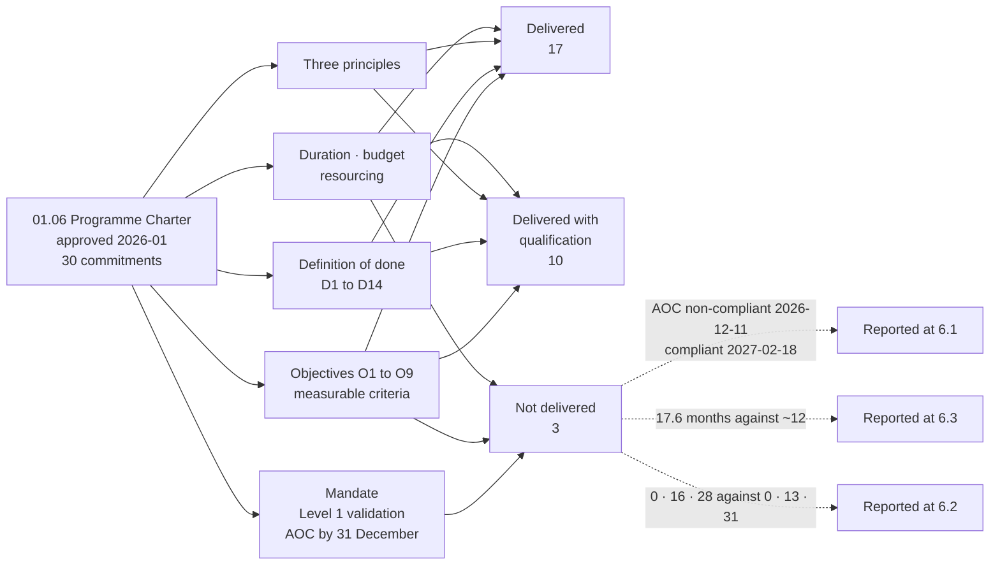

# 09.03 — Performance Against the Programme Charter

| Field | Value |
|---|---|
| Document ID | MRG-PCI-2026-903 |
| Program | Marketa Retail Group — PCI DSS v4.0.1 Compliance Program |
| Phase | 09 — Executive Reporting &amp; Continuous Compliance |
| Document | 09.03 — Performance Against the Programme Charter |
| Version | 1.0 |
| Status | Approved |
| Owner | Naomi Bhatt, Chief Information Security Officer |
| Approver | Raymond Voss, Chief Financial Officer |
| Date | 2026-07-15 |
| Classification | Confidential — Cardholder Data Environment // Illustrative Portfolio Sample |

## Purpose

**01.06 — Program Charter &amp; Objectives** is the authority under which every phase of this programme operated. It made nine objectives with measurable success criteria, fourteen definition-of-done criteria, three governing principles, a duration, a budget and a resourcing commitment. It also stated, in terms, that *"improved," "enhanced" and "strengthened" are not acceptable success criteria in this programme*.

This document reports against **every commitment the charter actually makes**, one row per commitment, with one of three verdicts and the evidence for it. It does not aggregate, it does not average, and it does not describe a partially met criterion as met.

Where a commitment was not met in full, **§6 states so in the plainest available words**, including the one that matters most: the charter's mandate was an annual Level 1 validation producing an Attestation of Compliance filed with Cardinal Merchant Bank by 31 December, and **the Attestation Marketa filed on 2026-12-11 was non-compliant**. Compliance was reached at re-assessment on **2027-02-18**, seven weeks after the contractual date.

## 1. The Three Verdicts

| Verdict | Meaning | Count |
|---|---|---|
| **Delivered** | The criterion as written was met, on evidence, without qualification | **17** |
| **Delivered with qualification** | The criterion was met, and something material about how it was met, when it was met, or what it turned out to measure requires stating | **10** |
| **Not delivered** | The criterion as written was not met | **3** |
| **Total commitments reported** | The mandate, nine objectives, fourteen definition-of-done criteria, three principles, plus duration, budget and resourcing | **30** |

**17 + 10 + 3 = 30.** The composition by source is: mandate 1 · objectives 9 · definition of done 14 · principles 3 · duration 1 · budget 1 · resourcing 1.

## 2. The Mandate

| Commitment (01.06 §1 and §2) | Verdict | Evidence |
|---|---|---|
| Marketa is a **Level 1 merchant** contractually bound to PCI DSS through its merchant agreement with Cardinal Merchant Bank, and *"this programme is chartered to reach and sustain that standard"* — discharged by an annual validation producing an executed Attestation of Compliance on or before **31 December**, obligation **C3** | **Not delivered** | The Attestation filed on **2026-12-11**, twenty days ahead of the contractual date, was marked **Non-Compliant** on two of 306 applicable sub-requirements. Compliance was reached at re-assessment on **2027-02-18**, seven weeks after the contractual date. **The standard was reached. It was not reached by 31 December 2026.** See §6.1 |

## 3. The Nine Objectives

| # | Charter criterion (01.06 §3) | Verdict | Evidence |
|---|---|---|---|
| **O1** | Charter approved; PCI Steering Committee constituted and meeting; twelve requirement owners named; Audit Committee reporting line live | **Delivered** | Charter approved by Raymond Voss; Steering Committee met monthly from 2026-01 chaired by Raymond Voss with Owen Castellanos as secretary and Rosa Delgado as non-voting observer; twelve requirement owners named in 01.07; Audit Committee reported quarterly from **March 2026**, with the December out-of-cycle joint report on **2026-12-17** |
| **O2** | Scope documented and confirmed under 12.5.2; PAN discovery across 100% of 1,842 systems plus 41 network shares and 6 email archives; **604 → 71 (−88.2%)**; all unexpected PAN remediated | **Delivered** | Scope confirmed and accepted by the assessor as Part I §3 of the Report; discovery ran **1,842 of 1,842 systems**, 41 shares, 6 archives; **604 → 71**; the **four** unexpected PAN locations remediated and each driving a 12.10.7 procedure improvement; the second full discovery run returned nothing |
| **O3** | 9 network zones documented; segmentation validated by penetration test; **a passing segmentation test on re-test after the initial test failed** | **Delivered** | Nine zones; the first segmentation test **failed in May 2026** at store **0417**, Dayton OH, on a latent defect present at **37 stores**; remediation and a clean re-test in **June 2026**; the second annual test closed **2027-05-21** with **6 findings, 0 Critical and 0 reached from Z3** |
| **O4** | Configuration standards live on all 71 components; 6.4.3 script inventory complete (38 scripts, 6 templates, 11 third-party) with all unauthorised scripts removed; 5.3.3 and 5.4.1 mechanisms operating | **Delivered with qualification** | Baselines **BL-WIN 18 · BL-LNX 15 · BL-NET 11 · BL-AWS 6 · BL-DB 3 · BL-APP 12** plus **6 un-baselined SaaS control planes = 71**. The script inventory found **3 of 38 unauthorised** and removed them. **The qualification is the six SaaS control planes**, governed by contract and configuration review rather than by a configuration standard — raised by the assessor as **OBS-02** and adopted with amendment in 09.05 |
| **O5** | MFA on all access into the CDE (8.4.2); 12-character minimum enforced (8.3.6); application and system account governance (8.6.1–8.6.3); quarterly 9.5.1 inspection cycle across 1,914 terminals | **Delivered with qualification** | MFA at **100%** of access paths into the CDE; four quarterly inspection cycles at **7,622 inspections, 99.56% coverage, 0 terminals uninspected**. **The qualification is 8.3.6**: the twelve-character minimum is **not** enforced on the nine vendor-locked appliances, whose firmware caps local passwords at ten. That requirement is met by **compensating control CCW-01**, not by the control the charter described. **8.6.2 was assessed Not in Place** in 2026 and remediated at 2027-01-29 and 2027-01-31 |
| **O6** | Automated log review under 10.4.1.1; 4 passing quarterly ASV scans; internal, external and segmentation penetration testing complete with all findings remediated and retested; 11.6.1 alerting within 24 hours; **TPSP governance under 12.8 for all four providers** | **Delivered with qualification** | Automated review live; **4 of 4 quarters** closed with a passing ASV scan on record, Q1 having failed with 3 findings and been rescanned clean in 11 days inside the quarter; all **19** penetration test findings — 2 Critical, 5 High, 7 Medium, 5 Low — remediated and retested; 11.6.1 alerting inside 24 hours. **The qualification is the word "four."** The charter counted **four** providers. The register carried **five** at approval and **six** at close, because Phase 05 found the Ashburn co-location provider performing three of Marketa's Requirement 9 controls and absent from the register entirely. **A criterion written against a population that was wrong cannot be met as written**, and 12.8 governance now covers **six** |
| **O7** | Policy suite approved under 12.1; 14 targeted risk analyses under 12.3.1; 44 risks registered and treated; 12.10.7 procedures in force and exercised; awareness completion ≥ 95% | **Delivered** | Policy suite approved; **14** targeted risk analyses; **44** register entries, none closed, none removed and none ever added; 12.10.7 procedures in force and improved four times by the four unexpected PAN findings; awareness at **97.1%** against a 95% bar |
| **O8** | Fieldwork 2026-11-02 to 2026-11-20; ROC and AOC issued 2026-12-11; every finding assigned a named owner and a date; re-assessment achieving full compliance 2027-02-18 | **Delivered with qualification** | Fieldwork ran the stated fifteen business days; ROC (741 pages, 1,654 evidence references) and AOC issued **2026-12-11**; both findings carried a named owner and the date **2027-01-31**; re-assessment **2027-02-18** returned **299 · 3 · 4 · 0 · 0 — Compliant**. **The qualification is that the criterion as retained already contemplates a re-assessment.** The charter's own mandate in §1 is an annual validation; the Attestation filed at the contractual point was **non-compliant**, and §6.1 states that plainly rather than reading the re-assessment clause as though it had always been the plan |
| **O9** | Board and Audit Committee report delivered 2026-12-17; continuous-compliance calendar operating; **risk profile at close 0 High · 13 Moderate · 31 Low**; ≤ 12 open items each with owner and date | **Not delivered** | Three of four limbs met: the report was delivered **2026-12-17**; the calendar operates with **47 dated obligations** for 2027–28; **11** open items, each with a named owner and a date, against a bar of twelve. **The fourth limb was missed.** The close position is **0 High · 16 Moderate · 28 Low** against a published forecast of **0 High · 13 Moderate · 31 Low** — **three entries short**. See §6.2 |

## 4. The Fourteen Definition-of-Done Criteria

The charter states that the programme is complete when **all** of the following are true, and that *partial satisfaction is not completion*.

| # | Criterion (01.06 §9) | Verdict | Evidence |
|---|---|---|---|
| **D1** | Scope documented and confirmed under 12.5.2, with 71 assessed components substantiated | **Delivered** | Phase 02 scope document accepted by the assessor; **8 CDE + 63 connected-to = 71**; the monthly 12.5.1 reconciliation held the figure across the year |
| **D2** | Segmentation implemented and proved by a passing penetration test | **Delivered** | Ironwood segmentation re-test, June 2026, clean; second annual test closed 2027-05-21 |
| **D3** | All 306 applicable sub-requirements assessed, with **zero Not Tested** | **Delivered** | **Not Tested: 0 of 306**, under **ADR-0004** taken in Phase 01 before anybody knew what it would cost |
| **D4** | Four passing quarterly ASV scans for the compliance year | **Delivered** | Four Attestations of Scan Compliance; Q1 clean on rescan within the quarter |
| **D5** | Internal, external and segmentation penetration testing complete, **all 19 findings** remediated and retested | **Delivered** | Ironwood reports and retest evidence for all 19, including both Critical findings — the store back-office VLAN reachable from guest Wi-Fi and the unauthenticated administrative interface on the chargeback application |
| **D6** | 6.4.3 script inventory complete and 11.6.1 monitoring operating with alerting inside 24 hours | **Delivered with qualification** | Inventory complete at **38 scripts across 6 templates, 11 third-party**; monitoring alerting inside 24 hours. **The qualification is OI-06-03**: two scripts remained served from a third-party origin rather than the Marketa tag proxy at the assessment and were migrated on **2027-03-24**, three months after the criterion was reported met |
| **D7** | 14 targeted risk analyses complete and approved | **Delivered** | Ten required by a specific requirement, four elective; **TRA-5.2.3.1** amended from an assumed annual cadence to **six-monthly with event triggers** on the Phase 04 analysis |
| **D8** | 44 risks registered and treated; **0 High at close** | **Delivered** | **0 High · 16 Moderate · 28 Low** across 44 entries. No High residual was ever accepted by the Chief Financial Officer. Two entries were raised on evidence — **R-14** and **R-31** — and both are Low at close |
| **D9** | Awareness training completion ≥ 95% | **Delivered** | **97.1%** across approximately 34,000 staff plus the seasonal intake |
| **D10** | TPSP governance complete under 12.8 for all providers, with responsibility matrices under 12.8.5 | **Delivered with qualification** | Six providers governed, each with a responsibility matrix. **The qualification is the same as O6's**: the population was five at charter approval and six at close, and the sixth was found by a control looking for something else rather than by the register |
| **D11** | ROC and AOC issued and filed with Cardinal Merchant Bank | **Delivered** | Filed **2026-12-11**, twenty days ahead of the contractual date, under **ADR-0031**; acknowledged **2026-12-16** |
| **D12** | **Full compliance achieved** — every Not in Place finding remediated and re-assessed | **Delivered with qualification** | **299 · 3 · 4 · 0 · 0 — Compliant** at 2027-02-18. **The qualification is that the 2026 Attestation was filed non-compliant and has not been withdrawn** — **ADR-0032**. Both filings stand, in that order. See §6.1 |
| **D13** | Board and Audit Committee report delivered | **Delivered** | **2026-12-17**, six days after the Report was issued, jointly by Raymond Voss and Naomi Bhatt, with Rosa Delgado reporting separately |
| **D14** | Continuous-compliance calendar operating, with ≤ 12 open items each carrying a named owner and a date | **Delivered with qualification** | **11** open items at close, each with an owner and a date. **The qualification is their outcomes**: 8 closed on or before date, **2 closed late** — OI-06-04 by 34 days and OI-06-08 by 40 — and **1 was not closed at all**. A count inside the bar is not the same as a register that ran to time |

## 5. Schedule, Budget and Resourcing

### 5.1 Schedule

| Commitment | Charter position | Actual | Verdict |
|---|---|---|---|
| Duration | *"Approximately 12 months; kickoff 2026-01-12"* | Kickoff **2026-01-12**; closure **2027-06-30** — **17.6 months** | **Not delivered** |
| Fieldwork window | 2026-11-02 to 2026-11-20 | As stated, 15 business days | **Delivered** |
| ROC and AOC issue | 2026-12-11 | As stated | **Delivered** |
| Attestation filed with Cardinal | On or before **31 December** — obligation **C3** | **2026-12-11**, twenty days early | **Delivered** |
| Board and Audit Committee report | 2026-12-17 | As stated | **Delivered** |
| Full compliance | Charter §9 D12 | **2027-02-18** | **Delivered with qualification** — see §6.1 |

**The overrun is 5.6 months, and it is not an overrun in delivery.** Control implementation completed on **2026-07-31**, as planned. The assessment ran on the date it was scheduled for. What extended the programme past twelve months was the tail: remediation to **2027-01-31**, re-assessment on **2027-02-18**, and then a further four months of open-item closure running to **2027-06-30** under **ADR-0033**, which fixes a closure date and names a business-as-usual owner for every recurring obligation rather than letting the programme dissolve into operations.

The charter's estimate was written in January 2026 against an assumption that the assessment would conclude the programme. It did not. **A programme that files a non-compliant attestation acquires five months of work that nobody scheduled**, and the honest reading of the 17.6 months is that the charter under-estimated the tail rather than that the programme ran late in the middle.

### 5.2 Budget

| Commitment | Charter position | Actual | Verdict |
|---|---|---|---|
| Total envelope | **$4,600,000** | **$4,588,000** | **Delivered — $12,000 under** |
| Contingency | **$187,000** | **$175,000 drawn**, $12,000 unused | **Delivered** |

**09.04** carries the line-by-line variance. The material movements are a **$44,000** re-assessment fee against the QSA line, **$77,000** on the segmentation build for the store 0417 remediation across 37 stores, **$94,000** on internal labour, and a **$47,000** underspend on security tooling.

### 5.3 Resourcing

| Commitment | Charter position | Actual | Verdict |
|---|---|---|---|
| Internal labour | **11.4 FTE-equivalents** | **11.9 average**, **12.7 at peak in October 2026** | **Delivered with qualification** — 4.4% above plan on average, and 11.4% above at peak |
| Internal Audit | ~0.4 FTE, funded outside the envelope to preserve independence | As stated; Rosa Delgado's October review produced **7 recommendations, 0 Critical** | **Delivered** |

The October 2026 peak of **12.7 FTE** is the month in which the internal audit, the penetration test remediation, the awareness completion push ahead of the seasonal intake, the incident response plan test and pre-fieldwork evidence assembly all ran concurrently, inside the first month of the change freeze. **The charter's constraint section predicted the freeze and did not predict the concurrency**, and the qualification is recorded because the 2028 cycle will hit the same month with **4.2 FTE**.

## 6. Every Commitment That Was Not Met in Full

This section exists because a charter report that reads as a list of successes is a charter report nobody has to check.

### 6.1 The 2026 Attestation was filed non-compliant

The charter's mandate in §1 is unambiguous: Marketa is a **Level 1 merchant**, contractually bound through its merchant agreement with Cardinal Merchant Bank, and the programme *"is chartered to reach and sustain that standard."* Obligation **C3** requires the executed Attestation on or before **31 December**. The plain reading of the charter at kickoff was an annual validation producing a **compliant** Attestation for the 2026 compliance year.

**That did not happen.** The Attestation of Compliance signed by Raymond Voss on **2026-12-11** and submitted to Cardinal the same day was marked **Non-Compliant**, on two of 306 applicable sub-requirements:

| Requirement | Finding | Population |
|---|---|---|
| **8.6.2** | Hard-coded credentials remaining in two legacy batch integrations | 2 of 142 accounts |
| **11.3.1.2** | Authenticated internal vulnerability scanning not performed | 9 of 71 components |

There is no partial status on the form. **Two findings produce the same status as twenty.** Compliance was reached at re-assessment on **2027-02-18**, when sixteen sub-requirements were re-tested and the revised Report and Attestation were issued.

Four things about that outcome are stated without softening, because the charter's third principle — *honest findings over convenient ones* — is itself one of the commitments being reported against.

**Both findings were Marketa's own.** They were identified in Phase 05 and Phase 06, published in 05.07 and 06.05, reported monthly to the Steering Committee and described to the Audit Committee in March 2026. The assessor confirmed them; it did not discover them.

**A compensating control was available in both cases and was refused in both**, in June and July 2026, on a test stated once and applied consistently. A late argument was declined three weeks before fieldwork under **DEC-710**. Had either been argued and accepted, the Attestation would have read compliant. **The programme chose the finding.**

**The 2026 filing has not been withdrawn** — **ADR-0032**. The revised Attestation is additive, both stand on the record in the order they were made, and Marketa's compliance history for 2026 reads as it happened.

**It was not a cheap outcome.** It cost **$44,000** in re-assessment fees, a monthly reporting obligation to the acquirer from 2026-12-16, an out-of-cycle Board and Audit Committee report, and a remediation executed inside the seasonal change freeze under an exemption with **eighteen days of margin and no float**. It ended well because the plan was credible and the dates were met, not because filing non-compliant is inexpensive.

### 6.2 The close forecast was missed by three entries

Objective **O9** committed to a risk profile at close of **0 High · 13 Moderate · 31 Low**. The actual position at **2027-06-30** is **0 High · 16 Moderate · 28 Low**.

**Three entries short, and the reason is arithmetic rather than delivery.** The forecast published in 03.12 §6 moved thirteen entries from Moderate to Low. Four of those thirteen were delivered in Phase 06 and six in Phase 09. **Three were not — R-04, R-28 and R-33 — and all three are scored 3 × 4.** Two further entries the forecast took from High to Low, **R-17 and R-36**, arrive at 2 × 4 instead. Two entries nobody forecast to move at all reached Low, which recovers two of the five.

Under this register's own discipline — a rating moves on likelihood unless the consequence itself changed, and a likelihood of 1 means the event is not reasonably foreseeable — **an entry scored 3 × 4 cannot reach Low. It can reach 2 × 4 = 8, and 8 is Moderate. Eight is a floor.** The Phase 03 forecast moved thirteen entries across a boundary the arithmetic does not permit them to cross, and it was written in month seven of an eighteen-month programme, before the scoring discipline had been tested against a single year of evidence.

**The close position is not a failure of the programme. It is a failure of a prediction**, and the charter is being reported against the prediction it published rather than the one it could have written afterwards. **09.07 §3.1** carries this as the first of the four uncomfortable lessons.

### 6.3 The duration was under-estimated by 5.6 months

Reported at §5.1. **Not delivered** against *"approximately 12 months."*

### 6.4 Two open items closed late, and one did not close

Reported in full in **09.06**. **OI-06-04** closed **34 days late** and **OI-06-08** closed **40 days late**; both are reported as late rather than re-dated to something they could meet. **OI-07-01 did not close**: Marketa asked its most critical provider for a contractual response-time commitment on incident-driven token resolution and **Truvance declined at renewal**. The programme cannot close it, does not close it, and does not re-word it into something closable; it becomes **BAU-01** with a named owner and the next renewal date.

### 6.5 Two criteria were written against populations that were wrong

**O6** and **D10** both count third-party service providers, and both count **four**. The register carried five at charter approval and **six** at close. The sixth — the Ashburn co-location provider, performing three of Marketa's Requirement 9 controls — was absent from the register entirely until Phase 05 found it, and was added as **TPSP-06**. Its first full 12.8.4 annual review closed **2027-06-24**, as **OI-06-06**.

A criterion that counts a population is only as good as the population, and this one was wrong by two at the moment the charter was approved. **The failure is not in the delivery; it is in the criterion**, and it is recorded here because a charter report that silently substitutes the corrected number has quietly repaired the charter rather than reported against it.

### 6.6 What the charter did not commit to at all

A charter report that only examines the commitments a charter made will always conclude that the charter was well written. Four things the charter did **not** commit to turned out to matter, and they are recorded because the 2028 cycle will be chartered by somebody reading this document.

| Gap | What happened because of it | What a 2028 charter should say |
|---|---|---|
| **No commitment about commercial agreements as security controls** | The charter's §10 recorded the nine vendor-managed appliances as a **constraint** and correctly predicted the 11.3.1.2 finding. **It did not oblige anybody to read the support agreement.** Three of the assessment's five exceptional dispositions trace to terms in that document — no credential release, no agent installation right, no software modification | Name the three contract terms that determine whether a class of requirements is achievable, and oblige a security review of them at signature and at renewal |
| **No commitment about what happens after the assessment** | The duration was estimated at approximately twelve months on an assumption that the assessment concludes the programme. It did not: remediation, re-assessment and open-item closure added **5.6 months** and roughly **$94,000** of unplanned internal labour | Charter the tail explicitly, with a closure date and a named BAU owner for every recurring obligation — which is what **ADR-0033** did retrospectively |
| **No commitment about forecast discipline** | 01.06 committed to a close position of **0 · 13 · 31** and said nothing about how a forecast is derived, checked or recomputed. The forecast was arithmetically impossible when written and was restated three times | Require per-entry target scores rather than bands, and recomputation at every phase boundary |
| **No commitment about the transfer to business as usual** | The charter funded a programme at **11.4 FTE** and said nothing about what runs it afterwards. BAU is **4.2 FTE** and **$1,340,000 a year**, and the obligations are identical | State the steady-state resourcing in the charter, so that the build is designed for the operation rather than for the assessment |

**Every one of these four was addressed during the programme rather than at its start**, and each was addressed because something went wrong first. That is the honest reading, and it is the most transferable content in this document.

## 7. Performance Against the Three Principles

The charter's own §2 sets three principles that *shape every decision in the programme*. They carry no numeric criterion, which makes them the easiest commitments to claim and the hardest to evidence.

| Principle | Verdict | Evidence, and its limits |
|---|---|---|
| **Scope reduction before control implementation** — *"the cheapest control is the one that is not needed"* | **Delivered** | Phase 02 ran before Phases 04–07 as designed. **604 → 71, −88.2%**, achieved through P2PE, tokenization and DTMF masking. The limit is stated in 09.04: the reduction rests on three third parties' validation status, and **all of it can move without Marketa doing anything** |
| **Continuous compliance, evidenced annually** — *"the AOC is a by-product of a programme that runs all year"* | **Delivered with qualification** | **186 of 214 evidence requests — 86.9% — were satisfied from artefacts that already existed**, which is the single most direct measurement of this principle the programme produced. The qualification is that the figure is the output of a programme running at 11.9 FTE, and BAU runs at 4.2. **09.07 §3.4** treats the decay of that figure as an uncomfortable lesson rather than a risk |
| **Honest findings over convenient ones** — *"a failed segmentation test found in May is a success"* | **Delivered** | The May 2026 segmentation test failed and was reported as a failure; **R-14** and **R-31** were **raised** on evidence after remediation was complete, under **ADR-0005**, which was tested and declined nine times and applied twice; two compensating controls were refused; **1.2.8** was corrected in flight on the assessor's second working day and disclosed under **ADR-0029**; a non-compliant Attestation was filed early rather than late; and **seven of thirty-one** factual-review comments on the Report were declined by the assessor, all seven having sought characterisation rather than fact |

## 8. Verdicts by Source

| Source | Commitments | Delivered | Delivered with qualification | Not delivered |
|---|---|---|---|---|
| **Mandate** (01.06 §1–§2) | 1 | 0 | 0 | **1** |
| **Objectives O1–O9** (§3) | 9 | 4 | 4 | **1** |
| **Definition of done D1–D14** (§9) | 14 | 10 | 4 | 0 |
| **Principles** (§2) | 3 | 2 | 1 | 0 |
| **Duration** (§1) | 1 | 0 | 0 | **1** |
| **Budget** (§8) | 1 | 1 | 0 | 0 |
| **Resourcing** (§8) | 1 | 0 | 1 | 0 |
| **Total** | **30** | **17** | **10** | **3** |

**Two observations about the distribution.** The definition-of-done criteria have the highest delivery rate — **ten of fourteen clean** — because they were written as evidence tests rather than as outcomes, and an evidence test is either satisfied or it is not. The objectives have the lowest, because four of the nine bundle several limbs into one criterion and a criterion with four limbs fails if any one of them does. **A criterion that cannot partially fail is a better criterion**, and that is the most useful structural finding in this report.

## 9. Summary

| Dimension | Charter | Actual |
|---|---|---|
| Commitments reported | — | **30** |
| Delivered | — | **17** |
| Delivered with qualification | — | **10** |
| **Not delivered** | — | **3** — the mandate limb requiring a compliant Attestation by 31 December 2026, the twelve-month duration, and objective **O9**'s **0 · 13 · 31** close forecast |
| Schedule | ~12 months from 2026-01-12 | **17.6 months** to 2027-06-30 |
| Budget | **$4,600,000** | **$4,588,000** — $12,000 under |
| Resourcing | **11.4 FTE** | **11.9 average · 12.7 peak** |
| Validation | Annual Level 1 validation | **Non-Compliant 2026-12-11 · Compliant 2027-02-18** |
| Risk profile at close | **0 · 13 · 31** | **0 · 16 · 28** |
| Open items | ≤ 12 with owner and date | **11** — 8 on time, 2 late, 1 not closed |

**The charter set thirty commitments and this programme met twenty-seven of them, ten of those twenty-seven with a qualification serious enough to state at length.** It missed three. Two of the three misses — the twelve-month duration and the **0 · 13 · 31** risk forecast — were estimation failures written into the charter before the programme had any evidence to estimate against. The third was a real compliance failure with a real cost, corrected in seven weeks and left standing on the record. Two further criteria counted a population nobody had counted correctly, and are qualified rather than missed because the work behind them was done.

**None of them was hidden, and every one of them was reported in the phase that produced it rather than in this document.**

## 10. Standing Framing

**PCI DSS is contractual, not statutory.** The Council writes the standard and does not enforce it; enforcement runs from the brands to the acquirer to the merchant, and Marketa's counterparty is **Cardinal Merchant Bank, N.A.**, not Visa. **There is no PCI DSS certification for a merchant.** A Report on Compliance and an Attestation of Compliance are a **point-in-time attestation about an assessed period**, and **no Attestation of Compliance is a determination of compliance with any law.** Marketa is privately held, is not an SEC registrant, and has no SOX control population. **No fine, fee schedule or penalty amount is stated anywhere in this programme.**

## Cross-References

| Reference | Relevance |
|---|---|
| **01.06 — Program Charter &amp; Objectives** | The nine objectives, fourteen definition-of-done criteria, three principles, duration, budget and resourcing reported against here |
| 01.08 — Scope Assumptions &amp; Constraints | **CON-01** the seasonal freeze; **CON-03** the nine vendor-locked appliances behind O5's qualification |
| 01.11 — Compliance Calendar &amp; Obligations | The continuous-compliance principle at §7, and obligation **C3** |
| **ADR-0004 — No "Not Tested" Findings Permitted** | **D3**, and the reason §6.1 exists |
| **ADR-0005 — Raise Risk on a Disproved Assumption** | §7, third principle — R-14 and R-31 |
| **ADR-0032 — The 2026 Attestation Is Not Withdrawn** | §6.1 — both filings stand |
| **ADR-0033 — The Programme Closes on a Fixed Date** | §5.1 — why the tail was scheduled rather than allowed to drift |
| **09.01 — Board &amp; Audit Committee Reporting** | What the Board was told at each of the three events |
| **09.04 — The Cost of Compliance** | §5.2 — the line-by-line variance |
| **09.06 — Open Items &amp; Corrective Actions** | §6.4 — the eleven items and the three BAU carries |
| **09.07 — Lessons Learned** | §6.2 — the close forecast; §7 — the 86.9% and its decay |
| 08.14 — Phase Summary &amp; Transition | The position this document reports from |

---
[⬅ Previous](09.02-executive-metrics-and-kpi-framework.md) · [🏠 Phase 09 Home](09.00-README.md) · [Next ➡](09.04-the-cost-of-compliance.md)
