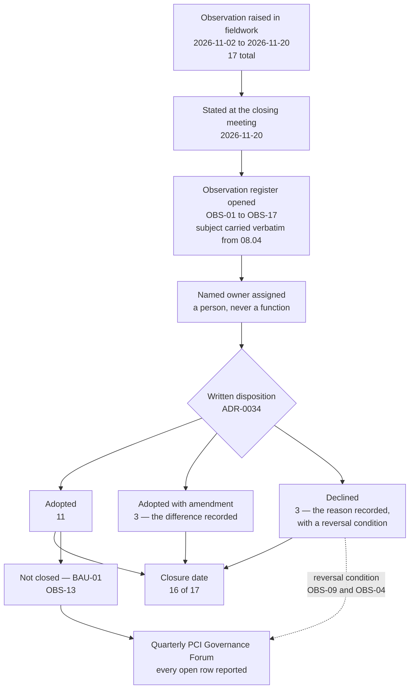

# 09.05 — Assessor Observations Disposition

| Field | Value |
|---|---|
| Document ID | MRG-PCI-2026-905 |
| Program | Marketa Retail Group — PCI DSS v4.0.1 Compliance Program |
| Phase | 09 — Executive Reporting &amp; Continuous Compliance |
| Document | 09.05 — Assessor Observations Disposition |
| Version | 1.0 |
| Status | Approved |
| Owner | Owen Castellanos, Payment Card Compliance Manager |
| Approver | Naomi Bhatt, Chief Information Security Officer |
| Date | 2026-07-15 |
| Classification | Confidential — Cardholder Data Environment // Illustrative Portfolio Sample |

## Purpose

Sable Ridge Assurance raised **seventeen observations** during the fieldwork of 2026-11-02 to 2026-11-20. **None of them changed a disposition.** Not one turned an In Place into a Not in Place, invalidated a compensating control, or disturbed a Not Applicable determination. That is precisely why they are the most easily lost artefact the assessment produced: nobody is obliged to act on an observation, no requirement is failed by ignoring one, and no report the following year will say that one was ignored — it will simply contain a finding.

**ADR-0034** exists to make that impossible. **Every assessor observation is adopted or declined in writing, with a named owner and a date. None is left unanswered.**

This document carries all seventeen — **OBS-01 to OBS-17** — with the subject carried forward unchanged from **08.04 §8**, the owner, the disposition and the closure date. It then argues each of the three **declined** observations at the length a decline requires, because a decline that is not argued is an omission with a label on it. It names the one observation worth naming — **OBS-05**, the shared-account population that was twenty and not eleven — and it closes on why an observation is the most easily lost artefact an assessment produces.

## 1. The Disposition Summary

| Disposition | Meaning | Count |
|---|---|---|
| **Adopted** | The observation was accepted and acted on as raised | **11** |
| **Adopted with amendment** | The observation was accepted in substance and the action taken differs materially from what the observation implied. The difference is recorded | **3** |
| **Declined** | No action was taken, and a reason was recorded that a reader can disagree with | **3** |
| **Total** | | **17** |

**11 + 3 + 3 = 17.** **Sixteen of the seventeen carry a closure date. One does not**, and the exception is deliberate — see §2.1.

## 2. All Seventeen

| ID | Subject (carried from 08.04 §8) | Req | Owner | Disposition | Closure date |
|---|---|---|---|---|---|
| **OBS-01** | The 12.5.1 monthly reconciliation compares presence of an entry but not the content of the function-and-use field — the condition behind **IFC-2** | 12.5.1 | Owen Castellanos | **Adopted** | 2027-03-31 |
| **OBS-02** | The six un-baselined SaaS control planes are governed by contract and configuration review rather than by a configuration standard | 2.2 | Trevor Kim | **Adopted with amendment** | 2027-05-15 |
| **OBS-03** | Two payment page scripts remain served from a third-party origin rather than the Marketa tag proxy — tracked as **OI-06-03** | 6.4.3 | Sonia Rendell | **Adopted** | 2027-03-24 |
| **OBS-04** | The exercised-privilege report identifying unexercised entitlements has run once and has one data point | 7.2.5 | Elena Marchetti | **Declined** | 2027-02-27 |
| **OBS-05** | **The shared-account population is 20, not 11.** The nine appliance built-in administrative accounts were governed under the appliance inventory and the eleven enterprise break-glass identities under the identity store, with no reconciliation between the two registers | 8.2.2 | Trevor Kim | **Adopted** | **2027-04-17** |
| **OBS-06** | Detection rule coverage against adversary technique classes has thirteen surfaces recorded as untested rather than tested and clear | 10.4 | Marcus Hale | **Adopted** | 2027-03-31 |
| **OBS-07** | The daily review queue rota has no automated ownership assignment — the condition behind **IFC-7** | 10.4.1.1 | Marcus Hale | **Adopted** | 2027-04-30 |
| **OBS-08** | The four documented scan policy exclusions are reviewed quarterly; three have been unchanged since programme start and carry no expiry | 11.3.1 | Marcus Hale | **Adopted** | 2027-03-13 |
| **OBS-09** | Segmentation testing is annual with a change trigger; the store estate's rate of change makes the trigger, not the calendar, the load-bearing control | 11.4.5 | Trevor Kim | **Declined** | 2027-01-22 |
| **OBS-10** | The payment page tamper-detection proof-of-life test has been performed twice, and the second was slower than the first — tracked as **OI-06-04** | 11.6.1 | Sonia Rendell | **Adopted** | 2027-03-06 |
| **OBS-11** | Provider monitoring is quarterly against an annual floor; the largest provider carries no right of inspection | 12.8.4 | Owen Castellanos | **Adopted with amendment** | 2027-06-24 |
| **OBS-12** | The incident response plan has never been activated for a confirmed compromise of account data | 12.10 | Naomi Bhatt | **Adopted** | 2027-06-24 |
| **OBS-13** | The acquirer-notification path depends on a third party's enumeration with no contractual response-time commitment — tracked as **OI-07-01** | 12.10.5 | Frank Mueller | **Adopted** | **Not closed — BAU-01** |
| **OBS-14** | Awareness completion is measured on a denominator including personnel who are not yet late; the practice is correct and is not documented as a standard | 12.6.3 | Owen Castellanos | **Adopted with amendment** | 2027-04-30 |
| **OBS-15** | At two sampled stores, the inspection log is stored in the back office rather than in the central record until the cycle closes | 9.5.1 | Adaeze Nwosu | **Declined** | 2027-02-13 |
| **OBS-16** | At one sampled store, the back-office equipment cabinet key is held on a general store keyring rather than under separate control | 9.1 | Adaeze Nwosu | **Adopted** | 2027-01-30 |
| **OBS-17** | Store personnel could describe the account-data reporting instruction but not where the procedure document itself is published | 12.10.7 | Adaeze Nwosu | **Adopted** | 2027-02-27 |

### 2.1 The one without a closure date

**OBS-13 is adopted and is not closed**, and both halves of that sentence are true at once.

Marketa accepted the observation in full: the acquirer-notification path under obligation **C5** runs on a 24-hour clock from determination, determination in a tokenized estate requires **Truvance** to resolve tokens against a mapping only Truvance holds, and no contractual response-time commitment exists. It became **OI-07-01**, owned by Frank Mueller with Owen Castellanos, due at the renewal on 2027-03-31.

**Truvance declined at renewal.** The action Marketa adopted was taken, in full, by the person who owned it, on the date it was due, and it did not succeed — because it depended on a counterparty's agreement.

The register records that outcome rather than converting it into one that can be marked closed. It does not re-word the observation into something achievable, it does not close it on the ground that a runbook exists, and it does not reclassify the disposition to "declined" retrospectively to avoid an open row. **It carries to business as usual as BAU-01, with the same owner and the next renewal date**, and it appears on the board scorecard as **BSC-09**, amber. **ADR-0034 obliges a written disposition. It does not oblige a closure**, and the difference between those two obligations is the difference between a register that is honest and a register that is tidy.

### 2.2 The three adopted with amendment

| ID | What the observation implied | What Marketa did instead, and why |
|---|---|---|
| **OBS-02** | A configuration standard for each of the six SaaS control planes, on the same footing as **BL-WIN**, **BL-LNX**, **BL-NET**, **BL-AWS**, **BL-DB** and **BL-APP** | A **tenant-configuration standard** was written for each of the six, covering only the settings the tenant can actually set — authentication, session, logging export, administrative role assignment and integration permissions. **The amendment is the boundary**: Marketa cannot baseline an operating system it cannot see, a patch level it cannot set, or a service it cannot disable. A standard asserting control over those would be a document, not a control, and would fail its own review the first time anybody tested it. What remains outside the standard is governed by contract and by the provider's own validation evidence, and is described that way rather than absorbed into a baseline count |
| **OBS-11** | Quarterly provider monitoring formalised, and a right of inspection obtained from the largest provider | The quarterly cadence was formalised into the calendar as a standing obligation above the 12.8.4 annual floor, and **TPSP-06's first full 12.8.4 annual review closed 2027-06-24**. **The amendment is the right-of-inspection limb**, which Marketa cannot adopt unilaterally. It was pursued at renewal alongside OI-07-01 and was **not obtained**. The observation is therefore adopted as a **standing renewal objective** rather than as a completed action, and the residual is reported at **BSC-10** as contractual rather than technical |
| **OBS-14** | Document the denominator practice as a standard, and publish a second completion figure computed on the raw denominator | The denominator rule — that a person is counted as outstanding only once their due date has passed — was **written into the measurement standard** and now governs **M-29**. **The amendment is that the second figure was not published.** A second completion percentage with no owner, no threshold and no action attached is a number nobody has to explain, which is the reasoning that also produced the decline at **OBS-04**. The programme publishes one awareness figure, with one owner, against one bar |

### 2.3 The seventeen, grouped

Seventeen observations spread across the standard and assigned to eight named owners. Grouping them shows what the assessor was actually looking at, which is not obvious from the list.

| Group | Observations | What the group is about |
|---|---|---|
| **Two registers with no reconciliation between them** | **OBS-01**, **OBS-05** | The programme's characteristic defect. Both registers correct, no reconciliation, and a truth that exists only in the space between them |
| **A control that has run too few times to have a trend** | **OBS-04**, **OBS-10** | One data point and two data points. Neither is evidence of a working control; both were treated differently and §3.3 explains why |
| **An exclusion, exception or threshold with no expiry** | **OBS-08**, **OBS-09** | Things that were set once and would persist by default. Two were adopted, one declined |
| **A dependency Marketa does not control** | **OBS-02**, **OBS-03**, **OBS-11**, **OBS-13** | SaaS control planes, provider monitoring, and the token vault. All three end in a contract rather than a configuration |
| **A capability that has not been proved** | **OBS-06**, **OBS-12** | Thirteen untested technique surfaces; an incident response plan never activated for a confirmed compromise |
| **Process ownership and documentation** | **OBS-07**, **OBS-14**, **OBS-17** | A rota with no automated assignment; a correct practice never written down; a procedure people could describe but not find |
| **Store-level physical practice** | **OBS-15**, **OBS-16** | Two of 28 sampled stores, and one. Small populations, specific facts |

**Ten of the seventeen concern something that would persist by default if nobody acted** — an unexpiring exclusion, an unreconciled register, a practice that was never documented, a capability nobody had tested. That is the characteristic shape of an observation, and it is exactly why §5 argues that an observation is the most easily lost artefact an assessment produces.

### 2.4 The three that restated what Marketa had already raised

**OBS-06**, **OBS-12** and **OBS-13** are not discoveries. Every one of them restates an exposure the programme had already raised against itself, in writing, months before the assessor arrived.

| Observation | Where Marketa had already raised it | What the restatement is worth |
|---|---|---|
| **OBS-06** — thirteen technique surfaces recorded as untested | The quarterly controlled execution exists to measure what the rule set misses, and the untested surfaces are its output. **The programme built the instrument that produced the observation** | It confirms that recording a surface as *untested* rather than as *tested and clear* is the right practice, from a party with no stake in it. **A programme that marked those thirteen as clear would have had a better number and a worse control** |
| **OBS-12** — the incident response plan has never been activated for a confirmed compromise of account data | **R-43**, held explicitly in Phase 06, Phase 07 and Phase 08, with the same words each time: *use is not proof* | It is independent corroboration that the entry is correctly held, and it is the reason **BSC-12** exists on the board scorecard rather than being an internal risk row nobody outside the programme sees |
| **OBS-13** — the acquirer-notification path depends on a third party with no contractual response-time commitment | **TTF-1**, from the tabletop of October 2026, before fieldwork | It is the reason the request to Truvance was made at renewal at all, and it converted an internal exercise finding into an item with an external witness |

**That is the outcome an honest self-assessment is supposed to produce**, and it is not the interesting result. The interesting result is **OBS-05**, at §4 — the only one of the seventeen Marketa had not seen coming.

## 3. The Three Declined, at Length

A decline is the only disposition that requires an argument, because it is the only one where the entity is on the record saying that an independent assessor recorded something and the entity chose not to act. Each of the three below is stated with the reasoning that produced it, and each is stated in a form a reader can disagree with. **None of the three is declined on cost, on effort, or on the ground that no requirement compels it.**

### 3.1 OBS-09 — segmentation testing cadence · declined because it duplicates a control already obliged elsewhere

**The observation.** Segmentation testing is annual with a change trigger. The store estate's rate of change makes the trigger, and not the calendar, the load-bearing control. The action the observation implied was a **second calendar-driven segmentation test each year** — in effect a six-monthly cadence — so that the calendar rather than the trigger carries the assurance.

**Declined, 2027-01-22, Trevor Kim, endorsed by the PCI Steering Committee.**

**The reasoning.** Marketa's segmentation testing obligation is **11.4.5**: at least once every twelve months **and after any change to segmentation controls or methods**. The six-month cadence the observation gestures at is **11.4.6**, which is a **service-provider requirement and does not apply to Marketa**. Adopting it voluntarily is available, and the programme declined it for two reasons.

The first is that **it duplicates a control Marketa is already obliged to operate**. The change trigger is not aspirational: every change to a segmentation control or method is caught by **SIG-5** inside significant-change control, and a segmentation test is mandatory when it fires. A second calendar-driven test does not measure anything the trigger does not already measure; it measures the same property of the same estate at an arbitrary second point in time. **Two instruments measuring the same thing produce two numbers and no more assurance** — and they produce a specific harm, which is that the calendar test becomes the one people plan for and the trigger becomes the one people argue about.

The second is that **the observation's own diagnosis argues against its own remedy**. If the trigger is the load-bearing control — and the programme agrees that it is — then the correct investment is in the trigger, not in a second calendar entry. What the store estate can do is exactly what it did at store **0417**: a field engineer moved a guest SSID from central to local switching to fix a latency complaint, on a network classified as untrusted, and therefore did not treat it as a segmentation change. **A six-monthly calendar test would have found that hole up to six months after it opened. A correctly scoped change trigger finds it at the change.**

**Where a reader can disagree.** A six-monthly test is a genuine independent check on whether the trigger's scoping is right, and Marketa's confidence in the trigger rests substantially on the trigger having caught things — which is not the same as knowing what it missed. The counter-argument is real and was minuted. What settled it was the second annual test, which closed **2027-05-21** with **6 findings, 0 Critical and 0 reached from Z3**, and which therefore did not fire **R-27**'s return-to-High condition. **Had it reached anything from Z3, this decline would have been reversed at the next Governance Forum**, and that reversal condition is recorded against the decline rather than left implicit.

### 3.2 OBS-15 — locally held inspection logs · declined because it would have raised an escalation threshold

**The observation.** At two sampled stores, the 9.5.1 inspection log was held in the back office rather than reaching the central record until the quarterly cycle closed. The remedy implied — and discussed at the closing meeting — was to **align the exception threshold to the cycle close**, so that a record is treated as an exception only if it is missing when the cycle ends, rather than at the current 24-hour central-submission rule.

**Declined, 2027-02-13, Adaeze Nwosu, endorsed by Naomi Bhatt.**

**The reasoning.** Both instances were investigated and both were benign. In each case the store had a connectivity interruption, the inspection was performed on time, the record was complete, the photographic evidence was intact, and the record reached the central store when the store reconnected. **Nothing was missing and nothing was wrong.** The observation is, on its facts, a description of two stores with bad Wi-Fi.

That is exactly the argument the programme declined. Relaxing the 24-hour rule to a cycle-close rule would make both instances disappear from the exception report — and would make disappear, with them, **every future instance in which a record does not reach the central store for a reason that is not connectivity.** A store that stops performing inspections, a shift lead who completes records in a batch on the last day of the cycle, an app that silently fails to sync: under the current rule all three appear within 24 hours. Under the proposed rule, none of them appears until the cycle closes, and at that point every one of them looks identical to a record that arrived normally.

**This is ADR-0018's reasoning, applied to a different control.** In Phase 03 six POI seal discrepancies were raised in Q3, all six were cleared as maintenance — five unrecorded reseals from a vendor service wave and one instance of solvent damage — and the escalation threshold was deliberately **not** raised. The position recorded then is the position applied here: **raising a threshold because the first findings were benign is how the next one gets missed.** The procedure was tightened anyway in Phase 03, because a service wave leaving six unaccounted seals is a process gap whether or not a device was touched, and the same logic applies to two stores whose records sit in a back office for three days.

**Where a reader can disagree.** A rule that reliably generates benign exceptions trains the people reading the exception report to dismiss them, and a dismissed exception is functionally identical to one that was never raised. That is a real cost and it was argued. The programme's answer is that **the cost of a noisy exception report is borne by a named reviewer who can be asked about it, and the cost of a quiet one is borne by nobody until an assessment or an incident finds it.** The connectivity cause is being addressed on its own terms through offline capture in the inspection application, on the store operations roadmap — but that is a separate action with its own owner, not an amendment to this observation, and it does not change the threshold.

### 3.3 OBS-04 — the exercised-privilege report · declined because it proposed a metric with no owner

**The observation.** The exercised-privilege report — which identifies entitlements that have been granted and never used — has run once and has a single data point. The action implied was a **published trend measure**, an "unexercised entitlement rate", carried on the compliance dashboard alongside the other continuous compliance measures.

**Declined, 2027-02-27, Elena Marchetti, endorsed by Owen Castellanos.**

**The reasoning.** The report itself is not declined. It runs, it will keep running, and it is consumed at the **7.2.4** six-monthly user access review and the **7.2.5** application and system account review, where its output does the only thing that matters: it causes an entitlement to be removed. What was declined is the proposal to turn it into a published aggregate measure.

**An unexercised-entitlement rate has no owner, and the programme's catalogue rule is that every measure has exactly one.** The report crosses **24 role definitions** and multiple entitlement-granting systems spanning payment operations, infrastructure, e-commerce engineering and store operations. If the rate moves from 6% to 9%, there is no single person who can be asked why. The honest answer would be that four different managers each granted entitlements for four different reasons in four different systems, and the aggregate moved. **A number nobody has to explain is a number that gets reported, noted and never acted on** — and the programme has watched that happen often enough to write it down.

There is a second reason and it is more specific. **The measure would be actionable at exactly the moment it is least reliable.** An entitlement that has not been exercised in six months may be dormant, or it may be a break-glass entitlement that is supposed never to be exercised, or it may belong to somebody on parental leave, or it may be seasonal. Publishing a rate invites a target, a target invites the removal of entitlements to move the number, and removing a break-glass entitlement to improve a dashboard is a worse outcome than the dashboard's absence.

**Where a reader can disagree.** One data point is not a trend, and the observation is right that a control which has run once has not been shown to work. The counter to the decline is that measurement is how you get the second data point. The programme's answer is that **the report produces its second, third and fourth data points at the six-monthly reviews regardless of whether a rate is published**, and that the reviews are where the owner is. Should a named owner emerge for the aggregate — the most likely candidate is the identity governance role that does not yet exist in the BAU structure — **this decline is reversible on that condition**, and the condition is recorded.

## 4. The One Worth Naming — OBS-05

Of the seventeen, three restated exposures Marketa had already raised against itself — **OBS-06**, **OBS-12** and **OBS-13**, all of which appear in the Phase 06 and Phase 07 registers under the programme's own hand. That is the outcome an honest self-assessment is supposed to produce, and it is not the interesting result.

**OBS-05 is the only one Marketa had not seen coming**, and it is the best argument in this document for why an independent assessor is worth $429,000.

**What was found.** Marketa's own 8.2.2 shared-account figure was **eleven**. Eleven is the number of shared and break-glass identities held in the **enterprise identity store**, and it is the number Phase 05 counted, reported to the Steering Committee, published in its documentation and carried into the assessment.

The nine vendor-locked appliances each carry a **built-in administrative account**. These accounts are shared and password-only, which places every one of them squarely within the 8.2.2 population. They were governed — vaulted, alerted on, and reconciled quarterly under **CCW-01** — but they were governed **under the appliance inventory**, which is a different register maintained by a different process for a different purpose, with **no reconciliation between the two**.

**The true population is twenty.**

**What did not move.** No disposition. **8.2.2 was assessed In Place** because every one of the twenty was governed, and **CCW-01 was accepted** because the compensating control covering the nine appliance built-ins was already doing its work. The assessor found no account that was ungoverned, no control that was absent and no requirement that was failed.

**What did move is a number Marketa had been publishing about itself.** For most of the programme, Marketa reported an 8.2.2 population that was true of one register and false of the estate — and it did so in good faith, with both registers accurate, because nobody had ever put them side by side.

**The disposition.** **Adopted**, owner Trevor Kim. **Both registers were reconciled on 2027-04-17.** The appliance built-in accounts are now enumerated in the shared-account register with a cross-reference to the appliance inventory, the reconciliation is a standing quarterly obligation, and the reconciled population is the measure **M-16** in the continuous compliance catalogue — carried as a **leading** indicator precisely because a divergence between two registers is visible before it becomes a governance failure.

**The general lesson, which is the reason this observation is named in the phase summary.** **An entity that governs one account class in two registers with no reconciliation between them will eventually publish a figure that is true of one register and false of the estate.** Both registers were correct. Both were maintained. Both were shown to the assessor. The defect existed only in the space between them, which is a place no single register's own controls can look, and the only reason it surfaced is that an assessor had cause to read both.

That is the specific value an independent assessment adds, and it is not the value entities usually expect. Marketa was not wrong about the things it knew were broken — it had identified both Not in Place findings itself, months in advance. **It was wrong about a number it was confident in**, and the four determinations where the assessor's initial position differed from Marketa's were all requirements Marketa believed it met or believed did not reach it. **The value of an independent assessor is concentrated entirely in that second category.**

## 5. Why an Observation Is the Most Easily Lost Artefact an Assessment Produces

A Report on Compliance produces four kinds of output, and they are not equally durable.

| Output | What obliges action | Durability |
|---|---|---|
| **A Not in Place finding** | The attestation status itself, a Part 4 remediation date, and an acquirer relationship | **Very high.** It cannot be ignored; the form will not let you |
| **A compensating control** | An annual re-argument against a stated constraint, population and control set | **High.** It expires by default and must be actively renewed |
| **A Not Applicable determination** | Re-testing at the next assessment, and refusal is available to the next assessor | **Moderate.** It is re-examined whether or not the entity remembers it |
| **An observation** | **Nothing** | **Very low** |

An observation affects no disposition. That is its definition. It follows that no requirement is failed by ignoring one, no attestation status changes, no acquirer is notified, no remediation date exists, no owner is compelled and no report the following year will record that the entity did nothing. **The mechanism by which an observation is lost is not negligence. It is the complete absence of any mechanism that would notice.**

The failure mode is specific and it is the reason **ADR-0034** exists. An observation raised in November lands on a programme that is producing a report, remediating findings and reporting to a board. It is filed. In February the programme is at re-assessment. In June the programme closes. In the following November a new assessor — because **ADR-0036** plans for rotation — examines the same estate with no knowledge that the observation was ever raised, finds the same condition, and this time it is a finding rather than an observation, because a condition that persists for a second year has stopped being a matter for the entity's attention and started being evidence about the entity's process.

**An observation that reappears next year as a finding is an observation somebody filed**, and the twelve months in between are the cheapest remediation window the entity will ever be offered.

Three practices follow, and they are the operative content of **ADR-0034**.

**Every observation gets a written disposition, and a decline counts.** The alternative — a register in which observations sit in a state called "under review" — is a register that has replaced a decision with a status. Three of these seventeen were declined, and each decline in §3 is a paragraph somebody can be argued with about. **A decline that has been written down can be reversed. A decline that has not been written down cannot even be found.**

**Every observation gets a named owner, not a function.** Seventeen observations across eight named individuals. An observation assigned to "Security Operations" is assigned to a rota.

**Every observation gets a date, and one of them does not close.** Sixteen closure dates and one open row. **The open row is the proof that the other sixteen mean something**, because a register in which everything closes is a register whose closure criteria are set by the person doing the closing.

### 5.1 How the register was operated

Four mechanics kept the register alive between November 2026 and June 2027, and each exists because of a way registers like this normally die.

| Mechanic | The failure it prevents |
|---|---|
| **The subject is carried verbatim from 08.04 §8** | An observation summarised in the entity's own words drifts, softens, and eventually describes something easier than what the assessor wrote |
| **Every disposition is written before any action is planned** | A register in which the disposition follows the action is a register that records what was convenient, and calls it a decision |
| **Every decline carries a reversal condition** | **OBS-09** reverses if any 2027 finding is reached from Z3; **OBS-04** reverses if a named owner emerges for the aggregate. **A decline with a condition is a decision. A decline without one is a preference** |
| **Every open row is reported quarterly, whether or not anything has changed** | **BAU-01** will appear on the Governance Forum agenda every quarter with the same content until a renewal changes it. That repetition is the mechanism, not a defect in it |

## 6. Standing Framing

An observation is not a finding, and nothing in this document should be read as one. **None of the seventeen affected a disposition**, none contributed to the two Not in Place findings, and none is reflected in the Attestation of Compliance in either its 2026 or its 2027 form.

**PCI DSS is contractual, not statutory**; the Council writes the standard and does not enforce it; **there is no PCI DSS certification for a merchant**; and a Report on Compliance and an Attestation of Compliance are a **point-in-time attestation about an assessed period** whose author's opinion binds neither Cardinal Merchant Bank, N.A. nor any card brand. **No Attestation of Compliance is a determination of compliance with any law.** **No fine, fee schedule or penalty amount is stated anywhere in this programme.**

## Cross-References

| Reference | Relevance |
|---|---|
| **ADR-0034 — Every Assessor Observation Is Adopted or Declined in Writing** | The rule this document discharges |
| **ADR-0018 — A Cleared Discrepancy Still Changes the Procedure** | §3.2 — the escalation-threshold reasoning applied to OBS-15 |
| **ADR-0036 — The 2028 Assessment Is Planned as Though Nothing Carries Forward** | §5 — why a filed observation becomes next year's finding |
| **08.04 — Fieldwork: Interviews, Observations &amp; Walkthroughs** | §8 — the seventeen observations as raised, and the subjects carried forward here |
| 08.07 — Compensating Controls Worksheets | §3.1.1 — **OBS-05** in full; **CCW-01** covering the nine appliance built-ins |
| 08.02 — Sampling Methodology | **S-12** — the nine appliances, the population that could not demonstrate standardisation |
| **09.01 — Board &amp; Audit Committee Reporting** | **BSC-09** and **BSC-10**, the amber measures behind OBS-13 and OBS-11 |
| **09.02 — Executive Metrics &amp; KPI Framework** | **M-16**, the reconciled shared-account measure that OBS-05 produced; **M-29** and the OBS-14 denominator rule |
| **09.06 — Open Items &amp; Corrective Actions** | **OI-06-03**, **OI-06-04**, **OI-07-01**; **BAU-01**; **OI-06-10** and the R-27 condition referenced at §3.1 |
| 05.09 — POI Device Protection | The 9.5.1 inspection programme behind OBS-15, OBS-16 and OBS-17 |
| 06.10 — Third-Party Service Provider Management | **TPSP-06** and the 12.8.4 review behind OBS-11 |
| 07.08 — Incident Response Plan | The plan behind **OBS-12**, and **R-43** |

---
[⬅ Previous](09.04-the-cost-of-compliance.md) · [🏠 Phase 09 Home](09.00-README.md) · [Next ➡](09.06-open-items-and-corrective-actions.md)
