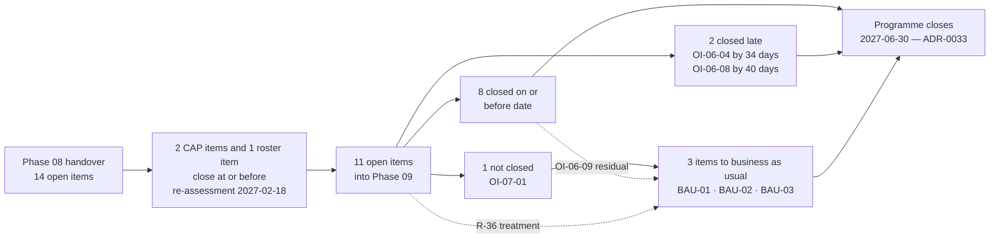

# 09.06 — Open Items &amp; Corrective Actions

| Field | Value |
|---|---|
| Document ID | MRG-PCI-2026-906 |
| Program | Marketa Retail Group — PCI DSS v4.0.1 Compliance Program |
| Phase | 09 — Executive Reporting &amp; Continuous Compliance |
| Document | 09.06 — Open Items &amp; Corrective Actions |
| Version | 1.0 |
| Status | Approved |
| Owner | Owen Castellanos, Payment Card Compliance Manager |
| Approver | Naomi Bhatt, Chief Information Security Officer |
| Date | 2026-07-15 |
| Classification | Confidential — Cardholder Data Environment // Illustrative Portfolio Sample |

## Purpose

Fourteen open items entered Phase 08. Three closed at or before the re-assessment of 2027-02-18, leaving **eleven** — the number the Phase 08 handover published in advance rather than discovering later, and the number this document reports to their conclusion.

**Eight closed on or before their date. Two closed late. One did not close at all.**

The two late items are reported **as late**, with the number of days, rather than re-dated to something they could meet. The item that did not close is reported as not closed, in the words it was written in, rather than re-worded into something that could be marked complete. **OI-07-01 is the most important line in the table** and §4 gives it the space it needs: Marketa asked its most critical provider for a contractual response-time commitment on incident-driven token resolution, and **the provider said no.**

Three items carry into business as usual as **BAU-01**, **BAU-02** and **BAU-03**, each with a named owner and a next date. §5 records them.

## 1. The Eleven at Programme Close

| ID | Item | Owner | Due | Outcome | Closure date |
|---|---|---|---|---|---|
| **OI-06-03** | **SCR-29** and **SCR-33** migrated onto the Marketa tag proxy | Sonia Rendell | 2027-03-31 | **Closed on time** — 7 days early | **2027-03-24** |
| **OI-06-04** | The **11.6.1** matrix change verified by a further proof-of-life test | Sonia Rendell | **2027-01-31** | **Closed — 34 days late.** Already 18 days overdue at the Phase 08 handover, and reported as overdue rather than re-dated | **2027-03-06** |
| **OI-06-05** | **CAP-05** — the legacy pre-shared key population to zero | Trevor Kim | 2027-06-30 | **Closed on time** — 18 days early. **214 → 0**, the static WPA2-PSK decommissioned and the SSID withdrawn | **2027-06-12** |
| **OI-06-06** | **TPSP-06's** first full **12.8.4** annual review | Owen Castellanos | 2027-06-30 | **Closed on time** — 6 days early | **2027-06-24** |
| **OI-06-07** | A phishing and pretext-calling test programme for 2027 | Marcus Hale | 2027-06-30 | **Closed on time** — 12 days early. Two full campaigns and 3 pretext-calling tests | **2027-06-18** |
| **OI-06-08** | Contract remedy for the **SCR-29** change-notification failure at renewal | Frank Mueller with Sonia Rendell | **2027-02-28** | **Closed — 40 days late.** The renewal date was the vendor's, not Marketa's, and the item was written against a date Marketa did not control | **2027-04-09** |
| **OI-06-09** | The four undetected techniques' new rules validated at the next quarterly controlled execution | Marcus Hale | 2027-03-31 | **Closed on date, with a residual: 3 of 4 rules validated.** The fourth carries to **BAU-03** | **2027-03-31** |
| **OI-06-10** | The second annual segmentation penetration test — **R-14's** continuing assurance | Trevor Kim | 2027-05-31 | **Closed on time** — 10 days early. **6 findings, 0 Critical, 0 reached from Z3** | **2027-05-21** |
| **OI-07-01** | A contractual response-time commitment from **Truvance** for incident-driven token resolution | Frank Mueller with Owen Castellanos | 2027-03-31 | **NOT CLOSED. Truvance declined at renewal.** The operational runbook remains the only instrument. Carried to **BAU-01** | **—** |
| **OI-07-03** | The 100 directory records with no person behind them | Trevor Kim | 2027-02-28 | **Closed on time** — 2 days early. All 100 reconciled; **none held an entitlement** | **2027-02-26** |
| **OI-07-04** | The first full seasonal peak under DLP enforcement and the store payment-link route | Adaeze Nwosu with Marcus Hale | 2027-02-28 | **Closed on time** — 1 day early. **4 customer-initiated instances, all quarantined at the collector, none reaching a store colleague** | **2027-02-27** |

### 1.1 Reconciliation

| Outcome | Items | Count |
|---|---|---|
| **Closed on or before date** | OI-06-03, OI-06-05, OI-06-06, OI-06-07, OI-06-09, OI-06-10, OI-07-03, OI-07-04 | **8** |
| **Closed late** | **OI-06-04 — 34 days** · **OI-06-08 — 40 days** | **2** |
| **Not closed** | **OI-07-01** | **1** |
| **Total** | | **11** |

**Eight, two and one.** The register carries no twelfth row created to absorb the eleventh, and nothing was closed by redefinition.

### 1.2 How fourteen became eleven

Phase 08 opened with fourteen open items. Three closed at or before the re-assessment, and the eleven that remained are the eleven in §1. **Nothing was accelerated to improve the count, and nothing was closed by redefinition** — the three that closed are the three whose closure the assessment itself required.

| ID | Item | Owner | Due | Why it closed inside Phase 08 |
|---|---|---|---|---|
| **OI-06-01** | **11.3.1.2** remediation — **CAP-06** | Trevor Kim | 2027-01-31 | It is one of the two Not in Place findings. Amendment executed 2027-01-08; clean authenticated scan of all nine appliances 2027-01-30; re-tested 2027-02-18 |
| **OI-06-02** | **8.6.2** remediation — **CAP-07** | Trevor Kim | 2027-01-31 | The other Not in Place finding. `batch-icq` 2027-01-22, `gl-extract` 2027-01-29; re-tested 2027-02-18 |
| **OI-07-02** | Monthly critical-alert delivery test to every 12.10.3 roster device, verified across a full quarter | Marcus Hale | 2027-01-31 | The quarter completed before the re-assessment, which is what the item was waiting for |

### 1.3 What the outcomes produced elsewhere

Six of the eleven closures are load-bearing for something outside this register, and the dependency is recorded so that a reader of the risk register can see where the evidence came from.

| Item | What it evidenced | Consequence |
|---|---|---|
| **OI-07-03** | All 100 stale directory records reconciled; **none held an entitlement**. The published reversal condition from 08.13 §3.4 did not fire | **R-13** — seasonal workforce access — moves to Low **6** on a likelihood reduction |
| **OI-07-04** | The complete October–January peak under DLP enforcement and the store payment-link route: **4 customer-initiated instances, all quarantined at the collector, none reaching a store colleague** | **R-22** moves to Low **6** on a likelihood reduction |
| **OI-06-07** | Two full campaigns and 3 pretext-calling tests; FIDO2 on every administrative path; **report rate 41%, click-through 2.1%, 0 credential submissions** | **R-21** moves from 12 to Low **6** |
| **OI-06-05** | **CAP-05** — the legacy pre-shared key population **214 → 0**, the static WPA2-PSK decommissioned and the SSID withdrawn | **R-15** moves to **4** on the register's only non-expiring likelihood of 1. **The entry does not close**, because the estate can reacquire a static key the same way it acquired this one |
| **OI-06-10** | **6 findings, 0 Critical, 0 reached from Z3** | **R-27's** return-to-High condition did not fire — §3 |
| **OI-06-09** | 3 of 4 new detection rules validated at the quarterly controlled execution | The fourth becomes **BAU-03**, measured as **M-23** |

**Five of the six are risk movements**, and every one of them is a movement the programme held until the evidence arrived rather than taking on the strength of the treatment being complete. That is the discipline **ADR-0005** established in Phase 02 and it is the reason **R-15's** likelihood of 1 can be argued at all.

## 2. The Two That Closed Late

Both are reported as late. Neither date was moved.

### 2.1 OI-06-04 — 34 days late

| Element | Position |
|---|---|
| Item | The **11.6.1** matrix change made after the second proof-of-life test, verified by a further proof-of-life test |
| Owner | Sonia Rendell |
| Due | **2027-01-31** |
| Position at Phase 08 handover | **Open and 18 days overdue** at the 2027-02-18 phase close — reported as overdue then, and carried into Phase 09 with its **original** date attached |
| Closed | **2027-03-06** |
| **Days late** | **34** |

**Why it was late.** The item was created because the payment-page tamper-detection proof-of-life test had been performed twice and **the second run was slower than the first** — the condition the assessor recorded as **OBS-10**. The matrix was changed in response, and a change to a detection matrix is only verified by another proof-of-life test, which requires a controlled unauthorised modification against a live payment template. That could not be scheduled inside the **October–January seasonal change freeze** except under exemption, and the two exemptions granted in that window on 2026-12-17 were consumed by **CAP-06** and **CAP-07**, the remediation of the two Not in Place findings. **The item competed for the same scarce resource as the remediation and lost, which was the right outcome and does not make it on time.**

**Why the date was not moved.** A phase summary that re-bases its own dates produces a table in which nothing is ever late, and a table in which nothing is ever late is a table nobody has to read. Re-dating to 2027-03-31 would have converted a 34-day overrun into a comfortable close and would have removed the only signal in this register that the change freeze creates a queue.

**What changed.** The test verified the matrix change on 2027-03-06 and the detection latency returned to its expected profile. Two things were carried into the calendar: proof-of-life testing for 11.6.1 is now scheduled **outside** the freeze window by default, and any item whose closure requires a change to a live payment template is dated against the freeze rather than against the calendar quarter.

### 2.2 OI-06-08 — 40 days late

| Element | Position |
|---|---|
| Item | Contract remedy for the **SCR-29** change-notification failure, to be obtained at renewal |
| Owner | Frank Mueller with Sonia Rendell |
| Due | **2027-02-28** |
| Closed | **2027-04-09** |
| **Days late** | **40** |

**Why it was late.** The item was written against a renewal date. **The renewal date was the vendor's, not Marketa's.** The counterparty's own contracting cycle ran past 2027-02-28, the negotiation opened when the counterparty opened it, and the remedy was agreed and executed on 2027-04-09. Nothing about Marketa's execution was slow; the item was **written against a date Marketa did not control.**

**Why the date was not moved.** For the same reason as OI-06-04, and for one more that matters more. **This is the second item in this register whose date depended on a counterparty**, and the other one is **OI-07-01**, which did not close at all. Re-dating OI-06-08 to the date it actually closed would have concealed the pattern, and the pattern is the finding: **two of the eleven items were dated against events Marketa did not control, and both of them failed to hold their date — one by forty days and one entirely.**

**What changed.** Items whose completion requires a counterparty's agreement are now written with **two dates**: the date by which Marketa's own action is complete — the request made, the position stated, the draft issued — and the date by which the outcome is expected, marked explicitly as **not within Marketa's control**. The first date is the one the owner is held to. The second is the one reported. **BAU-01 is written in exactly that form.**

## 3. OI-06-10 — the Second Segmentation Test and the R-27 Condition

**OI-06-10 closed on 2027-05-21, ten days early**, and its outcome carries further than the item does.

| Element | Position |
|---|---|
| Item | The second annual segmentation penetration test, performed by Ironwood Security Labs — **R-14's** continuing assurance |
| Owner | Trevor Kim |
| Due | 2027-05-31 |
| Closed | **2027-05-21** |
| **Result** | **6 findings · 0 Critical · 0 reached from Z3** |

**The findings.** Six, none Critical. All were remediated and retested under **11.4.4**. The comparison that matters is with the first segmentation test of May 2026, which **failed** — one path proved that segmentation was not effective, at store **0417** in Dayton, Ohio, on a latent trunk defect present at **37 stores** and live at one.

**The R-27 condition, and why it matters that it did not fire.** **R-27** — administrative-services zone concentration — was moved from High to Moderate in Phase 07, and it was moved with **a minuted dissent** and an attached **return-to-High condition**: *any finding reached from Z3 in the 2027 penetration test returns it, without further argument.* Phase 08 held R-27 explicitly on the ground that the test had not yet had the chance to trigger it, and recorded the general principle — **a rating with an unfired trigger condition is not a rating that has been proved; it is one that has not yet been tested.**

The test ran on 2027-05-21. **Zero findings were reached from Z3.** The condition did not fire, R-27 remains at Moderate, and — for the first time in the programme — that rating rests on a test that could have reversed it and did not.

Two qualifications are recorded rather than left to the reader.

**The condition not firing is not the same as the concentration reducing.** R-27 describes a design trade: administrative services for the whole estate are concentrated in one zone, under principle **SP-4**, deliberately and with the impact held at 5. **Nothing about that changed on 2027-05-21.** What changed is that the most direct available test of whether the concentration is exploitable was run by an independent party and produced nothing.

**One test is one test.** The condition remains attached to R-27 and applies to the 2028 test on the same terms, without renegotiation. A movement with a stated reversal condition is a movement somebody can hold you to, and the condition is not discharged by having survived once.

## 4. OI-07-01 — the Item That Did Not Close

This is the most important row in §1, and it is the only one with no closure date.

### 4.1 What was asked for, and why

Marketa's obligation **C5** under its merchant agreement with Cardinal Merchant Bank requires notification of a **suspected or confirmed compromise of account data within 24 hours** of determination. The incident response plan discharges it, and the tabletop exercise established what the plan's authors had not: that **determination** is the hard part, that nobody had defined what determination means even though the 24-hour clock runs from it, and that reaching one took **9 hours 20 minutes** of exercise clock against a plan that assumed four.

The reason it takes that long is architectural. **Marketa stores tokens and does not store account data.** The token-to-PAN mapping across all three payment channels sits inside **Truvance Payments**, which is both the gateway and the single token vault. To establish whether a given set of tokens corresponds to account data that was reached — and to enumerate which accounts, which is what Cardinal, a forensic investigator and the issuers all need — **Marketa must ask Truvance, and only Truvance can answer.**

**Marketa's ability to meet a 24-hour contractual obligation therefore depends on the response time of a third party that has no contractual obligation to respond in any particular time.** The assessor recorded exactly that at **OBS-13**, and the programme had recorded it against itself in Phase 07 as **TTF-1** before the assessor arrived.

**OI-07-01** was the treatment: obtain, at the renewal on 2027-03-31, a contractual response-time commitment from Truvance for incident-driven token resolution. Owner **Frank Mueller**, General Counsel, with **Owen Castellanos**.

### 4.2 What happened

**Truvance declined at renewal.**

The request was made, by the named owner, ahead of the renewal date, at the appropriate commercial level, supported by the incident response plan, the exercise record and the acquirer obligation it exists to discharge. **The provider would not accept a response-time commitment in the contract.** The renewal completed on the provider's standard incident-cooperation language, which obliges reasonable cooperation and states no time.

### 4.3 What the programme did not do

**It did not close the item.** No action Marketa took discharged it, and an item is not closed by the effort expended on it.

**It did not re-word it into something closable.** Three re-wordings were available, and each was considered and rejected at the Steering Committee.

| Re-wording available | Why it was rejected |
|---|---|
| *"Document the operational escalation path for incident-driven token resolution"* | Already done, and already true before the item was raised. Closing OI-07-01 on it would mark as complete an item whose entire content is the word **contractual** |
| *"Obtain best-efforts cooperation language at renewal"* | Obtained, and worth nothing measurable. **A best-efforts obligation with no time in it is the position Marketa already had** |
| *"Accept the residual and close"* | Available under the charter — the residual sits at Moderate and Naomi Bhatt holds acceptance authority for Moderate residuals. **Rejected because acceptance would remove the item from every future agenda**, and the only mechanism that will ever change this outcome is the item appearing at every renewal |

**It did not reclassify it as a risk and delete it from the register.** The exposure is already carried as **R-09** — Truvance concentration — and as **R-43**'s untested-capability limb. Moving the open item onto a risk entry it is already reflected in would have been a filing exercise dressed as a treatment.

### 4.4 What the programme did

**It reported the item as not closed**, in the words it was written in, to the Steering Committee on the next monthly cycle, to the Audit Committee at the quarterly meeting, and to the Board in the closure report of **2027-06-24**.

**It put the exposure on the board scorecard as BSC-09**, amber, owned by Frank Mueller, measured as **M-26** — *contractual response-time commitments held for incident-driven provider action* — and reported quarterly whether or not anything has changed.

**It carried the item into business as usual as BAU-01**, with the same owner, the same wording, and the next renewal date.

**It strengthened what it does control.** The operational runbook remains the only instrument, and it was tightened: the escalation contacts are named individuals at Truvance rather than a support queue, the request is pre-drafted so that it does not have to be composed during an incident, the path is exercised at each annual 12.10.2 test, and **NOT-1 may and must be discharged on an `undetermined` determination** with an outer bound of **48 hours** from suspicion. **Marketa can notify Cardinal inside 24 hours without knowing the answer**, which is the mitigation that actually protects the obligation, and it exists because the tabletop found that the room's instinct was to wait for a conclusion.

### 4.5 Why this is the most important row

An open-item register is a claim about an organisation's relationship with its own commitments, and the claim is tested exactly once: **at the item the organisation cannot close.**

Every other row in §1 closed, and eight of them closed early. That says something modest — that the programme executed. **OI-07-01 says something else.** It says that when Marketa asked the provider on which all three of its payment channels depend for an obligation it needed and did not get it, the programme wrote that down, kept the wording, put it on the board scorecard in amber, handed it to a named owner with a date, and did not convert a commercial failure into an administrative success.

**A register in which everything closes is a register whose closure criteria are set by the person doing the closing.**

## 5. The Three Business-as-Usual Items

**ADR-0033** closes the programme on a fixed date with a named business-as-usual owner for every recurring obligation. Three open items are not obligations but unfinished treatments, and they transfer with the same discipline.

| ID | Item | Origin | Owner | Reported to | Next date |
|---|---|---|---|---|---|
| **BAU-01** | A contractual response-time commitment from **Truvance** for incident-driven token resolution | **OI-07-01**, not closed; **OBS-13**; **TTF-1** | **Frank Mueller** with Owen Castellanos | Quarterly PCI Governance Forum; **BSC-09** on the board scorecard; Audit Committee quarterly | **2028-03-31** — the next Truvance renewal |
| **BAU-02** | **Route B** — replacement of the vendor-locked appliance class that carries **CCW-01**, **CCW-02** and the 2026 **11.3.1.2** finding | 08.12; **R-36**; the 2027 roadmap | **Trevor Kim** | Quarterly PCI Governance Forum; **BSC-10**; capital approval to Raymond Voss | **2027-09-30** — first quarterly Governance Forum after programme close |
| **BAU-03** | The **fourth detection rule** — validation of the remaining undetected technique at a quarterly controlled execution | **OI-06-09**, closed with a residual of 3 of 4 | **Marcus Hale** | Quarterly PCI Governance Forum; **M-23** | **2027-09-30** — the next quarterly controlled execution |

### 5.1 BAU-01 — written in the two-date form

Following §2.2, BAU-01 carries two dates rather than one.

| Date type | Content |
|---|---|
| **Marketa's action date** | The request drafted, the commercial position agreed internally, and the proposal issued to Truvance **not later than 90 days before renewal**. This is the date Frank Mueller is held to |
| **Outcome date** | **2028-03-31**, the renewal itself. **Not within Marketa's control**, and reported as such |

The item does not expire, is not closed by a further decline, and is not reworded. **A second decline in 2028 produces the same row with a later date**, and that is the intended behaviour: the only mechanism that will ever change this outcome is the item continuing to exist.

### 5.2 BAU-02 — the decision nobody has funded

**BAU-02 is the only one of the three that is a capital decision rather than an operational one**, and it is the only one that has not been funded.

The nine vendor-locked appliances carry **CCW-01** (8.3.6, the ten-character firmware cap), **CCW-02** (2.2.7, no management protocol offering strong cryptography), and were the population of the 2026 **11.3.1.2** finding. They were also the only sampled population that could not demonstrate standardisation — **S-12**, not sampled at all, all nine examined. **A single support agreement holds up three of the five exceptional dispositions in a 306-requirement assessment.**

The 2027-01-08 contract amendment made 11.3.1.2 met. It changed nothing about the appliances. **Route A — the amendment — removed the finding. Route B — replacement of the appliance class — is the only action that removes the constraint**, and until it is taken the position at **R-36** is contractual: Marketa can scan the nine appliances because a clause says so, and the clause has a renewal date.

BAU-02 is reported quarterly with a status of **funded / not funded** and a stated position on the next appliance-class refresh cycle. **It is currently not funded**, and 09.04 §6.2 says so in the cost document rather than leaving it to be inferred from a roadmap.

### 5.3 BAU-03 — the fourth rule

**OI-06-09** closed on its date, 2027-03-31, with **3 of 4** new detection rules validated at the quarterly controlled execution. The fourth did not validate. It was not deferred, not re-scoped and not marked validated on a partial result; the item closed with an explicit residual and the residual transferred.

The general point is worth stating because it is a habit rather than an event. **An item that closes with three of four is closed at three of four**, and the fourth becomes its own row with its own owner and its own date. The alternative — holding the item open until the fourth validates — produces a register in which the eight-month-old item and the two-week-old item look identical, and nobody can tell which is which.

BAU-03 is measured as **M-23** in the continuous compliance catalogue, a **leading** indicator, and it is validated or not validated at each quarterly controlled execution — the mechanism whose purpose is to measure what the rule set misses.

## 6. What This Register Establishes and What It Does Not

| It establishes | It does not establish |
|---|---|
| That eleven items existed at Phase 08 handover, each with a named owner and a date, and that all eleven have a stated outcome | That the estate is free of matters nobody has raised. **A register bounds the analysis; it cannot find a risk nobody thought of** |
| That two items closed late and were reported late, with the number of days | That the programme could not have closed them on time with different sequencing. **OI-06-04 lost a scheduling contest it should have lost** |
| That one item did not close, and why | That it will close. **Truvance may decline again in 2028** |
| That three items transfer to business as usual with owners and dates under **ADR-0033** | That the transfer will hold. **The programme ran at 11.9 FTE and business as usual runs at 4.2** |

## 7. Standing Framing

Nothing in this document asserts that a PCI DSS Attestation of Compliance constitutes compliance with any law, that a QSA's opinion binds a card brand or an acquirer, or that a merchant can be certified against PCI DSS. **PCI DSS is contractual, not statutory**; the Council writes the standard and does not enforce it; enforcement runs from the brands to the acquirer to the merchant, and Marketa's counterparty is **Cardinal Merchant Bank, N.A.** A Report on Compliance and an Attestation of Compliance are a **point-in-time attestation about an assessed period**. **No fine, fee schedule or penalty amount is stated anywhere in this programme.**

## Cross-References

| Reference | Relevance |
|---|---|
| **ADR-0033 — The Programme Closes on a Fixed Date** | §5 — a named BAU owner for every recurring obligation |
| **ADR-0034 — Every Assessor Observation Is Adopted or Declined in Writing** | **OBS-13** behind OI-07-01; **OBS-10** behind OI-06-04 |
| **08.14 — Phase Summary &amp; Transition** | §5 — the eleven items as handed over, including OI-06-04's 18-day overdue position |
| 08.12 — Remediation Plan &amp; Re-Assessment | The freeze exemptions of 2026-12-17 that OI-06-04 competed with |
| 08.13 — Control-to-Risk Traceability | **R-27**'s return-to-High condition, and the four explicit holds |
| **09.01 — Board &amp; Audit Committee Reporting** | **BSC-09** and **BSC-10**; the closure report of 2027-06-24 |
| **09.02 — Executive Metrics &amp; KPI Framework** | **M-23** behind BAU-03; **M-26** behind BAU-01 |
| **09.04 — The Cost of Compliance** | §6.2 — what the money did not buy, including BAU-01 and BAU-02 |
| **09.05 — Assessor Observations Disposition** | §2.1 — why OBS-13 is adopted and not closed |
| **09.07 — Lessons Learned** | The support agreement behind BAU-02; the untested incident capability behind BAU-01 |
| 07.08 · 07.09 — Incident Response Plan and Testing | **TTF-1**, **TTF-2**, the 9h20m determination and the 48-hour outer bound |
| 06.11 — Security Testing Programme | The 2027 phishing and pretext-calling programme closed as OI-06-07 |

---
[⬅ Previous](09.05-assessor-observations-disposition.md) · [🏠 Phase 09 Home](09.00-README.md) · [Next ➡](09.07-lessons-learned.md)
