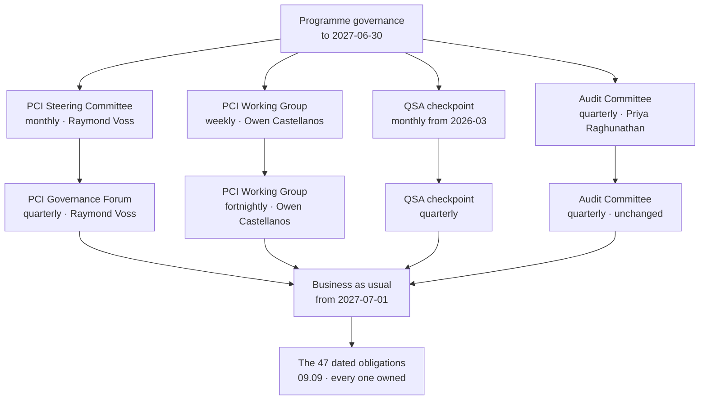

# 09.08 — Transition to Business as Usual

| Field | Value |
|---|---|
| Document ID | MRG-PCI-2026-908 |
| Program | Marketa Retail Group — PCI DSS v4.0.1 Compliance Program |
| Phase | 09 — Executive Reporting &amp; Continuous Compliance |
| Document | 09.08 — Transition to Business as Usual |
| Version | 1.0 |
| Status | Approved |
| Owner | Owen Castellanos, Payment Card Compliance Manager |
| Approver | Naomi Bhatt, Chief Information Security Officer |
| Date | 2026-07-15 |
| Classification | Confidential — Cardholder Data Environment // Illustrative Portfolio Sample |

## Purpose

The programme ends on **2027-06-30**. This document is how it ends: the date it closes, the governance that replaces it, the person who owns each of the recurring obligations it created, the three items that leave the programme unfinished and enter business as usual with their original wording, and — the section this document exists for — **what happens to the work when the resourcing falls from 11.9 full-time equivalents to 4.2.**

Seventeen point six months of programme delivered a Report on Compliance, two attestations, 306 assessed sub-requirements and a register that came down from nine High entries to none. None of that is self-sustaining. **Every control in this programme has a cadence, and a cadence is a person doing something on a date.** A transition document that lists mechanisms and not names has described a system that will run until the first time somebody is busy.

## 1. ADR-0033 — The Programme Closes on a Fixed Date

> **ADR-0033 — The programme closes on a fixed date, with a named business-as-usual owner for every recurring obligation.**
>
> **Decision:** the Marketa Retail Group PCI DSS v4.0.1 compliance programme closes on **2027-06-30**. On that date the programme's governance instruments are stood down and replaced by the arrangements in §2; the programme's budget line closes and the business-as-usual line in §7 opens; and every recurring obligation the programme created is transferred to a named owner in the operating organisation, recorded in **09.09**.
>
> **Rationale:** a programme allowed to drift into business as usual is a programme nobody ever declares finished, and its obligations quietly become nobody's. The failure mode is not dramatic. It is a steering committee that meets less often because there is less to report, a working group whose attendance thins, a compliance manager whose role is never made permanent because the programme was going to end anyway, and eighteen months later a quarterly obligation that nobody has performed since the assessor left. **The programme's own evidence for this is F-18** — a daily assertion that failed to run for four consecutive days because a scheduling change moved it, and which nobody noticed until a secondary mechanism found it. A control that is not owned is a control that is one calendar change away from being absent.
>
> **Consequences:** the close date is not conditional on the open items closing. Three of them do not close, and they transfer as **BAU-01, BAU-02 and BAU-03** with their original wording, their original owners and a review date. **The programme does not extend itself to avoid transferring an unfinished item**, because an extension granted to tidy the closing position is an extension that will be granted again.
>
> **Status:** Accepted. Approved by the PCI Steering Committee 2027-06-16 and by the Board on 2027-06-24.

## 2. The Governance Step-Down

The cadence changes on 2027-07-01 and nothing else about the governance does: the same chair, the same secretary, the same register, the same escalation route, and the same rule that a missed obligation is reported as missed rather than re-dated.

The programme's governance was built for a delivery year with an assessment at the end of it. Business as usual is a different shape of work, and running programme cadence against it produces meetings with nothing in them — which is the fastest route to a governance forum nobody attends.

| Instrument | Programme cadence | Business-as-usual cadence | Chair or owner | What changes about its content |
|---|---|---|---|---|
| **PCI Steering Committee** → **PCI Governance Forum** | **Monthly** | **Quarterly** | Raymond Voss, Chief Financial Officer | The forum is renamed as well as re-cadenced. A steering committee steers work; a governance forum holds a position. Its standing agenda is the calendar's compliance status, the register, the open items, the provider position and the scorecard |
| **PCI Working Group** | **Weekly** | **Fortnightly** | Owen Castellanos, Payment Card Compliance Manager | Operational coordination of the calendar in 09.09, evidence production, and exception handling. Fortnightly because the obligations it coordinates are monthly and quarterly, and a weekly meeting about a monthly obligation invents work |
| **QSA checkpoint** | **Monthly from 2026-03** | **Quarterly** | Owen Castellanos with Sable Ridge Assurance, LLC | The checkpoint continues into the year in which the assessor rotates, and 09.11 explains why the last two before rotation matter most |
| **Audit Committee report** | **Quarterly** | **Quarterly — unchanged** | Naomi Bhatt and Raymond Voss to Priya Raghunathan | The one cadence that does not step down. The Audit Committee's interest is in the position, not in the delivery, and the position exists every quarter |
| **TPSP review forum** | **Quarterly** | **Quarterly — unchanged** | Owen Castellanos | Six providers, validation status, responsibility matrices. **MT-1** monthly verification continues beneath it for the three providers whose validation holds up a scope reduction |
| **Store operations readiness call** | **Monthly** | **Quarterly, aligned to the POI inspection cycle** | Adaeze Nwosu | The call existed to drive store-side delivery. What remains is inspection completion, and that is quarterly |
| **Board reporting** | Event-driven plus annual | **Annual, plus on any material change or compromise notification** | Raymond Voss | The 2026-12-17 and 2027-06-24 reports were programme events. The standing obligation is the annual attestation outcome |

## 3. The Two Named Roles

| Role | Position at close | Why it is stated here |
|---|---|---|
| **Payment Card Compliance Manager** | **Owen Castellanos** is appointed to the role on a **permanent** basis with effect from 2027-07-01, reporting to the Chief Information Security Officer | The role was created for the programme and funded from the programme's internal labour line. A programme-funded role ends with the programme. **The single most common way a compliance position decays is that the person who held the calendar leaves with the budget that paid for them**, and the obligations return to a distributed set of owners who each have a day job |
| **12.1.4 — overall responsibility for information security** | **Naomi Bhatt**, Chief Information Security Officer, retains the formal 12.1.4 assignment unchanged | 12.1.4 obliges the assignment to a named individual or role with executive accountability. It is not a programme artefact and does not move at programme close. Recording that it does not move is the point: an unchanged assignment stated is better than an unchanged assignment assumed |

## 4. A Named Owner for Every Recurring Obligation

**09.09** carries the full calendar — 47 dated obligations, each with an owner and a next date. This table is its ownership summary, and it is the discharge of ADR-0033's second limb.

| Obligation class | Obligations | Business-as-usual owner | Deputy |
|---|---|---|---|
| Governance forums, monthly compliance governance, the calendar itself | 12 | **Owen Castellanos** | Naomi Bhatt |
| ASV scanning and acquirer attestation submission (C4) | 4 | **Owen Castellanos** with Sable Ridge Scanning Services | Marcus Hale |
| POI device inspection across 1,914 terminals (C8) | 4 | **Adaeze Nwosu** | Regional operations managers |
| Third-party service provider review and MT-1 verification | 4 | **Owen Castellanos** | Elena Marchetti |
| Targeted risk analysis reviews under 12.3.1 and 12.3.2 | 14 | **Analysis owners** — Marcus Hale, Trevor Kim, Elena Marchetti, Adaeze Nwosu, Sonia Rendell, Owen Castellanos, Naomi Bhatt | Owen Castellanos as register keeper |
| Annual scope confirmation (12.5.2) | 1 | **Naomi Bhatt** | Owen Castellanos |
| Annual policy review (12.1.2) | 1 | **Naomi Bhatt** | Owen Castellanos |
| Segmentation penetration testing (11.4.5) | 1 | **Trevor Kim** with Ironwood Security Labs | Marcus Hale |
| Application and internal penetration testing (11.4.2, 11.4.3) | 1 | **Marcus Hale** with Ironwood Security Labs | Sonia Rendell |
| Security awareness cycle (12.6.1 to 12.6.3.2) | 1 | **Owen Castellanos** with Human Resources | Adaeze Nwosu |
| Incident response plan review and test (12.10.2, 12.10.6) | 1 | **Naomi Bhatt**, exercise designed by **Rosa Delgado** | Marcus Hale |
| Annual assessment and attestation (C2, C3) | 1 | **Owen Castellanos**; signature **Raymond Voss** under ADR-0002 | Naomi Bhatt |
| Semi-annual 5.2.3.1 evaluations | 2 | **Marcus Hale** | Trevor Kim |
| **Total** | **47** | | |

**Every one of the 47 has a named individual, not a team.** A team is not an owner. The deputy column exists because a named owner with no deputy is a single point of failure with a job title, and the seasonal calendar guarantees that at least one of these obligations will fall due while its owner is unavailable.

## 5. The Three Items That Do Not Close

| ID | Item | Origin | Owner | Next review | Why it is a standing item rather than a closed one |
|---|---|---|---|---|---|
| **BAU-01** | **A contractual response-time commitment from Truvance Payments for incident-driven token resolution** | **OI-07-01**, itself from tabletop finding **TTF-1** | **Frank Mueller** with Owen Castellanos | **2028-03-31**, the next renewal and AOC anniversary | **Truvance declined at the 2027 renewal.** The operational runbook agreed with the provider's incident team remains the only instrument. The programme cannot close an item whose closure requires another party's signature, does not close it, and does not re-word it into something closable |
| **BAU-02** | **Route B — replacement of the vendor-locked appliance class** at nine components across the store estate | **08.14 §6.1**; the CCW-01 and CCW-02 constraint; **R-36** | **Trevor Kim** | **2027-12-15**, at the technology currency review | Marketa's right to scan those nine appliances is a **contract clause with a renewal date**. Replacing the class removes the dependency; keeping it means re-arguing two compensating controls every year against a vendor with no published roadmap |
| **BAU-03** | **The fourth undetected technique's detection rule, validated by controlled execution** | **OI-06-09**, closed with a residual — 3 of 4 rules validated | **Marcus Hale** | **2027-09-15**, the next quarterly controlled execution | Three of the four rules written after the 2026 controlled execution were proved. The fourth was not, and a rule written after a miss and never tested is an assumption with a rule identifier |

**Each of the three carries its original wording, its original owner and its original scope.** None was re-drafted at close into something the operating organisation could report as complete, which is the ordinary fate of an unfinished programme item and the reason ADR-0033 states the rule explicitly rather than trusting it.

**BAU-01 is the one to read twice.** Marketa asked its most critical provider — hosted checkout, gateway and the single token vault across all three channels — for a commitment on how quickly it would answer an incident-driven token resolution request, and the provider said no. That is not a failure of the negotiation; it is the shape of the market for a Level 1 service provider with a large merchant book. It is recorded, owned, dated, and reported to the Board as one of the three amber measures on the scorecard.

## 6. Eleven Point Nine to Four Point Two — Where the Work Goes

**The programme ran at 11.9 full-time equivalents on average, 11.4 planned and 12.7 at peak in October 2026. Business as usual is 4.2. The controls do not know that.**

Nothing in the environment gets simpler on 2027-07-01. There are still 482 stores, 1,914 point-of-interaction terminals, 71 assessed components, 6 payment page templates, 38 scripts, 6 providers, 14 targeted risk analyses, 3 compensating controls, 1 customized approach and 47 dated obligations. The difference of **7.7 FTE** is real, it was approved, and this section is the account of where it goes — because a transition that states the new number without stating what stops happening has not transitioned anything.

### 6.1 The decomposition

| Workstream | Programme average FTE | Business-as-usual FTE | Difference |
|---|---|---|---|
| Programme management, governance and reporting | 1.6 | 0.8 | 0.8 |
| Evidence production and assessment support | 2.4 | 0.9 | 1.5 |
| Segmentation, network and boundary engineering | 2.1 | 0.5 | 1.6 |
| Monitoring, detection and log review engineering | 1.8 | 0.9 | 0.9 |
| Identity, access and privileged access | 1.3 | 0.4 | 0.9 |
| Store operations, POI inspection and store readiness | 1.1 | 0.3 | 0.8 |
| Policy, risk analysis and third-party management | 0.9 | 0.3 | 0.6 |
| E-commerce script control and page integrity | 0.7 | 0.1 | 0.6 |
| **Total** | **11.9** | **4.2** | **7.7** |

### 6.2 The obligations that are genuinely cheaper to run than to build

These are the honest savings. In each case the expensive part was the design, the estate-wide first execution, or the argument — and none of those recurs.

| Obligation | Why running it costs less than building it | Evidence from the programme |
|---|---|---|
| **Segmentation drift detection — DA-1 to DA-6** | Building it meant deriving an intended policy for 482 stores, reconciling it against the deployed estate, and remediating 37 stores. Running it means reading a daily exception list that is usually empty | Two divergences in the whole 90-day exit window, both closed inside three hours |
| **Configuration assertion — CA-1 to CA-6** | Six baselines across 71 components, 1.41 million item-assertions. The baselines are written; the assertions run themselves | 61 CA-2 divergences in a year, handled inside the existing platform-operations queue |
| **11.6.1 payment-page comparison** | The build was the baseline: 38 scripts, 6 templates, 192 permutations, and a script control that had to be completed before a comparison meant anything. The comparison is machinery | 214 alerts in 140 days at a median of 9 minutes, none exceeding the 24-hour ceiling |
| **The nine-zone boundary policy** | The zones, the 31 named flows and the two enforcement layers were a design and a build. Maintaining them is change review | 1,109 change records in the period, 45 sampled by the assessor with zero exceptions |
| **The 14 targeted risk analyses** | Writing an analysis that satisfies all six PS-1 elements takes days. Reviewing one against a year of operating evidence takes hours, provided the trigger sets were written properly | Four of fourteen trigger sets fired in the operating period, and each firing is most of the next review's input |
| **The TPSP register and responsibility matrices** | Negotiating six 12.8.5 matrices, four of which required resolving a disagreement before signature, was the work. Verifying validation status monthly is a lookup | 36 MT-1 verifications in the year, detecting no status change and one AOC scope-statement change |
| **The evidence discipline** | Building the habit of producing evidence as the work was done took seven phases. **186 of 214 assessor requests were satisfied from artefacts that already existed** | 86.9%, and it is the number §6.5 says will decay |

### 6.3 The obligations that are not cheaper — and in two cases are dearer

| Obligation | Why the cost does not fall | The consequence at 4.2 FTE |
|---|---|---|
| **POI inspection across 1,914 terminals, quarterly** | It is a physical control performed by store colleagues on every terminal, four times a year, with no sampling permitted under **TRA-05**. Nothing about the second year is cheaper than the first, and the population turns over by 6,800 people each season | Absorbed into store operations as a standing duty rather than a programme activity. **The programme's 1.1 FTE becomes 0.3 FTE of central coordination and the execution moves into the store payroll**, where it was always going to have to live |
| **Evidence production for the annual assessment** | The 28 requests that required new production are point-in-time observations that cannot be pre-produced. They recur every year, in full, and 09.11 explains why the 2028 cycle is worse rather than better | The single largest residual claim on the 4.2 |
| **The three compensating controls** | Each must be **re-argued annually** against a stated constraint, population and control set. The worksheet does not carry forward | Roughly the same effort every year, with no learning curve, until BAU-02 removes the constraint |
| **The 8.3.9 customized approach** | **51 assessor hours in 2026 against 46 estimated**, and Marketa's own preparation alongside it. It resets entirely at assessor rotation | 09.11 §5 puts the 2027 decision on the table without taking it |
| **Penetration testing — 11.4.2, 11.4.3, 11.4.5** | Third-party professional services at a scope that does not shrink. **The 2027 segmentation re-test cost more than budget** because a second engagement was required | Unchanged, and funded in the BAU line at §7 |
| **The annual assessment itself** | A Level 1 merchant validates annually by on-site assessment. The QSA's hours do not fall because Marketa is now familiar | Unchanged; **dearer in 2028**, when the assessor rotates |

### 6.4 How the 7.7 is actually absorbed

| Route | FTE | What it means | Named instances |
|---|---|---|---|
| **Build work that does not recur** | **3.4** | The segmentation build, the baseline authoring, the script control completion, the policy suite, the vault migration and the assessment's first-year evidence assembly. This is the honest majority and it is not a saving so much as the end of a project | Segmentation and boundary engineering 1.6; identity and privileged access 0.9; e-commerce script control 0.6; policy and risk authoring 0.3 |
| **Automation** | **1.3** | Work that a mechanism now does, measured rather than asserted. The daily assertions, the assertion of the assertions, the automated 10.4.1.1 review with an accounted-for output, and the 12.5.1 four-source reconciliation | Monitoring and detection 0.6; evidence assembly and reconciliation 0.4; configuration assertion 0.3 |
| **Absorption into existing roles** | **1.6** | The obligation moves into a role that already exists, with the accountability written into that role rather than into a programme. This is the route that works only if it is written down, which is what §4 is | POI inspection into store operations 0.8; access review into platform and application ownership 0.4; change review into the Boundary Change Authority 0.4 |
| **Reduced frequency justified by a targeted risk analysis** | **0.5** | Only where an analysis supports it, and only under 12.3.1. **No frequency was reduced in this transition**; the 0.5 is the standing benefit of frequencies already justified — monthly rather than daily 10.4.2 review on 11 components, annual rather than six-monthly segmentation testing under TRA-12 | TRA-06 and TRA-12, both already in force and both re-reviewed in the 2027–28 calendar |
| **Less will be done** | **0.9** | Named in §6.5 | Four activities, each named |
| **Total** | **7.7** | | |

### 6.5 The four things where the answer is simply that less will be done

There is no automation route and no absorption route for these. They were performed at programme intensity because eleven people were watching, and at 4.2 FTE they will be performed less. Naming them is the only honest treatment available, because the alternative — allocating them to a route that does not exist — produces a plan that fails silently in month four.

| What reduces | Programme level | Business-as-usual level | The exposure this creates, stated |
|---|---|---|---|
| **Proactive evidence quality assurance** | Every artefact reviewed against the four-part evidence standard — what happened, when, who, what result — before it entered the index. **1,654 artefacts indexed** | Sampled review of the monthly attestation pack, plus full review only in the quarter before fieldwork | **The 86.9% figure decays.** It is the output of a programme with eleven people watching; business as usual has four. The 2028 assessor will find more items requiring new production, and 09.11 plans for it rather than hoping |
| **Deep-dive control walkthroughs outside the assessment window** | 61 process observations performed by the programme in addition to the assessor's own, several of which found conditions before the assessor could | **Two per quarter, rotating**, against a population of 71 components and 482 stores | Conditions that a walkthrough would have found will instead be found by an assertion, by a penetration test, or by the assessor. **The 5.3.3 finding — USB ports enabled on 31 of 71 components against a policy prohibition — is exactly the class of thing a walkthrough finds and a dashboard does not** |
| **Discretionary internal testing beyond the required set** | Negative testing of assertion layers, the second quarterly controlled execution beyond the required cadence, ad hoc listener enumeration, and the reachability checks that produced two of the year's most useful findings | **The required set only** — quarterly controlled execution, the annual tests, and the assertion self-tests | **This is where the 176-day unauthenticated administrative interface came from.** It was found by a penetration tester in an assumed-compromise position, not by a control. Reducing discretionary testing reduces the number of instruments capable of finding the class of thing no rule was written for |
| **Programme-level tracking of assessor observations and near-misses** | Seventeen observations tracked to disposition under **ADR-0034**; every control condition and measurement artefact adjudicated individually | Observations tracked; **the near-miss and control-condition backlog is triaged rather than worked through** | The 21 control conditions found by 11.6.1 and the 34 measurement artefacts were each closed by narrowing a comparison rather than by suppressing an alert. At lower intensity the pressure to suppress rises, and **a suppressed class is a blind spot with a ticket number** |

**Those four are the price of the resourcing decision, and they are the CFO's decision to have taken.** They are reported to the Governance Forum quarterly as a standing item, and the first of them — the decay of the evidence position — has a measurement attached to it: the proportion of the 2027 assessor's requests satisfied from existing artefacts, reported against 86.9%.

### 6.6 The one-sentence version, for the Governance Forum

> **Of the 7.7 FTE the programme gives back, 3.4 was a project ending, 1.3 is machinery, 1.6 moves into roles that already exist, 0.5 was already justified by analysis — and 0.9 is work that will simply not be done.**
>
> **The 0.9 is named. Nobody has to discover it.**

## 7. The Business-as-Usual Budget

| Line | Annual steady state | Note |
|---|---|---|
| Internal labour — 4.2 FTE | Funded in the operating budget from 2027-07-01 | Includes the permanent Payment Card Compliance Manager role |
| QSA annual assessment | Contracted annually | Rises in the rotation year; 09.11 §4 |
| ASV quarterly scanning | Contracted annually | Sable Ridge Scanning Services under ADR-0003 |
| Penetration testing — 11.4.2, 11.4.3, 11.4.5 | Contracted annually | Two engagements plus re-test allowance |
| Security tooling run and support | Recurring licence and support | The tooling built in Phases 03 to 06 |
| Awareness and training | Recurring | 12.6.3 across ~34,000 plus seasonal |
| **Total** | **$1,340,000 per year** | Against a programme spend of **$4,588,000** across 17.6 months |

Framed for the Board in the same terms the programme used: the annual cost of holding the position is materially below the cost of reaching it, and every figure in this table is **a cost of assurance**. No fine, fee schedule or penalty amount appears anywhere in this programme. The cost of not complying is described only as categories assessed against the acquirer and passed through under the merchant agreement.

## 8. The First Business-as-Usual Year — Six Checkpoints

A transition is a claim, and a claim needs dated tests. Six are set now, each with a named owner and a measurable result rather than a status.

| Date | Checkpoint | Owner | The measurement, not the status |
|---|---|---|---|
| **2027-09-15** | **BAU-03 resolved or restated.** The fourth undetected technique's rule validated at the quarterly controlled execution | Marcus Hale | Validated, or reported unvalidated with the reason. **A rule written after a miss and never tested is an assumption with a rule identifier** |
| **2027-10-20** | **First freeze entered under business-as-usual resourcing.** Awareness cycle complete before the seasonal intake; Q4 POI cycle staffed | Owen Castellanos with Adaeze Nwosu | Awareness completion against the **95%** charter bar; inspection coverage across **1,914** terminals |
| **2027-11-19** | **The 2027 assessment completes**, the first without a programme behind it | Owen Castellanos | **The proportion of assessor requests satisfied from existing artefacts, reported against 86.9%** — the leading indicator of everything in §6.5 |
| **2028-02-08** | **BAU-01 tested at the Truvance renewal** | Frank Mueller with Owen Castellanos | Commitment obtained, or the refusal recorded again with its date. **The item does not get re-worded into something closable** |
| **2028-03-15** | **Twelve months of the calendar completed** | Owen Castellanos | **Obligations completed on or before date, out of 47.** Any miss reported with its original date attached |
| **2028-06-21** | **First full-year governance review** — is 4.2 FTE the right number? | Naomi Bhatt with Raymond Voss | The four reductions in §6.5, each assessed against what actually happened rather than what was predicted |

**Every one of the six produces a number that can be wrong.** A checkpoint that produces a status — *on track*, *complete*, *green* — is a checkpoint that will report success in the quarter before the failure becomes visible.

## 9. What the Transition Does Not Achieve

| Statement | Consequence |
|---|---|
| **A transition plan is not an operating record** | Everything in this document is a commitment. The first evidence that it held is the 2027 assessment, and the first evidence that it held under pressure is the 2028 assessment with a new assessor |
| **Four point two is a judgement, not a calculation** | It was derived from the workstream decomposition in §6.1 and approved by the Chief Financial Officer. It has never been operated. **If it is wrong it will be wrong in the direction of §6.5**, and the four named reductions are where the symptom appears first |
| **Ownership written down is not ownership exercised** | Forty-seven obligations have named owners. The mechanism that tests whether the name is real is the monthly compliance governance cycle and the quarterly forum, and **a missed obligation is reported as missed rather than re-dated** — the discipline 08.14 §5 applied to OI-06-04 and this document inherits |
| **The three BAU items have no completion date between them that Marketa controls** | BAU-01 depends on a provider's willingness, BAU-02 on a capital decision, BAU-03 on the next controlled execution. Two of the three are outside the compliance function entirely |

## Cross-References

| Reference | Relevance |
|---|---|
| **ADR-0033 — The Programme Closes on a Fixed Date** | The decision this document implements |
| ADR-0002 — The AOC Signature Sits with the CFO | Raymond Voss's continuing signature obligation under C3 |
| ADR-0003 — QSA and ASV Same-Firm Independence | The ASV arrangement carried into business as usual |
| 01.06 — Program Charter &amp; Objectives | The governance cadence this document steps down |
| 01.10 — Programme Budget | The **$4,600,000** envelope and the **11.4 FTE** plan |
| **01.11 — Compliance Calendar &amp; Obligations** | The obligation register 09.09 succeeds |
| 06.04 — Time Synchronisation &amp; Failure Detection | **F-18**, the assertion that stopped running |
| 07.09 — Incident Response Testing &amp; Training | **TTF-1**, the origin of BAU-01 |
| 08.14 — Phase Summary &amp; Transition | The eleven open items and the handover |
| **09.09 — The 2027–28 Compliance Calendar** | The 47 dated obligations and their owners |
| **09.10 — Continuous Compliance Monitoring** | The mechanisms that hold the position between assessments |
| **09.11 — Preparing for the 2028 Assessor Rotation** | What resets, and what it costs |

---
[⬅ Previous](09.07-lessons-learned.md) · [🏠 Phase 09 Home](09.00-README.md) · [Next ➡](09.09-the-2027-28-compliance-calendar.md)
