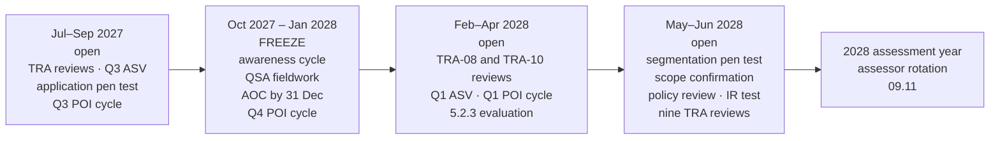

# 09.09 — The 2027–28 Compliance Calendar

| Field | Value |
|---|---|
| Document ID | MRG-PCI-2026-909 |
| Program | Marketa Retail Group — PCI DSS v4.0.1 Compliance Program |
| Phase | 09 — Executive Reporting &amp; Continuous Compliance |
| Document | 09.09 — The 2027–28 Compliance Calendar |
| Version | 1.0 |
| Status | Approved |
| Owner | Owen Castellanos, Payment Card Compliance Manager |
| Approver | Naomi Bhatt, Chief Information Security Officer |
| Date | 2026-07-15 |
| Classification | Confidential — Cardholder Data Environment // Illustrative Portfolio Sample |

## Purpose

**01.11** was the programme's recurring obligation register. This is its successor: the operating calendar for the first business-as-usual year, running from programme close on **2027-06-30** to **2028-06-30**, the day before the assessment year in which the assessor rotates.

It contains **47 dated obligations**, each with an identifier, a requirement reference, a named owner and a next date. It carries the acquirer's obligations **C1 to C10** alongside them, because a merchant's calendar is not only the standard's calendar. And it records, once and in plain terms, the two service-provider requirements that are **not** on it and must not be adopted by accident.

The calendar's organising fact is the one that has shaped every year of this programme: **the seasonal change freeze runs October to January.** Four of the twelve months in this calendar are inside it, and they are the four months that also carry the annual assessment, the awareness cycle before the seasonal intake, the Q4 POI inspection cycle executed by a workforce that includes recent joiners, and the attestation deadline of 31 December.

## 1. How to Read the Calendar

| Column | Meaning |
|---|---|
| **ID** | **CAL-01 to CAL-47.** Stable identifiers. The tracker is generated by parsing this table, with an assertion that the count is 47 |
| **Obligation** | What must happen, phrased as an activity with an output rather than as a requirement number |
| **Requirement** | The PCI DSS v4.0.1 sub-requirement, the acquirer obligation, or the internal control that obliges it |
| **Owner** | **A named individual.** Not a team, not a function |
| **Frequency** | The cadence, and whether it is standard-defined or entity-defined under 12.3.1 |
| **Next date** | The date in this calendar year. For obligations with a submission deadline, the deadline is stated as *by* |

**Two kinds of frequency, restated because it is the competence test 01.11 §1 set and this calendar is where it is operated.** A standard-defined frequency is not negotiable and a missed cycle is a finding. An entity-defined frequency stands only for as long as the targeted risk analysis behind it stands, which is why **fourteen of the forty-seven entries are analysis reviews rather than control executions**.

## 2. The Forty-Seven

### 2.1 Monthly compliance governance — CAL-01 to CAL-12

One dated obligation per month, discharged at the monthly compliance governance cycle. Each cycle carries the same standing pack: the **monthly control attestation** by control owners, the **12.5.1** reconciliation of the assessed-component register against four inventory sources, the **6.4.3** payment-page script inventory reconciliation, the **8.2.6** inactive-account sweep, the **6.3.3** patch-compliance position, the open-item and BAU-item status, and the calendar's own completion state for the month.

| ID | Obligation | Requirement | Owner | Frequency | Next date |
|---|---|---|---|---|---|
| **CAL-01** | Monthly compliance governance cycle — July 2027 | 12.5.1, 6.4.3, 8.2.6, 6.3.3; internal control | Owen Castellanos | Monthly (internal) | **2027-07-21** |
| **CAL-02** | Monthly compliance governance cycle — August 2027 | 12.5.1, 6.4.3, 8.2.6, 6.3.3; internal control | Owen Castellanos | Monthly (internal) | **2027-08-18** |
| **CAL-03** | Monthly compliance governance cycle — September 2027 | 12.5.1, 6.4.3, 8.2.6, 6.3.3; internal control | Owen Castellanos | Monthly (internal) | **2027-09-15** |
| **CAL-04** | Monthly compliance governance cycle — October 2027 | 12.5.1, 6.4.3, 8.2.6, 6.3.3; internal control | Owen Castellanos | Monthly (internal) | **2027-10-20** |
| **CAL-05** | Monthly compliance governance cycle — November 2027 | 12.5.1, 6.4.3, 8.2.6, 6.3.3; internal control | Owen Castellanos | Monthly (internal) | **2027-11-17** |
| **CAL-06** | Monthly compliance governance cycle — December 2027 | 12.5.1, 6.4.3, 8.2.6, 6.3.3; internal control | Owen Castellanos | Monthly (internal) | **2027-12-15** |
| **CAL-07** | Monthly compliance governance cycle — January 2028 | 12.5.1, 6.4.3, 8.2.6, 6.3.3; internal control | Owen Castellanos | Monthly (internal) | **2028-01-19** |
| **CAL-08** | Monthly compliance governance cycle — February 2028 | 12.5.1, 6.4.3, 8.2.6, 6.3.3; internal control | Owen Castellanos | Monthly (internal) | **2028-02-16** |
| **CAL-09** | Monthly compliance governance cycle — March 2028 | 12.5.1, 6.4.3, 8.2.6, 6.3.3; internal control | Owen Castellanos | Monthly (internal) | **2028-03-15** |
| **CAL-10** | Monthly compliance governance cycle — April 2028 | 12.5.1, 6.4.3, 8.2.6, 6.3.3; internal control | Owen Castellanos | Monthly (internal) | **2028-04-19** |
| **CAL-11** | Monthly compliance governance cycle — May 2028 | 12.5.1, 6.4.3, 8.2.6, 6.3.3; internal control | Owen Castellanos | Monthly (internal) | **2028-05-17** |
| **CAL-12** | Monthly compliance governance cycle — June 2028 | 12.5.1, 6.4.3, 8.2.6, 6.3.3; internal control | Owen Castellanos | Monthly (internal) | **2028-06-21** |

### 2.2 ASV scanning quarters — CAL-13 to CAL-16

| ID | Obligation | Requirement | Owner | Frequency | Next date |
|---|---|---|---|---|---|
| **CAL-13** | Q3 2027 external ASV scan, with a **passing** result on record before the quarter closes; attestation submitted to Cardinal | **11.3.2**; **C4** | Owen Castellanos with Sable Ridge Scanning Services | Quarterly (standard) | Scan by **2027-09-30**; attestation **by 2027-10-30** |
| **CAL-14** | Q4 2027 external ASV scan and attestation | **11.3.2**; **C4** | Owen Castellanos with Sable Ridge Scanning Services | Quarterly (standard) | Scan by **2027-12-31**; attestation **by 2028-01-30** |
| **CAL-15** | Q1 2028 external ASV scan and attestation | **11.3.2**; **C4** | Owen Castellanos with Sable Ridge Scanning Services | Quarterly (standard) | Scan by **2028-03-31**; attestation **by 2028-04-30** |
| **CAL-16** | Q2 2028 external ASV scan and attestation | **11.3.2**; **C4** | Owen Castellanos with Sable Ridge Scanning Services | Quarterly (standard) | Scan by **2028-06-30**; attestation **by 2028-07-30** |

> **A quarter that closes with only a failing scan cannot be repaired retrospectively.** Marketa's Q1 2026 scan failed with three findings and was rescanned clean in eleven days, which is a pass for the quarter, correctly evidenced. The lesson carried into this calendar is that the scan is scheduled early in the quarter, not near its end, so that a failure leaves room for a clean rescan inside the period.

### 2.3 POI device inspection cycles — CAL-17 to CAL-20

| ID | Obligation | Requirement | Owner | Frequency | Next date |
|---|---|---|---|---|---|
| **CAL-17** | Q3 2027 inspection cycle — full visual and serial verification of **all 1,914 terminals** across 482 stores | **9.5.1.2**; frequency set by **TRA-05** under 9.5.1.2.1; **C8** | Adaeze Nwosu | Quarterly (entity-defined) | **2027-09-30** |
| **CAL-18** | Q4 2027 inspection cycle — executed inside the freeze by a workforce including recent seasonal joiners | **9.5.1.2**; **TRA-05**; **9.5.1.3** training; **C8** | Adaeze Nwosu | Quarterly (entity-defined) | **2027-12-31** |
| **CAL-19** | Q1 2028 inspection cycle | **9.5.1.2**; **TRA-05**; **C8** | Adaeze Nwosu | Quarterly (entity-defined) | **2028-03-31** |
| **CAL-20** | Q2 2028 inspection cycle | **9.5.1.2**; **TRA-05**; **C8** | Adaeze Nwosu | Quarterly (entity-defined) | **2028-06-30** |

**No sampling.** TRA-05 determined full coverage on the reasoning that a sampled inspection cycle leaves the unsampled devices uninspected, and the analysis is reviewed at CAL-34.

### 2.4 Third-party service provider reviews — CAL-21 to CAL-24

| ID | Obligation | Requirement | Owner | Frequency | Next date |
|---|---|---|---|---|---|
| **CAL-21** | Q3 2027 TPSP review forum — validation status, responsibility matrices and service changes across all six providers | **12.8.1, 12.8.2, 12.8.4, 12.8.5**; cadence set by **TRA-13** | Owen Castellanos | Quarterly (above the annual floor) | **2027-08-10** |
| **CAL-22** | Q4 2027 TPSP review forum, including the **12.8.4 annual formal review** for the providers whose anniversary falls in the quarter | **12.8.4**; **TRA-13** | Owen Castellanos | Quarterly | **2027-11-09** |
| **CAL-23** | Q1 2028 TPSP review forum, including the **BAU-01** renewal position with Truvance Payments | **12.8.4**; **C6**, **C9**; BAU-01 | Owen Castellanos with Frank Mueller | Quarterly | **2028-02-08** |
| **CAL-24** | Q2 2028 TPSP review forum | **12.8.4**; **TRA-13** | Owen Castellanos | Quarterly | **2028-05-09** |

**MT-1 continues monthly beneath this cadence** for the three providers whose validation status holds up a scope reduction — Verition POS Systems, Truvance Payments and Cadence Voice Solutions — and is reported into the monthly cycle at CAL-01 to CAL-12 rather than carrying its own calendar entry.

### 2.5 Targeted risk analysis reviews — CAL-25 to CAL-38

**Fourteen analyses, and they do not all fall in the same month.** 07.03 §2 staggered the review dates deliberately, and the reason is stated there in one sentence: *fourteen analyses reviewed in one week is a signature exercise, not a review.* An analysis review that satisfies 12.3.1's twelve-month limb requires reading a year of operating evidence against the six PS-1 elements, checking whether any trigger fired and what it produced, and deciding whether the frequency still holds. That is hours of work per analysis, and fourteen of them in one sitting is a batch approval with a date on it.

**One analysis is out of cohort by design. TRA-08's review was brought forward to 2027-02-10** because its trigger fired on the November proof-of-life test, and its next review therefore sits four months ahead of the cluster it started in.

| ID | Analysis | Requirement | Owner | Frequency | Next date |
|---|---|---|---|---|---|
| **CAL-25** | **TRA-09** — frequency of incident response training | 12.10.4.1; 12.3.1 | Marcus Hale | Annual review | **2027-07-14** |
| **CAL-26** | **TRA-14** — definition of a significant change triggering scope reconfirmation, **SIG-1 to SIG-10** | 12.5.2; elective | Naomi Bhatt | Annual review | **2027-07-14** |
| **CAL-27** | **TRA-08** — frequency of payment-page change- and tamper-detection evaluation | 11.6.1; 12.3.1 | Sonia Rendell | Annual review | **2028-02-09** |
| **CAL-28** | **TRA-10** — the customized approach for 8.3.9, password change frequency | 12.3.2; 8.3.9 | Trevor Kim | Annual review | **2028-03-15** |
| **CAL-29** | **TRA-01** — frequency of periodic evaluations of components not at risk from malware | 5.2.3.1; 12.3.1 | Marcus Hale | Annual review | **2028-04-12** |
| **CAL-30** | **TRA-02** — frequency of periodic malware scans | 5.3.2.1; 12.3.1 | Marcus Hale | Annual review | **2028-04-12** |
| **CAL-31** | **TRA-11** — time frame for non-critical, non-high patches | 6.3.3; elective | Trevor Kim | Annual review | **2028-04-12** |
| **CAL-32** | **TRA-03** — frequency of application and system account access review | 7.2.5.1; 12.3.1 | Elena Marchetti | Annual review | **2028-05-17** |
| **CAL-33** | **TRA-04** — frequency and complexity of system account password changes | 8.6.3; 12.3.1 | Trevor Kim | Annual review | **2028-05-17** |
| **CAL-34** | **TRA-05** — frequency and type of POI device inspection | 9.5.1.2.1; 12.3.1 | Adaeze Nwosu | Annual review | **2028-05-17** |
| **CAL-35** | **TRA-06** — frequency of periodic log review for components outside the daily population | 10.4.2.1; 12.3.1 | Marcus Hale | Annual review | **2028-06-14** |
| **CAL-36** | **TRA-07** — time frame for all other applicable vulnerabilities | 11.3.1.1; 12.3.1 | Marcus Hale | Annual review | **2028-06-14** |
| **CAL-37** | **TRA-12** — sufficiency of annual segmentation testing | 11.4.5; elective | Trevor Kim | Annual review | **2028-06-14** |
| **CAL-38** | **TRA-13** — sufficiency of the annual floor for provider monitoring | 12.8.4; elective | Owen Castellanos | Annual review | **2028-06-14** |

### 2.6 The annual layer — CAL-39 to CAL-45

| ID | Obligation | Requirement | Owner | Frequency | Next date |
|---|---|---|---|---|---|
| **CAL-39** | **Annual scope confirmation** — the assessed-component register, the nine-zone boundary, the P2PE, tokenization and DTMF conditions, and the significant-change log reconciled | **12.5.2** | Naomi Bhatt | Every 12 months and on significant change | **2028-05-31** |
| **CAL-40** | **Annual information security policy review** and the full policy suite refresh | **12.1.2** | Naomi Bhatt | Every 12 months | **2028-06-28** |
| **CAL-41** | **Segmentation penetration test** across the store estate and the nine zones, with re-test of any finding | **11.4.5** | Trevor Kim with Ironwood Security Labs | Every 12 months **and after any segmentation change** | **2028-05-10** |
| **CAL-42** | **Application and internal penetration testing**, with correction and re-testing of exploitable findings | **11.4.2, 11.4.3, 11.4.4** | Marcus Hale with Ironwood Security Labs | Every 12 months and after significant change | **2027-09-17** |
| **CAL-43** | **Security awareness cycle** across ~34,000 personnel plus the seasonal intake, including phishing, social engineering and acceptable use | **12.6.1, 12.6.2, 12.6.3, 12.6.3.1, 12.6.3.2** | Owen Castellanos with Human Resources | Every 12 months and on hire | Completion **by 2027-10-15** |
| **CAL-44** | **Incident response plan review and test**, scenario designed by Internal Audit under ADR-0027 | **12.10.2, 12.10.6** | Naomi Bhatt; exercise designed by Rosa Delgado | Every 12 months | **2028-06-07** |
| **CAL-45** | **Annual Level 1 assessment** — QSA fieldwork, Report on Compliance and Attestation of Compliance, submitted to Cardinal Merchant Bank | **C2, C3**; Level 1 validation | Owen Castellanos; signature Raymond Voss | Annual | Fieldwork **2027-11-01 → 2027-11-19**; AOC **by 2027-12-31** |

### 2.7 The semi-annual pair — CAL-46 and CAL-47

| ID | Obligation | Requirement | Owner | Frequency | Next date |
|---|---|---|---|---|---|
| **CAL-46** | **5.2.3 evaluation** of system components identified as not at risk from malicious software — second half 2027 | **5.2.3, 5.2.3.1**; frequency set by **TRA-01** | Marcus Hale | **Six-monthly**, with event triggers on platform change | **2027-10-13** |
| **CAL-47** | **5.2.3 evaluation** — first half 2028 | **5.2.3, 5.2.3.1**; **TRA-01** | Marcus Hale | Six-monthly | **2028-04-11** |

**These two are the evaluations themselves, not the review of the analysis that sets their frequency.** The analysis review is CAL-29. Conflating the two is a common and expensive error: an entity that reviews the analysis annually and never performs the evaluation has documented a frequency it does not operate. The 01.11 §6 calendar recorded an assumed **annual** cadence at programme start; the Phase 04 analysis concluded **six-monthly** and the calendar was amended, which is why there are two of these and not one.

## 3. The Count

| Group | Entries | IDs |
|---|---|---|
| Monthly compliance governance | **12** | CAL-01 to CAL-12 |
| ASV scanning quarters | **4** | CAL-13 to CAL-16 |
| POI device inspection cycles | **4** | CAL-17 to CAL-20 |
| Quarterly TPSP reviews | **4** | CAL-21 to CAL-24 |
| Targeted risk analysis reviews | **14** | CAL-25 to CAL-38 |
| Annual scope confirmation | **1** | CAL-39 |
| Annual policy review | **1** | CAL-40 |
| Segmentation penetration test | **1** | CAL-41 |
| Application penetration test | **1** | CAL-42 |
| Security awareness cycle | **1** | CAL-43 |
| Incident response test | **1** | CAL-44 |
| Annual assessment | **1** | CAL-45 |
| Semi-annual 5.2.3.1 evaluations | **2** | CAL-46, CAL-47 |
| **Total** | **47** | **12 + 4 + 4 + 4 + 14 + 1 + 1 + 1 + 1 + 1 + 1 + 1 + 2 = 47** |

## 4. What Is Deliberately Not on This Calendar

| Requirement | Position |
|---|---|
| **11.4.6** — segmentation testing every **six** months | **A service-provider requirement. Marketa is a merchant.** The merchant obligation is **11.4.5** — at least once every 12 months and after any change to segmentation controls or methods — and it appears as CAL-41. **TRA-12 examined a six-monthly cadence explicitly and rejected it**, on the reasoning that adopting a service-provider cadence voluntarily commits Marketa to an obligation it does not have, across 482 stores, in exchange for coverage the change trigger already provides |
| **12.5.2.1** — scope confirmation every **six** months | **A service-provider requirement.** The merchant obligation is **12.5.2**, annually and upon significant change, and it appears as CAL-39 |
| 12.5.3, 12.4.2, 3.6.1.1, Appendix A1, Appendix A3 | Service-provider or designation-dependent requirements. **None was ever within the 306**, none is among the four Not Applicable determinations, and none is scheduled here |

**Adopting a requirement Marketa does not have is not conservatism; it is a self-inflicted finding.** An entity that schedules 11.4.6 has created an obligation against which it can be late, on a workload it cannot sustain, for no assurance the change trigger does not already provide. This distinction has been maintained in every phase of this programme and it is restated in the calendar because a calendar is where it would first be lost.

## 5. Daily, Weekly and Continuous Obligations

The forty-seven are the **dated** obligations — the ones that fall due on a day and can be late. Beneath them run the continuous obligations, which are not scheduled because they never stop. They are monitored through **09.10** and reported into the monthly cycle.

| Ref | Obligation | Frequency | Owner |
|---|---|---|---|
| **10.4.1 / 10.4.1.1** | Daily review of audit logs by automated mechanisms, with an accounted-for output | Daily | Marcus Hale |
| **10.7.2 / 10.7.3** | Detection of, alerting on and response to failures of critical security control systems — **CSC-1 to CSC-10** | Continuous | Marcus Hale |
| **DA-1 to DA-6** | Segmentation drift assertions across 482 stores and the cloud boundary | Daily; DA-6 continuous | Trevor Kim |
| **CA-1 to CA-6** | Configuration assertions across the 71 assessed components | Daily and weekly | Trevor Kim |
| **11.6.1** | Payment-page change- and tamper-detection comparison across 192 permutations | Continuous, alerting inside 24 hours | Sonia Rendell |
| **11.5.2** | Change-detection comparison on critical files | Weekly | Marcus Hale |
| **MT-1** | Provider validation status verification for the three scope-reduction providers | Monthly | Owen Castellanos |
| **10.6.1 to 10.6.3** | Time synchronisation across in-scope components | Continuous | Trevor Kim |
| Out-of-hours | Northbridge Managed Services detection, triage and escalation | Continuous outside SOC hours | Marcus Hale |

## 6. The Acquirer Obligations — C1 to C10

Cardinal Merchant Bank's obligations sit alongside the standard's and are not derived from it. Two of them have no calendar date at all and are the two most consequential.

| # | Obligation | Trigger | Deadline | Owner | Where it appears in this calendar |
|---|---|---|---|---|---|
| **C1** | Maintain full compliance with PCI DSS at all times | Continuous | Ongoing | Naomi Bhatt | Everywhere; it is the calendar's premise |
| **C2** | Validate annually as a Level 1 merchant by on-site assessment | Annual cycle | Annual | Owen Castellanos | **CAL-45** |
| **C3** | Submit the executed Attestation of Compliance | Annual | **On or before 31 December** | Raymond Voss with Owen Castellanos | **CAL-45** — filed early under ADR-0031 in 2026 and to be filed early again |
| **C4** | Submit quarterly ASV attestations | Quarter end | **Within 30 days** | Owen Castellanos | **CAL-13 to CAL-16** |
| **C5** | Notify a suspected or confirmed account data compromise | On determination | **Within 24 hours** | Naomi Bhatt | **No date.** The plan binds the determination itself to 24 hours from suspicion, giving an outer bound of 48 |
| **C6** | Notify before engaging a new third-party service provider | Pre-engagement | Before engagement | Owen Castellanos | **CAL-21 to CAL-24**, as a standing agenda item |
| **C7** | Notify material change to the CDE, channels or processing arrangements | On change | **Within 30 days** | Elena Marchetti | Driven by **SIG-1 to SIG-10** through change control |
| **C8** | Maintain and evidence quarterly POI device inspection | Quarterly | Quarterly | Adaeze Nwosu | **CAL-17 to CAL-20** |
| **C9** | Provide TPSP Attestations of Compliance on request | Annual and on request | On request | Owen Castellanos | **CAL-21 to CAL-24** |
| **C10** | Cooperate with any brand-mandated forensic investigation | On demand | As directed | Frank Mueller with Naomi Bhatt | **No date.** Annex A of the incident response plan carries the *who decides what* table, after tabletop finding TTF-4 |

**C5 and C10 are the two obligations with no date, and they are the two that would matter most on the worst morning.** A calendar cannot schedule them. What a calendar can do is make sure the capability behind them is exercised, which is CAL-44, and record honestly that the capability has never been used for the event it exists for.

## 7. The Year Against the Freeze

| Window | What the freeze does to it |
|---|---|
| **October 2027 to January 2028** | **No store-side change.** Assessment, observation and review continue; change does not. This is why the awareness cycle completes **by 2027-10-15**, before the seasonal intake, and why the Q4 POI inspection cycle is executed by a workforce that includes recent joiners with 9.5.1.3 training embedded in onboarding |
| **The assessment inside the freeze** | Fieldwork is observation, not change, which is the only reason it can run in November at all. Any finding requiring store-side remediation lands on a remediation date at the end of January, exactly as **CAP-06** and **CAP-07** did in 2027 — with the same absence of float |
| **May and June 2028** | The heaviest months in the calendar: the segmentation penetration test, the scope confirmation, the policy review, the incident response test and **nine of the fourteen analysis reviews**. This is a known concentration and it is the first thing the 2028 planning milestone in 09.11 §4 examines |

## 8. The Four Obligations Most Likely to Be Missed

Every calendar has a shape, and this one's shape says where it will fail first. Naming the four now is cheaper than discovering them in a Report on Compliance.

| Obligation | Why it is exposed | The mitigation already in the calendar |
|---|---|---|
| **CAL-14 — the Q4 2027 ASV scan and attestation** | It falls at peak trading, inside the freeze, in the same weeks as the assessment, the AOC deadline and the Q4 POI cycle. **A quarter that closes with only a failing scan cannot be repaired retrospectively** | The scan is scheduled early in the quarter, and **C4**'s submission deadline of 2028-01-30 leaves the attestation itself outside the freeze |
| **CAL-18 — the Q4 2027 POI inspection cycle** | 1,914 terminals inspected by a store workforce that has just grown by up to 6,800 people, during the four busiest weeks of the year | **9.5.1.3 training embedded in seasonal onboarding**, regional completion reporting, and a quarterly readiness call aligned to the cycle |
| **CAL-35 to CAL-38 — the four June 2028 analysis reviews** | Four analyses reviewed in one week, in the same month as the incident response test, the policy review and the monthly cycle. **This is exactly the batch-approval failure the staggering was designed to prevent**, reappearing at the end of the cohort | Recorded here as a known concentration, and the first item the 2028 planning milestone in **09.11 §4** examines |
| **The 47th obligation nobody looks at** | A calendar's real failure mode is not a missed date; it is an obligation that quietly stops appearing on it | The tracker is **generated by parsing this document**, with an assertion that the count is 47. **A workbook that cannot drift from the prose cannot lose a row** |

## 9. When an Obligation Is Missed

The rule is unchanged from 01.11 §10 and is restated because business as usual is where it will first be tested.

| Situation | Action | Escalation |
|---|---|---|
| A recurring activity is late but the period has not closed | Complete it within the period and record the delay | Fortnightly Working Group |
| A period closes without the activity performed | **Record the gap honestly**, perform the activity, and assess the effect on the assessment | Naomi Bhatt; recorded as an open item with its **original** date attached |
| A quarter closes without a passing ASV scan | Cannot be repaired retrospectively. Notify Cardinal, complete the scan, record the position in the ROC | Raymond Voss and Cardinal |
| An entity-defined frequency was operated without a current analysis | Perform the review; the frequency stands only if the analysis supports it | Naomi Bhatt |
| An obligation is discovered never to have been performed | Record it, perform it, disclose it to the QSA. **Do not backdate anything** | Naomi Bhatt; Audit Committee if material |

**A calendar in which nothing is ever late is a calendar nobody reads.** The programme's own instance is **OI-06-04**, eighteen days overdue at the Phase 08 handover and reported as overdue rather than re-dated, then closed thirty-four days late and reported that way too.

## Cross-References

| Reference | Relevance |
|---|---|
| **01.11 — Compliance Calendar &amp; Obligations** | The programme calendar this document succeeds; obligations **C1 to C10** in their original form |
| 01.04 — Acquirer &amp; Card Brand Obligations | The contractual chain behind C1 to C10 |
| 01.08 — Scope Assumptions &amp; Constraints | **CON-01**, the October-to-January seasonal change freeze |
| **07.03 — Targeted Risk Analyses Consolidated** | The fourteen analyses, the six PS-1 elements, and **why the review dates are staggered** |
| 07.06 — Annual Scope Confirmation | The 12.5.2 method behind CAL-39 and **SIG-1 to SIG-10** |
| 07.09 — Incident Response Testing &amp; Training | **ADR-0027** and the exercise design behind CAL-44 |
| 08.02 — Sampling Methodology | The eighteen populations the 2027 and 2028 assessments will re-sample |
| **09.08 — Transition to Business as Usual** | **ADR-0033**; the ownership of all 47 obligations |
| **09.10 — Continuous Compliance Monitoring** | The continuous obligations beneath the dated ones |
| **09.11 — Preparing for the 2028 Assessor Rotation** | Why May and June 2028 matter more than their position in the calendar suggests |

---
[⬅ Previous](09.08-transition-to-business-as-usual.md) · [🏠 Phase 09 Home](09.00-README.md) · [Next ➡](09.10-continuous-compliance-monitoring.md)
