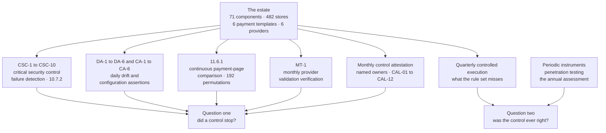

# 09.10 — Continuous Compliance Monitoring

| Field | Value |
|---|---|
| Document ID | MRG-PCI-2026-910 |
| Program | Marketa Retail Group — PCI DSS v4.0.1 Compliance Program |
| Phase | 09 — Executive Reporting &amp; Continuous Compliance |
| Document | 09.10 — Continuous Compliance Monitoring |
| Version | 1.0 |
| Status | Approved |
| Owner | Marcus Hale, Security Operations Manager |
| Approver | Naomi Bhatt, Chief Information Security Officer |
| Date | 2026-07-15 |
| Classification | Confidential — Cardholder Data Environment // Illustrative Portfolio Sample |

## Purpose

An assessment is fifteen business days. The year is two hundred and fifty. **Everything the attestation says is true was true on a date, about a sampled population, in a defined window**, and the four hundred and thirty-five working days between one assessment and the next are held by mechanisms nobody external is watching.

This document is the register of those mechanisms: **CSC-1 to CSC-10** critical security control failure detection under 10.7.2; the **DA-1 to DA-6** and **CA-1 to CA-6** daily drift and configuration assertions; **11.6.1**'s continuous payment-page comparison; **MT-1** monthly provider validation verification; the monthly control attestation; and the quarterly controlled execution.

For each it records three things: **what it detects, what it cannot detect, and its known failure mode from the programme's own record.** The third column is the one that makes this document worth reading, because every mechanism listed here has either failed in the operating period or has a recorded reason why its failure would be invisible.

And then it states the thing the whole register exists to make plain, which the reader should carry through the rest of the document:

> **Every mechanism in this document tells you that a control stopped. None of them tells you that a control was never right.**

## 1. The Two Questions a Monitoring Programme Answers

| Question | Answered by | Frequency |
|---|---|---|
| **Is the control still operating?** | Everything in this document | Continuous to monthly |
| **Was the control ever the right control?** | Penetration testing, the annual assessment, and the quarterly controlled execution | **Periodic — and that is the honest limitation** |

The distinction is not academic and the programme has an instance of each. **F-18** is the first question: a daily segmentation assertion that ran perfectly for months and then stopped running for four days because a scheduling change moved it into a window where its service account's session was expiring. Nothing was wrong with the assertion; it was simply absent. **The 176-day unauthenticated administrative interface is the second question**: three individually correct decisions — authentication enforced at a reverse proxy, a management connector bound to all interfaces by a platform vendor's new default, and an approved firewall rule permitting the platform's management port range — intersecting to produce an interface on a cardholder data environment component that accepted administrative requests without authentication. Every control involved was operating. **No mechanism in this document would have found it, and none of them did.** A penetration tester did.

### 1.1 The seven mechanisms at a glance

| Mechanism | Cadence | Owner | Reported into |
|---|---|---|---|
| **CSC-1 to CSC-10** | Continuous; maximum time to detect from 5 minutes to 24 hours | Marcus Hale | The 10.7.2 failure register; the monthly cycle |
| **DA-1 to DA-5** | Daily; **DA-6** continuous | Trevor Kim | Incident on divergence, four-hour response target |
| **CA-1 to CA-6** | Daily and weekly | Trevor Kim | The divergence and exception register |
| **11.6.1** | Continuous, alerting inside 24 hours | Sonia Rendell | The alert and disposition record; **CT-18** |
| **MT-1** | Monthly | Owen Castellanos | The quarterly TPSP forum, **CAL-21 to CAL-24** |
| **Monthly control attestation** | Monthly | Owen Castellanos, with every named control owner | The monthly compliance governance cycle |
| **Quarterly controlled execution** | Quarterly | Marcus Hale with Ironwood Security Labs | The detection rule repository; **BAU-03** |

## 2. CSC-1 to CSC-10 — Critical Security Control Failure Detection

**10.7.2** obliges detection of, alerting on and prompt response to failures of critical security control systems, and it is one of the fifty-one requirements that became mandatory on 2025-03-31. Its control list is longer than the service-provider equivalent's: it adds **audit log review mechanisms** and **automated security testing tools** to the eight classes 10.7.1 names.

| ID | Control class | What it detects | What it cannot detect | Known failure mode from the record |
|---|---|---|---|---|
| **CSC-1** | Network security controls — CT-43 to CT-51 | A boundary stops enforcing, or stops being able to report that it is enforcing. Synthetic probes assert every five minutes that a denied flow is still denied | **A rule that is enforcing exactly as written, and wrong.** The probe tests the policy against itself | **F-11** — a policy commit failed silently and the running policy was one revision behind intent for an added deny rule, for 11 hours 45 minutes, while health reporting showed committed |
| **CSC-2** | Intrusion detection and prevention — CT-22 | Sensor loss, signature staleness, traffic passing unexamined | An adversary using a technique for which no signature exists. **Four such techniques are on the record** | 1 failure in the period, found by primary detection |
| **CSC-3** | Change-detection mechanisms — CT-21 across the 71 | An agent stopping, a baseline ageing, a comparison not completing. A deliberate benign canary change must alert weekly | A change made **through** an approved path that should never have been approved | 2 failures, one found only by the weekly canary |
| **CSC-4** | Anti-malware — CT-23, CT-24 | A component running unprotected; definitions not updating | Malware the engine does not recognise; and the components a **5.2.3** evaluation excused from coverage | 3 failures, all found by primary detection |
| **CSC-5** | Physical access controls | Panel, reader and controller failure at Columbus and Ashburn | **Anything in 482 stores.** Store physical control is a procedure and a lock, not a monitored system | 0 failures — and 0 is not a strong number for a class with no store coverage |
| **CSC-6** | Logical access controls — CT-01 to CT-13, the CT-14 vault | Authentication or authorisation degrading, MFA failing open. Synthetic authentication through each of the 20 access paths every 15 minutes asserts that MFA is demanded | A legitimate credential used by the wrong person, which is **R-12** and is not a control failure at all | 2 failures, both found by primary detection |
| **CSC-7** | Audit logging mechanisms — CT-18, CT-19, CT-20 | The record stopping, being diverted, or losing immutability. Volume-band, silence and latency alerting, plus weekly end-to-end synthetic event injection | Whether the events being recorded are the right events | **F-14** — a new archive bucket prefix did not inherit the object-lock policy and nine hours of one log class was archived without immutability. **F-03** — a parser regression silently discarded three log sources for 25 hours 28 minutes. **6 failures, 4 of them invisible to primary detection** |
| **CSC-8** | Segmentation controls — CT-48 and the CSC-1 boundary enforcement | The scope reduction stopping being true. Daily assertion across all 482 stores that the segmentation-determining configuration matches intent | **A defect in the intended policy itself.** If CT-48's intent is wrong, the assertion reports agreement between two wrong things | **F-18** — the assertion did not run for four consecutive days. Retrospective re-assertion against retained snapshots found no divergence, which is an answer rather than an assumption |
| **CSC-9** | **Audit log review mechanisms** — the correlation engine, 187 rules, 83 parsers | The logs still arriving and nothing looking at them. Rule firing rates against baseline, declared source dependencies, parser error rates | **A rule that fires correctly on the wrong condition**, and the space of conditions for which no rule exists | **F-07 — a detection rule's source dependency failed, the rule stopped firing, and it reported itself healthy for 57 hours 5 minutes.** 4 failures, 3 found only by secondary detection |
| **CSC-10** | **Automated security testing tools** — CT-31, CT-32, CT-33, CT-57 | Testing reporting clean because it did not run. Scan completion, target-list reconciliation against the 71, authentication success per target | Whether the scan's coverage is correct. **Nine components were in the register and unscannable for the whole of 2026**, and CSC-10 was not the mechanism that said so | 0 failures in the period |

### 2.1 What the failure register measured

**Twenty-one failures were detected, recorded and responded to in the operating period, and the number is reported as a positive figure.** An entity reporting zero 10.7.2 failures across a year, 71 components, 482 stores and ten control classes is reporting a detection gap, not an achievement.

| Measure | Value | What it means |
|---|---|---|
| Failures recorded | **21** | Each with a 10.7.3 record: what failed, start and end to the minute, root cause, security issue arising, preventive control |
| Found by the failing system's **own** health reporting | **12** | The primary detections |
| **Found only by an independent secondary detection** | **9** | **A system that has failed is not a reliable narrator of its own state.** Nine of twenty-one is the measurement of that principle rather than the assertion of it |
| Security-issue-arising analysis concluding *yes* or *potentially* | **3** — F-03, F-11, F-18 | The field that requires retrospective work rather than a checkbox |
| Failures where the start time is the failure, not the detection | **All 21** | F-07's start is 02:00, when the rule stopped, not 11:05 when it was found. **An entity measuring from detection reports a shorter outage and a fictional one** |

**F-07 is the failure this whole document is organised around.** A detection rule stopped working for fifty-seven hours, reported itself healthy throughout, and the question *did anything happen in the window* was answerable only because the logs were retained and the rule could be re-run against them retrospectively. Retention is not a compliance formality; **it is what converts a detection failure from an unanswerable question into a bounded one.** It is also the failure that produced the declared-source-dependency rule in the detection rule lifecycle — a rule must now name the fields it depends on and degrade explicitly when one stops arriving, rather than quietly matching nothing.

## 3. DA-1 to DA-6 and CA-1 to CA-6 — The Daily Assertions

The assertion layer is the programme's answer to a question the standard asks obliquely and constantly: **is the deployed state still the approved state?** DA-1 to DA-6 assert it for the network and the segmentation boundary; CA-1 to CA-6 assert it for component configuration, as a deliberate extension of the same pattern rather than a second assurance model.

| ID | What it asserts | What it detects | What it cannot detect |
|---|---|---|---|
| **DA-1** | Running configuration read **from the device** compared against CT-48 intended policy, including observed VLAN membership per port, across 482 stores and 11 network security controls | Any divergence between device and intent | A defect in the intent. **Reading the device rather than the controller is the design decision that matters here** — a controller reports what it believes it pushed |
| **DA-2** | Every switch port's role against the expected role for that store's layout; any unexpected trunk flagged | A port re-roled by a field engineer or a contractor | A correctly-roled port on a correctly-built store whose design is wrong |
| **DA-3** | Every trunk port carries a **non-empty explicit allowed-VLAN list**, compared against the expected set | The precondition that produced the first failed segmentation test | Nothing in this class — it is the narrowest and strongest assertion in the set |
| **DA-4** | Every guest SSID at every site is **centrally switched** | The second precondition of the store 0417 failure | A centrally switched SSID pointed at the wrong concentrator |
| **DA-5** | Every unused port administratively shut and assigned to VLAN 999 | A live port in a stockroom, which is **R-38**'s exposure | A port in use for a legitimate purpose that should not exist |
| **DA-6** | Continuous plan-diff of the infrastructure-as-code definition against deployed cloud state for all boundary resources | **R-25** — a cloud boundary changed by a single authorised API call completing in under a second | A change made **through** the pipeline, correctly, that widens a boundary. That is **R-32**, and it is a change-review problem |
| **CA-1** | Every component in the 12.5.1 inventory reported a result | A component that has gone silent — one instance in the period, a Z1 host silent for four days | A component that is not in the inventory |
| **CA-2** | Running configuration matches the baseline parameter set | Drift from the six baselines across 56 asserted components — **61 divergences** in the period | A baseline parameter that is set wrongly in the baseline |
| **CA-3** | Running services and listening ports match the allow-list | A new listener — **9 divergences** | A listener on a component outside the asserted population. **Six SaaS control planes are un-baselined** |
| **CA-4** | No vendor default account, credential, certificate, key or community string | **3 divergences** | A non-default credential that is weak, shared or embedded — which is **R-17** and needed a requirement, not an assertion |
| **CA-5** | Administrative paths encrypted, cleartext services absent, tested from an adjacent segment | Protocol regression | The nine vendor-locked appliances whose management interface **offers** no protocol with strong cryptography. That is CCW-02, not a divergence |
| **CA-6** | Deployed baseline version matches the current approved version | Version lag — **0 divergences**, 4 scheduled remediations | Whether the current approved version is the right version |

**The assertion layer's own failure mode is stated in one line in 03.08 and it is the most important sentence in this section: if the intended policy is wrong, DA-1 reports agreement between two wrong things.** The assertions are a comparison. A comparison against a wrong reference is a confident wrong answer, delivered daily.

## 4. 11.6.1 — The Continuous Payment-Page Comparison

| Dimension | Position |
|---|---|
| **What it is** | Synthetic browser agents fetch the six payment templates **from outside Marketa's networks**, across **192 permutations** of geography, device class and network path every 30 minutes, and compare received HTTP headers, DOM composition, script inventory, script content, network destinations and payment-frame targets against an authorised baseline reconciled to the 6.4.3 inventory. A second limb digests real consumer sessions |
| **Frequency** | Continuous evaluation, alerting inside **24 hours**, against a requirement floor of weekly. Set by **TRA-08**, justified on transaction volume per unit time |
| **What it detects** | Modification of a payment page after deployment, by anyone, including Marketa. **214 alerts in 140 days, median 9 minutes, 0 exceeding the ceiling, 3 escalated to incidents, 21 control conditions found** |
| **What it cannot detect** | **It cannot prevent anything.** Every minute between modification and alert is a minute in which roughly thirty checkouts complete on a page nobody has examined. It also cannot see a script executing only for a population the permutation matrix does not cover — which is precisely what the November proof-of-life test found |
| **Known failure mode** | **The matrix.** The November proof-of-life test produced a slower detection than the first, and the response was to double the geography and device-profile rotation frequency, raise field digest sampling to 1 in 10 for mobile profiles, and bring **TRA-08**'s review forward to 2027-02-10. **OI-06-04 — verification of the matrix change by a further proof-of-life test — was due 2027-01-31 and closed 2027-03-06, thirty-four days late** |
| **The number Marketa reports** | From proof-of-life testing, **the 38 minutes, not the 4.** An instrument's honest performance figure is its worst measured result, not its best |

The two most useful outputs of this mechanism are the ones a compliance report usually omits. **Twenty-one alerts found a control that was not operating as intended rather than a page that had changed** — nine of them security headers missing or weakened, four missing subresource integrity attributes, three a divergence between edge-set and origin-set content security policies that were meant to be identical and were set by two processes. And **thirty-four alerts were the mechanism being wrong**, a 15.9% false-positive rate reported rather than engineered away, because the engineering that removes it is the engineering that produces a silent mechanism. Every one of the five artefact classes was closed by narrowing the comparison to what is semantically meaningful, **not by suppressing the alert**, because a suppressed class is a blind spot with a ticket number.

## 5. MT-1 — Monthly Provider Validation Verification

| Dimension | Position |
|---|---|
| **What it is** | Monthly verification of the compliance validation status of the **three providers whose validation holds up a scope reduction** — Verition POS Systems (P2PE), Truvance Payments (tokenization and hosted checkout) and Cadence Voice Solutions (DTMF masking) — against authoritative published sources, with a 60-day pre-expiry watch |
| **What it detects** | A lapse, a listing withdrawal, or a change in the **scope statement** of a provider's attestation. **The Truvance AOC scope-statement change was detected at review before the provider raised it** |
| **What it cannot detect** | Anything about the provider's actual security. **A current AOC is a statement that an assessment was performed, not that the provider is secure**, and 06.10 §8 says so at length. Thirty-five of eighty graded evidence rows across the six providers remain uncorroborable by Marketa |
| **Known failure mode** | **It has never fired on a lapse.** Thirty-six verifications in the year detected no status change, and the 60-day pre-expiry watch has never fired either. **A control that finds nothing may be a good control or a blind one**, and the only thing that distinguishes them is proof-of-life evidence — which for MT-1 is the scope-statement detection, the one occasion it produced a result |
| **Why it matters more than its output suggests** | The suspension rule recorded in advance is what converts a provider lapse from an improvised argument under deadline pressure into a defined change in the assessed position. **That rule is the reason R-10's impact was reduced in Phase 06** — one of only seven impact reductions in the whole programme |

## 6. The Monthly Control Attestation

| Dimension | Position |
|---|---|
| **What it is** | Each named control owner attests monthly, in writing, that the controls they own operated in the period, and records any exception with its dates and its treatment. Discharged at the monthly compliance governance cycle — **CAL-01 to CAL-12** |
| **What it detects** | A control whose owner knows it did not operate and would otherwise have no route to say so. It is the mechanism that surfaces the **procedural** controls no assertion can measure — a review performed, an approval obtained, an inspection completed, a record signed |
| **What it cannot detect** | **Anything the attester does not know.** It is a self-report, and its failure mode is the failure mode of every self-report |
| **Known failure mode** | The programme has an instance and it is uncomfortable. **Marketa asserted 1.2.8 In Place** — restriction of network security control ruleset backups — and two of nine backups were held on an unrestricted file share, found by the assessor on his second working day and corrected in flight under ADR-0029. **The attestation had been given.** A monthly attestation is a statement of belief by somebody with a job to do, and belief is not evidence |
| **What makes it worth keeping anyway** | It creates a named person who has to say something on a date. **An unowned control has no attester, and the exercise of finding one is how the ownership gaps in a control set are discovered** |

## 7. The Quarterly Controlled Execution

| Dimension | Position |
|---|---|
| **What it is** | Adversary techniques executed against the cardholder data environment and the store estate on a quarterly cycle with Ironwood Security Labs, and measured against the detection rule set. **46 techniques executed in the 2026 cycle** |
| **What it detects** | **What the rule set misses.** 42 techniques were detected; **4 were not**, and the four are the number the programme reports |
| **What it cannot detect** | Techniques nobody thought to execute. It measures the edge of the rule set against the edge of the tester's imagination, and the second edge is not the adversary's |
| **Known failure mode** | The remediation is the failure mode. Four rules were written after the four misses; **three were validated at the next execution and the fourth was not**. OI-06-09 closed with that residual, and it carries into business as usual as **BAU-03**. A rule written after a miss and never tested is an assumption with a rule identifier |
| **Why it is in this document rather than the testing document** | Because it is the only mechanism in the continuous set that measures **absence** rather than change. Everything else here asks whether something stopped. This asks whether anything was ever there |

> **Zero SEV-1 incidents is not evidence that none occurred. It is evidence that none was detected and declared.** The 46 techniques produced 42 detections and 4 misses, and the misses describe the edge of the rule set. **A compromise using one of those four would not have appeared in any incident count in this portfolio.**

## 8. The Thesis

Set the seven mechanisms side by side and the pattern is the same in every row.

| Mechanism | The question it answers | The question it does not |
|---|---|---|
| CSC-1 to CSC-10 | Has a critical security control system **stopped**? | Was it the right control system, configured correctly, covering the right population? |
| DA-1 to DA-6 | Has the deployed network state **diverged** from intent? | Is the intent correct? |
| CA-1 to CA-6 | Has a component **drifted** from its baseline? | Is the baseline right, and are the six un-baselined SaaS control planes safe? |
| 11.6.1 | Has a payment page **changed** since it was authorised? | Was the authorised state safe, and does the permutation matrix cover the population that matters? |
| MT-1 | Has a provider's validation status **changed**? | Is the provider secure? |
| Monthly control attestation | Does an owner believe the control **operated**? | Is the belief correct? |
| Quarterly controlled execution | Does the rule set **catch** the techniques executed? | What about the techniques nobody executed? |

> **Every one of these tells you a control stopped. None tells you a control was never right.**
>
> That is not a defect in the mechanisms. It is what a comparison is. Every mechanism in this document works by comparing a current state against a reference — an intended policy, an approved baseline, a published validation status, an authorised page, a rule set. **A comparison inherits the correctness of its reference and cannot test it.** The 176-day unauthenticated administrative interface is the programme's proof: every reference was correct, every comparison agreed, and the interface was open the whole time.

### 8.1 The three ways a comparison-based mechanism fails

Naming the failure modes generically makes them findable in mechanisms this document does not cover.

| Failure mode | What it looks like | Instance from the record | The only available defence |
|---|---|---|---|
| **The mechanism stops** | A green dashboard, an empty exception list, and nothing running behind either | **F-18** — the daily segmentation assertion did not run for four days. **F-07** — a rule reported itself healthy for 57 hours while matching nothing | **Assert the assertion.** F-18's preventive control was to add the job's own execution to the monitored set, and F-07's was to require every rule to declare its source dependencies and degrade explicitly |
| **The reference is wrong** | Perfect agreement, reported daily, between the deployed state and an intent that should never have been approved | The **176-day** interface: an approved firewall rule, a vendor's documented default and a recommended authentication pattern, all correct, intersecting | **Something that does not use the reference** — a penetration test, a controlled execution, an assessor's independent testing action |
| **The comparison narrows until it agrees** | A falling false-positive rate, a rising suppression list, and a mechanism that has not alerted in months | The 34 measurement artefacts, **15.9%**, each closed by narrowing the comparison to what is semantically meaningful | **A tuning disposition requires a rule change to be raised and cannot close a case without one**, plus a periodic proof-of-life test that must produce an alert |

**All three failure modes are silent, and two of the three look like success.** That is why the 10.7.2 register reports 21 failures as a positive number, why the tamper detector reports its false-positive rate, and why the controlled execution reports the four it missed.

### 8.2 What is reported, to whom, and how often

| Output | Cadence | Audience | The number that would trigger escalation |
|---|---|---|---|
| 10.7.2 failure register with 10.7.3 fields | Per failure, summarised monthly | Monthly compliance governance cycle | **Any failure on a control holding a scope reduction** — a P1 by definition |
| Assertion divergences and exceptions | Daily exception list; monthly summary | Trevor Kim; the monthly cycle | Any **segmentation-determining** divergence — an incident with a four-hour response target |
| 11.6.1 alerts and dispositions | Continuous; monthly summary | Sonia Rendell; the monthly cycle | Any alert exceeding the 24-hour ceiling — **0 to date** — or a proof-of-life test that fails or alerts outside the expected window |
| MT-1 verification record | Monthly | Quarterly TPSP forum | Any status change, scope-statement change, or entry into the 60-day pre-expiry window |
| Monthly control attestation exceptions | Monthly | Monthly compliance governance cycle; quarterly to the Governance Forum | Any control attested as **not operated** in the period |
| Controlled execution results | Quarterly | Marcus Hale; the Governance Forum | Any technique undetected, and **any rule written after a previous miss that fails to validate** |
| The consolidated position | **Quarterly** | **PCI Governance Forum**, chaired by the Chief Financial Officer | The board scorecard's amber and red measures |

## 9. What Closes the Gap, and Why It Is Not Enough

Three instruments test the reference rather than the comparison. All three are periodic, and saying so is the point of this section.

| Instrument | What it tests that nothing above can | Cadence | The limitation |
|---|---|---|---|
| **Penetration testing — 11.4.2, 11.4.3, 11.4.5** | Whether the environment resists an adversary rather than whether the controls exist. **It found the 176-day interface, the store 0417 segmentation path, and the guest-VLAN trunk** | **Annual**, and after significant change. CAL-41 and CAL-42 | A tester works to a scope and a clock. The 2026 application test ran 19 findings across a defined target set; everything outside that set was not tested. **Two Critical findings were found in one week of one year** |
| **The annual assessment** | Whether an independent party, with no stake in the answer, reaches the same conclusions Marketa reaches — across 306 sub-requirements, a population it samples itself | **Annual.** CAL-45 | **Fifteen business days.** It tests controls against a standard, not an environment against an adversary. **1,284 of 1,654 indexed artefacts are Marketa's own documents**, and the assessor performed 34 independent testing actions of its own |
| **The quarterly controlled execution** | Whether the detection rule set has coverage, measured by executing techniques against it | **Quarterly.** The most frequent of the three, and the narrowest | It measures detection, not prevention, and only against the techniques selected. **The four it missed in 2026 are the only four it knows about** |

**All three are periodic, and the gaps between them are where an entity actually lives.** Between the 2026 application penetration test in September and the 2027 test, there are eleven months in which the class of finding that test produces would be found by nothing in §2 to §7. That is not an argument for more testing at any price; it is an argument for stating the position rather than presenting a monitoring dashboard as though it were assurance.

### 9.1 The gap, measured

| Between | Days with no instrument capable of testing the reference | What that means in practice |
|---|---|---|
| One application penetration test and the next | **Approximately 11 months** | The class of finding that produced the 176-day interface would not be found by anything in §2 to §7 |
| One segmentation penetration test and the next | **Approximately 12 months**, bounded by the change trigger under **TRA-12** | The daily assertion bounds drift to 24 hours; it does not test whether the intended boundary is reachable |
| One assessment and the next | **Approximately 11 months** | Everything the attestation says was true of a sampled population in a fifteen-day window |
| One controlled execution and the next | **Approximately 3 months** | The narrowest gap and the narrowest instrument |

**Three months is the smallest gap in that table and eleven is the largest, and the largest one is where both Critical findings came from.**

## 10. What This Monitoring Does Not Prove

| Limitation | Consequence |
|---|---|
| **A mechanism that finds nothing may be working or blind** | MT-1's 60-day pre-expiry watch has never fired. CSC-5 and CSC-10 recorded zero failures. TAM-7, the delivery-chain comparison class, produced zero alerts across 140 days. **Each is a null result, and a null result is only interpretable alongside the instrument's proof-of-life evidence** |
| **Nine of twenty-one failures were invisible to the failing system** | Every primary detection in the CSC set is a system reporting on itself. **The secondary detections — synthetic probes, injected events, canary file changes, synthetic authentication — are the reason the nine were found**, and they exist because somebody built them deliberately |
| **The assertion layer compares against a reference it cannot test** | If CT-48's intended policy is wrong, DA-1 reports agreement between two wrong things, every day, with a green result |
| **Coverage is not the same as population** | **Six SaaS control planes are un-baselined.** Nine appliances were unscannable for the whole of 2026 and are scannable now only because a contract clause says so. CSC-5 has no coverage in 482 stores |
| **Monitoring at 4.2 FTE is not monitoring at 11.9 FTE** | The mechanisms are automated; the adjudication is not. **09.08 §6.5 names the four activities that reduce**, and two of them — discretionary internal testing and deep-dive walkthroughs — are precisely the instruments that answer the second question |
| **Continuous is not the same as immediate** | 11.6.1's ceiling is 24 hours and its median is 9 minutes. CSC-8's maximum time to detect is 24 hours. **A daily assertion bounds a window to a day; it does not close it**, and that bounding is exactly the argument on which R-32's impact was reduced in this phase |

## Cross-References

| Reference | Relevance |
|---|---|
| 03.08 — Remediation &amp; Re-Test | **DA-1 to DA-6**, and the sentence about agreement between two wrong things |
| 04.11 — Configuration Baseline Compliance | **CA-1 to CA-6** and what they produced |
| **06.04 — Time Synchronisation &amp; Failure Detection** | **CSC-1 to CSC-10**, the 21 failures, **F-03, F-07, F-11, F-14, F-18** |
| 06.03 — Automated Log Review | The 187 rules, the declared-source-dependency lifecycle, the quarterly controlled execution |
| 06.08 — Application Penetration Test | The **176-day** unauthenticated administrative interface |
| **06.09 — Payment Page Tamper Detection** | **11.6.1**, the 214 alerts, the 21 control conditions, the proof-of-life tests |
| 06.10 — Third-Party Service Provider Management | **MT-1** and the uncorroborable evidence rows |
| 07.10 — Monitoring &amp; Response to Alerts | The adjudication queue and the five failures in detail |
| 08.13 — Control-to-Risk Traceability | What an assessment can and cannot support |
| **09.09 — The 2027–28 Compliance Calendar** | The dated obligations these continuous mechanisms sit beneath |
| **09.12 — The Final Risk Register** | **R-28**, **R-32** and **R-44**, the entries this document treats |

---
[⬅ Previous](09.09-the-2027-28-compliance-calendar.md) · [🏠 Phase 09 Home](09.00-README.md) · [Next ➡](09.11-preparing-for-the-2028-assessor-rotation.md)
